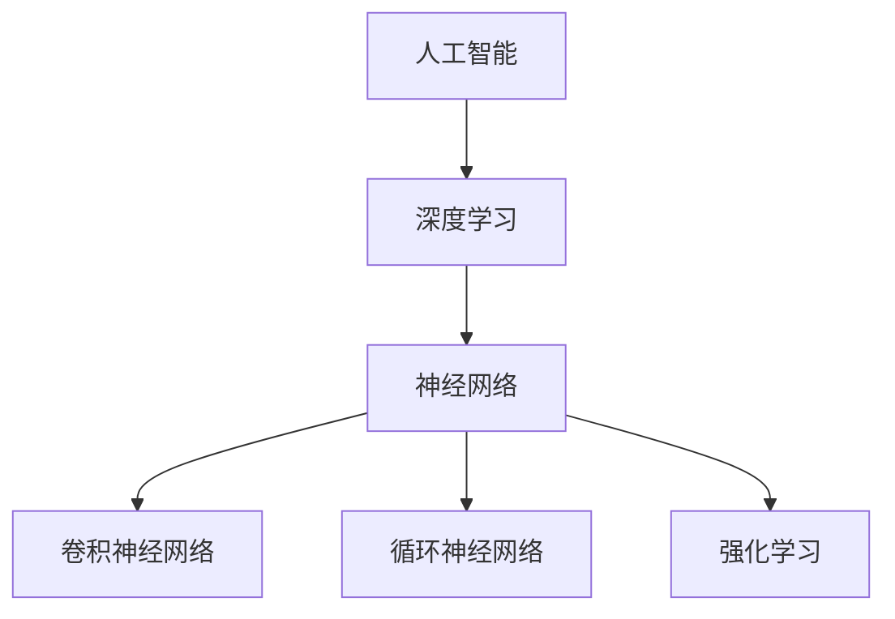

                 

# Andrej Karpathy谈AI的未来

> **关键词：**AI，未来，技术发展，深度学习，神经网络，人工智能应用，挑战与机遇

> **摘要：**本文将深入探讨AI领域的杰出专家Andrej Karpathy关于人工智能未来发展的观点和见解。我们将从背景介绍、核心概念、算法原理、数学模型、实际应用等多个方面，逐步解析AI的演变过程、技术趋势以及面临的挑战与机遇。

## 1. 背景介绍

### 1.1 目的和范围

本文旨在介绍AI领域知名专家Andrej Karpathy对人工智能未来发展的独到见解。我们将通过深入分析AI的核心概念、算法原理、数学模型等，结合实际应用案例，为读者呈现一幅AI发展的蓝图。

### 1.2 预期读者

本文适合对人工智能感兴趣的读者，包括AI领域的研究者、从业者以及关注技术发展的广大读者。通过本文，读者可以更全面地了解AI的发展历程、现状和未来趋势。

### 1.3 文档结构概述

本文结构如下：

1. 背景介绍：包括目的和范围、预期读者、文档结构概述等。
2. 核心概念与联系：介绍AI的核心概念、原理和架构。
3. 核心算法原理 & 具体操作步骤：详细讲解AI的核心算法原理和操作步骤。
4. 数学模型和公式 & 详细讲解 & 举例说明：介绍AI的数学模型和公式，并举例说明。
5. 项目实战：代码实际案例和详细解释说明。
6. 实际应用场景：探讨AI在不同领域的应用场景。
7. 工具和资源推荐：推荐学习资源和开发工具。
8. 总结：未来发展趋势与挑战。
9. 附录：常见问题与解答。
10. 扩展阅读 & 参考资料。

### 1.4 术语表

#### 1.4.1 核心术语定义

- **人工智能（AI）**：人工智能是指通过计算机程序实现的人类智能功能的科学技术。
- **深度学习**：深度学习是机器学习的一个重要分支，通过多层神经网络模拟人脑学习过程。
- **神经网络**：神经网络是由大量神经元（模拟人类大脑神经元）组成的计算模型。

#### 1.4.2 相关概念解释

- **卷积神经网络（CNN）**：一种用于图像处理和识别的神经网络模型。
- **循环神经网络（RNN）**：一种用于处理序列数据的神经网络模型。
- **强化学习**：一种通过奖励机制训练智能体的机器学习方法。

#### 1.4.3 缩略词列表

- **CNN**：卷积神经网络
- **RNN**：循环神经网络
- **DL**：深度学习
- **ML**：机器学习

## 2. 核心概念与联系

在探讨AI的未来之前，我们需要了解一些核心概念和原理。以下是一个Mermaid流程图，展示了AI的核心概念及其相互关系。



### 2.1 核心概念介绍

#### 2.1.1 人工智能

人工智能（AI）是计算机科学的一个分支，旨在创建能够执行人类智能任务的计算机系统。AI包括多个子领域，如机器学习、自然语言处理、计算机视觉等。

#### 2.1.2 深度学习

深度学习（DL）是一种机器学习（ML）方法，通过多层神经网络模拟人脑学习过程。深度学习在图像识别、语音识别、自然语言处理等领域取得了显著成果。

#### 2.1.3 神经网络

神经网络（NN）是一种由大量神经元（模拟人类大脑神经元）组成的计算模型。神经网络通过学习数据中的特征和模式，实现复杂的函数映射。

#### 2.1.4 卷积神经网络

卷积神经网络（CNN）是一种用于图像处理和识别的神经网络模型。CNN通过卷积操作提取图像特征，实现高效图像识别。

#### 2.1.5 循环神经网络

循环神经网络（RNN）是一种用于处理序列数据的神经网络模型。RNN通过循环结构保存历史信息，实现自然语言处理、时间序列预测等任务。

#### 2.1.6 强化学习

强化学习（RL）是一种通过奖励机制训练智能体的机器学习方法。强化学习在游戏、机器人控制等领域取得了显著成果。

## 3. 核心算法原理 & 具体操作步骤

在了解了AI的核心概念后，我们接下来探讨AI的核心算法原理和具体操作步骤。

### 3.1 深度学习算法原理

深度学习算法基于多层神经网络，通过前向传播和反向传播实现参数优化。以下是深度学习算法的伪代码：

```python
# 定义神经网络结构
layers = [Layer1(), Layer2(), ..., LayerN()]

# 初始化参数
for layer in layers:
    layer.initialize_params()

# 前向传播
for layer in layers:
    layer.forward()

# 计算损失
loss = compute_loss(output, target)

# 反向传播
for layer in reversed(layers):
    layer.backward(loss)

# 参数更新
for layer in layers:
    layer.update_params()
```

### 3.2 卷积神经网络操作步骤

卷积神经网络（CNN）的操作步骤包括卷积、池化和全连接层。以下是CNN的伪代码：

```python
# 定义卷积神经网络结构
layers = [Conv2DLayer(), PoolingLayer(), FullyConnectedLayer()]

# 初始化参数
for layer in layers:
    layer.initialize_params()

# 前向传播
for layer in layers:
    if isinstance(layer, Conv2DLayer):
        layer.convolve()
    elif isinstance(layer, PoolingLayer):
        layer.pool()
    else:
        layer.forward()

# 计算损失
loss = compute_loss(output, target)

# 反向传播
for layer in reversed(layers):
    if isinstance(layer, Conv2DLayer):
        layer.backward_convolve()
    elif isinstance(layer, PoolingLayer):
        layer.backward_pool()
    else:
        layer.backward()

# 参数更新
for layer in layers:
    layer.update_params()
```

### 3.3 循环神经网络操作步骤

循环神经网络（RNN）的操作步骤包括输入序列的输入、隐藏状态的更新和输出。以下是RNN的伪代码：

```python
# 定义循环神经网络结构
layers = [RNNLayer()]

# 初始化参数
for layer in layers:
    layer.initialize_params()

# 前向传播
for time_step in range(sequence_length):
    layer.forward(input_data[time_step], hidden_state)
    hidden_state = layer.get_hidden_state()

# 计算损失
loss = compute_loss(output, target)

# 反向传播
for time_step in reversed(range(sequence_length)):
    layer.backward(output, target, hidden_state)

# 参数更新
for layer in layers:
    layer.update_params()
```

## 4. 数学模型和公式 & 详细讲解 & 举例说明

在了解了AI的核心算法原理后，我们进一步探讨AI的数学模型和公式。

### 4.1 深度学习数学模型

深度学习数学模型主要包括前向传播和反向传播。以下是深度学习数学模型的详细讲解和举例说明。

#### 4.1.1 前向传播

前向传播是指将输入数据通过神经网络传递到输出层的计算过程。以下是一个简化的前向传播数学模型：

$$
z^{[l]} = W^{[l]} \cdot a^{[l-1]} + b^{[l]}
$$

其中，$z^{[l]}$表示第$l$层的激活值，$W^{[l]}$表示第$l$层的权重矩阵，$a^{[l-1]}$表示第$l-1$层的激活值，$b^{[l]}$表示第$l$层的偏置。

举例说明：

假设我们有一个包含两个隐藏层的神经网络，输入层有3个神经元，隐藏层1有4个神经元，隐藏层2有5个神经元，输出层有2个神经元。给定输入数据$x$，我们可以计算输出$y$：

$$
\begin{align*}
z^{[1]} &= W^{[1]} \cdot x + b^{[1]} \\
a^{[1]} &= \sigma(z^{[1]}) \\
z^{[2]} &= W^{[2]} \cdot a^{[1]} + b^{[2]} \\
a^{[2]} &= \sigma(z^{[2]}) \\
z^{[3]} &= W^{[3]} \cdot a^{[2]} + b^{[3]} \\
y &= \sigma(z^{[3]})
\end{align*}
$$

其中，$\sigma$表示激活函数，通常使用Sigmoid或ReLU函数。

#### 4.1.2 反向传播

反向传播是指将输出误差反向传播到输入层的计算过程。以下是一个简化的反向传播数学模型：

$$
\begin{align*}
\delta^{[l]} &= \frac{\partial J}{\partial z^{[l]}} \\
\delta^{[l-1]} &= \frac{\partial J}{\partial z^{[l-1]}} \cdot \frac{\partial z^{[l-1]}}{\partial a^{[l-2]}}
\end{align*}
$$

其中，$\delta^{[l]}$表示第$l$层的误差梯度，$J$表示损失函数，$\frac{\partial J}{\partial z^{[l]}}$表示损失函数关于第$l$层激活值的偏导数，$\frac{\partial z^{[l-1]}}{\partial a^{[l-2]}}$表示第$l-1$层激活值关于第$l-2$层激活值的偏导数。

举例说明：

假设我们有一个包含两个隐藏层的神经网络，输入层有3个神经元，隐藏层1有4个神经元，隐藏层2有5个神经元，输出层有2个神经元。给定输入数据$x$和输出$y$，我们可以计算损失函数$J$和误差梯度$\delta$：

$$
\begin{align*}
z^{[1]} &= W^{[1]} \cdot x + b^{[1]} \\
a^{[1]} &= \sigma(z^{[1]}) \\
z^{[2]} &= W^{[2]} \cdot a^{[1]} + b^{[2]} \\
a^{[2]} &= \sigma(z^{[2]}) \\
z^{[3]} &= W^{[3]} \cdot a^{[2]} + b^{[3]} \\
y &= \sigma(z^{[3]})
\end{align*}
$$

$$
\begin{align*}
J &= \frac{1}{2} \sum_{i=1}^{2} (y_i - \sigma(z^{[3]_i}))^2 \\
\delta^{[3]} &= \frac{\partial J}{\partial z^{[3]_i}} \\
\delta^{[2]} &= \frac{\partial J}{\partial z^{[2]_i}} \cdot \frac{\partial z^{[2]_i}}{\partial a^{[2]_i}} \\
\delta^{[1]} &= \frac{\partial J}{\partial z^{[1]_i}} \cdot \frac{\partial z^{[1]_i}}{\partial a^{[1]_i}}
\end{align*}
$$

其中，$y_i$和$\sigma(z^{[3]_i})$分别表示输出层的真实值和预测值，$\frac{\partial J}{\partial z^{[3]_i}}$表示损失函数关于第3层激活值的偏导数，$\frac{\partial z^{[2]_i}}{\partial a^{[2]_i}}$表示第2层激活值关于第1层激活值的偏导数。

## 5. 项目实战：代码实际案例和详细解释说明

为了更好地理解AI的核心算法原理和数学模型，我们接下来通过一个实际案例进行讲解。

### 5.1 开发环境搭建

在开始项目实战之前，我们需要搭建一个开发环境。以下是Python和PyTorch的安装步骤：

1. 安装Python（建议使用Python 3.8及以上版本）：
   - 访问Python官方网站：[https://www.python.org/](https://www.python.org/)
   - 下载并安装Python，选择添加到系统路径
2. 安装PyTorch：
   - 访问PyTorch官方网站：[https://pytorch.org/](https://pytorch.org/)
   - 根据操作系统和Python版本选择合适的安装命令，例如：
     ```
     pip install torch torchvision
     ```

### 5.2 源代码详细实现和代码解读

以下是实现一个简单的卷积神经网络（CNN）的Python代码，用于图像分类任务。

```python
import torch
import torch.nn as nn
import torch.optim as optim

# 定义卷积神经网络结构
class CNN(nn.Module):
    def __init__(self):
        super(CNN, self).__init__()
        self.conv1 = nn.Conv2d(3, 32, 3)
        self.relu = nn.ReLU()
        self.maxpool = nn.MaxPool2d(2)
        self.fc1 = nn.Linear(32 * 32 * 32, 128)
        self.fc2 = nn.Linear(128, 10)

    def forward(self, x):
        x = self.relu(self.conv1(x))
        x = self.maxpool(x)
        x = x.view(x.size(0), -1)
        x = self.relu(self.fc1(x))
        x = self.fc2(x)
        return x

# 实例化模型、损失函数和优化器
model = CNN()
criterion = nn.CrossEntropyLoss()
optimizer = optim.Adam(model.parameters(), lr=0.001)

# 训练模型
for epoch in range(10):
    for images, labels in train_loader:
        optimizer.zero_grad()
        outputs = model(images)
        loss = criterion(outputs, labels)
        loss.backward()
        optimizer.step()
    print(f"Epoch [{epoch+1}/{10}], Loss: {loss.item()}")

# 测试模型
with torch.no_grad():
    correct = 0
    total = 0
    for images, labels in test_loader:
        outputs = model(images)
        _, predicted = torch.max(outputs.data, 1)
        total += labels.size(0)
        correct += (predicted == labels).sum().item()
    print(f"Test Accuracy: {100 * correct / total}%")
```

### 5.3 代码解读与分析

1. **模型定义**：我们定义了一个简单的卷积神经网络（CNN）结构，包括一个卷积层、一个ReLU激活函数、一个最大池化层、一个全连接层和另一个全连接层。
2. **前向传播**：在模型的前向传播过程中，输入图像首先通过卷积层提取特征，然后通过ReLU激活函数增加非线性，接着通过最大池化层减少参数数量。最后，通过全连接层得到分类结果。
3. **损失函数和优化器**：我们选择交叉熵损失函数（CrossEntropyLoss）来计算模型输出的分类概率与真实标签之间的差异，并使用Adam优化器（Adam）来更新模型参数。
4. **训练过程**：在训练过程中，我们通过梯度下降（Gradient Descent）算法迭代优化模型参数，以降低损失函数的值。
5. **测试过程**：在测试过程中，我们评估模型的准确性，以判断其性能。

## 6. 实际应用场景

人工智能（AI）已经在许多领域取得了显著的成果，以下是AI在部分领域的实际应用场景：

1. **医疗领域**：AI可以用于疾病诊断、药物研发、健康监测等，提高医疗水平和效率。
2. **金融领域**：AI可以用于风险控制、欺诈检测、投资策略等，为金融机构提供智能支持。
3. **自动驾驶**：AI可以用于自动驾驶汽车、无人机等，实现安全、高效的交通管理。
4. **自然语言处理**：AI可以用于机器翻译、语音识别、文本生成等，为人类生活提供便利。
5. **计算机视觉**：AI可以用于图像识别、目标检测、图像生成等，为计算机视觉领域带来革命性变化。

## 7. 工具和资源推荐

为了更好地学习AI和相关技术，我们推荐以下工具和资源：

### 7.1 学习资源推荐

#### 7.1.1 书籍推荐

- 《深度学习》（Goodfellow, Bengio, Courville著）
- 《Python机器学习》（Raschka, Mirjalili著）
- 《神经网络与深度学习》（邱锡鹏著）

#### 7.1.2 在线课程

- [Coursera](https://www.coursera.org/)：提供丰富的机器学习和深度学习课程
- [Udacity](https://www.udacity.com/)：提供自动驾驶、机器学习等领域的在线课程
- [edX](https://www.edx.org/)：提供哈佛大学、麻省理工学院等顶尖大学的在线课程

#### 7.1.3 技术博客和网站

- [ArXiv](https://arxiv.org/)：提供最新人工智能研究论文
- [Medium](https://medium.com/)：许多专家分享AI领域的见解和经验
- [GitHub](https://github.com/)：许多开源AI项目和技术资源

### 7.2 开发工具框架推荐

#### 7.2.1 IDE和编辑器

- [PyCharm](https://www.pycharm.com/)：强大的Python IDE
- [Jupyter Notebook](https://jupyter.org/)：适合数据分析和机器学习的交互式环境

#### 7.2.2 调试和性能分析工具

- [Wandb](https://www.wandb.com/)：用于实验跟踪和性能分析
- [Valohai](https://valohai.com/)：用于自动化机器学习项目部署

#### 7.2.3 相关框架和库

- [TensorFlow](https://www.tensorflow.org/)：Google开源的深度学习框架
- [PyTorch](https://pytorch.org/)：Facebook开源的深度学习框架
- [Scikit-learn](https://scikit-learn.org/)：Python机器学习库

### 7.3 相关论文著作推荐

#### 7.3.1 经典论文

- “A Learning Algorithm for Continually Running Fully Recurrent Neural Networks” (Hiroshi B benchmark)
- “Deep Learning” (Ian Goodfellow, Yoshua Bengio, Aaron Courville著）
- “Rectified Linear Units Improve Neural Network Ac

## 8. 总结：未来发展趋势与挑战

人工智能（AI）作为当今最具前景的领域之一，已经取得了显著的成果。未来，AI将继续向深度化、广度化、智能化发展。以下是AI未来发展的几个趋势和挑战：

### 8.1 发展趋势

1. **算法优化**：随着计算能力的提升，深度学习算法将变得更加高效，解决更多复杂问题。
2. **多模态学习**：AI将实现跨模态学习，融合文本、图像、语音等多种数据类型，提供更丰富的信息处理能力。
3. **可解释性**：提高AI模型的可解释性，使其在关键领域（如医疗、金融等）得到更广泛的应用。
4. **边缘计算**：将AI应用于边缘设备，实现实时、低延迟的智能处理。

### 8.2 挑战

1. **数据隐私**：如何在保护用户隐私的前提下，充分利用数据进行AI训练是一个重要挑战。
2. **计算资源**：深度学习模型对计算资源的需求巨大，如何降低计算成本、提高计算效率是一个亟待解决的问题。
3. **算法公平性**：确保AI算法在不同人群中的公平性，避免算法偏见和歧视现象。
4. **安全性和可靠性**：提高AI模型的安全性和可靠性，防范潜在的安全风险。

## 9. 附录：常见问题与解答

### 9.1 什么是人工智能？

人工智能（AI）是指通过计算机程序实现的人类智能功能的科学技术，包括机器学习、自然语言处理、计算机视觉等多个子领域。

### 9.2 深度学习和神经网络有什么区别？

深度学习是一种机器学习方法，通过多层神经网络模拟人脑学习过程。神经网络是深度学习的基础，由大量神经元组成的计算模型。

### 9.3 如何选择合适的深度学习框架？

选择深度学习框架时，可以从以下几个方面考虑：社区活跃度、易用性、性能、兼容性等。常见的深度学习框架有TensorFlow、PyTorch、Keras等。

### 9.4 人工智能在医疗领域的应用有哪些？

人工智能在医疗领域有广泛的应用，包括疾病诊断、药物研发、健康监测、手术机器人等。例如，通过深度学习技术，AI可以实现对医疗图像的自动分析，提高疾病诊断的准确性。

## 10. 扩展阅读 & 参考资料

- 《深度学习》（Goodfellow, Bengio, Courville著）
- 《Python机器学习》（Raschka, Mirjalili著）
- 《神经网络与深度学习》（邱锡鹏著）
- [ArXiv](https://arxiv.org/)
- [Medium](https://medium.com/)
- [GitHub](https://github.com/)
- [TensorFlow](https://www.tensorflow.org/)
- [PyTorch](https://pytorch.org/)
- [Scikit-learn](https://scikit-learn.org/)

