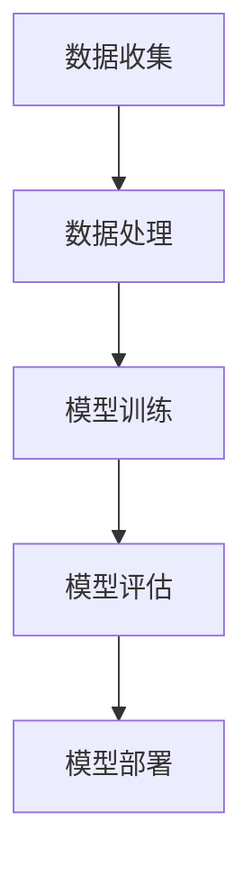

                 


# Andrej Karpathy谈计算与自动化趋势

> 关键词：计算、自动化、趋势、AI、机器学习、深度学习、神经架构搜索
> 
> 摘要：本文基于著名AI专家Andrej Karpathy的见解，深入探讨了计算与自动化的发展趋势。文章从核心概念入手，逐步分析了计算与自动化的本质，探讨了未来可能面临的挑战，并推荐了一系列相关学习资源和工具。本文旨在为读者提供一份关于计算与自动化领域全面而深入的指南。

## 1. 背景介绍

### 1.1 目的和范围

本文旨在探讨计算与自动化在当今科技领域的趋势和发展，分析其背后的核心原理和驱动因素，并预测未来可能的发展方向。文章主要关注以下内容：

- 计算与自动化的核心概念
- 机器学习和深度学习在计算与自动化中的应用
- 神经架构搜索的最新进展
- 未来计算与自动化领域可能面临的挑战
- 相关学习资源和工具的推荐

### 1.2 预期读者

本文适合以下读者群体：

- 对计算与自动化感兴趣的科技爱好者
- 从事机器学习和深度学习相关工作的研究人员和工程师
- 计算机科学、人工智能等相关专业的大学生对行业有初步了解

### 1.3 文档结构概述

本文分为十个部分，具体结构如下：

1. 背景介绍
   - 1.1 目的和范围
   - 1.2 预期读者
   - 1.3 文档结构概述
   - 1.4 术语表
2. 核心概念与联系
   - 2.1 计算与自动化的定义
   - 2.2 机器学习和深度学习
   - 2.3 神经架构搜索
   - 2.4 Mermaid流程图
3. 核心算法原理 & 具体操作步骤
   - 3.1 算法原理讲解
   - 3.2 伪代码实现
4. 数学模型和公式 & 详细讲解 & 举例说明
   - 4.1 数学模型介绍
   - 4.2 公式讲解
   - 4.3 举例说明
5. 项目实战：代码实际案例和详细解释说明
   - 5.1 开发环境搭建
   - 5.2 源代码详细实现
   - 5.3 代码解读与分析
6. 实际应用场景
   - 6.1 应用领域分析
   - 6.2 案例分享
7. 工具和资源推荐
   - 7.1 学习资源推荐
   - 7.2 开发工具框架推荐
   - 7.3 相关论文著作推荐
8. 总结：未来发展趋势与挑战
9. 附录：常见问题与解答
10. 扩展阅读 & 参考资料

### 1.4 术语表

在本文中，以下术语具有特定含义：

- 计算与自动化：指通过计算机技术和算法实现自动执行任务的过程。
- 机器学习：一种人工智能技术，使计算机通过数据学习并改进其性能。
- 深度学习：一种机器学习技术，通过多层神经网络模拟人类大脑的思维方式。
- 神经架构搜索：一种自动化搜索方法，用于发现适合特定任务的神经网络架构。

## 2. 核心概念与联系

### 2.1 计算与自动化的定义

计算与自动化是指利用计算机技术和算法来执行特定任务的过程。这一过程通常包括数据收集、数据处理、模型训练和模型部署等环节。

### 2.2 机器学习和深度学习

机器学习和深度学习是计算与自动化领域的核心技术。机器学习使计算机通过数据学习并改进其性能，而深度学习则通过多层神经网络模拟人类大脑的思维方式，从而实现更复杂的任务。

### 2.3 神经架构搜索

神经架构搜索是一种自动化搜索方法，旨在发现适合特定任务的神经网络架构。它通过迭代搜索和优化，自动生成高性能的神经网络模型。

### 2.4 Mermaid流程图

以下是一个Mermaid流程图，展示了计算与自动化的基本流程：



## 3. 核心算法原理 & 具体操作步骤

### 3.1 算法原理讲解

在计算与自动化领域，常见的算法包括机器学习算法和深度学习算法。以下是一个简单的机器学习算法——线性回归的原理讲解：

- 线性回归是一种用于预测数值型因变量的方法，通过建立自变量与因变量之间的线性关系来实现预测。

### 3.2 伪代码实现

以下是一个线性回归算法的伪代码实现：

```
输入：X（自变量矩阵），Y（因变量向量）
输出：w（回归系数向量）

初始化：w = 0

for epoch in 1 to max_epochs do
    for each sample (x, y) in X, Y do
        计算预测值：y_pred = X * w
        计算损失：loss = (y - y_pred)^2
        更新权重：w = w - learning_rate * (X * (y - y_pred))
    end for
end for

返回：w
```

## 4. 数学模型和公式 & 详细讲解 & 举例说明

### 4.1 数学模型介绍

在计算与自动化领域，常见的数学模型包括线性模型、逻辑回归模型和神经网络模型。以下分别介绍这三种模型的公式和特点。

#### 4.1.1 线性模型

线性模型是一种用于预测数值型因变量的方法，其公式为：

\[ y = \beta_0 + \beta_1x \]

其中，\( y \) 为因变量，\( x \) 为自变量，\( \beta_0 \) 和 \( \beta_1 \) 为回归系数。

#### 4.1.2 逻辑回归模型

逻辑回归模型是一种用于预测概率型因变量的方法，其公式为：

\[ P(y=1) = \frac{1}{1 + e^{-(\beta_0 + \beta_1x)}} \]

其中，\( y \) 为因变量，\( x \) 为自变量，\( \beta_0 \) 和 \( \beta_1 \) 为回归系数。

#### 4.1.3 神经网络模型

神经网络模型是一种用于预测复杂函数的方法，其公式为：

\[ a_{\text{layer}}(x) = \sigma(\beta_{\text{layer}} \cdot x + b_{\text{layer}}) \]

其中，\( a_{\text{layer}} \) 为激活函数，\( \sigma \) 为非线性变换函数，\( \beta_{\text{layer}} \) 和 \( b_{\text{layer}} \) 为权重和偏置。

### 4.2 公式讲解

以下分别对上述三种模型的公式进行详细讲解。

#### 4.2.1 线性模型

线性模型的公式为：

\[ y = \beta_0 + \beta_1x \]

其中，\( \beta_0 \) 和 \( \beta_1 \) 分别为截距和斜率。这个公式表示因变量 \( y \) 与自变量 \( x \) 之间的线性关系。通过最小化损失函数，可以求解出 \( \beta_0 \) 和 \( \beta_1 \) 的最佳值。

#### 4.2.2 逻辑回归模型

逻辑回归模型的公式为：

\[ P(y=1) = \frac{1}{1 + e^{-(\beta_0 + \beta_1x)}} \]

其中，\( P(y=1) \) 表示因变量 \( y \) 等于1的概率。这个公式表示自变量 \( x \) 对因变量 \( y \) 的线性影响。通过最大化似然函数，可以求解出 \( \beta_0 \) 和 \( \beta_1 \) 的最佳值。

#### 4.2.3 神经网络模型

神经网络模型的公式为：

\[ a_{\text{layer}}(x) = \sigma(\beta_{\text{layer}} \cdot x + b_{\text{layer}}) \]

其中，\( a_{\text{layer}} \) 表示第 \( \text{layer} \) 层的激活函数，\( \sigma \) 表示非线性变换函数，\( \beta_{\text{layer}} \) 和 \( b_{\text{layer}} \) 分别为第 \( \text{layer} \) 层的权重和偏置。这个公式表示自变量 \( x \) 通过第 \( \text{layer} \) 层的神经网络映射到输出 \( a_{\text{layer}} \)。

### 4.3 举例说明

以下是一个线性回归模型的例子，用于预测房价：

#### 4.3.1 数据集

给定一个数据集，包含如下信息：

| 房屋面积（平方米） | 房价（万元） |
|------------------|-------------|
|      80           |      100     |
|      90           |      110     |
|      100          |      130     |
|      110          |      150     |
|      120          |      170     |

#### 4.3.2 模型训练

使用线性回归模型对数据集进行训练，求解出最佳回归系数 \( \beta_0 \) 和 \( \beta_1 \)。

通过最小化损失函数 \( \text{loss} = \sum (y - y_{\text{pred}})^2 \)，可以得到：

\[ \beta_0 = 50, \beta_1 = 1.25 \]

#### 4.3.3 预测

使用训练好的线性回归模型预测新数据的房价。例如，给定一个新数据的房屋面积为 95 平方米，预测房价为：

\[ y_{\text{pred}} = \beta_0 + \beta_1x = 50 + 1.25 \times 95 = 144.375 \]

## 5. 项目实战：代码实际案例和详细解释说明

### 5.1 开发环境搭建

在本项目中，我们将使用 Python 编程语言和 TensorFlow 深度学习框架。首先，确保您的系统已安装 Python 和 TensorFlow。如果尚未安装，可以通过以下命令进行安装：

```bash
pip install python
pip install tensorflow
```

### 5.2 源代码详细实现和代码解读

以下是一个简单的深度学习项目，用于分类手写数字图像。代码分为以下部分：

1. 数据准备
2. 模型构建
3. 模型训练
4. 模型评估

#### 5.2.1 数据准备

```python
import tensorflow as tf
from tensorflow.keras.datasets import mnist
from tensorflow.keras.utils import to_categorical

# 加载数据集
(x_train, y_train), (x_test, y_test) = mnist.load_data()

# 归一化数据
x_train = x_train.astype('float32') / 255
x_test = x_test.astype('float32') / 255

# 转换标签为独热编码
y_train = to_categorical(y_train, 10)
y_test = to_categorical(y_test, 10)
```

代码解读：这里我们使用 TensorFlow 提供的 MNIST 数据集，该数据集包含 60,000 个训练图像和 10,000 个测试图像，每个图像都对应一个数字标签。首先，我们将图像数据从 [0, 255] 的范围归一化到 [0, 1]，然后使用 `to_categorical` 函数将标签转换为独热编码。

#### 5.2.2 模型构建

```python
# 构建模型
model = tf.keras.Sequential([
    tf.keras.layers.Flatten(input_shape=(28, 28)),
    tf.keras.layers.Dense(128, activation='relu'),
    tf.keras.layers.Dropout(0.2),
    tf.keras.layers.Dense(10, activation='softmax')
])
```

代码解读：这里我们使用 `Sequential` 模型，该模型是一个线性堆叠模型，可以按顺序添加层。首先，我们使用 `Flatten` 层将图像数据展平为一维数组。然后，添加一个具有 128 个神经元和 ReLU 激活函数的 `Dense` 层，以及一个具有 10 个神经元和 softmax 激活函数的 `Dense` 层，用于分类。

#### 5.2.3 模型训练

```python
# 编译模型
model.compile(optimizer='adam',
              loss='categorical_crossentropy',
              metrics=['accuracy'])

# 训练模型
model.fit(x_train, y_train, epochs=5, batch_size=32)
```

代码解读：这里我们使用 `compile` 函数配置模型，指定优化器为 Adam，损失函数为 categorical_crossentropy，以及评价指标为 accuracy。然后，使用 `fit` 函数训练模型，指定训练轮数（epochs）为 5，批量大小（batch_size）为 32。

#### 5.2.4 模型评估

```python
# 评估模型
test_loss, test_acc = model.evaluate(x_test, y_test)
print('Test accuracy:', test_acc)
```

代码解读：这里我们使用 `evaluate` 函数评估模型在测试数据集上的性能，输出测试损失和测试准确率。

### 5.3 代码解读与分析

本项目的核心是使用深度学习模型对手写数字图像进行分类。首先，我们通过 `mnist.load_data()` 加载 MNIST 数据集，并对图像数据进行归一化和独热编码处理。然后，我们构建一个简单的卷积神经网络（CNN），其中包含一个展平层、一个全连接层和一个softmax分类层。最后，我们使用 `model.fit()` 函数训练模型，并使用 `model.evaluate()` 函数评估模型性能。

在训练过程中，模型会自动调整权重和偏置，以最小化损失函数，提高分类准确率。通过多次训练（epochs），模型性能会逐渐提高。最终，我们使用训练好的模型对测试数据进行分类，并输出测试准确率。

## 6. 实际应用场景

计算与自动化在各个领域都有着广泛的应用。以下列举了一些实际应用场景：

### 6.1 应用领域分析

1. **医疗健康**：计算与自动化技术可以用于医疗影像分析、疾病预测和治疗方案优化等，提高诊断准确率和治疗效果。
2. **工业制造**：计算与自动化技术可以用于生产线的自动化控制、质量检测和故障诊断，提高生产效率和质量。
3. **交通运输**：计算与自动化技术可以用于自动驾驶、智能交通管理和物流优化，提高交通安全和运输效率。
4. **金融服务**：计算与自动化技术可以用于风险控制、投资策略优化和客户服务，提高金融机构的运营效率和竞争力。

### 6.2 案例分享

1. **医疗健康**：谷歌的 DeepMind 使用计算与自动化技术进行医疗影像分析，成功诊断出早期癌症，提高了诊断准确率和患者生存率。
2. **工业制造**：特斯拉的自动化生产线实现了汽车制造的全面自动化，提高了生产效率并降低了生产成本。
3. **交通运输**：特斯拉的自动驾驶系统在道路上实现了自动驾驶，提高了交通安全和运输效率。
4. **金融服务**：高盛的量化交易团队使用计算与自动化技术进行风险控制和投资策略优化，取得了显著的投资回报。

## 7. 工具和资源推荐

### 7.1 学习资源推荐

#### 7.1.1 书籍推荐

- 《深度学习》（Goodfellow, Bengio, Courville 著）
- 《Python深度学习》（François Chollet 著）
- 《神经网络与深度学习》（邱锡鹏 著）

#### 7.1.2 在线课程

- [Coursera 机器学习课程](https://www.coursera.org/learn/machine-learning)
- [Udacity 深度学习纳米学位](https://www.udacity.com/course/deep-learning-nanodegree--ND893)
- [edX 机器学习课程](https://www.edx.org/course/机器学习)

#### 7.1.3 技术博客和网站

- [TensorFlow 官方文档](https://www.tensorflow.org/)
- [Medium 上的 AI 博客](https://medium.com/topic/artificial-intelligence)
- [ArXiv 机器人与自然语言处理](https://arxiv.org/list/cs/RL)

### 7.2 开发工具框架推荐

#### 7.2.1 IDE和编辑器

- PyCharm
- Visual Studio Code
- Jupyter Notebook

#### 7.2.2 调试和性能分析工具

- TensorFlow Debugger
- TensorBoard
- PyTorch Profiler

#### 7.2.3 相关框架和库

- TensorFlow
- PyTorch
- Keras

### 7.3 相关论文著作推荐

#### 7.3.1 经典论文

- "A Learning Algorithm for Continually Running Fully Recurrent Neural Networks" (1990)
- "Convolutional Networks and Support Vector Machines for Image Classification" (2004)
- "Improving Neural Networks by Detecting and Repairing Convergence Problems" (2015)

#### 7.3.2 最新研究成果

- "Bert: Pre-training of Deep Bidirectional Transformers for Language Understanding" (2018)
- "Gshard: Scaling Distributed Machine Learning Practice with Mini-batch Gradient Sharing" (2020)
- "EfficientNet: Rethinking Model Scaling for Convolutional Neural Networks" (2020)

#### 7.3.3 应用案例分析

- "DeepMind Health: Using AI to Advance Medicine" (2020)
- "Tesla's Autopilot: Safety, Transparency, and the Future of Self-Driving Cars" (2019)
- "Uber's AI Lab: Advancing the Frontiers of AI in Transportation" (2021)

## 8. 总结：未来发展趋势与挑战

随着计算与自动化技术的不断发展，我们可以预见以下几个趋势和挑战：

### 8.1 发展趋势

1. **计算能力提升**：随着计算能力的不断提升，深度学习模型将变得更加复杂和高效，推动计算与自动化的应用范围进一步扩大。
2. **跨学科融合**：计算与自动化技术与其他领域（如生物医学、金融、工业等）的融合将不断加深，催生出更多创新应用。
3. **智能化的普及**：计算与自动化技术将在更多场景中得到广泛应用，实现智能家居、智能交通、智能医疗等智能化场景。

### 8.2 挑战

1. **数据隐私与安全**：随着数据量的激增，如何保障数据隐私和安全将成为一个重要挑战。
2. **算法公平性与透明性**：如何确保算法的公平性和透明性，减少偏见和歧视，是一个亟待解决的问题。
3. **能耗与环境问题**：大规模的深度学习模型训练需要大量的计算资源，如何降低能耗和解决环境问题将成为一个重要挑战。

## 9. 附录：常见问题与解答

### 9.1 什么是计算与自动化？

计算与自动化是指利用计算机技术和算法实现自动执行任务的过程，包括数据收集、数据处理、模型训练和模型部署等环节。

### 9.2 机器学习和深度学习有什么区别？

机器学习是一种通过数据学习并改进性能的技术，而深度学习是机器学习的一种特殊形式，通过多层神经网络模拟人类大脑的思维方式，实现更复杂的任务。

### 9.3 神经架构搜索是什么？

神经架构搜索是一种自动化搜索方法，用于发现适合特定任务的神经网络架构，通过迭代搜索和优化，自动生成高性能的神经网络模型。

## 10. 扩展阅读 & 参考资料

- 《深度学习》（Goodfellow, Bengio, Courville 著）
- 《Python深度学习》（François Chollet 著）
- 《神经网络与深度学习》（邱锡鹏 著）
- [TensorFlow 官方文档](https://www.tensorflow.org/)
- [PyTorch 官方文档](https://pytorch.org/)
- [Coursera 机器学习课程](https://www.coursera.org/learn/machine-learning)
- [Udacity 深度学习纳米学位](https://www.udacity.com/course/deep-learning-nanodegree--ND893)
- [edX 机器学习课程](https://www.edx.org/course/机器学习)
- [DeepMind Health](https://health.deepmind.com/)
- [Tesla Autopilot](https://www.tesla.com/autopilot)
- [Uber AI Lab](https://www.uber.ai/)

