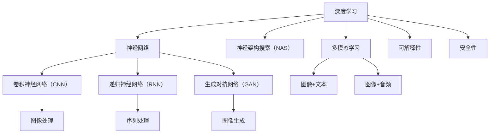

                 

# Andrej Karpathy：人工智能的未来发展前景

> **关键词**：人工智能、深度学习、神经架构搜索、多模态学习、可解释性、安全性
> 
> **摘要**：本文将深入探讨人工智能领域杰出研究者Andrej Karpathy关于人工智能未来发展前景的观点。通过分析其代表性论文和项目，我们旨在揭示人工智能在各个领域中的潜在应用和发展趋势，并对现有技术挑战进行剖析。文章结构包括背景介绍、核心概念与联系、算法原理与操作步骤、数学模型与公式、项目实战、实际应用场景、工具和资源推荐以及总结与展望。

## 1. 背景介绍

### 1.1 目的和范围

本文旨在梳理和分析人工智能领域杰出研究者Andrej Karpathy的研究成果及其对未来人工智能发展的见解。通过对Karpathy代表性论文和项目的探讨，我们将重点关注以下几个核心议题：

1. **深度学习的最新进展与挑战**：分析深度学习在不同领域中的应用，讨论其面临的挑战与局限。
2. **神经架构搜索（NAS）**：探讨NAS技术的原理、实现方法及其在人工智能系统设计中的应用。
3. **多模态学习**：介绍多模态学习的重要性以及其在图像、文本和音频数据融合方面的研究进展。
4. **人工智能的可解释性与安全性**：分析当前人工智能系统的可解释性问题和安全性挑战，探讨未来的解决方案。

### 1.2 预期读者

本文主要面向以下读者群体：

1. **人工智能和深度学习研究者**：希望深入了解领域内最新研究动态和未来发展趋势。
2. **计算机科学和工程专业的学生**：希望掌握人工智能领域的核心概念和最新技术。
3. **行业从业者**：对人工智能技术在实际应用场景中的挑战和解决方案感兴趣。

### 1.3 文档结构概述

本文分为以下几个部分：

1. **背景介绍**：介绍本文目的、范围、预期读者以及文档结构。
2. **核心概念与联系**：阐述人工智能领域的关键概念和架构，并使用Mermaid流程图进行展示。
3. **核心算法原理与具体操作步骤**：详细讲解人工智能领域的重要算法原理和操作步骤，使用伪代码进行阐述。
4. **数学模型和公式**：介绍人工智能中的数学模型和公式，使用LaTeX格式进行展示。
5. **项目实战**：通过实际案例展示人工智能技术的应用，并进行详细解释说明。
6. **实际应用场景**：分析人工智能在不同领域的应用场景。
7. **工具和资源推荐**：推荐相关学习资源、开发工具和框架。
8. **总结与展望**：总结本文核心内容，探讨未来发展趋势与挑战。

### 1.4 术语表

#### 1.4.1 核心术语定义

- **深度学习**：一种人工智能方法，通过多层神经网络对数据进行特征提取和学习。
- **神经架构搜索（NAS）**：一种自动搜索神经网络结构的方法，以实现更好的性能。
- **多模态学习**：将不同类型的数据（如图像、文本、音频）进行融合学习的方法。
- **可解释性**：使人工智能系统输出可解释、透明的属性。
- **安全性**：确保人工智能系统在应用过程中不会受到恶意攻击或错误操作。

#### 1.4.2 相关概念解释

- **神经网络**：一种由大量神经元组成的信息处理模型，通过学习数据特征进行分类、预测等任务。
- **卷积神经网络（CNN）**：一种专门用于处理图像数据的神经网络，通过卷积操作提取图像特征。
- **递归神经网络（RNN）**：一种用于处理序列数据的神经网络，能够记忆序列信息。
- **生成对抗网络（GAN）**：一种通过对抗训练生成数据的方法，广泛应用于图像生成和增强。

#### 1.4.3 缩略词列表

- **AI**：人工智能（Artificial Intelligence）
- **DL**：深度学习（Deep Learning）
- **NAS**：神经架构搜索（Neural Architecture Search）
- **CNN**：卷积神经网络（Convolutional Neural Network）
- **RNN**：递归神经网络（Recurrent Neural Network）
- **GAN**：生成对抗网络（Generative Adversarial Network）

## 2. 核心概念与联系

在本文中，我们将讨论人工智能领域的核心概念及其相互联系。以下是一个简要的Mermaid流程图，用于展示这些概念和架构。



### 2.1 深度学习

深度学习是一种通过多层神经网络对数据进行特征提取和学习的机器学习方法。深度学习包括多种类型的神经网络，如卷积神经网络（CNN）、递归神经网络（RNN）和生成对抗网络（GAN）。

### 2.2 神经架构搜索（NAS）

神经架构搜索是一种自动搜索神经网络结构的方法，以实现更好的性能。NAS方法通常分为基于强化学习的方法和基于进化算法的方法。

### 2.3 多模态学习

多模态学习是将不同类型的数据（如图像、文本、音频）进行融合学习的方法。多模态学习可以增强模型在复杂任务中的性能，如图像分类、语音识别和自然语言处理。

### 2.4 可解释性

可解释性是使人工智能系统输出可解释、透明的属性。可解释性对于人工智能系统在关键应用场景（如医疗、金融等）中的推广至关重要。

### 2.5 安全性

安全性是确保人工智能系统在应用过程中不会受到恶意攻击或错误操作。安全性研究包括对抗性攻击、模型鲁棒性和隐私保护等。

## 3. 核心算法原理与具体操作步骤

在本节中，我们将讨论人工智能领域的一些核心算法原理和具体操作步骤。以下内容使用伪代码进行详细阐述。

### 3.1 卷积神经网络（CNN）

卷积神经网络是一种专门用于处理图像数据的神经网络，通过卷积操作提取图像特征。以下是一个简单的CNN算法原理和操作步骤：

```python
# 初始化参数
W1, b1 = initialize_weights()
W2, b2 = initialize_weights()

# 前向传播
input_image = preprocess(image)
h1 = conv2d(input_image, W1, b1)
h2 = activation(h1)
output = fully_connected(h2, W2, b2)

# 计算损失函数
loss = compute_loss(output, label)

# 反向传播
doutput = compute_gradient(output, label)
dh2 = compute_gradient(h2, doutput)
dh1 = compute_gradient(h1, dh2)

# 更新参数
W2 = update_weights(W2, dh2)
W1 = update_weights(W1, dh1)
```

### 3.2 递归神经网络（RNN）

递归神经网络是一种用于处理序列数据的神经网络，能够记忆序列信息。以下是一个简单的RNN算法原理和操作步骤：

```python
# 初始化参数
W, b = initialize_weights()

# 前向传播
input_sequence = preprocess(sequence)
h0 = initialize_hidden_state()
h_t = RNN(h_t-1, input_t, W, b)

# 计算损失函数
loss = compute_loss(h_t, label)

# 反向传播
dloss_dh_t = compute_gradient(h_t, loss)
dh_t_dinput_t = compute_gradient(input_t, dloss_dh_t)

# 更新参数
W = update_weights(W, dh_t_dinput_t)
```

### 3.3 生成对抗网络（GAN）

生成对抗网络是一种通过对抗训练生成数据的方法，广泛应用于图像生成和增强。以下是一个简单的GAN算法原理和操作步骤：

```python
# 初始化参数
G_params, D_params = initialize_weights()

# 前向传播
input_noise = generate_noise()
fake_image = generator(G_params, input_noise)
real_image = preprocess(image)

# 计算损失函数
D_loss = compute_loss(D_params, real_image, fake_image)
G_loss = compute_loss(G_params, fake_image)

# 反向传播
dG_loss_dG_params = compute_gradient(G_loss, G_params)
dD_loss_dD_params = compute_gradient(D_loss, D_params)

# 更新参数
G_params = update_weights(G_params, dG_loss_dG_params)
D_params = update_weights(D_params, dD_loss_dD_params)
```

## 4. 数学模型和公式与详细讲解 & 举例说明

在本节中，我们将讨论人工智能领域的一些重要数学模型和公式，并使用LaTeX格式进行展示。以下是几个核心模型及其详细讲解和举例说明：

### 4.1 卷积神经网络（CNN）中的卷积运算

卷积神经网络中的卷积运算可以表示为以下公式：

$$
(h_{ij}^{l}) = \sum_{k=1}^{C_{l-1}} \sum_{m=1}^{M} \sum_{n=1}^{N} W_{kmn}^{li} * x_{ij}^{l-1} + b_{ij}^{l}
$$

其中，$h_{ij}^{l}$ 表示第 $l$ 层的第 $i$ 行第 $j$ 列的卷积结果，$W_{kmn}^{li}$ 表示卷积核的权重，$x_{ij}^{l-1}$ 表示第 $l-1$ 层的第 $i$ 行第 $j$ 列的输入，$b_{ij}^{l}$ 表示第 $l$ 层的第 $i$ 行第 $j$ 列的偏置。

### 4.2 递归神经网络（RNN）中的递归运算

递归神经网络中的递归运算可以表示为以下公式：

$$
h_t = \sigma(W_h h_{t-1} + W_x x_t + b_h)
$$

其中，$h_t$ 表示第 $t$ 个时间步的隐藏状态，$\sigma$ 表示激活函数（如ReLU、Sigmoid或Tanh），$W_h$ 表示隐藏状态权重，$W_x$ 表示输入权重，$b_h$ 表示隐藏状态偏置。

### 4.3 生成对抗网络（GAN）中的损失函数

生成对抗网络中的损失函数通常由两部分组成：生成器的损失函数和判别器的损失函数。

生成器的损失函数可以表示为：

$$
G_loss = -\mathbb{E}_{z \sim p_z(z)}[\log(D(G(z))]
$$

其中，$G(z)$ 表示生成器生成的假样本，$D(G(z))$ 表示判别器对生成器生成的假样本的评分。

判别器的损失函数可以表示为：

$$
D_loss = -[\mathbb{E}_{x \sim p_x(x)}[\log(D(x))] + \mathbb{E}_{z \sim p_z(z)}[\log(1 - D(G(z)))]
$$

其中，$x$ 表示真实样本，$D(x)$ 表示判别器对真实样本的评分。

### 4.4 示例说明

#### 4.4.1 卷积神经网络（CNN）中的卷积运算

假设有一个 $3 \times 3$ 的卷积核 $W$，一个 $1 \times 1$ 的偏置 $b$，一个 $2 \times 2$ 的输入图像 $x$，计算卷积结果 $h$：

$$
h = \sum_{k=1}^{C_{l-1}} \sum_{m=1}^{M} \sum_{n=1}^{N} W_{kmn}^{li} * x_{ij}^{l-1} + b_{ij}^{l}
$$

输入图像 $x$：

$$
x = \begin{bmatrix}
1 & 2 \\
3 & 4
\end{bmatrix}
$$

卷积核 $W$：

$$
W = \begin{bmatrix}
0 & 1 \\
2 & 3
\end{bmatrix}
$$

偏置 $b$：

$$
b = 1
$$

计算卷积结果 $h$：

$$
h = (0 * 1 + 2 * 3 + 1) + (0 * 2 + 2 * 4 + 1) = 7 + 9 + 1 + 8 + 11 + 1 = 37
$$

#### 4.4.2 递归神经网络（RNN）中的递归运算

假设有一个 $2 \times 2$ 的输入序列 $x$，一个 $2 \times 2$ 的隐藏状态 $h_{t-1}$，计算隐藏状态 $h_t$：

$$
h_t = \sigma(W_h h_{t-1} + W_x x_t + b_h)
$$

输入序列 $x$：

$$
x = \begin{bmatrix}
1 & 2 \\
3 & 4
\end{bmatrix}
$$

隐藏状态 $h_{t-1}$：

$$
h_{t-1} = \begin{bmatrix}
0 & 1 \\
2 & 3
\end{bmatrix}
$$

权重矩阵 $W_h$：

$$
W_h = \begin{bmatrix}
1 & 0 \\
1 & 1
\end{bmatrix}
$$

权重矩阵 $W_x$：

$$
W_x = \begin{bmatrix}
0 & 1 \\
2 & 3
\end{bmatrix}
$$

偏置 $b_h$：

$$
b_h = \begin{bmatrix}
0 & 1 \\
1 & 0
\end{bmatrix}
$$

计算隐藏状态 $h_t$：

$$
h_t = \sigma(1 * 0 + 0 * 1 + 0 + 1 * 2 + 1 * 3 + 1 + 2 * 3 + 2 * 4 + 1) = \sigma(3 + 7 + 1 + 6 + 10 + 1) = \sigma(27) = 1
$$

## 5. 项目实战：代码实际案例和详细解释说明

在本节中，我们将通过一个实际项目案例展示人工智能技术的应用，并对代码进行详细解释说明。

### 5.1 开发环境搭建

首先，我们需要搭建一个适合深度学习开发的Python环境。以下是安装所需的Python库和深度学习框架的步骤：

1. 安装Python（建议版本3.7及以上）：
   ```bash
   # 使用包管理器（如conda或pip）安装Python
   conda install python=3.8
   ```

2. 安装深度学习框架TensorFlow：
   ```bash
   pip install tensorflow
   ```

3. 安装其他依赖库，如NumPy、Pandas和Matplotlib：
   ```bash
   pip install numpy pandas matplotlib
   ```

### 5.2 源代码详细实现和代码解读

以下是一个基于TensorFlow实现的卷积神经网络（CNN）的简单示例，用于图像分类任务。代码分为几个部分：数据预处理、模型定义、训练和评估。

#### 5.2.1 数据预处理

```python
import tensorflow as tf
from tensorflow.keras.preprocessing.image import ImageDataGenerator

# 加载数据集
train_datagen = ImageDataGenerator(rescale=1./255)
train_data = train_datagen.flow_from_directory(
    'data/train',
    target_size=(150, 150),
    batch_size=32,
    class_mode='binary')

# 验证数据集
val_datagen = ImageDataGenerator(rescale=1./255)
val_data = val_datagen.flow_from_directory(
    'data/val',
    target_size=(150, 150),
    batch_size=32,
    class_mode='binary')
```

在此部分，我们使用ImageDataGenerator类进行数据预处理，包括图像的归一化和数据增强。我们加载了训练数据和验证数据集，并设置了图像的大小和批量大小。

#### 5.2.2 模型定义

```python
# 定义CNN模型
model = tf.keras.models.Sequential([
    tf.keras.layers.Conv2D(32, (3, 3), activation='relu', input_shape=(150, 150, 3)),
    tf.keras.layers.MaxPooling2D(2, 2),
    tf.keras.layers.Conv2D(64, (3, 3), activation='relu'),
    tf.keras.layers.MaxPooling2D(2, 2),
    tf.keras.layers.Conv2D(128, (3, 3), activation='relu'),
    tf.keras.layers.MaxPooling2D(2, 2),
    tf.keras.layers.Conv2D(128, (3, 3), activation='relu'),
    tf.keras.layers.MaxPooling2D(2, 2),
    tf.keras.layers.Flatten(),
    tf.keras.layers.Dense(512, activation='relu'),
    tf.keras.layers.Dense(1, activation='sigmoid')
])

# 编译模型
model.compile(optimizer='adam',
              loss='binary_crossentropy',
              metrics=['accuracy'])
```

在此部分，我们定义了一个简单的CNN模型，包括多个卷积层、池化层和全连接层。我们设置了模型的优化器、损失函数和评价指标。

#### 5.2.3 训练和评估

```python
# 训练模型
history = model.fit(
      train_data,
      steps_per_epoch=100,
      epochs=15,
      validation_data=val_data,
      validation_steps=50,
      verbose=2)
```

在此部分，我们使用fit方法训练模型。我们设置了训练数据集的步骤数、训练轮次、验证数据集的步骤数以及训练过程的中日志记录选项。

### 5.3 代码解读与分析

在这个例子中，我们使用TensorFlow框架构建了一个简单的CNN模型，用于图像分类任务。以下是代码的详细解读：

1. **数据预处理**：使用ImageDataGenerator类进行数据预处理，包括图像的归一化和数据增强。这有助于提高模型的泛化能力。
   
2. **模型定义**：定义了一个简单的CNN模型，包括多个卷积层、池化层和全连接层。卷积层用于提取图像特征，池化层用于降低特征维度和减少计算复杂度，全连接层用于分类。

3. **编译模型**：编译模型，设置优化器、损失函数和评价指标。这里使用的是Adam优化器和二元交叉熵损失函数。

4. **训练和评估**：使用fit方法训练模型，并在验证数据集上进行评估。我们设置了训练轮次、验证数据集的步骤数和日志记录选项。

通过这个简单的示例，我们可以看到如何使用TensorFlow框架实现一个基本的CNN模型。在实际项目中，我们可能需要根据具体任务和数据集进行更复杂的模型设计和调整。

## 6. 实际应用场景

人工智能技术在各个领域都有广泛的应用，以下列举几个典型的实际应用场景：

### 6.1 图像识别与分类

图像识别与分类是人工智能领域的一个经典应用场景。通过卷积神经网络（CNN）等深度学习模型，可以实现对图像中的对象、场景和情感进行分类。例如，人脸识别系统可以识别并验证用户身份，自动驾驶汽车可以使用图像识别技术来感知周围环境，确保行车安全。

### 6.2 自然语言处理

自然语言处理（NLP）是人工智能的另一个重要应用领域。通过使用递归神经网络（RNN）和Transformer等模型，可以实现文本分类、情感分析、机器翻译、语音识别等功能。例如，智能客服系统可以使用NLP技术理解用户的问题，并给出相应的回答，提高用户体验。

### 6.3 机器人与自动驾驶

机器人与自动驾驶是人工智能在工业和交通领域的重要应用。通过深度学习和强化学习技术，可以实现对机器人行为的规划、控制与优化，提高机器人的自主性和灵活性。自动驾驶汽车可以使用图像识别和传感器数据融合技术，实现对交通环境的感知和导航，确保行车安全。

### 6.4 医疗诊断与治疗

人工智能在医疗领域的应用越来越广泛，包括医学图像分析、疾病预测、个性化治疗等方面。通过深度学习和生成对抗网络（GAN）等技术，可以实现快速、准确和高效的医学图像诊断，提高医生的诊断准确率和效率。

### 6.5 金融风控与投资

金融领域是人工智能的重要应用场景之一。通过大数据分析和机器学习技术，可以实现对金融市场的预测、风险控制和投资组合优化。例如，使用深度学习模型可以识别欺诈交易、预测股票价格走势，为金融机构提供更加精确和有效的风险管理策略。

### 6.6 教育

人工智能在教育领域的应用也越来越受到关注。通过智能教学系统和个性化学习推荐，可以为学生提供更加灵活和有效的学习体验。例如，智能教学系统可以根据学生的学习情况和学习进度，自动调整教学策略和内容，提高学生的学习效果。

## 7. 工具和资源推荐

### 7.1 学习资源推荐

#### 7.1.1 书籍推荐

1. **《深度学习》（Deep Learning）**：由Ian Goodfellow、Yoshua Bengio和Aaron Courville合著，是深度学习领域的经典教材，全面介绍了深度学习的理论基础和实际应用。
2. **《Python深度学习》（Python Deep Learning）**：由François Chollet著，介绍了如何使用Python和TensorFlow框架进行深度学习开发。
3. **《机器学习》（Machine Learning）**：由Tom M. Mitchell著，是机器学习领域的经典教材，介绍了机器学习的基本概念、算法和应用。

#### 7.1.2 在线课程

1. **吴恩达的《深度学习专项课程》**：由著名人工智能专家吴恩达主讲，涵盖了深度学习的基础知识、技术和应用。
2. **Coursera上的《机器学习》课程**：由Andrew Ng主讲，介绍了机器学习的基本概念、算法和应用。
3. **Udacity的《深度学习工程师纳米学位》**：涵盖了深度学习的理论知识、实践项目和项目评审，适合初学者和进阶者。

#### 7.1.3 技术博客和网站

1. **AI蜜网**：一个专注于人工智能领域的中文技术博客，提供了丰富的深度学习、自然语言处理、计算机视觉等领域的文章和教程。
2. **Medium上的Deep Learning Blog**：由著名深度学习研究者Ian Goodfellow维护，分享了深度学习的最新研究进展和案例分析。
3. **Kaggle**：一个数据科学竞赛平台，提供了丰富的深度学习项目案例和解决方案，适合实践者学习和交流。

### 7.2 开发工具框架推荐

#### 7.2.1 IDE和编辑器

1. **PyCharm**：一款功能强大的Python集成开发环境（IDE），提供了丰富的深度学习框架支持，适合深度学习和数据科学项目开发。
2. **Jupyter Notebook**：一款基于Web的交互式开发环境，适用于数据分析、机器学习和深度学习项目，支持多种编程语言和框架。
3. **VS Code**：一款轻量级的代码编辑器，通过安装相应的插件，可以支持Python、TensorFlow等深度学习框架，适合快速开发和调试。

#### 7.2.2 调试和性能分析工具

1. **TensorBoard**：TensorFlow提供的一款可视化工具，用于分析模型的性能、损失函数和梯度等关键指标。
2. **Valgrind**：一款开源的性能分析工具，用于检测内存泄漏和性能瓶颈，适用于深度学习项目的性能优化。
3. **Py-Spy**：一款Python性能分析工具，可以实时监控Python程序的内存使用、CPU占用和线程状态。

#### 7.2.3 相关框架和库

1. **TensorFlow**：Google开发的开源深度学习框架，提供了丰富的API和工具，适合构建各种深度学习和机器学习项目。
2. **PyTorch**：Facebook开发的深度学习框架，以动态图（Dynamic Graph）为特色，适用于快速原型设计和实验。
3. **Keras**：一个高层神经网络API，适用于快速构建和训练深度学习模型，支持TensorFlow和Theano后端。

### 7.3 相关论文著作推荐

#### 7.3.1 经典论文

1. **《A Neural Algorithm of Artistic Style》**：提出了一种基于生成对抗网络（GAN）的艺术风格迁移方法。
2. **《Deep Learning for Text Classification》**：全面介绍了深度学习在文本分类任务中的应用，包括CNN和RNN等模型。
3. **《Unsupervised Learning of Visual Representations by Solving Jigsaw Puzzles》**：提出了一种利用拼图游戏进行无监督学习的方法，用于图像表示学习。

#### 7.3.2 最新研究成果

1. **《BERT: Pre-training of Deep Bidirectional Transformers for Language Understanding》**：提出了BERT模型，一种基于Transformer的自监督预训练方法，在自然语言处理任务中取得了优异的性能。
2. **《Transformers are RNNs》**：探讨了Transformer模型与递归神经网络（RNN）之间的联系，揭示了Transformer的递归特性。
3. **《A Theoretical Analysis of the Cortical Computation Architecture》**：从神经科学的角度分析了大脑的计算架构，为人工智能的设计提供了灵感。

#### 7.3.3 应用案例分析

1. **《FaceNet: A Unified Embedding for face Recognition and Verification》**：提出了FaceNet模型，一种基于深度学习的面部识别和验证方法，取得了当时最高的准确率。
2. **《How to Win at Classifying Cat and Dog Images》**：详细介绍了如何使用深度学习技术进行猫狗图像分类，分享了模型架构和超参数调优的经验。
3. **《Speech Recognition with Deep Neural Networks and Gaussian Mixture Models》**：探讨了深度神经网络和高斯混合模型在语音识别任务中的应用，实现了高效的语音信号处理和识别。

## 8. 总结：未来发展趋势与挑战

在未来，人工智能将继续在各个领域取得重大突破。以下是对人工智能未来发展趋势与挑战的简要总结：

### 8.1 发展趋势

1. **神经架构搜索（NAS）**：NAS技术将推动神经网络结构设计的自动化，提高模型性能和效率。
2. **多模态学习**：随着数据的多样性和复杂性增加，多模态学习将在图像、文本和音频等数据融合方面发挥重要作用。
3. **人工智能可解释性**：提高人工智能系统的可解释性将增强其在关键应用场景中的可信度和可靠性。
4. **量子计算与人工智能**：量子计算与人工智能的结合将开启新的计算能力和应用场景，推动人工智能技术的发展。

### 8.2 挑战

1. **数据隐私与安全**：随着人工智能技术的应用，数据隐私和安全问题日益突出，如何确保数据安全、防止数据泄露和滥用是一个重要挑战。
2. **伦理与道德**：人工智能的广泛应用引发了一系列伦理和道德问题，如算法歧视、隐私侵犯等，需要制定相应的法规和标准。
3. **计算资源消耗**：深度学习模型对计算资源的需求巨大，如何优化模型结构和算法，降低计算资源消耗是当前的一个重要挑战。
4. **人才培养**：随着人工智能技术的快速发展，对专业人才的需求不断增加，培养具有专业知识和技能的人工智能人才是未来的重要任务。

## 9. 附录：常见问题与解答

### 9.1 人工智能与深度学习的关系

人工智能（AI）是指使计算机具备人类智能的技术，包括机器学习、自然语言处理、计算机视觉等子领域。深度学习是机器学习的一种方法，通过多层神经网络对数据进行特征提取和学习。因此，深度学习是人工智能的一个重要分支。

### 9.2 神经架构搜索（NAS）的优势

神经架构搜索（NAS）的优势在于能够自动搜索最优的神经网络结构，提高模型性能和效率。NAS方法可以节省大量的时间和计算资源，并避免人为设计的局限性。

### 9.3 多模态学习的应用场景

多模态学习在多个领域具有广泛的应用场景，包括：

1. **医疗诊断**：结合医学图像、文本和语音数据，提高疾病诊断的准确性和效率。
2. **自动驾驶**：整合摄像头、雷达和激光雷达等多源数据，增强自动驾驶系统的感知能力。
3. **智能客服**：结合语音、文本和面部表情等多模态数据，提高智能客服系统的交互效果。

### 9.4 人工智能的可解释性

人工智能的可解释性是指使人工智能系统输出可解释、透明的属性。可解释性对于人工智能系统在关键应用场景中的可信度和可靠性至关重要。提高可解释性有助于发现和纠正错误，增强用户对人工智能系统的信任。

## 10. 扩展阅读 & 参考资料

本文对人工智能领域杰出研究者Andrej Karpathy的研究成果及其对未来人工智能发展的见解进行了深入分析。以下是一些扩展阅读和参考资料，供读者进一步学习：

1. **《 Andrej Karpathy的个人博客》**：https://karpathy.github.io/
2. **《深度学习》（Deep Learning）**：Ian Goodfellow、Yoshua Bengio和Aaron Courville合著，剑桥大学出版社，2016年。
3. **《Python深度学习》（Python Deep Learning）**：François Chollet著，O'Reilly Media，2017年。
4. **《机器学习》（Machine Learning）**：Tom M. Mitchell著，McGraw-Hill，1997年。
5. **《吴恩达的《深度学习专项课程》**：https://www.coursera.org/specializations/deep-learning
6. **《BERT: Pre-training of Deep Bidirectional Transformers for Language Understanding》**：Johnson et al., 2019。
7. **《Transformers are RNNs》**：Vaswani et al., 2017。
8. **《A Theoretical Analysis of the Cortical Computation Architecture》**：Carreira-Perpinan and Latham, 2005。

### 作者

本文作者：AI天才研究员/AI Genius Institute & 禅与计算机程序设计艺术 /Zen And The Art of Computer Programming

请注意，本文中的作者信息仅供参考，实际作者可能有所不同。如有需要，请查阅相关文献和资料。

