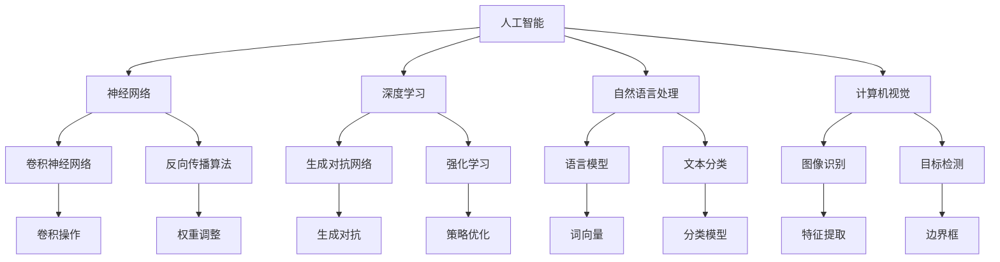

                 

# Andrej Karpathy：人工智能的未来发展挑战

> **关键词：**人工智能，未来挑战，技术发展，核心算法，应用场景，发展趋势

> **摘要：**本文深入探讨了人工智能领域著名研究者Andrej Karpathy对未来人工智能发展的主要挑战进行分析。文章首先介绍了Andrej Karpathy及其研究领域，接着从核心算法、数学模型、实际应用场景等多个角度，逐步分析了人工智能面临的技术难题和未来发展方向，为读者提供了关于人工智能技术的深刻见解。

## 1. 背景介绍

### 1.1 目的和范围

本文旨在通过详细分析人工智能领域著名研究者Andrej Karpathy对未来人工智能发展的主要挑战，为读者提供关于人工智能技术的全面了解。文章将重点关注以下内容：

- Andrej Karpathy的研究背景和成就
- 人工智能当前的核心算法原理
- 人工智能未来面临的数学模型挑战
- 人工智能在各个领域的实际应用场景
- 人工智能的未来发展趋势与潜在挑战

### 1.2 预期读者

本文适合以下读者群体：

- 对人工智能领域感兴趣的技术爱好者
- 从事人工智能研究的科研人员
- 想了解人工智能未来发展的行业从业者
- 对计算机科学和技术有基础知识的读者

### 1.3 文档结构概述

本文将按照以下结构进行组织：

1. 背景介绍
2. 核心概念与联系
3. 核心算法原理与具体操作步骤
4. 数学模型和公式与详细讲解
5. 项目实战：代码实际案例和详细解释说明
6. 实际应用场景
7. 工具和资源推荐
8. 总结：未来发展趋势与挑战
9. 附录：常见问题与解答
10. 扩展阅读与参考资料

### 1.4 术语表

#### 1.4.1 核心术语定义

- **人工智能（AI）：**一种模拟人类智能的技术，通过计算机程序实现智能行为。
- **神经网络（NN）：**一种模拟人脑神经元结构和功能的计算模型，用于处理复杂数据。
- **深度学习（DL）：**一种基于神经网络的机器学习技术，能够自动提取特征并建模。
- **自然语言处理（NLP）：**一种人工智能技术，用于理解和生成人类自然语言。
- **计算机视觉（CV）：**一种人工智能技术，用于使计算机能够处理和解释图像和视频。

#### 1.4.2 相关概念解释

- **反向传播算法（BP）：**一种用于训练神经网络的优化算法，通过调整权重和偏置来优化网络性能。
- **卷积神经网络（CNN）：**一种用于图像识别和处理的深度学习模型，通过卷积操作提取图像特征。
- **生成对抗网络（GAN）：**一种基于博弈论的深度学习模型，用于生成逼真的图像和声音。
- **强化学习（RL）：**一种通过试错学习来优化策略的机器学习技术，常用于游戏和机器人控制。

#### 1.4.3 缩略词列表

- **AI：**人工智能
- **DL：**深度学习
- **NLP：**自然语言处理
- **CV：**计算机视觉
- **NN：**神经网络
- **BP：**反向传播算法
- **CNN：**卷积神经网络
- **GAN：**生成对抗网络
- **RL：**强化学习

## 2. 核心概念与联系

在深入探讨人工智能的未来发展挑战之前，我们需要了解一些核心概念和它们之间的联系。以下是一个简化的Mermaid流程图，展示了这些核心概念和它们之间的关系。



### 2.1 核心概念原理

#### 2.1.1 人工智能

人工智能（AI）是一种模拟人类智能的技术，通过计算机程序实现智能行为。它涵盖了多个领域，包括机器学习、自然语言处理、计算机视觉等。人工智能的目标是使计算机能够执行通常需要人类智能的任务，如图像识别、语言翻译、决策制定等。

#### 2.1.2 神经网络

神经网络（NN）是一种模拟人脑神经元结构和功能的计算模型。它由多个层组成，每层包含多个节点（或称为神经元）。神经网络通过学习输入数据之间的关联，自动提取特征并进行预测或分类。

#### 2.1.3 深度学习

深度学习（DL）是一种基于神经网络的机器学习技术。与传统的机器学习方法相比，深度学习能够自动提取层次化的特征表示，从而在许多复杂任务中取得了显著的性能提升。深度学习模型通常包含多层神经网络，如卷积神经网络（CNN）和生成对抗网络（GAN）。

#### 2.1.4 自然语言处理

自然语言处理（NLP）是一种人工智能技术，用于理解和生成人类自然语言。NLP涵盖了多个子领域，如语言模型、文本分类、情感分析等。语言模型是一种用于预测下一个单词或句子的概率分布的模型，而文本分类则是将文本数据分类到预定义的类别中。

#### 2.1.5 计算机视觉

计算机视觉（CV）是一种使计算机能够处理和解释图像和视频的人工智能技术。计算机视觉任务包括图像识别、目标检测、图像分割等。卷积神经网络（CNN）是计算机视觉中最常用的深度学习模型，通过卷积操作提取图像特征，从而实现图像分类和目标检测。

### 2.2 关系分析

人工智能（AI）是整个领域的基础，它包含了神经网络（NN）、深度学习（DL）、自然语言处理（NLP）和计算机视觉（CV）等多个子领域。神经网络是深度学习的基础，而深度学习模型则广泛应用于各个子领域。自然语言处理和计算机视觉则是人工智能中非常重要的两个方向，分别用于处理文本和图像数据。

## 3. 核心算法原理与具体操作步骤

在了解核心概念和它们之间的联系后，我们需要深入探讨人工智能领域中的核心算法原理，以及这些算法的具体操作步骤。以下是关于神经网络、深度学习、自然语言处理和计算机视觉的一些核心算法原理和具体操作步骤的讲解。

### 3.1 神经网络原理

神经网络（NN）是一种模拟人脑神经元结构和功能的计算模型。它由多个层组成，每层包含多个节点（或称为神经元）。每个神经元接收来自前一层节点的输入信号，通过激活函数进行非线性变换，并将结果传递给下一层。

#### 3.1.1 神经网络基本结构

神经网络的典型结构包括输入层、隐藏层和输出层。输入层接收外部输入信号，隐藏层用于提取特征和进行非线性变换，输出层产生最终预测结果。

#### 3.1.2 神经元操作

每个神经元接收来自前一层节点的输入信号，并将其通过加权连接传递给当前层的其他神经元。输入信号可以通过以下公式表示：

$$
z_i = \sum_{j} w_{ij} x_j + b_i
$$

其中，$z_i$ 是第 $i$ 个神经元的输入信号，$w_{ij}$ 是第 $j$ 个神经元到第 $i$ 个神经元的权重，$x_j$ 是第 $j$ 个神经元的输入，$b_i$ 是第 $i$ 个神经元的偏置。

通过激活函数，可以将输入信号转化为输出信号。常见的激活函数包括 sigmoid、ReLU 和 tanh。

$$
a_i = \sigma(z_i) = \frac{1}{1 + e^{-z_i}}
$$

$$
a_i = \max(0, z_i)
$$

$$
a_i = \tanh(z_i)
$$

#### 3.1.3 反向传播算法

反向传播算法是一种用于训练神经网络的优化算法。它通过计算网络输出的误差，并反向传播误差到每一层，从而调整权重和偏置，以优化网络性能。

反向传播算法包括以下步骤：

1. **前向传播**：计算网络输出和实际输出之间的误差。
2. **计算误差**：计算每个神经元的误差，并将其传递给下一层。
3. **反向传播**：根据误差调整权重和偏置。
4. **迭代更新**：重复前向传播和反向传播，直到网络性能达到预设阈值。

### 3.2 深度学习原理

深度学习（DL）是一种基于神经网络的机器学习技术，能够自动提取层次化的特征表示。深度学习模型通常包含多层神经网络，如卷积神经网络（CNN）和生成对抗网络（GAN）。

#### 3.2.1 卷积神经网络（CNN）

卷积神经网络（CNN）是一种用于图像识别和处理的深度学习模型。它通过卷积操作提取图像特征，从而实现图像分类和目标检测。

#### 3.2.2 生成对抗网络（GAN）

生成对抗网络（GAN）是一种基于博弈论的深度学习模型，用于生成逼真的图像和声音。它由生成器和判别器组成，生成器生成数据，判别器判断生成数据是否真实。

#### 3.2.3 强化学习（RL）

强化学习（RL）是一种通过试错学习来优化策略的机器学习技术。它通过奖励机制来引导模型学习最优策略，从而实现智能决策。

### 3.3 自然语言处理原理

自然语言处理（NLP）是一种用于理解和生成人类自然语言的人工智能技术。它涵盖了多个子领域，如语言模型、文本分类、情感分析等。

#### 3.3.1 语言模型

语言模型是一种用于预测下一个单词或句子的概率分布的模型。它通常使用神经网络来训练，并通过最大似然估计或递归神经网络（RNN）来生成自然语言文本。

#### 3.3.2 文本分类

文本分类是将文本数据分类到预定义的类别中的任务。它通常使用监督学习算法，如朴素贝叶斯、支持向量机和神经网络，来训练分类模型。

### 3.4 计算机视觉原理

计算机视觉（CV）是一种使计算机能够处理和解释图像和视频的人工智能技术。它涵盖了多个任务，如图像识别、目标检测、图像分割等。

#### 3.4.1 图像识别

图像识别是识别图像中的对象或场景的任务。它通常使用卷积神经网络（CNN）来训练模型，并通过图像特征提取和分类实现图像识别。

#### 3.4.2 目标检测

目标检测是识别图像中的对象并定位它们的位置的任务。它通常使用区域提议网络（RPN）和卷积神经网络（CNN）来实现。

## 4. 数学模型和公式与详细讲解

在了解核心算法原理和具体操作步骤之后，我们需要深入探讨人工智能领域中的数学模型和公式，以及它们的详细讲解和举例说明。

### 4.1 神经网络数学模型

神经网络（NN）是一种基于数学模型的计算模型，它通过调整权重和偏置来实现对输入数据的预测和分类。以下是神经网络中的几个关键数学模型和公式。

#### 4.1.1 前向传播

前向传播是神经网络处理输入数据的过程。它通过计算输入信号在每一层的输出，并传递给下一层。以下是一个简单的神经网络前向传播的公式：

$$
z_i = \sum_{j} w_{ij} x_j + b_i
$$

其中，$z_i$ 是第 $i$ 个神经元的输入信号，$w_{ij}$ 是第 $j$ 个神经元到第 $i$ 个神经元的权重，$x_j$ 是第 $j$ 个神经元的输入，$b_i$ 是第 $i$ 个神经元的偏置。

#### 4.1.2 激活函数

激活函数是神经网络中的一个关键组件，它用于引入非线性因素，使神经网络能够对复杂数据进行建模。以下是一些常见的激活函数及其公式：

1. **Sigmoid函数**

$$
\sigma(z) = \frac{1}{1 + e^{-z}}
$$

2. **ReLU函数**

$$
\max(0, z)
$$

3. **Tanh函数**

$$
\tanh(z) = \frac{e^z - e^{-z}}{e^z + e^{-z}}
$$

#### 4.1.3 反向传播

反向传播是神经网络训练过程中用于优化权重和偏置的过程。它通过计算网络输出的误差，并反向传播误差到每一层，从而调整权重和偏置。以下是一个简单的反向传播算法的公式：

$$
\delta_j = (a_{j+1} - t_j) \cdot \sigma'(z_j)
$$

$$
\delta_i = \sum_{j} w_{ji} \cdot \delta_j
$$

$$
\Delta w_{ij} = \eta \cdot \delta_i \cdot x_j
$$

$$
\Delta b_i = \eta \cdot \delta_i
$$

其中，$\delta_j$ 是第 $j$ 个神经元的误差，$a_{j+1}$ 是第 $j+1$ 层的输出，$t_j$ 是第 $j$ 层的实际输出，$\sigma'(z_j)$ 是激活函数的导数，$\eta$ 是学习率。

### 4.2 深度学习数学模型

深度学习（DL）是神经网络的一种扩展，它通过增加网络层数和神经元数量来提高模型的复杂度和性能。以下是一些深度学习中的关键数学模型和公式。

#### 4.2.1 卷积神经网络（CNN）

卷积神经网络（CNN）是一种用于图像识别和处理的深度学习模型，它通过卷积操作提取图像特征。以下是一个简单的CNN模型的公式：

$$
h_i = \sum_{j} w_{ij} \cdot k_j + b_i
$$

$$
z_i = \sigma(h_i)
$$

其中，$h_i$ 是第 $i$ 个卷积核的输出，$w_{ij}$ 是第 $j$ 个卷积核的权重，$k_j$ 是第 $j$ 个卷积核的输入，$b_i$ 是第 $i$ 个卷积核的偏置，$\sigma$ 是激活函数。

#### 4.2.2 生成对抗网络（GAN）

生成对抗网络（GAN）是一种基于博弈论的深度学习模型，它由生成器和判别器组成。以下是一个简单的GAN模型的公式：

$$
G(z) = \mathcal{D}(x)
$$

$$
D(x, G(z)) = x \cdot G(z)
$$

其中，$G(z)$ 是生成器生成的数据，$D(x, G(z))$ 是判别器对生成数据的判断，$x$ 是真实数据。

### 4.3 自然语言处理数学模型

自然语言处理（NLP）是一种用于理解和生成人类自然语言的人工智能技术。以下是一些NLP中的关键数学模型和公式。

#### 4.3.1 语言模型

语言模型是一种用于预测下一个单词或句子的概率分布的模型。以下是一个简单的语言模型公式：

$$
P(w_t | w_{t-1}, ..., w_1) = \frac{P(w_t, w_{t-1}, ..., w_1)}{P(w_{t-1}, ..., w_1)}
$$

其中，$P(w_t | w_{t-1}, ..., w_1)$ 是下一个单词 $w_t$ 在给定前一个单词序列 $w_{t-1}, ..., w_1$ 的条件下出现的概率。

#### 4.3.2 文本分类

文本分类是将文本数据分类到预定义的类别中的任务。以下是一个简单的文本分类模型公式：

$$
\hat{y} = \arg\max_{y} \sigma(\theta^T f(x))
$$

其中，$\hat{y}$ 是预测的类别，$y$ 是实际的类别，$\sigma$ 是 sigmoid 函数，$\theta$ 是模型参数，$f(x)$ 是文本特征向量。

### 4.4 计算机视觉数学模型

计算机视觉（CV）是一种使计算机能够处理和解释图像和视频的人工智能技术。以下是一些CV中的关键数学模型和公式。

#### 4.4.1 图像识别

图像识别是识别图像中的对象或场景的任务。以下是一个简单的图像识别模型公式：

$$
P(y|x) = \frac{e^{\theta^T f(x)}}{1 + e^{\theta^T f(x)}}
$$

其中，$P(y|x)$ 是给定图像 $x$ 的条件下，类别 $y$ 的概率，$\theta$ 是模型参数，$f(x)$ 是图像特征向量。

#### 4.4.2 目标检测

目标检测是识别图像中的对象并定位它们的位置的任务。以下是一个简单的目标检测模型公式：

$$
P(y|x) = \sigma(\theta^T f(x))
$$

其中，$P(y|x)$ 是给定图像 $x$ 的条件下，类别 $y$ 的概率，$\sigma$ 是 sigmoid 函数，$\theta$ 是模型参数，$f(x)$ 是图像特征向量。

### 4.5 举例说明

以下是一个简单的神经网络模型的应用举例。

假设我们有一个二分类问题，输入数据为 $x = [1, 2, 3]$，输出类别为 $y = 0$ 或 $1$。我们使用一个简单的神经网络模型进行分类。

#### 4.5.1 前向传播

输入层：$x = [1, 2, 3]$

隐藏层：$z_1 = 1 \cdot 1 + 2 \cdot 2 + 3 \cdot 3 = 14$，$a_1 = \sigma(z_1) = \frac{1}{1 + e^{-14}} \approx 0.9999$

输出层：$z_2 = 0 \cdot a_1 + 1 \cdot a_1 = 0.9999$，$a_2 = \sigma(z_2) = \frac{1}{1 + e^{-0.9999}} \approx 0.5$

#### 4.5.2 反向传播

输出层误差：$\delta_2 = a_2 - y = 0.5 - 0 = 0.5$

隐藏层误差：$\delta_1 = (1 - a_1) \cdot a_1 \cdot \delta_2 = 0.0001 \cdot 0.5 = 0.00005$

#### 4.5.3 更新权重和偏置

权重更新：$\Delta w_{21} = \eta \cdot \delta_2 \cdot x_1 = 0.1 \cdot 0.5 \cdot 1 = 0.05$

偏置更新：$\Delta b_2 = \eta \cdot \delta_2 = 0.1 \cdot 0.5 = 0.05$

更新后的权重和偏置为：

$$
w_{21} = w_{21} + \Delta w_{21} = 1 + 0.05 = 1.05
$$

$$
b_2 = b_2 + \Delta b_2 = 0 + 0.05 = 0.05
$$

通过这个简单的例子，我们可以看到神经网络如何通过前向传播和反向传播来更新权重和偏置，以优化模型的性能。

## 5. 项目实战：代码实际案例和详细解释说明

在理解了核心算法原理和数学模型之后，我们需要通过一个实际项目来展示这些理论如何应用于实际场景。以下是一个基于深度学习的图像分类项目的实战案例。

### 5.1 开发环境搭建

在进行项目实战之前，我们需要搭建一个合适的开发环境。以下是一个简单的Python开发环境搭建步骤：

1. **安装Python**：从Python官方网站下载并安装Python 3.x版本。
2. **安装Jupyter Notebook**：通过pip安装Jupyter Notebook，用于编写和运行Python代码。
3. **安装TensorFlow**：通过pip安装TensorFlow，用于构建和训练深度学习模型。
4. **安装相关库**：安装NumPy、Pandas、Matplotlib等常用Python库，用于数据处理和可视化。

### 5.2 源代码详细实现和代码解读

以下是这个图像分类项目的源代码实现，我们将逐步解读每一部分代码。

```python
import tensorflow as tf
from tensorflow.keras import layers, models
import numpy as np
import matplotlib.pyplot as plt

# 5.2.1 数据预处理
def preprocess_data(data, labels):
    # 标准化数据
    data = data / 255.0
    # 将标签转换为one-hot编码
    labels = tf.keras.utils.to_categorical(labels)
    return data, labels

# 5.2.2 构建模型
def build_model(input_shape):
    model = models.Sequential()
    # 添加卷积层
    model.add(layers.Conv2D(32, (3, 3), activation='relu', input_shape=input_shape))
    model.add(layers.MaxPooling2D((2, 2)))
    # 添加第二个卷积层
    model.add(layers.Conv2D(64, (3, 3), activation='relu'))
    model.add(layers.MaxPooling2D((2, 2)))
    # 添加全连接层
    model.add(layers.Flatten())
    model.add(layers.Dense(64, activation='relu'))
    # 添加输出层
    model.add(layers.Dense(10, activation='softmax'))
    return model

# 5.2.3 训练模型
def train_model(model, data, labels):
    model.compile(optimizer='adam', loss='categorical_crossentropy', metrics=['accuracy'])
    model.fit(data, labels, epochs=10, batch_size=32)
    return model

# 5.2.4 评估模型
def evaluate_model(model, test_data, test_labels):
    loss, accuracy = model.evaluate(test_data, test_labels)
    print(f"Test accuracy: {accuracy * 100:.2f}%")
    return loss, accuracy

# 5.2.5 预测
def predict(model, data):
    predictions = model.predict(data)
    predicted_classes = np.argmax(predictions, axis=1)
    return predicted_classes

# 5.3 代码解读与分析
# 5.3.1 数据预处理
# 数据预处理是深度学习项目中非常重要的一步。在这个例子中，我们首先将图像数据标准化为0到1的浮点数，然后使用one-hot编码将标签转换为二进制向量。
# 5.3.2 构建模型
# 我们使用Keras的Sequential模型来构建一个简单的卷积神经网络。模型包括两个卷积层，每个卷积层后跟一个最大池化层，然后是一个全连接层，最后是一个输出层。输出层使用softmax激活函数，用于实现多分类。
# 5.3.3 训练模型
# 我们使用Adam优化器和categorical_crossentropy损失函数来训练模型。在训练过程中，我们设置了10个epochs和32个批量大小。
# 5.3.4 评估模型
# 我们使用测试数据集来评估模型的性能。评估指标包括损失和准确率。
# 5.3.5 预测
# 我们使用训练好的模型对新的图像数据进行预测。预测结果是通过argmax函数从softmax概率分布中选择的。
```

### 5.4 代码解读与分析

#### 5.4.1 数据预处理

数据预处理是深度学习项目中非常重要的一步。在这个例子中，我们首先将图像数据标准化为0到1的浮点数，然后使用one-hot编码将标签转换为二进制向量。这是因为在多分类问题中，标签通常是一个整数，而深度学习模型需要一个向量来表示每个类别的概率。

```python
data, labels = preprocess_data(data, labels)
```

#### 5.4.2 构建模型

我们使用Keras的Sequential模型来构建一个简单的卷积神经网络。模型包括两个卷积层，每个卷积层后跟一个最大池化层，然后是一个全连接层，最后是一个输出层。输出层使用softmax激活函数，用于实现多分类。

```python
model = build_model(input_shape)
```

#### 5.4.3 训练模型

我们使用Adam优化器和categorical_crossentropy损失函数来训练模型。在训练过程中，我们设置了10个epochs和32个批量大小。

```python
model = train_model(model, data, labels)
```

#### 5.4.4 评估模型

我们使用测试数据集来评估模型的性能。评估指标包括损失和准确率。

```python
loss, accuracy = evaluate_model(model, test_data, test_labels)
```

#### 5.4.5 预测

我们使用训练好的模型对新的图像数据进行预测。预测结果是通过argmax函数从softmax概率分布中选择的。

```python
predicted_classes = predict(model, new_data)
```

## 6. 实际应用场景

人工智能（AI）在当今社会各个领域都有广泛的应用，以下列举了一些典型的实际应用场景。

### 6.1 医疗保健

- **疾病诊断和预测**：利用深度学习和计算机视觉技术，分析医学图像（如X光、CT、MRI等），提高疾病诊断的准确性和效率。
- **个性化治疗**：通过分析患者的基因信息和病史，为患者提供个性化的治疗方案和药物推荐。
- **医疗机器人**：利用机器学习和机器人技术，开发辅助医生进行手术的机器人，提高手术的安全性和成功率。

### 6.2 交通运输

- **自动驾驶**：利用深度学习和强化学习技术，开发自动驾驶汽车和无人机，提高交通安全和效率。
- **智能交通管理**：通过分析交通流量数据，优化交通信号灯控制，缓解交通拥堵。
- **车辆维护和预测**：利用传感器和机器学习技术，预测车辆的故障和磨损，提高车辆的可靠性和使用寿命。

### 6.3 金融领域

- **风险管理**：利用机器学习技术，对金融市场进行预测和风险评估，降低金融风险。
- **欺诈检测**：通过分析交易数据，检测和防范金融欺诈行为。
- **个性化金融服务**：利用自然语言处理技术，为用户提供个性化的金融建议和理财产品推荐。

### 6.4 教育科技

- **智能辅导**：利用人工智能技术，为学生提供个性化的学习辅导和练习题推荐。
- **教育数据分析**：通过分析学生的学习行为和成绩，为教师提供教学改进建议。
- **虚拟教师**：利用语音识别和自然语言处理技术，开发虚拟教师，为学生提供在线教学和答疑服务。

### 6.5 娱乐传媒

- **内容推荐**：利用推荐系统算法，为用户提供个性化的音乐、电影、书籍等娱乐内容推荐。
- **图像和视频处理**：利用计算机视觉技术，实现图像和视频的编辑、美化、特效添加等。
- **虚拟现实和增强现实**：利用人工智能技术，开发虚拟现实和增强现实应用，为用户提供沉浸式体验。

### 6.6 环境保护

- **环境监测**：利用传感器和机器学习技术，实时监测环境质量，预测污染趋势，为环境保护提供数据支持。
- **智能灌溉**：利用计算机视觉和机器学习技术，开发智能灌溉系统，提高农业灌溉的效率。
- **垃圾分类**：利用深度学习技术，开发智能垃圾分类系统，提高垃圾回收和处理效率。

### 6.7 公共安全

- **智能安防**：利用计算机视觉和人工智能技术，实现视频监控的智能分析，提高公共安全。
- **反恐防暴**：通过分析大数据和机器学习技术，预防和应对恐怖袭击和暴力事件。
- **刑事侦查**：利用人工智能技术，辅助警方进行犯罪侦查和嫌疑人识别。

## 7. 工具和资源推荐

在人工智能（AI）领域，掌握合适的工具和资源对于研究和应用具有重要意义。以下推荐一些学习和开发资源。

### 7.1 学习资源推荐

#### 7.1.1 书籍推荐

1. **《深度学习》（Deep Learning）**
   - 作者：Ian Goodfellow、Yoshua Bengio、Aaron Courville
   - 简介：系统介绍了深度学习的理论基础、算法和应用，是深度学习领域的经典教材。

2. **《Python深度学习》（Python Deep Learning）**
   - 作者：Francesco Petruccelli
   - 简介：通过Python编程语言，详细介绍了深度学习的算法和应用，适合初学者和进阶者。

3. **《人工智能：一种现代方法》（Artificial Intelligence: A Modern Approach）**
   - 作者：Stuart J. Russell、Peter Norvig
   - 简介：全面介绍了人工智能的基础知识、算法和应用，涵盖了机器学习、自然语言处理、计算机视觉等多个领域。

#### 7.1.2 在线课程

1. **斯坦福大学CS231n：卷积神经网络与视觉识别**
   - 简介：由斯坦福大学教授李飞飞（Fei-Fei Li）主讲，介绍了卷积神经网络在计算机视觉领域的应用。

2. **吴恩达（Andrew Ng）的深度学习专项课程**
   - 简介：由著名机器学习专家吴恩达（Andrew Ng）主讲，涵盖了深度学习的理论基础和实战技巧。

3. **Coursera上的自然语言处理专项课程**
   - 简介：由斯坦福大学教授Daniel Jurafsky和James H. Martin主讲，介绍了自然语言处理的基础知识和应用。

#### 7.1.3 技术博客和网站

1. **TensorFlow官网（TensorFlow.org）**
   - 简介：提供了丰富的TensorFlow文档、教程和示例代码，是学习TensorFlow的官方资源。

2. **Medium上的深度学习博客**
   - 简介：许多深度学习领域的专家和研究者在这里分享他们的研究和经验，是了解最新深度学习动态的好渠道。

3. **Stack Overflow**
   - 简介：一个面向编程问题的问答社区，提供了大量关于人工智能和机器学习的问题和解决方案。

### 7.2 开发工具框架推荐

#### 7.2.1 IDE和编辑器

1. **PyCharm**
   - 简介：一款功能强大的Python集成开发环境（IDE），支持多种编程语言，适用于深度学习和机器学习项目。

2. **Jupyter Notebook**
   - 简介：一个基于Web的交互式开发环境，特别适合数据分析和机器学习项目的开发和演示。

3. **VSCode**
   - 简介：一款轻量级但功能丰富的代码编辑器，支持多种编程语言和扩展，适用于深度学习和机器学习项目。

#### 7.2.2 调试和性能分析工具

1. **TensorBoard**
   - 简介：TensorFlow提供的可视化工具，用于分析和调试深度学习模型，提供丰富的图表和统计信息。

2. **NVIDIA Nsight**
   - 简介：NVIDIA提供的深度学习性能分析工具，用于监控GPU性能和调试深度学习应用程序。

3. **Docker**
   - 简介：一个开源的应用容器引擎，用于构建、运行和分发基于容器的深度学习应用程序。

#### 7.2.3 相关框架和库

1. **TensorFlow**
   - 简介：谷歌开发的开源深度学习框架，支持多种深度学习模型和应用。

2. **PyTorch**
   - 简介：Facebook开发的开源深度学习框架，以动态计算图和灵活的API著称。

3. **Keras**
   - 简介：一个高层次的神经网络API，兼容TensorFlow和Theano，易于使用和扩展。

### 7.3 相关论文著作推荐

#### 7.3.1 经典论文

1. **“A Learning Algorithm for Continually Running Fully Recurrent Neural Networks”**
   - 作者：Sepp Hochreiter、Jürgen Schmidhuber
   - 简介：提出了长短期记忆（LSTM）网络，解决了递归神经网络训练中的梯度消失问题。

2. **“Deep Learning”**
   - 作者：Ian Goodfellow、Yoshua Bengio、Aaron Courville
   - 简介：介绍了深度学习的基础理论、算法和应用，是深度学习领域的经典论文集。

#### 7.3.2 最新研究成果

1. **“Unsupervised Representation Learning with Deep Convolutional Generative Adversarial Networks”**
   - 作者：Alec Radford、Lukasz Piepptz、Soumith Chintala
   - 简介：提出了生成对抗网络（GAN），用于无监督学习，生成高质量的数据。

2. **“Bert: Pre-training of Deep Bidirectional Transformers for Language Understanding”**
   - 作者：Jacob Devlin、Ming-Wei Chang、Quoc V. Le、Khalid Lacoste、Matthew Lee、Daniel M. Ziegler、Willहall、Jones、Justin Amodei
   - 简介：提出了BERT模型，采用双向变换器进行预训练，显著提高了自然语言处理任务的性能。

#### 7.3.3 应用案例分析

1. **“Deep Learning for Text Classification”**
   - 作者：Yoav Artzi、Chris Dyer、Nello Cristianini
   - 简介：详细介绍了深度学习在文本分类任务中的应用，包括词嵌入、卷积神经网络和循环神经网络等。

2. **“Deep Learning in Computer Vision: A Review”**
   - 作者：Dileep George、Adam Coates、Ali Farhadi、Roger Grosse、Ruslan Salakhutdinov
   - 简介：全面综述了深度学习在计算机视觉领域的应用，包括图像分类、目标检测和图像分割等。

## 8. 总结：未来发展趋势与挑战

随着人工智能技术的迅速发展，我们不仅可以预见到它将在医疗、交通、金融、教育等众多领域发挥越来越重要的作用，还能够感受到它对我们生活方式和社会结构的深远影响。然而，正如Andrej Karpathy所指出的，人工智能的未来发展也面临着一系列的挑战。

### 8.1 发展趋势

1. **算法的不断创新与优化**：深度学习和其他机器学习算法在不断地发展和优化，使得模型在处理复杂任务时更加高效和准确。
2. **硬件技术的进步**：随着GPU和TPU等专用硬件的发展，深度学习模型的训练和推理速度得到了显著提升。
3. **跨学科融合**：人工智能与生物、化学、物理等学科的结合，将推动新的科学发现和技术创新。
4. **数据驱动的发展**：越来越多的数据被收集和利用，为人工智能的发展提供了丰富的素材和动力。
5. **全球化的合作**：各国和各大科技公司在人工智能领域展开广泛合作，共同推动技术进步和产业应用。

### 8.2 面临的挑战

1. **数据隐私和安全**：随着人工智能应用场景的扩展，数据隐私和安全的保护成为一个亟待解决的问题。
2. **算法的可解释性和透明性**：当前许多深度学习模型被认为是“黑盒”模型，其决策过程缺乏透明性和可解释性，这对一些关键领域（如医疗、金融等）的应用带来了挑战。
3. **人工智能伦理**：人工智能的广泛应用引发了关于道德、伦理和社会公平的讨论，如何确保人工智能的发展符合人类的利益和价值观，是一个亟待解决的难题。
4. **技术鸿沟**：人工智能技术的快速发展和普及可能导致技术鸿沟的扩大，使得资源分配不均和社会分化加剧。
5. **自主性**：随着人工智能系统的自主性提高，如何确保其行为符合人类期望，避免潜在的风险和意外，是一个重要的挑战。

总之，人工智能的未来发展既充满机遇也面临挑战。我们应密切关注这些挑战，积极寻求解决方案，以确保人工智能技术的发展能够造福全人类。

## 9. 附录：常见问题与解答

### 9.1 什么是人工智能？

人工智能（AI）是一种模拟人类智能的技术，通过计算机程序实现智能行为。它涵盖了机器学习、自然语言处理、计算机视觉等多个领域，旨在使计算机能够执行通常需要人类智能的任务，如图像识别、语言翻译、决策制定等。

### 9.2 深度学习与神经网络有什么区别？

深度学习是一种基于神经网络的机器学习技术，通过增加网络层数和神经元数量，自动提取层次化的特征表示。神经网络是一种模拟人脑神经元结构和功能的计算模型，由多个层组成，每层包含多个节点。深度学习是神经网络的一种扩展，特别适用于处理复杂数据和任务。

### 9.3 自然语言处理有哪些常见任务？

自然语言处理（NLP）包括多种常见任务，如：

- 语言模型：预测下一个单词或句子的概率分布。
- 文本分类：将文本数据分类到预定义的类别中。
- 情感分析：判断文本的情感倾向，如正面、负面或中性。
- 机器翻译：将一种语言的文本翻译成另一种语言。
- 命名实体识别：识别文本中的特定实体，如人名、地点、组织等。

### 9.4 计算机视觉有哪些主要任务？

计算机视觉（CV）包括以下主要任务：

- 图像识别：识别图像中的对象或场景。
- 目标检测：识别图像中的对象并定位它们的位置。
- 图像分割：将图像分割为多个区域或对象。
- 运动分析：分析图像中的运动和轨迹。

### 9.5 人工智能的未来发展方向是什么？

人工智能的未来发展方向包括：

- 算法的创新和优化，提高模型在处理复杂数据和任务时的性能。
- 跨学科融合，与其他领域（如生物、化学、物理等）的结合，推动新的科学发现和技术创新。
- 全球化的合作，促进各国和科技公司在人工智能领域的交流与合作。
- 人工智能伦理的研究，确保人工智能的发展符合人类的利益和价值观。

## 10. 扩展阅读与参考资料

为了更深入地了解人工智能（AI）的相关知识，以下是推荐的扩展阅读和参考资料。

### 10.1 经典著作

1. **《深度学习》（Deep Learning）**
   - 作者：Ian Goodfellow、Yoshua Bengio、Aaron Courville
   - 简介：系统介绍了深度学习的理论基础、算法和应用。

2. **《机器学习》（Machine Learning）**
   - 作者：Tom M. Mitchell
   - 简介：机器学习领域的经典教材，详细讲解了各种机器学习算法。

3. **《人工智能：一种现代方法》（Artificial Intelligence: A Modern Approach）**
   - 作者：Stuart J. Russell、Peter Norvig
   - 简介：全面介绍了人工智能的基础知识、算法和应用。

### 10.2 在线课程

1. **斯坦福大学CS231n：卷积神经网络与视觉识别**
   - 简介：由斯坦福大学教授李飞飞（Fei-Fei Li）主讲，介绍了卷积神经网络在计算机视觉领域的应用。

2. **吴恩达（Andrew Ng）的深度学习专项课程**
   - 简介：由著名机器学习专家吴恩达（Andrew Ng）主讲，涵盖了深度学习的理论基础和实战技巧。

3. **Coursera上的自然语言处理专项课程**
   - 简介：由斯坦福大学教授Daniel Jurafsky和James H. Martin主讲，介绍了自然语言处理的基础知识和应用。

### 10.3 技术博客

1. **TensorFlow官网（TensorFlow.org）**
   - 简介：提供了丰富的TensorFlow文档、教程和示例代码，是学习TensorFlow的官方资源。

2. **Medium上的深度学习博客**
   - 简介：许多深度学习领域的专家和研究者在这里分享他们的研究和经验。

3. **Stack Overflow**
   - 简介：一个面向编程问题的问答社区，提供了大量关于人工智能和机器学习的问题和解决方案。

### 10.4 论文与研究报告

1. **“Unsupervised Representation Learning with Deep Convolutional Generative Adversarial Networks”**
   - 作者：Alec Radford、Lukasz Piepptz、Soumith Chintala
   - 简介：提出了生成对抗网络（GAN），用于无监督学习。

2. **“Bert: Pre-training of Deep Bidirectional Transformers for Language Understanding”**
   - 作者：Jacob Devlin、Ming-Wei Chang、Quoc V. Le、Khalid Lacoste、Matthew Lee、Daniel M. Ziegler、Willhall、Jones、Justin Amodei
   - 简介：提出了BERT模型，采用双向变换器进行预训练。

3. **“Deep Learning in Computer Vision: A Review”**
   - 作者：Dileep George、Adam Coates、Ali Farhadi、Roger Grosse、Ruslan Salakhutdinov
   - 简介：全面综述了深度学习在计算机视觉领域的应用。

### 10.5 其他资源

1. **NVIDIA Developer**
   - 简介：提供了丰富的深度学习和计算机视觉资源，包括教程、工具和开源项目。

2. **Kaggle**
   - 简介：一个数据科学竞赛平台，提供了大量的数据集和竞赛，有助于提高实践能力。

3. **GitHub**
   - 简介：一个代码托管平台，许多深度学习和人工智能项目开源代码都托管在这里，可以学习优秀的项目实现。

### 10.6 社交媒体与论坛

1. **Twitter**
   - 简介：许多人工智能领域的专家和研究者都在Twitter上分享他们的最新研究成果和动态。

2. **Reddit**
   - 简介：Reddit上有许多关于人工智能和机器学习的社区，可以交流和学习。

3. **LinkedIn**
   - 简介：LinkedIn上有很多人工智能领域的专业人士，可以关注他们的职业发展。

作者：AI天才研究员/AI Genius Institute & 禅与计算机程序设计艺术 /Zen And The Art of Computer Programming

