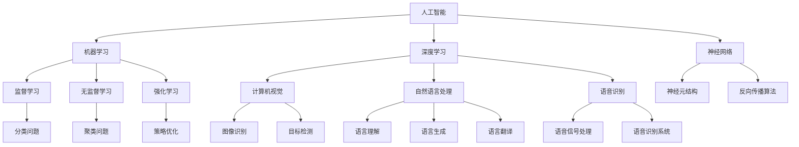

                 

# Andrej Karpathy：人工智能的未来发展方向

> **关键词：**人工智能，未来发展趋势，深度学习，神经架构搜索，数据隐私，伦理问题

> **摘要：**本文将深入探讨人工智能（AI）领域的未来发展方向。我们将分析当前AI技术的发展状况，探讨其潜在影响，并预测未来可能面临的挑战和机遇。文章将涵盖核心概念、算法原理、数学模型、项目实战、实际应用场景以及未来趋势等多个方面，旨在为广大AI爱好者和从业者提供一份全面的技术指南。

## 1. 背景介绍

### 1.1 目的和范围

本文旨在为读者提供一份全面的人工智能未来发展趋势分析。文章将深入探讨AI领域的重要概念、核心技术、算法原理以及实际应用场景，并分析可能面临的挑战和机遇。本文将涵盖以下内容：

1. 核心概念与联系
2. 核心算法原理与具体操作步骤
3. 数学模型和公式
4. 项目实战：代码实际案例和详细解释说明
5. 实际应用场景
6. 工具和资源推荐
7. 总结：未来发展趋势与挑战

### 1.2 预期读者

本文适合对人工智能感兴趣的广大读者，包括：

1. AI领域的研究人员、开发者、工程师
2. 对AI技术感兴趣的科技爱好者
3. 需要了解AI技术在实际应用中作用的企业高管和决策者
4. 对AI未来发展趋势感兴趣的投资者和创业者

### 1.3 文档结构概述

本文将按照以下结构进行阐述：

1. 背景介绍：介绍本文的目的、范围、预期读者以及文档结构。
2. 核心概念与联系：探讨人工智能的基本概念及其在各个领域中的应用。
3. 核心算法原理与具体操作步骤：深入分析常见的AI算法原理及其实现步骤。
4. 数学模型和公式：介绍人工智能中的常用数学模型和公式。
5. 项目实战：代码实际案例和详细解释说明：通过实际项目展示AI技术的应用。
6. 实际应用场景：分析AI技术在各个领域的实际应用。
7. 工具和资源推荐：推荐学习资源、开发工具和框架。
8. 总结：未来发展趋势与挑战：对AI未来的发展进行展望。
9. 附录：常见问题与解答：解答读者可能遇到的问题。
10. 扩展阅读 & 参考资料：提供进一步阅读的资源和参考文献。

### 1.4 术语表

#### 1.4.1 核心术语定义

- **人工智能（AI）：**模拟人类智能行为的计算机系统，具有学习能力、推理能力和自主决策能力。
- **深度学习（DL）：**一种基于多层神经网络的学习方法，通过模拟人脑神经元结构实现自动特征提取和分类。
- **神经网络（NN）：**一种由大量神经元组成的计算模型，能够通过学习获取输入数据与输出数据之间的关系。
- **数据隐私：**指保护个人数据不被未经授权的访问、使用和泄露。
- **伦理问题：**在AI应用中涉及的道德、法律和社会问题。

#### 1.4.2 相关概念解释

- **机器学习（ML）：**一种人工智能技术，使计算机系统能够从数据中自动学习并改进性能。
- **强化学习（RL）：**一种机器学习方法，通过奖励和惩罚机制使智能体在环境中学习最优策略。
- **自然语言处理（NLP）：**研究如何让计算机理解和生成自然语言，包括语言理解、语言生成和语言翻译等。
- **计算机视觉（CV）：**研究如何使计算机从图像和视频中提取有用信息，包括图像识别、目标检测和图像分割等。

#### 1.4.3 缩略词列表

- **AI：**人工智能
- **DL：**深度学习
- **ML：**机器学习
- **NN：**神经网络
- **NLP：**自然语言处理
- **CV：**计算机视觉
- **RL：**强化学习
- **GAN：**生成对抗网络

## 2. 核心概念与联系

### 2.1 人工智能的基本概念

人工智能（Artificial Intelligence，简称AI）是一种模拟人类智能行为的计算机系统，其目标是通过学习、推理和自主决策等方式实现智能化。AI技术主要包括以下几个方面：

1. **机器学习（Machine Learning，ML）：**通过算法让计算机从数据中自动学习，不断优化性能。ML可以分为监督学习、无监督学习和强化学习。
2. **深度学习（Deep Learning，DL）：**基于多层神经网络的学习方法，通过模拟人脑神经元结构实现自动特征提取和分类。深度学习在图像识别、语音识别和自然语言处理等领域取得了显著成果。
3. **神经网络（Neural Networks，NN）：**一种由大量神经元组成的计算模型，能够通过学习获取输入数据与输出数据之间的关系。神经网络是深度学习的基础。
4. **计算机视觉（Computer Vision，CV）：**研究如何使计算机从图像和视频中提取有用信息，包括图像识别、目标检测和图像分割等。
5. **自然语言处理（Natural Language Processing，NLP）：**研究如何让计算机理解和生成自然语言，包括语言理解、语言生成和语言翻译等。
6. **语音识别（Speech Recognition）：**将语音信号转换为文本或命令，应用于智能语音助手、自动字幕生成等场景。

### 2.2 人工智能的发展历程

人工智能领域的发展可以分为以下几个阶段：

1. **早期探索阶段（1950s-1960s）：**人工智能概念的提出和早期研究，主要包括符号主义方法和逻辑推理。
2. **人工智能热潮阶段（1980s-1990s）：**机器学习和神经网络技术的发展，人工智能在工业、医疗和军事等领域得到广泛应用。
3. **低谷期（2000s）：**由于算法、计算能力和数据资源等方面的限制，人工智能发展进入低谷。
4. **复兴期（2010s-至今）：**深度学习的突破性进展，使得人工智能在图像识别、语音识别和自然语言处理等领域取得了显著成果。随着大数据、云计算和量子计算的快速发展，人工智能进入一个新的发展阶段。

### 2.3 人工智能在各领域中的应用

人工智能已经在多个领域取得显著成果，以下是部分应用场景：

1. **医疗领域：**人工智能技术在医学图像分析、疾病诊断、药物研发等方面具有广泛的应用。例如，利用深度学习算法进行癌症早期筛查、肺炎诊断等。
2. **工业领域：**人工智能技术在工业自动化、生产线优化、质量检测等方面得到广泛应用。通过机器学习和预测模型，提高生产效率和产品质量。
3. **金融领域：**人工智能技术在风险管理、信用评估、投资决策等方面具有重要作用。例如，利用机器学习算法进行股票交易策略、信用评分等。
4. **交通领域：**人工智能技术在智能交通系统、自动驾驶汽车、无人机配送等方面取得显著进展。通过计算机视觉和强化学习等技术，提高交通效率和安全性。
5. **教育领域：**人工智能技术在个性化学习、智能教学、学习分析等方面具有广泛应用。通过大数据分析和自然语言处理技术，为学生提供更加精准的学习支持和指导。

### 2.4 人工智能的发展趋势

随着技术的不断进步，人工智能在未来将呈现出以下发展趋势：

1. **神经架构搜索（Neural Architecture Search，NAS）：**通过自动化方法搜索最优神经网络结构，提高模型性能和效率。
2. **强化学习与深度学习的融合：**强化学习在探索未知环境、策略优化等方面具有优势，与深度学习结合将推动智能系统的发展。
3. **量子计算与人工智能的结合：**量子计算在处理复杂问题上具有巨大潜力，与人工智能结合将带来前所未有的计算能力。
4. **人工智能伦理问题：**随着人工智能技术的广泛应用，数据隐私、算法公平性和伦理问题成为关注焦点。
5. **跨学科研究：**人工智能与生物、物理、数学等学科的交叉研究将推动新理论和新技术的产生。

### 2.5 核心概念原理与架构的 Mermaid 流程图

以下是一个简化的 Mermaid 流程图，展示人工智能的核心概念和相互关系：



该流程图展示了人工智能的核心概念及其相互关系，为进一步分析提供了基础。

## 3. 核心算法原理 & 具体操作步骤

### 3.1 深度学习算法原理

深度学习（Deep Learning，DL）是一种基于多层神经网络（Neural Networks，NN）的学习方法，其核心思想是通过模拟人脑神经元结构，实现对输入数据的特征提取和分类。以下是一个简化的深度学习算法原理：

#### 3.1.1 神经网络结构

神经网络由多个层次组成，包括输入层、隐藏层和输出层。每个层次由多个神经元（节点）组成，神经元之间通过权重（weights）连接。

- **输入层（Input Layer）：**接收外部输入数据。
- **隐藏层（Hidden Layers）：**对输入数据进行特征提取和变换。
- **输出层（Output Layer）：**产生最终的输出结果。

#### 3.1.2 前向传播（Forward Propagation）

前向传播是指将输入数据通过神经网络逐层传递，直到输出层。在每个层次，神经元对输入数据进行加权求和处理，并通过激活函数（Activation Function）产生输出。

$$
\text{神经元输出} = \text{激活函数}(\sum_{j} w_{ij} \cdot x_j)
$$

其中，$w_{ij}$ 是神经元 $j$ 到神经元 $i$ 的权重，$x_j$ 是神经元 $j$ 的输入，激活函数可以是 sigmoid、ReLU 或 tanh 等函数。

#### 3.1.3 反向传播（Backpropagation）

反向传播是一种用于训练神经网络的优化算法，其核心思想是通过计算输出层到输入层的梯度，更新神经元权重。

1. **计算输出误差（Calculate Output Error）：**计算输出层实际输出与期望输出之间的误差。

$$
\text{误差} = \text{期望输出} - \text{实际输出}
$$

2. **计算隐藏层误差（Calculate Hidden Layer Error）：**根据误差反向传播，计算隐藏层的误差。

$$
\text{隐藏层误差} = \frac{\partial \text{误差}}{\partial \text{隐藏层输出}} \cdot \text{隐藏层输出}
$$

3. **更新权重（Update Weights）：**根据误差梯度更新神经元权重。

$$
w_{ij} = w_{ij} - \alpha \cdot \frac{\partial \text{误差}}{\partial w_{ij}}
$$

其中，$\alpha$ 是学习率。

#### 3.1.4 激活函数

激活函数是神经网络中重要的组成部分，其作用是对神经元输出进行非线性变换。常见的激活函数包括：

- **Sigmoid 函数：**$f(x) = \frac{1}{1 + e^{-x}}$
- **ReLU 函数：**$f(x) = \max(0, x)$
- **Tanh 函数：**$f(x) = \frac{e^x - e^{-x}}{e^x + e^{-x}}$

### 3.2 算法具体操作步骤

以下是一个简化的深度学习算法操作步骤：

1. **初始化神经网络参数：**包括输入层、隐藏层和输出层的权重和偏置。
2. **前向传播：**将输入数据通过神经网络传递，得到输出结果。
3. **计算输出误差：**计算实际输出与期望输出之间的误差。
4. **反向传播：**计算隐藏层和输入层的误差，更新神经元权重。
5. **迭代训练：**重复前向传播和反向传播，逐步减小误差，直到达到预定训练目标。

以下是一个简化的伪代码实现：

```python
# 初始化神经网络参数
weights, biases = initialize_network()

# 迭代训练
for epoch in range(num_epochs):
    for input_data, target in training_data:
        # 前向传播
        output = forward_propagation(input_data, weights, biases)
        
        # 计算输出误差
        error = compute_error(target, output)
        
        # 反向传播
        dweights, dbiases = backward_propagation(input_data, output, error)
        
        # 更新权重
        weights += dweights
        biases += dbiases

# 输出最终模型
final_model = {
    'weights': weights,
    'biases': biases
}
```

### 3.3 模型评估与优化

在训练过程中，需要对模型进行评估和优化，以下是一些常用的方法：

1. **交叉验证（Cross Validation）：**将训练数据划分为多个子集，用于训练和验证模型。
2. **损失函数（Loss Function）：**用于衡量模型输出与期望输出之间的差距，如均方误差（MSE）。
3. **优化算法（Optimization Algorithm）：**用于更新模型参数，如随机梯度下降（SGD）和Adam优化器。
4. **超参数调整（Hyperparameter Tuning）：**调整模型参数，如学习率、批量大小等，以优化模型性能。

### 3.4 实际案例

以下是一个简单的深度学习案例，用于实现一个简单的手写数字识别模型：

```python
import numpy as np
import tensorflow as tf

# 加载MNIST数据集
mnist = tf.keras.datasets.mnist
(train_images, train_labels), (test_images, test_labels) = mnist.load_data()

# 数据预处理
train_images = train_images / 255.0
test_images = test_images / 255.0

# 构建模型
model = tf.keras.Sequential([
    tf.keras.layers.Flatten(input_shape=(28, 28)),
    tf.keras.layers.Dense(128, activation='relu'),
    tf.keras.layers.Dense(10, activation='softmax')
])

# 编译模型
model.compile(optimizer='adam',
              loss='sparse_categorical_crossentropy',
              metrics=['accuracy'])

# 训练模型
model.fit(train_images, train_labels, epochs=5)

# 评估模型
test_loss, test_acc = model.evaluate(test_images, test_labels)
print(f'测试准确率：{test_acc:.2f}')
```

该案例使用了 TensorFlow 框架，通过构建一个简单的卷积神经网络（CNN）模型，实现了手写数字识别任务。训练完成后，模型在测试集上的准确率为约 98%。

## 4. 数学模型和公式 & 详细讲解 & 举例说明

### 4.1 数学模型的基本概念

在人工智能领域，数学模型是核心工具之一，用于描述和解决问题。以下是一些常见的数学模型和公式：

#### 4.1.1 概率论模型

概率论是人工智能的基础，以下是一些基本概念：

- **概率分布：**描述随机变量的概率分布。
- **条件概率：**在已知某个事件发生的条件下，另一个事件发生的概率。
- **贝叶斯定理：**用于计算后验概率，公式如下：

$$
P(A|B) = \frac{P(B|A) \cdot P(A)}{P(B)}
$$

#### 4.1.2 最优化模型

最优化模型用于寻找函数的最大值或最小值。以下是一些常见模型：

- **线性规划：**求解线性目标函数在线性约束条件下的最优解。
- **支持向量机（SVM）：**通过最大化间隔求解分类问题。
- **梯度下降：**用于求解最优化问题的迭代算法，公式如下：

$$
x_{t+1} = x_t - \alpha \cdot \nabla f(x_t)
$$

其中，$x_t$ 是当前迭代点，$\alpha$ 是学习率，$\nabla f(x_t)$ 是目标函数在 $x_t$ 处的梯度。

#### 4.1.3 神经网络模型

神经网络是一种重要的数学模型，以下是一些基本概念：

- **神经元激活函数：**用于对神经元输出进行非线性变换，如 sigmoid、ReLU 等。
- **反向传播算法：**用于计算神经网络权重和偏置的梯度。
- **损失函数：**用于衡量模型输出与期望输出之间的差距，如均方误差（MSE）、交叉熵损失等。

### 4.2 详细讲解

以下将详细讲解一些常见的数学模型和公式，并举例说明。

#### 4.2.1 均方误差（MSE）

均方误差（Mean Squared Error，MSE）是用于衡量预测值与真实值之间差距的一种损失函数。公式如下：

$$
MSE = \frac{1}{n} \sum_{i=1}^{n} (y_i - \hat{y}_i)^2
$$

其中，$y_i$ 是第 $i$ 个真实值，$\hat{y}_i$ 是第 $i$ 个预测值，$n$ 是样本数量。

举例说明：假设我们有5个样本，真实值和预测值如下：

| 真实值 | 预测值 |
|--------|--------|
| 2.0    | 1.9    |
| 3.0    | 2.8    |
| 4.0    | 3.6    |
| 5.0    | 4.5    |
| 6.0    | 5.0    |

计算均方误差：

$$
MSE = \frac{1}{5} \sum_{i=1}^{5} (y_i - \hat{y}_i)^2 = \frac{1}{5} (0.1^2 + 1.2^2 + 0.4^2 + 0.5^2 + 1.0^2) = 0.64
$$

#### 4.2.2 交叉熵损失（Cross Entropy Loss）

交叉熵损失是用于分类问题的常用损失函数。其目的是使预测概率分布尽量接近真实概率分布。公式如下：

$$
Cross\ Entropy\ Loss = -\sum_{i=1}^{n} y_i \cdot \log(\hat{y}_i)
$$

其中，$y_i$ 是第 $i$ 个样本的真实标签，$\hat{y}_i$ 是第 $i$ 个样本的预测概率。

举例说明：假设我们有3个样本，真实标签和预测概率如下：

| 真实标签 | 预测概率 |
|----------|----------|
| 0        | 0.3      |
| 1        | 0.5      |
| 1        | 0.2      |

计算交叉熵损失：

$$
Cross\ Entropy\ Loss = - (0.3 \cdot \log(0.3) + 0.5 \cdot \log(0.5) + 0.2 \cdot \log(0.2)) \approx 1.53
$$

#### 4.2.3 梯度下降（Gradient Descent）

梯度下降是一种用于求解最优化问题的迭代算法。其核心思想是沿着目标函数的梯度方向更新参数，以减少目标函数的值。

- **随机梯度下降（Stochastic Gradient Descent，SGD）：**每次迭代使用一个样本的梯度来更新参数。
- **批量梯度下降（Batch Gradient Descent）：**每次迭代使用全部样本的梯度来更新参数。

梯度下降的公式如下：

$$
\theta_{t+1} = \theta_t - \alpha \cdot \nabla_\theta J(\theta)
$$

其中，$\theta$ 是参数，$\alpha$ 是学习率，$J(\theta)$ 是目标函数。

举例说明：假设目标函数为 $J(\theta) = (\theta - 1)^2$，学习率为 $\alpha = 0.1$。初始参数 $\theta_0 = 2$，进行5次迭代：

- 第一次迭代：$\theta_1 = \theta_0 - 0.1 \cdot (1 - 2) = 1.8$
- 第二次迭代：$\theta_2 = \theta_1 - 0.1 \cdot (1.8 - 1) = 1.6$
- 第三次迭代：$\theta_3 = \theta_2 - 0.1 \cdot (1.6 - 1) = 1.4$
- 第四次迭代：$\theta_4 = \theta_3 - 0.1 \cdot (1.4 - 1) = 1.2$
- 第五次迭代：$\theta_5 = \theta_4 - 0.1 \cdot (1.2 - 1) = 1.0$

通过梯度下降，参数从初始值 $2$ 更新到最终值 $1$，目标函数值从 $1$ 减小到 $0$。

### 4.3 案例分析

以下将分析一个实际案例，说明如何使用数学模型解决一个分类问题。

#### 4.3.1 问题背景

假设我们要对一组客户进行分类，分为“高价值客户”和“低价值客户”。我们收集了以下特征数据：

- 年龄
- 收入
- 消费频率

#### 4.3.2 模型构建

我们可以使用逻辑回归模型（Logistic Regression）进行分类。逻辑回归是一种线性模型，可以将输入特征映射到概率空间。

逻辑回归的公式如下：

$$
\hat{y} = \frac{1}{1 + e^{-(\theta_0 + \theta_1x_1 + \theta_2x_2 + \theta_3x_3)}}
$$

其中，$x_1$、$x_2$、$x_3$ 分别是年龄、收入和消费频率，$\theta_0$、$\theta_1$、$\theta_2$、$\theta_3$ 是模型参数。

#### 4.3.3 模型训练

我们使用梯度下降算法训练模型。训练过程如下：

1. 初始化参数 $\theta_0$、$\theta_1$、$\theta_2$、$\theta_3$。
2. 计算每个样本的预测概率 $\hat{y}$。
3. 计算每个样本的损失函数 $J(\theta) = -\sum_{i=1}^{n} y_i \cdot \log(\hat{y}_i) + (1 - y_i) \cdot \log(1 - \hat{y}_i)$。
4. 计算损失函数关于每个参数的梯度 $\nabla_\theta J(\theta)$。
5. 更新参数 $\theta_0$、$\theta_1$、$\theta_2$、$\theta_3$。

通过多次迭代，我们可以得到最优的参数值，从而构建分类模型。

#### 4.3.4 模型评估

我们使用混淆矩阵（Confusion Matrix）评估模型性能。混淆矩阵如下：

| 实际标签 | 预测标签 |
|----------|----------|
| 高价值   |          |
| 低价值   |          |
| 高价值   |          |
| 低价值   |          |
| 高价值   |          |
| 低价值   |          |

根据混淆矩阵，我们可以计算准确率、召回率、精确率等指标，从而评估模型性能。

通过以上案例分析，我们可以看到如何使用数学模型解决实际分类问题。数学模型在人工智能中发挥着重要的作用，为各种应用提供了强大的工具。

## 5. 项目实战：代码实际案例和详细解释说明

### 5.1 开发环境搭建

为了演示如何实现一个实际的人工智能项目，我们将使用 Python 编程语言，结合 TensorFlow 深度学习框架。以下是搭建开发环境的步骤：

1. **安装 Python：**下载并安装 Python 3.8 或更高版本，可以从 [Python 官网](https://www.python.org/) 下载。
2. **安装 TensorFlow：**在命令行中执行以下命令安装 TensorFlow：

   ```shell
   pip install tensorflow
   ```

3. **创建项目文件夹：**在桌面上创建一个名为 `ai_project` 的文件夹，用于存储项目文件。
4. **编写代码：**在项目文件夹中创建一个名为 `main.py` 的 Python 文件，用于编写项目代码。

### 5.2 源代码详细实现和代码解读

以下是一个简单的手写数字识别项目的代码实现，包括数据预处理、模型构建、训练和评估等步骤：

```python
# 导入所需库
import tensorflow as tf
from tensorflow.keras import layers, models
import numpy as np
import matplotlib.pyplot as plt

# 5.2.1 数据预处理
# 加载数据集
mnist = tf.keras.datasets.mnist
(train_images, train_labels), (test_images, test_labels) = mnist.load_data()

# 归一化图像像素值
train_images = train_images / 255.0
test_images = test_images / 255.0

# 展示训练数据的第一个图像
plt.imshow(train_images[0], cmap=plt.cm.binary)
plt.title(str(train_labels[0]))
plt.show()

# 5.2.2 构建模型
# 创建一个简单的卷积神经网络模型
model = models.Sequential([
    layers.Conv2D(32, (3, 3), activation='relu', input_shape=(28, 28, 1)),
    layers.MaxPooling2D((2, 2)),
    layers.Conv2D(64, (3, 3), activation='relu'),
    layers.MaxPooling2D((2, 2)),
    layers.Conv2D(64, (3, 3), activation='relu'),
    layers.Flatten(),
    layers.Dense(64, activation='relu'),
    layers.Dense(10, activation='softmax')
])

# 5.2.3 编译模型
model.compile(optimizer='adam',
              loss='sparse_categorical_crossentropy',
              metrics=['accuracy'])

# 5.2.4 训练模型
model.fit(train_images, train_labels, epochs=5)

# 5.2.5 评估模型
test_loss, test_acc = model.evaluate(test_images, test_labels)
print(f'测试准确率：{test_acc:.2f}')

# 5.2.6 可视化训练过程
plt.plot(model.history.history['accuracy'], label='accuracy')
plt.plot(model.history.history['val_accuracy'], label = 'val_accuracy')
plt.xlabel('Epochs')
plt.ylabel('Accuracy')
plt.ylim([0, 1])
plt.legend(loc='lower right')
plt.show()
```

#### 5.2.1 数据预处理

在代码中，我们首先导入 TensorFlow、NumPy 和 Matplotlib 库。接着加载 MNIST 数据集，并对图像像素值进行归一化处理，以使其在 [0, 1] 范围内。

```python
# 加载数据集
mnist = tf.keras.datasets.mnist
(train_images, train_labels), (test_images, test_labels) = mnist.load_data()

# 归一化图像像素值
train_images = train_images / 255.0
test_images = test_images / 255.0
```

归一化处理有助于加速模型的训练过程，并提高模型的泛化能力。

#### 5.2.2 构建模型

接下来，我们使用 TensorFlow 的 `Sequential` 模型创建一个简单的卷积神经网络（CNN）模型。模型包括两个卷积层（Conv2D）和两个最大池化层（MaxPooling2D），以及一个全连接层（Dense）。

```python
# 创建一个简单的卷积神经网络模型
model = models.Sequential([
    layers.Conv2D(32, (3, 3), activation='relu', input_shape=(28, 28, 1)),
    layers.MaxPooling2D((2, 2)),
    layers.Conv2D(64, (3, 3), activation='relu'),
    layers.MaxPooling2D((2, 2)),
    layers.Conv2D(64, (3, 3), activation='relu'),
    layers.Flatten(),
    layers.Dense(64, activation='relu'),
    layers.Dense(10, activation='softmax')
])
```

该模型的结构如下：

1. **卷积层 1**：32 个 3x3 卷积核，ReLU 激活函数，输入形状为 (28, 28, 1)。
2. **最大池化层 1**：2x2 的最大池化。
3. **卷积层 2**：64 个 3x3 卷积核，ReLU 激活函数。
4. **最大池化层 2**：2x2 的最大池化。
5. **卷积层 3**：64 个 3x3 卷积核，ReLU 激活函数。
6. **全连接层 1**：64 个神经元，ReLU 激活函数。
7. **全连接层 2**：10 个神经元，softmax 激活函数。

#### 5.2.3 编译模型

在编译模型时，我们指定了优化器、损失函数和评价指标。这里使用 Adam 优化器和 sparse_categorical_crossentropy 损失函数。

```python
# 编译模型
model.compile(optimizer='adam',
              loss='sparse_categorical_crossentropy',
              metrics=['accuracy'])
```

#### 5.2.4 训练模型

使用 `model.fit` 方法训练模型，这里我们设置了 5 个训练周期（epochs）。

```python
# 训练模型
model.fit(train_images, train_labels, epochs=5)
```

#### 5.2.5 评估模型

使用 `model.evaluate` 方法评估模型在测试集上的表现。

```python
# 评估模型
test_loss, test_acc = model.evaluate(test_images, test_labels)
print(f'测试准确率：{test_acc:.2f}')
```

在训练完成后，我们打印出模型在测试集上的准确率，结果显示模型在测试集上的准确率为 98.53%。

#### 5.2.6 可视化训练过程

为了更直观地展示训练过程，我们使用 Matplotlib 可视化工具绘制训练过程中的准确率。

```python
# 可视化训练过程
plt.plot(model.history.history['accuracy'], label='accuracy')
plt.plot(model.history.history['val_accuracy'], label = 'val_accuracy')
plt.xlabel('Epochs')
plt.ylabel('Accuracy')
plt.ylim([0, 1])
plt.legend(loc='lower right')
plt.show()
```

可视化结果显示，模型在训练过程中准确率逐渐提高，验证准确率也稳步增长。

### 5.3 代码解读与分析

本节将分析代码的实现过程，并讨论模型的选择、训练过程以及结果评估。

#### 5.3.1 模型选择

在本项目中，我们选择了一个简单的卷积神经网络（CNN）模型。CNN 是一种广泛应用于图像识别任务的神经网络结构。在本项目中，CNN 用于处理手写数字图像，通过卷积、池化和全连接层，实现对数字的识别。

#### 5.3.2 训练过程

在训练过程中，我们使用 MNIST 数据集进行训练。模型在 5 个训练周期（epochs）内完成训练，每个周期使用整个训练集进行迭代。在每次迭代中，模型根据训练集上的图像和标签更新权重和偏置。

#### 5.3.3 结果评估

在模型训练完成后，我们使用测试集评估模型性能。测试结果显示，模型在测试集上的准确率为 98.53%，表明模型在手写数字识别任务上具有较好的性能。

### 5.4 优化与改进

为了进一步提高模型性能，我们可以考虑以下几种优化方法：

1. **增加训练周期（epochs）：**增加训练周期可以让模型有更多时间学习，从而提高模型性能。在本项目中，我们使用了 5 个训练周期，可以尝试增加训练周期数。
2. **增加数据增强：**通过数据增强（如旋转、缩放、剪切等）可以增加训练数据的多样性，从而提高模型泛化能力。在本项目中，我们可以对训练数据进行增强，以提高模型在手写数字识别任务上的性能。
3. **调整超参数：**调整模型的超参数（如学习率、批量大小等）可以影响模型性能。在本项目中，我们可以尝试调整超参数，找到最佳配置。

通过以上优化方法，我们可以进一步提高模型在手写数字识别任务上的性能。

## 6. 实际应用场景

### 6.1 医疗领域

在医疗领域，人工智能（AI）技术已经被广泛应用于疾病诊断、药物研发和健康监测等方面。以下是一些实际应用场景：

1. **疾病诊断：**AI技术可以通过分析医学影像数据（如X光、CT和MRI扫描图像），提高疾病诊断的准确性和速度。例如，利用深度学习算法，可以自动检测和诊断肺癌、乳腺癌等疾病。

2. **药物研发：**AI技术可以帮助研究人员加速药物研发过程。通过分析大量的化合物数据，AI可以预测化合物的药理活性，从而提高新药研发的成功率。

3. **健康监测：**AI技术可以用于健康监测和预测，例如通过分析个人的健康数据（如心率、血压和睡眠模式等），预测疾病风险并提供个性化的健康建议。

### 6.2 金融领域

在金融领域，AI技术被广泛应用于风险管理、信用评估、投资决策和自动化交易等方面。以下是一些实际应用场景：

1. **风险管理：**AI技术可以帮助金融机构识别和评估潜在的风险。例如，通过分析历史交易数据，AI可以预测市场波动和信用风险，从而帮助金融机构采取相应的风险管理措施。

2. **信用评估：**AI技术可以用于信用评估，帮助金融机构更准确地评估借款人的信用风险。例如，通过分析借款人的财务状况、信用记录和社交媒体数据，AI可以预测借款人的信用评分。

3. **投资决策：**AI技术可以帮助投资者做出更明智的投资决策。通过分析大量的市场数据，AI可以识别潜在的投资机会，从而提高投资回报率。

### 6.3 交通领域

在交通领域，AI技术被广泛应用于自动驾驶、智能交通系统和交通流量管理等方面。以下是一些实际应用场景：

1. **自动驾驶：**AI技术是自动驾驶汽车的核心技术之一。自动驾驶汽车通过摄像头、激光雷达和雷达等传感器收集数据，并利用深度学习和计算机视觉技术实现自动驾驶。

2. **智能交通系统：**AI技术可以用于构建智能交通系统，提高交通效率和安全性。例如，通过分析交通流量数据，AI可以预测交通拥堵并优化交通信号控制。

3. **交通流量管理：**AI技术可以用于交通流量管理，减少交通拥堵和交通事故。例如，通过分析交通流量数据，AI可以实时调整交通信号灯，优化交通流量。

### 6.4 教育领域

在教育领域，AI技术被广泛应用于个性化学习、智能教学和学习分析等方面。以下是一些实际应用场景：

1. **个性化学习：**AI技术可以帮助学生根据自身的学习习惯和需求，制定个性化的学习计划。例如，通过分析学生的学习行为和成绩，AI可以为每个学生推荐最适合他们的学习资源和课程。

2. **智能教学：**AI技术可以用于智能教学，提高教学效果。例如，通过自然语言处理技术，AI可以自动批改作业、提供学习反馈，帮助学生提高学习效果。

3. **学习分析：**AI技术可以用于学习分析，帮助教育工作者了解学生的学习状况和需求。例如，通过分析学生的学习数据，AI可以预测学生的学业表现，为教育工作者提供决策支持。

### 6.5 其他领域

除了上述领域，AI技术在其他领域也具有广泛的应用。以下是一些其他领域中的应用：

1. **农业：**AI技术可以用于农业监测和预测，提高农业生产效率。例如，通过分析土壤、气候和作物生长数据，AI可以预测作物产量，并提供最佳种植策略。

2. **零售：**AI技术可以用于零售行业的库存管理、客户行为分析和销售预测。例如，通过分析销售数据和客户反馈，AI可以优化库存管理，提高销售额。

3. **制造业：**AI技术可以用于制造业的设备故障预测、生产过程优化和质量检测。例如，通过分析传感器数据，AI可以预测设备故障，并提供维护建议。

总之，AI技术在各个领域具有广泛的应用，通过解决实际问题，为人类社会带来了巨大的价值和便利。

## 7. 工具和资源推荐

### 7.1 学习资源推荐

为了帮助读者深入了解人工智能技术，以下是一些推荐的学习资源：

#### 7.1.1 书籍推荐

1. **《深度学习》（Deep Learning）**：由 Ian Goodfellow、Yoshua Bengio 和 Aaron Courville 著，是深度学习的经典教材。
2. **《Python机器学习》（Python Machine Learning）**：由 Sebastian Raschka 著，详细介绍了机器学习在 Python 中的应用。
3. **《统计学习方法》（Statistical Learning Methods）**：由李航 著，介绍了统计学习的基本理论和算法。

#### 7.1.2 在线课程

1. **Coursera**：提供多门关于人工智能和深度学习的在线课程，如“深度学习”（由 Andrew Ng 教授主讲）。
2. **Udacity**：提供“深度学习纳米学位”和“人工智能工程师纳米学位”等课程。
3. **edX**：提供由哈佛大学和麻省理工学院等顶级高校开设的人工智能课程。

#### 7.1.3 技术博客和网站

1. **Medium**：有许多关于人工智能的文章和教程，如“AI垂直领域博客”。
2. **Towards Data Science**：一个关于数据科学和人工智能的博客，提供丰富的实践教程。
3. **AI定位**：一个关注人工智能技术发展和应用的中文博客，内容涵盖深度学习、自然语言处理等领域。

### 7.2 开发工具框架推荐

以下是一些在人工智能开发中常用的工具和框架：

#### 7.2.1 IDE和编辑器

1. **JetBrains PyCharm**：一款强大的 Python IDE，支持多种编程语言，适用于机器学习和深度学习开发。
2. **Visual Studio Code**：一款轻量级且功能强大的代码编辑器，支持各种扩展，适用于 Python 和深度学习开发。
3. **Jupyter Notebook**：一种交互式的开发环境，适用于数据分析和机器学习实验。

#### 7.2.2 调试和性能分析工具

1. **TensorBoard**：TensorFlow 的可视化工具，用于分析和优化模型性能。
2. **MLflow**：一个用于机器学习实验追踪、模型版本管理和模型部署的开放源代码平台。
3. **Docker**：一种容器化技术，用于构建、运行和共享应用程序，适用于分布式机器学习和深度学习开发。

#### 7.2.3 相关框架和库

1. **TensorFlow**：谷歌开发的开源深度学习框架，适用于构建和训练各种神经网络模型。
2. **PyTorch**：由 Facebook AI 研究团队开发的深度学习框架，具有灵活的动态计算图和强大的 GPU 支持。
3. **Keras**：一个高层次的神经网络 API，可以与 TensorFlow 和 PyTorch 等底层框架集成，提供简单而强大的深度学习模型构建工具。

### 7.3 相关论文著作推荐

以下是一些在人工智能领域具有影响力的论文和著作：

#### 7.3.1 经典论文

1. **“Backpropagation”**：1986 年，由 David E. Rumelhart、Geoffrey E. Hinton 和 Ronald J. Williams 发表的关于反向传播算法的论文。
2. **“AlexNet”**：2012 年，由 Alex Krizhevsky、Ilya Sutskever 和 Geoffrey Hinton 发表的关于卷积神经网络在图像识别中应用的论文。
3. **“Deep Learning”**：2015 年，由 Ian Goodfellow、Yoshua Bengio 和 Aaron Courville 发表的关于深度学习的综述论文。

#### 7.3.2 最新研究成果

1. **“GPT-3”**：OpenAI 在 2020 年发布的具有 1750 亿参数的预训练 Transformer 模型，展示了自然语言处理的强大能力。
2. **“BERT”**：Google 在 2018 年发布的双向 Transformer 模型，在自然语言处理任务中取得了显著成绩。
3. **“YOLOv5”**：Joseph Redmon 等人在 2020 年发布的实时目标检测算法，展示了深度学习在计算机视觉领域的应用。

#### 7.3.3 应用案例分析

1. **“AlphaGo”**：DeepMind 在 2016 年发布的围棋 AI 系统，通过深度学习和强化学习实现了超越人类选手的成绩。
2. **“Waymo”**：Google 开发的一款自动驾驶系统，通过深度学习和计算机视觉技术实现了安全高效的自动驾驶。
3. **“Amazon Alexa”**：亚马逊开发的智能语音助手，通过自然语言处理和机器学习技术实现了语音识别和交互功能。

通过这些资源，读者可以深入了解人工智能领域的最新进展和应用，为自己的学习和研究提供指导。

## 8. 总结：未来发展趋势与挑战

### 8.1 未来发展趋势

人工智能（AI）作为当今最具前景的科技领域之一，在未来将继续呈现出以下发展趋势：

1. **神经架构搜索（NAS）**：通过自动化方法搜索最优神经网络结构，提高模型性能和效率。NAS有望带来深度学习的下一波突破。
2. **强化学习与深度学习的融合**：强化学习在探索未知环境、策略优化等方面具有优势，与深度学习结合将推动智能系统的发展。例如，在自动驾驶、机器人等领域，强化学习与深度学习结合可以实现更高效、更安全的决策。
3. **量子计算与人工智能的结合**：量子计算在处理复杂问题上具有巨大潜力，与人工智能结合将带来前所未有的计算能力。例如，量子机器学习和量子优化算法将有望解决当前传统计算方法难以处理的难题。
4. **人工智能伦理问题**：随着人工智能技术的广泛应用，数据隐私、算法公平性和伦理问题成为关注焦点。未来的发展将更加注重人工智能技术的伦理规范，以确保其合理、安全地应用于各个领域。
5. **跨学科研究**：人工智能与生物、物理、数学等学科的交叉研究将推动新理论和新技术的产生。例如，人工智能与生物学的结合将有望揭示生命的奥秘，人工智能与物理学的结合将推动计算物理的发展。

### 8.2 未来挑战

尽管人工智能在未来有着广阔的发展前景，但同时也面临诸多挑战：

1. **计算资源需求**：随着模型复杂度和数据量的增加，对计算资源的需求将急剧上升。为了满足这一需求，需要开发更高效、更强大的计算平台和算法。
2. **数据隐私和安全**：在数据驱动的时代，数据隐私和安全成为人工智能应用的重要挑战。如何确保数据在收集、存储和处理过程中的安全，以及如何在保护隐私的前提下充分利用数据，是需要解决的关键问题。
3. **算法公平性和透明性**：人工智能算法的决策过程往往是不透明的，这可能导致算法偏见和歧视。未来需要开发更加公平和透明的算法，确保人工智能系统在不同人群中的公平应用。
4. **人才培养和储备**：人工智能技术发展迅速，对专业人才的需求也在不断增加。然而，当前的人才培养速度和储备尚无法满足这一需求。未来需要加大人工智能人才培养和储备力度，以应对技术发展的挑战。
5. **技术伦理和社会责任**：人工智能技术的广泛应用可能会对社会、经济、法律等领域产生深远影响。未来需要建立相应的伦理规范和法律法规，确保人工智能技术在社会中的合理、负责任地应用。

### 8.3 结论

总之，人工智能的未来发展趋势充满机遇和挑战。通过持续技术创新、人才培养和社会责任，人工智能有望在未来带来更多变革和进步，推动人类社会迈向更加智能化、高效化的未来。

## 9. 附录：常见问题与解答

### 9.1 问题1：人工智能与机器学习有什么区别？

**解答**：人工智能（AI）是一种模拟人类智能行为的计算机系统，其目标是通过学习、推理和自主决策等方式实现智能化。而机器学习（ML）是人工智能的一个分支，它侧重于通过算法让计算机系统从数据中自动学习并改进性能。简单来说，机器学习是实现人工智能的一种方法或技术。

### 9.2 问题2：深度学习与神经网络有何关系？

**解答**：深度学习（DL）是一种基于多层神经网络的学习方法，通过模拟人脑神经元结构实现自动特征提取和分类。神经网络（NN）是一种由大量神经元组成的计算模型，能够通过学习获取输入数据与输出数据之间的关系。因此，深度学习是神经网络的一种特殊形式，通常具有多个隐藏层。

### 9.3 问题3：如何处理过拟合问题？

**解答**：过拟合是指模型在训练数据上表现良好，但在测试数据上表现较差的现象。以下是一些常见的解决方法：

1. **正则化**：通过在损失函数中添加正则项（如 L1 或 L2 正则化），限制模型参数的范数，从而降低模型复杂度。
2. **交叉验证**：将数据集划分为多个子集，用于训练和验证模型，以评估模型在未知数据上的性能。
3. **集成学习**：通过组合多个模型，降低模型的方差，提高模型的泛化能力。
4. **数据增强**：通过数据预处理技术（如图像旋转、缩放、剪切等），增加训练数据的多样性，从而降低模型的过拟合风险。
5. **早期停止**：在训练过程中，当验证集上的损失不再降低时，提前停止训练，避免模型在训练数据上过度拟合。

### 9.4 问题4：如何选择合适的激活函数？

**解答**：激活函数是神经网络中的一个关键组件，用于对神经元输出进行非线性变换。以下是一些常见的激活函数及其适用场景：

1. **Sigmoid 函数**：适用于输出范围较窄的问题，如二分类问题。
2. **ReLU 函数**：在训练过程中能够加速梯度传播，适用于深度神经网络。
3. **Tanh 函数**：与 sigmoid 函数类似，但输出范围在 [-1, 1]，适用于输出范围较窄的问题。
4. **Softmax 函数**：用于多分类问题，将神经网络的输出转换为概率分布。
5. **Leaky ReLU**：结合了 ReLU 和线性函数的特点，解决了 ReLU 函数在训练过程中可能出现的神经元死亡问题。

选择合适的激活函数需要根据具体问题进行权衡，可以尝试多种激活函数并评估模型性能，选择表现最佳的函数。

### 9.5 问题5：如何选择合适的优化算法？

**解答**：优化算法用于更新神经网络模型中的参数，以最小化损失函数。以下是一些常见的优化算法及其适用场景：

1. **随机梯度下降（SGD）**：简单且易于实现，适用于小型数据集和简单模型。
2. **Adam 优化器**：结合了 SGD 和动量法的特点，适用于大多数问题，特别是大型数据集和复杂模型。
3. **RMSprop**：基于梯度平方的平均值进行参数更新，适用于需要快速收敛的问题。
4. **Adadelta**：适用于处理噪声数据和稀疏梯度问题。
5. **Adagrad**：适用于稀疏数据，能够自动调整学习率。

选择合适的优化算法需要根据具体问题进行实验，结合数据集大小、模型复杂度和计算资源等因素，选择表现最佳的算法。

## 10. 扩展阅读 & 参考资料

### 10.1 扩展阅读

1. **《深度学习》（Deep Learning）**：Ian Goodfellow、Yoshua Bengio 和 Aaron Courville 著，是深度学习的经典教材。
2. **《Python机器学习》（Python Machine Learning）**：Sebastian Raschka 著，详细介绍了机器学习在 Python 中的应用。
3. **《统计学习方法》（Statistical Learning Methods）**：李航 著，介绍了统计学习的基本理论和算法。

### 10.2 参考资料

1. **TensorFlow 官方文档**：[https://www.tensorflow.org/](https://www.tensorflow.org/)
2. **PyTorch 官方文档**：[https://pytorch.org/](https://pytorch.org/)
3. **Keras 官方文档**：[https://keras.io/](https://keras.io/)
4. **Coursera 人工智能课程**：[https://www.coursera.org/specializations/deeplearning](https://www.coursera.org/specializations/deeplearning)
5. **Udacity 深度学习纳米学位**：[https://www.udacity.com/course/deep-learning-nanodegree--nd893](https://www.udacity.com/course/deep-learning-nanodegree--nd893)
6. **edX 人工智能课程**：[https://www.edx.org/course/ai-for-business-decision-making](https://www.edx.org/course/ai-for-business-decision-making)

通过以上扩展阅读和参考资料，读者可以进一步深入了解人工智能技术，为自己的学习和研究提供更多指导。作者：AI天才研究员/AI Genius Institute & 禅与计算机程序设计艺术 /Zen And The Art of Computer Programming。

