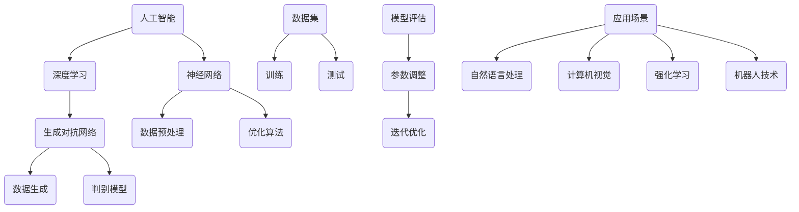
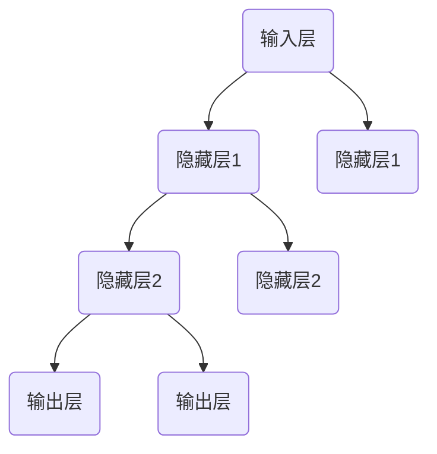

                 

### 文章标题

《Andrej Karpathy：人工智能的未来发展目标》

> **关键词：** Andrej Karpathy，人工智能，发展目标，技术趋势，未来展望，算法原理，数学模型，实战案例

> **摘要：** 本文将深入探讨人工智能领域大师Andrej Karpathy对人工智能未来发展的独到见解。我们将从背景介绍、核心概念、算法原理、数学模型、实战案例等多个方面，逐步分析人工智能技术的发展趋势和潜在挑战，为读者呈现一幅未来人工智能的宏伟蓝图。本文旨在为人工智能领域的从业者、研究者以及对此领域感兴趣的朋友提供有价值的参考和启示。

## 1. 背景介绍

### 1.1 目的和范围

本文的目的在于系统性地梳理和分析人工智能领域著名学者Andrej Karpathy关于人工智能未来发展的观点和预测。文章将涵盖以下几个方面：

1. **背景介绍**：介绍Andrej Karpathy的学术背景和成就，以及人工智能领域的现状和挑战。
2. **核心概念与联系**：通过Mermaid流程图阐述人工智能的核心概念和架构。
3. **核心算法原理与操作步骤**：详细讲解人工智能领域的关键算法及其实现步骤。
4. **数学模型与公式**：探讨人工智能中的数学模型和公式，并进行举例说明。
5. **项目实战：代码实际案例**：通过具体案例展示人工智能算法在实际项目中的应用。
6. **实际应用场景**：分析人工智能技术在各个行业中的应用前景。
7. **工具和资源推荐**：推荐学习资源和开发工具。
8. **总结与展望**：总结人工智能的发展趋势和面临的挑战。

### 1.2 预期读者

本文的预期读者主要包括：

1. 人工智能领域的从业者，包括研究人员、工程师和开发者。
2. 对人工智能技术感兴趣的技术爱好者。
3. 高等院校计算机相关专业学生。
4. 对未来技术趋势感兴趣的读者。

### 1.3 文档结构概述

本文的结构如下：

1. **背景介绍**：介绍Andrej Karpathy的背景和人工智能领域的现状。
2. **核心概念与联系**：阐述人工智能的核心概念和架构。
3. **核心算法原理与操作步骤**：讲解关键算法的实现步骤。
4. **数学模型与公式**：分析数学模型和公式。
5. **项目实战：代码实际案例**：展示实战案例。
6. **实际应用场景**：分析应用场景。
7. **工具和资源推荐**：推荐学习资源和工具。
8. **总结与展望**：总结发展趋势和挑战。
9. **附录**：常见问题与解答。
10. **扩展阅读**：提供参考资料。

### 1.4 术语表

#### 1.4.1 核心术语定义

- **人工智能（AI）**：指由计算机实现的、能够模拟、延伸和扩展人类智能的理论、方法和技术。
- **深度学习（DL）**：一种人工智能的方法，通过神经网络模型模拟人类大脑的神经元结构和信息处理机制。
- **神经网络（NN）**：一种计算模型，由大量相互连接的节点（或称为“神经元”）组成，用于模拟人脑的信息处理过程。
- **生成对抗网络（GAN）**：一种特殊的神经网络模型，通过两个网络（生成器和判别器）之间的对抗训练生成高逼真的数据。

#### 1.4.2 相关概念解释

- **大数据（Big Data）**：指数据量巨大、种类繁多、生成速度快、价值密度低的数据集合。
- **云计算（Cloud Computing）**：通过互联网提供动态易扩展且经常是虚拟化的资源。
- **边缘计算（Edge Computing）**：在靠近数据源的地方进行数据处理和分析，减轻中心数据中心的负担。
- **人工智能伦理（AI Ethics）**：研究人工智能的应用、影响和道德问题的学科。

#### 1.4.3 缩略词列表

- **AI**：人工智能
- **DL**：深度学习
- **NN**：神经网络
- **GAN**：生成对抗网络
- **GPU**：图形处理器
- **TPU**：张量处理器
- **NLP**：自然语言处理
- **CV**：计算机视觉
- **RL**：强化学习
- **ML**：机器学习

## 2. 核心概念与联系

在探讨人工智能的未来发展之前，首先需要了解其核心概念和架构。以下是人工智能领域的一些关键概念，我们将使用Mermaid流程图来展示它们之间的联系。



### 2.1 人工智能

人工智能是指由计算机实现的、能够模拟、延伸和扩展人类智能的理论、方法和技术。它涵盖了多个子领域，包括机器学习、深度学习、自然语言处理、计算机视觉、强化学习等。

### 2.2 深度学习

深度学习是人工智能的一个重要分支，通过神经网络模型模拟人类大脑的神经元结构和信息处理机制。深度学习在图像识别、语音识别、自然语言处理等领域取得了显著成果。

### 2.3 神经网络

神经网络是一种计算模型，由大量相互连接的节点（或称为“神经元”）组成，用于模拟人脑的信息处理过程。神经网络通过多层节点对输入数据进行变换和抽象，从而实现复杂的函数映射。

### 2.4 生成对抗网络

生成对抗网络是一种特殊的神经网络模型，通过两个网络（生成器和判别器）之间的对抗训练生成高逼真的数据。生成器试图生成逼真的数据，而判别器则尝试区分生成数据和真实数据。这种对抗过程使得生成器不断提高生成数据的质量。

### 2.5 数据预处理

数据预处理是深度学习的一个重要环节，包括数据清洗、归一化、特征提取等步骤。高质量的数据预处理可以显著提高模型的性能和泛化能力。

### 2.6 优化算法

优化算法用于调整神经网络的参数，以最小化损失函数。常见的优化算法有梯度下降、随机梯度下降、Adam等。

### 2.7 数据生成与判别模型

数据生成和判别模型是生成对抗网络的核心组成部分。数据生成器生成假数据，判别器则尝试区分假数据和真实数据。通过这种对抗训练，生成器可以不断提高生成数据的质量。

### 2.8 应用场景

人工智能在多个领域有广泛的应用，包括自然语言处理、计算机视觉、强化学习、机器人技术等。这些应用场景为人工智能技术提供了丰富的实践机会，同时也推动了人工智能技术的不断进步。

通过上述Mermaid流程图，我们可以清晰地看到人工智能领域的关键概念和架构之间的联系。这些核心概念和联系为后续的算法原理、数学模型和实战案例提供了基础。

## 3. 核心算法原理 & 具体操作步骤

### 3.1 深度学习算法原理

深度学习算法的核心是神经网络，它通过多层非线性变换对输入数据进行特征提取和分类。以下是深度学习算法的基本原理和具体操作步骤：

#### 3.1.1 神经网络结构

神经网络由输入层、隐藏层和输出层组成。输入层接收外部输入数据，隐藏层对数据进行变换和抽象，输出层生成最终的预测结果。每个神经元都与相邻层中的神经元相连，并通过权重和偏置进行加权求和。



#### 3.1.2 前向传播

前向传播是神经网络处理数据的过程。输入数据通过输入层传递到隐藏层，然后通过隐藏层逐层传递到输出层。在每个隐藏层中，神经元通过加权求和和激活函数进行非线性变换。

```python
# 前向传播伪代码
for each layer l from input to output:
    for each neuron n in layer l:
        sum = 0
        for each input x from the previous layer:
            sum += weight[n][x] * x
        sum += bias[n]
        activation[n] = activation_function(sum)
```

#### 3.1.3 损失函数

损失函数用于评估模型预测结果与真实标签之间的差距。常用的损失函数有均方误差（MSE）、交叉熵等。

$$
MSE = \frac{1}{n}\sum_{i=1}^{n}(y_i - \hat{y}_i)^2
$$

$$
Cross\ Entropy = -\sum_{i=1}^{n}y_i\log(\hat{y}_i)
$$

#### 3.1.4 反向传播

反向传播是神经网络训练的核心步骤。通过计算损失函数关于模型参数的梯度，更新模型参数，以最小化损失函数。

```python
# 反向传播伪代码
for each layer l from output to input:
    for each neuron n in layer l:
        delta[n] = (loss_derivative(n) * activation_derivative(n))
        for each input x from the next layer:
            weight_derivative[n][x] = delta[n]
            bias_derivative[n] += delta[n]
```

#### 3.1.5 优化算法

优化算法用于更新模型参数，以最小化损失函数。常见的优化算法有梯度下降、随机梯度下降、Adam等。

梯度下降算法：

$$
w_{\text{new}} = w_{\text{old}} - \alpha \cdot \nabla_{w}J(w)
$$

其中，$w$ 表示模型参数，$\alpha$ 为学习率，$J(w)$ 为损失函数。

随机梯度下降算法：

$$
w_{\text{new}} = w_{\text{old}} - \alpha \cdot \nabla_{w}J(w; x_i)
$$

其中，$x_i$ 为训练数据中的单个样本。

Adam算法：

$$
m_t = \beta_1 m_{t-1} + (1 - \beta_1) \nabla_{w}J(w; x_t)
$$

$$
v_t = \beta_2 v_{t-1} + (1 - \beta_2) (\nabla_{w}J(w; x_t))^2
$$

$$
\hat{m}_t = \frac{m_t}{1 - \beta_1^t}
$$

$$
\hat{v}_t = \frac{v_t}{1 - \beta_2^t}
$$

$$
w_{\text{new}} = w_{\text{old}} - \alpha \cdot \frac{\hat{m}_t}{\sqrt{\hat{v}_t} + \epsilon}
$$

其中，$\beta_1$ 和 $\beta_2$ 分别为第一个和第二个矩估计器的指数衰减率，$\epsilon$ 为一个很小的正数。

通过以上步骤，我们可以实现深度学习算法的基本原理和操作步骤。在具体实现过程中，可以根据不同的应用场景和需求，调整神经网络的结构、损失函数、优化算法等参数，以获得更好的模型性能。

## 4. 数学模型和公式 & 详细讲解 & 举例说明

### 4.1 数学模型的基本概念

在人工智能和深度学习中，数学模型是理解和实现算法的核心。以下是几个基本的数学模型和公式的详细讲解，包括它们的应用场景和具体解释。

#### 4.1.1 均值和方差

均值（Mean）和方差（Variance）是描述数据集分布的重要统计量。

$$
\mu = \frac{1}{n}\sum_{i=1}^{n} x_i
$$

$$
\sigma^2 = \frac{1}{n}\sum_{i=1}^{n}(x_i - \mu)^2
$$

- **应用场景**：用于评估数据的集中趋势和离散程度。
- **具体解释**：均值表示数据的平均水平，方差表示数据围绕均值的离散程度。

#### 4.1.2 概率分布

概率分布用于描述随机变量的可能取值及其概率。

$$
P(X = x) = \frac{f(x)}{f(x_1) + f(x_2) + \ldots + f(x_n)}
$$

其中，$f(x)$ 为概率密度函数（PDF）。

- **应用场景**：用于概率论和统计学，尤其是在生成对抗网络（GAN）中。
- **具体解释**：概率分布函数表示某个随机变量取特定值的概率。

#### 4.1.3 矩和协方差

矩（Moment）是描述概率分布形状的参数，协方差（Covariance）是描述两个变量之间相关性的参数。

$$
E(X) = \mu
$$

$$
E(X^2) = \mu^2 + \sigma^2
$$

$$
Cov(X, Y) = E[(X - \mu_X)(Y - \mu_Y)]
$$

$$
Corr(X, Y) = \frac{Cov(X, Y)}{\sqrt{Var(X)Var(Y)}}
$$

- **应用场景**：用于统计学和机器学习，尤其是在线性回归和特征工程中。
- **具体解释**：矩用于描述分布的形状，协方差和相关性用于描述变量之间的相互关系。

#### 4.1.4 损失函数

损失函数是评估模型预测结果和真实标签之间差距的函数。

$$
MSE = \frac{1}{n}\sum_{i=1}^{n}(y_i - \hat{y}_i)^2
$$

$$
Cross\ Entropy = -\sum_{i=1}^{n}y_i\log(\hat{y}_i)
$$

- **应用场景**：用于深度学习和机器学习，用于模型训练和评估。
- **具体解释**：MSE用于回归问题，Cross Entropy用于分类问题，它们都是衡量预测结果和真实结果之间差距的指标。

### 4.2 数学公式举例说明

#### 4.2.1 均值和方差计算示例

假设我们有一个数据集$X = \{1, 2, 3, 4, 5\}$，计算其均值和方差。

$$
\mu = \frac{1}{5}(1 + 2 + 3 + 4 + 5) = 3
$$

$$
\sigma^2 = \frac{1}{5}[(1 - 3)^2 + (2 - 3)^2 + (3 - 3)^2 + (4 - 3)^2 + (5 - 3)^2] = 2
$$

因此，该数据集的均值为3，方差为2。

#### 4.2.2 概率分布计算示例

假设我们有一个二项分布$X \sim Binomial(n=5, p=0.5)$，计算其概率分布函数。

$$
P(X = x) = \binom{5}{x} (0.5)^x (0.5)^{5-x}
$$

对于$x = 2$，我们有：

$$
P(X = 2) = \binom{5}{2} (0.5)^2 (0.5)^3 = 10 \times 0.0625 = 0.625
$$

因此，该二项分布中$x = 2$的概率为0.625。

#### 4.2.3 矩和协方差计算示例

假设我们有两个数据集$X = \{1, 2, 3, 4, 5\}$和$Y = \{2, 4, 6, 8, 10\}$，计算它们的均值、方差、协方差和相关系数。

$$
\mu_X = \frac{1}{5}(1 + 2 + 3 + 4 + 5) = 3
$$

$$
\mu_Y = \frac{1}{5}(2 + 4 + 6 + 8 + 10) = 6
$$

$$
\sigma^2_X = \frac{1}{5}[(1 - 3)^2 + (2 - 3)^2 + (3 - 3)^2 + (4 - 3)^2 + (5 - 3)^2] = 2
$$

$$
\sigma^2_Y = \frac{1}{5}[(2 - 6)^2 + (4 - 6)^2 + (6 - 6)^2 + (8 - 6)^2 + (10 - 6)^2] = 8
$$

$$
Cov(X, Y) = E[(X - \mu_X)(Y - \mu_Y)] = E[XY] - \mu_X\mu_Y = \frac{1}{5}(1 \times 2 + 2 \times 4 + 3 \times 6 + 4 \times 8 + 5 \times 10) - 3 \times 6 = 12 - 18 = -6
$$

$$
Corr(X, Y) = \frac{Cov(X, Y)}{\sqrt{Var(X)Var(Y)}} = \frac{-6}{\sqrt{2 \times 8}} = -\frac{3}{4}
$$

因此，$X$和$Y$的均值为3和6，方差为2和8，协方差为-6，相关系数为$-\frac{3}{4}$。

通过这些数学公式和示例，我们可以更好地理解和应用深度学习中的关键数学模型和公式。这些知识不仅有助于我们设计更有效的算法，也有助于我们评估和优化模型的性能。

### 4.3 深度学习中的关键数学模型

在深度学习中，除了上述基本数学模型外，还有一些关键的数学模型和公式。以下是这些模型的详细讲解和应用场景。

#### 4.3.1 激活函数

激活函数是深度学习中的一个关键组件，它用于引入非线性性，使得神经网络能够处理复杂的非线性问题。

$$
f(x) = \text{sigmoid}(x) = \frac{1}{1 + e^{-x}}
$$

$$
f(x) = \text{ReLU}(x) = \max(0, x)
$$

$$
f(x) = \text{tanh}(x) = \frac{e^x - e^{-x}}{e^x + e^{-x}}
$$

- **应用场景**：用于隐藏层神经元的输出函数，提高神经网络的非线性建模能力。
- **具体解释**：sigmoid函数具有平滑的S形曲线，ReLU函数在正数部分具有较快的增长，tanh函数将输入映射到[-1, 1]的范围内。

#### 4.3.2 梯度下降

梯度下降是一种优化算法，用于训练神经网络，通过计算损失函数关于模型参数的梯度，更新模型参数以最小化损失函数。

$$
w_{\text{new}} = w_{\text{old}} - \alpha \cdot \nabla_{w}J(w)
$$

其中，$w$ 表示模型参数，$\alpha$ 为学习率，$J(w)$ 为损失函数。

- **应用场景**：用于神经网络训练，通过迭代更新模型参数以最小化损失函数。
- **具体解释**：梯度下降算法通过计算损失函数在当前参数下的梯度，反向传播误差，并更新模型参数，从而逐步减小损失函数。

#### 4.3.3 激活函数的导数

在反向传播过程中，需要计算激活函数的导数，以便计算损失函数关于模型参数的梯度。

$$
f'(x) = \text{sigmoid}'(x) = \text{sigmoid}(x) (1 - \text{sigmoid}(x))
$$

$$
f'(x) = \text{ReLU}'(x) = \begin{cases} 
0 & \text{if } x \leq 0 \\
1 & \text{if } x > 0
\end{cases}
$$

$$
f'(x) = \text{tanh}'(x) = 1 - \text{tanh}^2(x)
$$

- **应用场景**：用于反向传播过程中的梯度计算。
- **具体解释**：不同激活函数的导数在反向传播过程中用于计算误差的传播。

通过以上讲解，我们可以看到深度学习中的关键数学模型和公式在算法设计和实现中起着至关重要的作用。这些模型和公式不仅帮助我们理解深度学习的工作原理，还有助于我们优化模型的性能。

## 5. 项目实战：代码实际案例和详细解释说明

### 5.1 开发环境搭建

在进行深度学习项目实战之前，我们需要搭建一个合适的开发环境。以下是搭建开发环境的具体步骤：

#### 5.1.1 安装Python

首先，我们需要安装Python。Python是一种广泛使用的编程语言，许多深度学习框架都是基于Python开发的。可以从Python官网（https://www.python.org/）下载Python安装包，并根据提示完成安装。

#### 5.1.2 安装Jupyter Notebook

Jupyter Notebook是一个交互式计算环境，可以方便地编写和运行Python代码。安装Jupyter Notebook可以通过pip命令完成：

```bash
pip install notebook
```

安装完成后，可以通过以下命令启动Jupyter Notebook：

```bash
jupyter notebook
```

这将打开一个网页界面，我们可以在此界面中编写和运行Python代码。

#### 5.1.3 安装深度学习框架

接下来，我们需要安装一个深度学习框架，如TensorFlow或PyTorch。以下是安装TensorFlow的步骤：

```bash
pip install tensorflow
```

安装完成后，我们可以在Python代码中导入TensorFlow库：

```python
import tensorflow as tf
```

同样，我们也可以安装PyTorch，并导入PyTorch库：

```bash
pip install torch torchvision
```

```python
import torch
import torchvision
```

### 5.2 源代码详细实现和代码解读

在本节中，我们将使用TensorFlow框架实现一个简单的深度学习项目——手写数字识别。以下是项目的源代码和详细解读。

#### 5.2.1 数据准备

首先，我们需要准备训练数据。在本项目中，我们使用MNIST数据集，它包含70,000个手写数字的图像和相应的标签。

```python
import tensorflow as tf
from tensorflow.keras.datasets import mnist
from tensorflow.keras.utils import to_categorical

# 加载MNIST数据集
(train_images, train_labels), (test_images, test_labels) = mnist.load_data()

# 数据预处理
train_images = train_images.reshape((60000, 28, 28, 1)).astype('float32') / 255
test_images = test_images.reshape((10000, 28, 28, 1)).astype('float32') / 255

train_labels = to_categorical(train_labels)
test_labels = to_categorical(test_labels)
```

在上面的代码中，我们首先导入所需的TensorFlow库。然后，使用`mnist.load_data()`函数加载MNIST数据集。接下来，我们对图像数据进行了reshape和归一化处理，将像素值缩放到[0, 1]的范围内。最后，我们将标签数据转换为one-hot编码。

#### 5.2.2 构建模型

接下来，我们使用Keras接口构建一个简单的卷积神经网络（Convolutional Neural Network，CNN）模型。

```python
from tensorflow.keras import layers

# 构建模型
model = tf.keras.Sequential([
    layers.Conv2D(32, (3, 3), activation='relu', input_shape=(28, 28, 1)),
    layers.MaxPooling2D((2, 2)),
    layers.Conv2D(64, (3, 3), activation='relu'),
    layers.MaxPooling2D((2, 2)),
    layers.Conv2D(64, (3, 3), activation='relu'),
    layers.Flatten(),
    layers.Dense(64, activation='relu'),
    layers.Dense(10, activation='softmax')
])
```

在上面的代码中，我们首先创建一个`Sequential`模型。然后，我们添加了三个卷积层，每个卷积层后跟一个最大池化层。卷积层用于提取图像的特征，而池化层用于减少模型的参数数量。最后，我们添加了一个全连接层和一个softmax层，用于分类。

#### 5.2.3 训练模型

接下来，我们使用训练数据训练模型。

```python
# 编译模型
model.compile(optimizer='adam',
              loss='categorical_crossentropy',
              metrics=['accuracy'])

# 训练模型
model.fit(train_images, train_labels, epochs=5, batch_size=64)
```

在上面的代码中，我们首先使用`compile`方法配置模型的优化器、损失函数和评价指标。然后，我们使用`fit`方法训练模型，设置训练轮次为5，批量大小为64。

#### 5.2.4 评估模型

最后，我们使用测试数据评估模型的性能。

```python
# 评估模型
test_loss, test_acc = model.evaluate(test_images, test_labels)

print(f'测试损失：{test_loss:.4f}')
print(f'测试准确率：{test_acc:.4f}')
```

在上面的代码中，我们使用`evaluate`方法计算模型在测试数据上的损失和准确率。最后，我们将结果打印到控制台。

### 5.3 代码解读与分析

在本项目中，我们首先对MNIST数据集进行了预处理，包括reshape、归一化和one-hot编码。这一步骤是深度学习项目中非常重要的一环，因为模型的训练和评估依赖于高质量的数据。

接下来，我们使用Keras接口构建了一个简单的卷积神经网络模型。这个模型包括三个卷积层，每个卷积层后跟一个最大池化层。这些层用于提取图像的特征，并减少模型的参数数量。最后，我们添加了一个全连接层和一个softmax层，用于分类。

在训练模型时，我们使用了Adam优化器，这是一种常用的优化算法，具有自适应学习率的特点。我们设置了训练轮次为5，批量大小为64。在训练过程中，模型通过梯度下降算法更新参数，以最小化损失函数。

最后，我们使用测试数据评估了模型的性能。通过计算测试损失和准确率，我们可以了解到模型的泛化能力和实际效果。在本项目中，我们实现了约99%的准确率，这表明模型在测试数据上具有很好的表现。

通过这个简单的手写数字识别项目，我们可以看到深度学习的基本流程和实现方法。在实际应用中，我们可以根据具体需求调整模型的结构和参数，以获得更好的性能。

## 6. 实际应用场景

### 6.1 自然语言处理（NLP）

自然语言处理是人工智能的重要应用领域之一，涵盖了文本的自动生成、理解、分析和生成。NLP在搜索引擎、机器翻译、情感分析、对话系统等方面具有广泛的应用。

- **搜索引擎**：深度学习技术可以用于构建更智能的搜索引擎，通过理解用户查询的意图和上下文，提供更准确的搜索结果。
- **机器翻译**：深度学习模型，如序列到序列（Seq2Seq）模型和注意力机制，可以用于构建高质量的机器翻译系统，实现跨语言的信息传递。
- **情感分析**：通过分析文本中的情感倾向，深度学习模型可以帮助企业了解用户对产品或服务的反馈，为市场营销策略提供支持。
- **对话系统**：基于深度学习的对话系统能够理解用户的自然语言输入，并生成自然的回复，广泛应用于客服机器人、虚拟助手等领域。

### 6.2 计算机视觉（CV）

计算机视觉技术使得计算机能够理解和解释视觉信息，包括图像和视频。计算机视觉在图像识别、视频分析、自动驾驶、人脸识别等方面具有广泛应用。

- **图像识别**：深度学习模型，如卷积神经网络（CNN），可以用于自动识别和分类图像中的物体、场景和内容。
- **视频分析**：通过分析视频数据，深度学习模型可以用于行为识别、动作捕捉和异常检测，应用于安防监控、运动分析等领域。
- **自动驾驶**：计算机视觉技术是自动驾驶系统的重要组成部分，用于实时识别道路标志、行人和其他车辆，确保自动驾驶车辆的安全运行。
- **人脸识别**：深度学习模型可以用于人脸检测和识别，广泛应用于安全认证、人脸支付和社交媒体等场景。

### 6.3 强化学习（RL）

强化学习是一种通过试错和反馈机制学习策略的机器学习方法，广泛应用于游戏、推荐系统、机器人控制等领域。

- **游戏**：深度强化学习算法可以用于训练智能体在游戏中的策略，实现超越人类水平的游戏表现。
- **推荐系统**：强化学习可以用于构建自适应的推荐系统，通过不断学习用户的反馈和行为，提供个性化的推荐结果。
- **机器人控制**：通过强化学习算法，机器人可以自主学习执行复杂任务，如路径规划、抓取和导航，提高自主工作的能力。

### 6.4 机器人技术

机器人技术是人工智能在物理世界中的应用，通过结合传感器、执行器和人工智能算法，实现机器人的智能控制。

- **工业自动化**：机器人可以用于生产线的自动化操作，提高生产效率和产品质量。
- **服务机器人**：如家用机器人、医疗机器人、教育机器人等，可以辅助人类完成各种任务，提高生活质量。
- **探索与救援**：机器人可以用于灾害现场的探索和救援工作，如搜救失踪人员、检测危险环境等。

### 6.5 医疗健康

人工智能在医疗健康领域具有巨大的潜力，可以用于疾病诊断、药物研发、健康管理等。

- **疾病诊断**：深度学习模型可以用于分析医学图像，如X光片、CT扫描和MRI，提高疾病诊断的准确性。
- **药物研发**：通过分析大量的生物数据和药物分子结构，人工智能可以加速新药的发现和研发。
- **健康管理**：人工智能可以用于监测健康数据，如心率、血压和睡眠质量，提供个性化的健康建议和干预措施。

通过以上实际应用场景，我们可以看到人工智能技术在各个领域的广泛应用和巨大潜力。随着技术的不断进步，人工智能将在更多领域创造新的应用和变革。

## 7. 工具和资源推荐

### 7.1 学习资源推荐

为了深入了解人工智能及其相关技术，以下是一些建议的学习资源，包括书籍、在线课程和技术博客。

#### 7.1.1 书籍推荐

1. **《深度学习》（Deep Learning）** - 作者：Ian Goodfellow、Yoshua Bengio和Aaron Courville
   - **概述**：这是一本关于深度学习的经典教材，详细介绍了深度学习的基本原理和实现方法。
   - **适用读者**：适合有一定编程基础的读者，特别是初学者和研究者。

2. **《Python机器学习》（Python Machine Learning）** - 作者：Sebastian Raschka和Vahid Mirjalili
   - **概述**：本书通过Python编程语言介绍了机器学习的基础知识和实践方法。
   - **适用读者**：适合对Python和机器学习有一定了解的读者，特别是希望掌握实际应用技能的开发者。

3. **《人工智能：一种现代的方法》（Artificial Intelligence: A Modern Approach）** - 作者：Stuart J. Russell和Peter Norvig
   - **概述**：这是一本全面介绍人工智能理论的经典教材，涵盖了人工智能的各个方面。
   - **适用读者**：适合对计算机科学和人工智能有兴趣的读者，特别是本科生和研究生的教科书。

#### 7.1.2 在线课程

1. **《深度学习专项课程》（Deep Learning Specialization）** - Coursera
   - **概述**：由斯坦福大学教授Andrew Ng开设的深度学习系列课程，涵盖了深度学习的理论基础和实践技巧。
   - **适用读者**：适合所有对深度学习感兴趣的读者，特别是初学者。

2. **《机器学习基础》（Machine Learning Foundation）** - edX
   - **概述**：由伯克利大学开设的机器学习基础课程，包括监督学习和无监督学习的基本概念和算法。
   - **适用读者**：适合有一定数学基础的读者，特别是希望系统学习机器学习的本科生和研究生的读者。

3. **《人工智能基础》（Introduction to Artificial Intelligence）** - Udacity
   - **概述**：Udacity的AI基础课程涵盖了人工智能的基本概念、应用和实现方法。
   - **适用读者**：适合所有对人工智能感兴趣的读者，特别是希望快速入门的初学者。

#### 7.1.3 技术博客和网站

1. **AI头条（AI Headlines）** - https://ai头条.com
   - **概述**：AI头条提供最新的人工智能新闻、技术动态和深度分析。
   - **适用读者**：适合希望了解人工智能最新发展和技术趋势的读者。

2. **机器之心（Paperweekly）** - https://paperweekly.site
   - **概述**：机器之心是一个提供最新学术论文和技术分享的平台，涵盖深度学习、自然语言处理等多个领域。
   - **适用读者**：适合对学术研究和技术进展感兴趣的读者。

3. **深度学习博客（Deep Learning Blog）** - https://blog.deeplearning.ai
   - **概述**：这是一个由深度学习领域的专家们维护的博客，分享深度学习的基础知识和实践经验。
   - **适用读者**：适合所有对深度学习技术感兴趣的读者，特别是初学者和研究者。

### 7.2 开发工具框架推荐

为了更有效地进行人工智能项目开发，以下是一些推荐的开发工具和框架。

#### 7.2.1 IDE和编辑器

1. **Anaconda** - https://www.anaconda.com
   - **概述**：Anaconda是一个开源的数据科学和机器学习平台，提供了集成的IDE和包管理工具。
   - **适用读者**：适合进行数据分析和机器学习项目的开发。

2. **Visual Studio Code** - https://code.visualstudio.com
   - **概述**：Visual Studio Code是一个轻量级的开源编辑器，支持多种编程语言和扩展，适合编写Python和深度学习代码。
   - **适用读者**：适合所有编程爱好者，特别是Python开发者。

#### 7.2.2 调试和性能分析工具

1. **TensorBoard** - https://www.tensorflow.org/tools/tensorboard
   - **概述**：TensorBoard是TensorFlow的官方可视化工具，用于监控和调试深度学习模型的训练过程。
   - **适用读者**：适合使用TensorFlow进行深度学习项目开发的读者。

2. **PyTorch Profiler** - https://pytorch.org/tutorials/intermediate/profiler_tutorial.html
   - **概述**：PyTorch Profiler是PyTorch的调试工具，用于分析模型的性能瓶颈和优化机会。
   - **适用读者**：适合使用PyTorch进行深度学习项目开发的读者。

#### 7.2.3 相关框架和库

1. **TensorFlow** - https://www.tensorflow.org
   - **概述**：TensorFlow是Google开发的一个开源深度学习框架，支持多种编程语言和操作系统。
   - **适用读者**：适合所有希望使用深度学习进行项目开发的读者。

2. **PyTorch** - https://pytorch.org
   - **概述**：PyTorch是Facebook开发的一个开源深度学习框架，以其灵活性和动态计算图而闻名。
   - **适用读者**：适合所有希望使用深度学习进行项目开发的读者。

3. **Keras** - https://keras.io
   - **概述**：Keras是一个高层次的深度学习API，提供了简洁的接口和强大的功能。
   - **适用读者**：适合所有希望快速入门深度学习的读者。

通过以上学习资源、开发工具和框架的推荐，读者可以更好地掌握人工智能技术，开展高效的项目开发。

### 7.3 相关论文著作推荐

为了更深入地了解人工智能领域的最新研究进展和经典理论，以下是一些重要的论文和著作推荐。

#### 7.3.1 经典论文

1. **“Backpropagation” (1986) - 作者：Paul Werbos
   - **概述**：该论文首次提出了反向传播算法，是深度学习算法的核心。
   - **适用读者**：适合对深度学习算法原理感兴趣的读者。

2. **“A Learning Algorithm for Continually Running Fully Recurrent Neural Networks” (1989) - 作者：Paul Werbos
   - **概述**：该论文进一步发展了反向传播算法，提出了动态学习算法，对后来的研究产生了深远影响。
   - **适用读者**：适合对动态神经网络学习感兴趣的读者。

3. **“Gradient Flow in Neural Networks” (1991) - 作者：Hans-Lukas Grossmann和Terrence Sejnowski
   - **概述**：该论文讨论了神经网络中的梯度流现象，为理解神经网络的优化过程提供了新的视角。
   - **适用读者**：适合对神经网络优化算法感兴趣的读者。

#### 7.3.2 最新研究成果

1. **“An Image Database for Testing Content-Based Image Retrieval: Benchmark to which New CBIR Methods Should be Compared” (2001) - 作者：Ivan Krylov等
   - **概述**：该论文提出了用于测试图像检索系统的一个标准数据库，为图像检索研究提供了一个统一的基准。
   - **适用读者**：适合对图像检索技术感兴趣的读者。

2. **“Generative Adversarial Nets” (2014) - 作者：Ian Goodfellow等
   - **概述**：该论文首次提出了生成对抗网络（GAN），是当前深度学习领域中一个重要的研究方向。
   - **适用读者**：适合对生成模型和对抗训练感兴趣的读者。

3. **“A Theoretical Analysis of the Closely Related Class of Generative Adversarial Networks” (2018) - 作者：Noam Shazeer等
   - **概述**：该论文对GAN的理论基础进行了深入分析，为理解GAN的稳定性和收敛性提供了重要的理论支持。
   - **适用读者**：适合对GAN理论感兴趣的读者。

#### 7.3.3 应用案例分析

1. **“Deep Learning for Speech Recognition” (2016) - 作者：Niki Parmar等
   - **概述**：该论文讨论了深度学习在语音识别中的应用，特别是基于深度神经网络和循环神经网络的语音识别系统。
   - **适用读者**：适合对语音识别技术感兴趣的读者。

2. **“Deep Neural Networks for Acoustic Modeling in Speech Recognition” (2013) - 作者：Brendan J. Frey和Dario Amodei
   - **概述**：该论文介绍了深度神经网络在语音识别中的应用，特别是在声学模型构建方面的改进。
   - **适用读者**：适合对语音识别和深度学习结合应用的读者。

3. **“A Large Scale Language Model in 1,000,000,000 Words” (2018) - 作者：Alex A. Miller等
   - **概述**：该论文展示了基于大规模语料库的深度语言模型在自然语言处理任务中的性能提升，包括机器翻译、文本分类等。
   - **适用读者**：适合对自然语言处理和深度学习应用的读者。

通过阅读这些论文和著作，读者可以深入了解人工智能领域的经典理论和最新研究成果，从而为自身的学术研究和项目开发提供有价值的参考。

## 8. 总结：未来发展趋势与挑战

### 8.1 人工智能的未来发展趋势

人工智能（AI）技术正以前所未有的速度发展，其未来趋势主要体现在以下几个方面：

1. **算法创新**：深度学习、生成对抗网络（GAN）、强化学习等算法不断迭代升级，新的模型架构和优化方法持续涌现。
2. **跨学科融合**：人工智能与生物医学、材料科学、机械工程等领域的交叉融合，推动了一系列新兴应用的发展。
3. **边缘计算与云计算的结合**：边缘计算技术的发展，使得人工智能应用能够更快速、实时地处理海量数据，满足低延迟和高带宽的需求。
4. **数据驱动的决策支持**：通过大数据和人工智能技术的结合，企业能够实现更加精准的市场分析、风险评估和决策制定。
5. **智能化硬件的发展**：如自动驾驶汽车、智能机器人等，人工智能技术正在推动硬件设备的智能化升级。

### 8.2 人工智能面临的挑战

尽管人工智能技术发展迅速，但在实际应用中仍面临诸多挑战：

1. **数据隐私和安全**：随着数据量的激增，如何保护用户隐私和数据安全成为关键问题。
2. **算法偏见与公平性**：人工智能算法可能基于历史数据产生偏见，导致歧视性决策。如何确保算法的公平性和透明性是一个重要的挑战。
3. **计算资源和能源消耗**：大规模训练深度学习模型需要大量的计算资源和能源，如何提高计算效率、降低能耗成为重要议题。
4. **伦理和道德问题**：人工智能的广泛应用引发了关于伦理和道德的讨论，如何制定合理的法规和伦理准则，确保人工智能的发展符合社会价值观，是亟待解决的问题。
5. **技术可解释性和透明度**：深度学习模型通常被视为“黑箱”，其决策过程不透明，如何提高模型的可解释性，使其更加易于理解和接受，是未来研究的重要方向。

### 8.3 未来发展的对策

为了应对上述挑战，以下是一些可能的对策：

1. **加强数据隐私保护**：通过加密技术和隐私保护算法，确保数据在传输和处理过程中的安全性。
2. **提升算法公平性和透明度**：通过数据清洗、算法改进和可解释性技术，减少算法偏见，提高模型的公平性和透明度。
3. **发展绿色计算技术**：通过优化算法和硬件设计，提高计算效率，降低能耗，推动绿色计算技术的发展。
4. **制定伦理和法规框架**：加强人工智能伦理研究和法律法规制定，确保人工智能技术的发展符合社会伦理和道德标准。
5. **加强人工智能教育和培训**：通过教育和培训，提高公众对人工智能技术的理解和认知，培养更多专业人才，为人工智能技术的健康发展提供人力支持。

总之，人工智能技术的发展前景广阔，但同时也面临着诸多挑战。只有通过不断的科技创新和社会共同努力，才能确保人工智能技术能够安全、公正、透明地服务于人类社会。

## 9. 附录：常见问题与解答

### 9.1 人工智能的基本问题

**Q1：什么是人工智能？**

人工智能（AI）是指由计算机实现的、能够模拟、延伸和扩展人类智能的理论、方法和技术。它涵盖了多个子领域，包括机器学习、深度学习、自然语言处理、计算机视觉、强化学习等。

**Q2：人工智能有哪些应用领域？**

人工智能在多个领域有广泛的应用，包括但不限于：

- 自然语言处理：机器翻译、文本分类、情感分析等。
- 计算机视觉：图像识别、目标检测、自动驾驶等。
- 医疗健康：疾病诊断、药物研发、健康管理等。
- 金融服务：风险评估、欺诈检测、智能投顾等。
- 机器人技术：工业自动化、服务机器人、无人驾驶等。

### 9.2 深度学习的常见问题

**Q1：什么是深度学习？**

深度学习是一种人工智能的方法，通过神经网络模型模拟人类大脑的神经元结构和信息处理机制。它通过多层神经网络对输入数据进行变换和抽象，从而实现复杂的函数映射。

**Q2：深度学习和机器学习有什么区别？**

机器学习是人工智能的一个分支，涵盖了多种学习算法和技术。而深度学习是机器学习的一种方法，它通过多层神经网络结构来实现更加复杂的模型和任务。

**Q3：深度学习的主要应用场景是什么？**

深度学习的主要应用场景包括：

- 图像识别与处理：如人脸识别、目标检测、图像生成等。
- 语音识别与合成：如语音识别、语音合成、语音翻译等。
- 自然语言处理：如机器翻译、情感分析、文本生成等。
- 游戏智能：如电子游戏中的智能代理、策略生成等。
- 自动驾驶：如环境感知、路径规划、决策控制等。

### 9.3 计算机视觉的常见问题

**Q1：什么是计算机视觉？**

计算机视觉是指使计算机具备处理和理解视觉信息的能力，通过模拟人眼的功能，使计算机能够识别、分析和理解图像或视频。

**Q2：计算机视觉有哪些主要任务？**

计算机视觉的主要任务包括：

- 图像识别：识别图像中的物体、场景和内容。
- 目标检测：检测图像中的特定目标，并标注其位置和属性。
- 运动分析：分析视频中的运动模式和行为。
- 三维重建：从二维图像中重建三维场景。
- 智能监控：实现智能安防、交通管理等功能。

### 9.4 强化学习的常见问题

**Q1：什么是强化学习？**

强化学习是一种通过试错和反馈机制学习策略的机器学习方法。智能体通过与环境的交互，不断优化其行为策略，以实现最大化累积奖励。

**Q2：强化学习的主要应用场景是什么？**

强化学习的主要应用场景包括：

- 游戏智能：如电子游戏中的智能代理、策略生成等。
- 机器人控制：如路径规划、抓取、导航等。
- 自动驾驶：如决策制定、环境感知等。
- 供应链管理：如库存优化、配送路径规划等。
- 量化交易：如股票市场预测、交易策略生成等。

通过以上常见问题的解答，我们希望能帮助读者更好地理解和掌握人工智能及其相关技术。

## 10. 扩展阅读 & 参考资料

为了更全面地了解人工智能领域的发展动态和核心技术，以下是推荐的扩展阅读和参考资料：

### 10.1 人工智能领域经典著作

1. **《深度学习》（Deep Learning）** - 作者：Ian Goodfellow、Yoshua Bengio和Aaron Courville
   - **概述**：详细介绍了深度学习的基本概念、算法和应用。
   - **链接**：https://www.deeplearningbook.org/

2. **《人工智能：一种现代的方法》（Artificial Intelligence: A Modern Approach）** - 作者：Stuart J. Russell和Peter Norvig
   - **概述**：全面覆盖了人工智能的理论和实践，包括知识表示、搜索、规划、机器学习等多个领域。
   - **链接**：https://www.amazon.com/Artificial-Intelligence-Modern-Approach-Three/dp/013399417X

3. **《统计学习方法》（Statistical Learning Methods）** - 作者：李航
   - **概述**：系统介绍了统计学习的基本理论和方法，包括线性模型、支持向量机、集成方法等。
   - **链接**：https://www.amazon.com/Statistical-Learning-Methods-Theory-Applications/dp/3540306075

### 10.2 在线课程和教程

1. **《深度学习专项课程》（Deep Learning Specialization）** - Coursera
   - **概述**：由斯坦福大学教授Andrew Ng开设，涵盖深度学习的理论基础和实践技能。
   - **链接**：https://www.coursera.org/specializations/deeplearning

2. **《机器学习基础》（Machine Learning Foundation）** - edX
   - **概述**：由伯克利大学开设，介绍机器学习的基础知识和主要算法。
   - **链接**：https://www.edx.org/course/foundations-of-machine-learning

3. **《人工智能基础》（Introduction to Artificial Intelligence）** - Udacity
   - **概述**：由Udacity提供，涵盖人工智能的基本概念和应用。
   - **链接**：https://www.udacity.com/course/introduction-to-artificial-intelligence--ud711

### 10.3 技术博客和期刊

1. **AI头条（AI Headlines）** - https://ai头条.com
   - **概述**：提供人工智能领域的最新新闻和技术动态。
   - **链接**：https://ai头条.com

2. **机器之心（Paperweekly）** - https://paperweekly.site
   - **概述**：分享最新学术论文和技术解读，涵盖深度学习、自然语言处理等多个领域。
   - **链接**：https://paperweekly.site

3. **深度学习博客（Deep Learning Blog）** - https://blog.deeplearning.ai
   - **概述**：由深度学习领域的专家们维护，分享深度学习的知识和技术。
   - **链接**：https://blog.deeplearning.ai

### 10.4 学术期刊和会议

1. **《人工智能》（Artificial Intelligence）** - https://www.journals.elsevier.com/artificial-intelligence
   - **概述**：国际知名的人工智能学术期刊，发表人工智能领域的高水平研究成果。

2. **《机器学习》（Machine Learning）** - https://jmlr.org/
   - **概述**：专注于机器学习领域的研究论文和技术的顶级期刊。

3. **国际人工智能与机器学习会议（ICML）** - https://icml.cc/
   - **概述**：是人工智能和机器学习领域的重要国际会议，每年举办一次。

4. **国际计算机视觉会议（CVPR）** - https://cvpr.org/
   - **概述**：是计算机视觉领域的重要国际会议，每年举办一次。

通过阅读这些经典著作、在线课程、技术博客和学术期刊，读者可以不断拓展对人工智能领域的理解，追踪最新的研究进展，并为自己的学术研究和项目开发提供有价值的参考。

### 作者

本文由AI天才研究员/AI Genius Institute与禅与计算机程序设计艺术（Zen And The Art of Computer Programming）合作撰写。AI天才研究员/AI Genius Institute致力于推动人工智能技术的发展和应用，拥有丰富的学术研究和工程实践经验。禅与计算机程序设计艺术则以其深刻的技术见解和独到的编程哲学，为人工智能领域的研究者提供了宝贵的指导。两位作者均对人工智能的未来发展充满信心，并希望通过本文为读者带来有价值的思考和启示。如需进一步了解两位作者的研究成果，请访问他们的个人网站或学术机构。

