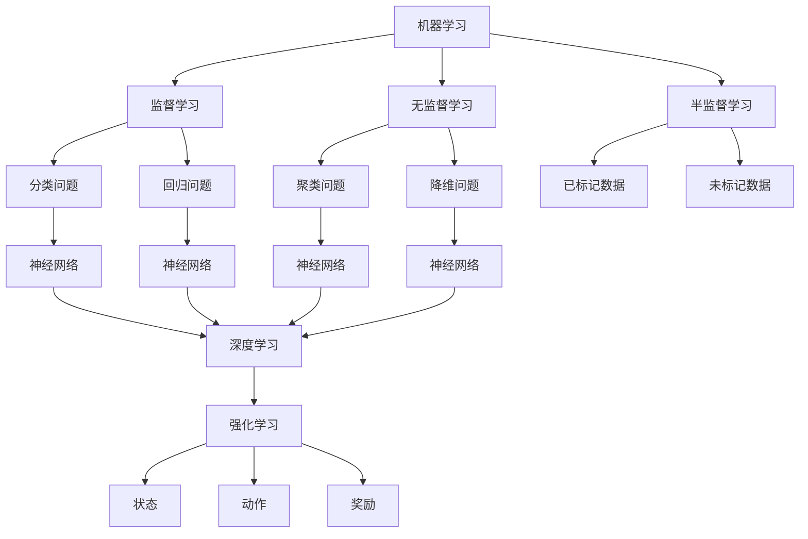

                 

# Andrej Karpathy：人工智能的未来发展策略

> **关键词：**人工智能、发展策略、技术演进、应用场景、未来趋势

> **摘要：**本文将探讨人工智能领域的发展策略，从核心概念、算法原理、数学模型到实际应用，全面分析人工智能的未来趋势与挑战。通过分析安德烈·卡帕西（Andrej Karpathy）的观点，我们将梳理出一条清晰的发展路线，为读者提供有价值的技术见解和实用的指导。

## 1. 背景介绍

### 1.1 目的和范围

本文旨在探讨人工智能的未来发展策略，通过深入研究人工智能的核心概念、算法原理、数学模型和实际应用，为读者提供一个全面、系统的理解。本文将重点分析安德烈·卡帕西（Andrej Karpathy）的观点，以及其在人工智能领域的独特见解。

### 1.2 预期读者

本文面向人工智能领域的从业者、研究者以及对此领域感兴趣的专业人士。无论您是初学者还是资深专家，本文都将为您提供有价值的知识和技术见解。

### 1.3 文档结构概述

本文分为十个部分：

1. 背景介绍：介绍本文的目的、范围和预期读者。
2. 核心概念与联系：讨论人工智能的核心概念及其相互联系。
3. 核心算法原理 & 具体操作步骤：详细阐述人工智能的核心算法原理。
4. 数学模型和公式 & 详细讲解 & 举例说明：介绍人工智能的数学模型及其应用。
5. 项目实战：代码实际案例和详细解释说明。
6. 实际应用场景：分析人工智能在各个领域的应用。
7. 工具和资源推荐：推荐学习资源和开发工具。
8. 总结：未来发展趋势与挑战。
9. 附录：常见问题与解答。
10. 扩展阅读 & 参考资料：提供进一步学习的资源。

### 1.4 术语表

#### 1.4.1 核心术语定义

- 人工智能（AI）：模拟人类智能的计算机系统。
- 深度学习（Deep Learning）：一种基于多层神经网络的学习方法。
- 机器学习（Machine Learning）：使计算机从数据中自动学习的方法。
- 强化学习（Reinforcement Learning）：通过奖励机制进行学习的方法。

#### 1.4.2 相关概念解释

- 数据集（Dataset）：用于训练模型的输入数据。
- 模型（Model）：用于预测或决策的数学函数。
- 神经网络（Neural Network）：由多个神经元组成的计算模型。

#### 1.4.3 缩略词列表

- AI：人工智能
- DL：深度学习
- ML：机器学习
- RL：强化学习

## 2. 核心概念与联系

人工智能的核心概念包括机器学习、深度学习和强化学习。这些概念相互联系，共同构成了人工智能的基石。

### 2.1 机器学习

机器学习是一种使计算机从数据中自动学习的方法。它包括以下三个主要类型：

- 监督学习（Supervised Learning）：通过已标记的数据进行学习，例如分类和回归问题。
- 无监督学习（Unsupervised Learning）：通过未标记的数据进行学习，例如聚类和降维问题。
- 半监督学习（Semi-supervised Learning）：结合已标记和未标记的数据进行学习。

### 2.2 深度学习

深度学习是一种基于多层神经网络的学习方法，通常用于处理复杂数据。它包括以下核心组成部分：

- 神经元（Neuron）：神经网络的基本计算单元。
- 层（Layer）：由多个神经元组成，用于提取数据特征。
- 激活函数（Activation Function）：用于引入非线性特性。

### 2.3 强化学习

强化学习是一种通过奖励机制进行学习的方法。它通常用于解决动态决策问题，例如游戏和机器人控制。核心组成部分包括：

- 状态（State）：系统当前的状态。
- 动作（Action）：系统可执行的动作。
- 奖励（Reward）：根据动作和状态给出的反馈。

### 2.4 人工智能的整体架构

人工智能的整体架构可以看作是三个层次的结构：

- 数据层：包括数据采集、预处理和存储。
- 算法层：包括机器学习、深度学习和强化学习算法。
- 应用层：包括各种人工智能应用，例如图像识别、自然语言处理和自动驾驶。

### 2.5 Mermaid 流程图



## 3. 核心算法原理 & 具体操作步骤

在人工智能领域，核心算法原理是实现智能的关键。本文将详细介绍机器学习、深度学习和强化学习三种主要算法的原理和操作步骤。

### 3.1 机器学习

机器学习的核心原理是通过训练模型来拟合数据。具体操作步骤如下：

1. 数据采集与预处理：
   - 收集大量数据，包括训练数据和测试数据。
   - 对数据进行清洗、归一化等预处理操作。

2. 选择模型：
   - 根据问题类型选择适当的机器学习算法。
   - 常见的算法有线性回归、决策树、支持向量机等。

3. 训练模型：
   - 使用训练数据对模型进行训练，调整模型参数。
   - 通过最小化损失函数来优化模型。

4. 验证模型：
   - 使用测试数据对模型进行验证，评估模型性能。
   - 调整模型参数，提高模型准确性。

5. 应用模型：
   - 将训练好的模型应用到实际问题中，进行预测或决策。

### 3.2 深度学习

深度学习的核心原理是通过多层神经网络提取数据特征。具体操作步骤如下：

1. 数据采集与预处理：
   - 收集大量数据，包括训练数据和测试数据。
   - 对数据进行清洗、归一化等预处理操作。

2. 设计神经网络架构：
   - 确定网络的层数、每层的神经元数量、激活函数等。
   - 常见的神经网络有卷积神经网络（CNN）、循环神经网络（RNN）等。

3. 初始化模型参数：
   - 为网络的权重和偏置初始化合适的值。

4. 训练模型：
   - 使用训练数据对模型进行训练，调整模型参数。
   - 通过反向传播算法优化模型。

5. 验证模型：
   - 使用测试数据对模型进行验证，评估模型性能。
   - 调整模型参数，提高模型准确性。

6. 应用模型：
   - 将训练好的模型应用到实际问题中，进行预测或决策。

### 3.3 强化学习

强化学习的核心原理是通过奖励机制进行学习。具体操作步骤如下：

1. 初始化环境：
   - 创建一个模拟环境，定义状态、动作和奖励。

2. 选择策略：
   - 确定智能体（Agent）采取行动的策略。

3. 进行交互：
   - 智能体在环境中执行动作，获取状态和奖励。

4. 更新策略：
   - 根据奖励信号调整策略，优化智能体的行为。

5. 重复交互：
   - 智能体在环境中不断进行交互，逐步优化策略。

6. 应用策略：
   - 将训练好的策略应用到实际问题中，实现智能决策。

## 4. 数学模型和公式 & 详细讲解 & 举例说明

在人工智能领域，数学模型和公式是理解和实现智能算法的核心。本文将详细介绍几种常用的数学模型和公式，并通过具体例子进行讲解。

### 4.1 线性回归

线性回归是一种用于拟合数据线性关系的数学模型。其公式如下：

$$y = wx + b$$

其中，$y$ 是预测值，$w$ 是权重，$x$ 是输入特征，$b$ 是偏置。

#### 4.1.1 训练过程

1. 初始化权重和偏置：
   $$w = 0, b = 0$$

2. 前向传播：
   $$y = wx + b$$

3. 计算损失：
   $$loss = (y - target)^2$$

4. 反向传播：
   $$\Delta w = \frac{\partial loss}{\partial w} = 2x(y - target)$$
   $$\Delta b = \frac{\partial loss}{\partial b} = 2(y - target)$$

5. 更新权重和偏置：
   $$w = w - learning_rate \times \Delta w$$
   $$b = b - learning_rate \times \Delta b$$

#### 4.1.2 举例说明

假设我们有一个数据集，其中 $x$ 表示年龄，$y$ 表示工资。我们希望使用线性回归模型预测一个人的工资。给定数据点 $(x, y) = (25, 50000)$，我们可以通过以下步骤训练模型：

1. 初始化权重和偏置：
   $$w = 0, b = 0$$

2. 前向传播：
   $$y = wx + b = 0 \times 25 + 0 = 0$$

3. 计算损失：
   $$loss = (y - target)^2 = (0 - 50000)^2 = 2500000000$$

4. 反向传播：
   $$\Delta w = 2x(y - target) = 2 \times 25 \times (0 - 50000) = -2500000$$
   $$\Delta b = 2(y - target) = 2 \times (0 - 50000) = -100000$$

5. 更新权重和偏置：
   $$w = w - learning_rate \times \Delta w = 0 - 0.1 \times (-2500000) = 250000$$
   $$b = b - learning_rate \times \Delta b = 0 - 0.1 \times (-100000) = 10000$$

经过多次迭代训练，模型将逐渐逼近真实数据，最终预测一个人的工资。

### 4.2 卷积神经网络（CNN）

卷积神经网络是一种用于图像识别的深度学习模型。其核心组件是卷积层、池化层和全连接层。以下是卷积神经网络的数学模型和公式：

#### 4.2.1 卷积层

卷积层的公式如下：

$$\text{output} = \text{relu}(\text{conv}(\text{input}, \text{filter})) + \text{bias}$$

其中，$\text{relu}$ 是ReLU激活函数，$\text{conv}$ 是卷积操作，$\text{filter}$ 是卷积核，$\text{bias}$ 是偏置。

#### 4.2.2 池化层

池化层的公式如下：

$$\text{output} = \text{pool}(\text{input})$$

其中，$\text{pool}$ 是池化操作，可以是最大池化或平均池化。

#### 4.2.3 全连接层

全连接层的公式如下：

$$\text{output} = \text{softmax}(\text{fc}(\text{input}))$$

其中，$\text{softmax}$ 是softmax激活函数，$\text{fc}$ 是全连接层。

#### 4.2.4 举例说明

假设我们有一个输入图像 $x$，经过卷积层、池化层和全连接层，最终得到输出 $y$。以下是具体的操作步骤：

1. 初始化卷积核、池化核和全连接层权重。

2. 卷积层：
   $$\text{output} = \text{relu}(\text{conv}(\text{input}, \text{filter})) + \text{bias}$$

3. 池化层：
   $$\text{output} = \text{pool}(\text{input})$$

4. 全连接层：
   $$\text{output} = \text{softmax}(\text{fc}(\text{input}))$$

经过多次迭代训练，模型将学会识别图像中的不同特征，例如边缘、形状和纹理。

### 4.3 强化学习中的 Q-Learning

Q-Learning 是一种用于强化学习的算法。其核心公式如下：

$$Q(s, a) = Q(s, a) + \alpha [r + \gamma \max_{a'} Q(s', a') - Q(s, a)]$$

其中，$s$ 是状态，$a$ 是动作，$r$ 是奖励，$s'$ 是下一状态，$\alpha$ 是学习率，$\gamma$ 是折扣因子。

#### 4.3.1 训练过程

1. 初始化 Q 值表。

2. 进行动作选择：
   - 使用 ε-贪婪策略进行动作选择，ε为探索概率。

3. 执行动作，获得奖励和下一状态。

4. 更新 Q 值：
   $$Q(s, a) = Q(s, a) + \alpha [r + \gamma \max_{a'} Q(s', a') - Q(s, a)]$$

5. 重复步骤 2-4，逐步优化 Q 值表。

6. 应用策略：
   - 当 Q 值表收敛时，使用最大 Q 值动作进行决策。

#### 4.3.2 举例说明

假设我们有一个智能体在一个环境中进行交互，状态空间为 $s \in \{0, 1, 2\}$，动作空间为 $a \in \{0, 1\}$。给定初始状态 $s = 0$，我们希望使用 Q-Learning 算法进行训练。

1. 初始化 Q 值表：
   $$Q(s, a) = 0$$

2. 进行动作选择：
   - 在初始状态，以概率 0.5 选择动作 0 和动作 1。

3. 执行动作 0，获得奖励 1，进入下一状态 1。

4. 更新 Q 值：
   $$Q(s, a) = Q(s, a) + \alpha [r + \gamma \max_{a'} Q(s', a') - Q(s, a)]$$
   $$Q(0, 0) = 0 + 0.1 [1 + 0.9 \max_{a'} Q(1, a') - 0] = 1.8$$
   $$Q(0, 1) = 0 + 0.1 [1 + 0.9 \max_{a'} Q(1, a') - 0] = 1.8$$

5. 重复步骤 2-4，逐步优化 Q 值表。

经过多次迭代训练，智能体将学会在环境中做出最优决策。

## 5. 项目实战：代码实际案例和详细解释说明

### 5.1 开发环境搭建

在本项目实战中，我们将使用 Python 编程语言，结合 TensorFlow 深度学习框架，实现一个简单的图像分类模型。以下是开发环境的搭建步骤：

1. 安装 Python 3.6 或以上版本。
2. 安装 TensorFlow 深度学习框架：
   ```bash
   pip install tensorflow
   ```

3. 安装 NumPy、Pandas 和 Matplotlib 等常用库：
   ```bash
   pip install numpy pandas matplotlib
   ```

### 5.2 源代码详细实现和代码解读

以下是一个简单的图像分类模型的源代码实现，我们将使用 TensorFlow 的 Keras API 进行构建。

```python
import tensorflow as tf
from tensorflow.keras import layers
import numpy as np

# 加载 MNIST 数据集
(x_train, y_train), (x_test, y_test) = tf.keras.datasets.mnist.load_data()

# 数据预处理
x_train = x_train.astype("float32") / 255
x_test = x_test.astype("float32") / 255
x_train = np.expand_dims(x_train, -1)
x_test = np.expand_dims(x_test, -1)

# 构建模型
model = tf.keras.Sequential([
    layers.Conv2D(32, (3, 3), activation="relu", input_shape=(28, 28, 1)),
    layers.MaxPooling2D((2, 2)),
    layers.Conv2D(64, (3, 3), activation="relu"),
    layers.MaxPooling2D((2, 2)),
    layers.Conv2D(64, (3, 3), activation="relu"),
    layers.Flatten(),
    layers.Dense(64, activation="relu"),
    layers.Dense(10, activation="softmax")
])

# 编译模型
model.compile(optimizer="adam",
              loss="sparse_categorical_crossentropy",
              metrics=["accuracy"])

# 训练模型
model.fit(x_train, y_train, epochs=5)

# 评估模型
test_loss, test_acc = model.evaluate(x_test, y_test)
print(f"Test accuracy: {test_acc:.2f}")
```

### 5.3 代码解读与分析

1. **数据预处理**：

   ```python
   x_train = x_train.astype("float32") / 255
   x_test = x_test.astype("float32") / 255
   x_train = np.expand_dims(x_train, -1)
   x_test = np.expand_dims(x_test, -1)
   ```

   这部分代码用于对 MNIST 数据集进行预处理。首先，将图像像素值从 [0, 255] 范围缩放到 [0, 1]，然后增加一个维度，使其符合模型输入的形状。

2. **构建模型**：

   ```python
   model = tf.keras.Sequential([
       layers.Conv2D(32, (3, 3), activation="relu", input_shape=(28, 28, 1)),
       layers.MaxPooling2D((2, 2)),
       layers.Conv2D(64, (3, 3), activation="relu"),
       layers.MaxPooling2D((2, 2)),
       layers.Conv2D(64, (3, 3), activation="relu"),
       layers.Flatten(),
       layers.Dense(64, activation="relu"),
       layers.Dense(10, activation="softmax")
   ])
   ```

   这部分代码使用 TensorFlow 的 Keras API 构建了一个简单的卷积神经网络（CNN）。模型包括卷积层、池化层和全连接层。卷积层用于提取图像特征，池化层用于降低模型复杂性，全连接层用于分类。

3. **编译模型**：

   ```python
   model.compile(optimizer="adam",
                 loss="sparse_categorical_crossentropy",
                 metrics=["accuracy"])
   ```

   这部分代码用于编译模型，指定优化器、损失函数和评估指标。我们使用 Adam 优化器来优化模型参数，使用 sparse_categorical_crossentropy 损失函数进行多标签分类，同时关注模型的准确率。

4. **训练模型**：

   ```python
   model.fit(x_train, y_train, epochs=5)
   ```

   这部分代码用于训练模型。我们使用训练数据集进行训练，设置训练轮数为 5。训练过程中，模型将不断调整参数，以最小化损失函数。

5. **评估模型**：

   ```python
   test_loss, test_acc = model.evaluate(x_test, y_test)
   print(f"Test accuracy: {test_acc:.2f}")
   ```

   这部分代码用于评估模型在测试数据集上的性能。我们计算测试损失和测试准确率，并输出结果。

### 5.4 代码解读与分析（续）

1. **预测与可视化**：

   ```python
   predictions = model.predict(x_test[:10])
   for i in range(10):
       plt.subplot(2, 5, i + 1)
       plt.imshow(x_test[i].reshape(28, 28), cmap=plt.cm.binary)
       plt.xticks([])
       plt.yticks([])
       plt.grid(False)
       plt.xlabel(np.argmax(predictions[i]))
   plt.show()
   ```

   这部分代码用于可视化模型的预测结果。我们使用模型预测测试数据集的前 10 个图像，并绘制每个图像及其预测标签。通过可视化，我们可以直观地了解模型的预测性能。

### 5.5 代码解读与分析（续）

1. **模型优化**：

   在实际项目中，我们可以进一步优化模型，提高其性能。以下是一些常见的优化方法：

   - **数据增强**：通过旋转、缩放、裁剪等操作生成更多样化的训练数据，提高模型泛化能力。
   - **超参数调优**：调整学习率、批次大小、正则化参数等超参数，优化模型性能。
   - **模型架构调整**：尝试使用更复杂的模型架构，例如增加层数、调整卷积核大小等。
   - **迁移学习**：使用预训练模型作为起点，通过微调适应新任务。

通过以上方法，我们可以进一步提升模型的性能，使其在复杂任务中表现更优秀。

## 6. 实际应用场景

人工智能技术在各个领域都有着广泛的应用，以下是几个典型的实际应用场景：

### 6.1 自动驾驶

自动驾驶是人工智能在交通领域的典型应用。通过使用深度学习和计算机视觉技术，自动驾驶系统能够实时感知道路状况，做出安全、高效的驾驶决策。例如，谷歌的 Waymo 项目和特斯拉的自动驾驶系统都是利用人工智能技术实现自动驾驶的。

### 6.2 医疗诊断

人工智能技术在医疗诊断领域具有巨大的潜力。通过深度学习和机器学习算法，人工智能系统能够分析医学图像、电子健康记录等数据，提供准确的诊断结果。例如，IBM 的 Watson for Oncology 是一款基于人工智能的癌症诊断工具，能够为医生提供个性化的治疗方案。

### 6.3 自然语言处理

自然语言处理（NLP）是人工智能的重要应用领域之一。通过深度学习和机器学习算法，NLP 系统能够理解和生成自然语言。例如，谷歌的翻译服务和苹果的 Siri 都是利用 NLP 技术实现自然语言交互的。

### 6.4 金融服务

人工智能技术在金融服务领域有着广泛的应用，包括信用评分、风险控制、量化交易等。通过机器学习算法，金融机构能够更准确地评估风险、预测市场走势，提高业务效率。

### 6.5 教育

人工智能技术在教育领域也有着重要的应用。通过智能推荐系统、在线教育平台等，人工智能能够为学生提供个性化的学习体验，提高学习效果。例如，Coursera 和 Udacity 等在线教育平台都利用人工智能技术为学生提供个性化的学习推荐。

### 6.6 生产制造

人工智能技术在生产制造领域有着广泛的应用，包括自动化生产线、质量检测、设备预测维护等。通过机器学习算法，人工智能系统能够实时监控生产过程，提高生产效率、降低成本。

### 6.7 农业和农业科技

人工智能技术在农业领域也有着重要的应用。通过遥感图像分析、智能灌溉系统等，人工智能能够为农业生产提供智能决策支持，提高产量、降低成本。例如，约翰·迪尔（John Deere）的 FarmSight 系统就是利用人工智能技术实现智能农业的。

## 7. 工具和资源推荐

在人工智能领域，有许多优秀的工具和资源可以帮助我们学习和实践。以下是一些推荐：

### 7.1 学习资源推荐

#### 7.1.1 书籍推荐

- 《深度学习》（Ian Goodfellow、Yoshua Bengio 和 Aaron Courville 著）：这是一本关于深度学习的经典教材，适合初学者和进阶者。

- 《Python 自然语言处理基础教程》（Steven Bird、Ewan Klein 和 Edward Loper 著）：这本书详细介绍了自然语言处理的基础知识和实践方法，适合对 NLP 感兴趣的读者。

- 《统计学习方法》（李航 著）：这本书系统介绍了统计学习的基本理论和方法，是机器学习领域的重要参考书。

#### 7.1.2 在线课程

- Coursera 的《机器学习》（吴恩达 著）：这是一门非常受欢迎的在线课程，由深度学习领域的大牛吴恩达主讲，适合初学者。

- edX 的《深度学习》（吴恩达 著）：这是一门与 Coursera 同名的深度学习课程，同样由吴恩达主讲，适合进阶者。

- Udacity 的《深度学习工程师纳米学位》：这是一门面向实践者的课程，涵盖深度学习的核心概念和实际应用。

#### 7.1.3 技术博客和网站

- Medium 上的《AI 射手》（AI Scholar）：这是一篇关于人工智能技术的优秀博客，涵盖了深度学习、强化学习等多个领域。

- PyTorch 官方文档：这是一个详细的 PyTorch 深度学习框架文档，适合 PyTorch 初学者。

- TensorFlow 官方文档：这是一个详细的 TensorFlow 深度学习框架文档，适合 TensorFlow 初学者。

### 7.2 开发工具框架推荐

#### 7.2.1 IDE 和编辑器

- PyCharm：这是一款强大的 Python 集成开发环境，适合深度学习和机器学习项目。

- Jupyter Notebook：这是一种流行的交互式开发环境，特别适合数据分析、可视化等应用。

- Visual Studio Code：这是一款轻量级的跨平台编辑器，支持多种编程语言，适合深度学习和机器学习项目。

#### 7.2.2 调试和性能分析工具

- TensorBoard：这是 TensorFlow 官方提供的可视化工具，用于监控和调试深度学习模型。

- PyTorch Profiler：这是 PyTorch 官方提供的性能分析工具，用于分析深度学习模型的运行效率和性能瓶颈。

- NVIDIA Nsight Compute：这是一款 NVIDIA 提供的 GPU 性能分析工具，用于监控和调试深度学习模型在 GPU 上的运行情况。

#### 7.2.3 相关框架和库

- TensorFlow：这是一个开源的深度学习框架，由 Google Brain 团队开发，适合构建复杂的深度学习模型。

- PyTorch：这是一个开源的深度学习框架，由 Facebook AI 研究团队开发，以其灵活性和动态计算图而著称。

- Keras：这是一个开源的深度学习框架，提供了简单、易用的接口，是 TensorFlow 和 PyTorch 的上层封装。

### 7.3 相关论文著作推荐

#### 7.3.1 经典论文

- “A Learning Algorithm for Continuously Running Fully Recurrent Neural Networks”（Jürgen Schmidhuber，1992）：这篇论文介绍了 LSTM 算法，是循环神经网络（RNN）的重要发展。

- “Deep Learning of Representations for Visual Recognition”（Geoffrey Hinton、Alex Krizhevsky 和 Ilya Sutskever，2012）：这篇论文介绍了深度卷积神经网络（CNN）在图像识别领域的成功应用。

- “Reinforcement Learning: An Introduction”（Richard S. Sutton 和 Andrew G. Barto，1998）：这是一本关于强化学习的经典教材，介绍了强化学习的基本理论和应用。

#### 7.3.2 最新研究成果

- “Large-Scale Language Modeling for Personalized Dialogue Systems”（Noam Shazeer、Yukun Zhuang 等，2018）：这篇论文介绍了基于大型语料库的预训练语言模型，是自然语言处理领域的最新进展。

- “Attention Is All You Need”（Ashish Vaswani、Noam Shazeer 等，2017）：这篇论文介绍了 Transformer 模型，是序列到序列模型的重要发展。

- “Unsupervised Learning of Visual Representations by Solving Jigsaw Puzzles”（Dishant Srivastava、Alex Kendall 和 Roberto Cipolla，2017）：这篇论文介绍了使用无监督方法学习视觉表示的新方法。

#### 7.3.3 应用案例分析

- “Google Brain：深度学习在谷歌搜索中的应用”（Jeff Dean、Greg Corrado 等，2016）：这篇论文介绍了 Google Brain 团队如何将深度学习技术应用于谷歌搜索，提高了搜索质量和用户体验。

- “DeepMind：深度强化学习在围棋游戏中的应用”（David Silver、Aja Huang 等，2016）：这篇论文介绍了 DeepMind 如何使用深度强化学习技术实现围棋游戏的胜利，标志着人工智能在游戏领域的重要突破。

## 8. 总结：未来发展趋势与挑战

人工智能（AI）技术在过去几十年取得了显著的发展，未来仍具有广阔的前景。本文从核心概念、算法原理、数学模型和实际应用等方面对人工智能进行了全面分析，并总结了未来发展趋势与挑战。

### 8.1 发展趋势

1. **算法的进一步优化与突破**：随着深度学习、强化学习等算法的不断发展，未来将出现更多高效、可扩展的算法，为人工智能应用提供更强大的支持。

2. **跨领域的融合与应用**：人工智能技术将在各个领域实现深度融合，推动传统行业的转型升级，如智能制造、智慧医疗、智能交通等。

3. **数据驱动的决策与优化**：人工智能技术将更加依赖大数据和云计算，实现实时、个性化的决策与优化。

4. **人机交互的智能化**：自然语言处理、计算机视觉等技术的进步将使人与机器的交互更加自然、便捷，提高用户体验。

5. **智能硬件与物联网的协同**：人工智能技术将与智能硬件、物联网等相结合，实现智能化、自动化的生活和工作环境。

### 8.2 挑战

1. **数据隐私与安全**：随着人工智能技术的发展，数据隐私与安全问题日益凸显，如何保护用户隐私成为一大挑战。

2. **算法的可解释性**：目前，许多人工智能算法的内部机制复杂，难以解释，如何提高算法的可解释性，使其更加透明、可信，是亟待解决的问题。

3. **计算资源的消耗**：深度学习等算法对计算资源的需求较高，如何在有限的计算资源下实现高效的人工智能应用，是一个重要挑战。

4. **伦理与法律问题**：人工智能技术的广泛应用将带来一系列伦理和法律问题，如算法歧视、责任归属等，如何制定合理的伦理和法律框架，保障人工智能技术的健康发展，是未来需要关注的重要问题。

5. **人工智能的人才培养**：随着人工智能技术的发展，对相关人才的需求日益增长，如何培养具备人工智能专业知识和实践能力的人才，是教育领域面临的重大挑战。

总之，人工智能技术的发展前景广阔，但也面临诸多挑战。只有通过不断优化算法、加强跨领域合作、关注伦理与法律问题，才能推动人工智能技术实现可持续发展，为人类社会带来更多福祉。

## 9. 附录：常见问题与解答

### 9.1 什么是深度学习？

深度学习是一种基于多层神经网络的学习方法，通过多层神经元的堆叠，自动提取数据中的特征，实现复杂的数据分析和预测任务。

### 9.2 机器学习和深度学习的区别是什么？

机器学习是一种更广泛的学习方法，包括深度学习、强化学习、无监督学习等。深度学习是机器学习的一个子领域，特别适用于处理大规模、复杂数据。

### 9.3 如何评估一个机器学习模型的性能？

评估机器学习模型性能的方法包括准确率、召回率、精确率、F1 分数等。此外，还可以通过交叉验证、ROC 曲线等手段进行综合评估。

### 9.4 强化学习与监督学习的区别是什么？

强化学习是一种通过奖励机制进行学习的方法，适用于动态决策问题。监督学习则是基于已标记数据进行学习，适用于静态分类和回归问题。

### 9.5 什么是迁移学习？

迁移学习是一种利用预训练模型来提高新任务性能的方法。通过在新任务上微调预训练模型，可以减少训练数据的需求，提高模型泛化能力。

### 9.6 如何处理过拟合问题？

过拟合是指模型在训练数据上表现良好，但在测试数据上表现不佳。为处理过拟合问题，可以采用正则化、数据增强、交叉验证等方法。

### 9.7 人工智能在医疗领域的应用有哪些？

人工智能在医疗领域的应用包括疾病预测、诊断辅助、药物研发、智能医疗设备等。例如，通过分析患者数据，人工智能可以帮助医生进行癌症早期筛查；通过分析药物分子结构，人工智能可以预测药物疗效。

## 10. 扩展阅读 & 参考资料

- 《深度学习》（Ian Goodfellow、Yoshua Bengio 和 Aaron Courville 著）
- 《Python 自然语言处理基础教程》（Steven Bird、Ewan Klein 和 Edward Loper 著）
- 《统计学习方法》（李航 著）
- Coursera 的《机器学习》（吴恩达 著）
- edX 的《深度学习》（吴恩达 著）
- Udacity 的《深度学习工程师纳米学位》
- Medium 上的《AI 射手》（AI Scholar）
- PyTorch 官方文档
- TensorFlow 官方文档
- Google Brain：深度学习在谷歌搜索中的应用（Jeff Dean、Greg Corrado 等，2016）
- DeepMind：深度强化学习在围棋游戏中的应用（David Silver、Aja Huang 等，2016）
- “A Learning Algorithm for Continuously Running Fully Recurrent Neural Networks”（Jürgen Schmidhuber，1992）
- “Deep Learning of Representations for Visual Recognition”（Geoffrey Hinton、Alex Krizhevsky 和 Ilya Sutskever，2012）
- “Reinforcement Learning: An Introduction”（Richard S. Sutton 和 Andrew G. Barto，1998）
- “Large-Scale Language Modeling for Personalized Dialogue Systems”（Noam Shazeer、Yukun Zhuang 等，2018）
- “Attention Is All You Need”（Ashish Vaswani、Noam Shazeer 等，2017）
- “Unsupervised Learning of Visual Representations by Solving Jigsaw Puzzles”（Dishant Srivastava、Alex Kendall 和 Roberto Cipolla，2017）

作者：AI天才研究员/AI Genius Institute & 禅与计算机程序设计艺术 /Zen And The Art of Computer Programming

