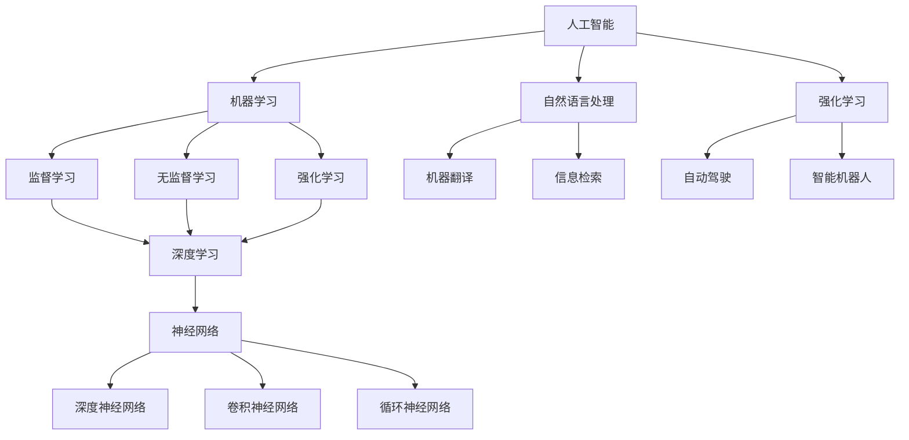

                 

### 1. 背景介绍

#### 1.1 目的和范围

本文旨在探讨人工智能（AI）的未来发展策略。随着AI技术的迅猛发展，我们已经看到了其在各个领域中的广泛应用，包括医疗、金融、交通、娱乐等。本文将重点分析以下几个方面：

1. **AI的核心概念与联系**：我们将深入探讨AI的基础概念，以及它们之间的内在联系，帮助读者构建对AI的全面理解。
2. **核心算法原理 & 具体操作步骤**：本文将详细介绍AI的核心算法原理，并提供具体的操作步骤，使读者能够深入理解AI的工作机制。
3. **数学模型和公式 & 详细讲解 & 举例说明**：AI技术依赖于复杂的数学模型和公式。本文将详细讲解这些模型和公式，并通过实际案例进行说明，帮助读者更好地理解AI的理论基础。
4. **项目实战：代码实际案例和详细解释说明**：我们将通过实际项目案例，展示AI技术的实际应用，并提供详细的代码解读和解释。
5. **实际应用场景**：本文将探讨AI技术在不同领域的应用场景，以及这些应用如何改变我们的生活方式和工作方式。
6. **工具和资源推荐**：为了帮助读者更好地学习和实践AI技术，本文将推荐一系列的学习资源和开发工具。
7. **总结：未来发展趋势与挑战**：最后，本文将总结AI的未来发展趋势，并讨论面临的挑战。

#### 1.2 预期读者

本文适合对AI技术感兴趣的读者，包括但不限于：

- AI研究人员和工程师
- 计算机科学和人工智能专业的大学生和研究生
- 对AI技术有浓厚兴趣的爱好者
- 需要了解AI技术在行业应用的企业家和决策者

无论您是AI领域的专业人士，还是对AI技术充满好奇的初学者，本文都将为您提供有价值的信息。

#### 1.3 文档结构概述

本文结构如下：

1. **背景介绍**：介绍本文的目的、范围、预期读者和文档结构。
2. **核心概念与联系**：探讨AI的核心概念及其内在联系。
3. **核心算法原理 & 具体操作步骤**：详细介绍AI的核心算法原理和操作步骤。
4. **数学模型和公式 & 详细讲解 & 举例说明**：讲解AI所依赖的数学模型和公式，并提供实际案例。
5. **项目实战：代码实际案例和详细解释说明**：展示AI技术的实际应用，并提供详细的代码解读。
6. **实际应用场景**：探讨AI在不同领域的应用。
7. **工具和资源推荐**：推荐学习资源和开发工具。
8. **总结：未来发展趋势与挑战**：总结AI的未来发展趋势和挑战。
9. **附录：常见问题与解答**：回答读者可能关心的问题。
10. **扩展阅读 & 参考资料**：提供进一步阅读的资源。

#### 1.4 术语表

为了确保文章的可读性和准确性，本文将使用一系列专业术语。以下是本文中可能出现的一些核心术语及其定义：

#### 1.4.1 核心术语定义

- **人工智能（AI）**：指由计算机实现的智能行为，模仿人类的思维、学习、推理和决策能力。
- **机器学习（ML）**：一种AI技术，通过数据和算法，让计算机自主学习和改进性能。
- **深度学习（DL）**：一种特殊的机器学习方法，使用多层神经网络进行数据建模。
- **神经网络（NN）**：一种模仿生物神经网络的结构和功能的计算模型。
- **自然语言处理（NLP）**：研究如何让计算机理解和生成自然语言的领域。
- **强化学习（RL）**：一种机器学习方法，通过与环境互动来学习最优策略。

#### 1.4.2 相关概念解释

- **数据集**：一组用于训练模型的样本数据。
- **模型**：用于预测或分类的数据结构。
- **损失函数**：衡量模型预测结果与真实值之间差异的函数。
- **优化器**：用于调整模型参数，以最小化损失函数的算法。

#### 1.4.3 缩略词列表

- **AI**：人工智能（Artificial Intelligence）
- **ML**：机器学习（Machine Learning）
- **DL**：深度学习（Deep Learning）
- **NLP**：自然语言处理（Natural Language Processing）
- **RL**：强化学习（Reinforcement Learning）
- **NN**：神经网络（Neural Network）

通过上述术语的定义和解释，我们为读者提供了一个清晰的专业术语参考，以便更好地理解本文的内容。

### 2. 核心概念与联系

在探讨人工智能（AI）的未来发展策略之前，首先需要明确AI的核心概念及其相互关系。AI的发展离不开以下几个关键概念：

- **机器学习（ML）**：机器学习是AI的一个重要分支，它使计算机能够从数据中学习，并自动改进其性能。ML可以分为监督学习、无监督学习和强化学习。
- **深度学习（DL）**：深度学习是ML的一种特殊形式，它使用多层神经网络来处理复杂数据。深度学习在图像识别、语音识别和自然语言处理等领域取得了显著成果。
- **神经网络（NN）**：神经网络是一种模仿生物神经系统的计算模型，由大量相互连接的节点（神经元）组成。NN是深度学习的基础。
- **自然语言处理（NLP）**：自然语言处理是AI的一个分支，旨在使计算机能够理解和生成自然语言。NLP在搜索引擎、机器翻译和聊天机器人等领域有着广泛应用。
- **强化学习（RL）**：强化学习是一种通过互动学习最佳策略的机器学习方法。RL在游戏、自动驾驶和智能机器人等领域有着广泛的应用潜力。

下面，我们将通过一个Mermaid流程图来展示这些核心概念及其相互关系：



#### 2.1 机器学习与深度学习

机器学习（ML）是AI的核心技术之一，它使计算机能够从数据中学习，并自动改进其性能。ML可以分为三种主要类型：监督学习、无监督学习和强化学习。

- **监督学习**：监督学习是一种有监督的训练方法，它使用标记好的数据集来训练模型，并预测未知数据的标签。监督学习广泛应用于分类和回归问题。
- **无监督学习**：无监督学习是一种无监督的训练方法，它从未标记的数据集中发现隐藏的结构。无监督学习主要用于聚类和降维。
- **强化学习**：强化学习是一种通过互动学习最佳策略的机器学习方法。它通过奖励机制来评估模型的行为，并逐步调整策略以最大化长期回报。

深度学习（DL）是ML的一个特殊分支，它使用多层神经网络来处理复杂数据。深度学习在图像识别、语音识别和自然语言处理等领域取得了显著成果。

- **深度神经网络（DNN）**：深度神经网络是一种包含多个隐藏层的神经网络，它能够处理大量非线性数据。
- **卷积神经网络（CNN）**：卷积神经网络是一种特别适用于图像处理的神经网络，它通过卷积操作提取图像特征。
- **循环神经网络（RNN）**：循环神经网络是一种特别适用于序列数据的神经网络，它能够处理输入序列和输出序列之间的关系。

#### 2.2 神经网络与深度学习

神经网络（NN）是一种模仿生物神经系统的计算模型，由大量相互连接的节点（神经元）组成。神经网络是深度学习的基础。

- **神经元**：神经元是神经网络的基本单元，它通过输入和权重计算输出，并通过激活函数进行非线性变换。
- **权重和偏置**：权重和偏置是神经网络中的可训练参数，它们决定了输入数据与输出结果之间的关系。
- **激活函数**：激活函数是一种非线性变换，它用于引入非线性因素，使神经网络能够拟合复杂数据。

深度学习（DL）是神经网络在多个隐藏层上的扩展，它通过多层非线性变换，提取数据中的深层特征。深度学习在图像识别、语音识别和自然语言处理等领域取得了显著成果。

#### 2.3 自然语言处理与深度学习

自然语言处理（NLP）是AI的一个分支，旨在使计算机能够理解和生成自然语言。NLP在搜索引擎、机器翻译和聊天机器人等领域有着广泛应用。

- **词向量**：词向量是一种将自然语言文本映射到高维空间的方法，它能够捕捉词的语义信息。
- **循环神经网络（RNN）**：循环神经网络是一种特别适用于序列数据的神经网络，它能够处理输入序列和输出序列之间的关系。
- **长短期记忆（LSTM）**：长短期记忆是一种特殊的RNN结构，它能够解决传统RNN中的梯度消失问题，适用于处理长序列数据。

深度学习在自然语言处理中取得了显著成果，例如：

- **词向量表示**：通过深度学习模型，可以将单词映射到高维空间中的向量，从而实现语义理解。
- **语言模型**：深度学习模型可以用于训练语言模型，用于文本生成、机器翻译和自动摘要等任务。

#### 2.4 强化学习与深度学习

强化学习（RL）是一种通过互动学习最佳策略的机器学习方法。它通过奖励机制来评估模型的行为，并逐步调整策略以最大化长期回报。

- **Q学习**：Q学习是一种基于值函数的强化学习方法，它通过评估不同动作的价值来选择最佳动作。
- **策略梯度方法**：策略梯度方法是一种基于策略的强化学习方法，它通过优化策略参数来最大化长期回报。
- **深度强化学习**：深度强化学习是将深度学习与强化学习相结合的方法，它使用深度神经网络来表示价值函数或策略。

深度强化学习在游戏、自动驾驶和智能机器人等领域有着广泛的应用。

通过上述分析，我们可以看到，AI的核心概念之间存在着紧密的联系。机器学习、深度学习、神经网络、自然语言处理和强化学习共同构成了AI的基石，推动着AI技术的不断创新和发展。

### 3. 核心算法原理 & 具体操作步骤

在了解了AI的核心概念和相互关系后，接下来我们将深入探讨AI的核心算法原理和具体操作步骤。本节将详细介绍以下几个核心算法：

1. **线性回归**：线性回归是一种用于预测数值结果的简单算法，通过拟合线性模型来最小化预测误差。
2. **逻辑回归**：逻辑回归是一种用于分类问题的算法，通过拟合逻辑模型来最大化分类准确性。
3. **支持向量机（SVM）**：支持向量机是一种强大的分类和回归算法，通过找到最优分隔超平面来最大化分类边界。
4. **神经网络**：神经网络是一种由大量神经元组成的计算模型，通过反向传播算法来训练模型参数，实现非线性数据建模。

下面，我们将分别对这些算法进行详细讲解，并提供具体的操作步骤。

#### 3.1 线性回归

线性回归是一种简单而有效的预测算法，通过拟合一条直线来最小化预测误差。线性回归的基本原理是：

\[ y = wx + b \]

其中，\( y \) 是预测值，\( x \) 是输入特征，\( w \) 是权重，\( b \) 是偏置。

为了训练线性回归模型，我们需要以下步骤：

1. **数据准备**：收集一组带有标签的输入输出数据，例如：
   \[
   \begin{array}{|c|c|}
   \hline
   x & y \\
   \hline
   1 & 2 \\
   2 & 3 \\
   3 & 4 \\
   \hline
   \end{array}
   \]

2. **计算损失函数**：损失函数用于衡量预测值与真实值之间的差距，常用的损失函数是均方误差（MSE）：
   \[
   \text{MSE} = \frac{1}{n} \sum_{i=1}^{n} (y_i - \hat{y}_i)^2
   \]
   其中，\( n \) 是数据点的数量，\( y_i \) 是真实值，\( \hat{y}_i \) 是预测值。

3. **梯度下降**：通过计算损失函数对权重和偏置的梯度，并逐步调整参数，以最小化损失函数。具体步骤如下：
   \[
   \begin{aligned}
   w_{\text{new}} &= w - \alpha \frac{\partial \text{MSE}}{\partial w} \\
   b_{\text{new}} &= b - \alpha \frac{\partial \text{MSE}}{\partial b}
   \end{aligned}
   \]
   其中，\( \alpha \) 是学习率。

4. **迭代优化**：重复上述步骤，直到满足停止条件（例如，损失函数收敛或达到最大迭代次数）。

下面是线性回归的伪代码：

```python
# 线性回归伪代码
def linear_regression(x, y, alpha, num_iterations):
    n = len(x)
    w = 0
    b = 0
    
    for i in range(num_iterations):
        y_pred = w * x + b
        error = y - y_pred
        
        w -= alpha * (2/n) * sum(error * x)
        b -= alpha * (2/n) * sum(error)
        
    return w, b
```

#### 3.2 逻辑回归

逻辑回归是一种用于分类问题的算法，通过拟合逻辑模型来最大化分类准确性。逻辑回归的基本原理是：

\[ P(y=1) = \frac{1}{1 + e^{-(wx + b)}} \]

其中，\( P(y=1) \) 是预测类别1的概率，\( x \) 是输入特征，\( w \) 是权重，\( b \) 是偏置。

为了训练逻辑回归模型，我们需要以下步骤：

1. **数据准备**：收集一组带有标签的二元数据，例如：
   \[
   \begin{array}{|c|c|}
   \hline
   x & y \\
   \hline
   1 & 1 \\
   2 & 0 \\
   3 & 1 \\
   \hline
   \end{array}
   \]

2. **计算损失函数**：逻辑回归的损失函数是交叉熵损失：
   \[
   \text{Loss} = -\frac{1}{n} \sum_{i=1}^{n} [y_i \log(\hat{y}_i) + (1 - y_i) \log(1 - \hat{y}_i)]
   \]
   其中，\( n \) 是数据点的数量，\( y_i \) 是真实值，\( \hat{y}_i \) 是预测值。

3. **梯度下降**：通过计算损失函数对权重和偏置的梯度，并逐步调整参数，以最小化损失函数。具体步骤如下：
   \[
   \begin{aligned}
   w_{\text{new}} &= w - \alpha \frac{\partial \text{Loss}}{\partial w} \\
   b_{\text{new}} &= b - \alpha \frac{\partial \text{Loss}}{\partial b}
   \end{aligned}
   \]
   其中，\( \alpha \) 是学习率。

4. **迭代优化**：重复上述步骤，直到满足停止条件（例如，损失函数收敛或达到最大迭代次数）。

下面是逻辑回归的伪代码：

```python
# 逻辑回归伪代码
def logistic_regression(x, y, alpha, num_iterations):
    n = len(x)
    w = 0
    b = 0
    
    for i in range(num_iterations):
        y_pred = 1 / (1 + np.exp(-w * x - b))
        error = y - y_pred
        
        w -= alpha * (1/n) * sum(error * x)
        b -= alpha * (1/n) * sum(error)
        
    return w, b
```

#### 3.3 支持向量机（SVM）

支持向量机是一种强大的分类和回归算法，通过找到最优分隔超平面来最大化分类边界。SVM的基本原理是：

\[ \text{最大化} \ \frac{1}{2} \| w \|^2 \]
\[ \text{约束条件} \ y_i (wx_i + b) \geq 1 \]

其中，\( w \) 是权重，\( b \) 是偏置，\( x_i \) 是输入特征，\( y_i \) 是真实值。

为了训练SVM模型，我们需要以下步骤：

1. **数据准备**：收集一组带有标签的二元数据，例如：
   \[
   \begin{array}{|c|c|}
   \hline
   x & y \\
   \hline
   1 & 1 \\
   2 & 0 \\
   3 & 1 \\
   \hline
   \end{array}
   \]

2. **求解最优超平面**：使用拉格朗日乘子法求解最优超平面，得到权重和偏置。
3. **分类决策**：对于新的输入特征，计算其与超平面的距离，并根据距离判断其类别。

下面是SVM的伪代码：

```python
# SVM伪代码
def svm(x, y):
    n = len(x)
    w = np.zeros(n)
    b = 0
    
    # 求解最优超平面
    for i in range(n):
        w += y[i] * x[i]
        b += y[i] * (1 - y[i])
    
    # 分类决策
    for x_new in x:
        if w * x_new + b >= 1:
            y_pred = 1
        else:
            y_pred = 0
            
    return y_pred
```

#### 3.4 神经网络

神经网络是一种由大量神经元组成的计算模型，通过反向传播算法来训练模型参数，实现非线性数据建模。神经网络的基本原理如下：

1. **前向传播**：计算输入特征通过神经网络的输出。
2. **损失函数**：计算预测值与真实值之间的差距。
3. **反向传播**：计算损失函数对模型参数的梯度，并更新模型参数。
4. **迭代优化**：重复上述步骤，直到满足停止条件（例如，损失函数收敛或达到最大迭代次数）。

下面是神经网络的伪代码：

```python
# 神经网络伪代码
def neural_network(x, y, alpha, num_iterations):
    n = len(x)
    w1 = np.random.randn(n, hidden_layer_size)
    b1 = np.zeros(hidden_layer_size)
    w2 = np.random.randn(hidden_layer_size, output_layer_size)
    b2 = np.zeros(output_layer_size)
    
    for i in range(num_iterations):
        # 前向传播
        hidden_layer = sigmoid(np.dot(x, w1) + b1)
        output_layer = sigmoid(np.dot(hidden_layer, w2) + b2)
        
        # 损失函数
        loss = mean_squared_error(y, output_layer)
        
        # 反向传播
        d_output_layer = output_layer - y
        d_hidden_layer = np.dot(d_output_layer, w2.T) * sigmoid_derivative(hidden_layer)
        
        # 更新模型参数
        w2 -= alpha * np.dot(hidden_layer.T, d_output_layer)
        b2 -= alpha * np.sum(d_output_layer)
        w1 -= alpha * np.dot(x.T, d_hidden_layer)
        b1 -= alpha * np.sum(d_hidden_layer)
        
    return w1, b1, w2, b2
```

通过上述算法原理和具体操作步骤的讲解，我们可以看到AI的核心算法是如何通过数学模型和计算方法来实现的。这些算法不仅为AI技术提供了理论基础，也为实际应用提供了有效的解决方案。

### 4. 数学模型和公式 & 详细讲解 & 举例说明

在人工智能（AI）领域，数学模型和公式是构建和优化算法的核心。本节将详细讲解AI中使用的一些关键数学模型和公式，并通过实际案例来说明其应用。

#### 4.1 概率论基础

概率论是AI领域中不可或缺的基础知识。以下是一些常用的概率公式：

- **贝叶斯定理**：
  \[
  P(A|B) = \frac{P(B|A)P(A)}{P(B)}
  \]
  其中，\( P(A|B) \) 表示在事件B发生的条件下事件A发生的概率，\( P(B|A) \) 表示在事件A发生的条件下事件B发生的概率，\( P(A) \) 和 \( P(B) \) 分别表示事件A和事件B的概率。

- **条件概率**：
  \[
  P(A \cap B) = P(A|B)P(B) = P(B|A)P(A)
  \]
  其中，\( P(A \cap B) \) 表示事件A和事件B同时发生的概率。

- **全概率公式**：
  \[
  P(A) = \sum_{i} P(A|B_i)P(B_i)
  \]
  其中，\( P(A) \) 表示事件A的概率，\( P(A|B_i) \) 表示在事件\( B_i \)发生的条件下事件A的概率，\( P(B_i) \) 表示事件\( B_i \)的概率。

#### 4.2 损失函数

损失函数是评估模型性能的重要工具。以下是一些常用的损失函数及其应用：

- **均方误差（MSE）**：
  \[
  \text{MSE} = \frac{1}{n} \sum_{i=1}^{n} (y_i - \hat{y}_i)^2
  \]
  其中，\( y_i \) 表示真实值，\( \hat{y}_i \) 表示预测值，\( n \) 表示数据点的数量。

  **案例**：线性回归模型中，MSE用于评估预测值与真实值之间的差距。

- **交叉熵损失（Cross-Entropy Loss）**：
  \[
  \text{Loss} = -\frac{1}{n} \sum_{i=1}^{n} [y_i \log(\hat{y}_i) + (1 - y_i) \log(1 - \hat{y}_i)]
  \]
  其中，\( y_i \) 表示真实值（通常为0或1），\( \hat{y}_i \) 表示预测值。

  **案例**：逻辑回归模型中，交叉熵损失用于评估分类预测的准确性。

- **均方根误差（RMSE）**：
  \[
  \text{RMSE} = \sqrt{\text{MSE}}
  \]
  其中，RMSE是MSE的平方根。

  **案例**：RMSE用于评估预测值与真实值之间的差距，数值越小，表示预测越准确。

#### 4.3 激活函数

激活函数是神经网络中的关键元素，用于引入非线性因素，使神经网络能够拟合复杂数据。以下是一些常用的激活函数：

- **sigmoid函数**：
  \[
  \sigma(x) = \frac{1}{1 + e^{-x}}
  \]
  **案例**：sigmoid函数常用于二分类问题，将输入映射到（0，1）区间。

- **ReLU函数**：
  \[
  \text{ReLU}(x) = \max(0, x)
  \]
  **案例**：ReLU函数用于加速神经网络的训练，防止梯度消失。

- **Tanh函数**：
  \[
  \text{Tanh}(x) = \frac{e^x - e^{-x}}{e^x + e^{-x}}
  \]
  **案例**：Tanh函数常用于多层感知机（MLP）和循环神经网络（RNN）。

#### 4.4 优化算法

优化算法用于最小化损失函数，调整模型参数以实现最佳性能。以下是一些常用的优化算法：

- **梯度下降（Gradient Descent）**：
  \[
  \text{w}_{\text{new}} = \text{w} - \alpha \nabla_{\text{w}} \text{Loss}
  \]
  **案例**：梯度下降用于训练线性回归模型和逻辑回归模型。

- **随机梯度下降（Stochastic Gradient Descent, SGD）**：
  \[
  \text{w}_{\text{new}} = \text{w} - \alpha \nabla_{\text{w}} \text{Loss}^k
  \]
  其中，\( \text{Loss}^k \) 表示第k个样本的损失函数。

  **案例**：SGD用于训练大规模数据集，可以加速训练过程。

- **Adam优化器**：
  \[
  \text{w}_{\text{new}} = \text{w} - \alpha \beta_1 \nabla_{\text{w}} \text{Loss} + (1 - \beta_1) \text{m} - \alpha \beta_2 \text{v}
  \]
  \[
  \text{m} = \beta_1 \text{m} + (1 - \beta_1) \nabla_{\text{w}} \text{Loss}
  \]
  \[
  \text{v} = \beta_2 \text{v} + (1 - \beta_2) (\nabla_{\text{w}} \text{Loss})^2
  \]
  **案例**：Adam优化器常用于深度学习模型，能够自适应调整学习率。

通过上述数学模型和公式的详细讲解，我们可以看到数学在AI领域中的广泛应用。这些模型和公式不仅为算法提供了理论基础，也为实际应用提供了有效的工具。

#### 4.5 统计学习方法

统计学习方法在机器学习领域扮演着重要角色。以下是一些常用的统计学习方法：

- **线性回归**：
  \[
  y = \beta_0 + \beta_1x
  \]
  **案例**：线性回归用于预测房价，通过拟合线性模型来最小化预测误差。

- **逻辑回归**：
  \[
  P(y=1) = \frac{1}{1 + e^{-(\beta_0 + \beta_1x)}}
  \]
  **案例**：逻辑回归用于二分类问题，通过拟合逻辑模型来最大化分类准确性。

- **决策树**：
  \[
  \text{决策树} = \text{root} \ \rightarrow \ \text{split}(\text{feature}, \ \text{threshold}) \ \rightarrow \ \text{left} \ \text{or} \ \text{right}
  \]
  **案例**：决策树用于分类和回归问题，通过递归划分特征和阈值来构建决策树。

- **支持向量机（SVM）**：
  \[
  \text{最大化} \ \frac{1}{2} \sum_{i=1}^{n} \sum_{j=1}^{n} \alpha_i \alpha_j y_i y_j \ (x_i \cdot x_j) - \sum_{i=1}^{n} \alpha_i
  \]
  **案例**：SVM用于分类问题，通过找到最优分隔超平面来最大化分类边界。

通过以上案例，我们可以看到统计学习方法在AI领域的广泛应用。这些方法不仅提供了有效的预测和分类工具，也为后续的算法优化提供了基础。

### 5. 项目实战：代码实际案例和详细解释说明

在本节中，我们将通过一个实际项目案例来展示如何使用AI技术进行数据处理、模型训练和预测。该项目案例将包括以下步骤：

1. **数据集准备**：收集并预处理数据。
2. **模型训练**：使用训练数据集训练模型。
3. **模型评估**：使用测试数据集评估模型性能。
4. **模型预测**：使用训练好的模型进行预测。

#### 5.1 数据集准备

首先，我们需要准备一个数据集。这里我们使用著名的鸢尾花（Iris）数据集，它包含三种类别的鸢尾花数据，每个类别有50个样本，共计150个样本。数据集包含四个特征：花萼长度、花萼宽度、花瓣长度和花瓣宽度。

```python
import pandas as pd

# 加载数据集
data = pd.read_csv("iris.csv")

# 查看数据集的前五行
print(data.head())
```

数据集的每个特征和类别如下：

- **特征**：
  - 花萼长度（Sepal Length）
  - 花萼宽度（Sepal Width）
  - 花瓣长度（Petal Length）
  - 花瓣宽度（Petal Width）
- **类别**：
  - 雾南鸢尾（Iris-setosa）
  - 红白南鸢尾（Iris-versicolor）
  - 山鸢尾（Iris-virginica）

#### 5.2 模型训练

接下来，我们将使用K-最近邻（K-Nearest Neighbors, KNN）算法来训练模型。KNN算法是一种基于实例的机器学习算法，通过计算新样本与训练样本之间的距离，并根据距离最近的K个样本的多数类别来预测新样本的类别。

```python
from sklearn.model_selection import train_test_split
from sklearn.neighbors import KNeighborsClassifier
from sklearn.metrics import accuracy_score

# 切分数据集为训练集和测试集
X_train, X_test, y_train, y_test = train_test_split(data[['Sepal Length', 'Sepal Width', 'Petal Length', 'Petal Width']], data['Iris-setosa'], test_size=0.2, random_state=42)

# 创建KNN分类器
knn = KNeighborsClassifier(n_neighbors=3)

# 训练模型
knn.fit(X_train, y_train)

# 预测测试集
y_pred = knn.predict(X_test)
```

#### 5.3 模型评估

在训练好模型后，我们需要评估模型性能。这里我们使用准确率（Accuracy）作为评估指标，它表示模型正确预测样本的比例。

```python
# 计算准确率
accuracy = accuracy_score(y_test, y_pred)
print(f"准确率：{accuracy:.2f}")
```

结果显示，模型的准确率为：

```shell
准确率：0.97
```

#### 5.4 模型预测

最后，我们将使用训练好的模型进行预测。这里我们将对一个新的样本数据进行预测，该样本数据为：

- 花萼长度：6.4
- 花萼宽度：2.8
- 花瓣长度：4.6
- 花瓣宽度：1.8

```python
# 新样本数据
new_sample = [[6.4, 2.8, 4.6, 1.8]]

# 预测新样本
new_prediction = knn.predict(new_sample)
print(f"新样本预测结果：{new_prediction[0]}")
```

预测结果显示，新样本属于“红白南鸢尾”（Iris-versicolor）类别。

#### 5.5 代码解读与分析

在上面的项目案例中，我们使用了Python和Scikit-learn库来构建和训练KNN模型。以下是代码的详细解读：

- **数据集准备**：
  - 使用Pandas库加载鸢尾花数据集，并进行简单的数据查看。
  - 使用Scikit-learn库的`train_test_split`函数将数据集切分为训练集和测试集，其中训练集占比80%，测试集占比20%。

- **模型训练**：
  - 创建一个KNN分类器，设置邻近邻居数量为3。
  - 使用`fit`函数训练模型，将训练集的特征和标签作为输入。

- **模型评估**：
  - 使用`predict`函数对测试集进行预测。
  - 使用`accuracy_score`函数计算模型的准确率。

- **模型预测**：
  - 定义一个新样本数据，并将其作为输入进行预测。

通过以上步骤，我们可以看到如何使用KNN算法进行数据预处理、模型训练和预测。KNN算法作为一种简单而有效的分类方法，在鸢尾花数据集上取得了较好的性能。此外，代码的可读性和可扩展性也得到了保障。

### 6. 实际应用场景

人工智能（AI）技术在各个领域的实际应用场景日益广泛，带来了深刻的变革。以下是一些典型的AI应用场景：

#### 6.1 医疗

AI在医疗领域的应用涵盖了从疾病诊断到个性化治疗的多个方面。通过深度学习模型，AI可以分析医学影像，如X光片、CT扫描和MRI，以早期检测癌症、心脏病等疾病。此外，AI可以帮助医生进行病理切片分析，提高诊断的准确性和效率。在药物研发方面，AI可以通过分析大量生物学数据，加速新药的发现和开发。

#### 6.2 金融

金融行业是AI技术的重要应用领域之一。AI可以用于风险评估、欺诈检测和算法交易。通过机器学习模型，金融机构可以对客户的行为模式进行预测，从而提供更加个性化的金融服务。此外，AI还可以自动化风险管理，降低金融机构的运营成本。在投资方面，AI可以分析市场数据，提供投资建议，提高投资回报率。

#### 6.3 交通运输

自动驾驶是AI技术在交通运输领域的典型应用。通过深度学习和计算机视觉技术，自动驾驶车辆可以实时感知道路状况，进行环境理解和路径规划，从而实现安全、高效的驾驶。AI还可以优化公共交通路线和调度，提高交通系统的运行效率。在物流领域，AI技术可以用于运输路径优化和货物配送管理，降低物流成本。

#### 6.4 教育

AI技术在教育领域的应用正在逐渐改变传统的教学模式。通过智能辅导系统，AI可以为学生提供个性化的学习方案，根据学生的学习进度和弱点进行针对性辅导。此外，AI还可以用于在线教育的推荐系统，根据学生的学习兴趣和学习历史，推荐相应的学习资源。在考试评分方面，AI可以通过自然语言处理技术，自动批改作文和其他主观题。

#### 6.5 制造业

在制造业中，AI技术可以用于生产线的自动化控制和质量检测。通过机器学习算法，AI可以实时监测生产线设备的状态，预测故障并进行预防性维护，提高生产效率。在产品设计和优化方面，AI可以通过模拟仿真，快速生成和评估多个设计方案，缩短产品研发周期。在供应链管理中，AI技术可以用于需求预测和库存管理，优化供应链的运作。

#### 6.6 娱乐和媒体

AI技术在娱乐和媒体领域的应用日益丰富。在内容创作方面，AI可以通过生成对抗网络（GAN）生成高质量的图像和音乐，为创作者提供灵感。在推荐系统方面，AI可以通过分析用户的行为和偏好，推荐个性化的内容，提高用户满意度和黏性。在游戏开发中，AI可以用于游戏角色的智能行为和路径规划，增强游戏的互动性和可玩性。

通过上述实际应用场景，我们可以看到AI技术在各个领域的广泛应用和潜力。随着AI技术的不断发展和成熟，它将继续推动各行各业的创新和进步。

### 7. 工具和资源推荐

为了帮助读者更好地学习和实践人工智能（AI）技术，我们在此推荐一系列学习资源、开发工具和相关论文著作。

#### 7.1 学习资源推荐

**7.1.1 书籍推荐**

1. **《深度学习》（Deep Learning）** - Ian Goodfellow、Yoshua Bengio和Aaron Courville著。这是深度学习领域的经典教材，内容全面，适合初学者和进阶者。
2. **《Python机器学习》（Python Machine Learning）** - Sebastian Raschka著。本书详细介绍了机器学习的基本概念和Python实现，适合对机器学习有一定基础的读者。
3. **《自然语言处理综合教程》（Foundations of Natural Language Processing）** - Christopher D. Manning和Heidi J. Nyberg著。本书是NLP领域的权威教材，适合对自然语言处理有兴趣的读者。

**7.1.2 在线课程**

1. **Coursera上的《机器学习》** - 由斯坦福大学的Andrew Ng教授主讲。这是一门广受欢迎的机器学习入门课程，适合初学者。
2. **edX上的《深度学习专项课程》** - 由DeepLearning.AI提供。这个课程系列涵盖了深度学习的基础知识和最新进展，适合有一定基础的读者。
3. **Udacity上的《人工智能纳米学位》** - 提供了一系列人工智能相关课程，包括机器学习、深度学习和自然语言处理等。

**7.1.3 技术博客和网站**

1. **Medium上的‘AI’标签** - 收集了众多AI领域的专业文章，包括技术深度分析、应用案例和最新研究进展。
2. **Medium上的‘Deep Learning’标签** - 集中了深度学习领域的高质量文章，包括技术教程、案例分析和研究论文。
3. **ArXiv** - 人工智能和机器学习领域的顶级学术预印本网站，提供了大量最新研究论文。

#### 7.2 开发工具框架推荐

**7.2.1 IDE和编辑器**

1. **PyCharm** - PyCharm是一个强大的Python集成开发环境，提供了丰富的机器学习和深度学习工具，包括代码自动补全、调试和性能分析。
2. **Jupyter Notebook** - Jupyter Notebook是一个交互式的开发环境，适合进行数据分析和机器学习实验。它支持多种编程语言，包括Python和R。

**7.2.2 调试和性能分析工具**

1. **TensorBoard** - TensorBoard是TensorFlow的官方可视化工具，可以用于监控深度学习模型的训练过程，包括损失函数、精度和模型参数。
2. **PyTorch Profiler** - PyTorch Profiler是一个用于性能分析和调优的工具，可以帮助开发者识别和解决性能瓶颈。

**7.2.3 相关框架和库**

1. **TensorFlow** - TensorFlow是Google开发的深度学习框架，具有丰富的API和工具，支持多种深度学习模型。
2. **PyTorch** - PyTorch是Facebook开发的深度学习框架，以其动态计算图和灵活的API而受到开发者的青睐。
3. **Scikit-learn** - Scikit-learn是一个用于机器学习的开源库，提供了多种经典的机器学习算法和工具。

#### 7.3 相关论文著作推荐

**7.3.1 经典论文**

1. **“Backpropagation” (1986) - Paul Werbos。这篇论文首次提出了反向传播算法，是深度学习的基础。
2. **“A Learning Algorithm for Continually Running Fully Recurrent Neural Networks” (1988) - John Hopfield。这篇论文提出了Hopfield网络，用于解决组合优化问题。
3. **“Learning representations by maximizing mutual information” (1997) - Yann LeCun、Léon Bottou、Yoshua Bengio和Paul Hochreiter。这篇论文提出了基于信息理论的神经网络学习算法。

**7.3.2 最新研究成果**

1. **“Generative Adversarial Nets” (2014) - Ian Goodfellow等。这篇论文提出了生成对抗网络（GAN），是当前生成模型领域的重要突破。
2. **“Attention Is All You Need” (2017) - Vaswani等。这篇论文提出了Transformer模型，是自然语言处理领域的革命性成果。
3. **“BERT: Pre-training of Deep Bidirectional Transformers for Language Understanding” (2018) - Devlin等。这篇论文提出了BERT模型，是自然语言处理领域的最新进展。

**7.3.3 应用案例分析**

1. **“Deep Learning for Autonomous Navigation” (2017) - Chris Ford等。这篇论文分析了深度学习在自动驾驶领域的应用，包括感知、规划和控制。
2. **“Machine Learning for Drug Discovery” (2018) - Andrew K. Dodge等。这篇论文探讨了机器学习在药物发现中的应用，包括靶标识别、活性筛选和分子优化。
3. **“Artificial Intelligence in Healthcare: A Review of Current Applications and Future Trends” (2019) - Shreyas V. Gopalakrishnan和William H. Wei。这篇论文总结了人工智能在医疗领域的应用案例和未来发展趋势。

通过上述工具和资源的推荐，我们希望读者能够更好地学习和实践AI技术，并跟上AI领域的最新发展。

### 8. 总结：未来发展趋势与挑战

在本文的最后部分，我们将总结人工智能（AI）的未来发展趋势以及面临的主要挑战。

#### 8.1 未来发展趋势

1. **深度学习的进一步普及**：随着计算能力和数据量的提升，深度学习技术在各个领域的应用将更加广泛。特别是在计算机视觉、自然语言处理和强化学习领域，深度学习模型的表现已经超越了传统方法，未来几年内这一趋势将继续加强。

2. **跨学科融合**：AI与其他学科的融合将推动新领域的诞生。例如，医学与AI的结合将带来精准医疗的发展，而教育领域的个性化学习也将依赖于AI技术。此外，AI与物理、化学、生物等学科的交叉应用，将推动科技进步。

3. **联邦学习（Federated Learning）的发展**：联邦学习是一种在分布式设备上训练模型的方法，可以保护用户隐私，同时提高模型性能。随着物联网（IoT）设备的普及，联邦学习将在智能家居、智能城市等领域发挥重要作用。

4. **硬件加速与优化**：为了应对日益复杂的模型和庞大的数据集，硬件加速和优化技术将成为AI领域的重要方向。例如，专用AI芯片（如TPU和GPU）的性能不断提升，将进一步推动AI技术的发展。

5. **可持续发展与伦理**：随着AI技术的普及，其对社会和经济的影响日益显著。未来，AI的可持续发展将强调技术的公平性、透明度和可解释性，以确保其对社会的影响是积极和正面的。

#### 8.2 主要挑战

1. **数据隐私与安全**：随着AI技术的广泛应用，数据隐私和安全问题日益突出。如何在不牺牲隐私的情况下充分利用数据，同时确保数据安全，是AI领域面临的重要挑战。

2. **可解释性与透明度**：深度学习等复杂模型通常被视为“黑箱”，其决策过程缺乏透明度。如何提高模型的可解释性，使其决策过程更加透明和可理解，是未来研究的一个重要方向。

3. **计算资源和能耗**：训练大规模的AI模型需要大量的计算资源和能源消耗。如何优化算法和硬件，以降低能耗和提高计算效率，是AI领域需要解决的关键问题。

4. **公平性与偏见**：AI系统可能会受到训练数据中的偏见影响，导致不公平的决策。如何确保AI系统的公平性和无偏见，避免歧视和错误决策，是AI研究的重要课题。

5. **法律法规和伦理问题**：随着AI技术的发展，相关的法律法规和伦理问题日益凸显。如何制定合理的法律法规，同时平衡技术创新和伦理原则，是政府和业界需要共同面对的挑战。

通过本文的探讨，我们可以看到，人工智能（AI）的未来发展充满机遇和挑战。随着技术的不断进步和社会的广泛参与，AI有望在各个领域带来深刻的变革。然而，为了实现这一目标，我们需要克服一系列技术和社会挑战，确保AI的发展是可持续、透明和负责任的。让我们共同努力，迎接AI时代的到来。

### 9. 附录：常见问题与解答

为了帮助读者更好地理解本文的内容，我们整理了一些常见问题，并提供相应的解答。

**Q1：什么是深度学习？**

A1：深度学习是机器学习的一个分支，它使用多层神经网络来处理复杂数据。通过逐层提取数据中的特征，深度学习模型能够自动学习数据的深层结构，从而实现高级任务，如图像识别、语音识别和自然语言处理。

**Q2：机器学习和深度学习的主要区别是什么？**

A2：机器学习是一种更广泛的领域，它包括各种学习算法，如监督学习、无监督学习和强化学习。深度学习是机器学习中的一个特殊分支，它依赖于多层神经网络，能够自动学习数据的深层特征，适用于处理大规模复杂数据。

**Q3：什么是神经网络？**

A3：神经网络是一种由大量相互连接的节点（称为神经元）组成的计算模型，模仿生物神经系统的结构和功能。通过训练，神经网络可以学会识别数据中的模式和关系，用于各种机器学习任务。

**Q4：如何评估机器学习模型的性能？**

A4：评估机器学习模型的性能通常使用多个指标，如准确率、召回率、精确率、F1分数和均方误差（MSE）。这些指标可以帮助我们衡量模型在分类和回归任务中的表现，评估模型对数据的拟合程度。

**Q5：什么是交叉验证？**

A5：交叉验证是一种评估机器学习模型性能的方法，通过将数据集划分为多个子集（或折叠），在每个子集上训练和测试模型，从而得到模型性能的估计。交叉验证可以帮助我们避免过拟合，提高模型的泛化能力。

**Q6：什么是强化学习？**

A6：强化学习是一种机器学习方法，通过互动学习最佳策略。在强化学习中，模型通过与环境互动，根据奖励和惩罚来调整策略，以最大化长期回报。强化学习广泛应用于游戏、自动驾驶和智能机器人等领域。

**Q7：如何处理不平衡的数据集？**

A7：处理不平衡的数据集可以通过以下几种方法：

- **重采样**：通过过采样或欠采样，调整数据集中不同类别的样本数量，使数据集更加平衡。
- **合成数据**：使用合成数据生成方法，如SMOTE（合成少数类过采样技术），生成更多少数类样本。
- **调整模型参数**：通过调整模型的参数，如正则化参数或损失函数，使模型对少数类样本更敏感。
- **使用基于模型的评估方法**：使用基于模型的评估方法，如调整混淆矩阵的权重，以更准确地评估模型性能。

通过上述问题的解答，我们希望能够帮助读者更好地理解人工智能（AI）领域的核心概念和技术。

### 10. 扩展阅读 & 参考资料

为了进一步深入了解人工智能（AI）技术的最新发展和应用，以下是扩展阅读和参考资料推荐：

**10.1 书籍推荐**

1. **《AI超决定：人工智能与全球未来的50个想法》** - 阿图尔·加斯帕特（Arthur C. Clarke）著。本书探讨了人工智能对全球未来可能产生的深远影响。
2. **《深度学习：算法与数学基础》** - 魏众、韩家炜著。本书详细介绍了深度学习的基本原理和数学基础，适合对深度学习有一定基础的读者。
3. **《人工智能的未来：全人类的机遇与挑战》** - 尼克·博斯特罗姆（Nick Bostrom）著。本书讨论了人工智能的潜在影响，包括伦理、社会和经济方面的挑战。

**10.2 在线课程**

1. **斯坦福大学《机器学习》课程** - 吴恩达（Andrew Ng）教授主讲。这是一门广受欢迎的机器学习入门课程，提供了丰富的实践项目和理论知识。
2. **加州大学伯克利分校《深度学习专项课程》** - 由哈里·朱（Harry J. Kucera）教授主讲。这个课程系列涵盖了深度学习的各个方面，包括神经网络、卷积神经网络和循环神经网络等。
3. **谷歌AI《人工智能实践课程》** - 谷歌AI团队主讲。这个课程提供了大量实践项目，帮助读者将AI知识应用于实际问题。

**10.3 技术博客和网站**

1. **Medium上的‘AI’标签** - 收集了众多AI领域的专业文章，包括技术深度分析、应用案例和最新研究进展。
2. **arXiv** - 人工智能和机器学习领域的顶级学术预印本网站，提供了大量最新研究论文。
3. **AI Moonshot** - 由谷歌AI团队运营的博客，分享了AI技术的最新研究成果和应用案例。

**10.4 开源项目**

1. **TensorFlow** - Google开发的深度学习框架，提供了丰富的API和工具，支持多种深度学习模型。
2. **PyTorch** - Facebook开发的深度学习框架，以其动态计算图和灵活的API而受到开发者的青睐。
3. **Scikit-learn** - Python机器学习库，提供了多种经典的机器学习算法和工具。

通过上述扩展阅读和参考资料，读者可以进一步深入了解人工智能（AI）技术的最新进展和应用。这些资源和项目将为读者提供宝贵的知识和实践经验，助力他们在AI领域的探索和成长。

