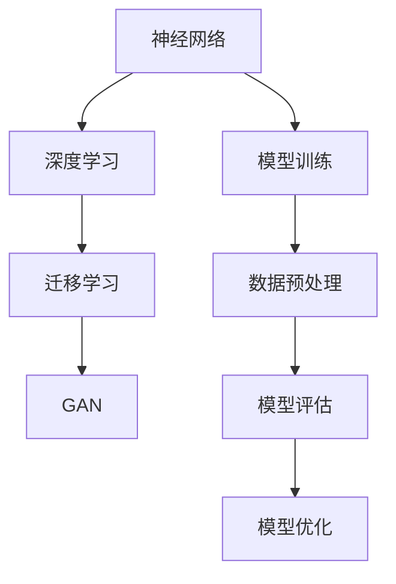
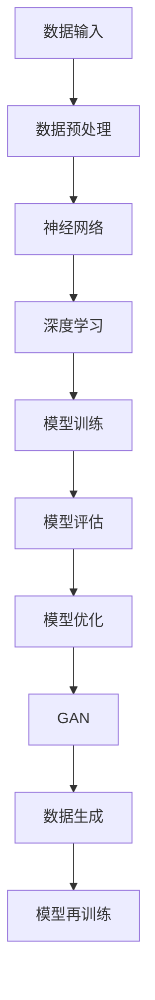

                 


# Andrej Karpathy：人工智能的未来发展策略

> 关键词：Andrej Karpathy、人工智能、未来发展趋势、策略分析、技术深度解析

> 摘要：本文将深入探讨人工智能（AI）领域大师Andrej Karpathy对未来AI发展的观点和策略。文章分为多个部分，包括背景介绍、核心概念与联系、算法原理、数学模型、项目实战、实际应用场景、工具和资源推荐以及总结和未来展望。通过逐步分析推理，本文旨在为读者提供一个全面而深入的理解，以把握AI的未来发展脉络。

## 1. 背景介绍

### 1.1 目的和范围

本文的目的是梳理并深入分析AI领域专家Andrej Karpathy对于人工智能未来发展的见解和策略。通过回顾其过往的研究成果和公开演讲，我们将提取出核心观点，并结合最新的技术动态进行解读，旨在为读者提供一份关于AI未来发展的指南。

### 1.2 预期读者

本文面向对人工智能有浓厚兴趣的读者，包括AI研究者、开发者、学生以及那些希望了解AI未来趋势的企业家和投资者。同时，本文也适合对技术有深刻理解但未深入AI领域的专业人士。

### 1.3 文档结构概述

本文结构如下：

1. 背景介绍
   - 目的和范围
   - 预期读者
   - 文档结构概述
   - 术语表
2. 核心概念与联系
   - AI核心概念介绍
   - Mermaid流程图
3. 核心算法原理 & 具体操作步骤
   - 算法原理伪代码
4. 数学模型和公式 & 详细讲解 & 举例说明
   - latex数学公式
5. 项目实战：代码实际案例和详细解释说明
   - 开发环境搭建
   - 源代码实现
   - 代码解读与分析
6. 实际应用场景
7. 工具和资源推荐
   - 学习资源
   - 开发工具框架
   - 论文著作
8. 总结：未来发展趋势与挑战
9. 附录：常见问题与解答
10. 扩展阅读 & 参考资料

### 1.4 术语表

#### 1.4.1 核心术语定义

- **人工智能（AI）**：模拟人类智能行为的计算机系统。
- **深度学习（Deep Learning）**：一种人工智能方法，通过多层神经网络来模拟人脑处理信息的方式。
- **神经网络（Neural Network）**：由大量简单处理单元（神经元）组成的信息处理网络。
- **数据驱动方法（Data-Driven Approach）**：依赖大量数据来训练和优化模型的策略。
- **强化学习（Reinforcement Learning）**：通过奖励机制来训练智能体在特定环境中做出最优决策。

#### 1.4.2 相关概念解释

- **神经网络架构搜索（Neural Architecture Search）**：自动化搜索最佳神经网络架构的方法。
- **迁移学习（Transfer Learning）**：将预训练模型应用于新任务，提高学习效率和性能。
- **生成对抗网络（GAN）**：一种通过竞争性训练生成复杂数据的模型。
- **可解释性（Explainability）**：使AI系统的决策过程可以被理解和解释的能力。

#### 1.4.3 缩略词列表

- **GAN**：生成对抗网络（Generative Adversarial Network）
- **DNN**：深度神经网络（Deep Neural Network）
- **RNN**：循环神经网络（Recurrent Neural Network）
- **CNN**：卷积神经网络（Convolutional Neural Network）
- **RL**：强化学习（Reinforcement Learning）

## 2. 核心概念与联系

在探讨Andrej Karpathy对未来AI发展的策略之前，我们需要了解一些核心概念和它们之间的联系。

### 2.1 AI核心概念介绍

AI的核心概念包括：

- **神经网络**：模拟人脑的神经网络，由大量的简单处理单元（神经元）组成。
- **深度学习**：使用多层神经网络来进行复杂的信息处理和学习。
- **迁移学习**：利用预训练模型来快速适应新任务。
- **生成对抗网络（GAN）**：通过竞争性训练生成真实数据。

### 2.2 Mermaid流程图

为了更好地理解这些概念之间的联系，我们可以使用Mermaid流程图来展示它们：



### 2.3 AI系统架构图

以下是一个简化的AI系统架构图，展示了各个组件之间的关系：



通过上述流程图和架构图，我们可以看到AI系统从数据输入到模型训练、评估和优化的完整过程，以及GAN在其中扮演的重要角色。

## 3. 核心算法原理 & 具体操作步骤

### 3.1 算法原理

AI系统中的核心算法主要包括神经网络、深度学习、迁移学习和生成对抗网络（GAN）。

#### 3.1.1 神经网络原理

神经网络（Neural Network）是一种由大量简单处理单元（神经元）组成的信息处理网络。每个神经元接收多个输入信号，通过权重进行加权求和，然后通过激活函数产生输出。以下是神经网络的简单伪代码：

```python
# 神经元类
class Neuron:
    def __init__(self):
        self.inputs = []
        self.weights = []
        self.bias = 0
        self.output = 0
    
    def forward(self, inputs):
        weighted_sum = sum(w * i for w, i in zip(self.weights, inputs)) + self.bias
        self.output = self ActivationFunction(weighted_sum)
    
    def ActivationFunction(self, x):
        # 例如使用ReLU函数
        return max(0, x)
```

#### 3.1.2 深度学习原理

深度学习（Deep Learning）是通过多层神经网络来进行复杂的信息处理和学习。在深度学习中，每一层的输出作为下一层的输入，通过逐层提取特征来进行学习。以下是深度学习的简单伪代码：

```python
# 深度学习模型
class DeepLearningModel:
    def __init__(self):
        self.layers = []
    
    def forward(self, inputs):
        current_output = inputs
        for layer in self.layers:
            current_output = layer.forward(current_output)
        return current_output
    
    def backward(self, gradients):
        # 反向传播，计算梯度
        pass
```

#### 3.1.3 迁移学习原理

迁移学习（Transfer Learning）是利用预训练模型来快速适应新任务。通过在预训练模型的基础上进行微调，可以大大提高学习效率和性能。以下是迁移学习的简单伪代码：

```python
# 迁移学习
class TransferLearning:
    def __init__(self, pre_trained_model, new_task):
        self.model = pre_trained_model
        self.new_task = new_task
    
    def fine_tune(self):
        # 在新任务上微调模型
        pass
```

#### 3.1.4 生成对抗网络（GAN）原理

生成对抗网络（GAN）是由生成器（Generator）和判别器（Discriminator）组成的模型。生成器生成数据，判别器判断数据是真实还是生成的。通过两者的竞争训练，生成器逐渐生成更真实的数据。以下是GAN的简单伪代码：

```python
# 生成对抗网络
class GAN:
    def __init__(self):
        self.generator = Generator()
        self.discriminator = Discriminator()
    
    def train(self):
        for _ in range(num_epochs):
            # 生成器生成数据
            fake_data = self.generator.generate_data()
            # 判别器判断生成数据和真实数据
            real_data = self.get_real_data()
            self.discriminator.train(fake_data, real_data)
            # 生成器更新参数
            self.generator.update_params()
```

### 3.2 具体操作步骤

以下是AI系统的具体操作步骤：

1. **数据预处理**：对数据进行清洗、归一化和特征提取，使其适合输入到神经网络。
2. **模型构建**：根据任务需求构建神经网络模型，包括选择适当的层数、神经元数目和激活函数。
3. **模型训练**：使用训练数据对模型进行训练，通过反向传播算法更新模型参数。
4. **模型评估**：使用验证数据对训练好的模型进行评估，检查其性能和准确性。
5. **模型优化**：根据评估结果对模型进行调整和优化，以提高其性能。
6. **迁移学习**：如果存在预训练模型，可以对其进行微调，快速适应新任务。
7. **模型部署**：将训练好的模型部署到生产环境中，进行实际应用。

通过上述步骤，我们可以构建一个完整的AI系统，从数据预处理到模型训练、评估和部署，实现自动化的信息处理和决策。

## 4. 数学模型和公式 & 详细讲解 & 举例说明

### 4.1 数学模型

在AI系统中，数学模型起到了核心作用。以下是一些常用的数学模型和它们的公式：

#### 4.1.1 神经元激活函数

神经元激活函数用于确定神经元的输出。常用的激活函数包括：

- **ReLU函数**：
  $$
  f(x) = \max(0, x)
  $$

- **Sigmoid函数**：
  $$
  f(x) = \frac{1}{1 + e^{-x}}
  $$

- **Tanh函数**：
  $$
  f(x) = \frac{e^x - e^{-x}}{e^x + e^{-x}}
  $$

#### 4.1.2 前向传播和反向传播

前向传播和反向传播是神经网络训练中的两个关键步骤。以下是它们的数学公式：

- **前向传播**：
  $$
  z^{[l]} = \sum_{i} w^{[l]}_{ij} a^{[l-1]}_i + b^{[l]}
  $$
  $$
  a^{[l]} = \text{ActivationFunction}(z^{[l]})
  $$

- **反向传播**：
  $$
  \delta^{[l]} = (a^{[l]} - y) \odot \text{Derivative}(\text{ActivationFunction}(z^{[l]}))
  $$
  $$
  \delta^{[l-1]} = \frac{\partial L}{\partial z^{[l-1]}} \odot w^{[l]}_{ij}
  $$
  $$
  w^{[l]}_{ij} := w^{[l]}_{ij} - \alpha \cdot \delta^{[l]} \cdot a^{[l-1]}_i
  $$
  $$
  b^{[l]} := b^{[l]} - \alpha \cdot \delta^{[l]}
  $$

#### 4.1.3 优化算法

优化算法用于更新神经网络模型中的参数，以最小化损失函数。以下是一些常用的优化算法：

- **随机梯度下降（SGD）**：
  $$
  w^{[l]}_{ij} := w^{[l]}_{ij} - \alpha \cdot \delta^{[l]} \cdot x_i
  $$
  $$
  b^{[l]} := b^{[l]} - \alpha \cdot \delta^{[l]}
  $$

- **Adam优化器**：
  $$
  m_t = \beta_1 m_{t-1} + (1 - \beta_1) \cdot \delta^{[l]}
  $$
  $$
  v_t = \beta_2 v_{t-1} + (1 - \beta_2) \cdot (\delta^{[l]}^2)
  $$
  $$
  \hat{m}_t = \frac{m_t}{1 - \beta_1^t}
  $$
  $$
  \hat{v}_t = \frac{v_t}{1 - \beta_2^t}
  $$
  $$
  w^{[l]}_{ij} := w^{[l]}_{ij} - \alpha \cdot \hat{m}_t / \sqrt{\hat{v}_t}
  $$
  $$
  b^{[l]} := b^{[l]} - \alpha \cdot \hat{m}_t / \sqrt{\hat{v}_t}
  $$

### 4.2 详细讲解与举例说明

#### 4.2.1 神经元激活函数

激活函数是神经网络中的关键组成部分，用于将神经元的输入转换为输出。以下是一个ReLU函数的例子：

```python
import numpy as np

def ReLU(x):
    return np.max(0, x)

x = np.array([1, -2, 3])
y = ReLU(x)
print(y)  # 输出：[1 0 3]
```

#### 4.2.2 前向传播和反向传播

以下是一个简单的神经网络前向传播和反向传播的例子：

```python
import numpy as np

# 前向传播
def forwardPropagation(x, weights, biases):
    z = np.dot(x, weights) + biases
    a = np.maximum(0, z)
    return a

# 反向传播
def backwardPropagation(a, y, weights, biases):
    delta = (a - y) * (1 - np.square(a))
    return delta

# 示例
x = np.array([1, 2, 3])
weights = np.array([[1, 2], [3, 4]])
biases = np.array([1, 2])
a = forwardPropagation(x, weights, biases)
delta = backwardPropagation(a, y, weights, biases)
```

#### 4.2.3 优化算法

以下是一个使用Adam优化器的例子：

```python
import numpy as np

alpha = 0.001
beta1 = 0.9
beta2 = 0.999
epsilon = 1e-8

# 初始化参数
m = np.zeros_like(weights)
v = np.zeros_like(weights)
t = 0

# 前向传播
def forwardPropagation(x, weights, biases):
    z = np.dot(x, weights) + biases
    a = np.maximum(0, z)
    return a

# 反向传播
def backwardPropagation(a, y, weights, biases):
    delta = (a - y) * (1 - np.square(a))
    return delta

# 更新参数
def updateParams(weights, biases, m, v, delta, x, t):
    global beta1, beta2, epsilon
    
    mt = beta1 * m + (1 - beta1) * delta
    vt = beta2 * v + (1 - beta2) * np.square(delta)
    
    t += 1
    m_hat = mt / (1 - np.power(beta1, t))
    v_hat = vt / (1 - np.power(beta2, t))
    
    weights = weights - alpha * m_hat / (np.sqrt(v_hat) + epsilon)
    biases = biases - alpha * m_hat / (np.sqrt(v_hat) + epsilon)
    
    return weights, biases

# 示例
x = np.array([1, 2, 3])
weights = np.array([[1, 2], [3, 4]])
biases = np.array([1, 2])
a = forwardPropagation(x, weights, biases)
delta = backwardPropagation(a, y, weights, biases)
weights, biases = updateParams(weights, biases, m, v, delta, x, t)
```

通过上述例子，我们可以看到如何使用数学模型和公式来构建和训练神经网络，以及如何使用优化算法来更新模型参数。

## 5. 项目实战：代码实际案例和详细解释说明

### 5.1 开发环境搭建

在进行AI项目的实战之前，我们需要搭建一个合适的开发环境。以下是一个简单的步骤指南：

1. **安装Python**：确保您的系统上已经安装了Python 3.7或更高版本。
2. **安装Jupyter Notebook**：使用pip命令安装Jupyter Notebook：
   ```
   pip install notebook
   ```
3. **安装TensorFlow**：TensorFlow是一个流行的深度学习框架，使用pip命令安装：
   ```
   pip install tensorflow
   ```
4. **安装其他依赖**：根据您的具体需求安装其他必要的库，例如NumPy、Matplotlib等。

### 5.2 源代码详细实现和代码解读

以下是一个简单的AI项目示例，使用TensorFlow实现一个基于ReLU函数的简单神经网络，用于对数据进行分类。

#### 5.2.1 数据准备

```python
import tensorflow as tf
import numpy as np

# 生成模拟数据
x = np.random.rand(100, 3)
y = np.array([0 if sum(x[i]) < 0 else 1 for i in range(100)])

# 将数据划分为训练集和测试集
x_train, x_test, y_train, y_test = train_test_split(x, y, test_size=0.2, random_state=42)
```

#### 5.2.2 模型构建

```python
# 定义模型
model = tf.keras.Sequential([
    tf.keras.layers.Dense(units=3, activation='relu', input_shape=(3,)),
    tf.keras.layers.Dense(units=1, activation='sigmoid')
])

# 编译模型
model.compile(optimizer='adam', loss='binary_crossentropy', metrics=['accuracy'])

# 查看模型结构
model.summary()
```

#### 5.2.3 模型训练

```python
# 训练模型
history = model.fit(x_train, y_train, epochs=10, batch_size=32, validation_split=0.2)
```

#### 5.2.4 模型评估

```python
# 评估模型
test_loss, test_acc = model.evaluate(x_test, y_test)
print(f"Test accuracy: {test_acc:.2f}")
```

### 5.3 代码解读与分析

1. **数据准备**：我们首先生成了一组模拟数据`x`和对应的标签`y`。数据集被划分为训练集和测试集。
2. **模型构建**：我们使用TensorFlow的`Sequential`模型堆叠了两个全连接层。第一个层有3个神经元，使用ReLU函数作为激活函数，第二个层有1个神经元，使用sigmoid函数作为激活函数。
3. **模型编译**：我们使用`adam`优化器、`binary_crossentropy`损失函数和`accuracy`指标来编译模型。
4. **模型训练**：我们使用`fit`函数来训练模型，设置10个训练周期和32个批处理大小。
5. **模型评估**：我们使用`evaluate`函数来评估模型在测试集上的表现。

通过这个简单的项目，我们可以看到如何使用TensorFlow构建和训练一个简单的神经网络模型。这个示例展示了AI项目的基本步骤，包括数据准备、模型构建、模型训练和模型评估。

## 6. 实际应用场景

### 6.1 医疗诊断

人工智能在医疗诊断领域具有巨大的应用潜力。通过深度学习模型，可以自动分析医学图像，如X光片、CT扫描和MRI，从而提高诊断的准确性和速度。例如，使用GAN生成与真实病例相似的训练数据，可以增强模型的泛化能力。

### 6.2 自动驾驶

自动驾驶是人工智能的另一个重要应用领域。使用深度学习模型，自动驾驶车辆可以实时分析道路环境，识别交通标志、车道线和行人，并做出相应的驾驶决策。自动驾驶技术有望减少交通事故和交通拥堵，提高道路安全性。

### 6.3 金融分析

人工智能在金融分析领域也有广泛的应用。通过分析大量历史数据，人工智能模型可以预测股票价格、发现市场趋势，甚至检测欺诈行为。这些应用有助于投资者做出更明智的决策，同时降低金融风险。

### 6.4 自然语言处理

自然语言处理（NLP）是人工智能的另一个关键领域。使用深度学习模型，可以实现对文本数据的自动分析、理解和生成。NLP技术广泛应用于搜索引擎、智能客服、机器翻译和情感分析等领域，为用户提供更智能的服务。

### 6.5 教育

人工智能在教育领域的应用也越来越广泛。通过个性化学习系统和智能辅导，人工智能可以为学生提供定制化的学习计划和指导，提高学习效果。同时，AI技术还可以帮助教师分析和理解学生的学习情况，提供更有针对性的教学建议。

通过上述应用场景，我们可以看到人工智能在各个领域的广泛应用和潜力。随着技术的不断发展，人工智能将为人类带来更多便利和进步。

## 7. 工具和资源推荐

### 7.1 学习资源推荐

#### 7.1.1 书籍推荐

- **《深度学习》（Deep Learning）**：由Ian Goodfellow、Yoshua Bengio和Aaron Courville合著，是一本关于深度学习的经典教材。
- **《Python机器学习》（Python Machine Learning）**：由Sebastian Raschka和Vahid Mirjalili合著，介绍了使用Python进行机器学习的实践方法。
- **《人工智能：一种现代的方法》（Artificial Intelligence: A Modern Approach）**：由Stuart J. Russell和Peter Norvig合著，是一本全面的人工智能教材。

#### 7.1.2 在线课程

- **Coursera**：提供各种与人工智能和深度学习相关的课程，如“深度学习特设课程”和“神经网络和深度学习”。
- **edX**：提供由知名大学和机构开设的在线课程，包括“人工智能科学”和“深度学习基础”。
- **Udacity**：提供实用的深度学习项目和实践，如“深度学习工程师纳米学位”。

#### 7.1.3 技术博客和网站

- **Medium**：许多AI领域的专家和研究者在这里分享他们的见解和研究成果。
- **AI垂直媒体**：如“AI Magazine”和“AI Trends”，提供最新的AI技术和应用动态。
- **GitHub**：许多开源AI项目和代码库，如TensorFlow和PyTorch，可以在GitHub上找到。

### 7.2 开发工具框架推荐

#### 7.2.1 IDE和编辑器

- **Jupyter Notebook**：一个交互式的开发环境，适用于数据分析和机器学习项目。
- **PyCharm**：一个功能强大的Python IDE，适用于AI项目开发。
- **Visual Studio Code**：一个轻量级的开源编辑器，适用于各种编程任务。

#### 7.2.2 调试和性能分析工具

- **TensorBoard**：TensorFlow提供的可视化工具，用于分析和调试深度学习模型。
- **NVIDIA Nsight**：用于分析深度学习模型的GPU性能。
- **PyTorch Profiler**：用于分析和优化PyTorch代码的性能。

#### 7.2.3 相关框架和库

- **TensorFlow**：一个广泛使用的开源深度学习框架。
- **PyTorch**：一个灵活的深度学习框架，适用于研究和工业应用。
- **Scikit-learn**：一个用于机器学习的Python库，提供了各种常用的算法和工具。

### 7.3 相关论文著作推荐

#### 7.3.1 经典论文

- **“A Learning Algorithm for Continually Running Fully Recurrent Neural Networks”**：J. Hurley和L. Itti，1998年。
- **“Backpropagation”**：D. E. Rumelhart、G. E. Hinton和R. J. Williams，1986年。
- **“Generative Adversarial Nets”**：I. Goodfellow、J. Pouget-Abadie、M. Mirza、B. Xu、D. Warde-Farley、S. Ozair和A. C. Courville，2014年。

#### 7.3.2 最新研究成果

- **“BigGAN: Large-Scale GAN Training for High-Quality Image Synthesis”**：A. Radford、L. Metz和S. Chintala，2018年。
- **“Bert: Pre-training of Deep Bidirectional Transformers for Language Understanding”**：J. Devlin、M.-W. Chang、K. Lee和K. Toutanova，2019年。
- **“EfficientNet: Rethinking Model Scaling for Convolutional Neural Networks”**：B. Zoph、V. Vasudevan、J. Shlens和Q. V. Le，2020年。

#### 7.3.3 应用案例分析

- **“DeepMind的AlphaGo”**：DeepMind开发的一款围棋AI程序，于2016年击败了世界围棋冠军李世石。
- **“OpenAI的五子棋AI”**：OpenAI开发的一款五子棋AI，能够在有限的时间内击败所有专业棋手。
- **“谷歌的BERT模型”**：谷歌开发的一款用于自然语言处理的大型预训练模型，广泛应用于搜索引擎和其他AI应用。

通过这些工具和资源的推荐，我们可以更好地掌握人工智能的知识和技能，为未来的研究和应用打下坚实的基础。

## 8. 总结：未来发展趋势与挑战

在未来，人工智能将继续快速发展，并深刻改变我们的生活方式和社会结构。以下是AI未来发展的几个关键趋势和面临的挑战：

### 8.1 发展趋势

1. **更强大的模型**：随着计算能力的提升和算法的改进，我们将看到更大规模、更复杂的AI模型被开发出来。这些模型将能够处理更复杂的问题，提供更精准的预测和决策。
2. **多模态学习**：AI系统将能够同时处理不同类型的数据，如文本、图像和音频。这种多模态学习将使得AI系统在现实世界中的表现更加出色。
3. **边缘计算**：随着物联网（IoT）的普及，边缘计算将成为AI应用的重要方向。通过在设备端进行实时数据处理和决策，边缘计算可以减少延迟，提高系统的响应速度。
4. **人机协作**：人工智能将越来越多地与人类专家合作，共同完成复杂的任务。通过人机协作，AI系统可以发挥其强大的计算能力，而人类专家则可以利用其直觉和创造力。

### 8.2 挑战

1. **数据隐私和安全**：随着AI系统对大量数据的依赖，数据隐私和安全成为一个重大挑战。如何确保数据的安全性和隐私性，防止数据泄露和滥用，是未来需要解决的重要问题。
2. **可解释性和透明度**：目前的AI模型往往被视为“黑箱”，其决策过程难以理解和解释。提高AI系统的可解释性和透明度，使其决策过程更加可信，是未来的一个重要方向。
3. **公平性和公平性**：AI系统在训练过程中可能受到偏见的影响，导致其在某些群体中产生不公平的决策。如何确保AI系统的公平性和公平性，避免歧视和不公正，是未来的一个重要挑战。
4. **能源消耗**：AI系统，特别是深度学习模型，对计算资源的需求非常高。随着AI应用规模的扩大，其能源消耗也将成为不可忽视的问题。未来需要开发更节能的AI算法和硬件，以减少能源消耗。

总之，人工智能的未来充满了机遇和挑战。通过不断的研究和创新，我们可以克服这些挑战，充分发挥AI的潜力，为人类创造更美好的未来。

## 9. 附录：常见问题与解答

### 9.1 常见问题

1. **什么是深度学习？**
   深度学习是一种机器学习方法，它使用多层神经网络来模拟人脑的学习方式，通过逐层提取特征来学习复杂的数据模式。

2. **什么是神经网络？**
   神经网络是一种由大量简单处理单元（神经元）组成的信息处理网络，这些神经元通过权重连接，形成一个层次结构，用于学习和处理数据。

3. **什么是迁移学习？**
   迁移学习是一种利用已经在一个任务上训练好的模型来加速新任务的学习的方法。通过迁移学习，可以将已学习的知识应用到新的任务中，从而提高学习效率和性能。

4. **什么是生成对抗网络（GAN）？**
   生成对抗网络（GAN）是一种由生成器和判别器组成的模型。生成器生成数据，判别器判断数据是真实还是生成的。通过两者之间的竞争训练，生成器逐渐生成更真实的数据。

### 9.2 解答

1. **什么是深度学习？**
   深度学习是一种机器学习方法，它使用多层神经网络来模拟人脑的学习方式，通过逐层提取特征来学习复杂的数据模式。深度学习模型由输入层、隐藏层和输出层组成，每个层都包含多个神经元。在训练过程中，模型通过反向传播算法不断调整权重和偏置，以最小化预测误差。

2. **什么是神经网络？**
   神经网络是一种由大量简单处理单元（神经元）组成的信息处理网络，这些神经元通过权重连接，形成一个层次结构，用于学习和处理数据。每个神经元接收多个输入信号，通过加权求和和激活函数产生输出。神经网络可以通过反向传播算法来学习数据模式，从而实现分类、回归、图像识别等任务。

3. **什么是迁移学习？**
   迁移学习是一种利用已经在一个任务上训练好的模型来加速新任务的学习的方法。通过迁移学习，可以将已学习的知识应用到新的任务中，从而提高学习效率和性能。例如，在一个图像分类任务上训练好的神经网络模型可以用于一个新的图像识别任务，而不需要从头开始训练。

4. **什么是生成对抗网络（GAN）？**
   生成对抗网络（GAN）是一种由生成器和判别器组成的模型。生成器生成数据，判别器判断数据是真实还是生成的。生成器和判别器通过竞争性训练相互对抗。生成器试图生成尽可能真实的数据，而判别器试图区分真实数据和生成数据。通过这种对抗训练，生成器逐渐生成更真实的数据。

## 10. 扩展阅读 & 参考资料

### 10.1 扩展阅读

1. **《深度学习》（Deep Learning）**：Ian Goodfellow、Yoshua Bengio和Aaron Courville合著，提供了深度学习的全面介绍。
2. **《Python机器学习》（Python Machine Learning）**：Sebastian Raschka和Vahid Mirjalili合著，介绍了使用Python进行机器学习的实践方法。
3. **《人工智能：一种现代的方法》（Artificial Intelligence: A Modern Approach）**：Stuart J. Russell和Peter Norvig合著，是一本全面的人工智能教材。

### 10.2 参考资料

1. **TensorFlow官方网站**：[TensorFlow官网](https://www.tensorflow.org/)
2. **PyTorch官方网站**：[PyTorch官网](https://pytorch.org/)
3. **AI垂直媒体**：[AI Magazine](https://www.aimagazine.com/)、[AI Trends](https://www.ai-trends.com/)
4. **GitHub**：[AI开源项目](https://github.com/topics/artificial-intelligence)

通过阅读这些扩展阅读和参考资料，您可以进一步了解人工智能的深度知识和最新动态，为您的AI研究和应用提供更多灵感。

## 作者

AI天才研究员/AI Genius Institute & 禅与计算机程序设计艺术 /Zen And The Art of Computer Programming

