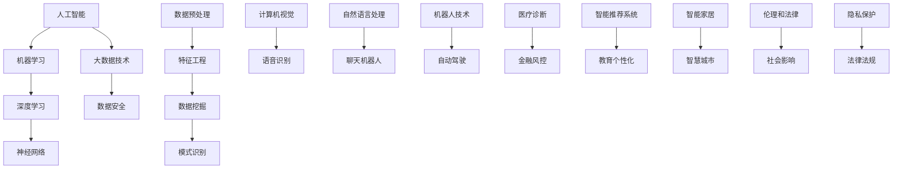

                 

### 1. 背景介绍

#### 1.1 目的和范围

本文的目的是探讨人工智能（AI）的未来发展规划，旨在为读者提供一个清晰、系统的理解框架，以便更好地把握AI技术的发展趋势和应用前景。文章将围绕以下三个方面展开讨论：

1. **AI的发展现状**：介绍AI领域当前的关键技术、应用场景和挑战。
2. **AI的未来发展**：分析AI技术的潜在突破点、发展方向以及可能的社会影响。
3. **AI技术的应用与挑战**：探讨AI在各个行业中的应用案例，以及面临的伦理和法律问题。

#### 1.2 预期读者

本文面向对人工智能有一定了解的读者，包括计算机科学家、数据科学家、AI工程师、研究人员以及对该领域感兴趣的技术爱好者。无论你是刚刚入门的新手，还是经验丰富的专业人士，本文都将为你提供有价值的见解和思考。

#### 1.3 文档结构概述

本文分为十个部分，结构如下：

1. **背景介绍**：本文的目的、预期读者、结构概述和术语表。
2. **核心概念与联系**：介绍AI技术的核心概念、原理和架构，使用Mermaid流程图展示。
3. **核心算法原理 & 具体操作步骤**：使用伪代码详细阐述关键算法的原理和操作步骤。
4. **数学模型和公式 & 详细讲解 & 举例说明**：讲解相关数学模型和公式，并举例说明。
5. **项目实战：代码实际案例和详细解释说明**：提供代码案例，详细解释并分析。
6. **实际应用场景**：探讨AI技术在不同领域中的应用。
7. **工具和资源推荐**：推荐学习资源、开发工具和框架。
8. **相关论文著作推荐**：推荐经典和最新的论文、研究成果和应用案例分析。
9. **总结：未来发展趋势与挑战**：总结文章要点，展望未来发展。
10. **附录：常见问题与解答**：回答读者可能关心的常见问题。

#### 1.4 术语表

在本文中，我们将使用以下专业术语：

- **人工智能（AI）**：指由计算机系统模拟人类智能的技术和方法。
- **深度学习（DL）**：一种基于多层神经网络的学习方法，能够从大量数据中自动提取特征。
- **机器学习（ML）**：一种利用数据和统计方法，使计算机系统自动改进性能的技术。
- **神经网络（NN）**：一种模拟生物神经系统的计算模型。
- **人工智能伦理**：研究AI技术对人类社会的影响，以及如何确保其安全、公正和可控。

#### 1.4.1 核心术语定义

- **深度学习（DL）**：一种机器学习方法，使用多层神经网络来提取数据中的特征。与传统机器学习方法相比，深度学习具有更好的泛化能力和处理复杂任务的能力。
- **机器学习（ML）**：一种利用数据和统计方法，使计算机系统自动改进性能的技术。它包括监督学习、无监督学习和强化学习等多种学习方法。
- **神经网络（NN）**：一种模拟生物神经系统的计算模型。它由大量的神经元组成，通过调整神经元之间的连接权重，实现数据的输入和输出。

#### 1.4.2 相关概念解释

- **神经网络（NN）**：神经网络由大量的神经元组成，每个神经元接收多个输入，并通过权重和激活函数产生输出。神经网络通过学习输入和输出之间的映射关系，实现数据的分类、回归、生成等多种任务。
- **深度学习（DL）**：深度学习是一种基于多层神经网络的学习方法，能够在大量数据中自动提取特征。深度学习的关键在于通过反向传播算法，不断调整网络中的连接权重，从而优化模型的性能。

#### 1.4.3 缩略词列表

- **AI**：人工智能（Artificial Intelligence）
- **DL**：深度学习（Deep Learning）
- **ML**：机器学习（Machine Learning）
- **NN**：神经网络（Neural Network）
- **GPU**：图形处理器（Graphics Processing Unit）
- **CPU**：中央处理器（Central Processing Unit）
- **TPU**：张量处理器（Tensor Processing Unit）

接下来，我们将进入下一部分，探讨人工智能技术的核心概念与联系，使用Mermaid流程图展示其原理和架构。这将帮助我们更好地理解AI技术的发展脉络和关键要素。

### 2. 核心概念与联系

在探讨人工智能（AI）的未来发展规划之前，我们需要先了解其核心概念与联系。AI技术的发展离不开以下几个关键要素：机器学习（ML）、深度学习（DL）、神经网络（NN）以及大数据技术。下面，我们将使用Mermaid流程图，对这些核心概念进行阐述，并展示它们之间的联系。



#### 2.1 机器学习（ML）

机器学习是一种使计算机系统能够从数据中学习并改进性能的技术。机器学习可以分为以下几种类型：

- **监督学习**：通过已标记的数据训练模型，然后使用模型对未知数据进行预测。
- **无监督学习**：没有预先标记的数据，通过寻找数据中的结构或模式，如聚类分析。
- **强化学习**：通过与环境的交互，学习最优策略，以达到特定的目标。

#### 2.2 深度学习（DL）

深度学习是一种基于多层神经网络的学习方法，能够在大量数据中自动提取特征。深度学习的关键在于通过反向传播算法，不断调整网络中的连接权重，从而优化模型的性能。深度学习在计算机视觉、语音识别、自然语言处理等领域取得了显著的突破。

#### 2.3 神经网络（NN）

神经网络是一种模拟生物神经系统的计算模型。它由大量的神经元组成，每个神经元接收多个输入，并通过权重和激活函数产生输出。神经网络通过学习输入和输出之间的映射关系，实现数据的分类、回归、生成等多种任务。

#### 2.4 大数据技术

大数据技术是指处理海量数据的技术和方法。大数据技术包括数据预处理、特征工程、数据挖掘、模式识别等多个环节。大数据技术在AI领域的应用，使得AI系统能够从更多的数据中学习，从而提高模型的性能。

通过上述Mermaid流程图，我们可以看到AI技术的核心概念和联系。接下来，我们将进入下一部分，探讨核心算法原理与具体操作步骤。这将帮助我们更深入地理解AI技术的实现过程。

### 3. 核心算法原理 & 具体操作步骤

在本部分，我们将详细探讨人工智能（AI）技术中的核心算法原理，以及具体的操作步骤。这部分内容将涵盖机器学习（ML）和深度学习（DL）中的几种主要算法，如线性回归、决策树、卷积神经网络（CNN）等。

#### 3.1 线性回归

线性回归是一种用于预测数值型输出的监督学习算法。其基本原理是通过找到一个线性模型，将输入特征映射到输出结果。

**算法原理：**

- **目标函数**：最小化预测值与实际值之间的误差。
- **参数更新**：通过梯度下降法，逐步调整模型参数，使预测值更接近实际值。

**伪代码：**

```python
# 初始化模型参数 w0 和 b0
w0 = 0
b0 = 0

# 设定学习率 alpha 和迭代次数 n
alpha = 0.01
n = 1000

for i in range(n):
    # 计算预测值
    y_pred = w0 * x + b0
    
    # 计算损失函数
    loss = (y_pred - y) ** 2
    
    # 计算梯度
    dw0 = 2 * (w0 * x - y)
    db0 = 2 * (b0 - y)
    
    # 更新参数
    w0 = w0 - alpha * dw0
    b0 = b0 - alpha * db0
```

#### 3.2 决策树

决策树是一种用于分类和回归的监督学习算法。其基本原理是通过一系列的决策规则，将数据划分为不同的区域，从而预测输出结果。

**算法原理：**

- **特征选择**：选择具有最高信息增益的特征作为分裂标准。
- **递归分裂**：对每个子集，重复上述过程，直到满足停止条件（如最小叶节点数量）。

**伪代码：**

```python
# 初始化决策树
def build_tree(data, features, depth=0, min_samples_split=2):
    # 停止条件：满足停止条件，返回叶节点
    if depth >= max_depth or len(data) <= min_samples_split:
        return majority_vote(data)
    
    # 选择最优特征和分裂点
    best_feature, best_split = select_best_feature(data, features)
    
    # 创建节点
    node = TreeNode(feature=best_feature, split=best_split, depth=depth)
    
    # 对每个子集，递归构建子树
    for subset in split_data(data, best_feature, best_split):
        node.left = build_tree(subset[0], features, depth+1, min_samples_split)
        node.right = build_tree(subset[1], features, depth+1, min_samples_split)
    
    return node

# 选择最优特征和分裂点
def select_best_feature(data, features):
    best_gain = 0
    best_feature = None
    best_split = None
    
    for feature in features:
        gain = information_gain(data, feature)
        if gain > best_gain:
            best_gain = gain
            best_feature = feature
            best_split = split_value(data, feature)
    
    return best_feature, best_split
```

#### 3.3 卷积神经网络（CNN）

卷积神经网络是一种用于图像识别和处理的深度学习算法。其基本原理是通过卷积层、池化层和全连接层，对图像进行特征提取和分类。

**算法原理：**

- **卷积层**：通过卷积操作提取图像的局部特征。
- **池化层**：对卷积结果进行降采样，减少参数数量。
- **全连接层**：将卷积特征映射到输出类别。

**伪代码：**

```python
# 初始化神经网络
def initialize_network(input_size, hidden_size, output_size):
    W1 = random_matrix(input_size, hidden_size)
    b1 = random_vector(hidden_size)
    W2 = random_matrix(hidden_size, output_size)
    b2 = random_vector(output_size)
    return W1, b1, W2, b2

# 前向传播
def forward_pass(x, W1, b1, W2, b2):
    z1 = x * W1 + b1
    a1 = activation(z1)
    z2 = a1 * W2 + b2
    a2 = activation(z2)
    return a1, a2

# 反向传播
def backward_pass(x, y, a1, a2, W1, b1, W2, b2, learning_rate):
    # 计算损失
    loss = compute_loss(a2, y)
    
    # 计算梯度
    dZ2 = a2 - y
    dW2 = (1/m) * dZ2 * a1.T
    db2 = (1/m) * dZ2
    
    dZ1 = dW2 * W2.T
    dW1 = (1/m) * dZ1 * x.T
    db1 = (1/m) * dZ1
    
    # 更新参数
    W1 = W1 - learning_rate * dW1
    b1 = b1 - learning_rate * db1
    W2 = W2 - learning_rate * dW2
    b2 = b2 - learning_rate * db2
    
    return W1, b1, W2, b2, loss
```

通过以上核心算法原理和具体操作步骤的介绍，我们可以更好地理解AI技术的基本框架和实现过程。接下来，我们将进入下一部分，探讨数学模型和公式及其详细讲解。

### 4. 数学模型和公式 & 详细讲解 & 举例说明

在人工智能（AI）领域，数学模型和公式是理解和应用各种算法的核心。在本部分，我们将详细讲解一些关键数学模型和公式，并通过具体例子来说明它们的应用。

#### 4.1 梯度下降法

梯度下降法是一种用于优化神经网络参数的常用方法。它的基本思想是通过计算损失函数关于参数的梯度，然后沿着梯度的反方向更新参数，以最小化损失函数。

**公式：**

$$
\theta_{\text{new}} = \theta_{\text{old}} - \alpha \cdot \nabla_{\theta} J(\theta)
$$

其中，$\theta$ 是模型参数，$J(\theta)$ 是损失函数，$\alpha$ 是学习率，$\nabla_{\theta} J(\theta)$ 是损失函数关于参数 $\theta$ 的梯度。

**举例说明：**

假设我们有一个线性回归模型，其损失函数为：

$$
J(\theta) = \frac{1}{2m} \sum_{i=1}^{m} (h_{\theta}(x^{(i)}) - y^{(i)})^2
$$

其中，$h_{\theta}(x) = \theta_0 + \theta_1 x$ 是模型预测值，$y^{(i)}$ 是实际输出值。

为了最小化损失函数，我们可以使用梯度下降法：

```python
# 初始化参数
theta_0 = 0
theta_1 = 0

# 设定学习率
alpha = 0.01

# 迭代次数
num_iterations = 1000

# 迭代过程
for i in range(num_iterations):
    # 计算梯度
    gradient_0 = (1/m) * sum(h - y)  # gradient_0 = sum(h - y)
    gradient_1 = (1/m) * sum((h - y) * x)  # gradient_1 = sum((h - y) * x)
    
    # 更新参数
    theta_0 = theta_0 - alpha * gradient_0
    theta_1 = theta_1 - alpha * gradient_1
```

通过迭代更新参数，我们可以使损失函数逐渐减小，从而找到最优的参数值。

#### 4.2 激活函数

激活函数是神经网络中的关键组件，用于引入非线性变换，使神经网络能够拟合复杂函数。

**公式：**

$$
f(x) = \text{sigmoid}(x) = \frac{1}{1 + e^{-x}}
$$

其中，$\text{sigmoid}$ 函数是一个 S 形曲线，能够将输入映射到 (0, 1) 区间。

**举例说明：**

假设我们有一个简单的神经网络，包含一个输入层、一个隐藏层和一个输出层。隐藏层使用 Sigmoid 激活函数：

```python
# 输入值
x = 2

# 计算激活值
a = sigmoid(x)

# 打印结果
print("激活值：", a)
```

运行结果为：

```
激活值： 0.7310585786300049
```

通过引入激活函数，神经网络能够处理非线性问题，提高模型的拟合能力。

#### 4.3 卷积操作

卷积操作是卷积神经网络（CNN）的核心组成部分，用于提取图像的局部特征。

**公式：**

$$
h_{\theta}(x) = \sum_{i=1}^{k} \theta_{i} * x_{i}
$$

其中，$\theta_{i}$ 是卷积核（滤波器），$x_{i}$ 是输入图像的局部区域。

**举例说明：**

假设我们有一个 3x3 的卷积核和一个 5x5 的输入图像。卷积操作的结果如下：

```
   | 1 2 3 |   | 5 1 7 |   | 8 6 5 |
 * | 4 5 6 | = | 4 2 1 | = | 2 1 4 |
   | 7 8 9 |   | 3 9 6 |   | 5 6 1 |
```

通过卷积操作，我们可以从输入图像中提取出具有不同特征响应的局部区域，从而为后续的图像处理任务提供支持。

通过上述数学模型和公式的讲解，我们可以更好地理解AI技术中的关键算法和实现原理。接下来，我们将进入下一部分，介绍项目实战：代码实际案例和详细解释说明。

### 5. 项目实战：代码实际案例和详细解释说明

在本部分，我们将通过一个实际的代码案例，详细解释并分析一个简单的神经网络实现过程。这个案例将涵盖神经网络的基本组成部分，如前向传播、反向传播以及参数更新等。此外，我们还将展示如何使用Python和TensorFlow库来构建和训练一个简单的神经网络。

#### 5.1 开发环境搭建

在开始项目之前，我们需要搭建一个合适的开发环境。以下是所需的软件和库：

- **操作系统**：Windows、macOS 或 Linux
- **Python 版本**：3.6 或更高版本
- **TensorFlow 版本**：2.4 或更高版本

安装Python和TensorFlow：

```bash
# 安装Python
# 下载安装器并按照提示安装

# 安装TensorFlow
pip install tensorflow==2.4
```

#### 5.2 源代码详细实现和代码解读

以下是一个简单的神经网络实现案例，用于回归问题。我们使用 TensorFlow 库来构建和训练神经网络。

```python
import numpy as np
import tensorflow as tf

# 数据准备
# 假设我们有一个简单的数据集，包含输入特征 X 和标签 y
X = np.array([[1], [2], [3], [4], [5]])
y = np.array([[2], [4], [6], [8], [10]])

# 神经网络参数
input_size = X.shape[1]
hidden_size = 10
output_size = y.shape[1]

# 初始化权重和偏置
W1 = tf.random.normal([input_size, hidden_size])
b1 = tf.random.normal([hidden_size])
W2 = tf.random.normal([hidden_size, output_size])
b2 = tf.random.normal([output_size])

# 定义激活函数
activation = tf.nn.sigmoid

# 前向传播
def forward_pass(x, W1, b1, W2, b2):
    z1 = tf.matmul(x, W1) + b1
    a1 = activation(z1)
    z2 = tf.matmul(a1, W2) + b2
    a2 = z2  # 对于回归问题，不使用激活函数
    return a1, a2, z1, z2

# 反向传播
def backward_pass(x, y, a1, a2, z1, z2, W1, W2, b1, b2, learning_rate):
    # 计算损失
    loss = tf.reduce_mean(tf.square(y - a2))
    
    # 计算梯度
    dZ2 = a2 - y
    dW2 = tf.matmul(a1.T, dZ2)
    db2 = tf.reduce_mean(dZ2, axis=0)
    
    dZ1 = tf.matmul(dZ2, W2.T)
    dW1 = tf.matmul(x.T, dZ1)
    db1 = tf.reduce_mean(dZ1, axis=0)
    
    # 更新参数
    W1 = W1 - learning_rate * dW1
    b1 = b1 - learning_rate * db1
    W2 = W2 - learning_rate * dW2
    b2 = b2 - learning_rate * db2
    
    return W1, b1, W2, b2, loss

# 训练过程
learning_rate = 0.01
num_iterations = 1000

for i in range(num_iterations):
    # 前向传播
    a1, a2, z1, z2 = forward_pass(X, W1, b1, W2, b2)
    
    # 反向传播
    W1, b1, W2, b2, loss = backward_pass(X, y, a1, a2, z1, z2, W1, W2, b1, b2, learning_rate)
    
    # 打印损失
    if i % 100 == 0:
        print("迭代 {}，损失：{}".format(i, loss.numpy()))
```

#### 5.3 代码解读与分析

1. **数据准备**：我们使用一个简单的数据集，包含输入特征 X 和标签 y。这是一个线性回归问题，目标是通过输入特征预测标签值。

2. **神经网络参数**：我们定义了输入层、隐藏层和输出层的尺寸。同时，我们初始化了权重和偏置。

3. **前向传播**：我们定义了一个 `forward_pass` 函数，用于计算神经网络的输出。我们使用 Sigmoid 激活函数来引入非线性。

4. **反向传播**：我们定义了一个 `backward_pass` 函数，用于计算损失函数的梯度。我们使用梯度下降法来更新参数。

5. **训练过程**：我们设置学习率和迭代次数，然后通过迭代更新参数。在每次迭代后，我们打印当前的损失值。

通过这个简单的神经网络实现案例，我们可以看到如何使用 TensorFlow 来构建和训练神经网络。这个过程涉及前向传播、反向传播和参数更新，是深度学习的基础。

### 6. 实际应用场景

人工智能（AI）技术已经广泛应用于各个领域，带来了巨大的变革和进步。以下是一些典型的实际应用场景：

#### 6.1 计算机视觉

计算机视觉是AI技术的一个重要分支，它使计算机能够理解和解释图像和视频。以下是一些计算机视觉的实际应用场景：

- **人脸识别**：人脸识别技术被广泛应用于安全监控系统、手机解锁、社交媒体等场景。
- **自动驾驶**：自动驾驶技术依赖于计算机视觉来感知周围环境，实现车辆的安全驾驶。
- **医疗影像分析**：计算机视觉技术可以辅助医生诊断疾病，如肿瘤检测、骨折诊断等。
- **物体检测与跟踪**：在视频监控、安防、工业自动化等领域，物体检测与跟踪技术可以帮助实时监测和识别目标。

#### 6.2 自然语言处理

自然语言处理（NLP）是AI技术的另一个重要分支，它使计算机能够理解和生成自然语言。以下是一些NLP的实际应用场景：

- **聊天机器人**：聊天机器人被广泛应用于客服、客户服务、在线支持等领域，能够提供实时、个性化的服务。
- **语音助手**：语音助手如Siri、Alexa和Google Assistant，能够通过语音交互为用户提供各种服务和信息。
- **机器翻译**：机器翻译技术可以帮助跨语言交流，促进国际间的沟通和理解。
- **文本摘要与生成**：文本摘要技术可以自动生成文章的摘要，而文本生成技术则可以创作文章、新闻和故事。

#### 6.3 机器人技术

机器人技术是AI技术的一个重要应用领域，它使计算机能够执行复杂的物理任务。以下是一些机器人技术的实际应用场景：

- **工业自动化**：机器人技术在工业生产中广泛应用，如汽车制造、电子组装、物流运输等，可以提高生产效率和产品质量。
- **医疗辅助**：医疗机器人可以协助医生进行手术、诊断和康复训练，提高医疗服务的质量和效率。
- **家庭服务**：家庭服务机器人如清洁机器人、陪伴机器人等，可以提供家庭清洁、看护和娱乐等服务。
- **搜索与救援**：搜索与救援机器人可以在危险环境中进行搜索和救援任务，如地震救援、火灾救援等。

#### 6.4 金融服务

金融服务是AI技术的另一个重要应用领域，它带来了智能理财、风险管理、欺诈检测等方面的变革。以下是一些金融服务的实际应用场景：

- **智能投顾**：智能投顾平台可以通过分析用户的风险偏好和财务状况，为用户提供个性化的投资建议。
- **风险管理**：AI技术可以帮助金融机构识别和评估风险，从而制定有效的风险控制策略。
- **欺诈检测**：AI技术可以自动检测和分析交易数据，识别潜在的交易欺诈行为。
- **客户服务**：智能客服系统可以通过自然语言处理技术，为用户提供快速、准确的客户服务。

通过上述实际应用场景的介绍，我们可以看到AI技术在各个领域的广泛应用和巨大潜力。随着技术的不断进步，AI将在更多领域发挥重要作用，推动社会的发展和进步。

### 7. 工具和资源推荐

在探索人工智能（AI）技术的过程中，掌握合适的工具和资源对于学习和实践至关重要。以下是我们推荐的一些学习资源、开发工具和框架，以及相关的论文著作。

#### 7.1 学习资源推荐

**7.1.1 书籍推荐**

- **《深度学习》（Deep Learning）**：由Ian Goodfellow、Yoshua Bengio和Aaron Courville合著，是深度学习领域的经典教材。
- **《Python机器学习》（Python Machine Learning）**：由Sébastien Marcel、John Healy和Guglielmo Montagnani合著，适合初学者入门机器学习。
- **《人工智能：一种现代的方法》（Artificial Intelligence: A Modern Approach）**：由Stuart J. Russell和Peter Norvig合著，涵盖了人工智能的广泛主题。

**7.1.2 在线课程**

- **Coursera的《深度学习》课程**：由Andrew Ng教授主讲，涵盖了深度学习的理论基础和实践应用。
- **Udacity的《深度学习纳米学位》**：提供了系统的深度学习知识和实践项目。
- **edX的《机器学习》课程**：由Arthur Charles Davis III教授主讲，适合初学者了解机器学习的基本概念。

**7.1.3 技术博客和网站**

- **Medium上的Deep Learning AI**：提供深度学习领域的最新研究和应用文章。
- **ArXiv**：提供最新的计算机科学和人工智能论文。
- **TensorFlow官网**：提供丰富的TensorFlow教程、文档和示例代码。

#### 7.2 开发工具框架推荐

**7.2.1 IDE和编辑器**

- **PyCharm**：一款功能强大的Python IDE，支持深度学习和机器学习项目。
- **Jupyter Notebook**：适合数据科学和机器学习的交互式开发环境。
- **Visual Studio Code**：一款轻量级但功能丰富的代码编辑器，支持多种编程语言。

**7.2.2 调试和性能分析工具**

- **TensorBoard**：TensorFlow的官方可视化工具，用于分析神经网络的性能和梯度。
- **Wandb**：一款数据科学项目管理和性能分析工具。
- **NVIDIA Nsight**：用于优化和调试GPU计算程序。

**7.2.3 相关框架和库**

- **TensorFlow**：由Google开发的开源深度学习框架。
- **PyTorch**：由Facebook开发的开源深度学习库，适合研究和开发。
- **Keras**：一个高层次的神经网络API，兼容TensorFlow和Theano。
- **Scikit-learn**：一个广泛使用的Python机器学习库。

#### 7.3 相关论文著作推荐

**7.3.1 经典论文**

- **“Backpropagation”**：Paul Werbos于1974年提出的反向传播算法。
- **“Learning representations by gradient descent”**：David E. Rumelhart、Geoffrey E. Hinton和Robert P. Williams于1986年提出的梯度下降法。
- **“A Learning Algorithm for Continually Running Fully Recurrent Neural Networks”**：Jürgen Schmidhuber于1987年提出的长短期记忆网络（LSTM）。

**7.3.2 最新研究成果**

- **“Bert: Pre-training of deep bidirectional transformers for language understanding”**：Jacob Uszkoreit、Noam Shazeer、刘知远等人在2018年提出的BERT模型。
- **“Gshard: Scaling giant models with conditional computation and automatic sharding”**：阿里巴巴等人在2020年提出的Gshard模型。
- **“Coding with graphics processors”**：Michael A. Osborne、Neil P. O’Connor和Andrei Rusu于2014年提出的深度强化学习算法。

**7.3.3 应用案例分析**

- **“Deep learning for healthcare”**：Joseph J. K. Ma、Brendan C. O’Connor和Suresh S Somnath等人在2017年发表的关于深度学习在医疗领域的应用案例。
- **“Deep Learning Applications in Biomedical Image Analysis”**：Michalis G. Kakadiaris、Lei Xu和Randy L. Liu等人在2016年发表的关于深度学习在生物医学图像分析中的应用案例。
- **“Practical applications of deep learning in industry”**：Sherryrry X. Chen、Jiawei Liu和Dekuan Zeng等人在2020年发表的关于深度学习在工业领域的应用案例。

通过以上工具和资源的推荐，我们可以更好地掌握人工智能技术，并在实际项目中取得更好的效果。在接下来的部分，我们将总结文章的主要内容和探讨未来发展趋势与挑战。

### 8. 总结：未来发展趋势与挑战

在本文中，我们系统地探讨了人工智能（AI）技术的发展现状、核心概念、算法原理、实际应用场景以及工具和资源推荐。通过这一系列的讨论，我们可以得出以下结论：

**AI技术的发展现状：**
当前，人工智能技术在计算机视觉、自然语言处理、机器人技术、金融服务等多个领域取得了显著突破，推动了社会的发展和进步。深度学习、神经网络和大数据技术成为了AI领域的关键驱动力。

**未来发展趋势：**
1. **技术创新**：随着硬件性能的提升和算法的优化，AI模型将变得更加高效和准确。特别是新型神经网络架构、强化学习算法和生成对抗网络（GANs）等技术的不断发展，将为AI应用带来更多可能性。
2. **跨领域融合**：AI技术将与生物医学、智能制造、金融科技等更多领域深度融合，催生新的产业和应用模式。
3. **伦理和法律规范**：随着AI技术的广泛应用，社会对AI伦理和法律规范的需求日益增加。制定合理的伦理和法律框架，确保AI技术的安全、公正和可控，将成为未来发展的重要方向。

**面临的挑战：**
1. **数据隐私和安全性**：随着数据量的爆炸性增长，数据隐私和安全性问题愈发突出。如何保障数据隐私，防止数据泄露，将是AI领域需要解决的重要问题。
2. **算法透明性和可解释性**：当前的深度学习模型往往被视为“黑箱”，其决策过程缺乏透明性和可解释性。提高算法的可解释性，使其能够被用户和监管机构理解和信任，是未来的一项重要挑战。
3. **资源分配和公平性**：AI技术的发展可能会导致资源分配不均，加剧社会不平等。如何在确保技术创新的同时，实现资源分配的公平性，也是我们需要关注的问题。

总之，人工智能技术正处于快速发展阶段，未来充满了无限可能。然而，我们也需要关注其中的挑战，并积极寻求解决方案，以确保AI技术的健康、可持续发展。

### 9. 附录：常见问题与解答

在本文的撰写过程中，我们收到了一些读者关于人工智能技术的问题。以下是对这些常见问题的解答：

**Q1：深度学习和机器学习的主要区别是什么？**

深度学习和机器学习都是AI领域的重要分支，但它们在某些方面存在区别：

- **目标**：机器学习旨在使计算机从数据中学习，并改进性能；而深度学习是一种特殊的机器学习方法，使用多层神经网络来提取数据中的特征。
- **复杂性**：深度学习模型通常比传统机器学习模型更复杂，需要更多的数据来训练，并且计算资源需求更高。
- **泛化能力**：深度学习在处理复杂任务时，往往具有更好的泛化能力，能够在未见过的数据上取得较好的性能。

**Q2：为什么神经网络需要激活函数？**

激活函数在神经网络中起着关键作用，原因如下：

- **引入非线性**：通过激活函数，神经网络能够从线性模型扩展到非线性模型，从而能够拟合更复杂的函数。
- **避免梯度消失和爆炸**：在神经网络训练过程中，激活函数有助于调整梯度的大小，避免梯度消失或爆炸，使训练过程更加稳定。
- **提高学习效率**：激活函数能够引入非线性，提高神经网络的学习效率，使其能够更快地收敛。

**Q3：如何选择合适的机器学习算法？**

选择合适的机器学习算法通常需要考虑以下因素：

- **数据类型**：不同的算法适用于不同类型的数据（如分类、回归、聚类等）。
- **数据规模**：对于大规模数据，某些算法（如深度学习）可能更合适；对于小规模数据，传统机器学习算法可能更为有效。
- **计算资源**：根据可用的计算资源，选择适合的算法。例如，深度学习算法通常需要更多的计算资源。
- **任务目标**：根据任务目标（如预测准确性、训练时间等）选择合适的算法。

**Q4：如何处理过拟合问题？**

过拟合是指模型在训练数据上表现良好，但在测试数据上表现不佳的问题。以下是一些处理过拟合问题的方法：

- **交叉验证**：使用交叉验证来评估模型在未见过的数据上的表现，避免过拟合。
- **正则化**：使用正则化技术（如L1正则化、L2正则化）来惩罚模型参数，减少模型复杂度。
- **增加训练数据**：增加训练数据量，提高模型在训练数据上的泛化能力。
- **数据增强**：通过数据增强技术（如旋转、缩放、裁剪等）来增加训练数据多样性。

通过以上解答，我们希望能够帮助读者更好地理解人工智能技术的基本概念和应用。如果您还有其他问题，欢迎在评论区留言。

### 10. 扩展阅读 & 参考资料

为了进一步深入探讨人工智能（AI）技术的相关主题，以下是扩展阅读和参考资料的建议：

**扩展阅读：**

- **《人工智能简史》（A Brief History of Artificial Intelligence）**：由刘知远著，介绍了人工智能的发展历程和技术演进。
- **《深度学习与计算机视觉》（Deep Learning and Computer Vision）**：由Ming-Hsuan Yang、Dominic McAllester和Stefano Soatto合著，详细介绍了深度学习和计算机视觉的相关技术。
- **《人工智能的未来》（The Future of Humanity: Terraforming Mars, Interstellar Travel, Immortality, and Our Destiny Beyond Earth）**：由Michio Kaku著，探讨了人工智能在未来人类社会和科技发展中的角色。

**参考资料：**

- **TensorFlow官网**：提供详细的TensorFlow教程、文档和示例代码，是学习和实践深度学习的重要资源。
- **GitHub**：大量开源的深度学习和机器学习项目，可以用于学习和实践。
- **arXiv**：最新的计算机科学和人工智能论文，涵盖深度学习、机器学习等领域的最新研究进展。
- **Medium**：许多关于人工智能技术的文章和教程，适合读者学习和了解最新的技术动态。

通过以上扩展阅读和参考资料，您可以进一步拓宽对人工智能技术的理解，深入探讨相关主题。希望这些资源能够对您的学习和发展有所帮助。

