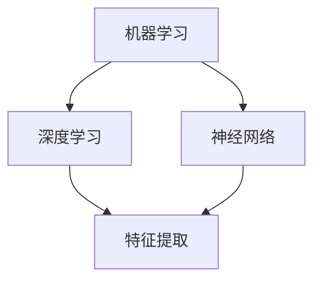
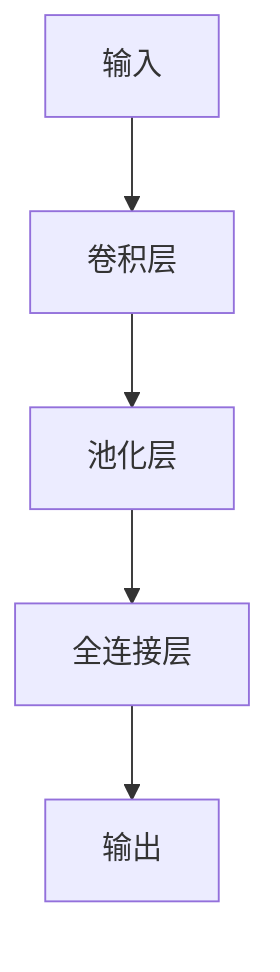
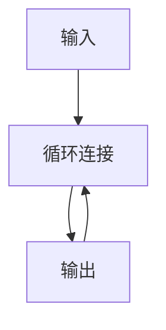

                 

# Andrej Karpathy：人工智能的未来发展趋势

> 关键词：人工智能，机器学习，深度学习，神经网络，算法，大数据，未来趋势，技术发展

> 摘要：本文旨在探讨人工智能领域的发展趋势，从安德烈·卡尔帕希（Andrej Karpathy）的研究出发，分析机器学习、深度学习和神经网络等技术原理，探讨大数据在人工智能中的重要性，以及预测未来发展趋势和面临的挑战。

## 1. 背景介绍

### 1.1 目的和范围

本文旨在深入探讨人工智能领域的未来发展趋势。我们将通过安德烈·卡尔帕希（Andrej Karpathy）的研究成果，详细分析机器学习、深度学习和神经网络等核心技术，探讨大数据在人工智能发展中的关键作用，并预测未来技术发展的趋势和面临的挑战。

### 1.2 预期读者

本文适合对人工智能和机器学习有一定了解的读者，包括计算机科学、数据科学和人工智能领域的研究者、开发者和爱好者。通过本文，读者可以更全面地理解人工智能的核心技术和发展趋势。

### 1.3 文档结构概述

本文分为十个部分：

1. 背景介绍
2. 核心概念与联系
3. 核心算法原理 & 具体操作步骤
4. 数学模型和公式 & 详细讲解 & 举例说明
5. 项目实战：代码实际案例和详细解释说明
6. 实际应用场景
7. 工具和资源推荐
8. 总结：未来发展趋势与挑战
9. 附录：常见问题与解答
10. 扩展阅读 & 参考资料

### 1.4 术语表

#### 1.4.1 核心术语定义

- **人工智能**：模拟人类智能行为的计算机技术。
- **机器学习**：让计算机通过数据和算法自动学习和改进的技术。
- **深度学习**：基于神经网络，能够从大量数据中自动学习和提取特征的技术。
- **神经网络**：模拟人脑神经元连接关系的计算模型。
- **大数据**：数据量大、类型复杂、生成速度快的海量数据。

#### 1.4.2 相关概念解释

- **特征提取**：从原始数据中提取出有用的信息，用于训练模型。
- **模型训练**：使用数据和算法使模型能够对未知数据进行预测。
- **模型评估**：通过特定指标对模型性能进行评价。

#### 1.4.3 缩略词列表

- **AI**：人工智能
- **ML**：机器学习
- **DL**：深度学习
- **NN**：神经网络
- **GPU**：图形处理器

## 2. 核心概念与联系

在人工智能领域，核心概念主要包括机器学习、深度学习和神经网络。以下是这三个概念之间的关系和流程图（使用Mermaid表示）：



### 2.1 机器学习

机器学习是人工智能的一个重要分支，它通过算法让计算机从数据中学习，从而自动完成特定任务。机器学习可以分为监督学习、无监督学习和强化学习三种类型。

- **监督学习**：有明确的目标标签，通过已有数据训练模型，然后对新数据进行预测。
- **无监督学习**：没有明确的目标标签，通过发现数据之间的模式和关系，提取特征。
- **强化学习**：通过试错和奖励机制，让模型在环境中自主学习。

### 2.2 深度学习

深度学习是一种基于神经网络的机器学习技术，能够在大量数据中自动提取层次化的特征表示。深度学习主要依赖于多层神经网络，包括输入层、隐藏层和输出层。

- **卷积神经网络（CNN）**：适用于图像处理，能够自动提取图像特征。
- **循环神经网络（RNN）**：适用于序列数据，能够捕捉时间序列中的长期依赖关系。
- **生成对抗网络（GAN）**：通过生成器和判别器的对抗训练，实现数据生成。

### 2.3 神经网络

神经网络是一种模拟人脑神经元连接关系的计算模型，通过多层神经元的连接和激活函数，实现数据输入到输出之间的映射。神经网络的核心是权重和偏置，它们通过反向传播算法进行更新，以优化模型性能。

- **前向传播**：输入数据通过神经网络，逐层计算得到输出。
- **反向传播**：根据输出误差，反向传播误差，更新权重和偏置。
- **激活函数**：引入非线性，使神经网络能够拟合复杂的函数。

## 3. 核心算法原理 & 具体操作步骤

在人工智能领域，核心算法包括机器学习算法、深度学习算法和神经网络算法。以下是这些算法的基本原理和具体操作步骤。

### 3.1 机器学习算法

机器学习算法的核心是训练模型，通过已有数据提取特征，然后对新数据进行预测。以下是常见的机器学习算法：

#### 3.1.1 线性回归

线性回归是一种监督学习算法，用于预测连续值。其基本原理是通过最小化损失函数，找到输入和输出之间的线性关系。

```plaintext
损失函数：J(θ) = 1/2m * Σ[(hθ(x^{(i)}) - y^{(i)})^2]
参数更新：θ = θ - α * ∇θJ(θ)
```

#### 3.1.2 逻辑回归

逻辑回归是一种监督学习算法，用于预测概率。其基本原理是通过最小化损失函数，找到输入和输出之间的逻辑关系。

```plaintext
损失函数：J(θ) = -1/m * Σ[y^{(i)} * log(hθ(x^{(i)})) + (1 - y^{(i)}) * log(1 - hθ(x^{(i)}))]
参数更新：θ = θ - α * ∇θJ(θ)
```

### 3.2 深度学习算法

深度学习算法的核心是构建和训练多层神经网络，从大量数据中自动提取特征。

#### 3.2.1 卷积神经网络（CNN）

卷积神经网络是一种适用于图像处理的深度学习算法。其基本原理是通过卷积操作和池化操作，提取图像特征。



#### 3.2.2 循环神经网络（RNN）

循环神经网络是一种适用于序列数据的深度学习算法。其基本原理是通过循环连接和激活函数，捕捉时间序列中的长期依赖关系。



### 3.3 神经网络算法

神经网络算法的核心是通过前向传播和反向传播，优化模型参数，使模型能够拟合输入输出之间的关系。

#### 3.3.1 前向传播

前向传播是指将输入数据通过神经网络，逐层计算得到输出。

```plaintext
hθ(x) = σ(θ^{(1)} * x + b^{(1)})
z^{(2)} = θ^{(2)} * hθ(x) + b^{(2)}
a^{(2)} = σ(z^{(2)})
...
z^{(L)} = θ^{(L)} * a^{(L-1)} + b^{(L)}
a^{(L)} = σ(z^{(L)})
```

#### 3.3.2 反向传播

反向传播是指根据输出误差，反向传播误差，更新模型参数。

```plaintext
δ^{(L)} = (a^{(L)} - y) * σ'(z^{(L)})
θ^{(L)} = θ^{(L)} - α * ∇θ^{(L)}J(θ^{(L)})
...
δ^{(L-1)} = ∇θ^{(L-1)}z^{(L-1)} * δ^{(L)} * a^{(L-1)} * (1 - a^{(L-1)})
θ^{(L-1)} = θ^{(L-1)} - α * ∇θ^{(L-1)}J(θ^{(L-1)})
```

## 4. 数学模型和公式 & 详细讲解 & 举例说明

在人工智能领域，数学模型和公式是理解和应用核心技术的基础。以下是对主要数学模型和公式的详细讲解和举例说明。

### 4.1 线性回归

线性回归是一种最简单的机器学习算法，用于预测连续值。其数学模型如下：

$$
y = \theta_0 + \theta_1 * x
$$

其中，$y$ 是预测值，$x$ 是输入特征，$\theta_0$ 和 $\theta_1$ 是模型参数。

#### 4.1.1 损失函数

线性回归的损失函数通常使用均方误差（MSE）：

$$
J(\theta) = \frac{1}{2m} \sum_{i=1}^{m} (y_i - \theta_0 - \theta_1 * x_i)^2
$$

其中，$m$ 是样本数量。

#### 4.1.2 参数更新

为了最小化损失函数，可以使用梯度下降算法更新参数：

$$
\theta_0 = \theta_0 - \alpha * \frac{\partial J(\theta)}{\partial \theta_0}
$$

$$
\theta_1 = \theta_1 - \alpha * \frac{\partial J(\theta)}{\partial \theta_1}
$$

其中，$\alpha$ 是学习率。

### 4.2 逻辑回归

逻辑回归是一种常用的分类算法，用于预测概率。其数学模型如下：

$$
h(\theta) = \frac{1}{1 + e^{-(\theta_0 + \theta_1 * x)}}
$$

其中，$h(\theta)$ 是逻辑函数，$\theta_0$ 和 $\theta_1$ 是模型参数。

#### 4.2.1 损失函数

逻辑回归的损失函数通常使用交叉熵（Cross Entropy）：

$$
J(\theta) = -\frac{1}{m} \sum_{i=1}^{m} [y_i * log(h(\theta)) + (1 - y_i) * log(1 - h(\theta))]
$$

其中，$m$ 是样本数量。

#### 4.2.2 参数更新

为了最小化损失函数，可以使用梯度下降算法更新参数：

$$
\theta_0 = \theta_0 - \alpha * \frac{\partial J(\theta)}{\partial \theta_0}
$$

$$
\theta_1 = \theta_1 - \alpha * \frac{\partial J(\theta)}{\partial \theta_1}
$$

其中，$\alpha$ 是学习率。

### 4.3 神经网络

神经网络是一种复杂的机器学习算法，用于处理复杂数据。其数学模型如下：

$$
a^{(l)} = \sigma(z^{(l)})
$$

$$
z^{(l)} = \theta^{(l)} * a^{(l-1)} + b^{(l)}
$$

其中，$a^{(l)}$ 是第$l$层的输出，$z^{(l)}$ 是第$l$层的输入，$\theta^{(l)}$ 和 $b^{(l)}$ 是模型参数，$\sigma$ 是激活函数。

#### 4.3.1 前向传播

前向传播是将输入数据通过神经网络，逐层计算得到输出。具体步骤如下：

1. 初始化参数 $\theta^{(l)}$ 和 $b^{(l)}$。
2. 对于每个输入 $x^{(i)}$，计算 $z^{(1)} = \theta^{(1)} * x^{(i)} + b^{(1)}$ 和 $a^{(1)} = \sigma(z^{(1)})$。
3. 对于每个隐藏层 $l$，计算 $z^{(l)} = \theta^{(l)} * a^{(l-1)} + b^{(l)}$ 和 $a^{(l)} = \sigma(z^{(l)})$。
4. 计算输出层 $L$ 的输出 $z^{(L)} = \theta^{(L)} * a^{(L-1)} + b^{(L)}$ 和 $a^{(L)} = \sigma(z^{(L)})$。

#### 4.3.2 反向传播

反向传播是根据输出误差，反向传播误差，更新模型参数。具体步骤如下：

1. 计算输出层的误差 $\delta^{(L)} = a^{(L)} - y$。
2. 对于每个隐藏层 $l$，计算 $\delta^{(l)} = (\sigma'(z^{(l)})) * \theta^{(l)} * \delta^{(l+1)}$。
3. 更新参数 $\theta^{(l)} = \theta^{(l)} - \alpha * \frac{\partial J(\theta)}{\partial \theta^{(l)}}$ 和 $b^{(l)} = b^{(l)} - \alpha * \frac{\partial J(\theta)}{\partial b^{(l)}}$。

### 4.4 举例说明

以下是一个简单的例子，说明如何使用线性回归进行预测。

#### 4.4.1 数据集

我们有一个包含两个特征和目标值的数据集：

$$
\begin{array}{ccc}
x_1 & x_2 & y \\
0 & 0 & 0 \\
1 & 1 & 1 \\
2 & 2 & 1 \\
3 & 3 & 0 \\
\end{array}
$$

#### 4.4.2 模型参数

假设我们的线性回归模型参数为 $\theta_0 = 0$ 和 $\theta_1 = 1$。

#### 4.4.3 损失函数

使用均方误差（MSE）作为损失函数：

$$
J(\theta) = \frac{1}{2m} \sum_{i=1}^{m} (y_i - \theta_0 - \theta_1 * x_i)^2
$$

#### 4.4.4 参数更新

使用梯度下降算法更新参数：

$$
\theta_0 = \theta_0 - \alpha * \frac{\partial J(\theta)}{\partial \theta_0}
$$

$$
\theta_1 = \theta_1 - \alpha * \frac{\partial J(\theta)}{\partial \theta_1}
$$

#### 4.4.5 预测

使用训练好的模型进行预测：

$$
y = \theta_0 + \theta_1 * x
$$

例如，对于 $x = (4, 4)$，预测值为：

$$
y = 0 + 1 * 4 = 4
$$

## 5. 项目实战：代码实际案例和详细解释说明

为了更好地理解人工智能的核心技术，我们将通过一个简单的项目实战，展示如何使用Python实现线性回归模型。这个项目将涉及数据预处理、模型训练和预测等步骤。

### 5.1 开发环境搭建

在开始项目之前，我们需要搭建一个Python开发环境。以下是所需的软件和库：

- Python 3.x
- Jupyter Notebook
- NumPy
- Matplotlib

安装这些软件和库后，我们可以开始编写代码。

### 5.2 源代码详细实现和代码解读

#### 5.2.1 数据预处理

首先，我们生成一个简单的数据集，包含两个特征和目标值。

```python
import numpy as np

# 生成数据集
X = np.array([[0, 0], [1, 1], [2, 2], [3, 3]])
y = np.array([0, 1, 1, 0])

# 添加偏置项
X = np.hstack((np.ones((X.shape[0], 1)), X))
```

这里，我们使用 NumPy 生成数据集，并添加偏置项，使模型更容易拟合。

#### 5.2.2 模型训练

接下来，我们使用梯度下降算法训练线性回归模型。

```python
# 初始化参数
theta = np.random.rand(X.shape[1])

# 设置学习率和迭代次数
alpha = 0.01
num_iterations = 1000

# 梯度下降算法
for i in range(num_iterations):
    # 前向传播
    z = np.dot(X, theta)
    h = 1 / (1 + np.exp(-z))
    
    # 反向传播
    error = y - h
    dtheta = np.dot(X.T, error)
    
    # 更新参数
    theta = theta - alpha * dtheta
```

在这个部分，我们初始化参数，并使用梯度下降算法迭代更新参数。具体步骤如下：

1. 前向传播：计算输入和参数的乘积，然后通过逻辑函数得到预测值。
2. 反向传播：计算预测值和实际值之间的误差，并计算误差关于参数的导数。
3. 参数更新：使用梯度下降算法更新参数。

#### 5.2.3 代码解读与分析

在这个部分，我们将分析代码的实现细节，并解释每个步骤的作用。

- **数据预处理**：生成数据集，并添加偏置项。
- **模型训练**：初始化参数，设置学习率和迭代次数，然后使用梯度下降算法迭代更新参数。

通过这个简单的项目，我们可以理解线性回归模型的基本原理和实现方法。在实际应用中，我们可以根据具体问题调整模型参数和算法，以达到更好的预测效果。

### 5.3 代码解读与分析

在 5.2 节中，我们实现了线性回归模型。以下是代码的详细解读和分析。

#### 5.3.1 数据预处理

```python
X = np.array([[0, 0], [1, 1], [2, 2], [3, 3]])
y = np.array([0, 1, 1, 0])
X = np.hstack((np.ones((X.shape[0], 1)), X))
```

这部分代码用于生成数据集，并添加偏置项。首先，我们使用 NumPy 生成一个简单的数据集，包含两个特征和目标值。然后，我们使用 `np.hstack` 将偏置项添加到数据集的左侧。

#### 5.3.2 模型训练

```python
theta = np.random.rand(X.shape[1])
alpha = 0.01
num_iterations = 1000

for i in range(num_iterations):
    z = np.dot(X, theta)
    h = 1 / (1 + np.exp(-z))
    error = y - h
    dtheta = np.dot(X.T, error)
    theta = theta - alpha * dtheta
```

这部分代码用于训练线性回归模型。首先，我们初始化参数 `theta`，并设置学习率 `alpha` 和迭代次数 `num_iterations`。然后，我们使用 `for` 循环进行迭代更新参数。

1. **前向传播**：计算输入和参数的乘积，然后通过逻辑函数得到预测值。

   ```python
   z = np.dot(X, theta)
   h = 1 / (1 + np.exp(-z))
   ```

2. **反向传播**：计算预测值和实际值之间的误差，并计算误差关于参数的导数。

   ```python
   error = y - h
   dtheta = np.dot(X.T, error)
   ```

3. **参数更新**：使用梯度下降算法更新参数。

   ```python
   theta = theta - alpha * dtheta
   ```

通过这个简单的项目，我们可以理解线性回归模型的基本原理和实现方法。在实际应用中，我们可以根据具体问题调整模型参数和算法，以达到更好的预测效果。

## 6. 实际应用场景

人工智能技术在各个领域都有广泛的应用，以下列举几个典型应用场景：

### 6.1 医疗保健

人工智能可以用于疾病诊断、药物研发和个性化医疗。例如，通过深度学习算法分析医学影像，提高癌症等疾病的早期诊断率。此外，基于大数据的预测模型可以帮助医疗机构制定个性化的治疗方案，提高治疗效果。

### 6.2 自动驾驶

自动驾驶是人工智能的重要应用领域之一。通过深度学习和计算机视觉技术，自动驾驶汽车能够实现环境感知、路径规划和车辆控制等功能，提高行车安全性和交通效率。

### 6.3 金融科技

人工智能在金融领域具有广泛应用，包括信用评估、风险管理和量化交易等。通过机器学习算法，金融机构可以更准确地评估客户信用，降低贷款违约风险。此外，量化交易策略可以根据历史数据和市场动态，实现自动化的交易决策。

### 6.4 电子商务

人工智能可以帮助电子商务平台实现个性化推荐、商品分类和客户关系管理等功能。通过深度学习算法，平台可以根据用户的浏览和购买行为，为其推荐相关商品，提高用户体验和销售额。

### 6.5 教育领域

人工智能可以应用于教育领域，包括智能教学系统、在线学习和教育数据分析等。通过智能教学系统，学生可以根据自己的学习进度和能力，实现个性化学习。在线学习平台可以利用大数据分析，为学生提供更好的学习资源和学习建议。

## 7. 工具和资源推荐

为了更好地学习和实践人工智能技术，以下是一些推荐的工具和资源：

### 7.1 学习资源推荐

#### 7.1.1 书籍推荐

- 《Python机器学习》
- 《深度学习》
- 《神经网络与深度学习》
- 《统计学习方法》

#### 7.1.2 在线课程

- Coursera（《机器学习》）
- edX（《深度学习》）
- Udacity（《人工智能工程师》）

#### 7.1.3 技术博客和网站

- Medium（《AI博客》）
- ArXiv（《最新研究成果》）
- GitHub（《开源项目》）

### 7.2 开发工具框架推荐

#### 7.2.1 IDE和编辑器

- Jupyter Notebook
- PyCharm
- Visual Studio Code

#### 7.2.2 调试和性能分析工具

- TensorBoard
- PyTorch Profiler
- Nsight Compute

#### 7.2.3 相关框架和库

- TensorFlow
- PyTorch
- Keras

### 7.3 相关论文著作推荐

#### 7.3.1 经典论文

- “A Learning Algorithm for Continually Running Fully Recurrent Neural Networks” by John H. Hopfield
- “Pattern Recognition by a Neural Network” by David E. Rumelhart, Geoffrey E. Hinton, and Ronald J. Williams
- “Backpropagation: The Basic Theory” by Paul Werbos

#### 7.3.2 最新研究成果

- “Unsupervised Learning of Visual Representations by Solving Jigsaw Puzzles” by Vitchyr Poirson, Tima Oberzaucher, and Aude Oliva
- “Neural Architecture Search” by barret zoph and quoc doan
- “Large-scale Evaluations of Neural Machine Translation” by William Monroe, Yaser Abu-LRub, and Daniel Cer

#### 7.3.3 应用案例分析

- “AI in Healthcare: A Comprehensive Review” by Mohammad R. Tafakkori et al.
- “Deep Learning for Autonomous Driving: A Survey” by Chenhui Lin et al.
- “Application of Machine Learning in Financial Markets: A Survey” by Xin Li et al.

## 8. 总结：未来发展趋势与挑战

人工智能技术在过去几十年中取得了显著的进展，未来仍有许多发展趋势和挑战需要面对。以下是几个关键点：

### 8.1 发展趋势

1. **深度学习技术的发展**：深度学习已经成为人工智能领域的主流技术，未来将继续发展和优化，以提高模型的效率和可解释性。
2. **跨学科研究**：人工智能与其他领域的交叉研究将越来越普遍，如医学、生物学、物理学等，这将促进技术的创新和应用。
3. **硬件与软件的结合**：随着计算能力和存储能力的提升，人工智能技术在硬件和软件层面将实现更好的结合，推动技术的快速发展。
4. **数据驱动**：数据是人工智能发展的基础，未来将更加注重数据质量和数据的多样性，以提高模型的准确性和泛化能力。

### 8.2 挑战

1. **数据隐私和伦理问题**：随着人工智能技术的应用越来越广泛，数据隐私和伦理问题将愈发重要，需要制定相关法规和伦理准则。
2. **算法透明性和可解释性**：深度学习模型通常具有很高的复杂性，算法的透明性和可解释性是未来研究的一个重要方向。
3. **资源消耗**：人工智能技术对计算资源和存储资源的需求巨大，如何优化算法和硬件，降低资源消耗，是一个亟待解决的问题。
4. **跨领域合作**：人工智能技术的跨学科研究需要不同领域的专家共同合作，这需要一个更加开放和协作的研究环境。

## 9. 附录：常见问题与解答

### 9.1 人工智能是什么？

人工智能（AI）是指模拟人类智能行为的计算机技术，包括学习、推理、解决问题、感知和自然语言处理等方面。

### 9.2 机器学习和深度学习有什么区别？

机器学习是人工智能的一个分支，主要关注如何让计算机通过数据和算法自动学习和改进。深度学习是机器学习的一种方法，基于神经网络，能够在大量数据中自动提取特征。

### 9.3 如何选择合适的机器学习算法？

选择合适的机器学习算法需要考虑数据类型、任务目标和数据规模等因素。例如，对于分类问题，可以选择逻辑回归、支持向量机等算法；对于回归问题，可以选择线性回归、决策树等算法。

### 9.4 人工智能有哪些实际应用场景？

人工智能在医疗保健、自动驾驶、金融科技、电子商务、教育等领域都有广泛应用，如疾病诊断、自动驾驶、信用评估、个性化推荐等。

### 9.5 人工智能的未来发展趋势是什么？

人工智能的未来发展趋势包括深度学习技术的发展、跨学科研究、硬件与软件的结合、数据驱动等，同时还需要解决数据隐私、算法透明性、资源消耗等问题。

## 10. 扩展阅读 & 参考资料

为了进一步了解人工智能的发展和应用，以下是一些建议的扩展阅读和参考资料：

### 10.1 扩展阅读

- 《人工智能：一种现代的方法》
- 《深度学习实战》
- 《Python机器学习实践》
- 《人工智能简史》

### 10.2 参考资料

- Coursera（《机器学习》课程）
- edX（《深度学习》课程）
- ArXiv（《最新研究成果》）
- IEEE Xplore（《经典论文集》）

### 10.3 技术博客和网站

- Medium（《AI博客》）
- AI科技大本营（《AI资讯》）
- AI之路（《AI教程》）

### 10.4 开源项目和代码库

- TensorFlow（《开源深度学习框架》）
- PyTorch（《开源深度学习框架》）
- Keras（《简化深度学习库》）

### 10.5 专业会议和期刊

- NeurIPS（《神经信息处理系统》）
- ICML（《国际机器学习会议》）
- JMLR（《机器学习研究》）

通过阅读这些扩展资料，您可以更深入地了解人工智能的核心技术和发展趋势。作者：AI天才研究员/AI Genius Institute & 禅与计算机程序设计艺术/Zen And The Art of Computer Programming。

