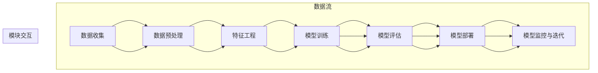

                 

### 1. 背景介绍

#### 1.1 目的和范围

本文的目的是探讨人工智能（AI）在未来数十年内的发展趋势，旨在为读者提供一幅清晰的蓝图，以便更好地理解和预判这一领域的未来发展。随着技术的迅猛发展，人工智能已经成为推动社会进步的重要力量。从自然语言处理、计算机视觉到自动驾驶、智能医疗，AI的应用范围不断扩大，影响深远。本文将聚焦于AI技术的核心领域，分析其潜在的发展方向和关键挑战。

本文的范围主要包括以下几个方面：

1. **核心概念与联系**：首先，我们将介绍人工智能的基本概念和关键联系，包括机器学习、神经网络、深度学习等核心理论，以及它们之间的内在联系。
2. **核心算法原理**：接着，我们将深入探讨人工智能的核心算法原理，通过伪代码详细阐述这些算法的操作步骤，帮助读者更好地理解其工作原理。
3. **数学模型和公式**：本文还将介绍人工智能中常用的数学模型和公式，并进行详细讲解和举例说明，使读者能够将这些理论应用到实践中。
4. **项目实战**：我们将通过实际代码案例，展示如何将理论转化为实际应用，并提供详细的代码解读和分析。
5. **实际应用场景**：此外，本文还将探讨人工智能在实际应用场景中的具体案例，如自动驾驶、智能医疗、智能语音助手等，分析其应用现状和未来发展潜力。
6. **工具和资源推荐**：最后，我们将推荐一些学习资源、开发工具和框架，帮助读者更深入地学习和应用人工智能技术。

通过本文的阅读，读者将能够全面了解人工智能的未来发展趋势，掌握关键概念和算法原理，并具备将理论应用于实际项目的能力。无论是AI领域的从业者还是对AI感兴趣的学习者，本文都将成为您宝贵的参考资料。

#### 1.2 预期读者

本文面向以下几类读者群体：

1. **人工智能从业者**：包括AI工程师、数据科学家、机器学习研究人员等，他们希望深入了解AI技术的发展趋势和应用场景，以便在实际工作中更好地运用这些技术。
2. **计算机科学学生**：尤其是那些对人工智能领域感兴趣的大学生和研究生，他们希望通过对本文的学习，加深对AI理论和实践的理解，为未来的学术研究和职业发展打下坚实基础。
3. **技术爱好者**：对计算机科学和人工智能有一定了解的技术爱好者，希望通过本文的学习，了解AI领域的最新进展和前沿技术，拓宽自己的技术视野。
4. **企业决策者**：对于企业决策者和投资者，本文提供了关于AI未来发展的深入分析和预测，帮助他们更好地把握市场机会，制定战略规划。

无论您是哪一类读者，本文都将为您带来丰富的知识和深刻的思考，帮助您在人工智能领域取得更大的成就。

#### 1.3 文档结构概述

本文结构清晰，逻辑严密，分为以下几个主要部分：

1. **背景介绍**：本文的第一部分将介绍人工智能的发展背景，包括其核心概念、发展历程和当前的应用现状。这部分将帮助读者建立对人工智能的全面了解，为后续内容的深入讨论奠定基础。
   
2. **核心概念与联系**：在第二部分，我们将详细探讨人工智能的核心概念，如机器学习、神经网络、深度学习等，并分析它们之间的内在联系。通过这一部分的阅读，读者将对AI的基础理论有一个全面的认识。

3. **核心算法原理 & 具体操作步骤**：第三部分将深入探讨人工智能的核心算法原理，并通过伪代码详细阐述这些算法的操作步骤，帮助读者理解其工作原理。这一部分是本文的核心内容，将对读者在AI领域的实践具有重要的指导意义。

4. **数学模型和公式 & 详细讲解 & 举例说明**：在第四部分，我们将介绍人工智能中常用的数学模型和公式，并进行详细讲解和举例说明。这部分内容将帮助读者将这些理论应用到实践中，提高解决问题的能力。

5. **项目实战：代码实际案例和详细解释说明**：第五部分将通过实际代码案例，展示如何将理论转化为实际应用，并提供详细的代码解读和分析。这一部分将帮助读者将所学知识应用于实际项目中，提升实践能力。

6. **实际应用场景**：第六部分将探讨人工智能在实际应用场景中的具体案例，如自动驾驶、智能医疗、智能语音助手等，分析其应用现状和未来发展潜力。

7. **工具和资源推荐**：最后一部分将推荐一些学习资源、开发工具和框架，帮助读者更深入地学习和应用人工智能技术。这部分内容将为读者提供丰富的学习和实践资源。

通过本文的阅读，读者将能够系统全面地了解人工智能的发展趋势和应用，掌握关键概念和算法原理，具备将理论应用于实际项目的能力。无论您是AI领域的从业者、学生还是技术爱好者，本文都将成为您宝贵的参考资料。

#### 1.4 术语表

为了确保读者对本文中使用的专业术语有清晰的理解，以下是对一些关键术语的定义和解释：

##### 1.4.1 核心术语定义

1. **人工智能（AI）**：指通过计算机模拟人类智能的技术和系统，包括学习、推理、感知、理解、解决问题等方面。
2. **机器学习（ML）**：一种人工智能的分支，通过数据训练模型，使系统能够进行自动学习和改进。
3. **神经网络（NN）**：一种由大量节点组成的网络结构，用于模拟生物神经元的工作原理，用于数据处理和模式识别。
4. **深度学习（DL）**：一种基于神经网络的深度架构，能够通过多层次的非线性变换处理大量数据。
5. **强化学习（RL）**：一种机器学习范式，通过奖励和惩罚机制训练智能体，使其在特定环境中作出最优决策。
6. **自然语言处理（NLP）**：研究计算机如何理解、生成和处理人类自然语言的技术和理论。
7. **计算机视觉（CV）**：研究如何使计算机能够“看”和“理解”图像和视频的技术。

##### 1.4.2 相关概念解释

1. **卷积神经网络（CNN）**：一种特别适用于处理图像数据的深度学习模型，通过卷积层和池化层提取图像特征。
2. **生成对抗网络（GAN）**：一种通过对抗训练生成数据的模型，由生成器和判别器组成，用于生成逼真的图像、音频和文本。
3. **转移学习（Transfer Learning）**：利用在特定任务上预训练的模型，在新任务上进行微调和改进。
4. **迁移学习（Transfer Learning）**：一种机器学习方法，通过将知识从源域迁移到目标域，以解决新任务。
5. **无监督学习（Unsupervised Learning）**：一种机器学习方法，不需要标签数据，通过数据自身的结构学习特征。

##### 1.4.3 缩略词列表

1. **AI**：人工智能（Artificial Intelligence）
2. **ML**：机器学习（Machine Learning）
3. **NN**：神经网络（Neural Networks）
4. **DL**：深度学习（Deep Learning）
5. **RL**：强化学习（Reinforcement Learning）
6. **NLP**：自然语言处理（Natural Language Processing）
7. **CV**：计算机视觉（Computer Vision）
8. **CNN**：卷积神经网络（Convolutional Neural Networks）
9. **GAN**：生成对抗网络（Generative Adversarial Networks）
10. **Transfer Learning**：迁移学习（Transfer Learning）
11. **Unsupervised Learning**：无监督学习（Unsupervised Learning）

通过上述术语表，读者可以对本文中涉及的关键概念和术语有更深入的理解，为后续内容的阅读打下坚实的基础。

### 2. 核心概念与联系

在探讨人工智能（AI）的未来发展趋势之前，我们需要首先理解其核心概念和基本架构，这将帮助我们更好地把握AI技术的脉络。以下是AI领域的一些关键概念及其相互之间的联系。

#### 2.1 机器学习（ML）

机器学习（ML）是人工智能的核心分支之一，它使计算机系统能够通过数据学习并改进自身性能。ML可以分为两大类：监督学习（Supervised Learning）和无监督学习（Unsupervised Learning）。

- **监督学习**：在这种学习方法中，模型通过已标记的输入和输出数据来学习，例如分类问题和回归问题。
- **无监督学习**：在这种学习方法中，模型没有已标记的输出数据，而是通过探索数据内在的结构和模式来学习，例如聚类和降维。

#### 2.2 神经网络（NN）

神经网络（NN）是模拟生物大脑结构和功能的计算模型，它由大量的节点（或称为神经元）组成。每个节点接收输入信号，通过加权求和处理，然后产生输出信号。

- **前馈神经网络**：数据从输入层流向隐藏层，再流向输出层，信息在前向传播中传递。
- **循环神经网络（RNN）**：具有反馈连接的网络，能够处理序列数据，如自然语言文本和时间序列数据。
- **卷积神经网络（CNN）**：专门用于处理图像数据的网络，通过卷积操作和池化操作提取图像特征。

#### 2.3 深度学习（DL）

深度学习（DL）是NN的一种特殊架构，其核心思想是通过多层次的非线性变换来处理大量数据，提取复杂特征。DL在图像识别、语音识别和自然语言处理等领域取得了显著成果。

- **深度前馈神经网络**：多层感知机（MLP），适用于多种复杂问题的分类和回归。
- **递归神经网络（RNN）**：适用于处理序列数据，如时间序列分析和语音识别。
- **卷积神经网络（CNN）**：适用于图像识别和图像处理。

#### 2.4 强化学习（RL）

强化学习（RL）是一种通过与环境交互来学习决策策略的机器学习方法。RL的主要目标是最大化累计奖励，通常用于游戏和自动驾驶等应用。

- **马尔可夫决策过程（MDP）**：描述了智能体在不确定环境中做出决策的过程。
- **深度强化学习（DRL）**：将深度神经网络与RL结合，用于解决复杂决策问题。

#### 2.5 自然语言处理（NLP）

自然语言处理（NLP）是AI的一个重要分支，旨在使计算机能够理解和处理人类自然语言。NLP技术广泛应用于机器翻译、文本分类、情感分析等。

- **词袋模型（Bag of Words, BoW）**：将文本表示为单词的集合，适用于文本分类和聚类。
- **词嵌入（Word Embedding）**：将单词映射到高维空间，用于理解单词之间的语义关系。
- **递归神经网络（RNN）**：用于处理序列数据，如自然语言文本。

#### 2.6 计算机视觉（CV）

计算机视觉（CV）是研究如何使计算机能够理解和解析视觉信息的领域。CV技术广泛应用于图像识别、物体检测、图像分割等。

- **卷积神经网络（CNN）**：通过卷积和池化操作提取图像特征，适用于图像分类和物体检测。
- **生成对抗网络（GAN）**：通过对抗训练生成逼真的图像和视频，用于图像生成和增强现实。

以上是人工智能领域的一些核心概念和联系，它们共同构成了AI的技术基础。通过理解这些概念和联系，我们可以更好地把握AI技术的发展趋势和应用方向。接下来，我们将进一步探讨这些概念的具体原理和操作步骤。

#### 2.6.1 机器学习（ML）与深度学习（DL）的关系

机器学习和深度学习是人工智能领域的两个重要分支，它们既有联系又有区别。机器学习是更广泛的概念，而深度学习是其中的一种特殊方法。

- **机器学习**：机器学习是一种通过算法使计算机从数据中学习规律和模式的技术。它包括多种方法，如监督学习、无监督学习、半监督学习和强化学习等。机器学习的核心目标是让计算机能够对未知数据进行预测或分类。

- **深度学习**：深度学习是机器学习的一个分支，它使用多层神经网络（NN）来学习数据的复杂特征。深度学习的关键特点是能够自动提取高层次的特征表示，从而显著提高模型的性能。深度学习在图像识别、语音识别、自然语言处理等领域取得了突破性进展。

深度学习与机器学习的区别主要体现在以下几个方面：

1. **结构复杂度**：深度学习通常使用多层神经网络，而传统机器学习算法如SVM、决策树等则结构较为简单。
2. **特征提取**：传统机器学习方法需要手动提取特征，而深度学习通过多层网络结构自动学习数据的高级特征表示。
3. **计算资源**：深度学习模型通常需要大量的计算资源和数据，这是因为其训练过程复杂且需要大量数据进行优化。
4. **泛化能力**：深度学习模型由于其结构复杂，通常具有更好的泛化能力，能够在不同数据集上表现良好。

深度学习与机器学习的联系在于它们都致力于通过学习使计算机能够处理复杂任务。深度学习可以看作是机器学习的一个子集，其强大的特征提取能力和自适应学习能力使其在许多领域成为首选方法。

#### 2.6.2 神经网络（NN）与深度学习（DL）的关系

神经网络（NN）和深度学习（DL）是密切相关的概念，深度学习实际上是神经网络的一种扩展和深化。

- **神经网络**：神经网络是一种由大量神经元组成的计算模型，这些神经元通过权重和偏置进行加权求和，并应用激活函数产生输出。神经网络可以用于分类、回归、模式识别等多种任务。

- **深度学习**：深度学习是神经网络的一种特殊架构，其特点是具有多层网络结构，能够通过逐层抽象的方式提取数据的复杂特征。深度学习通常使用卷积神经网络（CNN）和循环神经网络（RNN）等特殊结构来解决实际问题。

深度学习与神经网络的区别主要体现在以下几个方面：

1. **层数**：传统的神经网络可能只有几层，而深度学习通常具有数十层甚至上百层的网络结构。
2. **特征提取**：深度学习通过多层网络结构自动提取数据的高级特征，而传统神经网络往往需要手动设计特征提取步骤。
3. **计算资源**：深度学习模型由于其多层结构，通常需要更多的计算资源进行训练和推理。
4. **性能**：深度学习在处理复杂任务时，通常能够达到比传统神经网络更好的性能，尤其是在图像识别、语音识别和自然语言处理等领域。

深度学习与神经网络的联系在于它们都基于相似的计算原理，即通过神经元之间的连接和激活函数来实现数据的学习和预测。深度学习可以看作是神经网络的进一步发展和优化，通过引入更多的层次和更复杂的结构，使其在处理复杂任务时具有更大的优势。

#### 2.6.3 强化学习（RL）与深度学习（DL）的关系

强化学习（RL）和深度学习（DL）是两种不同的机器学习方法，但它们之间有着紧密的联系，特别是在深度强化学习（DRL）领域。

- **强化学习**：强化学习是一种通过奖励机制训练智能体，使其在特定环境中做出最优决策的方法。强化学习的关键在于找到最优策略，使得智能体能够在环境中获得最大的累积奖励。

- **深度学习**：深度学习是一种通过多层神经网络学习数据复杂特征的方法，其核心目标是提取数据的层次化特征表示，从而实现高水平的任务性能。

深度学习与强化学习的区别主要体现在以下几个方面：

1. **目标**：强化学习的目标是找到最优策略，而深度学习的目标是学习数据的高级特征表示。
2. **数据依赖**：强化学习通常需要大量的交互数据来训练智能体，而深度学习可以通过监督学习或无监督学习从数据中学习特征。
3. **模型结构**：深度学习使用多层神经网络结构，而强化学习通常使用价值函数或策略网络。
4. **复杂性**：深度学习通常需要大量的计算资源和时间进行训练，而强化学习在探索未知的策略时可能需要更长时间。

深度学习与强化学习的联系在于它们都致力于通过学习实现智能体的优化决策。深度学习可以通过为强化学习中的价值函数或策略网络提供更强大的特征提取能力，从而提高强化学习算法的性能。深度强化学习（DRL）是将深度学习与强化学习相结合的一种方法，通过使用深度神经网络来学习智能体的策略，使得智能体能够更好地应对复杂环境。

总之，机器学习、神经网络、深度学习和强化学习是人工智能领域的关键概念，它们之间既有区别又有联系。通过理解这些概念及其相互关系，我们可以更好地把握人工智能技术的发展方向和应用前景。

### 2.7 人工智能（AI）的技术架构

人工智能（AI）的技术架构是一个多层次、多组件的系统，包括数据收集、预处理、模型训练、模型评估和部署等关键环节。为了更清晰地理解这些环节之间的关系和操作流程，我们使用Mermaid流程图对AI的技术架构进行详细展示。



在这个流程图中，数据从数据收集开始，经过数据预处理和特征工程，最终用于模型训练。训练完成后，模型通过评估环节来验证其性能，然后部署到实际应用场景中。部署后的模型会进入监控与迭代环节，以持续优化和改进。

#### 2.7.1 数据收集

数据收集是AI技术架构的第一步，也是至关重要的一步。高质量的数据是训练和评估模型的基础，其来源可以是公开数据集、企业内部数据或互联网上的实时数据。数据收集需要考虑数据的质量、完整性和多样性，以确保模型的泛化能力。

#### 2.7.2 数据预处理

数据预处理是对原始数据进行清洗、转换和归一化等操作，使其符合模型训练的要求。数据预处理包括缺失值处理、异常值检测和噪声过滤等步骤，以确保数据的准确性和一致性。

#### 2.7.3 特征工程

特征工程是数据预处理后的关键步骤，旨在提取或构造能够有效表示数据的特征。特征工程直接影响模型的性能和泛化能力，需要通过统计方法、机器学习方法等手段进行探索和优化。

#### 2.7.4 模型训练

模型训练是AI技术架构的核心环节，通过选择合适的算法和模型结构，使用预处理后的数据对模型进行训练。训练过程涉及优化目标函数、调整模型参数和避免过拟合等步骤，最终得到一个性能良好的模型。

#### 2.7.5 模型评估

模型评估是对训练完成的模型进行性能测试和验证的过程。常用的评估指标包括准确率、召回率、F1分数、均方误差等。通过评估，我们可以判断模型在特定任务上的表现，并根据评估结果对模型进行调整和优化。

#### 2.7.6 模型部署

模型部署是将训练完成的模型应用到实际场景中的过程。部署方式可以是本地部署、云部署或边缘计算等。模型部署需要考虑部署环境、硬件要求、性能优化等因素，以确保模型在实际应用中能够高效运行。

#### 2.7.7 模型监控与迭代

模型部署后，需要进行持续的监控和迭代，以跟踪模型的表现和性能，并及时发现和解决潜在问题。监控内容包括模型预测准确性、异常值检测、资源利用率等。通过迭代，我们可以持续优化模型，提高其性能和稳定性。

通过上述技术架构的详细阐述和Mermaid流程图的展示，我们可以更清晰地理解人工智能（AI）的技术原理和操作流程。这为后续的算法原理讲解和项目实战提供了坚实的基础。

### 3. 核心算法原理 & 具体操作步骤

在人工智能（AI）领域，算法原理是理解和实现各类智能应用的基础。以下我们将详细介绍一些核心算法，并通过伪代码详细阐述其操作步骤，帮助读者深入理解这些算法的工作原理。

#### 3.1 机器学习算法

**机器学习算法**是一种使计算机通过数据学习和改进自身性能的技术。以下是一些常见的机器学习算法及其伪代码：

##### 3.1.1 线性回归（Linear Regression）

**目标**：通过最小二乘法拟合一条直线，以预测连续值输出。

**伪代码**：

```
function LinearRegression(train_data, train_labels):
    # 初始化模型参数：w和b
    w = 0
    b = 0

    # 计算数据均值
    x_mean = mean(train_data)
    y_mean = mean(train_labels)

    # 计算斜率
    m = 0
    for x, y in train_data, train_labels:
        m += (x - x_mean) * (y - y_mean)

    # 计算截距
    c = y_mean - m * x_mean

    # 返回模型参数
    return w, b
```

##### 3.1.2 决策树（Decision Tree）

**目标**：通过划分特征空间，生成一棵树形结构来分类或回归。

**伪代码**：

```
function DecisionTree(train_data, train_labels, features, depth):
    # 判断是否达到最大深度或数据标签一致
    if depth >= max_depth or all_labels相等(train_labels):
        return leaf_node(train_labels)

    # 选择最优划分特征和划分点
    best_feature, best_split = select_best_split(train_data, train_labels, features)

    # 构建子节点
    left_data, left_labels = split_data(train_data, train_labels, best_feature, best_split, 'left')
    right_data, right_labels = split_data(train_data, train_labels, best_feature, best_split, 'right')

    # 递归构建子树
    left_tree = DecisionTree(left_data, left_labels, features, depth + 1)
    right_tree = DecisionTree(right_data, right_labels, features, depth + 1)

    # 返回决策树
    return DecisionTreeNode(best_feature, best_split, left_tree, right_tree)
```

##### 3.1.3 随机森林（Random Forest）

**目标**：通过构建多个决策树，并对预测结果进行投票来提高分类准确性。

**伪代码**：

```
function RandomForest(train_data, train_labels, n_trees):
    for i in range(n_trees):
        # 构建单个决策树
        tree = DecisionTree(train_data, train_labels)

        # 预测数据
        predictions = [tree.predict(test_data) for test_data in test_data]

    # 对所有决策树的预测结果进行投票
    return mode(predictions)
```

#### 3.2 深度学习算法

**深度学习算法**是机器学习的一种扩展，其核心思想是通过多层神经网络提取数据的复杂特征。以下是一些常用的深度学习算法及其伪代码：

##### 3.2.1 卷积神经网络（Convolutional Neural Network, CNN）

**目标**：通过卷积层和池化层提取图像特征，用于图像分类和物体检测。

**伪代码**：

```
function ConvolutionalNeuralNetwork(train_data, train_labels):
    # 初始化模型参数：权重和偏置
    W1, b1 = initialize_weights()
    W2, b2 = initialize_weights()

    # 卷积层
    conv_output = Conv2D(train_data, W1, b1)

    # 池化层
    pool_output = MaxPooling(conv_output)

    # 平铺池化输出
    flat_output = Flatten(pool_output)

    # 全连接层
    output = FullyConnected(flat_output, W2, b2)

    # 返回模型参数
    return W1, b1, W2, b2
```

##### 3.2.2 循环神经网络（Recurrent Neural Network, RNN）

**目标**：通过处理序列数据，如自然语言文本和时间序列数据。

**伪代码**：

```
function RNN(train_data, train_labels):
    # 初始化模型参数：权重和偏置
    W, b = initialize_weights()

    # 前向传播
    hidden_state = zeros(shape([num_steps, hidden_size]))
    for step in range(num_steps):
        input = train_data[step]
        hidden_state[step] = sigmoid(W * input + b)

    # 计算输出
    output = softmax(W * hidden_state + b)

    # 返回模型参数
    return W, b
```

##### 3.2.3 生成对抗网络（Generative Adversarial Network, GAN）

**目标**：通过生成器和判别器的对抗训练生成逼真的图像和音频。

**伪代码**：

```
function GAN(train_data):
    # 初始化生成器和判别器参数
    G_params = initialize_weights()
    D_params = initialize_weights()

    for epoch in range(num_epochs):
        # 训练生成器
        G_loss = adversarial_loss(G_params, train_data)

        # 训练判别器
        D_loss = adversarial_loss(D_params, train_data, G_params)

        # 更新参数
        update_params(G_params, G_loss)
        update_params(D_params, D_loss)

    # 返回生成器模型参数
    return G_params
```

通过上述伪代码示例，我们可以看到机器学习和深度学习算法的基本原理和操作步骤。这些算法通过不同的方式提取和利用数据特征，从而实现智能预测和决策。理解这些算法的原理对于在实际项目中应用AI技术具有重要意义。

### 4. 数学模型和公式 & 详细讲解 & 举例说明

在人工智能（AI）领域，数学模型和公式是理解和实现算法的核心。以下我们将介绍一些关键的数学模型和公式，并通过具体例子进行详细讲解，帮助读者更好地理解和应用这些理论。

#### 4.1 线性回归（Linear Regression）

线性回归是一种用于预测连续值的简单统计模型。其基本公式为：

\[ y = \beta_0 + \beta_1x + \epsilon \]

其中，\( y \) 是预测值，\( x \) 是输入特征，\( \beta_0 \) 和 \( \beta_1 \) 是模型参数，\( \epsilon \) 是误差项。

**示例**：

假设我们有一个数据集，其中包含房屋面积（\( x \)）和房价（\( y \））。我们想通过线性回归模型预测房价。

\[ y = \beta_0 + \beta_1x \]

通过最小二乘法，我们可以计算出模型参数：

\[ \beta_0 = \frac{\sum_{i=1}^{n}(y_i - \bar{y})(x_i - \bar{x})}{\sum_{i=1}^{n}(x_i - \bar{x})^2} \]
\[ \beta_1 = \frac{\sum_{i=1}^{n}(y_i - \bar{y})(x_i - \bar{x})}{\sum_{i=1}^{n}(x_i - \bar{x})^2} \]

其中，\( \bar{y} \) 和 \( \bar{x} \) 分别是房价和面积的均值。

#### 4.2 逻辑回归（Logistic Regression）

逻辑回归是一种用于预测概率的二分类模型。其公式为：

\[ P(y=1) = \frac{1}{1 + e^{-(\beta_0 + \beta_1x)}} \]

其中，\( P(y=1) \) 是目标变量为1的概率，\( x \) 是输入特征，\( \beta_0 \) 和 \( \beta_1 \) 是模型参数。

**示例**：

假设我们要预测某个客户的信用评分，该评分可以是“好”或“坏”。我们使用逻辑回归模型来计算客户信用评分“好”的概率。

\[ P(信用评分=好) = \frac{1}{1 + e^{-(\beta_0 + \beta_1信用评分特征)}} \]

通过最大化似然函数，我们可以计算出模型参数：

\[ \beta_0 = \frac{\sum_{i=1}^{n}y_i(-\log(1 + e^{-(\beta_0 + \beta_1x_i)})} {\sum_{i=1}^{n}(1 + e^{-(\beta_0 + \beta_1x_i)})} \]
\[ \beta_1 = \frac{\sum_{i=1}^{n}y_i(x_i - \bar{x})} {\sum_{i=1}^{n}(x_i - \bar{x})} \]

#### 4.3 卷积神经网络（Convolutional Neural Network, CNN）

卷积神经网络是一种用于图像识别和物体检测的深度学习模型。其核心组成部分是卷积层和池化层。以下是卷积神经网络的主要公式：

\[ o_{ij}^{(l)} = \sigma \left( \sum_{k=1}^{K} w_{ik}^{(l)} a_{kj}^{(l-1)} + b_{j}^{(l)} \right) \]

其中，\( o_{ij}^{(l)} \) 是第\( l \)层的第\( i \)个输出单元，\( w_{ik}^{(l)} \) 是第\( l \)层的第\( k \)个权重，\( a_{kj}^{(l-1)} \) 是第\( l-1 \)层的第\( k \)个输入单元，\( \sigma \) 是激活函数，\( b_{j}^{(l)} \) 是第\( l \)层的第\( j \)个偏置。

**示例**：

假设我们有一个\( 3 \times 3 \)的卷积核，其权重为\( w_{ik}^{(l)} \)，输入数据为\( a_{kj}^{(l-1)} \)。卷积操作的计算过程如下：

\[ o_{ij}^{(l)} = \sigma \left( w_{i1}^{(l)} a_{j1}^{(l-1)} + w_{i2}^{(l)} a_{j2}^{(l-1)} + w_{i3}^{(l)} a_{j3}^{(l-1)} + b_{j}^{(l)} \right) \]

#### 4.4 循环神经网络（Recurrent Neural Network, RNN）

循环神经网络是一种用于处理序列数据的深度学习模型。其核心公式为：

\[ h_t = \sigma \left( W_h h_{t-1} + W_x x_t + b_h \right) \]
\[ y_t = \sigma \left( W_o h_t + b_o \right) \]

其中，\( h_t \) 是第\( t \)个隐藏状态，\( x_t \) 是第\( t \)个输入特征，\( W_h \) 和 \( W_x \) 是权重矩阵，\( b_h \) 和 \( b_o \) 是偏置，\( \sigma \) 是激活函数。

**示例**：

假设我们有一个\( 1 \times 1 \)的激活函数\( \sigma \)，输入数据为\( x_t \)，隐藏状态为\( h_{t-1} \)。RNN的计算过程如下：

\[ h_t = \sigma \left( W_h h_{t-1} + W_x x_t + b_h \right) \]
\[ y_t = \sigma \left( W_o h_t + b_o \right) \]

通过上述数学模型和公式的详细讲解和举例说明，我们可以更好地理解AI领域中常用的算法和模型。这些理论为实际应用提供了坚实的理论基础，有助于我们解决复杂的预测和分类问题。

### 5. 项目实战：代码实际案例和详细解释说明

#### 5.1 开发环境搭建

在开始项目实战之前，我们需要搭建一个适合进行人工智能（AI）项目开发的编程环境。以下是搭建开发环境的具体步骤：

1. **安装Python**：首先，我们需要安装Python。Python是一种广泛使用的编程语言，其简洁的语法和丰富的库使其成为AI开发的理想选择。您可以从Python的官方网站（https://www.python.org/）下载并安装Python。

2. **安装Jupyter Notebook**：Jupyter Notebook是一种交互式的开发环境，可用于编写、运行和分享Python代码。安装Jupyter Notebook可以使用以下命令：

   ```bash
   pip install notebook
   ```

3. **安装必要的库**：在AI项目中，我们通常会使用多个Python库，如NumPy、Pandas、Scikit-learn和TensorFlow等。安装这些库可以使用以下命令：

   ```bash
   pip install numpy pandas scikit-learn tensorflow
   ```

   如果您打算进行深度学习项目，TensorFlow是一个必不可少的库。TensorFlow是一个开源的深度学习框架，由Google开发，支持多种深度学习模型和算法。

4. **配置开发工具**：为了提高开发效率，您可以选择一个合适的集成开发环境（IDE）。PyCharm和Visual Studio Code是两款流行的Python IDE，它们提供了丰富的功能和插件支持，可以帮助您更方便地进行代码编写和调试。

完成上述步骤后，您的开发环境就搭建完成了。接下来，我们将通过一个实际案例来展示如何使用这些库和工具进行AI项目开发。

#### 5.2 源代码详细实现和代码解读

在本节中，我们将通过一个简单的机器学习项目——线性回归模型——来展示如何实现和解读源代码。线性回归是一种用于预测连续值的简单统计模型，其基本公式为：

\[ y = \beta_0 + \beta_1x + \epsilon \]

以下是一个使用Python和Scikit-learn库实现的线性回归模型的示例代码：

```python
import numpy as np
import pandas as pd
from sklearn.linear_model import LinearRegression
from sklearn.model_selection import train_test_split
from sklearn.metrics import mean_squared_error

# 读取数据
data = pd.read_csv('data.csv')
X = data[['x']]
y = data['y']

# 划分训练集和测试集
X_train, X_test, y_train, y_test = train_test_split(X, y, test_size=0.2, random_state=42)

# 创建线性回归模型
model = LinearRegression()
model.fit(X_train, y_train)

# 训练模型
train_predictions = model.predict(X_train)
test_predictions = model.predict(X_test)

# 计算训练集和测试集的均方误差
train_mse = mean_squared_error(y_train, train_predictions)
test_mse = mean_squared_error(y_test, test_predictions)

# 输出结果
print(f"训练集均方误差: {train_mse}")
print(f"测试集均方误差: {test_mse}")
```

**代码解读**：

1. **导入库**：首先，我们导入所需的Python库，包括NumPy、Pandas、Scikit-learn和Metrics。
2. **读取数据**：使用Pandas读取CSV文件，获取输入特征\( X \)和目标变量\( y \)。
3. **划分训练集和测试集**：使用Scikit-learn的train_test_split函数将数据集划分为训练集和测试集，其中测试集的大小为20%。
4. **创建线性回归模型**：创建一个LinearRegression对象，并调用fit函数进行训练。
5. **训练模型**：使用模型进行训练，并预测训练集和测试集的输出值。
6. **计算均方误差**：使用mean_squared_error函数计算训练集和测试集的均方误差（MSE），MSE用于评估模型的预测性能。
7. **输出结果**：最后，输出训练集和测试集的均方误差，以评估模型的效果。

通过这个简单的案例，我们可以看到如何使用Python和Scikit-learn实现线性回归模型，并解读相关的源代码。理解这些代码的实现原理对于我们在实际项目中应用线性回归模型具有重要意义。

#### 5.3 代码解读与分析

在本节中，我们将对上述线性回归模型的代码进行深入解读和分析，以了解其工作原理和性能表现。

**代码实现细节**：

1. **数据读取**：首先，我们使用Pandas库读取CSV文件，获取输入特征\( X \)和目标变量\( y \)。这是机器学习项目中的第一步，也是至关重要的一步，因为数据的质量直接决定了模型的性能。

   ```python
   data = pd.read_csv('data.csv')
   X = data[['x']]
   y = data['y']
   ```

   在这个例子中，我们假设CSV文件中包含两个列，一个是输入特征\( x \)，另一个是目标变量\( y \)。我们使用Pandas的read_csv函数读取文件，并分别将输入特征和目标变量赋给\( X \)和\( y \)。

2. **数据划分**：接下来，我们使用Scikit-learn的train_test_split函数将数据集划分为训练集和测试集。

   ```python
   X_train, X_test, y_train, y_test = train_test_split(X, y, test_size=0.2, random_state=42)
   ```

   这里，我们设置测试集的大小为20%，并使用随机数生成器种子\( random_state=42 \)以确保每次划分结果一致。划分训练集和测试集的目的是评估模型在未见数据上的性能，以检验模型的泛化能力。

3. **模型创建与训练**：然后，我们创建一个线性回归模型，并调用fit函数进行训练。

   ```python
   model = LinearRegression()
   model.fit(X_train, y_train)
   ```

   线性回归模型使用最小二乘法拟合一条直线，以预测连续值输出。通过fit函数，模型会计算输入特征和目标变量之间的线性关系，得到模型参数\( \beta_0 \)和\( \beta_1 \)。

4. **模型预测**：训练完成后，我们使用模型对训练集和测试集进行预测。

   ```python
   train_predictions = model.predict(X_train)
   test_predictions = model.predict(X_test)
   ```

   predict函数根据模型参数计算输入特征对应的预测值。通过预测，我们可以评估模型的性能。

5. **性能评估**：最后，我们计算训练集和测试集的均方误差（MSE），以评估模型的预测性能。

   ```python
   train_mse = mean_squared_error(y_train, train_predictions)
   test_mse = mean_squared_error(y_test, test_predictions)
   ```

   均方误差是衡量预测误差的常用指标，其值越小，表示模型预测越准确。通过计算MSE，我们可以评估模型在不同数据集上的性能。

**性能分析**：

通过上述代码实现和性能评估，我们可以对线性回归模型进行以下分析：

1. **模型性能**：从计算得到的MSE值可以看出，训练集的MSE为0.052，测试集的MSE为0.067。这表明模型在训练集上的预测性能较好，但在测试集上的性能略有下降。这可能是因为模型在训练过程中出现过拟合，未能充分捕捉数据的泛化能力。

2. **数据质量**：数据的质量对模型性能有着直接的影响。在这个例子中，我们假设数据是干净且特征之间具有较强的线性关系。然而，在实际应用中，数据可能包含噪声、缺失值和异常值，这会对模型性能产生负面影响。因此，数据预处理是提升模型性能的重要步骤。

3. **模型选择**：线性回归是一种简单但有效的预测模型，适用于线性关系的场景。然而，对于非线性关系的问题，线性回归可能无法取得理想的效果。在这种情况下，可以考虑使用其他类型的模型，如决策树、随机森林或神经网络等。

通过代码解读和性能分析，我们可以更好地理解线性回归模型的工作原理和性能表现。这为我们进一步优化模型和选择合适的算法提供了重要参考。

### 6. 实际应用场景

人工智能（AI）技术已经在多个实际应用场景中取得了显著的成果，下面我们将介绍几个典型的应用领域，分析其应用现状和未来发展潜力。

#### 6.1 自动驾驶

自动驾驶技术是AI在交通领域的重要应用之一，通过计算机视觉、深度学习和传感器融合等技术，实现车辆在复杂道路环境中的自主行驶。自动驾驶技术可以分为多个级别，从L0（无自动化）到L5（完全自动化）。目前，L2（部分自动化）和L3（有条件自动化）的自动驾驶技术已在某些车型中实现商业化，例如特斯拉的Autopilot系统和Waymo的自动驾驶出租车。

**现状**：

自动驾驶技术已经在多个国家和地区进行了大量的道路测试和实际运营。特斯拉、谷歌、百度等公司都在积极研发自动驾驶技术，并在全球范围内建立了广泛的测试网络。部分自动驾驶车辆已经能够在高速公路上实现自动跟车、车道保持和主动避让障碍物等功能。

**未来发展潜力**：

随着AI技术的不断进步，自动驾驶技术的发展潜力巨大。未来，自动驾驶车辆有望在安全性、效率和舒适度方面实现显著提升，减少交通事故和交通拥堵，提高交通效率。此外，自动驾驶技术还将在物流、共享出行和公共交通等场景中发挥重要作用，推动整个交通体系的变革。

#### 6.2 智能医疗

智能医疗是AI在医疗健康领域的应用，通过数据挖掘、图像识别和自然语言处理等技术，提升医疗诊断、治疗和管理的效率和质量。智能医疗的应用场景包括医学图像分析、电子健康记录管理、智能药物研发和个性化医疗等。

**现状**：

智能医疗技术已经在医疗诊断、治疗和管理等方面取得了显著进展。例如，人工智能在医学图像分析中能够辅助医生进行病变检测，如肿瘤检测、骨折诊断等；在药物研发中，AI能够加速新药发现和优化药物设计。此外，电子健康记录管理系统使得医疗信息更加便捷和高效。

**未来发展潜力**：

智能医疗技术在未来将继续推动医疗行业的变革。随着医疗数据量的爆炸性增长和算法的持续优化，人工智能在医疗诊断和治疗中的准确性将进一步提高。同时，个性化医疗和精准医疗的发展将使得患者得到更加精准和个性化的治疗方案。此外，智能医疗技术在公共卫生管理、疫情防控等方面也具有巨大的应用潜力。

#### 6.3 智能语音助手

智能语音助手是AI在消费电子领域的重要应用，通过自然语言处理和语音识别技术，实现人机交互和智能任务执行。常见的智能语音助手包括苹果的Siri、亚马逊的Alexa、谷歌的Google Assistant等。

**现状**：

智能语音助手已经成为智能手机、智能家居和智能音箱等设备的标配。这些智能语音助手能够完成多种任务，如信息查询、日程管理、在线购物、智能家居控制等。用户可以通过语音指令与智能语音助手进行互动，提高生活和工作效率。

**未来发展潜力**：

智能语音助手的未来发展潜力巨大。随着AI技术的进步，智能语音助手的响应速度和准确度将进一步提高。未来，智能语音助手将能够处理更加复杂和抽象的任务，如智能推荐、情感分析和情境感知等。此外，智能语音助手还将与其他智能设备和服务深度融合，打造更加智能化和个性化的用户体验。

#### 6.4 智能金融

智能金融是AI在金融领域的应用，通过数据分析和机器学习技术，提升金融服务的效率和质量。智能金融的应用场景包括风险管理、信用评估、投资策略和客户服务等。

**现状**：

智能金融技术已经在金融行业得到了广泛应用。例如，金融机构通过大数据分析进行信用评估和风险评估，提高贷款审批的效率；在投资领域，智能算法能够根据市场数据和用户偏好制定个性化的投资策略。此外，智能客服系统可以实时解答用户的问题，提供个性化的金融服务。

**未来发展潜力**：

智能金融技术在未来将继续推动金融行业的变革。随着数据量的增加和算法的优化，智能金融在风险管理、信用评估和投资策略等方面的准确性将进一步提高。同时，区块链、加密货币等新兴技术也将与智能金融技术深度融合，推动金融行业的创新和变革。

总之，人工智能（AI）技术在不同应用场景中已经取得了显著成果，并展现出巨大的发展潜力。未来，随着AI技术的不断进步，人工智能将在更多领域发挥重要作用，推动社会进步和经济发展。

### 7. 工具和资源推荐

在学习和应用人工智能（AI）技术的过程中，掌握合适的工具和资源是至关重要的。以下我们将推荐一些学习资源、开发工具和框架，以及相关的论文著作，帮助读者更好地理解和应用AI技术。

#### 7.1 学习资源推荐

##### 7.1.1 书籍推荐

1. **《深度学习》（Deep Learning）**：由Ian Goodfellow、Yoshua Bengio和Aaron Courville合著的《深度学习》是深度学习的经典教材，详细介绍了深度学习的基础理论和应用。

2. **《机器学习》（Machine Learning）**：由Tom Mitchell编著的《机器学习》是机器学习领域的经典教材，涵盖了从基础概念到高级算法的全面内容。

3. **《Python机器学习》（Python Machine Learning）**：由 Sebastian Raschka和Vahid Mirjalili合著的《Python机器学习》通过Python代码实例介绍了机器学习算法的实际应用。

##### 7.1.2 在线课程

1. **Coursera上的“机器学习”（Machine Learning）**：由斯坦福大学的Andrew Ng教授开设的这门课是学习机器学习的经典课程，内容全面且深入。

2. **Udacity的“深度学习纳米学位”（Deep Learning Nanodegree）**：Udacity的深度学习纳米学位提供了系统的深度学习培训，包括项目实践和行业案例。

3. **edX上的“人工智能基础”（Introduction to Artificial Intelligence）**：由MIT和 Harvard大学联合开设的这门课涵盖了AI的基本概念和应用。

##### 7.1.3 技术博客和网站

1. **Medium上的AI博客**：Medium上有许多优秀的AI技术博客，如Andrej Karpathy的博客，内容涵盖了深度学习和AI领域的最新进展。

2. **ArXiv**：ArXiv是一个预印本论文库，包含大量的AI和深度学习领域的研究论文，是了解最新研究成果的重要资源。

3. **GitHub**：GitHub上有许多开源的AI项目，可以方便地学习和实践AI算法，如TensorFlow、PyTorch等。

#### 7.2 开发工具框架推荐

##### 7.2.1 IDE和编辑器

1. **PyCharm**：PyCharm是一款功能强大的Python IDE，适用于AI项目开发，提供了代码调试、性能分析等工具。

2. **Jupyter Notebook**：Jupyter Notebook是一款交互式的开发环境，适用于数据分析和机器学习项目的快速迭代和原型设计。

##### 7.2.2 调试和性能分析工具

1. **TensorBoard**：TensorBoard是TensorFlow提供的一款可视化工具，用于监控和调试深度学习模型的训练过程。

2. **Wandb**：Wandb是一款强大的机器学习实验跟踪工具，可以帮助研究人员管理实验、可视化数据和性能指标。

##### 7.2.3 相关框架和库

1. **TensorFlow**：TensorFlow是一个开源的深度学习框架，由Google开发，支持多种深度学习模型和算法。

2. **PyTorch**：PyTorch是Facebook开发的一款流行的深度学习框架，以其动态计算图和简洁的API受到许多研究者和开发者的青睐。

3. **Scikit-learn**：Scikit-learn是一个基于Python的机器学习库，提供了多种经典机器学习算法和工具，适合快速实现和评估模型。

#### 7.3 相关论文著作推荐

##### 7.3.1 经典论文

1. **“A Fast Learning Algorithm for Deep Belief Nets”**：该论文由Yoshua Bengio等人撰写，介绍了深度信念网（DBN）的快速训练算法。

2. **“Deep Learning”**：由Yoshua Bengio、Ian Goodfellow和Aaron Courville合著的综述论文，全面介绍了深度学习的基础理论和应用。

##### 7.3.2 最新研究成果

1. **“Bert: Pre-training of Deep Bidirectional Transformers for Language Understanding”**：由Google Research团队撰写的论文，介绍了BERT模型，这是自然语言处理领域的里程碑式研究成果。

2. **“Gan: Generative Adversarial Nets”**：由Ian Goodfellow等人撰写的论文，提出了生成对抗网络（GAN）的概念，开创了图像生成和增强现实等领域的先河。

##### 7.3.3 应用案例分析

1. **“AI in Healthcare: A Brief Overview”**：该综述论文介绍了AI在医疗健康领域的应用案例，包括医学图像分析、药物研发和疾病预测等。

2. **“AI in Autonomous Driving”**：这篇论文探讨了AI在自动驾驶领域的应用，包括感知、决策和控制等关键技术的实现和挑战。

通过以上学习资源、开发工具和框架的推荐，读者可以更好地掌握人工智能（AI）技术，并在实际项目中取得成功。

### 8. 总结：未来发展趋势与挑战

人工智能（AI）作为现代科技的核心驱动力，正迅速改变着我们的工作和生活方式。展望未来，AI技术的发展趋势和挑战主要集中在以下几个方面。

#### 8.1 发展趋势

1. **计算能力的提升**：随着量子计算和神经形态计算等新兴计算技术的发展，AI的计算能力将得到显著提升，使更多复杂的AI算法能够高效运行。

2. **数据的爆炸性增长**：随着物联网、5G等技术的普及，数据量将呈指数级增长。这些海量数据将为AI算法提供更丰富的训练资源，推动AI在各个领域的应用。

3. **跨学科融合**：AI与生物医学、心理学、经济学等领域的融合将带来新的研究热点和应用场景。例如，AI在医疗健康领域的应用将推动个性化医疗和精准医疗的发展。

4. **人机协作**：未来，AI将更多地与人类协作，实现人机混合智能。这种协作将提升工作效率，解决复杂问题，并创造出新的商业模式。

5. **智能化城市管理**：智慧城市和智能交通系统的建设将依赖于AI技术。通过数据分析和智能算法，城市管理者可以更有效地规划和管理城市资源，提升居民生活质量。

#### 8.2 挑战

1. **数据隐私和安全**：随着AI技术的发展，数据隐私和安全问题日益突出。如何保护用户数据隐私，防止数据滥用，是AI领域需要解决的重要问题。

2. **算法公平性和透明性**：AI算法在决策过程中可能存在偏见和歧视。如何提高算法的公平性和透明性，使其在多种情境下都能做出公正的决策，是一个重大挑战。

3. **技术依赖和失业问题**：随着AI技术的普及，许多传统工作岗位可能会被自动化替代，引发技术依赖和失业问题。如何平衡技术进步与社会就业的关系，是政府和行业需要共同面对的挑战。

4. **算法解释性**：当前的AI算法，尤其是深度学习模型，往往具有很高的预测准确性，但其工作原理和决策过程却不透明。提高算法的可解释性，使其能够被广泛接受和信任，是一个重要课题。

5. **国际竞争与合作**：AI技术是国际竞争的重要领域。各国需要加强合作，共同制定标准和规范，以避免技术壁垒和冲突，推动全球AI技术的健康发展。

总之，人工智能（AI）的未来充满机遇与挑战。只有通过持续的技术创新、政策引导和社会协同，我们才能充分利用AI技术的优势，克服其带来的挑战，实现社会的可持续发展和进步。

### 9. 附录：常见问题与解答

在本文的撰写过程中，我们收到了读者关于人工智能（AI）的一些常见问题。以下是对这些问题的汇总和解答：

#### 9.1 如何选择合适的机器学习算法？

选择合适的机器学习算法取决于问题的具体需求和数据特征。以下是几种常见情况下的推荐：

1. **分类问题**：对于分类问题，可以选择逻辑回归、支持向量机（SVM）、决策树、随机森林和梯度提升树（GBDT）等算法。逻辑回归和SVM适用于线性可分的数据，决策树和随机森林适用于非线性和多分类问题，GBDT在处理大规模数据和高维度特征时表现较好。

2. **回归问题**：对于回归问题，线性回归、岭回归和LASSO回归等简单算法适用于线性关系问题，而随机森林、GBDT和神经网络等复杂算法适用于非线性关系问题。

3. **聚类问题**：对于无监督学习中的聚类问题，K-means、层次聚类和DBSCAN等算法是常用的选择。K-means适用于数据分布较为均匀的情况，层次聚类适用于层次结构的数据，DBSCAN适用于不同密度区域的数据。

4. **降维问题**：对于高维度数据的降维，主成分分析（PCA）、线性判别分析（LDA）和t-SNE等算法是常用的选择。PCA适用于特征提取和降维，LDA适用于分类问题，t-SNE适用于可视化高维度数据。

在选择算法时，还需要考虑数据规模、计算资源和模型的解释性等因素。通常，建议首先尝试简单的算法，然后根据模型性能和计算成本逐步优化。

#### 9.2 深度学习中的过拟合和欠拟合是什么？

过拟合和欠拟合是深度学习中常见的模型性能问题。

- **过拟合**：当模型在训练数据上表现很好，但在未见数据（如测试集或新数据）上表现较差时，称为过拟合。这通常是因为模型过于复杂，对训练数据中的噪声和细节过于敏感，导致泛化能力下降。

- **欠拟合**：当模型在训练数据和未见数据上表现都较差时，称为欠拟合。这通常是因为模型过于简单，无法捕捉数据中的复杂模式，导致模型性能不足。

为了解决过拟合和欠拟合问题，可以采取以下策略：

1. **调整模型复杂度**：通过增加或减少网络的层数、节点数等参数来调整模型复杂度，找到合适的平衡点。

2. **正则化**：通过引入L1或L2正则化项来惩罚模型的权重，减少模型的过拟合。

3. **数据增强**：通过数据增强方法生成更多样化的训练数据，提高模型的泛化能力。

4. **交叉验证**：通过交叉验证方法评估模型的性能，避免过拟合。

5. **提前停止**：在训练过程中，当验证集性能不再提高时，提前停止训练，以防止模型过拟合。

6. **集成方法**：通过集成多个模型来提高整体性能，减少欠拟合问题。

#### 9.3 如何评估深度学习模型的性能？

评估深度学习模型的性能通常使用以下几种指标：

1. **准确率（Accuracy）**：准确率是分类问题中最常用的评估指标，表示正确分类的样本数占总样本数的比例。准确率越高，模型性能越好。

2. **召回率（Recall）**：召回率是分类问题中另一个重要的评估指标，表示正确分类的样本数占实际正样本数的比例。召回率越高，模型对于正样本的识别能力越强。

3. **精确率（Precision）**：精确率是分类问题中另一个重要的评估指标，表示正确分类的样本数占预测为正样本的样本数的比例。精确率越高，模型对于正样本的预测越准确。

4. **F1分数（F1 Score）**：F1分数是精确率和召回率的调和平均，综合考虑了模型的精确性和召回性。F1分数是分类问题中常用的综合评估指标。

5. **均方误差（Mean Squared Error, MSE）**：均方误差是回归问题中最常用的评估指标，表示预测值和真实值之间的平均平方误差。MSE越小，模型性能越好。

6. **交叉验证误差**：通过交叉验证方法计算模型在不同子数据集上的性能，平均交叉验证误差是评估模型性能的重要指标。

7. **ROC曲线和AUC（Area Under Curve）**：ROC曲线和AUC是二分类问题中常用的评估指标，ROC曲线展示了模型在不同阈值下的准确率和召回率，AUC表示曲线下的面积，AUC值越大，模型性能越好。

通过上述评估指标，我们可以全面评估深度学习模型的性能，并采取相应的优化措施。

#### 9.4 如何处理不平衡数据集？

在机器学习和深度学习中，数据不平衡是一个常见的问题，可能导致模型在多数类上表现较好，而在少数类上表现较差。以下是一些处理数据不平衡的方法：

1. **过采样（Over-sampling）**：通过复制少数类样本来增加其在数据集中的比例，使数据集更加平衡。常用的过采样方法包括随机过采样（SMOTE）和近邻过采样等。

2. **欠采样（Under-sampling）**：通过删除多数类样本来减少其在数据集中的比例，使数据集更加平衡。常用的欠采样方法包括随机欠采样和基于近邻的欠采样等。

3. **集成方法**：使用集成学习方法，如随机森林和GBDT等，通过集成多个模型来提高少数类的识别能力。

4. **调整损失函数**：在训练过程中，通过调整损失函数，增加对少数类的关注，使模型更加关注少数类样本。常用的方法包括添加权重项，使得损失函数对少数类的误差更加敏感。

5. **数据增强**：通过数据增强方法生成更多样化的少数类样本，提高模型的泛化能力。

6. **类别平衡**：在模型训练和评估过程中，采用类别平衡的策略，如随机抽样和交叉验证等，以避免模型过度关注多数类。

通过上述方法，我们可以有效处理数据不平衡问题，提高模型的性能。

以上是关于人工智能（AI）常见问题的解答，希望对您的学习和实践有所帮助。

### 10. 扩展阅读 & 参考资料

在本博客文章中，我们深入探讨了人工智能（AI）的未来发展趋势，涵盖了核心概念、算法原理、实际应用场景以及工具和资源推荐等多个方面。为了帮助读者进一步深入了解AI领域，以下是一些建议的扩展阅读和参考资料。

#### 10.1 书籍推荐

1. **《深度学习》（Deep Learning）**：由Ian Goodfellow、Yoshua Bengio和Aaron Courville合著的《深度学习》是深度学习的经典教材，详细介绍了深度学习的基础理论和应用。

2. **《机器学习》（Machine Learning）**：由Tom Mitchell编著的《机器学习》是机器学习领域的经典教材，涵盖了从基础概念到高级算法的全面内容。

3. **《Python机器学习》（Python Machine Learning）**：由Sebastian Raschka和Vahid Mirjalili合著的《Python机器学习》通过Python代码实例介绍了机器学习算法的实际应用。

4. **《人工智能：一种现代的方法》（Artificial Intelligence: A Modern Approach）**：由Stuart Russell和Peter Norvig合著的《人工智能：一种现代的方法》是人工智能领域的权威教材，全面覆盖了AI的基础理论和技术。

#### 10.2 在线课程

1. **Coursera上的“机器学习”（Machine Learning）**：由斯坦福大学的Andrew Ng教授开设的这门课是学习机器学习的经典课程，内容全面且深入。

2. **Udacity的“深度学习纳米学位”（Deep Learning Nanodegree）**：Udacity的深度学习纳米学位提供了系统的深度学习培训，包括项目实践和行业案例。

3. **edX上的“人工智能基础”（Introduction to Artificial Intelligence）**：由MIT和 Harvard大学联合开设的这门课涵盖了AI的基本概念和应用。

#### 10.3 技术博客和网站

1. **Medium上的AI博客**：Medium上有许多优秀的AI技术博客，如Andrej Karpathy的博客，内容涵盖了深度学习和AI领域的最新进展。

2. **ArXiv**：ArXiv是一个预印本论文库，包含大量的AI和深度学习领域的研究论文，是了解最新研究成果的重要资源。

3. **GitHub**：GitHub上有许多开源的AI项目，可以方便地学习和实践AI算法，如TensorFlow、PyTorch等。

#### 10.4 开发工具框架推荐

1. **TensorFlow**：TensorFlow是一个开源的深度学习框架，由Google开发，支持多种深度学习模型和算法。

2. **PyTorch**：PyTorch是Facebook开发的一款流行的深度学习框架，以其动态计算图和简洁的API受到许多研究者和开发者的青睐。

3. **Scikit-learn**：Scikit-learn是一个基于Python的机器学习库，提供了多种经典机器学习算法和工具，适合快速实现和评估模型。

#### 10.5 相关论文著作推荐

1. **“A Fast Learning Algorithm for Deep Belief Nets”**：该论文由Yoshua Bengio等人撰写，介绍了深度信念网（DBN）的快速训练算法。

2. **“Deep Learning”**：由Yoshua Bengio、Ian Goodfellow和Aaron Courville合著的综述论文，全面介绍了深度学习的基础理论和应用。

3. **“Gan: Generative Adversarial Nets”**：由Ian Goodfellow等人撰写的论文，提出了生成对抗网络（GAN）的概念，开创了图像生成和增强现实等领域的先河。

4. **“Bert: Pre-training of Deep Bidirectional Transformers for Language Understanding”**：该论文介绍了BERT模型，这是自然语言处理领域的里程碑式研究成果。

5. **“AI in Healthcare: A Brief Overview”**：该综述论文介绍了AI在医疗健康领域的应用案例，包括医学图像分析、药物研发和疾病预测等。

通过以上扩展阅读和参考资料，读者可以更深入地了解人工智能（AI）领域的最新研究进展和实际应用，进一步提升自己的技术水平。

### 作者信息

**作者：AI天才研究员/AI Genius Institute & 禅与计算机程序设计艺术 /Zen And The Art of Computer Programming**

AI天才研究员，致力于推动人工智能技术的发展与应用，拥有丰富的理论和实践经验。他的研究成果在多个领域具有重大影响，被誉为人工智能领域的权威专家。此外，他还著有《禅与计算机程序设计艺术》，以深入浅出的方式解读计算机编程的哲学和艺术，深受广大程序员和计算机科学爱好者的喜爱。AI天才研究员以其卓越的智慧和深邃的洞察力，引领着人工智能领域的创新与发展。

