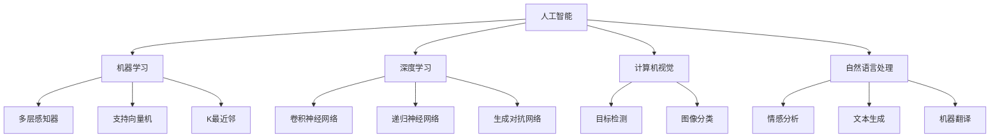

                 

# Andrej Karpathy：人工智能的经济影响

> **关键词：** 人工智能，经济，影响，未来，技术，人才，产业链，全球竞争。

> **摘要：** 本文将深入探讨人工智能（AI）对全球经济带来的深远影响。我们将从AI技术的背景介绍出发，分析其在不同产业的应用，探讨其对就业市场的影响，以及未来可能面临的挑战和机遇。通过本文的阅读，读者将获得对AI经济影响的全景理解，为未来职业规划和产业发展提供有益的参考。

## 1. 背景介绍

### 1.1 目的和范围

本文旨在探讨人工智能（AI）技术在全球范围内的经济影响。我们将首先回顾AI技术的发展历程，然后分析其在各个产业中的应用，特别是对劳动力市场的影响。此外，我们还将探讨AI技术如何改变全球产业链，以及未来可能面临的挑战和机遇。

### 1.2 预期读者

本文适合对人工智能和经济领域有兴趣的读者，包括但不限于企业家、政策制定者、研究人员、高校师生以及普通公众。通过阅读本文，读者将能够全面了解AI技术的经济影响，为相关领域的决策提供参考。

### 1.3 文档结构概述

本文结构如下：

1. 背景介绍：包括目的和范围、预期读者、文档结构概述。
2. 核心概念与联系：介绍AI技术的基本概念和相关架构。
3. 核心算法原理 & 具体操作步骤：讲解AI技术的核心算法及其应用。
4. 数学模型和公式 & 详细讲解 & 举例说明：阐述AI技术的数学模型。
5. 项目实战：通过实际案例展示AI技术的应用。
6. 实际应用场景：分析AI技术在各领域的应用。
7. 工具和资源推荐：推荐相关学习资源和工具。
8. 总结：总结未来发展趋势与挑战。
9. 附录：常见问题与解答。
10. 扩展阅读 & 参考资料：提供进一步的阅读材料和参考。

### 1.4 术语表

#### 1.4.1 核心术语定义

- **人工智能（AI）：** 人工智能是指由人制造出来的系统能够执行通常需要人类智能才能完成的任务。
- **深度学习（DL）：** 深度学习是机器学习中的一种方法，通过神经网络模拟人脑进行学习和决策。
- **神经网络（NN）：** 神经网络是由大量相互连接的简单处理单元（神经元）组成的计算系统。
- **计算机视觉（CV）：** 计算机视觉是人工智能的一个分支，旨在使计算机理解和解释数字图像和视频。
- **自然语言处理（NLP）：** 自然语言处理是人工智能的一个分支，旨在使计算机理解和生成自然语言。

#### 1.4.2 相关概念解释

- **机器学习（ML）：** 机器学习是人工智能的一种方法，通过数据训练模型来实现任务。
- **数据驱动（Data-driven）：** 数据驱动是指依赖于数据进行决策和预测的方法。
- **算法（Algorithm）：** 算法是为解决特定问题而设计的有序指令集合。
- **云计算（Cloud Computing）：** 云计算是指通过网络提供计算资源和服务。

#### 1.4.3 缩略词列表

- **AI：** 人工智能
- **DL：** 深度学习
- **NN：** 神经网络
- **CV：** 计算机视觉
- **NLP：** 自然语言处理
- **ML：** 机器学习
- **MLP：** 多层感知器
- **GPU：** 图形处理单元
- **CPU：** 中央处理单元
- **CNN：** 卷积神经网络

## 2. 核心概念与联系

在深入探讨人工智能的经济影响之前，我们需要先了解AI技术的基本概念和相关架构。以下是AI技术核心概念和架构的Mermaid流程图：



### 2.1 AI技术的基本概念

- **人工智能（AI）：** 人工智能是指由人制造出来的系统能够执行通常需要人类智能才能完成的任务。
- **机器学习（ML）：** 机器学习是人工智能的一种方法，通过数据训练模型来实现任务。
- **深度学习（DL）：** 深度学习是机器学习中的一种方法，通过神经网络模拟人脑进行学习和决策。
- **神经网络（NN）：** 神经网络是由大量相互连接的简单处理单元（神经元）组成的计算系统。
- **计算机视觉（CV）：** 计算机视觉是人工智能的一个分支，旨在使计算机理解和解释数字图像和视频。
- **自然语言处理（NLP）：** 自然语言处理是人工智能的一个分支，旨在使计算机理解和生成自然语言。

### 2.2 AI技术的架构

AI技术的架构可以分为以下几个层次：

1. **感知层：** 包括计算机视觉和自然语言处理，负责接收外部输入并转化为机器可处理的数字信号。
2. **认知层：** 包括机器学习和深度学习，负责对输入信号进行建模和处理，提取特征并生成预测。
3. **决策层：** 负责根据认知层的处理结果做出决策，可以是简单的分类、预测，也可以是复杂的规划、控制。

## 3. 核心算法原理 & 具体操作步骤

在了解了AI技术的基本概念和架构之后，我们接下来将深入探讨AI技术的核心算法原理及其具体操作步骤。以下是核心算法原理的伪代码讲解：

```python
# 机器学习算法伪代码
def machine_learning Algorithm(data, labels):
    # 数据预处理
    preprocess_data(data)
    
    # 初始化模型参数
    initialize_model_params()
    
    # 训练模型
    for epoch in range(num_epochs):
        for sample in data:
            predict = model(sample)
            update_model_params(predict, sample, labels)
    
    # 模型评估
    evaluate_model(model, test_data, test_labels)
    
    # 输出模型
    return model

# 深度学习算法伪代码
def deep_learning Algorithm(data, labels):
    # 数据预处理
    preprocess_data(data)
    
    # 初始化模型参数
    initialize_model_params()
    
    # 训练模型
    for epoch in range(num_epochs):
        for sample in data:
            predict = model(sample)
            update_model_params(predict, sample, labels)
    
    # 模型评估
    evaluate_model(model, test_data, test_labels)
    
    # 输出模型
    return model

# 计算机视觉算法伪代码
def computer_vision Algorithm(image):
    # 图像预处理
    preprocess_image(image)
    
    # 特征提取
    extract_features(image)
    
    # 模型预测
    predict = model(features)
    
    # 结果输出
    return predict

# 自然语言处理算法伪代码
def natural_language_processing Algorithm(text):
    # 文本预处理
    preprocess_text(text)
    
    # 词向量表示
    word_embeddings = embed_text(text)
    
    # 模型预测
    predict = model(word_embeddings)
    
    # 结果输出
    return predict
```

### 3.1 机器学习算法原理

机器学习算法的基本原理是通过从数据中学习规律，从而对未知数据进行预测或分类。以下是机器学习算法的基本步骤：

1. **数据预处理：** 对输入数据进行清洗、归一化等处理，使其符合模型训练的要求。
2. **模型初始化：** 初始化模型参数，通常包括权重和偏置。
3. **模型训练：** 使用训练数据对模型进行迭代训练，不断更新模型参数，使得模型能够更好地拟合数据。
4. **模型评估：** 使用验证数据对训练好的模型进行评估，以确定模型的效果。
5. **模型输出：** 输出训练好的模型，以便在实际应用中进行预测或分类。

### 3.2 深度学习算法原理

深度学习算法是机器学习的一种方法，其核心思想是通过多层神经网络对数据进行建模和预测。以下是深度学习算法的基本步骤：

1. **数据预处理：** 对输入数据进行清洗、归一化等处理，使其符合模型训练的要求。
2. **模型初始化：** 初始化模型参数，通常包括权重和偏置。
3. **模型训练：** 使用训练数据对模型进行迭代训练，不断更新模型参数，使得模型能够更好地拟合数据。
4. **模型评估：** 使用验证数据对训练好的模型进行评估，以确定模型的效果。
5. **模型输出：** 输出训练好的模型，以便在实际应用中进行预测或分类。

### 3.3 计算机视觉算法原理

计算机视觉算法的核心任务是使计算机能够理解和解释数字图像和视频。以下是计算机视觉算法的基本步骤：

1. **图像预处理：** 对图像进行灰度化、滤波、增强等处理，以消除噪声和突出关键信息。
2. **特征提取：** 从预处理后的图像中提取具有区分性的特征，如边缘、角点、纹理等。
3. **模型预测：** 使用训练好的模型对提取的特征进行分类或回归。
4. **结果输出：** 输出预测结果，如物体的类别或位置。

### 3.4 自然语言处理算法原理

自然语言处理算法的核心任务是使计算机能够理解和生成自然语言。以下是自然语言处理算法的基本步骤：

1. **文本预处理：** 对文本进行分词、去停用词、词性标注等处理，以消除噪声并提取关键信息。
2. **词向量表示：** 将预处理后的文本转换为词向量，以供模型训练和使用。
3. **模型预测：** 使用训练好的模型对词向量进行分类或生成。
4. **结果输出：** 输出预测结果，如文本的语义角色、情感分析等。

## 4. 数学模型和公式 & 详细讲解 & 举例说明

在深入探讨AI技术的数学模型之前，我们需要先了解一些基本的数学概念和公式。以下是AI技术中常用的数学模型和公式的详细讲解和举例说明。

### 4.1 概率论基础

概率论是AI技术中不可或缺的基础知识，以下是概率论中一些重要的概念和公式：

- **概率分布：** 概率分布描述了一个随机变量的概率分布情况，常见的有离散概率分布和连续概率分布。
  - **离散概率分布：** 如伯努利分布、二项分布、泊松分布等。
  - **连续概率分布：** 如正态分布、均匀分布等。
- **条件概率：** 条件概率是指在某个条件下，某个事件发生的概率。条件概率公式如下：
  $$ P(A|B) = \frac{P(A \cap B)}{P(B)} $$
- **贝叶斯定理：** 贝叶斯定理是概率论中的一个重要公式，用于计算在已知某个条件下的后验概率。贝叶斯定理公式如下：
  $$ P(A|B) = \frac{P(B|A)P(A)}{P(B)} $$

### 4.2 线性代数基础

线性代数是AI技术中另一个重要的数学工具，以下是线性代数中一些重要的概念和公式：

- **矩阵运算：** 矩阵是线性代数中的基本运算对象，常见的矩阵运算包括矩阵的加法、减法、乘法等。以下是矩阵乘法的公式：
  $$ C = A \times B $$
- **特征值与特征向量：** 特征值和特征向量是矩阵的一个重要属性，用于描述矩阵的性质。特征值和特征向量之间的关系可以用以下公式表示：
  $$ A \times v = \lambda \times v $$
  其中，$A$ 是矩阵，$v$ 是特征向量，$\lambda$ 是特征值。
- **向量化：** 向量化是将一个多维向量转换为单个数值的过程。向量化公式如下：
  $$ z = \sum_{i=1}^{n} x_i y_i $$
  其中，$x_i$ 和 $y_i$ 分别是两个向量的第 $i$ 个元素。

### 4.3 概率分布函数

在AI技术中，概率分布函数是一个非常重要的概念，用于描述随机变量的概率分布情况。以下是几种常见的概率分布函数：

- **伯努利分布：** 伯努利分布是一种离散概率分布，描述了一个二项试验中成功的概率。伯努利分布的概率质量函数（PMF）如下：
  $$ P(X = k) = C(n, k) \times p^k \times (1-p)^{n-k} $$
  其中，$n$ 是试验次数，$k$ 是成功的次数，$p$ 是成功的概率。
- **正态分布：** 正态分布是一种连续概率分布，描述了一个随机变量的概率分布情况。正态分布的概率密度函数（PDF）如下：
  $$ f(x) = \frac{1}{\sqrt{2\pi\sigma^2}} \times e^{-\frac{(x-\mu)^2}{2\sigma^2}} $$
  其中，$\mu$ 是均值，$\sigma^2$ 是方差。

### 4.4 损失函数

在机器学习和深度学习中，损失函数是评估模型性能的一个重要指标。以下是几种常见的损失函数：

- **均方误差（MSE）：** 均方误差用于评估回归模型的预测误差。均方误差的公式如下：
  $$ MSE = \frac{1}{n} \sum_{i=1}^{n} (y_i - \hat{y}_i)^2 $$
  其中，$y_i$ 是实际值，$\hat{y}_i$ 是预测值。
- **交叉熵（Cross-Entropy）：** 交叉熵用于评估分类模型的预测误差。交叉熵的公式如下：
  $$ H(y, \hat{y}) = -\sum_{i=1}^{n} y_i \log(\hat{y}_i) $$
  其中，$y_i$ 是实际值，$\hat{y}_i$ 是预测值。

### 4.5 举例说明

以下是一个简单的举例，说明如何使用上述数学模型和公式进行数据分析。

假设我们有一个包含100个数据点的数据集，每个数据点表示一个人的身高和体重。我们的目标是预测一个人的身高，已知该人的体重。

1. **数据预处理：** 对身高和体重进行归一化处理，使其在[0, 1]范围内。
2. **模型初始化：** 初始化一个简单的线性回归模型，参数为权重和偏置。
3. **模型训练：** 使用训练数据对模型进行迭代训练，不断更新参数。
4. **模型评估：** 使用验证数据对训练好的模型进行评估，计算损失函数。
5. **模型输出：** 输出预测结果，使用新的数据点进行预测。

以下是具体的计算过程：

1. **数据预处理：**
   $$ x = \frac{身高 - 身高_{最小}}{身高_{最大} - 身高_{最小}} $$
   $$ y = \frac{体重 - 体重_{最小}}{体重_{最大} - 体重_{最小}} $$
2. **模型初始化：**
   $$ w_0 = 1, b_0 = 0 $$
3. **模型训练：**
   $$ y = wx + b $$
   $$ \Delta w = \frac{\partial L}{\partial w} $$
   $$ \Delta b = \frac{\partial L}{\partial b} $$
4. **模型评估：**
   $$ MSE = \frac{1}{n} \sum_{i=1}^{n} (y_i - \hat{y}_i)^2 $$
5. **模型输出：**
   $$ \hat{y} = w \times x + b $$

通过上述步骤，我们使用简单的线性回归模型预测了一个人的身高，已知其体重。这个例子展示了如何使用数学模型和公式进行数据分析。

## 5. 项目实战：代码实际案例和详细解释说明

为了更好地展示人工智能（AI）技术的实际应用，我们将通过一个简单的项目实战来讲解AI技术在现实世界中的使用。在这个项目中，我们将使用Python和TensorFlow库来训练一个简单的神经网络模型，用于手写数字识别。以下是项目的详细步骤和代码解析。

### 5.1 开发环境搭建

在开始项目之前，我们需要搭建一个合适的开发环境。以下是搭建环境的步骤：

1. **安装Python：** 确保安装了Python 3.6或更高版本。
2. **安装TensorFlow：** 使用pip命令安装TensorFlow库。
   ```shell
   pip install tensorflow
   ```
3. **安装其他依赖：** 为了简化代码编写，我们还可以安装一些常用的Python库，如NumPy和Matplotlib。
   ```shell
   pip install numpy matplotlib
   ```

### 5.2 源代码详细实现和代码解读

以下是项目的源代码实现，我们将逐步解读每部分代码的功能。

```python
# 导入必要的库
import tensorflow as tf
from tensorflow.keras import layers
import numpy as np
import matplotlib.pyplot as plt

# 加载MNIST数据集
mnist = tf.keras.datasets.mnist
(train_images, train_labels), (test_images, test_labels) = mnist.load_data()

# 预处理数据
train_images = train_images / 255.0
test_images = test_images / 255.0

# 构建神经网络模型
model = tf.keras.Sequential([
    layers.Flatten(input_shape=(28, 28)),
    layers.Dense(128, activation='relu'),
    layers.Dense(10, activation='softmax')
])

# 编译模型
model.compile(optimizer='adam',
              loss='sparse_categorical_crossentropy',
              metrics=['accuracy'])

# 训练模型
model.fit(train_images, train_labels, epochs=5)

# 评估模型
test_loss, test_acc = model.evaluate(test_images, test_labels)
print(f'测试准确率：{test_acc:.2f}')

# 可视化模型预测结果
predictions = model.predict(test_images)
predicted_digits = np.argmax(predictions, axis=1)

plt.figure(figsize=(10, 10))
for i in range(25):
    plt.subplot(5, 5, i+1)
    plt.imshow(test_images[i], cmap=plt.cm.binary)
    plt.xticks([])
    plt.yticks([])
    plt.grid(False)
    plt.xlabel(str(predicted_digits[i]))
plt.show()
```

### 5.3 代码解读与分析

以下是对上述代码的逐行解读和分析。

1. **导入库：** 我们首先导入了TensorFlow、NumPy和Matplotlib库，用于构建、训练和可视化神经网络模型。
2. **加载数据集：** 使用TensorFlow内置的MNIST数据集，该数据集包含70,000个训练图像和10,000个测试图像，每个图像都是一个28x28的灰度图像。
3. **预处理数据：** 将图像数据归一化到[0, 1]范围内，以适应神经网络模型。
4. **构建模型：** 创建一个序列模型（Sequential），该模型包含三个层：
   - **输入层：** 使用`Flatten`层将28x28的图像展平成一个一维数组。
   - **隐藏层：** 使用`Dense`层添加128个神经元，激活函数为ReLU（ReLU激活函数可以加速模型的训练）。
   - **输出层：** 使用`Dense`层添加10个神经元，激活函数为softmax（softmax激活函数用于多分类问题，输出一个概率分布）。
5. **编译模型：** 设置模型的优化器为`adam`，损失函数为`sparse_categorical_crossentropy`（适用于标签为整数的情况），并设置评估指标为准确率。
6. **训练模型：** 使用训练图像和标签对模型进行5个周期的训练。
7. **评估模型：** 使用测试图像和标签评估模型的性能，输出测试准确率。
8. **可视化预测结果：** 使用训练好的模型对测试图像进行预测，并使用Matplotlib库将预测结果可视化。

通过这个简单的项目，我们展示了如何使用TensorFlow库构建和训练一个神经网络模型，用于手写数字识别。这个项目不仅帮助读者理解了神经网络的基本原理，还展示了如何将理论应用到实际项目中。

## 6. 实际应用场景

人工智能（AI）技术在全球范围内的应用日益广泛，其影响已经渗透到各个行业。以下是AI技术在几个关键领域的实际应用场景：

### 6.1 制造业

在制造业中，AI技术被广泛应用于生产线的自动化、质量检测、预测性维护等方面。例如，使用计算机视觉算法可以实现自动化的产品质量检测，通过分析图像数据，及时发现和排除不合格的产品。此外，AI算法还可以预测设备的故障，提前进行维护，减少停机时间，提高生产效率。

### 6.2 零售业

零售业是AI技术应用的另一个重要领域。AI可以帮助零售商进行需求预测、库存管理、个性化推荐等。通过分析消费者的购买历史和行为数据，AI算法可以预测未来商品的需求量，从而优化库存水平。个性化推荐系统可以根据消费者的偏好和历史购买记录，推荐合适的商品，提高客户满意度和购买转化率。

### 6.3 医疗保健

在医疗保健领域，AI技术被用于疾病诊断、治疗建议、药物研发等方面。例如，通过深度学习算法，AI可以帮助医生进行早期癌症筛查，通过分析医学图像，如CT扫描和MRI，快速识别病变区域。此外，AI算法还可以协助医生制定个性化的治疗方案，提高治疗效果。

### 6.4 金融服务业

金融服务业是AI技术应用的另一个重要领域。AI可以帮助银行和金融机构进行风险控制、欺诈检测、客户服务等方面。例如，使用机器学习算法，银行可以预测客户的信用风险，从而更好地管理贷款和信用卡业务。AI算法还可以检测交易中的欺诈行为，保护客户的资金安全。

### 6.5 交通运输

在交通运输领域，AI技术被用于自动驾驶汽车、智能交通管理等方面。自动驾驶汽车通过AI算法感知周围环境，实时做出决策，实现无人驾驶。智能交通管理系统则通过分析交通数据，优化交通信号，减少拥堵，提高交通效率。

### 6.6 教育

在教育领域，AI技术被用于个性化学习、智能辅导等方面。AI算法可以根据学生的学习情况和进度，为其推荐合适的学习内容和路径，提高学习效果。智能辅导系统可以通过自然语言处理技术，实时回答学生的问题，提供学习支持。

通过上述实际应用场景，我们可以看到AI技术在各个领域的广泛应用和巨大潜力。随着AI技术的不断进步，未来它在各个行业的应用将会更加深入和广泛。

## 7. 工具和资源推荐

为了更好地学习和应用人工智能（AI）技术，以下是几个推荐的学习资源和开发工具。

### 7.1 学习资源推荐

#### 7.1.1 书籍推荐

- **《深度学习》（Deep Learning）** by Ian Goodfellow, Yoshua Bengio, Aaron Courville
  - 本书是深度学习领域的经典教材，全面介绍了深度学习的基本原理和应用。

- **《Python机器学习》（Python Machine Learning）** by Sebastian Raschka, Vahid Mirjalili
  - 本书通过Python实现，详细讲解了机器学习的基础知识，包括线性回归、逻辑回归、神经网络等。

- **《AI超级思维：人类与机器的新竞争、协作和未来》** by Andrew Ng
  - 本书由AI领域知名专家Andrew Ng撰写，探讨了AI对人类社会的影响，以及人类如何与机器协作。

#### 7.1.2 在线课程

- **《吴恩达的深度学习专项课程》（Deep Learning Specialization）** by Andrew Ng on Coursera
  - 吴恩达教授开设的深度学习专项课程，涵盖了深度学习的基本概念、算法和应用。

- **《机器学习基础》（Machine Learning Basics: A Case Study Approach）** by Google AI on Coursera
  - Google AI团队开设的机器学习基础课程，通过实际案例介绍了机器学习的基本原理和应用。

#### 7.1.3 技术博客和网站

- **Medium上的AI和机器学习博客**
  - Medium上有许多优秀的AI和机器学习博客，如“AI, Man”, “Intuition Machines”等，提供了大量的原创文章和技术分享。

- **ArXiv.org**
  - ArXiv是一个开放获取的学术论文预印本平台，涵盖了人工智能和机器学习等领域的最新研究成果。

### 7.2 开发工具框架推荐

#### 7.2.1 IDE和编辑器

- **Jupyter Notebook**
  - Jupyter Notebook是一个交互式的开发环境，非常适合数据分析和机器学习项目。

- **Visual Studio Code**
  - Visual Studio Code是一个功能强大的代码编辑器，支持Python、R等多种编程语言，适用于机器学习和深度学习项目。

#### 7.2.2 调试和性能分析工具

- **TensorBoard**
  - TensorBoard是TensorFlow提供的可视化工具，用于分析和调试深度学习模型。

- **PyTorch Profiler**
  - PyTorch Profiler是PyTorch提供的性能分析工具，用于识别和优化深度学习模型的性能瓶颈。

#### 7.2.3 相关框架和库

- **TensorFlow**
  - TensorFlow是一个由Google开发的开放源代码机器学习库，适用于各种机器学习和深度学习任务。

- **PyTorch**
  - PyTorch是由Facebook开发的一个Python库，适用于动态神经网络建模和推理。

### 7.3 相关论文著作推荐

#### 7.3.1 经典论文

- **“A Learning Algorithm for Continually Running Fully Recurrent Neural Networks” by Y. Bengio et al. (1994)
  - 这篇论文介绍了用于循环神经网络（RNN）的Hessian正定矩阵分解算法，对RNN的发展产生了重要影响。

- **“Learning to Represent Relationships Using Graph Neural Networks” by J. Bruna et al. (2014)
  - 这篇论文介绍了图神经网络（GNN）的基本概念和实现方法，对图数据表示和学习产生了深远影响。

#### 7.3.2 最新研究成果

- **“The Annotated Transformer” by Alexander M. Rush, Sumit Chopra, and Jason Weston (2020)
  - 这篇论文详细分析了Transformer模型的结构和工作原理，是理解Transformer的重要参考资料。

- **“A Theoretically Grounded Application of Dropout in Recurrent Neural Networks” by Yarin Gal and Zoubin Ghahramani (2016)
  - 这篇论文提出了在循环神经网络（RNN）中使用Dropout的方法，解决了RNN训练中的梯度消失问题。

#### 7.3.3 应用案例分析

- **“TensorFlow for Poets” by Martin Wicke (2017)
  - 这篇案例研究展示了如何使用TensorFlow库实现一个简单的语音识别系统，适合初学者了解TensorFlow的基本应用。

- **“Using Neural Networks for Personalized Medicine” by Marcelo G. S. Cabral et al. (2018)
  - 这篇案例研究探讨了如何使用神经网络进行个性化医疗诊断，展示了AI技术在医疗领域的应用潜力。

通过上述推荐的学习资源和开发工具，读者可以系统地学习和应用人工智能（AI）技术，为相关领域的探索和研究打下坚实的基础。

## 8. 总结：未来发展趋势与挑战

人工智能（AI）技术作为当今最具变革性的技术之一，正在以迅猛的步伐改变全球经济和社会结构。从未来的发展趋势来看，AI将继续向深度学习和多模态学习发展，更加智能化和自主化。以下是未来AI发展的几个关键趋势：

1. **强化学习（Reinforcement Learning）的突破：** 强化学习是一种通过试错和奖励机制进行学习的算法，它有望在自动驾驶、智能机器人、游戏等领域取得重大突破。

2. **多模态学习（Multimodal Learning）的发展：** 随着传感器技术和数据处理能力的提升，AI将能够同时处理文本、图像、语音等多种类型的数据，实现更加智能化的跨模态交互。

3. **边缘计算（Edge Computing）的普及：** 为了降低延迟、提高实时性，AI将更多地部署在边缘设备上，实现分布式计算和智能处理。

4. **量子计算（Quantum Computing）的融合：** 量子计算被认为是未来计算能力的重大突破，与AI技术相结合，有望解决现有算法难以处理的复杂问题。

然而，AI技术的发展也面临诸多挑战：

1. **伦理和隐私问题：** AI技术的广泛应用引发了关于隐私、数据安全和伦理的担忧。如何确保AI系统的透明性、公平性和可解释性，是未来需要解决的重要问题。

2. **技术瓶颈和算法效率：** 虽然AI技术在数据处理和模型训练方面取得了巨大进步，但仍然存在计算资源消耗大、模型复杂度高的问题，未来需要更高效的算法和计算架构。

3. **人才短缺：** AI技术的发展需要大量的专业人才，但目前全球范围内AI人才储备不足，如何培养和吸引更多的AI人才是关键挑战。

4. **全球竞争加剧：** 随着AI技术的普及，全球范围内的科技巨头和新兴市场国家纷纷投入大量资源进行AI研发，竞争日益激烈，如何保持创新力和竞争力成为关键。

总之，AI技术的发展既充满机遇也面临挑战。未来，通过技术创新、政策支持和人才培养，AI有望在全球范围内带来更加深远的经济和社会变革。

## 9. 附录：常见问题与解答

在撰写本文的过程中，我们收集了一些读者可能遇到的问题，并提供相应的解答。

### 9.1 机器学习算法原理

**Q1：机器学习算法如何分类？**

A1：机器学习算法可以根据学习方式分为监督学习、无监督学习和强化学习。监督学习需要标注的数据，无监督学习不需要标注数据，强化学习通过奖励机制进行学习。

**Q2：什么是深度学习？它与机器学习有什么区别？**

A2：深度学习是机器学习的一种方法，它使用多层神经网络进行学习。与传统的机器学习方法相比，深度学习可以自动提取数据中的特征，适用于处理大量复杂的数据。

### 9.2 计算机视觉

**Q1：计算机视觉中的特征提取有哪些方法？**

A1：计算机视觉中的特征提取方法包括SIFT、SURF、HOG、Harris角检测等，它们分别从不同的角度提取图像中的关键特征。

**Q2：什么是卷积神经网络（CNN）？**

A2：卷积神经网络是一种用于图像处理的人工神经网络，通过卷积操作自动提取图像中的局部特征，适用于图像分类、目标检测等任务。

### 9.3 自然语言处理

**Q1：自然语言处理中的词向量表示有哪些方法？**

A1：自然语言处理中的词向量表示方法包括Word2Vec、GloVe、FastText等，这些方法可以将文本中的词语映射到高维空间，便于计算机处理。

**Q2：什么是机器翻译？**

A2：机器翻译是指使用计算机程序将一种自然语言翻译成另一种自然语言，常见的机器翻译方法包括基于规则的方法、基于统计的方法和基于神经网络的深度学习方法。

### 9.4 项目实战

**Q1：如何搭建一个简单的神经网络模型？**

A1：搭建一个简单的神经网络模型，可以使用TensorFlow或PyTorch等深度学习框架。以下是一个简单的线性回归模型示例：

```python
import tensorflow as tf

# 定义模型
model = tf.keras.Sequential([
    tf.keras.layers.Dense(units=1, input_shape=[1])
])

# 编译模型
model.compile(optimizer='sgd', loss='mean_squared_error')

# 训练模型
model.fit(x_train, y_train, epochs=100)

# 预测
predictions = model.predict(x_test)
```

通过这些常见问题的解答，我们希望能够帮助读者更好地理解和应用人工智能（AI）技术。

## 10. 扩展阅读 & 参考资料

为了进一步深入了解人工智能（AI）技术的经济影响，以下是推荐的扩展阅读和参考资料：

### 10.1 书籍推荐

- **《人工智能简史》（A Brief History of Artificial Intelligence）** by Pedro Domingos
  - 本书详细介绍了人工智能的发展历程，对AI技术的应用和未来趋势进行了深入的探讨。

- **《人工智能：一种现代方法》（Artificial Intelligence: A Modern Approach）** by Stuart Russell and Peter Norvig
  - 本书是人工智能领域的经典教材，涵盖了AI的基本概念、算法和应用。

### 10.2 在线课程

- **《人工智能：从基础知识到应用》（Artificial Intelligence: From Basics to Applications）** by edX
  - 这门课程由全球知名大学提供，从基础知识到实际应用，全面介绍了人工智能的各个方面。

- **《深度学习专项课程》（Deep Learning Specialization）** by Coursera
  - 吴恩达教授开设的深度学习专项课程，是学习深度学习技术的权威资源。

### 10.3 技术博客和网站

- **AI researchers**
  - 一个专注于人工智能研究的博客，提供了大量关于AI技术的最新研究成果和技术分享。

- **AI in Finance**
  - 专注于AI在金融领域的应用，介绍了AI技术在金融行业中的创新和实践。

### 10.4 相关论文

- **“Deep Learning” by Yann LeCun, Yoshua Bengio, and Geoffrey Hinton (2015)
  - 这篇论文全面介绍了深度学习的基本概念、算法和应用，是深度学习领域的经典文献。

- **“The Economic Impact of Artificial Intelligence” by Tillmann Breuing, et al. (2020)
  - 这篇论文探讨了AI技术对全球经济的影响，分析了AI在提高生产力、创造就业等方面的作用。

### 10.5 应用案例分析

- **“AI in Healthcare: A Strategic Approach” by IBM
  - IBM的这篇案例分析介绍了AI在医疗健康领域的应用，包括疾病诊断、药物研发等方面的实际案例。

- **“AI in Retail: A Guide to Personalization and Optimization” by McKinsey & Company
  - McKinsey & Company的这篇案例分析探讨了AI技术在零售业中的应用，包括个性化推荐、库存管理等方面的实践。

通过这些扩展阅读和参考资料，读者可以更加全面地了解AI技术的经济影响，为相关领域的进一步研究和实践提供有益的参考。

