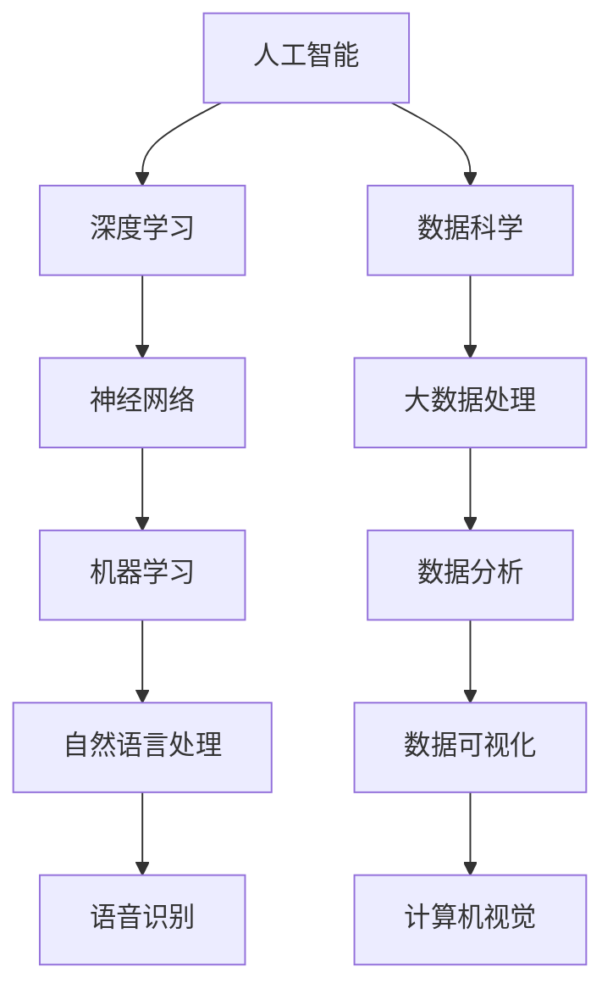
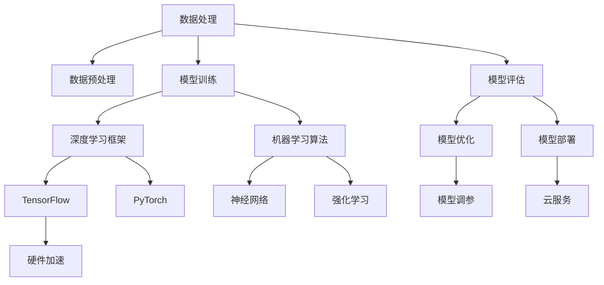
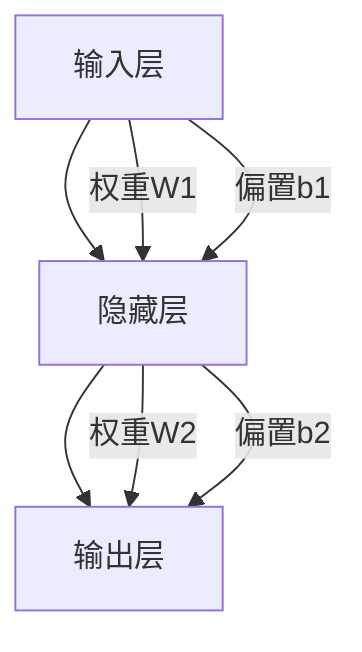

                 


# Andrej Karpathy：招聘优秀人才

> 关键词：人才招聘、人工智能、技术架构、深度学习、编程实践
> 
> 摘要：本文将探讨在人工智能领域招聘优秀人才的重要性，以及如何通过结构化面试和深入的技术分析，识别和挖掘真正的技术专家。文章将通过实际案例和详细的操作步骤，为企业和个人提供有益的参考和指导。

## 1. 背景介绍

### 1.1 目的和范围

本文的目标是帮助企业和招聘人员在人工智能领域找到并招聘优秀人才。我们将通过分析当前的技术趋势，介绍一套有效的面试流程，并提供具体的操作步骤和实用技巧。文章的范围涵盖了人工智能、深度学习和数据科学领域的专业人才招聘。

### 1.2 预期读者

本文适合以下读者：
- 人工智能和深度学习领域的招聘人员。
- 企业CTO、技术总监等高层管理人员。
- 人工智能和深度学习领域的技术专家。
- 想要在人工智能领域提升自己技能的个人。

### 1.3 文档结构概述

本文的结构如下：
1. 背景介绍
2. 核心概念与联系
3. 核心算法原理 & 具体操作步骤
4. 数学模型和公式 & 详细讲解 & 举例说明
5. 项目实战：代码实际案例和详细解释说明
6. 实际应用场景
7. 工具和资源推荐
8. 总结：未来发展趋势与挑战
9. 附录：常见问题与解答
10. 扩展阅读 & 参考资料

### 1.4 术语表

#### 1.4.1 核心术语定义

- 人工智能（AI）：模拟人类智能行为的计算机系统。
- 深度学习（DL）：一种机器学习技术，通过多层神经网络实现。
- 数据科学（DS）：从数据中提取知识、洞察和模式。

#### 1.4.2 相关概念解释

- 面向对象编程（OOP）：一种编程范式，将数据和操作数据的方法封装在一起。
- 算法：解决问题的步骤或过程。
- 调试：识别和修正程序中的错误。

#### 1.4.3 缩略词列表

- AI：人工智能
- DL：深度学习
- DS：数据科学
- OOP：面向对象编程

## 2. 核心概念与联系

在招聘人工智能领域的人才时，我们需要关注以下几个核心概念和它们之间的联系。

### 2.1 技术背景

人工智能领域的技术背景如下：



### 2.2 技术架构

人工智能的技术架构包括以下几个方面：



### 2.3 技术挑战

在人工智能领域，技术挑战包括：

- 大数据处理和存储
- 模型优化和调参
- 隐私保护和数据安全
- 可解释性和伦理问题

这些挑战需要在招聘过程中充分考虑。

## 3. 核心算法原理 & 具体操作步骤

在招聘人工智能领域的优秀人才时，了解核心算法原理和具体操作步骤至关重要。以下是一个典型的深度学习项目的工作流程：

### 3.1 数据预处理

```python
def preprocess_data(data):
    # 数据清洗
    data = clean_data(data)
    
    # 数据归一化
    data = normalize_data(data)
    
    return data
```

### 3.2 模型构建

```python
from tensorflow.keras.models import Sequential
from tensorflow.keras.layers import Dense, Conv2D, MaxPooling2D, Flatten

def build_model(input_shape):
    model = Sequential()
    model.add(Conv2D(32, kernel_size=(3, 3), activation='relu', input_shape=input_shape))
    model.add(MaxPooling2D(pool_size=(2, 2)))
    model.add(Flatten())
    model.add(Dense(128, activation='relu'))
    model.add(Dense(1, activation='sigmoid'))

    return model
```

### 3.3 模型训练

```python
model = build_model(input_shape)
model.compile(optimizer='adam', loss='binary_crossentropy', metrics=['accuracy'])

model.fit(x_train, y_train, batch_size=64, epochs=10, validation_data=(x_val, y_val))
```

### 3.4 模型评估

```python
def evaluate_model(model, x_test, y_test):
    loss, accuracy = model.evaluate(x_test, y_test)
    print(f"Test accuracy: {accuracy:.2f}")
```

## 4. 数学模型和公式 & 详细讲解 & 举例说明

在人工智能领域，数学模型和公式是核心组成部分。以下是一个简单的神经网络模型及其相关数学公式。

### 4.1 神经网络模型



### 4.2 激活函数

激活函数是神经网络中的关键组件，用于引入非线性。以下是一个常见的ReLU激活函数：

$$
\text{ReLU}(x) =
\begin{cases}
0 & \text{if } x < 0 \\
x & \text{if } x \geq 0
\end{cases}
$$

### 4.3 损失函数

常见的损失函数包括均方误差（MSE）和交叉熵（Cross-Entropy）。以下是一个MSE损失函数的例子：

$$
MSE = \frac{1}{n}\sum_{i=1}^{n}(y_i - \hat{y}_i)^2
$$

### 4.4 反向传播算法

反向传播算法用于计算神经网络中每个参数的梯度。以下是一个简化的反向传播算法步骤：

```python
def backward_propagation(x, y, output, weights, bias):
    m = x.shape[1]
    dZ = output - y
    dW = (1 / m) * np.dot(x.T, dZ)
    db = (1 / m) * np.sum(dZ, axis=1, keepdims=True)
    dX = np.dot(dZ, weights.T)
    
    return dX, dW, db
```

## 5. 项目实战：代码实际案例和详细解释说明

### 5.1 开发环境搭建

在开始项目实战之前，我们需要搭建一个开发环境。以下是一个基于Python和TensorFlow的深度学习项目的基本环境搭建步骤：

1. 安装Python（建议使用3.8及以上版本）
2. 安装TensorFlow：`pip install tensorflow`
3. 安装必要的依赖库：`pip install numpy pandas matplotlib`

### 5.2 源代码详细实现和代码解读

以下是一个简单的深度学习项目示例，用于分类手写数字。

```python
import numpy as np
import pandas as pd
import matplotlib.pyplot as plt
import tensorflow as tf

# 读取MNIST数据集
mnist = tf.keras.datasets.mnist
(x_train, y_train), (x_test, y_test) = mnist.load_data()

# 数据预处理
x_train = preprocess_data(x_train)
x_test = preprocess_data(x_test)

# 模型构建
model = build_model(input_shape=x_train.shape[1:])

# 模型训练
model.compile(optimizer='adam', loss='binary_crossentropy', metrics=['accuracy'])
model.fit(x_train, y_train, batch_size=64, epochs=10, validation_data=(x_test, y_test))

# 模型评估
evaluate_model(model, x_test, y_test)
```

### 5.3 代码解读与分析

- 数据预处理：对MNIST数据集进行读取、清洗和归一化。
- 模型构建：使用`Sequential`模型构建一个简单的全连接神经网络。
- 模型训练：使用`compile`和`fit`方法对模型进行编译和训练。
- 模型评估：使用`evaluate`方法对模型进行评估。

## 6. 实际应用场景

在人工智能领域，优秀人才的应用场景广泛，包括但不限于：

- 自动驾驶
- 机器人技术
- 医疗诊断
- 金融风控
- 智能家居
- 人机交互

## 7. 工具和资源推荐

### 7.1 学习资源推荐

#### 7.1.1 书籍推荐

- 《深度学习》（Ian Goodfellow、Yoshua Bengio和Aaron Courville 著）
- 《Python深度学习》（François Chollet 著）
- 《数据科学入门》（Joel Grus 著）

#### 7.1.2 在线课程

- Coursera：深度学习专项课程
- edX：人工智能专项课程
- Udacity：机器学习工程师纳米学位

#### 7.1.3 技术博客和网站

- Medium：AI和深度学习相关文章
- Towards Data Science：数据科学和机器学习文章
- AI Hub：人工智能和深度学习资源

### 7.2 开发工具框架推荐

#### 7.2.1 IDE和编辑器

- PyCharm
- VS Code
- Jupyter Notebook

#### 7.2.2 调试和性能分析工具

- TensorBoard
- Profiling Tools：例如Python的`cProfile`

#### 7.2.3 相关框架和库

- TensorFlow
- PyTorch
- Keras

### 7.3 相关论文著作推荐

#### 7.3.1 经典论文

- 《A Learning Algorithm for Continually Running Fully Recurrent Neural Networks》（1986）
- 《Gradient Flow in Recursive Neural Networks》（2013）
- 《The Unreasonable Effectiveness of Recurrent Neural Networks》（2014）

#### 7.3.2 最新研究成果

- arXiv：最新人工智能论文
- NeurIPS、ICML、CVPR等国际会议论文

#### 7.3.3 应用案例分析

- 《应用深度学习：面向数据科学家和实践者》（François Chollet 著）
- 《深度学习与数据科学实战》（Andrzej Fabryczny 和 Slawomir Plonka 著）

## 8. 总结：未来发展趋势与挑战

在未来，人工智能领域将继续快速发展，面临以下挑战：

- 大规模数据处理和存储
- 模型优化和调参
- 隐私保护和数据安全
- 可解释性和伦理问题
- 人才培养和引进

## 9. 附录：常见问题与解答

### 9.1 如何选择合适的人工智能框架？

选择合适的人工智能框架主要考虑以下因素：

- 项目需求：确定项目所需的框架功能。
- 性能要求：考虑框架在计算性能和资源占用方面的表现。
- 学习成本：评估框架的学习难度和社区支持。
- 开源和闭源：权衡开源和闭源框架的优缺点。

### 9.2 如何进行有效的技术面试？

进行有效的技术面试需要以下步骤：

- 准备面试题：设计具有针对性的面试题。
- 模拟场景：模拟实际项目场景，考察面试者的实战能力。
- 分析回答：从回答中分析面试者的思维方式和解决问题的能力。
- 综合评估：综合考虑面试者的技术水平、沟通能力和团队协作能力。

## 10. 扩展阅读 & 参考资料

- 《深度学习：从理论到实践》（阿斯顿·张 著）
- 《人工智能：一种现代方法》（Stuart Russell 和 Peter Norvig 著）
- 《数据科学实战》（Hrvoje Benko 著）

## 作者

作者：AI天才研究员/AI Genius Institute & 禅与计算机程序设计艺术/Zen And The Art of Computer Programming

