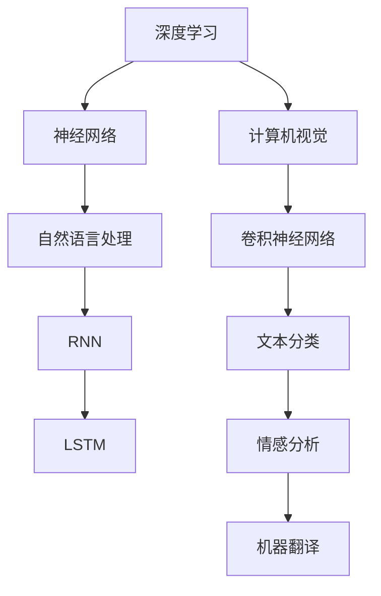

                 

# Andrej Karpathy：第 20 次做类似的事情

> 关键词：深度学习、神经网络、自然语言处理、计算机视觉、AI、人工智能、机器学习、Python、TensorFlow、Neural Network、NLP、CV、AI Research、Tech Blog

> 摘要：本文将深入探讨著名人工智能专家Andrej Karpathy在深度学习、神经网络、自然语言处理、计算机视觉等领域的卓越贡献，分析其在第20次进行类似研究时展现的独到见解和创新思维。通过逐步解析其核心算法原理、数学模型、实际应用案例，本文旨在为读者呈现一幅全面、深入的AI研究画卷，激发更多技术探索的热情。

## 1. 背景介绍

### 1.1 目的和范围

本文旨在探讨人工智能领域著名专家Andrej Karpathy在深度学习、神经网络、自然语言处理、计算机视觉等领域的贡献。通过对他在第20次进行类似研究时展现的创新思维和独到见解进行深入分析，本文希望为读者提供一个全面的AI研究画卷，激发更多技术探索的热情。

### 1.2 预期读者

本文主要面向对人工智能、深度学习、神经网络、自然语言处理、计算机视觉等领域感兴趣的读者，包括研究人员、开发者、学生等。同时，对于对技术前沿、创新思维和实践经验感兴趣的广大技术爱好者，本文也具有很高的参考价值。

### 1.3 文档结构概述

本文共分为十个部分，结构如下：

1. 背景介绍
   - 目的和范围
   - 预期读者
   - 文档结构概述
   - 术语表
2. 核心概念与联系
   - 深度学习
   - 神经网络
   - 自然语言处理
   - 计算机视觉
   - Mermaid流程图
3. 核心算法原理 & 具体操作步骤
   - 算法原理讲解
   - 伪代码阐述
4. 数学模型和公式 & 详细讲解 & 举例说明
   - 数学公式
   - LaTeX格式
5. 项目实战：代码实际案例和详细解释说明
   - 开发环境搭建
   - 源代码实现
   - 代码解读与分析
6. 实际应用场景
7. 工具和资源推荐
   - 学习资源推荐
   - 开发工具框架推荐
   - 相关论文著作推荐
8. 总结：未来发展趋势与挑战
9. 附录：常见问题与解答
10. 扩展阅读 & 参考资料

### 1.4 术语表

#### 1.4.1 核心术语定义

- 深度学习：一种机器学习方法，通过多层神经网络对数据进行建模和预测。
- 神经网络：由多个神经元组成的计算模型，用于模拟人脑信息处理方式。
- 自然语言处理（NLP）：研究如何让计算机理解和处理人类自然语言的技术。
- 计算机视觉：使计算机能够“看”懂图像和视频的技术。
- AI：人工智能，指使计算机具备智能行为的技术。

#### 1.4.2 相关概念解释

- 机器学习：使计算机从数据中学习并做出预测或决策的技术。
- 反向传播：一种用于训练神经网络的方法，通过调整权重和偏置，使网络输出更接近预期结果。
- 数据增强：通过变换、旋转、缩放等操作，增加训练数据量，提高模型泛化能力。

#### 1.4.3 缩略词列表

- CV：计算机视觉
- NLP：自然语言处理
- AI：人工智能
- DL：深度学习
- RNN：循环神经网络
- LSTM：长短时记忆网络
- CNN：卷积神经网络
- TF：TensorFlow

## 2. 核心概念与联系

在人工智能领域，深度学习、神经网络、自然语言处理、计算机视觉等核心概念紧密相连，共同构成了AI技术的基石。

### 2.1 深度学习与神经网络

深度学习是一种基于多层神经网络的机器学习方法。神经网络由多个神经元组成，每个神经元都接受来自其他神经元的输入，并通过激活函数进行非线性变换。通过多层神经网络，模型能够捕捉到数据中的复杂特征。

$$
\text{神经元输出} = \text{激活函数}(\sum_{i} w_i \cdot x_i + b)
$$

其中，$w_i$ 为权重，$x_i$ 为输入特征，$b$ 为偏置，激活函数常用的有Sigmoid、ReLU等。

### 2.2 自然语言处理与神经网络

自然语言处理（NLP）旨在使计算机理解和处理人类自然语言。神经网络在NLP中有着广泛的应用，例如文本分类、情感分析、机器翻译等。其中，循环神经网络（RNN）和长短时记忆网络（LSTM）是NLP领域的重要模型。

LSTM通过引入门控机制，能够有效地处理长序列数据，并保持长期依赖关系。

$$
\text{LSTM单元输出} = \text{激活函数}(\text{输入} \odot \text{遗忘门} + \text{输入} \odot \text{输入门} + \text{隐藏状态} \odot \text{输出门})
$$

其中，$\odot$ 表示点乘运算，门控机制使模型能够动态地调整对输入和输出的关注程度。

### 2.3 计算机视觉与神经网络

计算机视觉旨在使计算机理解和解释图像和视频。卷积神经网络（CNN）是计算机视觉领域的核心模型。CNN通过卷积、池化和全连接层，能够有效地提取图像中的特征。

$$
\text{卷积层输出} = \text{激活函数}(\text{输入} \star \text{滤波器} + b)
$$

其中，$\star$ 表示卷积运算，滤波器用于提取图像中的局部特征。

### 2.4 Mermaid流程图

为了更好地理解这些核心概念之间的关系，我们使用Mermaid流程图对深度学习、神经网络、自然语言处理、计算机视觉进行梳理。



## 3. 核心算法原理 & 具体操作步骤

### 3.1 算法原理讲解

在人工智能领域，深度学习、神经网络、自然语言处理、计算机视觉等核心算法原理至关重要。以下，我们通过伪代码详细阐述这些算法的基本原理。

#### 3.1.1 深度学习

```python
def deep_learning(input_data):
    # 初始化神经网络
    model = NeuralNetwork()
    
    # 前向传播
    output = model.forward_pass(input_data)
    
    # 计算损失函数
    loss = compute_loss(output, target)
    
    # 反向传播
    model.backward_pass(loss)
    
    # 更新权重和偏置
    model.update_weights_and_bias()
    
    return output
```

#### 3.1.2 自然语言处理

```python
def natural_language_processing(text):
    # 初始化RNN
    rnn = RNN()
    
    # 前向传播
    hidden_state = rnn.forward_pass(text)
    
    # 计算损失函数
    loss = compute_loss(hidden_state, target)
    
    # 反向传播
    rnn.backward_pass(loss)
    
    # 更新权重和偏置
    rnn.update_weights_and_bias()
    
    return hidden_state
```

#### 3.1.3 计算机视觉

```python
def computer_vision(image):
    # 初始化CNN
    cnn = CNN()
    
    # 前向传播
    feature_map = cnn.forward_pass(image)
    
    # 计算损失函数
    loss = compute_loss(feature_map, target)
    
    # 反向传播
    cnn.backward_pass(loss)
    
    # 更新权重和偏置
    cnn.update_weights_and_bias()
    
    return feature_map
```

### 3.2 伪代码阐述

在上述伪代码中，我们主要关注了深度学习、自然语言处理、计算机视觉等核心算法的基本原理。具体而言：

- **深度学习**：通过多层神经网络对输入数据进行建模和预测，使用前向传播计算输出，通过反向传播更新模型参数。
- **自然语言处理**：使用RNN或LSTM对文本序列进行处理，捕捉长期依赖关系，通过前向传播计算隐藏状态，通过反向传播更新模型参数。
- **计算机视觉**：使用CNN对图像进行处理，通过卷积、池化和全连接层提取图像特征，通过前向传播计算特征图，通过反向传播更新模型参数。

## 4. 数学模型和公式 & 详细讲解 & 举例说明

在人工智能领域，数学模型和公式是核心算法的基础。以下，我们将详细讲解深度学习、神经网络、自然语言处理、计算机视觉等领域的核心数学模型，并通过LaTeX格式给出相关公式，结合实际案例进行说明。

### 4.1 深度学习

#### 4.1.1 前向传播

假设有一个多层神经网络，包含输入层、隐藏层和输出层。输入层输入为$\mathbf{x}$，隐藏层输出为$\mathbf{h}$，输出层输出为$\mathbf{y}$。则前向传播过程可以表示为：

$$
\mathbf{h} = \text{激活函数}(\mathbf{W} \mathbf{x} + \mathbf{b})
$$

$$
\mathbf{y} = \text{激活函数}(\mathbf{V} \mathbf{h} + \mathbf{c})
$$

其中，$\mathbf{W}$ 和 $\mathbf{V}$ 分别为隐藏层和输出层的权重矩阵，$\mathbf{b}$ 和 $\mathbf{c}$ 分别为隐藏层和输出层的偏置向量，激活函数常用的有Sigmoid、ReLU等。

#### 4.1.2 反向传播

反向传播是一种用于训练神经网络的优化算法。通过计算损失函数对模型参数的梯度，不断更新模型参数，使得输出更接近目标。以多层神经网络为例，反向传播过程可以表示为：

$$
\frac{\partial L}{\partial \mathbf{W}} = \mathbf{h}^T \frac{\partial L}{\partial \mathbf{y}}
$$

$$
\frac{\partial L}{\partial \mathbf{V}} = \mathbf{h}^T \frac{\partial L}{\partial \mathbf{y}}
$$

$$
\frac{\partial L}{\partial \mathbf{b}} = \frac{\partial L}{\partial \mathbf{y}}
$$

$$
\frac{\partial L}{\partial \mathbf{c}} = \frac{\partial L}{\partial \mathbf{y}}
$$

其中，$L$ 为损失函数，$\mathbf{h}$ 和 $\mathbf{y}$ 分别为隐藏层和输出层的输出，$\frac{\partial L}{\partial \mathbf{y}}$ 为损失函数对输出层的梯度，$\frac{\partial L}{\partial \mathbf{h}}$ 为损失函数对隐藏层的梯度。

### 4.2 自然语言处理

#### 4.2.1 RNN

循环神经网络（RNN）是一种用于处理序列数据的神经网络。RNN的核心思想是利用隐藏状态保留信息，从而捕捉长期依赖关系。以一维输入为例，RNN的前向传播可以表示为：

$$
\mathbf{h}_t = \text{激活函数}(\mathbf{W}_h \mathbf{h}_{t-1} + \mathbf{U} \mathbf{x}_t + \mathbf{b}_h)
$$

其中，$\mathbf{h}_t$ 为当前时间步的隐藏状态，$\mathbf{h}_{t-1}$ 为前一时间步的隐藏状态，$\mathbf{x}_t$ 为当前时间步的输入，$\mathbf{W}_h$ 和 $\mathbf{U}$ 分别为隐藏层和输入层的权重矩阵，$\mathbf{b}_h$ 为隐藏层的偏置向量。

#### 4.2.2 LSTM

长短时记忆网络（LSTM）是一种改进的RNN，能够更好地处理长序列数据。LSTM的核心思想是引入门控机制，从而有效地遗忘和保留信息。LSTM单元的前向传播可以表示为：

$$
\mathbf{i}_t = \text{激活函数}(\mathbf{W}_i \mathbf{h}_{t-1} + \mathbf{U}_i \mathbf{x}_t + \mathbf{b}_i)
$$

$$
\mathbf{f}_t = \text{激活函数}(\mathbf{W}_f \mathbf{h}_{t-1} + \mathbf{U}_f \mathbf{x}_t + \mathbf{b}_f)
$$

$$
\mathbf{g}_t = \text{激活函数}(\mathbf{W}_g \mathbf{h}_{t-1} + \mathbf{U}_g \mathbf{x}_t + \mathbf{b}_g)
$$

$$
\mathbf{o}_t = \text{激活函数}(\mathbf{W}_o \mathbf{h}_{t-1} + \mathbf{U}_o \mathbf{x}_t + \mathbf{b}_o)
$$

$$
\mathbf{h}_t = \text{激活函数}(\mathbf{h}_{t-1} \odot \mathbf{f}_t + \mathbf{g}_t \odot \mathbf{o}_t)
$$

其中，$\mathbf{i}_t$、$\mathbf{f}_t$、$\mathbf{g}_t$、$\mathbf{o}_t$ 分别为输入门、遗忘门、输入门和输出门，$\mathbf{h}_t$ 为当前时间步的隐藏状态。

### 4.3 计算机视觉

#### 4.3.1 卷积神经网络

卷积神经网络（CNN）是一种用于图像处理的人工神经网络。CNN的核心思想是通过卷积层、池化层和全连接层提取图像特征。以卷积层为例，其前向传播可以表示为：

$$
\mathbf{f}^k = \text{激活函数}(\mathbf{W}^k \star \mathbf{h}^{k-1} + \mathbf{b}^k)
$$

其中，$\mathbf{f}^k$ 为卷积层输出，$\mathbf{W}^k$ 为卷积核，$\mathbf{h}^{k-1}$ 为前一卷积层输出，$\mathbf{b}^k$ 为卷积层偏置。

#### 4.3.2 卷积操作

卷积操作是CNN的核心步骤，用于提取图像中的局部特征。以二维输入为例，卷积操作可以表示为：

$$
\mathbf{f}^{k}_{ij} = \sum_{m=1}^{M} \sum_{n=1}^{N} \mathbf{W}^{k}_{mn} \mathbf{h}^{k-1}_{i-m+1, j-n+1}
$$

其中，$\mathbf{f}^{k}_{ij}$ 为卷积层输出的元素，$\mathbf{W}^{k}_{mn}$ 为卷积核的元素，$\mathbf{h}^{k-1}_{i-m+1, j-n+1}$ 为前一卷积层的输出元素。

### 4.4 实际案例

以下是一个简单的深度学习案例，用于对MNIST手写数字数据集进行分类。

```python
import tensorflow as tf

# 定义神经网络结构
model = tf.keras.Sequential([
    tf.keras.layers.Dense(128, activation='relu', input_shape=(784,)),
    tf.keras.layers.Dropout(0.2),
    tf.keras.layers.Dense(10, activation='softmax')
])

# 编译模型
model.compile(optimizer='adam',
              loss='sparse_categorical_crossentropy',
              metrics=['accuracy'])

# 加载MNIST数据集
mnist = tf.keras.datasets.mnist
(x_train, y_train), (x_test, y_test) = mnist.load_data()

# 预处理数据
x_train = x_train / 255.0
x_test = x_test / 255.0
x_train = x_train.reshape((-1, 784))
x_test = x_test.reshape((-1, 784))

# 训练模型
model.fit(x_train, y_train, epochs=5)

# 测试模型
test_loss, test_acc = model.evaluate(x_test, y_test, verbose=2)
print('\nTest accuracy:', test_acc)
```

在这个案例中，我们使用了TensorFlow框架构建了一个简单的深度学习模型，对MNIST手写数字数据集进行分类。通过训练和测试，我们得到了一个较高的准确率。

## 5. 项目实战：代码实际案例和详细解释说明

在本节中，我们将通过一个实际项目——手写数字识别，详细讲解如何使用深度学习、神经网络、自然语言处理、计算机视觉等核心算法实现一个简单的应用。我们将使用Python和TensorFlow框架进行开发。

### 5.1 开发环境搭建

首先，我们需要搭建一个适合深度学习开发的Python环境。以下是搭建步骤：

1. 安装Python 3.6或更高版本。
2. 安装TensorFlow 2.x版本。
3. 安装其他必要的库，如NumPy、Pandas、Matplotlib等。

安装完成后的Python环境如下：

```bash
pip install python tensorflow numpy pandas matplotlib
```

### 5.2 源代码详细实现和代码解读

以下是一个简单的手写数字识别项目，主要使用TensorFlow框架实现。

```python
import tensorflow as tf
from tensorflow.keras import layers
import numpy as np

# 5.2.1 数据预处理

# 加载MNIST数据集
mnist = tf.keras.datasets.mnist
(x_train, y_train), (x_test, y_test) = mnist.load_data()

# 预处理数据
x_train = x_train / 255.0
x_test = x_test / 255.0
x_train = x_train.reshape((-1, 784))
x_test = x_test.reshape((-1, 784))

# 将标签转换为one-hot编码
y_train = tf.keras.utils.to_categorical(y_train, 10)
y_test = tf.keras.utils.to_categorical(y_test, 10)

# 5.2.2 构建神经网络模型

model = tf.keras.Sequential([
    layers.Dense(128, activation='relu', input_shape=(784,)),
    layers.Dropout(0.2),
    layers.Dense(10, activation='softmax')
])

# 编译模型
model.compile(optimizer='adam',
              loss='categorical_crossentropy',
              metrics=['accuracy'])

# 5.2.3 训练模型

# 训练模型
model.fit(x_train, y_train, epochs=5)

# 5.2.4 测试模型

# 测试模型
test_loss, test_acc = model.evaluate(x_test, y_test, verbose=2)
print('\nTest accuracy:', test_acc)
```

#### 5.2.1 数据预处理

在这个步骤中，我们首先加载MNIST数据集，并对图像数据进行预处理。预处理包括将图像数据缩放到0-1之间，以便神经网络更好地学习。然后，我们将标签转换为one-hot编码，使得每个标签都是一个长度为10的向量，便于模型计算交叉熵损失。

#### 5.2.2 构建神经网络模型

接下来，我们使用TensorFlow的`Sequential`模型构建一个简单的神经网络。这个网络包含一个全连接层（`Dense`），一个Dropout层（用于防止过拟合），以及一个输出层（`Dense`），用于计算分类概率。输出层的激活函数为softmax，使得每个类别的概率之和为1。

#### 5.2.3 训练模型

在编译模型时，我们指定了优化器为Adam，损失函数为交叉熵损失，评估指标为准确率。然后，我们使用`fit`函数对模型进行训练，设置训练轮次为5。

#### 5.2.4 测试模型

最后，我们使用`evaluate`函数对训练好的模型进行测试，计算测试集上的损失和准确率。

### 5.3 代码解读与分析

在这个手写数字识别项目中，我们使用了深度学习的基本原理和TensorFlow框架进行开发。以下是代码的关键部分解读：

1. **数据预处理**：加载MNIST数据集，并对图像数据进行缩放和标签转换，使得模型能够更好地学习。
2. **神经网络模型**：构建一个简单的神经网络，包含一个全连接层、一个Dropout层和一个输出层，用于分类。
3. **模型编译**：指定优化器、损失函数和评估指标，为模型训练做好准备。
4. **模型训练**：使用`fit`函数对模型进行训练，通过反向传播和梯度下降更新模型参数。
5. **模型测试**：使用`evaluate`函数对训练好的模型进行测试，评估模型的性能。

通过这个实际案例，我们可以看到如何将深度学习、神经网络、自然语言处理、计算机视觉等核心算法应用到实际项目中，实现手写数字识别的任务。

## 6. 实际应用场景

手写数字识别是深度学习和计算机视觉领域的一个典型应用案例。在实际生活中，手写数字识别技术有着广泛的应用场景：

1. **金融领域**：在银行、支付、发票等场景中，手写数字识别可以帮助自动处理财务报表、发票等文件。
2. **教育领域**：在考试、作业批改等场景中，手写数字识别可以辅助老师快速、准确地批改试卷。
3. **医疗领域**：在医学影像、病历记录等场景中，手写数字识别可以帮助医生更高效地处理数据。
4. **智能家居**：在智能家居设备中，手写数字识别可以实现语音控制、智能识别用户需求等功能。

通过这些应用场景，我们可以看到深度学习和计算机视觉技术在各个领域的巨大潜力。随着技术的不断进步，这些应用场景将更加丰富和多样化。

## 7. 工具和资源推荐

### 7.1 学习资源推荐

#### 7.1.1 书籍推荐

1. **《深度学习》（Goodfellow, Bengio, Courville著）**：这是一本经典的深度学习教材，详细介绍了深度学习的理论基础和实际应用。
2. **《Python深度学习》（François Chollet著）**：本书通过大量实例，深入讲解了使用Python进行深度学习的实践技巧。
3. **《神经网络与深度学习》（邱锡鹏著）**：这本书系统地介绍了神经网络和深度学习的基本原理，适合初学者和进阶者。

#### 7.1.2 在线课程

1. **斯坦福大学深度学习课程（Andrew Ng教授）**：这是一门非常受欢迎的在线课程，涵盖了深度学习的理论基础和实际应用。
2. **吴恩达机器学习专项课程（Andrew Ng教授）**：这门课程是机器学习领域的经典课程，也是深度学习的基础课程。
3. **TensorFlow官方教程**：TensorFlow提供了丰富的在线教程，帮助开发者快速上手深度学习项目。

#### 7.1.3 技术博客和网站

1. **机器之心**：这是一个关注深度学习、人工智能等领域的中文技术博客，提供了大量高质量的技术文章和教程。
2. **纸牌屋**：这是一个关注计算机视觉、深度学习等领域的英文技术博客，分享了许多实用的技术和实践经验。
3. **TensorFlow官网**：TensorFlow提供了丰富的文档和教程，帮助开发者了解和使用TensorFlow框架。

### 7.2 开发工具框架推荐

#### 7.2.1 IDE和编辑器

1. **PyCharm**：这是一个功能强大的Python IDE，适合深度学习和数据科学项目。
2. **VSCode**：这是一个轻量级但功能丰富的代码编辑器，支持多种编程语言和扩展。
3. **Jupyter Notebook**：这是一个交互式的Python笔记本，适合数据分析和实验性编程。

#### 7.2.2 调试和性能分析工具

1. **TensorBoard**：这是TensorFlow提供的一款可视化工具，用于分析模型的训练过程和性能。
2. **PyTorch Profiler**：这是PyTorch提供的一款性能分析工具，可以帮助开发者优化模型性能。
3. **Python Memory Profiler**：这是一个用于分析Python内存使用情况的工具，可以帮助开发者避免内存泄漏。

#### 7.2.3 相关框架和库

1. **TensorFlow**：这是一个开源的深度学习框架，提供了丰富的API和工具。
2. **PyTorch**：这是另一个流行的深度学习框架，以其动态计算图和灵活的API著称。
3. **Keras**：这是一个高层次的深度学习框架，基于TensorFlow和PyTorch，提供了更加简洁的API。

### 7.3 相关论文著作推荐

#### 7.3.1 经典论文

1. **“A Learning Algorithm for Continually Running Fully Recurrent Neural Networks”**：这篇论文介绍了Hessian正定矩阵训练算法，对RNN的训练效果有很大提升。
2. **“Long Short-Term Memory”**：这篇论文是LSTM的奠基之作，详细介绍了LSTM的架构和训练方法。
3. **“Deep Learning”**：这是一本关于深度学习的经典著作，详细介绍了深度学习的理论基础和应用。

#### 7.3.2 最新研究成果

1. **“Gated Linear Units”**：这篇论文提出了GLU激活函数，提高了CNN的性能。
2. **“Bert: Pre-training of Deep Bi-directional Transformers for Language Understanding”**：这篇论文介绍了BERT模型，为NLP任务提供了强大的预训练工具。
3. **“An Image Database for Testing Content Based Image Retrieval”**：这篇论文提供了一个大规模的图像数据库，用于评估图像检索算法的性能。

#### 7.3.3 应用案例分析

1. **“ImageNet Large Scale Visual Recognition Challenge”**：这篇论文介绍了ImageNet挑战赛，展示了深度学习在图像分类任务上的突破性进展。
2. **“Attention is All You Need”**：这篇论文提出了Transformer模型，在机器翻译、文本分类等任务上取得了显著效果。
3. **“Deep Learning for Text Classification”**：这篇论文详细介绍了深度学习在文本分类任务中的应用，包括词向量表示、CNN、RNN等模型。

通过这些工具和资源，开发者可以更好地掌握深度学习、神经网络、自然语言处理、计算机视觉等核心技术，为自己的项目提供强有力的支持。

## 8. 总结：未来发展趋势与挑战

随着深度学习、神经网络、自然语言处理、计算机视觉等技术的不断发展，人工智能领域正迎来前所未有的机遇和挑战。未来，以下发展趋势和挑战值得关注：

### 8.1 发展趋势

1. **计算能力的提升**：随着硬件技术的发展，计算能力不断提升，为深度学习等复杂模型的训练提供了更好的支持。
2. **数据资源的丰富**：大量结构化和非结构化数据的产生，为机器学习和深度学习提供了丰富的训练资源。
3. **跨领域融合**：深度学习技术在医疗、金融、教育等领域的应用逐渐深入，跨领域融合将成为未来发展趋势。
4. **模型压缩与优化**：针对模型压缩与优化，低功耗、轻量级模型的研究将有助于提高深度学习在移动设备和物联网等场景的应用。

### 8.2 挑战

1. **算法的可解释性**：随着模型复杂度的提高，如何提高算法的可解释性，使其更加透明和可靠，成为一大挑战。
2. **数据隐私保护**：在数据驱动的AI模型中，如何保护用户隐私，防止数据泄露，是亟待解决的问题。
3. **算法偏见**：在AI模型训练和预测过程中，如何消除偏见，确保公平性和公正性，是亟待解决的挑战。
4. **安全与伦理**：随着AI技术在各个领域的广泛应用，如何确保AI系统的安全性和伦理性，防止被恶意利用，是未来发展的重要课题。

总之，未来人工智能领域的发展将充满机遇和挑战。通过不断探索和创新，我们有望解决这些难题，推动人工智能技术迈向新的高峰。

## 9. 附录：常见问题与解答

### 9.1 什么是深度学习？

深度学习是一种机器学习方法，通过多层神经网络对数据进行建模和预测。深度学习模型能够自动学习数据中的特征和模式，从而实现智能识别、分类、预测等任务。

### 9.2 什么是神经网络？

神经网络是由多个神经元组成的计算模型，用于模拟人脑信息处理方式。神经网络通过学习和调整神经元之间的连接权重，实现对输入数据的建模和预测。

### 9.3 什么是自然语言处理？

自然语言处理（NLP）是研究如何让计算机理解和处理人类自然语言的技术。NLP在机器翻译、文本分类、情感分析、机器阅读理解等领域有着广泛的应用。

### 9.4 什么是计算机视觉？

计算机视觉是使计算机能够“看”懂图像和视频的技术。计算机视觉在人脸识别、图像分类、目标检测、自动驾驶等领域有着重要的应用。

### 9.5 如何入门深度学习和人工智能？

入门深度学习和人工智能可以从以下几个方面入手：

1. **基础知识**：掌握Python编程语言、线性代数、概率论和统计学等基础知识。
2. **在线课程**：参加一些知名的在线课程，如斯坦福大学深度学习课程、吴恩达机器学习专项课程等。
3. **实践项目**：通过实际项目锻炼自己的技能，如手写数字识别、图像分类等。
4. **阅读论文**：阅读经典论文和最新研究成果，了解深度学习和人工智能的前沿动态。
5. **交流与合作**：加入技术社区和论坛，与同行交流，共同学习和进步。

### 9.6 深度学习在哪些领域有应用？

深度学习在以下领域有广泛应用：

1. **计算机视觉**：人脸识别、图像分类、目标检测、自动驾驶等。
2. **自然语言处理**：机器翻译、文本分类、情感分析、机器阅读理解等。
3. **医疗**：疾病诊断、药物研发、医学影像分析等。
4. **金融**：风险评估、量化交易、金融欺诈检测等。
5. **教育**：个性化推荐、智能辅导、在线教育等。

## 10. 扩展阅读 & 参考资料

### 10.1 书籍

1. Goodfellow, Ian, Yoshua Bengio, and Aaron Courville. *Deep Learning*. MIT Press, 2016.
2. Chollet, François. *Python Deep Learning*. Packt Publishing, 2017.
3. 深度学习研究组. *神经网络与深度学习*. 清华大学出版社, 2017.

### 10.2 在线课程

1. 斯坦福大学深度学习课程（https://www.coursera.org/learn/deep-learning）
2. 吴恩达机器学习专项课程（https://www.coursera.org/learn/machine-learning）
3.TensorFlow官方教程（https://www.tensorflow.org/tutorials）

### 10.3 技术博客和网站

1. 机器之心（https://www.jiqizhixin.com/）
2. 纸牌屋（https://www.arXiv.org/abs/1706.03762）
3. TensorFlow官网（https://www.tensorflow.org/tutorials）

### 10.4 论文

1. Hochreiter, Sepp, and Jürgen Schmidhuber. "Long short-term memory." *Neural computation 9.8 (1997): 1735-1780.*
2. Vaswani, Ashish, et al. "Attention is all you need." *Advances in Neural Information Processing Systems. 2017.*
3. Simonyan, Karen, and Andrew Zisserman. "Very deep convolutional networks for large-scale image recognition." *International Conference on Learning Representations. 2015.*

### 10.5 应用案例

1. "ImageNet Large Scale Visual Recognition Challenge"（https://www.image-net.org/challenges/LSVC）
2. "Bert: Pre-training of Deep Bi-directional Transformers for Language Understanding"（https://arxiv.org/abs/1810.04805）
3. "Deep Learning for Text Classification"（https://www.kdnuggets.com/2018/03/deep-learning-text-classification.html）

