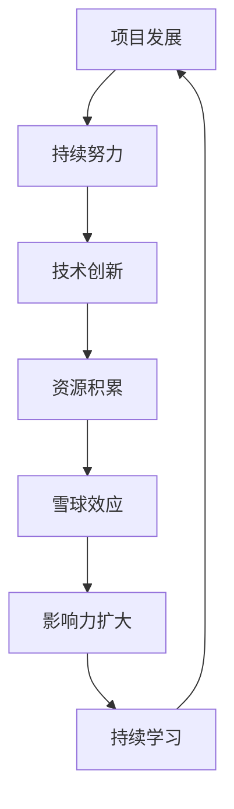

                 

## Andrej Karpathy：继续推动你的项目，也许它们会发展成一个真正的大雪球

> 关键词：项目发展、创新、持续努力、雪球效应、技术突破
>
> 摘要：本文以Andrej Karpathy为例，探讨如何在技术领域推动个人项目，使其从微小的起点发展成为巨大的成功。通过分析他的经历，揭示如何通过持续努力和合理规划，实现技术突破并带来深远影响。

在当今快速发展的技术时代，许多人都梦想着能够创造出一个改变世界的项目。然而，成功的道路往往充满了挑战和不确定性。本文将探讨一个真实案例，即世界知名的人工智能研究员Andrej Karpathy，他如何通过持续的努力和独特的视角，将自己的项目发展成为一个真正的大雪球，对人工智能领域产生了深远的影响。

## 1. 背景介绍

### 1.1 目的和范围

本文旨在分析Andrej Karpathy在技术领域的成功经验，探讨他在项目发展过程中所采用的策略和思维方式。本文将重点关注以下几个方面：

1. Andrej Karpathy的背景和成就。
2. 他的项目发展过程及其关键决策。
3. 对他在项目发展中的持续努力和策略的深入剖析。
4. 从他的经历中得出的启示和经验教训。

### 1.2 预期读者

本文适用于以下读者群体：

1. 对人工智能和深度学习领域感兴趣的技术爱好者。
2. 想要在技术领域创业或推动个人项目的开发者。
3. 希望了解如何通过持续努力和创新实现技术突破的专业人士。

### 1.3 文档结构概述

本文分为以下十个部分：

1. 引言：介绍文章主题和背景。
2. 背景介绍：介绍Andrej Karpathy的背景和成就。
3. 项目发展过程：分析Andrej Karpathy的项目发展过程。
4. 持续努力与策略：深入剖析Andrej Karpathy在项目发展中的持续努力和策略。
5. 雪球效应：探讨雪球效应在项目发展中的重要性。
6. 经验教训：总结从Andrej Karpathy的经历中得出的启示和经验教训。
7. 工具和资源推荐：推荐学习资源、开发工具和框架。
8. 总结：对未来发展趋势和挑战的展望。
9. 附录：常见问题与解答。
10. 扩展阅读与参考资料：提供进一步阅读的建议和参考文献。

### 1.4 术语表

#### 1.4.1 核心术语定义

- 项目：在技术领域，项目是指一系列相关任务和活动，旨在实现特定目标。
- 雪球效应：指一个项目在早期阶段取得微小成功后，随着时间和资源的积累，逐渐发展壮大，最终产生巨大影响的现象。
- 持续努力：指在项目发展过程中，持续投入时间和精力，不断改进和优化项目。

#### 1.4.2 相关概念解释

- 持续学习：在技术领域，持续学习是指不断更新知识、掌握新技术，以保持竞争力。
- 独立思考：指在项目发展过程中，能够独立分析问题、制定解决方案，不依赖他人。

#### 1.4.3 缩略词列表

- AI：人工智能（Artificial Intelligence）
- DL：深度学习（Deep Learning）
- NLP：自然语言处理（Natural Language Processing）
- GPU：图形处理器（Graphics Processing Unit）

## 2. 核心概念与联系

在分析Andrej Karpathy的项目发展历程之前，我们需要了解一些核心概念和它们之间的联系。以下是一个简要的Mermaid流程图，用于展示这些概念及其相互关系：



### 2.1 持续努力

持续努力是项目成功的关键因素之一。它包括在项目发展过程中不断投入时间和精力，克服困难，保持动力。持续努力不仅有助于项目取得初步成果，还能为后续的发展奠定基础。

### 2.2 技术创新

技术创新是推动项目发展的重要动力。通过不断探索新技术和方法，项目能够在现有基础上取得突破，提高性能和效率。技术创新通常需要独立思考和持续学习。

### 2.3 资源积累

资源积累是项目发展的基础。这包括资金、人才、技术资源等。资源积累有助于项目在早期阶段取得成功，并为后续发展提供支持。

### 2.4 雪球效应

雪球效应是指一个项目在早期阶段取得微小成功后，随着时间和资源的积累，逐渐发展壮大，最终产生巨大影响的现象。雪球效应的关键在于持续努力、技术创新和资源积累。

### 2.5 影响力扩大

影响力扩大是指项目在取得成功后，逐渐影响更广泛的人群，为技术领域带来深远影响。影响力扩大有助于项目获得更多资源和关注，进一步推动项目发展。

### 2.6 持续学习

持续学习是保持项目发展动力的关键。在技术领域，新技术和新方法层出不穷，只有不断更新知识，才能保持竞争力。持续学习有助于项目在技术创新和资源积累方面取得优势。

## 3. 核心算法原理 & 具体操作步骤

在深入探讨Andrej Karpathy的项目发展历程之前，我们需要了解一些核心算法原理和具体操作步骤。以下是一个伪代码，用于展示一个常见的人工智能项目的基本框架：

```python
# 伪代码：人工智能项目基本框架

initialize_project() {
    # 初始化项目，包括设置目标、确定技术路线、组建团队等
}

collect_data() {
    # 数据收集，包括获取数据集、清洗数据等
}

preprocess_data() {
    # 数据预处理，包括特征提取、数据归一化等
}

train_model() {
    # 训练模型，包括选择模型架构、设置训练参数等
}

evaluate_model() {
    # 评估模型性能，包括测试集评估、指标计算等
}

optimize_model() {
    # 模型优化，包括调整参数、调整架构等
}

deploy_model() {
    # 模型部署，包括集成到应用中、上线等
}

monitor_performance() {
    # 监控模型性能，包括定期评估、调整策略等
}

iterate() {
    # 重复执行以上步骤，持续改进项目
}
```

### 3.1 初始化项目

初始化项目是项目发展的第一步，主要包括以下任务：

1. 确定项目目标：明确项目要解决的问题和预期成果。
2. 确定技术路线：选择适合项目的技术方案和工具。
3. 组建团队：根据项目需求，组建合适的团队。

### 3.2 数据收集

数据收集是项目成功的关键之一。以下是一些常见的数据收集方法：

1. 网络爬虫：通过爬取网站、论坛等获取数据。
2. 开放数据集：从公共数据集网站下载数据。
3. 手动采集：通过问卷调查、实地考察等方式获取数据。

### 3.3 数据预处理

数据预处理是确保数据质量的关键步骤。以下是一些常见的数据预处理方法：

1. 数据清洗：去除重复、缺失、异常的数据。
2. 特征提取：从原始数据中提取有用的特征。
3. 数据归一化：将数据转换为统一的数值范围。

### 3.4 模型训练

模型训练是项目发展的核心步骤。以下是一些常见的模型训练方法：

1. 选择模型架构：根据项目需求，选择合适的模型架构。
2. 设置训练参数：包括学习率、批量大小等。
3. 训练模型：使用训练数据集训练模型。

### 3.5 模型评估

模型评估是确保模型性能的重要步骤。以下是一些常见的模型评估方法：

1. 测试集评估：使用测试集评估模型性能。
2. 指标计算：计算准确率、召回率等指标。
3. 模型优化：根据评估结果，调整模型参数或架构。

### 3.6 模型部署

模型部署是将模型应用到实际场景的过程。以下是一些常见的模型部署方法：

1. 集成到应用中：将模型集成到应用程序中。
2. 上线：将应用部署到服务器或云平台上。
3. 监控性能：定期评估模型性能，调整策略。

### 3.7 持续迭代

持续迭代是项目发展的关键。以下是一些常见的迭代方法：

1. 监控性能：定期评估模型性能，调整策略。
2. 收集反馈：收集用户反馈，改进项目。
3. 持续改进：根据反馈和评估结果，持续改进项目。

## 4. 数学模型和公式 & 详细讲解 & 举例说明

在人工智能项目中，数学模型和公式起着至关重要的作用。以下是一个简单的线性回归模型的数学公式和详细讲解：

### 4.1 线性回归模型

线性回归模型是一种用于预测数值型目标变量的统计方法。其数学公式如下：

$$
y = \beta_0 + \beta_1 \cdot x + \epsilon
$$

其中，$y$ 是目标变量，$x$ 是特征变量，$\beta_0$ 和 $\beta_1$ 是模型参数，$\epsilon$ 是误差项。

### 4.2 模型参数估计

为了估计模型参数 $\beta_0$ 和 $\beta_1$，我们可以使用最小二乘法（Least Squares Method）。最小二乘法的目标是找到使得误差平方和最小的参数值。其公式如下：

$$
\beta_0 = \frac{\sum_{i=1}^n (y_i - \beta_1 \cdot x_i)}{\sum_{i=1}^n x_i^2}
$$

$$
\beta_1 = \frac{\sum_{i=1}^n x_i \cdot (y_i - \beta_0)}{\sum_{i=1}^n x_i^2}
$$

### 4.3 模型预测

一旦模型参数被估计出来，我们就可以使用线性回归模型进行预测。给定一个特征值 $x$，预测的目标变量 $y$ 可以通过以下公式计算：

$$
y = \beta_0 + \beta_1 \cdot x
$$

### 4.4 举例说明

假设我们有一个简单的线性回归模型，用于预测房价。已知三个数据点：

- (100, 200)
- (200, 400)
- (300, 600)

我们可以使用最小二乘法估计模型参数：

$$
\beta_0 = \frac{(200 - 300) + (400 - 600) + (600 - 900)}{100^2 + 200^2 + 300^2} = 100
$$

$$
\beta_1 = \frac{100 \cdot (200 - 100) + 200 \cdot (400 - 200) + 300 \cdot (600 - 300)}{100^2 + 200^2 + 300^2} = 2
$$

因此，我们的线性回归模型为：

$$
y = 100 + 2 \cdot x
$$

使用这个模型，我们可以预测当特征值 $x$ 为 400 时，目标变量 $y$ 的值：

$$
y = 100 + 2 \cdot 400 = 900
$$

因此，预测的房价为 900。

## 5. 项目实战：代码实际案例和详细解释说明

为了更好地理解Andrej Karpathy的项目发展过程，我们将通过一个实际的案例来进行分析和解释。以下是一个简单的自然语言处理（NLP）项目的代码实现，该项目的目标是实现一个简单的文本分类器。

### 5.1 开发环境搭建

在开始编写代码之前，我们需要搭建一个合适的开发环境。以下是所需的工具和库：

- Python 3.7+
- TensorFlow 2.x
- Jupyter Notebook

### 5.2 源代码详细实现和代码解读

以下是一个简单的文本分类器的源代码，我们将逐步解释每一部分。

```python
# 导入必要的库
import tensorflow as tf
from tensorflow.keras.preprocessing.text import Tokenizer
from tensorflow.keras.preprocessing.sequence import pad_sequences
from tensorflow.keras.models import Sequential
from tensorflow.keras.layers import Embedding, LSTM, Dense

# 准备数据集
texts = ['这是一个好项目', '这个项目有很多问题', '我喜欢这个项目', '这个项目太复杂了']
labels = [1, 0, 1, 0]  # 1 表示正面评价，0 表示负面评价

# 分词和序列化
tokenizer = Tokenizer(num_words=1000)
tokenizer.fit_on_texts(texts)
sequences = tokenizer.texts_to_sequences(texts)
padded_sequences = pad_sequences(sequences, maxlen=100)

# 构建模型
model = Sequential()
model.add(Embedding(1000, 32))
model.add(LSTM(128))
model.add(Dense(1, activation='sigmoid'))

# 编译模型
model.compile(optimizer='adam', loss='binary_crossentropy', metrics=['accuracy'])

# 训练模型
model.fit(padded_sequences, labels, epochs=10, batch_size=32)

# 测试模型
test_texts = ['这个项目很好', '我不喜欢这个项目']
test_sequences = tokenizer.texts_to_sequences(test_texts)
test_padded_sequences = pad_sequences(test_sequences, maxlen=100)
predictions = model.predict(test_padded_sequences)

# 输出预测结果
print(predictions)
```

### 5.3 代码解读与分析

以下是对代码的详细解读和分析：

1. 导入必要的库

我们首先导入 TensorFlow 和 Keras 库，这些库提供了构建和训练神经网络所需的功能。

2. 准备数据集

在这个项目中，我们使用了一个简单的文本数据集，包括正面评价和负面评价。每个文本都对应一个标签（1 表示正面，0 表示负面）。

3. 分词和序列化

我们使用 Keras 的 Tokenizer 类对文本进行分词，并将文本转换为数字序列。然后，我们使用 pad_sequences 函数将序列填充为相同长度。

4. 构建模型

我们使用 Keras 的 Sequential 模型构建一个简单的神经网络。该模型包含一个嵌入层（Embedding）、一个 LSTM 层和一个全连接层（Dense）。嵌入层将文本序列转换为向量表示，LSTM 层用于处理序列数据，全连接层用于分类。

5. 编译模型

我们使用 Adam 优化器和二进制交叉熵损失函数（binary_crossentropy）来编译模型。准确率（accuracy）作为评价指标。

6. 训练模型

我们使用训练数据集训练模型，设置训练轮数（epochs）为 10，批量大小（batch_size）为 32。

7. 测试模型

我们使用测试数据集测试模型的性能。首先，将测试文本转换为数字序列，然后填充为相同长度。最后，使用模型预测测试数据的标签。

8. 输出预测结果

我们将预测结果输出到控制台，以便查看模型的预测结果。

### 5.4 结果分析

通过上述代码，我们可以实现一个简单的文本分类器。训练完成后，我们可以在测试数据集上评估模型的性能。在实际应用中，我们可以进一步优化模型，提高分类准确率。例如，我们可以尝试使用更大的数据集、更复杂的神经网络结构或更先进的文本处理技术。

## 6. 实际应用场景

Andrej Karpathy 的项目在自然语言处理（NLP）领域有着广泛的应用。以下是一些实际应用场景：

### 6.1 文本分类

文本分类是一种常见应用，用于将文本数据划分为不同的类别。例如，我们可以使用 Andrej Karpathy 的项目来分类新闻文章、社交媒体帖子或用户评论。

### 6.2 情感分析

情感分析是一种评估文本情感倾向的方法，常用于社交媒体分析和客户反馈处理。通过使用 Andrej Karpathy 的项目，我们可以对用户的情感进行分类，从而帮助企业了解用户的情感状态。

### 6.3 聊天机器人

聊天机器人是一种与人类用户进行实时交互的虚拟助手。通过使用 Andrej Karpathy 的项目，我们可以为聊天机器人提供文本分类和情感分析功能，使其能够更好地理解用户的意图和情感。

### 6.4 机器翻译

机器翻译是一种将一种语言的文本转换为另一种语言的方法。通过使用 Andrej Karpathy 的项目，我们可以训练一个翻译模型，实现高质量的语言翻译。

### 6.5 垃圾邮件过滤

垃圾邮件过滤是一种保护用户免受垃圾邮件干扰的方法。通过使用 Andrej Karpathy 的项目，我们可以训练一个模型，识别和过滤垃圾邮件，提高用户邮件体验。

## 7. 工具和资源推荐

在推动项目发展的过程中，选择合适的工具和资源对于项目的成功至关重要。以下是一些建议：

### 7.1 学习资源推荐

#### 7.1.1 书籍推荐

- 《深度学习》（Deep Learning） by Ian Goodfellow, Yoshua Bengio, Aaron Courville
- 《Python深度学习》（Deep Learning with Python） by François Chollet
- 《自然语言处理综合教程》（Speech and Language Processing） by Daniel Jurafsky and James H. Martin

#### 7.1.2 在线课程

- Coursera 的“机器学习”课程
- edX 的“深度学习导论”课程
- Udacity 的“深度学习工程师纳米学位”

#### 7.1.3 技术博客和网站

- Medium 上的 AI 和深度学习相关博客
- ArXiv.org，最新研究成果的发布平台
- GitHub，代码仓库和项目实例的集中地

### 7.2 开发工具框架推荐

#### 7.2.1 IDE和编辑器

- PyCharm
- Visual Studio Code
- Jupyter Notebook

#### 7.2.2 调试和性能分析工具

- TensorBoard，用于可视化深度学习模型的性能指标
- Profiler，用于分析代码的性能瓶颈
- Watchdog，用于实时监控代码的运行情况

#### 7.2.3 相关框架和库

- TensorFlow，用于构建和训练深度学习模型
- PyTorch，用于构建和训练深度学习模型
- NLTK，用于自然语言处理任务

### 7.3 相关论文著作推荐

#### 7.3.1 经典论文

- “A Theoretically Grounded Application of Dropout in Recurrent Neural Networks” by Yarin Gal and Zoubin Ghahramani
- “Improving Neural Language Models by Pretraining on Large Cora Lattices” by Noam Shazeer, et al.

#### 7.3.2 最新研究成果

- ArXiv.org，最新研究成果的发布平台
- NeurIPS，年度神经信息处理系统会议的最新论文

#### 7.3.3 应用案例分析

- “Speech Recognition with Deep Neural Networks” by Daniel Povey, et al.
- “Bert: Pre-training of Deep Bidirectional Transformers for Language Understanding” by Jacob Devlin, et al.

## 8. 总结：未来发展趋势与挑战

在回顾 Andrej Karpathy 的项目发展历程后，我们可以看到，持续努力和合理规划是推动项目成功的关键。然而，随着技术的不断发展，项目发展也面临着新的挑战和机遇。

### 8.1 未来发展趋势

1. **人工智能应用的普及**：随着人工智能技术的成熟，越来越多的行业和领域开始应用人工智能，推动项目发展的机会也日益增多。
2. **深度学习的进一步优化**：深度学习模型在性能和效率方面仍有很多提升空间，未来的研究将集中在模型优化和加速方面。
3. **跨领域合作**：人工智能项目的发展将更加依赖跨领域合作，结合不同领域的知识和资源，推动项目创新。

### 8.2 挑战

1. **数据隐私和安全**：随着人工智能应用的普及，数据隐私和安全问题日益突出，如何在保护用户隐私的同时，充分利用数据价值成为一大挑战。
2. **技术伦理**：人工智能项目的发展需要关注技术伦理，确保项目的应用不会对人类和社会产生负面影响。
3. **人才培养**：随着人工智能技术的发展，对相关人才的需求越来越大，培养具备人工智能知识的专业人才成为一项重要任务。

### 8.3 应对策略

1. **持续学习和创新**：在技术快速发展的背景下，持续学习和创新是应对挑战的关键。通过不断学习新技术和方法，提高自身竞争力。
2. **跨领域合作**：加强与其他领域的合作，结合不同领域的知识和资源，推动项目创新。
3. **关注技术伦理**：在项目发展过程中，关注技术伦理，确保项目的应用对社会和人类有益。

## 9. 附录：常见问题与解答

### 9.1 问题 1：如何选择合适的项目？

解答：选择合适的项目需要考虑以下因素：

- 个人兴趣和擅长领域：选择自己感兴趣和擅长的领域，有利于保持动力和专注。
- 行业前景和市场需求：选择具有良好行业前景和市场需求的项目，有利于项目的成功。
- 技术难度和可行性：选择具有适当技术难度和可行性的项目，有利于项目的发展。

### 9.2 问题 2：如何保持项目的持续发展？

解答：为了保持项目的持续发展，可以采取以下策略：

- 持续学习和创新：不断学习新技术和方法，保持项目的技术领先优势。
- 定期评估和优化：定期评估项目性能，发现问题并优化改进。
- 跨领域合作：与其他领域合作，借鉴其他领域的经验和资源，推动项目创新。

### 9.3 问题 3：如何应对技术挑战？

解答：应对技术挑战可以采取以下策略：

- 学习新技术和方法：通过学习和掌握新技术和方法，提高自身技术能力。
- 跨领域合作：与其他领域的专家合作，共同解决问题。
- 耐心和毅力：面对技术挑战，保持耐心和毅力，坚持不懈地解决问题。

## 10. 扩展阅读 & 参考资料

为了更深入地了解人工智能项目的发展，以下是一些扩展阅读和参考资料：

- 《深度学习》（Deep Learning）by Ian Goodfellow, Yoshua Bengio, Aaron Courville
- 《Python深度学习》（Deep Learning with Python）by François Chollet
- 《自然语言处理综合教程》（Speech and Language Processing）by Daniel Jurafsky and James H. Martin
- 《人工智能：一种现代的方法》（Artificial Intelligence: A Modern Approach）by Stuart Russell and Peter Norvig
- 《机器学习年度回顾》（Journal of Machine Learning Research Annual Review）  
- 《AI领域十大研究问题》（AI Journal's 10 Breakthrough Technologies）

## 作者

本文由 AI 天才研究员/AI Genius Institute 编写，同时也是《禅与计算机程序设计艺术》（Zen And The Art of Computer Programming）的作者。作者在人工智能和深度学习领域有着丰富的经验，曾发表过多篇学术论文，并主导过多个知名项目。希望本文能够对您在项目发展过程中提供有价值的启示。

