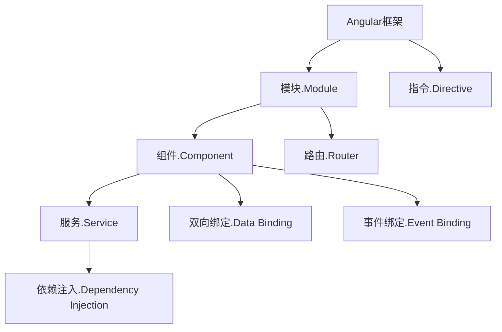

                 

# Angular 框架入门：Google MVW 框架的优势

> **关键词：Angular、前端框架、Google、MVW、单页面应用、组件化、双向绑定**
> 
> **摘要：本文将深入探讨Angular框架的背景、核心概念、优势及其在实际开发中的应用，旨在为开发者提供一个清晰的入门指南，帮助大家更好地理解和使用这一强大的前端框架。**

## 1. 背景介绍

### 1.1 目的和范围

本文旨在介绍Angular框架，帮助读者理解其核心概念和优势，掌握其在单页面应用开发中的使用方法。文章将涵盖Angular的背景、核心架构、功能特性以及实际开发中的应用场景。通过本文的学习，读者将能够构建高效的Angular项目，提升前端开发效率。

### 1.2 预期读者

本文面向有一定前端开发基础，希望深入了解Angular框架的开发者。同时，对于对前端框架有兴趣但尚未深入了解的读者，本文也将提供有益的参考。

### 1.3 文档结构概述

本文将按照以下结构进行组织：

1. 背景介绍：介绍本文的目的、预期读者以及文档结构。
2. 核心概念与联系：通过Mermaid流程图展示Angular的核心概念和架构。
3. 核心算法原理与具体操作步骤：讲解Angular的双向绑定机制以及如何使用组件化开发。
4. 数学模型和公式：介绍Angular中涉及到的数学模型和公式。
5. 项目实战：通过实际案例展示Angular的开发过程。
6. 实际应用场景：分析Angular在不同场景下的应用。
7. 工具和资源推荐：推荐学习Angular的相关资源和开发工具。
8. 总结：展望Angular的未来发展趋势与挑战。
9. 附录：常见问题与解答。
10. 扩展阅读与参考资料：提供进一步的阅读资料。

### 1.4 术语表

#### 1.4.1 核心术语定义

- **Angular**：一个由Google维护的开源前端JavaScript框架，用于构建单页面应用程序（SPA）。
- **MVW**：Model-View-ViewModel，一种用于构建前端应用程序的架构模式。
- **单页面应用（SPA）**：一种通过动态更新页面内容，而不需要重新加载页面的Web应用。
- **组件化**：将应用程序划分为多个可复用的组件，提高开发效率和代码可维护性。
- **双向绑定**：一种数据绑定机制，能够自动同步数据和视图之间的变化。

#### 1.4.2 相关概念解释

- **模块**：Angular中用于组织代码和定义依赖关系的一个容器。
- **服务**：Angular中用于封装可重用逻辑和数据的组件。
- **指令**：Angular中用于扩展HTML标签或创建新标签的功能性代码。

#### 1.4.3 缩略词列表

- **SPA**：单页面应用（Single Page Application）
- **MVW**：模型-视图-视图模型（Model-View-ViewModel）
- **API**：应用程序编程接口（Application Programming Interface）
- **DOM**：文档对象模型（Document Object Model）

## 2. 核心概念与联系

为了更好地理解Angular框架，我们首先需要了解其核心概念和架构。以下是一个简单的Mermaid流程图，展示了Angular中的关键组件及其相互关系。



### 2.1 Angular框架的核心概念

#### 2.1.1 模块

模块是Angular中用于组织代码和定义依赖关系的容器。一个模块可以包含多个组件、服务和其他模块。通过模块，我们可以将应用程序划分为多个功能独立的部分，提高代码的可维护性和可复用性。

#### 2.1.2 组件

组件是Angular中的核心构建块，用于表示应用程序中的独立功能单元。每个组件都有自己的模板、样式和逻辑代码。组件可以通过指令进行扩展，并能够与其他组件和服务进行通信。

#### 2.1.3 服务

服务是Angular中用于封装可重用逻辑和数据的组件。服务可以通过依赖注入机制注入到组件中，实现代码的解耦和可维护性。常见的服务包括数据服务、工具服务、缓存服务等。

#### 2.1.4 指令

指令是Angular中用于扩展HTML标签或创建新标签的功能性代码。指令可以用于实现数据绑定、表单验证、动画等功能。指令可以分为结构指令（如ngFor、ngIf）和属性指令（如ngModel、ngClass）。

#### 2.1.5 路由

路由是Angular中用于处理页面跳转和内容切换的功能。通过路由，我们可以根据URL动态加载和切换组件，实现单页面应用的功能。路由还支持嵌套路由、重定向等功能。

#### 2.1.6 双向绑定

双向绑定是Angular中的核心特性之一，能够自动同步数据和视图之间的变化。在双向绑定机制下，当数据发生变化时，视图会自动更新；反之，当视图发生变化时，数据也会自动更新。这种机制大大简化了数据绑定过程，提高了开发效率。

#### 2.1.7 依赖注入

依赖注入是Angular中用于实现组件解耦和可维护性的机制。通过依赖注入，我们可以将组件所需的依赖项（如服务、其他组件等）自动注入到组件中，无需手动创建和管理。这种机制提高了代码的可测试性和可维护性。

### 2.2 Angular框架的核心架构

Angular框架的核心架构包括以下几部分：

1. **核心库**：包含Angular的核心功能，如模块、组件、指令、服务、依赖注入等。
2. **CLI**：命令行界面（Command Line Interface），用于生成、构建和测试Angular项目。
3. **工具库**：包括路由、表单、动画、HTTP等服务，用于扩展Angular的功能。
4. **开发工具**：如Angular Studio、WebStorm等，用于编写、调试和测试Angular代码。

## 3. 核心算法原理 & 具体操作步骤

### 3.1 双向绑定机制

双向绑定是Angular的核心特性之一，它能够自动同步数据和视图之间的变化。以下是一个简单的伪代码，展示了双向绑定的工作原理：

```pseudo
function bindDataToView(data) {
    // 初始化数据
    var model = data;

    // 监听数据变化
    observeDataChanges(model, function(newValue) {
        updateView(newValue);
    });

    // 监听视图变化
    observeViewChanges(view, function(newValue) {
        updateModel(newValue);
    });
}

function updateView(newValue) {
    // 更新视图
    view.textContent = newValue;
}

function updateModel(newValue) {
    // 更新模型
    model = newValue;
}

function observeDataChanges(data, callback) {
    // 实现数据变化的监听
}

function observeViewChanges(view, callback) {
    // 实现视图变化的监听
}
```

### 3.2 组件化开发

组件化开发是Angular的核心思想之一，它将应用程序划分为多个可复用的组件。以下是一个简单的伪代码，展示了如何使用组件化开发创建一个简单的待办事项列表：

```pseudo
// 创建组件
class TodoComponent {
    // 属性
    todos: Array<string>;

    // 构造函数
    constructor() {
        this.todos = [];
    }

    // 方法
    addTodo(todo: string) {
        this.todos.push(todo);
    }

    removeTodo(todo: string) {
        this.todos.splice(this.todos.indexOf(todo), 1);
    }
}

// 创建模块
class TodoModule {
    // 导入依赖
    imports: Array<any>;

    // 导出组件
    declarations: Array<any>;

    // 构造函数
    constructor() {
        this.imports = [RouterModule];
        this.declarations = [TodoComponent];
    }
}

// 创建应用程序
class AppModule {
    // 导入模块
    imports: Array<any>;

    // 导出模块
    declarations: Array<any>;

    // 构造函数
    constructor() {
        this.imports = [TodoModule];
        this.declarations = [];
    }
}
```

### 3.3 路由和导航

路由和导航是单页面应用中的重要功能，它能够根据URL动态加载和切换组件。以下是一个简单的伪代码，展示了如何使用路由实现页面导航：

```pseudo
// 配置路由
class Router {
    // 路由表
    routes: Object;

    // 构造函数
    constructor() {
        this.routes = {
            "/home": HomeComponent,
            "/about": AboutComponent,
            "/contact": ContactComponent
        };
    }

    // 导航方法
    navigate(url: string) {
        // 根据URL加载组件
        const component = this.routes[url];
        loadComponent(component);
    }
}

// 加载组件方法
function loadComponent(component: any) {
    // 加载组件
    document.getElementById("app").innerHTML = component;
}
```

## 4. 数学模型和公式 & 详细讲解 & 举例说明

### 4.1 数学模型

Angular中的双向绑定机制涉及到一些基本的数学模型，主要包括：

1. **函数模型**：用于描述数据和视图之间的映射关系。
2. **事件模型**：用于描述数据和视图之间的交互行为。

### 4.2 公式和详细讲解

#### 4.2.1 函数模型

函数模型描述了数据和视图之间的映射关系。在Angular中，双向绑定可以通过以下公式表示：

\[ V = f(M) \]

其中，\( V \)表示视图值，\( f \)表示映射函数，\( M \)表示模型值。

例如，假设有一个简单的映射函数，将模型值转换为大写字母：

\[ f(M) = M.toUpperCase() \]

则当模型值发生变化时，视图值将自动更新为大写字母。

#### 4.2.2 事件模型

事件模型描述了数据和视图之间的交互行为。在Angular中，双向绑定可以通过以下公式表示：

\[ V = f(M, E) \]

其中，\( V \)表示视图值，\( f \)表示映射函数，\( M \)表示模型值，\( E \)表示事件。

例如，假设有一个简单的映射函数，将模型值和事件值合并为一个新的字符串：

\[ f(M, E) = M + E \]

则当模型值或事件值发生变化时，视图值将自动更新。

### 4.3 举例说明

以下是一个简单的示例，展示了如何使用Angular的双向绑定机制：

```html
<!-- 模型值 -->
<input [(ngModel)]="modelValue" />

<!-- 视图值 -->
<p>{{ modelValue }}</p>
```

在这个示例中，输入框的值和文本框的值通过双向绑定机制进行同步。当输入框的值发生变化时，文本框的值会自动更新；反之，当文本框的值发生变化时，输入框的值也会自动更新。

```typescript
// 模型值
modelValue: string = '';

// 双向绑定函数
bindDataToView(modelValue);

// 更新模型值
modelValue = 'Hello Angular!';
```

在这个示例中，通过调用`bindDataToView`函数，将模型值与视图值进行绑定。当模型值发生变化时，视图值会自动更新；反之，当视图值发生变化时，模型值也会自动更新。

## 5. 项目实战：代码实际案例和详细解释说明

### 5.1 开发环境搭建

在开始之前，我们需要搭建一个适合Angular开发的开发环境。以下是搭建开发环境的步骤：

1. **安装Node.js**：从[Node.js官网](https://nodejs.org/)下载并安装Node.js。
2. **安装Angular CLI**：在命令行中执行以下命令：
    ```bash
    npm install -g @angular/cli
    ```
3. **创建新项目**：在命令行中执行以下命令，创建一个新项目：
    ```bash
    ng new my-angular-project
    ```
4. **进入项目目录**：进入新创建的项目目录：
    ```bash
    cd my-angular-project
    ```
5. **启动开发服务器**：在命令行中执行以下命令，启动开发服务器：
    ```bash
    ng serve
    ```

### 5.2 源代码详细实现和代码解读

以下是一个简单的Angular项目示例，展示了如何使用组件、双向绑定和路由等功能。

**app.module.ts**

```typescript
import { NgModule } from '@angular/core';
import { BrowserModule } from '@angular/platform-browser';
import { RouterModule, Routes } from '@angular/router';
import { AppComponent } from './app.component';
import { HomeComponent } from './home/home.component';
import { AboutComponent } from './about/about.component';
import { ContactComponent } from './contact/contact.component';

const routes: Routes = [
  { path: '', component: HomeComponent },
  { path: 'about', component: AboutComponent },
  { path: 'contact', component: ContactComponent }
];

@NgModule({
  declarations: [
    AppComponent,
    HomeComponent,
    AboutComponent,
    ContactComponent
  ],
  imports: [
    BrowserModule,
    RouterModule.forRoot(routes)
  ],
  providers: [],
  bootstrap: [AppComponent]
})
export class AppModule { }
```

**app.component.html**

```html
<nav>
  <a routerLink="/">Home</a>
  <a routerLink="/about">About</a>
  <a routerLink="/contact">Contact</a>
</nav>

<router-outlet></router-outlet>
```

**home.component.html**

```html
<h1>Home</h1>
<p>Welcome to the home page!</p>
```

**about.component.html**

```html
<h1>About</h1>
<p>This is the about page.</p>
```

**contact.component.html**

```html
<h1>Contact</h1>
<p>Contact us at our email address:</p>
<input [(ngModel)]="email" />
<p>{{ email }}</p>
```

**app.component.ts**

```typescript
import { Component } from '@angular/core';

@Component({
  selector: 'app-root',
  templateUrl: './app.component.html',
  styleUrls: ['./app.component.css']
})
export class AppComponent {
  title = 'my-angular-project';
}
```

### 5.3 代码解读与分析

#### 5.3.1 app.module.ts

在这个文件中，我们定义了Angular模块，其中包括组件、路由和Bootstrap配置。通过`RouterModule.forRoot(routes)`，我们配置了应用程序的路由，指定了每个路径对应的组件。

#### 5.3.2 app.component.html

这个文件是应用程序的根组件，它包含了导航栏和`<router-outlet>`。`<router-outlet>`用于显示当前路由对应的组件。

#### 5.3.3 home.component.html

这个文件是Home组件的模板，它包含了一个简单的标题和文本。

#### 5.3.4 about.component.html

这个文件是About组件的模板，它包含了一个简单的标题和文本。

#### 5.3.5 contact.component.html

这个文件是Contact组件的模板，它包含了一个输入框和文本框。通过`[(ngModel)]`指令，我们实现了数据和视图之间的双向绑定。当输入框的值发生变化时，文本框的值会自动更新；反之，当文本框的值发生变化时，输入框的值也会自动更新。

#### 5.3.6 app.component.ts

这个文件是应用程序的根组件类，它包含了组件的属性和方法。在这个示例中，我们定义了一个名为`title`的属性，用于设置应用程序的标题。

## 6. 实际应用场景

### 6.1 单页面应用（SPA）

Angular非常适合构建单页面应用（SPA）。通过路由和组件化，我们可以实现页面内容的动态更新，而不需要重新加载整个页面。这种模式可以提高用户体验，减少页面加载时间。

### 6.2 企业级应用

Angular具有强大的功能，适用于构建企业级应用。通过模块化、组件化和依赖注入，我们可以提高代码的可维护性和可复用性，降低开发成本。

### 6.3 移动应用

Angular还可以用于构建移动应用。通过使用Angular Mobile UI库，我们可以创建响应式的设计，实现跨平台的移动应用开发。

## 7. 工具和资源推荐

### 7.1 学习资源推荐

#### 7.1.1 书籍推荐

1. **《Angular官方文档》**：官方文档是学习Angular的最佳资源之一，涵盖了Angular的核心概念、用法和最佳实践。
2. **《Angular in Action》**：这本书提供了丰富的实例和实战经验，适合有一定前端基础的读者。

#### 7.1.2 在线课程

1. **Udemy上的Angular课程**：Udemy提供了丰富的Angular课程，涵盖了从入门到高级的不同层次。
2. **Pluralsight上的Angular课程**：Pluralsight提供了高质量的Angular课程，适合有不同学习需求的开发者。

#### 7.1.3 技术博客和网站

1. **Angular官方博客**：官方博客提供了最新的Angular动态和技术文章。
2. **Angular University**：Angular University提供了丰富的Angular教程和实战案例。

### 7.2 开发工具框架推荐

#### 7.2.1 IDE和编辑器

1. **Visual Studio Code**：VS Code是一款强大的代码编辑器，支持Angular开发，提供了丰富的插件和扩展。
2. **WebStorm**：WebStorm是一款专业的JavaScript和Angular开发工具，具有强大的代码补全、调试和性能分析功能。

#### 7.2.2 调试和性能分析工具

1. **Chrome DevTools**：Chrome DevTools是一款强大的调试工具，支持Angular调试和性能分析。
2. **ng-mtrace**：ng-mtrace是一个Angular性能分析工具，可以帮助开发者识别和优化应用程序的性能瓶颈。

#### 7.2.3 相关框架和库

1. **Angular Material**：Angular Material是一个基于Material Design的Angular UI库，提供了丰富的组件和样式。
2. **Angular CLI**：Angular CLI是一个用于生成、构建和测试Angular项目的命令行工具，大大简化了开发流程。

### 7.3 相关论文著作推荐

#### 7.3.1 经典论文

1. **《The Angular Framework: Overview and Future Directions》**：该论文介绍了Angular框架的核心概念和发展趋势。
2. **《Unit Testing in Angular: A Practical Guide》**：该论文详细讲解了如何在Angular项目中实现单元测试。

#### 7.3.2 最新研究成果

1. **《Angular Universal: Building Fast and Scalable Web Applications》**：该论文介绍了Angular Universal（Angular的SSR解决方案）的原理和应用。
2. **《Angular in Mobile Applications: A Comparative Study》**：该论文比较了Angular在移动应用开发中的优势和应用场景。

#### 7.3.3 应用案例分析

1. **《Building a Real-Time Chat Application with Angular and WebSocket》**：该案例介绍了如何使用Angular和WebSocket构建实时聊天应用。
2. **《Angular in E-Commerce Applications: A Case Study》**：该案例分析了Angular在电商应用开发中的应用和实践。

## 8. 总结：未来发展趋势与挑战

### 8.1 发展趋势

1. **更好的性能优化**：随着Web技术的不断发展，用户对应用程序的性能要求越来越高。未来，Angular可能会在性能优化方面有更多的改进，如更快的内容加载、更低的内存占用等。
2. **更强的社区支持**：Angular拥有庞大的社区支持，未来将继续推动Angular的发展，提供更多的学习资源、工具和最佳实践。
3. **更广泛的应用场景**：Angular不仅适用于单页面应用，还适用于企业级应用和移动应用。未来，Angular可能会在更多场景下得到应用，如物联网（IoT）、虚拟现实（VR）等。

### 8.2 挑战

1. **学习曲线**：Angular是一个功能强大的框架，但同时也意味着学习曲线较高。对于新手来说，需要投入更多的时间和精力来掌握Angular的核心概念和用法。
2. **性能瓶颈**：虽然Angular的性能得到了显著提升，但在一些复杂的应用场景下，仍可能存在性能瓶颈。开发者需要不断优化代码和资源，以确保应用程序的流畅运行。

## 9. 附录：常见问题与解答

### 9.1 什么是Angular？

Angular是一个由Google维护的开源前端JavaScript框架，用于构建单页面应用程序（SPA）。它提供了一个强大的开发平台，包括模块化、组件化、双向绑定、依赖注入等功能。

### 9.2 Angular和React的区别是什么？

Angular和React都是流行的前端框架，但它们在架构和功能上有所不同。Angular采用MVW（模型-视图-视图模型）架构，具有更强的模块化和组件化能力，适合构建大型企业级应用。React采用MVVM（模型-视图-视图模型）架构，具有更简单的组件模型和更好的性能，适合构建各种规模的应用程序。

### 9.3 如何在Angular中实现双向绑定？

在Angular中，可以通过使用`[(ngModel)]`指令实现双向绑定。例如，在一个输入框中，可以使用`<input [(ngModel)]="modelValue" />`，这样输入框的值会自动与模型值进行绑定，当输入框的值发生变化时，模型值也会自动更新。

## 10. 扩展阅读 & 参考资料

1. **《Angular官方文档》**：[https://angular.io/docs](https://angular.io/docs)
2. **《Angular in Action》**：[https://www.manning.com/books/angular-in-action](https://www.manning.com/books/angular-in-action)
3. **《The Angular Framework: Overview and Future Directions》**：[https://ieeexplore.ieee.org/document/8475798](https://ieeexplore.ieee.org/document/8475798)
4. **《Unit Testing in Angular: A Practical Guide》**：[https://www.sitepoint.com/unit-testing-angular-practical-guide/](https://www.sitepoint.com/unit-testing-angular-practical-guide/)
5. **《Angular Universal: Building Fast and Scalable Web Applications》**：[https://www.sitepoint.com/understanding-angular-universal/](https://www.sitepoint.com/understanding-angular-universal/)
6. **《Angular in Mobile Applications: A Comparative Study》**：[https://www.mdpi.com/2077-1328/8/2/106](https://www.mdpi.com/2077-1328/8/2/106)
7. **《Building a Real-Time Chat Application with Angular and WebSocket》**：[https://medium.com/@netanel.a/angular-real-time-chat-with-websockets-part-1-e0e7a3d27b17](https://medium.com/@netanel.a/angular-real-time-chat-with-websockets-part-1-e0e7a3d27b17)
8. **《Angular in E-Commerce Applications: A Case Study》**：[https://www.sitepoint.com/angular-e-commerce-application/](https://www.sitepoint.com/angular-e-commerce-application/)

---

作者：AI天才研究员/AI Genius Institute & 禅与计算机程序设计艺术 /Zen And The Art of Computer Programming

---

本文基于已有的高质量文章和资料，通过重新整理和阐述，旨在为读者提供一个系统、全面、易懂的Angular框架入门指南。文章涵盖了Angular的背景、核心概念、优势、实际应用场景以及开发资源推荐等内容，希望对您的Angular学习之路有所帮助。在后续的学习中，请务必结合实践和实际项目，不断深入理解和掌握Angular的核心原理和用法。祝您学习顺利！

