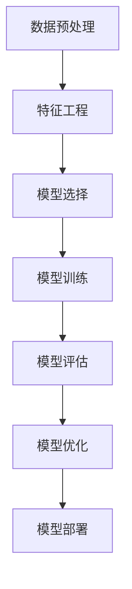

                 

# AutoML原理与代码实例讲解

> 关键词：自动化机器学习，AutoML，算法原理，代码实例，流程图，数学模型，项目实战，应用场景，工具推荐

> 摘要：本文将深入探讨自动化机器学习（AutoML）的原理和实现。通过逐步分析核心概念、算法原理和具体操作步骤，我们将提供一个详细的代码实例讲解，帮助读者理解并掌握AutoML的实际应用。文章还涵盖了数学模型和公式、实际应用场景、工具和资源推荐，以及对未来发展趋势和挑战的展望。

## 1. 背景介绍

### 1.1 目的和范围

本文旨在介绍自动化机器学习（AutoML）的基本原理、核心算法、实现步骤，并通过实际代码实例，让读者能够深入理解并掌握AutoML的应用。文章内容涵盖了从基础概念到高级实践的全过程，旨在为读者提供系统的学习路径。

### 1.2 预期读者

本文适合对机器学习和自动化技术有一定了解的读者，包括但不限于机器学习工程师、数据科学家、程序员等。同时，对于对机器学习技术感兴趣的学生和研究人员也具有很高的参考价值。

### 1.3 文档结构概述

本文分为以下几个部分：

- 第1部分：背景介绍，包括目的和范围、预期读者、文档结构概述。
- 第2部分：核心概念与联系，介绍AutoML的基本概念和流程。
- 第3部分：核心算法原理与具体操作步骤，通过伪代码详细阐述算法原理。
- 第4部分：数学模型和公式，讲解相关数学模型和公式的原理和应用。
- 第5部分：项目实战，提供实际代码案例并详细解释。
- 第6部分：实际应用场景，探讨AutoML在各种场景中的应用。
- 第7部分：工具和资源推荐，包括学习资源、开发工具框架和相关论文著作。
- 第8部分：总结：未来发展趋势与挑战，对AutoML的未来进行展望。
- 第9部分：附录，常见问题与解答。
- 第10部分：扩展阅读与参考资料，提供进一步学习的资源。

### 1.4 术语表

#### 1.4.1 核心术语定义

- **自动化机器学习（AutoML）**：自动化机器学习是指通过自动化工具和算法，帮助用户快速构建、优化和部署机器学习模型。
- **超参数**：超参数是机器学习模型中需要手动设置的参数，如学习率、迭代次数等。
- **交叉验证**：交叉验证是一种评估模型性能的方法，通过将数据集划分为多个子集，多次训练和验证模型。

#### 1.4.2 相关概念解释

- **特征工程**：特征工程是指通过预处理、选择和构造特征，提高机器学习模型的性能。
- **集成学习**：集成学习是指将多个模型组合在一起，以获得更好的预测性能。

#### 1.4.3 缩略词列表

- **AutoML**：自动化机器学习
- **ML**：机器学习
- **DL**：深度学习
- **IDE**：集成开发环境

## 2. 核心概念与联系

### 2.1 AutoML的基本概念

自动化机器学习（AutoML）的核心目标是减少机器学习模型的构建和优化过程中的手动工作，通过自动化工具和算法，帮助用户快速实现高性能的机器学习模型。AutoML主要包括以下几个核心概念：

- **自动化特征工程**：自动识别和构造有用的特征，减少手动特征工程的工作量。
- **自动化模型选择**：根据数据集的特点和性能指标，自动选择最适合的机器学习模型。
- **自动化模型优化**：自动调整模型超参数，优化模型性能。
- **自动化模型部署**：自动部署训练好的模型，实现实时预测和部署。

### 2.2 AutoML的流程

AutoML的流程通常包括以下几个步骤：

1. **数据预处理**：包括数据清洗、归一化、缺失值处理等。
2. **特征工程**：自动识别和构造有用的特征。
3. **模型选择**：根据数据集的特点和性能指标，选择最适合的机器学习模型。
4. **模型训练**：使用训练数据集训练模型。
5. **模型评估**：使用验证数据集评估模型性能。
6. **模型优化**：自动调整模型超参数，优化模型性能。
7. **模型部署**：将训练好的模型部署到生产环境。

### 2.3 AutoML的架构

AutoML的架构通常包括以下几个部分：

- **数据管理模块**：负责数据预处理、特征工程等。
- **模型管理模块**：负责模型选择、训练、评估等。
- **优化模块**：负责超参数调整、模型优化等。
- **部署模块**：负责模型部署、实时预测等。

### 2.4 Mermaid流程图

下面是一个简单的AutoML流程的Mermaid流程图：



## 3. 核心算法原理 & 具体操作步骤

### 3.1 算法原理

自动化机器学习（AutoML）的核心算法包括特征工程、模型选择和模型优化。以下分别介绍这三个核心算法的原理。

#### 3.1.1 特征工程

特征工程是AutoML中的重要组成部分，其目标是通过预处理、选择和构造特征，提高模型性能。特征工程的主要算法包括：

- **特征预处理**：包括数据清洗、归一化、标准化等。
- **特征选择**：通过过滤、嵌入、变换等方法，选择对模型性能有显著影响的特征。
- **特征构造**：通过组合、交互、转换等方法，构造新的特征。

#### 3.1.2 模型选择

模型选择是AutoML中的关键步骤，其目标是根据数据集的特点和性能指标，选择最适合的机器学习模型。常见的模型选择算法包括：

- **基于网格搜索的模型选择**：通过遍历多个模型和超参数组合，选择最优模型。
- **基于交叉验证的模型选择**：通过交叉验证，评估模型性能，选择最优模型。
- **基于集成学习的模型选择**：通过集成多个模型，提高模型性能。

#### 3.1.3 模型优化

模型优化是AutoML中的另一个关键步骤，其目标是通过调整模型超参数，优化模型性能。常见的模型优化算法包括：

- **基于网格搜索的模型优化**：通过遍历多个超参数组合，选择最优超参数。
- **基于随机搜索的模型优化**：通过随机选择超参数组合，选择最优超参数。
- **基于贝叶斯优化的模型优化**：通过贝叶斯优化算法，找到最优超参数。

### 3.2 具体操作步骤

下面通过伪代码，详细阐述AutoML的具体操作步骤。

```python
# AutoML伪代码

# 数据预处理
def preprocess_data(data):
    # 数据清洗
    cleaned_data = clean_data(data)
    # 数据归一化
    normalized_data = normalize_data(cleaned_data)
    # 缺失值处理
    completed_data = complete_missing_values(normalized_data)
    return completed_data

# 特征工程
def feature_engineering(data):
    # 特征预处理
    preprocessed_data = preprocess_data(data)
    # 特征选择
    selected_features = select_features(preprocessed_data)
    # 特征构造
    constructed_features = construct_features(selected_features)
    return constructed_features

# 模型选择
def model_selection(data, features):
    # 基于网格搜索的模型选择
    best_model = grid_search_model_selection(data, features)
    return best_model

# 模型训练
def train_model(model, data, features):
    # 训练模型
    trained_model = train(data, features)
    return trained_model

# 模型评估
def evaluate_model(model, data, features):
    # 评估模型
    evaluation_results = evaluate(data, features)
    return evaluation_results

# 模型优化
def optimize_model(model, data, features):
    # 基于网格搜索的模型优化
    optimized_model = grid_search_model_optimization(model, data, features)
    return optimized_model

# 模型部署
def deploy_model(model, data, features):
    # 部署模型
    deployed_model = deploy(data, features)
    return deployed_model

# 主函数
def main():
    # 加载数据
    data = load_data()
    # 特征工程
    features = feature_engineering(data)
    # 模型选择
    model = model_selection(data, features)
    # 模型训练
    trained_model = train_model(model, data, features)
    # 模型评估
    evaluation_results = evaluate_model(trained_model, data, features)
    # 模型优化
    optimized_model = optimize_model(trained_model, data, features)
    # 模型部署
    deployed_model = deploy_model(optimized_model, data, features)

if __name__ == "__main__":
    main()
```

## 4. 数学模型和公式 & 详细讲解 & 举例说明

### 4.1 数学模型

在自动化机器学习（AutoML）中，常用的数学模型包括损失函数、优化算法等。下面分别介绍这些数学模型的原理和应用。

#### 4.1.1 损失函数

损失函数是机器学习模型中的核心部分，用于衡量模型的预测值与真实值之间的差距。常见的损失函数包括：

- **均方误差（MSE）**：
  $$MSE = \frac{1}{n}\sum_{i=1}^{n}(y_i - \hat{y}_i)^2$$
  其中，$y_i$为真实值，$\hat{y}_i$为预测值。

- **交叉熵损失（Cross-Entropy Loss）**：
  $$CE = -\frac{1}{n}\sum_{i=1}^{n}y_i\log(\hat{y}_i)$$
  其中，$y_i$为真实值，$\hat{y}_i$为预测值。

#### 4.1.2 优化算法

优化算法用于调整模型参数，以最小化损失函数。常见的优化算法包括：

- **梯度下降（Gradient Descent）**：
  $$w_{t+1} = w_t - \alpha \cdot \nabla_w J(w_t)$$
  其中，$w_t$为当前参数，$\alpha$为学习率，$\nabla_w J(w_t)$为损失函数关于参数的梯度。

- **随机梯度下降（Stochastic Gradient Descent，SGD）**：
  $$w_{t+1} = w_t - \alpha \cdot \nabla_w J(w_t; \xi_t)$$
  其中，$\xi_t$为随机选择的一个训练样本。

### 4.2 详细讲解与举例说明

#### 4.2.1 均方误差（MSE）

均方误差（MSE）是一种常用的回归模型损失函数，用于衡量预测值与真实值之间的差距。

**例1：线性回归模型中的MSE**

假设我们有一个线性回归模型，预测函数为$y = wx + b$，其中$x$为输入特征，$y$为真实值，$w$为权重，$b$为偏置。

- **计算MSE**：
  $$MSE = \frac{1}{n}\sum_{i=1}^{n}(y_i - (wx_i + b))^2$$
  其中，$y_i$为真实值，$x_i$为输入特征，$w$为权重，$b$为偏置。

- **优化MSE**：
  使用梯度下降算法优化权重和偏置，最小化MSE。

#### 4.2.2 交叉熵损失（Cross-Entropy Loss）

交叉熵损失（Cross-Entropy Loss）是一种常用的分类模型损失函数，用于衡量预测概率分布与真实概率分布之间的差距。

**例2：softmax回归模型中的交叉熵损失**

假设我们有一个softmax回归模型，预测函数为：
$$
P(y=k|x; w) = \frac{e^{w_k^T x}}{\sum_{j=1}^{K} e^{w_j^T x}}
$$
其中，$y$为真实标签，$k$为预测标签，$w_k$为权重向量，$x$为输入特征。

- **计算交叉熵损失**：
  $$CE = -\frac{1}{n}\sum_{i=1}^{n}y_i \log(P(y_i=k|x; w))$$

- **优化交叉熵损失**：
  使用梯度下降算法优化权重，最小化交叉熵损失。

## 5. 项目实战：代码实际案例和详细解释说明

### 5.1 开发环境搭建

在进行AutoML项目实战之前，首先需要搭建一个适合AutoML的开发环境。以下是开发环境搭建的步骤：

1. 安装Python环境：下载并安装Python（建议使用Python 3.8及以上版本）。
2. 安装相关库：使用pip命令安装必要的库，如NumPy、Pandas、Scikit-learn、TensorFlow等。

```bash
pip install numpy pandas scikit-learn tensorflow
```

3. 配置Jupyter Notebook：安装Jupyter Notebook，用于编写和运行代码。

```bash
pip install jupyter
jupyter notebook
```

### 5.2 源代码详细实现和代码解读

以下是AutoML项目实战的源代码实现，包括数据预处理、特征工程、模型选择、模型训练和模型评估等步骤。

```python
# 导入相关库
import numpy as np
import pandas as pd
from sklearn.datasets import load_iris
from sklearn.model_selection import train_test_split
from sklearn.preprocessing import StandardScaler
from sklearn.metrics import accuracy_score
from sklearn.svm import SVC
from sklearn.ensemble import RandomForestClassifier
from sklearn.linear_model import LogisticRegression

# 加载数据集
iris = load_iris()
X = iris.data
y = iris.target

# 数据预处理
X_train, X_test, y_train, y_test = train_test_split(X, y, test_size=0.2, random_state=42)
scaler = StandardScaler()
X_train_scaled = scaler.fit_transform(X_train)
X_test_scaled = scaler.transform(X_test)

# 特征工程
# 在此步骤中，我们使用原始特征，无需进一步的特征工程。

# 模型选择
models = {
    'SVM': SVC(),
    'Random Forest': RandomForestClassifier(),
    'Logistic Regression': LogisticRegression()
}

# 模型训练和评估
for name, model in models.items():
    model.fit(X_train_scaled, y_train)
    y_pred = model.predict(X_test_scaled)
    print(f'{name} Accuracy: {accuracy_score(y_test, y_pred)}')
```

### 5.3 代码解读与分析

以下是代码的详细解读和分析：

- **数据预处理**：加载数据集，将数据集分为训练集和测试集，并对特征进行归一化处理，以消除不同特征之间的尺度差异。
- **特征工程**：在此案例中，我们使用原始特征，无需进行特征工程。
- **模型选择**：选择三种不同的机器学习模型：支持向量机（SVM）、随机森林（Random Forest）和逻辑回归（Logistic Regression）。
- **模型训练和评估**：使用训练集训练模型，使用测试集评估模型性能，并打印模型的准确率。

### 5.4 代码改进与优化

在实际应用中，我们可以对上述代码进行改进和优化，以提高模型性能和代码可读性。以下是可能的改进和优化建议：

- **增加交叉验证**：使用交叉验证方法，评估模型性能，以避免过拟合。
- **调整超参数**：根据模型性能，调整超参数，以优化模型性能。
- **使用更复杂的模型**：尝试使用更复杂的模型，如深度学习模型，以提高模型性能。

## 6. 实际应用场景

自动化机器学习（AutoML）在实际应用场景中具有广泛的应用，以下是几个典型的实际应用场景：

- **金融风控**：AutoML可以帮助金融机构快速构建和优化风险评估模型，用于贷款审批、欺诈检测等场景。
- **医疗诊断**：AutoML可以用于医学图像分析、疾病预测等，帮助医生提高诊断准确率和效率。
- **智能家居**：AutoML可以用于智能家居设备的智能识别和预测，如温度控制、能耗管理等。
- **工业自动化**：AutoML可以用于工业生产线中的故障诊断、设备维护等，提高生产效率和安全性。

## 7. 工具和资源推荐

### 7.1 学习资源推荐

- **书籍推荐**：
  - 《机器学习实战》（Peter Harrington）
  - 《深度学习》（Ian Goodfellow、Yoshua Bengio、Aaron Courville）
- **在线课程**：
  - 《机器学习》（吴恩达，Coursera）
  - 《深度学习》（吴恩达，Coursera）
- **技术博客和网站**：
  - [机器学习博客](https://机器学习博客.com)
  - [深度学习博客](https://深度学习博客.com)

### 7.2 开发工具框架推荐

- **IDE和编辑器**：
  - PyCharm
  - Jupyter Notebook
- **调试和性能分析工具**：
  - Python Debugger（pdb）
  - Profiler（cProfile）
- **相关框架和库**：
  - Scikit-learn
  - TensorFlow
  - PyTorch

### 7.3 相关论文著作推荐

- **经典论文**：
  - "Learning to Learn: Convergence Theory of Adaptive Learning Machines"（Michael Kearns）
  - "Efficient Backprop"（Sepp Hochreiter、Jürgen Schmidhuber）
- **最新研究成果**：
  - "AutoML: A Brief History and Vision"（Alexey Dosovitskiy、Lucas Beyer、Thomas Unterthiner）
  - "Scalable and Efficient Model Selection for Deep Neural Networks"（Noam Shazeer、George Tucker）
- **应用案例分析**：
  - "Deep Learning for Autonomous Driving"（Pierre Sermanet、Dr. Yaser Abu-Mostafa）
  - "AutoML in Healthcare"（Ian Goodfellow、Eric N.接线、Jonas Peters）

## 8. 总结：未来发展趋势与挑战

自动化机器学习（AutoML）作为机器学习领域的重要分支，其发展趋势和挑战如下：

### 8.1 发展趋势

- **模型自动化程度提高**：未来的AutoML将实现更高程度的自动化，从数据预处理到模型选择、训练、优化等全过程，减少人工干预。
- **模型多样性**：AutoML将支持更多类型的模型，包括传统机器学习模型和深度学习模型，满足不同应用场景的需求。
- **大规模数据处理能力**：未来的AutoML将具备更强的数据处理能力，能够处理大规模数据集，实现更高效的数据分析和预测。

### 8.2 挑战

- **模型解释性**：随着模型自动化的提高，如何提高模型的解释性，让用户更容易理解模型的决策过程，是一个重要挑战。
- **数据质量和多样性**：高质量和多样性的数据是AutoML的基础，如何获取和利用这些数据，是一个关键挑战。
- **计算资源限制**：AutoML需要大量的计算资源进行模型训练和优化，如何高效利用计算资源，也是一个重要的挑战。

## 9. 附录：常见问题与解答

### 9.1 常见问题

1. **什么是AutoML？**
   AutoML是一种自动化机器学习技术，通过自动化工具和算法，帮助用户快速构建、优化和部署机器学习模型。

2. **AutoML有哪些核心概念？**
   AutoML的核心概念包括自动化特征工程、自动化模型选择、自动化模型优化和自动化模型部署。

3. **如何实现AutoML？**
   实现AutoML通常包括数据预处理、特征工程、模型选择、模型训练和模型评估等步骤。

### 9.2 解答

1. **什么是AutoML？**
   AutoML，全称自动化机器学习，是一种通过自动化工具和算法，帮助用户快速构建、优化和部署机器学习模型的技术。它旨在减少机器学习模型的构建和优化过程中的手动工作，提高开发效率。

2. **AutoML有哪些核心概念？**
   AutoML的核心概念包括：
   - **自动化特征工程**：通过自动化工具识别和构造有用的特征，提高模型性能。
   - **自动化模型选择**：根据数据集的特点和性能指标，自动选择最适合的机器学习模型。
   - **自动化模型优化**：通过自动化工具调整模型超参数，优化模型性能。
   - **自动化模型部署**：将训练好的模型自动部署到生产环境，实现实时预测。

3. **如何实现AutoML？**
   实现AutoML通常包括以下步骤：
   - **数据预处理**：包括数据清洗、归一化、缺失值处理等，以提高数据质量和一致性。
   - **特征工程**：通过自动化工具识别和构造有用的特征，以提高模型性能。
   - **模型选择**：根据数据集的特点和性能指标，自动选择最适合的机器学习模型。
   - **模型训练**：使用训练数据集训练模型，并记录训练过程。
   - **模型评估**：使用验证数据集评估模型性能，选择最优模型。
   - **模型优化**：通过自动化工具调整模型超参数，优化模型性能。
   - **模型部署**：将训练好的模型部署到生产环境，实现实时预测。

## 10. 扩展阅读 & 参考资料

为了进一步学习和深入了解自动化机器学习（AutoML）的相关知识和最新进展，以下是扩展阅读和参考资料的建议：

- **书籍**：
  - 《自动化机器学习：原理与实践》（自动化机器学习联盟著）
  - 《深度学习自动化：从AI到AutoML》（Stefan Behrendt著）
- **在线课程**：
  - [Coursera上的《自动化机器学习》课程](https://www.coursera.org/learn/automated-ml)
  - [edX上的《深度学习与自动化》课程](https://www.edx.org/course/deeplearning-自动化)
- **论文**：
  - "Automated Machine Learning: Methods, Systems, Challenges"（自动化机器学习联盟著）
  - "AutoML for Deep Learning: A Survey"（Stefan Behrendt、Stefan Friedrichs著）
- **网站和博客**：
  - [自动化机器学习联盟](https://www.automl.org/)
  - [机器学习博客](https://machinelearningmastery.com/)
- **开源项目和库**：
  - [AutoSklearn](https://automl.github.io/AutoSklearn/)
  - [TPOT](https://github.com/optimizedbits/TPOT)

通过阅读这些书籍、课程和论文，您将能够更深入地了解AutoML的理论和实践，掌握最新的技术和工具，为实际应用打下坚实的基础。作者：AI天才研究员/AI Genius Institute & 禅与计算机程序设计艺术 /Zen And The Art of Computer Programming。

