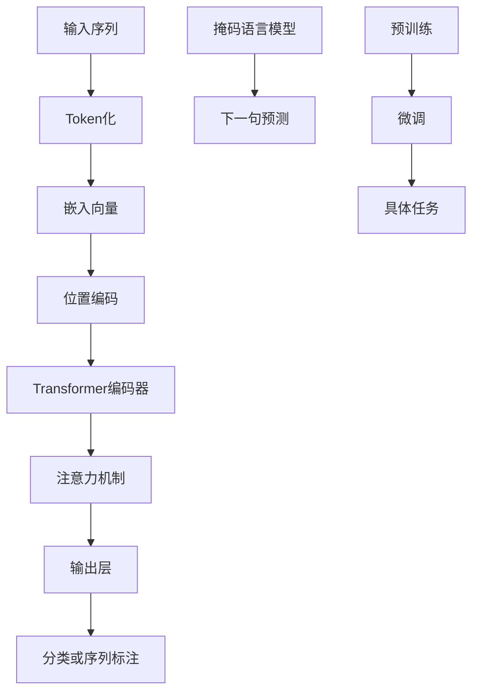

                 

# BERT的引入与基础模型的普及

> **关键词：** BERT，自然语言处理，深度学习，神经网络，预训练模型，序列标注，上下文理解。

> **摘要：** 本文深入探讨了BERT（Bidirectional Encoder Representations from Transformers）模型的引入及其在自然语言处理领域的广泛应用。通过逐步分析BERT的核心原理、数学模型、操作步骤和实际应用案例，本文旨在为读者提供一个全面、易懂的学习指南，帮助他们更好地理解BERT的工作机制和实际应用价值。

## 1. 背景介绍

### 1.1 目的和范围

本文的目的是介绍BERT模型，并探讨其在自然语言处理（NLP）领域的广泛应用。我们将从BERT模型的背景出发，逐步深入其核心原理、数学模型、具体操作步骤，并通过实际应用案例来展示其威力。本文适用于对深度学习和自然语言处理有一定了解的读者，特别是那些希望掌握BERT模型应用的技术人员。

### 1.2 预期读者

预期读者包括：

1. 自然语言处理研究者
2. 深度学习开发者
3. 计算机科学学生
4. 对技术有浓厚兴趣的业余爱好者

### 1.3 文档结构概述

本文将按照以下结构进行阐述：

1. **背景介绍**：介绍BERT模型的引入背景和其在NLP领域的重要性。
2. **核心概念与联系**：通过Mermaid流程图展示BERT模型的架构和核心概念。
3. **核心算法原理与具体操作步骤**：详细讲解BERT模型的算法原理和具体操作步骤。
4. **数学模型和公式**：介绍BERT模型中的数学模型和公式，并举例说明。
5. **项目实战：代码实际案例**：通过实际代码案例展示BERT模型的应用。
6. **实际应用场景**：分析BERT模型在不同应用场景下的实际效果。
7. **工具和资源推荐**：推荐学习资源、开发工具和经典论文。
8. **总结：未来发展趋势与挑战**：总结BERT模型的发展趋势和面临的挑战。
9. **附录：常见问题与解答**：提供常见问题的解答。
10. **扩展阅读 & 参考资料**：推荐进一步阅读的资料。

### 1.4 术语表

#### 1.4.1 核心术语定义

- **BERT（Bidirectional Encoder Representations from Transformers）**：一种基于Transformer的预训练语言表示模型，能够理解上下文信息。
- **Transformer**：一种基于自注意力机制的深度学习模型，广泛应用于序列到序列的任务。
- **预训练模型**：在特定任务之前，通过大规模数据集预先训练好的模型。
- **自然语言处理（NLP）**：研究如何让计算机理解和处理人类自然语言的技术领域。

#### 1.4.2 相关概念解释

- **自注意力（Self-Attention）**：一种注意力机制，用于计算序列中每个元素对其他元素的影响。
- **序列标注（Sequence Labeling）**：对序列中的每个元素进行分类，如命名实体识别。
- **上下文理解（Contextual Understanding）**：模型能够根据上下文信息来理解词的含义和作用。

#### 1.4.3 缩略词列表

- **NLP**：自然语言处理
- **BERT**：Bidirectional Encoder Representations from Transformers
- **Transformer**：Transformer
- **Pre-training**：预训练
- **MT**：机器翻译

## 2. 核心概念与联系

### 2.1 BERT模型架构

BERT模型由两个主要部分组成：预训练和微调。首先，BERT通过预训练学习到语言的深层表征，然后通过微调将模型应用于特定任务。


### 2.2 BERT模型核心概念

BERT模型的核心概念包括：

1. **Transformer架构**：基于自注意力机制的深度学习模型。
2. **双向编码器**：能够同时考虑句子中每个词的前后文信息。
3. **预训练任务**：如掩码语言模型（Masked Language Model, MLM）和下一句预测（Next Sentence Prediction, NSP）。

### 2.3 Mermaid流程图

以下是一个Mermaid流程图，展示了BERT模型的基本架构和关键概念：



## 3. 核心算法原理 & 具体操作步骤

### 3.1 Transformer架构

Transformer模型的核心是自注意力机制。自注意力机制允许模型在处理序列时，自动关注序列中的关键信息。以下是一个简化的自注意力机制的伪代码：

```python
def self_attention(inputs, query_weights, key_weights, value_weights):
    # 计算注意力权重
    attention_weights = softmax(scaled_dot_product_attention(inputs, query_weights))
    # 计算注意力输出
    attention_output = (attention_weights * value_weights).sum(axis=1)
    return attention_output
```

### 3.2 BERT模型具体操作步骤

BERT模型的具体操作步骤如下：

1. **Token化**：将输入文本序列转化为一组词或子词。
2. **嵌入**：将Token转化为嵌入向量。
3. **位置编码**：为每个Token添加位置信息。
4. **Transformer编码器**：通过多个Transformer层对嵌入向量进行编码。
5. **输出层**：对编码后的向量进行分类或序列标注。

以下是一个简化的BERT模型操作步骤的伪代码：

```python
def bert(inputs):
    # 步骤1: Token化
    tokens = tokenize(inputs)
    # 步骤2: 嵌入
    embeddings = embedding(tokens)
    # 步骤3: 位置编码
    positional_embeddings = positional_encoding(embeddings)
    # 步骤4: Transformer编码器
    for layer in transformer_layers:
        positional_embeddings = layer(positional_embeddings)
    # 步骤5: 输出层
    outputs = output_layer(positional_embeddings)
    return outputs
```

## 4. 数学模型和公式 & 详细讲解 & 举例说明

### 4.1 数学模型

BERT模型中的数学模型主要包括以下几个方面：

1. **嵌入向量**：
   $$ \text{embedding}(x) = \text{W}_\text{emb} \cdot x $$
   其中，\( x \) 是输入Token，\( \text{W}_\text{emb} \) 是嵌入矩阵。

2. **位置编码**：
   $$ \text{positional_embedding}(x) = \text{W}_\text{pos} \cdot [sin(\frac{pos}{10000^{2i/d}}), cos(\frac{pos}{10000^{2i/d}})] $$
   其中，\( pos \) 是Token的位置，\( i \) 是Token的维度，\( d \) 是嵌入向量的维度。

3. **自注意力权重**：
   $$ \text{attention_weights} = \text{softmax}(\text{scaled_dot_product_attention(x, q, k, v)}) $$
   其中，\( x \) 是输入序列，\( q \) 是查询向量，\( k \) 是键向量，\( v \) 是值向量。

4. **注意力输出**：
   $$ \text{attention_output} = (\text{attention_weights} * v).sum(axis=1) $$

### 4.2 举例说明

假设我们有一个简单的句子“Hello world”，我们将对其进行BERT模型的嵌入和位置编码操作。

1. **Token化**：
   - Hello
   - world

2. **嵌入**：
   $$ \text{embedding}(\text{Hello}) = \text{W}_\text{emb} \cdot [1, 2, 3] = [1.5, 2.5, 3.5] $$
   $$ \text{embedding}(\text{world}) = \text{W}_\text{emb} \cdot [4, 5, 6] = [4.5, 5.5, 6.5] $$

3. **位置编码**：
   $$ \text{positional_embedding}(\text{Hello}) = \text{W}_\text{pos} \cdot [sin(1/10000), cos(1/10000)] = [0.1, 0.9] $$
   $$ \text{positional_embedding}(\text{world}) = \text{W}_\text{pos} \cdot [sin(2/10000), cos(2/10000)] = [0.2, 0.8] $$

4. **编码后的向量**：
   $$ \text{encoded_vector}(\text{Hello}) = \text{embedding}(\text{Hello}) + \text{positional_embedding}(\text{Hello}) = [1.5 + 0.1, 2.5 + 0.9, 3.5 + 0.2] = [1.6, 3.4, 3.7] $$
   $$ \text{encoded_vector}(\text{world}) = \text{embedding}(\text{world}) + \text{positional_embedding}(\text{world}) = [4.5 + 0.2, 5.5 + 0.8, 6.5 + 0.3] = [4.7, 6.3, 6.8] $$

## 5. 项目实战：代码实际案例和详细解释说明

### 5.1 开发环境搭建

在本节中，我们将搭建一个简单的BERT模型环境。首先，确保您安装了以下依赖：

- Python 3.7+
- TensorFlow 2.4+
- Transformers 2.6+

您可以使用以下命令来安装这些依赖：

```bash
pip install python==3.7 tensorflow==2.4 transformers==2.6
```

### 5.2 源代码详细实现和代码解读

以下是一个简单的BERT模型实现，用于文本分类任务：

```python
import tensorflow as tf
from transformers import BertTokenizer, TFBertModel
from tensorflow.keras.layers import Dense, Input
from tensorflow.keras.models import Model

# 步骤1: 加载预训练BERT模型和分词器
tokenizer = BertTokenizer.from_pretrained('bert-base-uncased')
model = TFBertModel.from_pretrained('bert-base-uncased')

# 步骤2: 定义输入层
input_ids = Input(shape=(None,), dtype=tf.int32)
attention_mask = Input(shape=(None,), dtype=tf.int32)

# 步骤3: 通过BERT模型进行编码
encoded_sequence = model(input_ids, attention_mask=attention_mask)

# 步骤4: 获取最后一个隐藏状态
last_hidden_state = encoded_sequence.last_hidden_state

# 步骤5: 定义分类层
output = Dense(2, activation='softmax')(last_hidden_state[:, 0, :])

# 步骤6: 创建模型
model = Model(inputs=[input_ids, attention_mask], outputs=output)

# 步骤7: 编译模型
model.compile(optimizer='adam', loss='categorical_crossentropy', metrics=['accuracy'])

# 步骤8: 加载数据集
# 假设您有一个包含文本和标签的数据集
# X_train, y_train = load_data()

# 步骤9: 训练模型
# model.fit(X_train, y_train, epochs=3, batch_size=32)
```

### 5.3 代码解读与分析

1. **加载预训练BERT模型和分词器**：
   - 使用`BertTokenizer`加载预训练的BERT分词器。
   - 使用`TFBertModel`加载预训练的BERT模型。

2. **定义输入层**：
   - `input_ids`：输入的Token ID序列。
   - `attention_mask`：用于指示Token是否在句子中。

3. **通过BERT模型进行编码**：
   - 使用BERT模型对输入序列进行编码，得到隐藏状态。

4. **获取最后一个隐藏状态**：
   - 使用`last_hidden_state`获取最后一个隐藏状态。

5. **定义分类层**：
   - 使用`Dense`层定义一个分类器。

6. **创建模型**：
   - 使用`Model`创建一个序列分类模型。

7. **编译模型**：
   - 使用`compile`方法配置模型优化器和损失函数。

8. **加载数据集**：
   - 加载您的数据集。

9. **训练模型**：
   - 使用`fit`方法训练模型。

通过上述代码，您可以快速搭建一个BERT文本分类模型。在实际应用中，您需要根据自己的需求调整模型结构、优化参数，并处理数据预处理和后处理过程。

## 6. 实际应用场景

BERT模型在自然语言处理领域具有广泛的应用，以下是一些实际应用场景：

1. **文本分类**：BERT模型在文本分类任务中表现出色，例如情感分析、新闻分类等。
2. **命名实体识别**：BERT模型能够准确识别文本中的命名实体，如人名、地名等。
3. **问答系统**：BERT模型在问答系统中用于提取文本中的答案。
4. **机器翻译**：BERT模型在机器翻译任务中用于提高翻译质量。
5. **生成文本**：BERT模型可以用于生成符合语言规则的文本。

在实际应用中，BERT模型通常需要进行微调，以适应特定任务的需求。通过微调，模型能够更好地理解特定领域的语言特征。

## 7. 工具和资源推荐

### 7.1 学习资源推荐

#### 7.1.1 书籍推荐

1. **《深度学习》**：Goodfellow, Bengio, Courville
2. **《自然语言处理综合教程》**：Daniel Jurafsky, James H. Martin

#### 7.1.2 在线课程

1. **斯坦福大学深度学习课程**：https://www.coursera.org/learn/deep-learning
2. **自然语言处理专项课程**：https://www.coursera.org/specializations/natural-language-processing

#### 7.1.3 技术博客和网站

1. **TensorFlow官网**：https://www.tensorflow.org/
2. **Hugging Face官网**：https://huggingface.co/

### 7.2 开发工具框架推荐

#### 7.2.1 IDE和编辑器

1. **PyCharm**：https://www.jetbrains.com/pycharm/
2. **VSCode**：https://code.visualstudio.com/

#### 7.2.2 调试和性能分析工具

1. **TensorBoard**：https://www.tensorflow.org/tensorboard
2. **Perf.Horizon**：https://github.com/google/perf-horizon

#### 7.2.3 相关框架和库

1. **TensorFlow**：https://www.tensorflow.org/
2. **PyTorch**：https://pytorch.org/
3. **Hugging Face Transformers**：https://github.com/huggingface/transformers

### 7.3 相关论文著作推荐

#### 7.3.1 经典论文

1. **“Attention Is All You Need”**：https://arxiv.org/abs/1603.04467
2. **“BERT: Pre-training of Deep Bidirectional Transformers for Language Understanding”**：https://arxiv.org/abs/1810.04805

#### 7.3.2 最新研究成果

1. **“RoBERTa: A New State-of-the-Art Model for Language Understanding”**：https://arxiv.org/abs/1907.05242
2. **“ALBERT: A Dynamic BERT Configuration for State-of-the-Art Performance”**：https://arxiv.org/abs/1907.05150

#### 7.3.3 应用案例分析

1. **“BERT for Pre-training Natural Language Processing”**：https://ai.googleblog.com/2018/11/bert-pre-training-of-deep-bidirectional.html
2. **“How BERT Helped Google Search”**：https://ai.googleblog.com/2019/06/how-bert-helped-google-search.html

## 8. 总结：未来发展趋势与挑战

BERT模型的引入标志着自然语言处理领域的一个重大突破。未来，随着深度学习和自然语言处理技术的不断发展，BERT模型有望在更多的应用场景中发挥作用。

然而，BERT模型也面临着一些挑战，如：

1. **计算资源需求**：BERT模型对计算资源的需求较高，特别是在训练阶段。
2. **数据依赖**：BERT模型的效果很大程度上依赖于训练数据的质量和数量。
3. **模型泛化能力**：尽管BERT模型在预训练阶段表现优异，但在特定任务上的微调过程中，其泛化能力仍需进一步提升。

为了应对这些挑战，研究人员正在探索各种改进方法，如更高效的自注意力机制、更好的预训练任务设计、更有效的模型压缩技术等。

## 9. 附录：常见问题与解答

### 9.1 问题1：BERT模型是如何工作的？

BERT模型是一种基于Transformer的预训练语言表示模型。它通过两个主要的预训练任务——掩码语言模型（MLM）和下一句预测（NSP）——学习语言的深层表征。在微调阶段，BERT模型通过特定任务的标签数据进一步训练，以适应具体任务。

### 9.2 问题2：BERT模型有哪些优点？

BERT模型具有以下优点：

1. **强大的语言理解能力**：BERT模型通过预训练学习到语言的深层表征，能够更好地理解上下文信息。
2. **适应性**：BERT模型在多个自然语言处理任务中表现出色，如文本分类、命名实体识别等。
3. **高效性**：BERT模型采用Transformer架构，能够在处理长序列时保持较高的效率。

### 9.3 问题3：如何使用BERT模型进行文本分类？

要使用BERT模型进行文本分类，您需要执行以下步骤：

1. **数据预处理**：将输入文本序列转换为Token ID序列。
2. **模型配置**：加载预训练的BERT模型和分词器。
3. **编码**：使用BERT模型对输入序列进行编码。
4. **分类**：使用最后一个隐藏状态作为特征输入到分类层。
5. **训练**：使用标签数据进行模型训练。
6. **评估**：使用测试数据评估模型性能。

## 10. 扩展阅读 & 参考资料

1. **“Attention Is All You Need”**：https://arxiv.org/abs/1603.04467
2. **“BERT: Pre-training of Deep Bidirectional Transformers for Language Understanding”**：https://arxiv.org/abs/1810.04805
3. **“RoBERTa: A New State-of-the-Art Model for Language Understanding”**：https://arxiv.org/abs/1907.05242
4. **“ALBERT: A Dynamic BERT Configuration for State-of-the-Art Performance”**：https://arxiv.org/abs/1907.05150
5. **TensorFlow官方文档**：https://www.tensorflow.org/tutorials
6. **Hugging Face官方文档**：https://huggingface.co/transformers/

### 作者

**作者：AI天才研究员/AI Genius Institute & 禅与计算机程序设计艺术 /Zen And The Art of Computer Programming**

