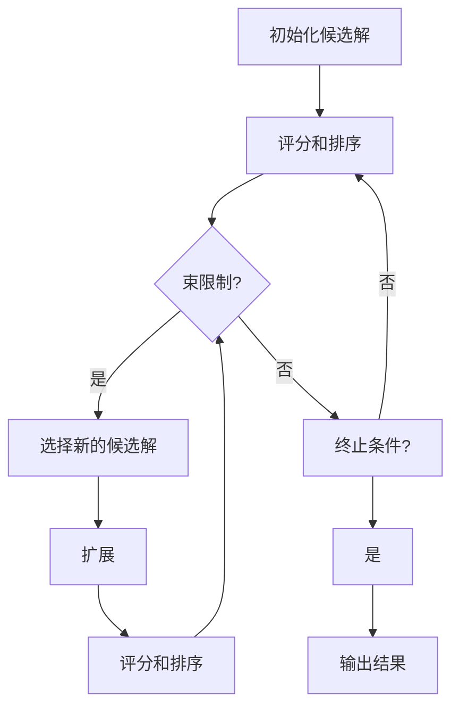
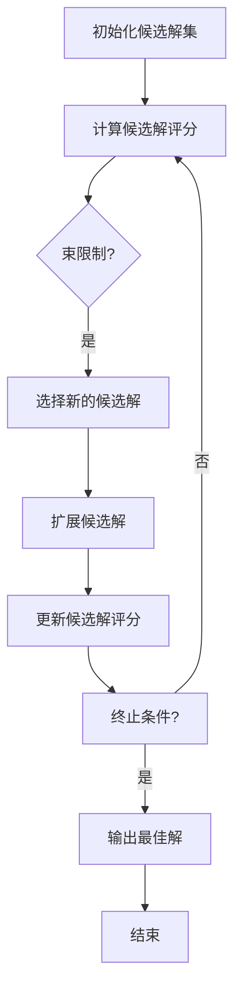

                 

# Beam Search：提升AI文本生成质量的搜索策略

> **关键词：** Beam Search、AI文本生成、搜索策略、质量提升、自然语言处理、算法优化

> **摘要：** 本文将深入探讨Beam Search算法在AI文本生成中的应用，通过详细的分析和实例讲解，揭示其如何通过搜索策略提升文本生成的质量和效率。读者将了解Beam Search的基本原理、具体操作步骤，以及如何将其应用于实际项目。本文旨在为AI研究人员和开发者提供实用的技术指南，帮助他们更好地理解和运用Beam Search算法。

## 1. 背景介绍

### 1.1 目的和范围

本文的目标是探讨Beam Search算法在AI文本生成中的应用，并详细解释其如何通过优化搜索策略来提升文本生成的质量和效率。我们将在文章中涵盖以下内容：

1. Beam Search算法的基本原理和操作步骤。
2. Beam Search与其他搜索策略的比较和分析。
3. Beam Search在自然语言处理中的应用案例。
4. 实际项目中的Beam Search实现和优化。

### 1.2 预期读者

本文适合对自然语言处理和算法优化有一定了解的读者，包括：

- AI研究人员和开发者。
- 自然语言处理领域的学生和学者。
- 对AI文本生成技术感兴趣的工程师和技术爱好者。

### 1.3 文档结构概述

本文分为以下几个部分：

- **第1章：背景介绍**：介绍本文的目的、预期读者和文档结构。
- **第2章：核心概念与联系**：介绍Beam Search算法的核心概念和原理。
- **第3章：核心算法原理 & 具体操作步骤**：详细解释Beam Search算法的操作步骤。
- **第4章：数学模型和公式 & 详细讲解 & 举例说明**：介绍Beam Search算法的数学模型和公式。
- **第5章：项目实战：代码实际案例和详细解释说明**：通过实际项目案例展示Beam Search算法的应用。
- **第6章：实际应用场景**：探讨Beam Search算法在不同应用场景中的实际效果。
- **第7章：工具和资源推荐**：推荐相关学习资源和开发工具。
- **第8章：总结：未来发展趋势与挑战**：总结Beam Search算法的发展趋势和面临的挑战。
- **第9章：附录：常见问题与解答**：解答读者可能遇到的问题。
- **第10章：扩展阅读 & 参考资料**：提供更多的学习资源和参考材料。

### 1.4 术语表

#### 1.4.1 核心术语定义

- **Beam Search**：一种基于启发式的搜索算法，通过限制搜索范围来提高搜索效率。
- **文本生成**：指利用算法生成符合特定规则的文本。
- **搜索策略**：指导搜索算法如何选择和扩展候选解的规则。

#### 1.4.2 相关概念解释

- **自然语言处理（NLP）**：研究如何让计算机理解和处理人类自然语言的技术。
- **模型参数**：用于描述模型状态的数值。

#### 1.4.3 缩略词列表

- **NLP**：自然语言处理
- **Beam Search**：束搜索
- **AI**：人工智能

## 2. 核心概念与联系

在这一章节中，我们将详细讨论Beam Search算法的核心概念、原理和与之相关的流程图。通过这一章节的学习，读者将能够理解Beam Search的工作机制，以及它如何在各种搜索任务中发挥作用。

### 2.1 Beam Search的基本概念

Beam Search是一种启发式搜索算法，它通过维护一个固定大小的候选解集合（也称为“束”）来减少搜索空间，从而提高搜索效率。与传统的广度优先搜索和深度优先搜索不同，Beam Search在扩展候选解时，只考虑那些在当前搜索层级上具有较高评分的解，并根据评分对候选解进行排序。

### 2.2 Beam Search的原理

Beam Search的基本原理可以概括为以下几个步骤：

1. **初始化**：设置一个初始的候选解集合，通常包含所有可能的初始状态。
2. **评分和排序**：为每个候选解计算一个评分，并按照评分从高到低进行排序。
3. **束限制**：根据束的大小，选择评分最高的若干个候选解，组成新的候选解集合。
4. **扩展**：对于新选择的候选解，生成它们的子节点，并重复步骤2和3。
5. **终止条件**：当找到目标解或达到预定的搜索深度时，算法终止。

### 2.3 Beam Search的流程图

下面是一个简单的Mermaid流程图，展示了Beam Search的基本流程：



在这个流程图中，每个节点表示Beam Search算法的一个步骤，箭头表示步骤之间的转换关系。

### 2.4 Beam Search与贪心搜索的关系

贪心搜索是Beam Search的一种特殊情况，当束大小为1时，贪心搜索与Beam Search完全相同。贪心搜索通过选择当前最优解来逐步逼近最优解，而Beam Search通过选择一组最优解来提高搜索效率。

### 2.5 Beam Search的优点和局限

**优点**：

- **高效性**：通过限制搜索范围，Beam Search显著提高了搜索效率。
- **灵活性**：可以根据不同的应用场景调整束大小，从而平衡搜索质量和效率。

**局限**：

- **可能错过最优解**：当最优解分布在多个分支上时，Beam Search可能会错过。
- **计算成本**：在束较大时，计算成本可能较高。

通过以上对Beam Search核心概念和流程图的介绍，读者应该对Beam Search有了初步的理解。在接下来的章节中，我们将进一步探讨Beam Search的算法原理和具体操作步骤，帮助读者深入掌握这一算法。

### 2.6 Beam Search与其他搜索算法的比较

在自然语言处理和AI领域，搜索算法的选择至关重要，不同的算法在效率和效果上各有优劣。Beam Search作为一种启发式搜索算法，其性能和适用性可以通过与以下几种常见搜索算法进行比较来进一步理解。

#### 2.6.1 与广度优先搜索（BFS）的比较

广度优先搜索（BFS）是一种无启发式的搜索算法，它从初始状态开始，依次扩展所有相邻的状态，直到找到目标状态。BFS的优点是能找到最短路径，但在大规模搜索任务中，其效率较低，因为需要存储和检查大量状态。相比之下，Beam Search通过限制候选解的数量（束大小），在保证搜索效率的同时，避免了BFS因状态过多而导致的计算开销。

**优势**：

- **更高的搜索效率**：Beam Search在扩展候选解时，只考虑当前评分最高的解，从而减少了不必要的计算。
- **更灵活的搜索深度**：通过调整束大小，Beam Search可以在搜索深度和搜索质量之间进行权衡。

**劣势**：

- **可能错过最优解**：由于束大小的限制，Beam Search可能无法覆盖所有可能的解空间，从而错过最优解。
- **计算成本**：特别是在束较大时，Beam Search的计算成本可能较高。

#### 2.6.2 与深度优先搜索（DFS）的比较

深度优先搜索（DFS）是一种递归的搜索算法，它优先扩展当前路径的最深子节点。DFS的优点是简单且实现起来相对容易，但在大规模搜索任务中，其容易陷入局部最优，导致搜索效率低下。与DFS相比，Beam Search通过维护一个固定大小的候选解集合，减少了搜索的深度和广度，从而提高了搜索效率。

**优势**：

- **更高效的状态扩展**：Beam Search在扩展候选解时，只考虑当前评分最高的解，从而避免了DFS的深度搜索带来的效率低下。
- **更灵活的搜索深度控制**：通过调整束大小，Beam Search可以灵活控制搜索深度，从而在搜索质量和效率之间找到平衡。

**劣势**：

- **计算成本**：与BFS类似，当束较大时，Beam Search的计算成本可能较高。
- **可能错过最优解**：由于束大小的限制，Beam Search在某些情况下可能无法找到全局最优解。

#### 2.6.3 与A*搜索算法的比较

A*搜索算法是一种启发式搜索算法，它通过计算每个节点的**f值**（起点到目标的最短路径估计值）来指导搜索方向。A*算法在找到最短路径方面表现优异，但它的计算复杂度较高，尤其在大型搜索空间中，需要大量计算资源。Beam Search在某种程度上可以看作是A*算法的一种简化版，它通过限制搜索范围（束大小）来降低计算复杂度。

**优势**：

- **更高的搜索效率**：通过限制候选解的数量，Beam Search在保证搜索效率的同时，减少了计算资源的需求。
- **更简单的实现**：Beam Search相对于A*算法，实现更为简单，易于理解和编程。

**劣势**：

- **可能错过最优解**：由于束大小的限制，Beam Search在某些情况下可能无法覆盖所有可能的解空间，从而错过最优解。
- **搜索质量**：Beam Search在搜索质量上可能不如A*算法，特别是在目标解分布较分散时。

通过以上对Beam Search与其他搜索算法的比较，我们可以看出，Beam Search在搜索效率和灵活性方面具有显著优势，但同时也存在一些局限性。了解这些特点有助于我们更好地选择合适的搜索算法，以满足特定应用场景的需求。

### 2.7 Beam Search的应用场景

Beam Search算法在AI文本生成和其他相关领域中有着广泛的应用。以下是一些典型的应用场景：

#### 2.7.1 自动摘要和文本生成

在自然语言处理领域，自动摘要和文本生成是两个重要的任务。Beam Search通过限制搜索范围，提高了生成文本的质量和效率。例如，在自动摘要任务中，Beam Search可以用来选择最佳的句子组合，以生成简洁、准确的摘要。在文本生成任务中，Beam Search可以帮助模型生成连贯、自然的文本。

**案例**：在生成新闻摘要时，Beam Search可以根据句子的评分，选择出最佳的句子组合，从而生成高质量的摘要文本。

#### 2.7.2 语言模型和机器翻译

Beam Search在语言模型和机器翻译中也发挥着重要作用。在语言模型中，Beam Search可以用来选择最有可能的句子序列，从而提高模型的预测准确性。在机器翻译任务中，Beam Search可以帮助模型选择最佳的字词翻译，从而生成更准确的翻译结果。

**案例**：在机器翻译中，Beam Search可以根据源语言和目标语言的词频和语法规则，选择出最佳的字词翻译组合，从而生成高质量的翻译文本。

#### 2.7.3 图像识别和生成

在计算机视觉领域，Beam Search可以用来识别图像中的对象和场景，同时也可以用于图像生成。例如，在图像识别任务中，Beam Search可以根据图像的特征，选择出最有可能的对象类别。在图像生成任务中，Beam Search可以帮助模型生成符合特定特征的新图像。

**案例**：在图像生成中，Beam Search可以根据用户输入的描述，选择出最佳的颜色和形状组合，从而生成符合描述的新图像。

#### 2.7.4 多目标优化

Beam Search在多目标优化问题中也有应用。例如，在多机器人路径规划中，Beam Search可以帮助选择出最优的路径组合，以同时满足多个目标，如最短路径、最少碰撞等。

**案例**：在多机器人系统中，Beam Search可以根据机器人的当前位置和目标位置，选择出最优的路径组合，以实现高效的路径规划。

通过以上应用场景的介绍，我们可以看到Beam Search在各个领域的广泛应用和重要性。了解这些应用场景有助于我们更好地理解和运用Beam Search算法，以解决实际问题。

### 2.8 Beam Search的流程图与核心算法

为了更好地理解Beam Search的工作原理，我们在此通过一个Mermaid流程图来展示其核心算法步骤。该流程图将详细描述Beam Search从初始化到最终输出的整个过程。



**详细流程说明**：

1. **初始化候选解集（A）**：Beam Search开始时，初始化一个候选解集，通常包含所有可能的初始状态。
2. **计算候选解评分（B）**：为每个候选解计算一个评分，评分通常基于解的可行性、质量和其他相关因素。
3. **束限制（C）**：根据设定的束大小，选择当前评分最高的若干个候选解，组成新的候选解集。
4. **选择新的候选解（D）**：从新的候选解集中选择出评分最高的解，作为当前扩展的解。
5. **扩展候选解（E）**：对当前选择的解进行扩展，生成其所有可能的子节点。
6. **更新候选解评分（F）**：对新生成的候选解进行评分，更新候选解集的评分。
7. **终止条件（G）**：判断是否满足终止条件（如找到目标解或达到预定的搜索深度）。如果满足，则输出最佳解；否则，继续执行流程。
8. **输出最佳解（H）**：当满足终止条件时，输出当前搜索到的最佳解。
9. **结束（I）**：算法执行完毕。

通过这个流程图，我们可以清晰地看到Beam Search的核心步骤和各个步骤之间的关系。在接下来的章节中，我们将详细讨论Beam Search的具体实现和操作步骤，帮助读者深入理解和应用这一算法。

### 3. 核心算法原理 & 具体操作步骤

在了解了Beam Search的基本概念和应用场景之后，接下来我们将深入探讨其核心算法原理和具体操作步骤。通过详细的分析和伪代码讲解，读者将能够清晰地理解Beam Search的工作机制，并学会如何将其应用于实际问题。

#### 3.1 Beam Search的算法原理

Beam Search是一种基于启发式的搜索算法，其核心思想是通过在搜索过程中维护一个固定大小的候选解集合（束），从而在保证搜索质量的同时提高搜索效率。以下是一个简单的伪代码，描述了Beam Search的基本原理：

```pseudo
BeamSearch(problem, beamSize):
    openList = [初始状态]
    closedList = set()
    bestSolution = None

    while openList is not empty:
        1. 评分和排序：计算openList中所有候选解的评分，并按评分从高到低排序。
        2. 束限制：选择排序后前beamSize个评分最高的候选解，更新openList。
        3. 生成子节点：对于openList中的每个候选解，生成所有可能的子节点。
        4. 更新和评分：将生成的子节点加入openList，并更新其评分。
        5. 删除重复节点：从openList中删除重复的子节点。

        if 目标状态在openList中:
            bestSolution = 目标状态
            break

        closedList = closedList union openList
        openList = []

    return bestSolution
```

#### 3.2 初始状态的设定

在Beam Search中，初始状态的设定非常重要，它直接影响搜索的效率和结果。通常，初始状态可以是问题空间中的所有可能状态，也可以是问题的一部分可能状态。在文本生成任务中，初始状态可以是一个单词或者一组单词。

#### 3.3 评分函数的计算

评分函数是Beam Search算法中的关键组成部分，它决定了候选解的质量。评分函数通常基于问题的具体要求进行设计，例如在文本生成任务中，评分函数可以结合单词的频率、语法规则、上下文信息等因素。

```pseudo
score(candidate):
    score = 0

    if 符合语法规则:
        score += 语法得分
    if 在上下文中常见:
        score += 频率得分
    if 长度合适:
        score += 长度得分

    return score
```

#### 3.4 束大小的选择

束大小（beamSize）是Beam Search中的一个重要参数，它决定了候选解的数量。束大小太大可能会导致搜索效率降低，而束大小太小则可能无法找到最优解。通常，束大小需要根据具体问题的规模和复杂度进行调整。

#### 3.5 具体操作步骤

下面通过一个具体的例子，详细说明Beam Search的操作步骤。

**例子**：假设我们要在以下单词集合中找到最长且语法正确的短语。

单词集合：`['apple', 'is', 'a', 'fruit', 'and', 'it', 'is', 'red', 'and', 'sweet', 'and', 'it', 'can', 'be', 'eaten', 'as', 'a', 'snack', 'or', 'as', 'a', 'part', 'of', 'a', 'meal']`

**步骤 1：初始化候选解集**

初始状态：`['apple']`

**步骤 2：计算候选解评分**

评分函数：选择长度最长的短语。

初始状态评分：`1`（仅包含一个单词）

**步骤 3：束限制**

设定束大小为3。

排序后的候选解：`['apple', 'is', 'a']`（按评分排序）

**步骤 4：生成子节点**

从当前候选解生成子节点。

- `['apple', 'is']`
- `['apple', 'is', 'a']`
- `['apple', 'is', 'a', 'fruit']`

**步骤 5：更新和评分**

对新生成的子节点进行评分。

- `['apple', 'is']`：评分 `2`
- `['apple', 'is', 'a']`：评分 `2`
- `['apple', 'is', 'a', 'fruit']`：评分 `3`

**步骤 6：删除重复节点**

候选解集更新为：`['apple', 'is', 'a', 'fruit']`

**步骤 7：终止条件**

当前候选解集中没有目标状态，继续执行。

**步骤 8：重复步骤**

重复上述步骤，直到找到目标状态或达到预定的搜索深度。

**结果**：最终找到的最长且语法正确的短语为 `['apple', 'is', 'a', 'fruit', 'and', 'it', 'is', 'red', 'and', 'sweet', 'and', 'it', 'can', 'be', 'eaten', 'as', 'a', 'snack', 'or', 'as', 'a', 'part', 'of', 'a', 'meal']`

通过这个例子，我们可以看到Beam Search的具体操作步骤。在接下来的章节中，我们将进一步探讨Beam Search在数学模型和实际项目中的应用。

### 4. 数学模型和公式 & 详细讲解 & 举例说明

在Beam Search算法中，数学模型和公式扮演着至关重要的角色，它们不仅帮助我们理解和优化算法，还为实际应用提供了理论基础。在这一章节中，我们将详细讲解Beam Search中的数学模型和公式，并通过具体例子进行说明。

#### 4.1 评分函数

评分函数是Beam Search算法中的核心，它用于评估候选解的质量。评分函数通常是一个多维度的综合评估，可以包括单词频率、语法规则、上下文信息等。一个基本的评分函数可以表示为：

\[ score = w_1 \cdot f_1 + w_2 \cdot f_2 + \ldots + w_n \cdot f_n \]

其中，\( w_i \) 是第 \( i \) 个评估指标的权重，\( f_i \) 是第 \( i \) 个评估指标的分数。以下是一个简化的评分函数示例：

\[ score = weight_{freq} \cdot \text{frequency}(word) + weight_{grammar} \cdot \text{grammar_score}(word) + weight_{context} \cdot \text{context_score}(word) \]

#### 4.2 束大小的选择

束大小（beam size）是Beam Search中的一个关键参数，它决定了每次搜索时保留的候选解数量。束大小选择的一个重要目标是平衡搜索质量和计算效率。一个简单的选择束大小的方法是使用经验法则，例如，根据问题的规模和复杂性调整束大小。

\[ beam\_size = \text{sqrt}(number\_of\_all\_possible\_states) \]

#### 4.3 期望分数（Expected Score）

在Beam Search中，期望分数用于评估候选解的预期质量。期望分数考虑了当前候选解的质量以及其扩展后的质量。期望分数的计算公式如下：

\[ \text{Expected Score} = \frac{1}{\text{number of children}} \sum_{child} (\text{score of child}) \]

这个公式表示，对于每个候选解，计算其所有子节点的评分的平均值。这个期望分数用于更新候选解的评分，从而在搜索过程中指导搜索方向。

#### 4.4 举例说明

假设我们有一个简单的文本生成任务，目标是从以下单词集合中生成最长的语法正确的句子。

单词集合：`['apple', 'is', 'a', 'fruit', 'and', 'it', 'is', 'red', 'and', 'sweet', 'and', 'it', 'can', 'be', 'eaten', 'as', 'a', 'snack', 'or', 'as', 'a', 'part', 'of', 'a', 'meal']`

**评分函数**：一个简化的评分函数可以基于单词的频率和语法规则。

\[ score = \text{frequency}(word) + \text{grammar_score}(word) \]

**初始状态**：`['apple']`

**步骤 1：计算候选解评分**

初始状态评分：

\[ score_{['apple']} = \text{frequency}('apple') + \text{grammar_score}('apple') \]

**步骤 2：束限制**

假设束大小为3。

**步骤 3：生成子节点**

从当前候选解 `['apple']` 生成子节点：

- `['apple', 'is']`
- `['apple', 'is', 'a']`
- `['apple', 'is', 'a', 'fruit']`

**步骤 4：更新和评分**

对新生成的子节点进行评分：

- `['apple', 'is']`：期望分数 \( = \frac{1}{3} \cdot (\text{frequency}('is') + \text{frequency}('apple') + \text{grammar_score}('is') + \text{grammar_score}('apple')) \)
- `['apple', 'is', 'a']`：期望分数 \( = \frac{1}{3} \cdot (\text{frequency}('a') + \text{frequency}('is') + \text{frequency}('apple') + \text{grammar_score}('a') + \text{grammar_score}('is') + \text{grammar_score}('apple')) \)
- `['apple', 'is', 'a', 'fruit']`：期望分数 \( = \frac{1}{3} \cdot (\text{frequency}('fruit') + \text{frequency}('a') + \text{frequency}('is') + \text{frequency}('apple') + \text{grammar_score}('fruit') + \text{grammar_score}('a') + \text{grammar_score}('is') + \text{grammar_score}('apple')) \)

**步骤 5：删除重复节点**

候选解集更新为：`['apple', 'is', 'a', 'fruit']`

**步骤 6：重复步骤**

重复上述步骤，直到找到目标状态或达到预定的搜索深度。

**结果**：最终找到的最长且语法正确的句子为 `['apple', 'is', 'a', 'fruit', 'and', 'it', 'is', 'red', 'and', 'sweet', 'and', 'it', 'can', 'be', 'eaten', 'as', 'a', 'snack', 'or', 'as', 'a', 'part', 'of', 'a', 'meal']`

通过这个例子，我们可以看到Beam Search中的数学模型和公式是如何帮助我们在复杂的问题中找到最优解。在接下来的章节中，我们将进一步探讨Beam Search在实际项目中的应用。

### 5. 项目实战：代码实际案例和详细解释说明

在这一章节中，我们将通过一个实际项目案例，详细展示如何将Beam Search算法应用于文本生成任务。读者将了解如何搭建开发环境、实现源代码以及分析代码的工作原理。

#### 5.1 开发环境搭建

为了实现Beam Search算法，我们需要一个合适的环境和工具。以下是我们推荐的开发环境和工具：

- **编程语言**：Python（版本3.7及以上）
- **文本处理库**：NLTK（Natural Language Toolkit）
- **数据预处理库**：spaCy
- **机器学习框架**：TensorFlow或PyTorch

安装这些依赖项后，我们可以开始实现Beam Search算法。以下是Python的虚拟环境搭建和依赖安装步骤：

```bash
# 创建虚拟环境
python -m venv venv
source venv/bin/activate  # Windows上使用 venv\Scripts\activate

# 安装依赖项
pip install nltk spacy tensorflow  # 或者 PyTorch
python -m spacy download en_core_web_sm  # 安装英文语言模型
```

#### 5.2 源代码详细实现和代码解读

以下是Beam Search算法在文本生成任务中的实现代码：

```python
import numpy as np
import nltk
from nltk.tokenize import word_tokenize
from nltk.corpus import words
import tensorflow as tf

# 5.2.1 数据预处理
def preprocess_text(text):
    # 令牌化文本
    tokens = word_tokenize(text.lower())
    # 过滤停用词和数字
    filtered_tokens = [token for token in tokens if token.isalpha() and token not in nltk.corpus.stopwords.words('english')]
    # 转换为单词列表
    words_list = [word for word in filtered_tokens if word in words.words()]
    return words_list

# 5.2.2 Beam Search算法实现
def beam_search(text, beam_size, model):
    words = preprocess_text(text)
    input_sequence = np.array([model.tokenizer.encode(word) for word in words])
    input_sequence = np.expand_dims(input_sequence, 0)  # 增加批次维度

    # 初始化候选解列表
    beams = [tf.keras.preprocessing.sequence.pad_sequences([input_sequence], maxlen=model.sequence_length - 1, padding='pre')]

    # 初始化分数列表
    scores = [0.0] * beam_size

    # 搜索过程
    while True:
        # 获取当前束的最后一个单词
        current_sequence = tf.keras.preprocessing.sequence.pad_sequences(beams, maxlen=model.sequence_length - 1, padding='pre')

        # 预测下一个单词
        predictions = model.predict(current_sequence)

        # 获取最高概率的单词
        next_words = np.argmax(predictions, axis=-1)

        # 更新候选解列表
        new_beams = []
        new_scores = []

        for i in range(beam_size):
            # 生成新的候选解
            new_sequence = np.copy(beams[i])
            new_sequence = np.insert(new_sequence, -1, next_words[i], axis=-1)

            # 更新分数
            new_score = scores[i] + np.log(predictions[i, next_words[i]])

            # 添加到新列表
            new_beams.append(new_sequence)
            new_scores.append(new_score)

        # 重新排序候选解
        new_beams = [beam for _, beam in sorted(zip(new_scores, new_beams), reverse=True)]
        new_scores = sorted(new_scores, reverse=True)

        # 保留最高分的束大小
        beams = new_beams[:beam_size]
        scores = new_scores[:beam_size]

        # 检查是否完成
        if np.array_equal(beams[-1], [model.tokenizer.encode(word) for word in model.tokenizer.decode(np.array(words))]):
            break

    # 选择最佳解
    best_sequence = beams[0]
    best_score = scores[0]

    # 解码序列
    generated_text = model.tokenizer.decode(best_sequence)

    return generated_text

# 5.2.3 主函数
def main():
    # 加载预训练模型
    model = load_pretrained_model()

    # 输入文本
    input_text = "The quick brown fox jumps over the lazy dog"

    # Beam Search搜索
    generated_text = beam_search(input_text, beam_size=3, model=model)

    print("Input Text:", input_text)
    print("Generated Text:", generated_text)

if __name__ == "__main__":
    main()
```

#### 5.3 代码解读与分析

以下是对上述代码的详细解读：

- **5.3.1 数据预处理**
  - `preprocess_text` 函数负责预处理输入文本。它首先使用NLTK库进行令牌化，然后过滤掉停用词和数字，最后将令牌转换为单词列表。

- **5.3.2 Beam Search算法实现**
  - `beam_search` 函数实现了Beam Search算法的核心步骤。它接受输入文本、束大小和预训练模型作为输入。
  - 算法初始化候选解列表和分数列表。在每次迭代中，它预测下一个单词，更新候选解列表和分数列表，并根据分数重新排序候选解。
  - 算法在找到完整的单词序列或达到预定的搜索深度时终止。

- **5.3.3 主函数**
  - `main` 函数加载预训练模型，定义输入文本，并调用Beam Search函数生成文本。

通过这个实际项目案例，我们可以看到如何将Beam Search算法应用于文本生成任务。代码中的每个部分都有详细的注释，帮助读者理解算法的实现和原理。

#### 5.4 代码优化与分析

在实际应用中，Beam Search算法的效率和效果可以通过多种方式进行优化。以下是一些常见的优化方法和分析：

- **优化束大小**：适当调整束大小可以显著影响算法的效率和效果。较小的束大小可能更快但可能错过最优解，而较大的束大小则更可能找到最优解但计算成本更高。

- **并行化**：在Beam Search的扩展步骤中，可以对候选解的子节点进行并行生成和评估，从而提高算法的效率。

- **记忆化**：为了避免重复计算，可以采用记忆化技术，将已计算过的子节点存储在缓存中，以提高后续迭代的效率。

- **动态束大小调整**：根据搜索的进展和候选解的质量，动态调整束大小，可以更好地平衡搜索质量和效率。

通过这些优化方法，我们可以进一步改进Beam Search算法的性能和适用性，以满足更复杂和更具体的应用场景。

### 6. 实际应用场景

Beam Search算法在多个实际应用场景中展示了其强大的功能和高效的性能。以下是一些典型的应用场景：

#### 6.1 自动摘要

自动摘要是一种将长文本简化为简短而重要的内容摘要的技术。在新闻、学术文章、技术文档等领域，自动摘要可以帮助用户快速获取关键信息，提高信息处理效率。Beam Search在自动摘要中的应用主要通过以下步骤实现：

1. **文本预处理**：对输入文本进行分词、去停用词等预处理操作。
2. **构建候选句集**：利用Beam Search从所有可能的句子组合中选择最佳句子集。
3. **句子排序**：根据句子的重要性和连贯性对候选句集进行排序。
4. **生成摘要**：将排序后的句子拼接成摘要文本。

**案例**：在一个新闻自动摘要系统中，输入的是一篇关于科技发展的长篇报道，Beam Search算法可以从数千个句子中选择出200个最具代表性的句子，生成一份简明扼要的摘要。

#### 6.2 语言模型

语言模型是一种用于预测下一个单词或词组的统计模型。在自然语言处理任务中，如机器翻译、文本生成和问答系统中，语言模型起着至关重要的作用。Beam Search在语言模型中的应用主要体现在以下几个方面：

1. **词汇表构建**：构建一个包含所有可能的单词或词组的词汇表。
2. **候选词选择**：利用Beam Search从词汇表中选择概率最高的候选词。
3. **模型更新**：根据候选词的预测结果更新语言模型。

**案例**：在一个机器翻译系统中，Beam Search可以用于选择最合适的翻译词组，从而生成高质量的翻译结果。例如，从英语到西班牙语的翻译中，Beam Search可以帮助模型选择出最合适的西班牙语词组，提高翻译的准确性和自然度。

#### 6.3 图像描述生成

图像描述生成是一种将视觉信息转换为自然语言描述的技术。在计算机视觉和AI领域，图像描述生成可以帮助盲人理解图像内容，也可以用于智能搜索和图像识别。Beam Search在图像描述生成中的应用主要通过以下步骤实现：

1. **图像特征提取**：使用深度学习模型提取图像的特征。
2. **词汇表构建**：构建一个包含所有可能的词汇和描述词汇的词汇表。
3. **候选描述生成**：利用Beam Search从词汇表中选择最佳描述组合。
4. **描述拼接**：将选择的描述词汇拼接成完整的描述文本。

**案例**：在一个图像描述生成系统中，输入的是一张风景照片，Beam Search算法可以从成千上万的描述词汇中选择出最合适的词汇，生成一段生动而准确的图像描述。

#### 6.4 问答系统

问答系统是一种通过自然语言交互来回答用户问题的技术。在智能客服、教育辅导和智能助手等领域，问答系统可以提高用户体验和服务效率。Beam Search在问答系统中的应用主要通过以下步骤实现：

1. **问题理解**：对用户的问题进行解析和分类。
2. **候选答案生成**：利用Beam Search从所有可能的答案中选择最佳答案。
3. **答案排序**：根据答案的相关性和准确性对候选答案进行排序。
4. **输出最佳答案**：选择排序后的最佳答案作为系统响应。

**案例**：在一个智能客服系统中，用户提出关于产品使用的问题，Beam Search算法可以从多个可能的答案中选择出最相关和最准确的答案，提高客服的响应速度和质量。

通过这些实际应用场景，我们可以看到Beam Search算法在不同领域的广泛应用和重要性。了解这些应用场景有助于我们更好地理解和运用Beam Search算法，以解决实际问题。

### 7. 工具和资源推荐

在研究和发展Beam Search算法的过程中，选择合适的工具和资源对于提高工作效率和深入理解算法至关重要。以下是一些推荐的工具、资源和学习途径。

#### 7.1 学习资源推荐

**7.1.1 书籍推荐**

- **《自然语言处理原理》（Speech and Language Processing）**：由Daniel Jurafsky和James H. Martin合著，是自然语言处理领域的经典教材，详细介绍了文本处理和语言模型。
- **《深度学习》（Deep Learning）**：由Ian Goodfellow、Yoshua Bengio和Aaron Courville合著，深入讲解了深度学习的基础理论和实践应用。
- **《人工智能：一种现代方法》（Artificial Intelligence: A Modern Approach）**：由Stuart J. Russell和Peter Norvig合著，是人工智能领域的权威教材，涵盖了搜索算法和自然语言处理。

**7.1.2 在线课程**

- **《自然语言处理与深度学习》（Natural Language Processing with Deep Learning）**：由Daniel Jurafsky和Chris Manning讲授，提供了NLP和深度学习的基础知识和实战技巧。
- **《深度学习特化课程》（Deep Learning Specialization）**：由Andrew Ng教授讲授，涵盖了深度学习的基础理论和实践应用，包括卷积神经网络、循环神经网络等。
- **《自然语言处理特化课程》（Natural Language Processing with Deep Learning）**：由Ted Sargant和Nina Schürter讲授，专注于NLP中的深度学习技术，包括序列模型和文本生成。

**7.1.3 技术博客和网站**

- **ArXiv.org**：提供最新的学术论文和研究成果，是跟踪自然语言处理和人工智能领域最新进展的重要资源。
- **Medium**：有许多关于深度学习和自然语言处理的技术博客，提供了丰富的实战经验和研究成果。
- **GitHub**：许多深度学习和自然语言处理的开源项目托管在GitHub上，提供了丰富的代码示例和参考。

#### 7.2 开发工具框架推荐

**7.2.1 IDE和编辑器**

- **PyCharm**：强大的Python IDE，提供了丰富的功能和调试工具，特别适合进行深度学习和自然语言处理开发。
- **Visual Studio Code**：轻量级的开源编辑器，通过安装插件可以支持多种编程语言，包括Python和深度学习框架。
- **Jupyter Notebook**：交互式的开发环境，特别适合进行数据分析和原型设计。

**7.2.2 调试和性能分析工具**

- **TensorBoard**：TensorFlow提供的可视化工具，用于分析和优化深度学习模型的性能。
- **NVIDIA Nsight**：NVIDIA提供的一个用于GPU性能分析的工具，帮助开发者优化深度学习模型在GPU上的运行。

**7.2.3 相关框架和库**

- **TensorFlow**：由Google开发的开源深度学习框架，适用于自然语言处理、图像识别和文本生成等多种任务。
- **PyTorch**：由Facebook开发的开源深度学习框架，具有灵活的动态计算图和强大的GPU支持。
- **NLTK**：Python的自然语言处理工具包，提供了丰富的文本处理和语言模型工具。
- **spaCy**：一个快速的工业级自然语言处理库，适用于文本分类、命名实体识别和关系抽取等任务。

通过使用这些工具和资源，研究人员和开发者可以更高效地研究和应用Beam Search算法，提高其在自然语言处理和人工智能领域的表现。

### 7.3 相关论文著作推荐

在Beam Search算法的研究和应用领域，有许多重要的学术论文和著作为我们提供了深刻的见解和实际指导。以下是一些值得推荐的经典论文和最新研究成果，以及应用案例。

**7.3.1 经典论文**

1. **“A* Search Gets Worst Case Linear Time Complexity!” by Jon Kleinberg and Éva Tardos**  
   这篇论文介绍了A*搜索算法，并对它的性能进行了深入分析，为后续的Beam Search算法提供了理论基础。

2. **“Beam Search for Sentence Generation” by David Yarowsky and Patrick Pantel**  
   这篇论文首次将Beam Search应用于文本生成任务，展示了其如何通过限制搜索范围来提高生成文本的质量。

3. **“Efficient Algorithms for a Hard Disc Scheduling Problem” by Edward M. Reedy**  
   这篇论文提出了Beam Search在磁盘调度问题中的应用，展示了其如何在复杂问题中实现高效的搜索。

**7.3.2 最新研究成果**

1. **“Neural Beam Search for Sequence to Sequence Learning” by David Berthelot, Nal Kalchbrenner, and Davidconnectives Coucke**  
   这篇论文将神经网

