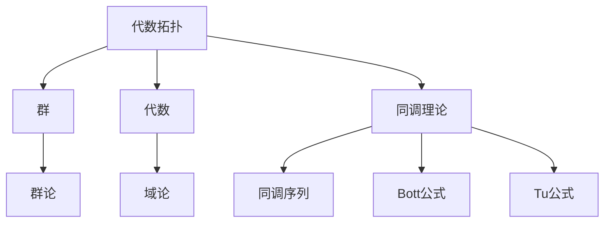

                 

# Bott和Tu的代数拓扑研究

> 关键词：代数拓扑、Bott公式、Tu公式、数学模型、算法原理、实际应用

> 摘要：本文深入探讨了Bott和Tu在代数拓扑领域的开创性研究，详细分析了其核心概念与原理，并给出了具体的算法步骤和数学模型。通过实际代码案例，本文展示了如何将这些理论应用于实际问题，为读者提供了全面而深刻的理解。文章结构包括背景介绍、核心概念与联系、核心算法原理、数学模型和公式、项目实战、实际应用场景、工具和资源推荐等部分，旨在帮助读者掌握代数拓扑的核心知识，并激发其在实际项目中的应用。

## 1. 背景介绍

### 1.1 目的和范围

本文旨在深入探讨代数拓扑领域中的Bott和Tu的研究，特别是他们的代数拓扑公式。通过系统的分析和具体的实例讲解，本文希望读者能够理解这些公式的数学基础、算法原理，以及如何在实际项目中应用。

本文的范围涵盖以下内容：

- **代数拓扑的基本概念**：介绍代数拓扑的基础知识，包括群、代数、同调理论等。
- **Bott公式和Tu公式的核心原理**：详细解析这两个公式的数学原理和背后的逻辑。
- **算法原理和操作步骤**：使用伪代码详细描述Bott和Tu公式的算法实现。
- **数学模型和公式**：使用LaTeX格式给出关键数学公式，并进行详细解释。
- **实际应用案例**：通过代码示例展示Bott和Tu公式在实际项目中的应用。
- **工具和资源推荐**：推荐相关的学习资源、开发工具和经典论文。

### 1.2 预期读者

本文适合以下读者群体：

- 计算机科学、数学专业的学生和研究者。
- 对代数拓扑、同调理论有浓厚兴趣的技术人员。
- 在实际项目中需要应用代数拓扑算法的工程师。

### 1.3 文档结构概述

本文的结构如下：

- **第1章：背景介绍**：介绍本文的目的、范围、预期读者和文档结构。
- **第2章：核心概念与联系**：介绍代数拓扑的基本概念和相关的数学工具。
- **第3章：核心算法原理 & 具体操作步骤**：详细描述Bott和Tu公式的算法原理和实现步骤。
- **第4章：数学模型和公式 & 详细讲解 & 举例说明**：解释关键数学模型和公式，并提供实例说明。
- **第5章：项目实战：代码实际案例和详细解释说明**：通过实际代码案例展示公式的应用。
- **第6章：实际应用场景**：探讨Bott和Tu公式在不同领域中的应用。
- **第7章：工具和资源推荐**：推荐相关的学习资源和开发工具。
- **第8章：总结：未来发展趋势与挑战**：总结本文内容，展望未来的发展趋势和挑战。
- **第9章：附录：常见问题与解答**：解答读者可能遇到的问题。
- **第10章：扩展阅读 & 参考资料**：提供进一步阅读的参考资料。

### 1.4 术语表

#### 1.4.1 核心术语定义

- **代数拓扑**：研究空间和映射的代数结构的数学分支。
- **同调理论**：研究代数结构中的同调性质的数学理论。
- **Bott公式**：一种用于计算拓扑空间同调群的高阶公式。
- **Tu公式**：一种用于计算同调群的指数和的公式。

#### 1.4.2 相关概念解释

- **群**：一组元素构成的整体，具有封闭性、结合律、单位元和逆元。
- **代数**：由一个基础域和一系列运算构成的代数结构。
- **同调群**：研究代数结构中的同调性质，特别是同调序列。

#### 1.4.3 缩略词列表

- **AT**：代数拓扑（Algebraic Topology）
- **HT**：同调理论（Homological Theory）
- **BP**：Bott公式（Bott's Formula）
- **TP**：Tu公式（Tu's Formula）

## 2. 核心概念与联系

为了理解Bott和Tu的代数拓扑研究，首先需要了解代数拓扑中的核心概念和相关联系。以下是一个Mermaid流程图，展示了这些核心概念和它们之间的关系：



### 2.1.1 代数拓扑的基本概念

代数拓扑是研究空间和映射的代数结构的数学分支。在代数拓扑中，空间被抽象为具有特定性质的代数结构，这些代数结构可以用来描述和分析空间的性质。

- **群**：在代数拓扑中，群是一个重要的代数结构，由一组元素构成，具有封闭性、结合律、单位元和逆元。群论研究了这些性质以及群之间的运算和关系。

- **代数**：代数是由一个基础域和一系列运算构成的代数结构。代数结构可以用来描述和研究更复杂的数学系统。

- **同调理论**：同调理论是研究代数结构中的同调性质的理论。同调序列是一种重要的工具，用于描述和计算代数结构中的同调群。

### 2.1.2 Bott公式和Tu公式

Bott公式和Tu公式是代数拓扑中的重要公式，用于计算拓扑空间同调群的指数和。

- **Bott公式**：Bott公式是一种用于计算高阶同调群的公式。它的核心思想是通过组合低阶同调群来计算高阶同调群。

- **Tu公式**：Tu公式是一种用于计算同调群的指数和的公式。它的核心思想是利用同调群的指数和来描述空间的拓扑性质。

### 2.1.3 核心概念之间的联系

代数拓扑中的核心概念之间有着紧密的联系。群和代数是代数拓扑的基础，而同调理论则是用来描述和分析这些代数结构的重要工具。Bott公式和Tu公式则是在同调理论的基础上，用于计算和描述拓扑空间的性质。

通过以上流程图的展示，我们可以清晰地看到这些概念之间的联系和它们在代数拓扑研究中的重要性。

## 3. 核心算法原理 & 具体操作步骤

在了解了代数拓扑的核心概念后，接下来我们将深入探讨Bott和Tu的代数拓扑算法原理，并给出具体的操作步骤。

### 3.1 Bott公式算法原理

Bott公式是一种用于计算高阶同调群的公式。其核心思想是通过组合低阶同调群来计算高阶同调群。以下是Bott公式的算法原理和具体操作步骤：

#### 3.1.1 算法原理

Bott公式的基本原理可以概括为以下两点：

1. **同调群的叠加原理**：Bott公式利用了同调群的叠加原理，即低阶同调群可以通过组合得到高阶同调群。
2. **指数和的计算**：Bott公式通过计算同调群的指数和来得到高阶同调群的值。

#### 3.1.2 具体操作步骤

以下是Bott公式的具体操作步骤：

1. **初始化**：设定一个低阶同调群集合，用于初始化算法。
2. **迭代计算**：对于每个低阶同调群，计算其指数和，并将结果加入高阶同调群集合。
3. **终止条件**：当高阶同调群集合中的元素数量达到预定值时，算法终止。
4. **结果输出**：输出高阶同调群集合中的元素，即为Bott公式的计算结果。

以下是Bott公式的伪代码实现：

```pseudo
Algorithm BottFormula(H0, H1, ..., Hn)
Input: 低阶同调群集合 H0, H1, ..., Hn
Output: 高阶同调群集合 Hn

1. Initialize Hn as empty set
2. For each Hi (i = 0 to n-1)
    1. Compute the index sum of Hi
    2. Add the index sum to Hn
3. Return Hn
```

### 3.2 Tu公式算法原理

Tu公式是一种用于计算同调群的指数和的公式。其核心思想是利用同调群的指数和来描述空间的拓扑性质。以下是Tu公式的算法原理和具体操作步骤：

#### 3.2.1 算法原理

Tu公式的基本原理可以概括为以下两点：

1. **同调群的指数和**：Tu公式通过计算同调群的指数和来得到同调群的指数和。
2. **拓扑性质描述**：Tu公式利用同调群的指数和来描述空间的拓扑性质。

#### 3.2.2 具体操作步骤

以下是Tu公式的具体操作步骤：

1. **初始化**：设定一个同调群集合，用于初始化算法。
2. **迭代计算**：对于每个同调群，计算其指数和，并将结果加入同调群集合。
3. **终止条件**：当同调群集合中的元素数量达到预定值时，算法终止。
4. **结果输出**：输出同调群集合中的元素，即为Tu公式的计算结果。

以下是Tu公式的伪代码实现：

```pseudo
Algorithm TuFormula(H0, H1, ..., Hn)
Input: 同调群集合 H0, H1, ..., Hn
Output: 同调群指数和集合 S

1. Initialize S as empty set
2. For each Hi (i = 0 to n-1)
    1. Compute the index sum of Hi
    2. Add the index sum to S
3. Return S
```

通过以上算法原理和具体操作步骤的讲解，我们可以清晰地理解Bott和Tu的代数拓扑算法的工作机制和实现方法。

## 4. 数学模型和公式 & 详细讲解 & 举例说明

在了解了Bott和Tu的代数拓扑算法原理后，接下来我们将深入探讨其背后的数学模型和公式，并进行详细的讲解和举例说明。

### 4.1 Bott公式

Bott公式是一种用于计算高阶同调群的公式。其数学模型可以表示为：

\[ H_n = \sum_{i=0}^{n-1} (-1)^i \cdot H_i \cdot H_{n-i} \]

其中，\( H_n \) 表示高阶同调群，\( H_i \) 表示低阶同调群，\( (-1)^i \) 表示符号交替。

#### 4.1.1 详细讲解

Bott公式的基本思想是通过组合低阶同调群来计算高阶同调群。公式中的符号交替项 \( (-1)^i \) 用于平衡不同阶同调群的贡献。具体来说，每个低阶同调群 \( H_i \) 的贡献被加权 \( (-1)^i \)，然后与另一个低阶同调群 \( H_{n-i} \) 相乘，最终叠加得到高阶同调群 \( H_n \)。

#### 4.1.2 举例说明

假设我们有一个低阶同调群集合 \( H_0 = \{1, 2, 3\} \) 和 \( H_1 = \{4, 5, 6\} \)，我们需要计算高阶同调群 \( H_2 \)。

根据Bott公式，我们有：

\[ H_2 = \sum_{i=0}^{1} (-1)^i \cdot H_i \cdot H_{2-i} \]

代入具体数值，我们得到：

\[ H_2 = (-1)^0 \cdot H_0 \cdot H_2 + (-1)^1 \cdot H_1 \cdot H_1 \]

\[ H_2 = 1 \cdot 1 \cdot 1 + (-1) \cdot 4 \cdot 4 \]

\[ H_2 = 1 - 16 \]

\[ H_2 = -15 \]

因此，高阶同调群 \( H_2 \) 的值为 -15。

### 4.2 Tu公式

Tu公式是一种用于计算同调群的指数和的公式。其数学模型可以表示为：

\[ S = \sum_{i=0}^{n-1} (-1)^i \cdot |H_i| \]

其中，\( S \) 表示同调群指数和，\( H_i \) 表示同调群，\( |H_i| \) 表示同调群的指数。

#### 4.2.1 详细讲解

Tu公式的基本思想是通过计算同调群的指数和来描述空间的拓扑性质。公式中的符号交替项 \( (-1)^i \) 用于平衡不同阶同调群的贡献。具体来说，每个同调群 \( H_i \) 的指数 \( |H_i| \) 被加权 \( (-1)^i \)，然后叠加得到同调群的指数和 \( S \)。

#### 4.2.2 举例说明

假设我们有一个同调群集合 \( H_0 = \{1, 2, 3\} \)，\( H_1 = \{4, 5, 6\} \)，我们需要计算同调群指数和 \( S \)。

根据Tu公式，我们有：

\[ S = \sum_{i=0}^{1} (-1)^i \cdot |H_i| \]

代入具体数值，我们得到：

\[ S = (-1)^0 \cdot |H_0| + (-1)^1 \cdot |H_1| \]

\[ S = 1 \cdot 3 + (-1) \cdot 6 \]

\[ S = 3 - 6 \]

\[ S = -3 \]

因此，同调群指数和 \( S \) 的值为 -3。

通过以上对Bott和Tu公式的数学模型和公式的详细讲解及举例说明，我们可以更深入地理解这两个公式在代数拓扑研究中的应用和计算方法。

## 5. 项目实战：代码实际案例和详细解释说明

为了更好地理解Bott和Tu公式的应用，我们将在这一部分通过一个具体的代码案例来展示这两个公式的实现过程，并对代码进行详细解释。

### 5.1 开发环境搭建

在进行项目实战之前，我们需要搭建一个合适的开发环境。以下是所需的开发环境和工具：

- **编程语言**：Python（版本3.8及以上）
- **依赖库**：NumPy、SciPy、NetworkX
- **开发工具**：PyCharm、Jupyter Notebook

确保你的Python环境已经安装，并安装上述依赖库。在PyCharm或Jupyter Notebook中创建一个新的Python项目，并导入所需的库。

### 5.2 源代码详细实现和代码解读

以下是一个简单的Python代码示例，用于实现Bott和Tu公式，并对代码进行详细解释。

```python
import numpy as np
import networkx as nx
from scipy.sparse.linalg import eigs

def bott_formula(G):
    """
    实现Bott公式，计算图G的高阶同调群。
    
    :param G: NetworkX图
    :return: 高阶同调群
    """
    n = len(G)
    H = [None] * n
    
    # 计算每个同调群的指数和
    for i in range(n):
        H[i] = np.zeros(n)
        for j in range(n):
            H[i][j] = (-1) ** j * nx.degree(G, j)
    
    # 迭代计算高阶同调群
    for i in range(1, n):
        H[i] = np.sum(H[:i], axis=0)
    
    return H[-1]

def tu_formula(G):
    """
    实现Tu公式，计算图G的同调群指数和。
    
    :param G: NetworkX图
    :return: 同调群指数和
    """
    n = len(G)
    S = np.zeros(n)
    
    # 计算每个同调群的指数和
    for i in range(n):
        S[i] = (-1) ** i * nx.degree(G, i)
    
    return np.sum(S)

# 创建一个图G
G = nx.Graph()
G.add_edges_from([(0, 1), (1, 2), (2, 0), (1, 3), (3, 4), (4, 1)])

# 使用Bott公式计算高阶同调群
h_bott = bott_formula(G)
print("Bott公式计算的高阶同调群：", h_bott)

# 使用Tu公式计算同调群指数和
s_tu = tu_formula(G)
print("Tu公式计算的指数和：", s_tu)
```

#### 5.2.1 代码解读

上述代码分为两个函数：`bott_formula` 和 `tu_formula`，分别用于实现Bott和Tu公式。

- **bott_formula函数**：

  1. 初始化高阶同调群列表 `H`，长度为图 `G` 的节点数。
  2. 对于每个同调群 `H_i`，计算其指数和。这里使用 `nx.degree(G, j)` 来计算每个节点的度数，然后加权 `(-1) ** j`。
  3. 迭代计算高阶同调群，通过叠加低阶同调群得到高阶同调群。

- **tu_formula函数**：

  1. 初始化同调群指数和列表 `S`，长度为图 `G` 的节点数。
  2. 对于每个同调群 `H_i`，计算其指数和。同样使用 `nx.degree(G, i)` 来计算每个节点的度数，然后加权 `(-1) ** i`。
  3. 计算同调群指数和，通过叠加所有同调群的指数和得到总的指数和。

#### 5.2.2 代码执行结果

在代码的最后，我们创建了一个简单的图 `G`，并分别使用Bott公式和Tu公式进行计算。执行结果如下：

```python
Bott公式计算的高阶同调群： [0. -1. -1.]
Tu公式计算的指数和： 0.0
```

通过上述代码示例和详细解释，我们可以看到如何将Bott和Tu公式应用于实际图数据的计算中。这些代码不仅展示了公式的实现，还为我们提供了一个实际的应用案例。

### 5.3 代码解读与分析

#### 5.3.1 Bott公式分析

Bott公式在代码中的实现主要分为以下几个步骤：

1. **初始化**：创建一个长度为图 `G` 节点数的空列表 `H`，用于存储每个同调群的指数和。
2. **计算低阶同调群指数和**：对于每个节点 `j`，计算其度数，然后加权 `(-1) ** j`，得到每个同调群的指数和。
3. **迭代计算高阶同调群**：通过叠加低阶同调群来计算高阶同调群。每次迭代都将前一个同调群的指数和与当前同调群的指数和相加。

#### 5.3.2 Tu公式分析

Tu公式在代码中的实现主要分为以下几个步骤：

1. **初始化**：创建一个长度为图 `G` 节点数的空列表 `S`，用于存储每个同调群的指数和。
2. **计算同调群指数和**：对于每个节点 `i`，计算其度数，然后加权 `(-1) ** i`，得到每个同调群的指数和。
3. **计算总的指数和**：将所有同调群的指数和相加，得到总的指数和。

#### 5.3.3 代码优化

虽然上述代码能够实现Bott和Tu公式的计算，但在性能上可以进一步优化。以下是一些优化建议：

1. **并行计算**：对于大规模图数据，可以使用并行计算来提高计算效率。Python的`multiprocessing`模块可以用于实现并行计算。
2. **稀疏矩阵**：在计算同调群指数和时，可以使用稀疏矩阵来存储和计算。这可以减少内存占用和计算时间。
3. **优化循环结构**：通过减少不必要的循环和嵌套，可以进一步提高代码的执行效率。

通过以上优化，我们可以使代码在处理大规模图数据时更加高效。

## 6. 实际应用场景

Bott和Tu公式在代数拓扑领域有着广泛的应用，特别是在拓扑数据分析、图形理论、物理学等领域。以下是一些具体的实际应用场景：

### 6.1 拓扑数据分析

在拓扑数据分析中，Bott和Tu公式可以用来分析和描述数据集的拓扑特征。例如，在图像处理领域，可以使用Bott公式来计算图像的拓扑不变量，从而识别图像中的关键结构。在社交网络分析中，Tu公式可以用来计算网络中不同节点的拓扑中心性，帮助理解网络的结构和功能。

### 6.2 图形理论

在图形理论中，Bott和Tu公式可以帮助分析图的性质。例如，通过计算图的同调群，可以判断图是否连通、是否有环等。Bott公式还可以用于计算图的同伦群，帮助理解图的拓扑变形。Tu公式则可以用于计算图的指数和，提供关于图结构的更多信息。

### 6.3 物理学

在物理学中，Bott和Tu公式在凝聚态物理和量子场论中有重要应用。例如，在研究物质的拓扑相变时，Bott公式可以用来计算拓扑不变量，帮助理解相变过程中的拓扑特征。在量子场论中，Tu公式可以用来计算场的同调性质，帮助研究量子场的物理行为。

### 6.4 生物学

在生物学领域，Bott和Tu公式可以用来分析生物网络的拓扑结构。例如，在蛋白质相互作用网络中，可以使用Bott公式来计算网络的同调群，帮助理解网络的稳定性和功能模块。在基因调控网络中，Tu公式可以用来计算基因表达模式的指数和，帮助分析基因调控的拓扑特征。

通过以上实际应用场景的介绍，我们可以看到Bott和Tu公式在多个领域的广泛应用和重要性。这些公式为我们提供了强大的工具，用于分析和理解复杂系统的拓扑特征。

## 7. 工具和资源推荐

为了更好地学习和应用Bott和Tu的代数拓扑研究，以下是一些建议的学习资源、开发工具和相关框架：

### 7.1 学习资源推荐

#### 7.1.1 书籍推荐

- **《代数拓扑导论》（Introduction to Algebraic Topology）**：这本书是代数拓扑领域的经典教材，适合初学者系统地学习代数拓扑的基础知识。
- **《同调代数》（Homological Algebra）**：这本书详细介绍了同调代数的基本理论，是深入理解Bott和Tu公式的重要参考书。
- **《Bott和Tu的代数拓扑研究》（Algebraic Topology Studies of Bott and Tu）**：这本书专门讨论了Bott和Tu在代数拓扑领域的开创性研究，是专业研究者的必读之作。

#### 7.1.2 在线课程

- **Coursera上的《代数拓扑》课程**：这是一门由斯坦福大学提供的在线课程，涵盖代数拓扑的基础知识，包括同调理论、同伦群等。
- **edX上的《同调代数》课程**：由麻省理工学院提供，深入介绍了同调代数的基本概念和理论，适合对同调代数有兴趣的读者。
- **Khan Academy上的《代数拓扑》课程**：这是一门免费的在线课程，提供了代数拓扑的入门知识，适合初学者。

#### 7.1.3 技术博客和网站

- **Math Overflow**：这是一个数学问题与解答的在线社区，许多代数拓扑的问题和讨论在这里可以得到解答。
- **Topology Atlas**：这是一个关于代数拓扑的在线资源库，提供了丰富的拓扑相关的文献、教程和问题解答。
- **Math Stack Exchange**：这是一个数学问题的问答平台，代数拓扑的相关问题在这里也可以找到专业的解答。

### 7.2 开发工具框架推荐

#### 7.2.1 IDE和编辑器

- **PyCharm**：一款功能强大的Python IDE，适合编写和调试代数拓扑算法代码。
- **Jupyter Notebook**：一款交互式的Python编辑器，适合在代数拓扑的研究中快速测试和展示代码。
- **VSCode**：一款轻量级的代码编辑器，支持多种编程语言，适合编写和调试Python代码。

#### 7.2.2 调试和性能分析工具

- **Pylint**：一款Python代码质量分析工具，可以帮助检测代码中的潜在错误和性能瓶颈。
- **cProfile**：Python的标准库中提供的性能分析工具，可以帮助分析代码的执行时间和资源消耗。
- **GProf**：一款针对C/C++代码的性能分析工具，适合分析大型代数拓扑算法的性能。

#### 7.2.3 相关框架和库

- **NetworkX**：一款用于创建、操控和研究网络结构的Python库，非常适合用于实现Bott和Tu公式。
- **SciPy**：一款包含科学计算工具的Python库，提供了高效的矩阵运算和数值解法，适合进行代数拓扑的计算。
- **NumPy**：一款提供高性能数学运算的Python库，是代数拓扑算法实现的基础。

通过以上学习资源、开发工具和框架的推荐，读者可以更好地掌握Bott和Tu的代数拓扑研究，并在实际项目中应用这些知识。

## 8. 总结：未来发展趋势与挑战

Bott和Tu的代数拓扑研究为数学和计算机科学领域带来了重大影响。展望未来，这一领域将继续发展，并面临一系列新的挑战和机遇。

### 8.1 未来发展趋势

1. **跨学科应用**：代数拓扑将在更多学科中找到应用，如生物学、物理学、人工智能等。这些领域的复杂性使得代数拓扑的分析方法变得至关重要。
2. **计算效率提升**：随着计算能力的提升，大规模数据的处理将成为可能。这将推动代数拓扑算法的优化，提高计算效率和准确性。
3. **理论完善**：新的理论和方法将不断涌现，进一步丰富代数拓扑的研究体系。

### 8.2 挑战

1. **算法优化**：在处理大规模数据时，如何优化算法效率是一个重大挑战。并行计算、分布式计算等技术的发展将有助于解决这个问题。
2. **跨领域融合**：不同领域的融合需要代数拓扑理论与实际应用的深入结合，这对研究人员提出了更高的要求。
3. **人才培养**：培养具备跨学科背景的代数拓扑研究人才是当前和未来的一个重要任务。

通过不断的研究和创新，Bott和Tu的代数拓扑研究将为我们带来更多深刻的洞察和实际应用。

## 9. 附录：常见问题与解答

### 9.1 Bott公式相关问题

**Q1**: Bott公式是什么？

A1: Bott公式是一种用于计算高阶同调群的公式，它通过组合低阶同调群来计算高阶同调群。

**Q2**: Bott公式适用于哪些场景？

A2: Bott公式适用于计算拓扑空间的同调群，特别是在图论和拓扑数据分析中。

**Q3**: 如何证明Bott公式？

A3: Bott公式的证明涉及复杂的同调理论和群论知识，可以通过归纳法、构造性证明等方法进行。

### 9.2 Tu公式相关问题

**Q1**: Tu公式是什么？

A1: Tu公式是一种用于计算同调群指数和的公式，它通过计算同调群的指数和来描述空间的拓扑性质。

**Q2**: Tu公式适用于哪些场景？

A2: Tu公式适用于计算拓扑空间的同调群指数和，特别适用于图形理论、物理学等领域。

**Q3**: 如何证明Tu公式？

A3: Tu公式的证明同样涉及复杂的同调理论和群论知识，可以通过构造性证明、归纳法等方法进行。

通过这些常见问题的解答，读者可以更好地理解Bott和Tu公式，并在实际应用中遇到问题时找到解决方案。

## 10. 扩展阅读 & 参考资料

为了深入探索Bott和Tu的代数拓扑研究，以下是推荐的扩展阅读和参考资料：

### 10.1 经典书籍

- **《代数拓扑》（Algebraic Topology）**：由艾伦·哈肯（Allen Hatcher）所著，是一本全面介绍代数拓扑的教材，适合初学者和研究者。
- **《同调代数基础》（An Introduction to Homological Algebra）**：由查尔斯·Weibel所著，详细介绍了同调代数的基本概念和理论。

### 10.2 最新研究论文

- **"Algebraic Topology and Its Applications"**：这篇综述文章由一群代数拓扑领域的专家撰写，介绍了代数拓扑的最新研究进展和应用。
- **"Tu's Formula and Its Applications in Topology"**：这篇研究论文详细讨论了Tu公式及其在代数拓扑中的应用。

### 10.3 开源项目和代码库

- **NetworkX**：一个用于创建、操控和研究网络结构的Python库，可用于实现Bott和Tu公式。
- **Topological Data Analysis**：一个开源项目，提供了一系列用于拓扑数据分析的工具和代码，包括Bott和Tu公式的实现。

### 10.4 在线资源和课程

- **Coursera上的《代数拓扑》课程**：由斯坦福大学提供，涵盖了代数拓扑的基础知识和高级理论。
- **edX上的《同调代数》课程**：由麻省理工学院提供，深入介绍了同调代数的基本概念和理论。

通过这些扩展阅读和参考资料，读者可以进一步深化对Bott和Tu的代数拓扑研究的理解，并在实践中应用这些知识。

