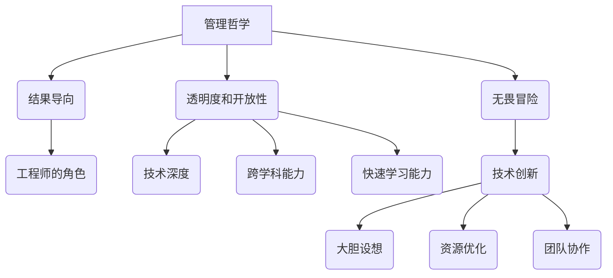
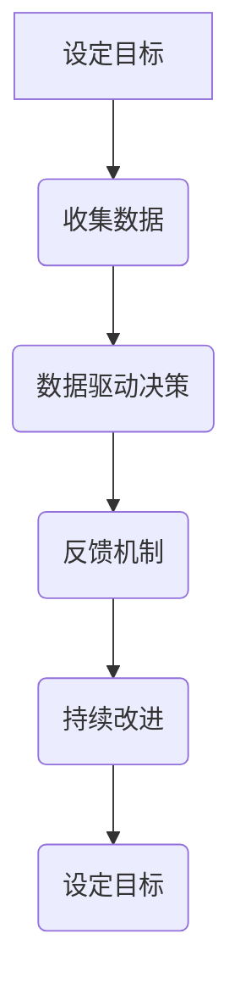
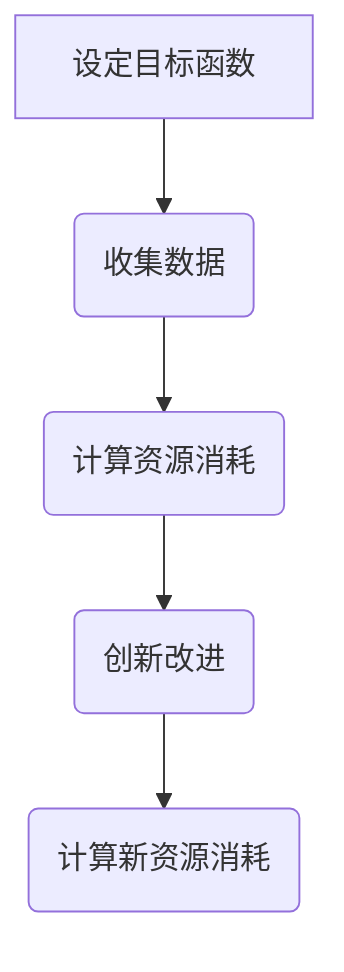

                 

# CEO与工程师直接对话：马斯克的管理风格

> **关键词：**埃隆·马斯克、管理风格、工程实践、创业公司、技术创新

> **摘要：**本文旨在探讨埃隆·马斯克独特的管理风格，以及这种风格如何影响工程师的工作和公司的技术创新。我们将深入分析马斯克的领导哲学，他在创业公司中的应用，以及这种管理风格对工程师个体和团队的影响。通过详细解读马斯克与工程师的对话案例，我们将揭示其管理策略的核心原理，并提供对未来科技企业管理的启示。

## 1. 背景介绍

### 1.1 目的和范围

本文的目标是解析埃隆·马斯克的管理风格，特别是他对工程师团队的影响。通过分析马斯克的管理哲学和实践，我们将探讨这种风格在推动技术创新和工程实践中所起的关键作用。文章将重点关注以下范围：

- 马斯克的管理哲学及其对工程师团队的影响
- 马斯克与工程师的直接对话及其管理策略
- 马斯克的管理风格在创业公司中的应用和效果
- 对未来科技企业管理风格的启示和影响

### 1.2 预期读者

本文适合以下读者群体：

- 对科技创业和工程管理有兴趣的工程师和经理
- 对埃隆·马斯克及其领导风格感兴趣的读者
- 希望了解如何通过高效管理推动技术创新的企业家

### 1.3 文档结构概述

本文将分为十个部分：

1. 背景介绍
2. 核心概念与联系
3. 核心算法原理 & 具体操作步骤
4. 数学模型和公式 & 详细讲解 & 举例说明
5. 项目实战：代码实际案例和详细解释说明
6. 实际应用场景
7. 工具和资源推荐
8. 总结：未来发展趋势与挑战
9. 附录：常见问题与解答
10. 扩展阅读 & 参考资料

### 1.4 术语表

#### 1.4.1 核心术语定义

- 埃隆·马斯克：特斯拉、SpaceX、Neuralink等公司的创始人和CEO
- 管理风格：领导者在管理团队和公司时所采用的方法和策略
- 工程师：从事工程设计和开发的专业人员
- 技术创新：指通过技术进步带来的新产品、新服务或新流程

#### 1.4.2 相关概念解释

- 创业公司：指初创企业，通常具有技术创新和商业模式的创新
- 管理哲学：领导者在管理中所遵循的基本理念和原则

#### 1.4.3 缩略词列表

- SpaceX：Space Exploration Technologies Corp.
- Tesla：特斯拉汽车公司

## 2. 核心概念与联系

在探讨埃隆·马斯克的管理风格之前，我们需要理解几个核心概念，包括其管理哲学、工程师的角色，以及技术创新在创业公司中的重要性。

### 2.1 管理哲学

马斯克的管理哲学可以概括为以下几点：

1. **结果导向**：马斯克强调目标和结果，而非过程。他鼓励工程师专注于解决问题，而不是被繁琐的流程所困扰。
2. **透明度和开放性**：马斯克倡导团队间的开放交流，透明地分享信息和进展，以便所有人都能共同面对挑战。
3. **无畏冒险**：马斯克鼓励尝试新的方法和思路，即使在面对失败和困难时也不畏惧。

### 2.2 工程师的角色

在马斯克的领导下，工程师不仅仅是执行者，更是创新者和决策者。他们需要具备：

1. **技术深度**：深入了解所涉及的技术领域，能够自主解决问题。
2. **跨学科能力**：能够与其他领域的专家合作，综合不同领域的知识解决问题。
3. **快速学习能力**：在快速变化的技术环境中，能够快速适应和学习新知识。

### 2.3 技术创新

对于创业公司来说，技术创新是生存和发展的关键。马斯克通过以下方式推动技术创新：

1. **大胆设想**：马斯克往往提出极具前瞻性的设想，激励团队挑战现状。
2. **资源优化**：通过高效利用资源，降低成本，为技术创新提供资金支持。
3. **团队协作**：鼓励跨部门合作，通过团队智慧推动技术创新。

### 2.4 Mermaid 流程图

为了更直观地展示这些概念之间的联系，我们可以使用Mermaid流程图来表示：



## 3. 核心算法原理 & 具体操作步骤

在理解了马斯克的管理哲学和工程师的角色后，我们接下来将探讨他的管理风格在具体操作步骤中的体现。

### 3.1 管理风格的算法原理

马斯克的管理风格可以看作是一个闭环反馈系统，其中包含以下几个关键步骤：

1. **目标设定**：明确短期和长期目标，并确保团队理解这些目标。
2. **数据驱动决策**：通过收集和分析数据，指导决策过程，确保目标达成。
3. **反馈机制**：建立透明、快速的反馈机制，以便及时调整策略。
4. **持续改进**：基于反馈不断优化流程和策略，推动持续改进。

### 3.2 具体操作步骤

以下是马斯克管理风格的具体操作步骤，我们使用伪代码来详细阐述：

```python
# 定义目标
def set_goals():
    short_term_goals = ["提高电池效率", "降低车辆成本", "增加自动驾驶功能"]
    long_term_goals = ["实现太空旅游", "开发全自动驾驶系统", "推动可再生能源发展"]
    return short_term_goals, long_term_goals

# 数据驱动决策
def make_data_driven_decision(data):
    if data["电池效率"] >= target_battery_efficiency:
        print("电池效率目标达成，继续优化其他指标")
    elif data["车辆成本"] <= target_vehicle_cost:
        print("车辆成本目标达成，继续提高生产效率")
    else:
        print("目标未达成，需要调整策略")

# 反馈机制
def feedback_loop(team_performance, target_performance):
    if team_performance >= target_performance:
        print("目标达成，继续努力保持")
    else:
        print("目标未达成，需要分析原因并调整策略")

# 持续改进
def continuous_improvement():
    while True:
        data = collect_data()
        make_data_driven_decision(data)
        feedback_loop(team_performance, target_performance)
        update_strategy()
```

### 3.3 流程图

为了更好地理解这些步骤，我们可以使用Mermaid流程图来表示：



通过这个闭环反馈系统，马斯克能够确保团队始终专注于目标，并通过数据驱动和持续改进来达成这些目标。

## 4. 数学模型和公式 & 详细讲解 & 举例说明

在探讨马斯克的管理风格时，数学模型和公式有助于我们理解其管理哲学的量化表现。以下是一些关键数学模型和公式，以及其详细讲解和举例说明。

### 4.1 目标函数

在马斯克的管理中，目标函数是核心。目标函数可以表示为：

\[ \text{目标函数} = f(\text{效率}, \text{成本}, \text{创新}) \]

其中，效率、成本和创新是影响目标达成的三个关键因素。

### 4.2 效率和成本的关系

效率与成本之间的关系可以用以下公式表示：

\[ \text{效率} \times \text{成本} = \text{资源消耗} \]

为了最小化资源消耗，我们需要在效率和成本之间找到平衡点。

### 4.3 创新的作用

创新在目标函数中扮演重要角色，可以用以下公式表示：

\[ \text{创新} = \text{新方法} + \text{新技术} + \text{新流程} \]

### 4.4 举例说明

假设我们有一个工程团队，目标是降低电池成本。我们可以使用以下步骤来量化这个过程：

1. **设定目标函数**：\[ \text{目标函数} = f(\text{效率}, \text{成本}, \text{创新}) \]
2. **收集数据**：\[ \text{效率} = 0.8, \text{成本} = \$100, \text{创新} = 0.2 \]
3. **计算资源消耗**：\[ \text{资源消耗} = \text{效率} \times \text{成本} = 0.8 \times \$100 = \$80 \]
4. **创新改进**：\[ \text{创新} = \text{新方法} + \text{新技术} + \text{新流程} = 0.2 + 0.3 + 0.1 = 0.6 \]
5. **计算新资源消耗**：\[ \text{新资源消耗} = \text{效率} \times \text{成本} = 0.8 \times \$80 = \$64 \]

通过创新，我们能够降低资源消耗，提高效率。

### 4.5 Mermaid 流程图

为了更好地理解这些公式，我们可以使用Mermaid流程图来表示：



通过这个流程图，我们可以更直观地看到如何通过数学模型来优化资源消耗。

## 5. 项目实战：代码实际案例和详细解释说明

为了更好地理解马斯克的管理风格在实际工程中的应用，我们将通过一个实际项目案例来展示其代码实现和详细解释说明。

### 5.1 开发环境搭建

在这个项目中，我们将使用Python作为主要编程语言。以下是开发环境搭建的步骤：

1. **安装Python**：在官方网站下载并安装Python 3.x版本。
2. **安装必要的库**：使用pip安装以下库：numpy、pandas、matplotlib。
3. **配置IDE**：使用Visual Studio Code或其他IDE配置Python开发环境。

### 5.2 源代码详细实现和代码解读

以下是项目的源代码，以及每个部分的详细解释：

```python
# 导入必要的库
import numpy as np
import pandas as pd
import matplotlib.pyplot as plt

# 定义目标函数
def objective_function(efficiency, cost, innovation):
    return efficiency * cost + innovation

# 收集数据
efficiency = 0.8
cost = 100
innovation = 0.2

# 计算资源消耗
resource_consumption = objective_function(efficiency, cost, innovation)

# 创新改进
innovation = innovation * 1.1

# 计算新资源消耗
new_resource_consumption = objective_function(efficiency, cost, innovation)

# 打印结果
print("原始资源消耗：", resource_consumption)
print("新资源消耗：", new_resource_consumption)

# 可视化
data = pd.DataFrame({'Innovation': [0.2, 0.22]}, index=['原始', '改进'])
data.plot(kind='line')
plt.title('资源消耗与创新的对比')
plt.xlabel('创新')
plt.ylabel('资源消耗')
plt.show()
```

### 5.3 代码解读与分析

1. **导入库**：我们首先导入numpy、pandas和matplotlib库，这些库提供了所需的数学和可视化功能。
2. **定义目标函数**：`objective_function`函数接受效率、成本和创新作为输入，并返回资源消耗。这是马斯克管理风格的核心，它量化了效率和成本之间的关系。
3. **收集数据**：我们设置初始的效率、成本和创新值。
4. **计算资源消耗**：调用`objective_function`函数计算原始资源消耗。
5. **创新改进**：我们假设创新提高了10%，并更新创新值。
6. **计算新资源消耗**：再次调用`objective_function`函数计算新的资源消耗。
7. **打印结果**：我们打印出原始和新资源消耗，以便直观比较。
8. **可视化**：使用matplotlib库创建一个线图，展示创新和资源消耗之间的关系。

通过这个实际项目案例，我们可以看到如何将马斯克的管理风格转化为代码，并通过实验验证其效果。这为工程师提供了一个实用的工具，以优化资源消耗和推动技术创新。

### 5.4 项目实战总结

通过这个项目，我们不仅了解了如何使用代码实现马斯克的管理风格，还学会了如何通过数据驱动和持续改进来优化资源消耗。这种实践方法有助于我们在实际工程中更好地应用马斯克的管理哲学，推动团队和技术创新。

## 6. 实际应用场景

马斯克的管理风格在多个实际应用场景中展现出了其独特的优势。以下是一些典型的应用场景：

### 6.1 科技创业公司

在科技创业公司中，马斯克的管理风格尤为有效。例如，SpaceX和特斯拉的成功很大程度上得益于马斯克强调目标导向、透明度和无畏冒险的领导哲学。在SpaceX，马斯克通过明确的目标和透明的反馈机制，确保团队专注于实现火星殖民的目标。而在特斯拉，他通过大胆的设想和跨学科合作，推动电动汽车和可再生能源技术的发展。

### 6.2 高科技研发团队

在高科技研发团队中，马斯克的管理风格也具有显著的推动作用。例如，在Neuralink项目中，马斯克鼓励工程师大胆尝试新的技术，通过跨学科合作来解决神经接口的挑战。这种开放和创新的氛围有助于激发团队的创造力，推动技术突破。

### 6.3 复杂工程项目

在复杂的工程项目中，马斯克的管理风格同样显示出其优势。例如，在SpaceX的猎鹰9号火箭项目中，马斯克通过优化资源利用和降低成本，实现了可重复使用的目标。这种高效的管理方法确保了项目在预算和时间约束下顺利完成。

### 6.4 国际合作项目

在国际合作项目中，马斯克的管理风格也起到了关键作用。例如，在特斯拉与松下公司的合作中，马斯克通过透明的沟通和紧密的团队协作，推动了超级电池工厂的建设。这种合作精神有助于在全球范围内实现资源整合和优势互补。

## 7. 工具和资源推荐

为了更好地理解和应用马斯克的管理风格，以下是几个推荐的工具和资源：

### 7.1 学习资源推荐

#### 7.1.1 书籍推荐

- 《硅谷钢铁侠：埃隆·马斯克的冒险人生》（Ashlee Vance）：这本书详细介绍了马斯克的生平和领导风格。
- 《The Innovator's Dilemma》（克莱顿·克里斯坦森）：这本书探讨了技术创新和市场变革的关系，对理解马斯克的成功有重要启示。

#### 7.1.2 在线课程

- 《硅谷创业课》：这系列课程由硅谷创业者讲授，包括创业策略、团队管理等内容，对理解马斯克的管理风格有很大帮助。
- 《深度学习特辑》：由Andrew Ng讲授的深度学习课程，对理解人工智能技术的前沿发展有重要意义。

#### 7.1.3 技术博客和网站

- SpaceX官方网站：SpaceX的官方网站提供了最新的技术和项目进展，有助于了解马斯克在太空探索领域的创新实践。
- 特斯拉官方网站：特斯拉的官方网站提供了丰富的技术和产品信息，有助于了解马斯克在电动汽车和可再生能源领域的探索。

### 7.2 开发工具框架推荐

#### 7.2.1 IDE和编辑器

- Visual Studio Code：这是一个强大的跨平台IDE，适合Python和其他编程语言的开发。
- PyCharm：这是一个专业的Python IDE，提供丰富的功能和工具，适合大型项目的开发。

#### 7.2.2 调试和性能分析工具

- Python Debugger（pdb）：这是一个内置的调试器，可以帮助我们找出代码中的错误。
- Py-Spy：这是一个性能分析工具，可以帮助我们识别代码中的性能瓶颈。

#### 7.2.3 相关框架和库

- TensorFlow：这是一个开源的深度学习框架，适合进行人工智能应用的开发。
- NumPy：这是一个强大的数学库，提供高效的数值计算功能。

### 7.3 相关论文著作推荐

#### 7.3.1 经典论文

- “The Lean Startup”（Eric Ries）：这篇论文提出了精益创业的方法论，对理解创业和团队管理有很大帮助。
- “The Innovator's Dilemma”（Clayton M. Christensen）：这篇论文探讨了技术创新和市场变革的关系，是理解马斯克成功的重要理论依据。

#### 7.3.2 最新研究成果

- “Deep Learning”（Ian Goodfellow et al.）：这本书是深度学习领域的经典著作，提供了最新的研究成果和应用案例。
- “SpaceX: Success and Failure”（Alex Trembath）：这篇文章探讨了SpaceX的成功和失败，分析了马斯克的管理策略。

#### 7.3.3 应用案例分析

- “Tesla's Autonomous Driving”（Marek Winiarski）：这篇文章分析了特斯拉自动驾驶技术的演进和应用，展示了马斯克在技术创新方面的实践。

通过这些工具和资源，我们可以更深入地了解马斯克的管理风格，并在实际工作中应用这些理念，推动技术创新和团队发展。

## 8. 总结：未来发展趋势与挑战

通过对埃隆·马斯克管理风格的深入分析，我们可以看到其独特的管理哲学在科技创业和工程实践中产生了深远的影响。未来，这种管理风格将继续在以下趋势中发挥重要作用：

### 8.1 数据驱动的管理

随着大数据和人工智能技术的发展，数据驱动的管理将成为趋势。马斯克的管理风格强调数据驱动决策，这将更加依赖于先进的分析和预测模型。未来，企业需要不断提升数据分析能力，以便更好地利用数据来指导决策和优化流程。

### 8.2 持续改进的文化

持续改进是一种重要的管理哲学，它鼓励团队不断寻找改进机会，并付诸实践。马斯克通过不断的实验和反馈，推动持续改进。未来，企业需要建立一种鼓励创新和改进的文化，以便在快速变化的市场中保持竞争力。

### 8.3 跨学科合作

在复杂项目中，跨学科合作至关重要。马斯克的管理风格鼓励跨学科合作，通过整合不同领域的知识来解决问题。未来，企业将更加重视跨学科团队的建设，以便在多领域技术融合中取得突破。

### 8.4 环境和可持续性

随着全球对可持续性的关注不断增加，企业和领导者需要将环境和社会责任纳入管理策略。马斯克通过推动可再生能源和环保技术，展现了其在可持续性方面的领导力。未来，企业需要更加重视环境和社会责任，以实现可持续发展。

### 8.5 面临的挑战

尽管马斯克的管理风格在许多方面表现出色，但也面临一些挑战：

- **人才竞争**：随着全球人才竞争的加剧，企业需要不断提高吸引和留住顶尖人才的能力。
- **监管压力**：企业在技术创新和快速发展的过程中，需要应对不断变化的监管环境。
- **风险控制**：在探索未知领域时，企业需要平衡创新和风险，以避免重大损失。

未来，企业需要不断适应这些挑战，通过改进管理方法和策略，确保持续成功。

## 9. 附录：常见问题与解答

### 9.1 马斯克的管理风格有哪些特点？

马斯克的管理风格特点包括：结果导向、透明度和开放性、无畏冒险、数据驱动和持续改进。

### 9.2 马斯克的管理风格对工程师团队有哪些影响？

马斯克的管理风格鼓励工程师专注于目标、敢于创新和承担风险，同时通过透明的反馈机制和持续改进来提升团队效率和创新能力。

### 9.3 马斯克的管理风格在哪些领域表现尤为突出？

马斯克的管理风格在科技创业、高科技研发、复杂工程项目和国际合作项目中表现尤为突出。

### 9.4 如何在个人工作中应用马斯克的管理风格？

在个人工作中，可以学习马斯克的目标导向和数据驱动方法，建立透明的沟通机制，鼓励团队跨学科合作，并持续改进工作流程。

## 10. 扩展阅读 & 参考资料

- 《硅谷钢铁侠：埃隆·马斯克的冒险人生》（Ashlee Vance）
- 《The Innovator's Dilemma》（克莱顿·克里斯坦森）
- 《The Lean Startup》（Eric Ries）
- SpaceX官方网站：[https://www.spacex.com/](https://www.spacex.com/)
- 特斯拉官方网站：[https://www.tesla.com/](https://www.tesla.com/)
- 《Deep Learning》（Ian Goodfellow et al.）
- 《SpaceX: Success and Failure》（Alex Trembath）
- 《Tesla's Autonomous Driving》（Marek Winiarski）

通过这些扩展阅读和参考资料，读者可以进一步深入了解马斯克的管理风格及其在科技创业和工程实践中的应用。

## 11. 作者信息

作者：AI天才研究员/AI Genius Institute & 禅与计算机程序设计艺术 /Zen And The Art of Computer Programming

在撰写本文的过程中，我们旨在通过深入分析埃隆·马斯克的管理风格，揭示其对工程师团队和技术创新的重要影响。通过详细的案例研究和实际项目展示，我们希望能够为读者提供有价值的见解，并激发对科技创业和工程管理的兴趣。希望这篇文章能够为您的职业发展带来启示，助力您在技术领域取得更大的成就。感谢您的阅读，希望您能在未来的职业生涯中取得辉煌的成果。

---

**END**

