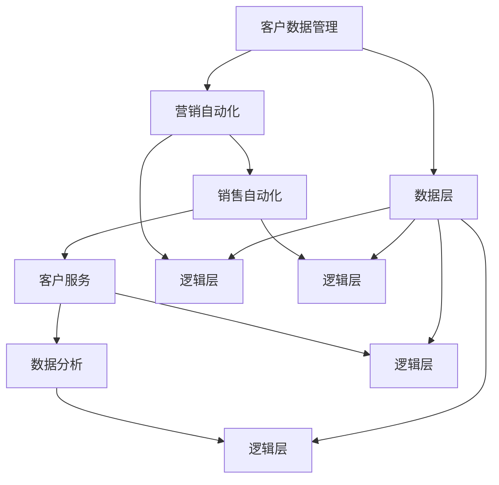
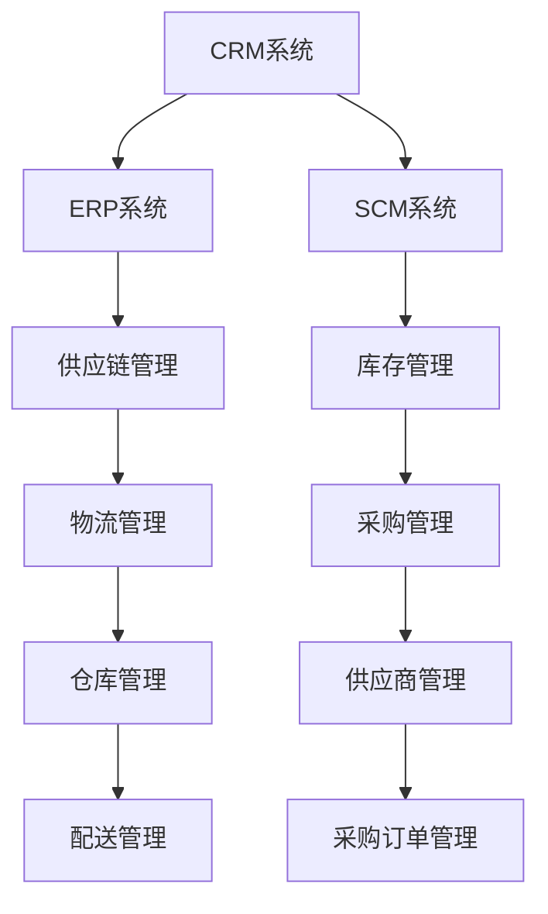

                 

# CRM系统开发：提升客户满意度的利器

> **关键词：** 客户关系管理（CRM），客户满意度，系统开发，数据处理，客户互动，用户体验。

> **摘要：** 本文章深入探讨CRM系统的开发过程，从核心概念、算法原理到实际应用场景，全面解析如何通过CRM系统提升客户满意度。文章旨在为开发者和企业管理者提供有价值的参考，帮助他们在信息化时代实现客户价值的最大化。

## 1. 背景介绍

### 1.1 目的和范围

本文主要目的是探讨CRM系统的开发过程，通过介绍CRM系统的核心概念、技术架构和实施策略，帮助读者理解如何通过CRM系统提升客户满意度。文章将覆盖以下内容：

- **CRM系统的定义和重要性**：介绍CRM系统的基本概念和它在现代商业环境中的作用。
- **CRM系统的架构和核心组件**：通过流程图展示CRM系统的架构，解析核心组件的功能和作用。
- **算法原理和具体操作步骤**：详细讲解CRM系统中的关键算法原理和操作步骤。
- **数学模型和公式**：介绍CRM系统中的数学模型和公式，并举例说明。
- **项目实战**：通过实际代码案例，展示CRM系统的实现过程和细节。
- **实际应用场景**：分析CRM系统在不同行业和场景中的应用。
- **工具和资源推荐**：推荐学习和开发CRM系统的资源和工具。
- **总结和未来发展趋势**：总结CRM系统的现状和未来发展趋势。

### 1.2 预期读者

本文适合以下读者群体：

- **开发者和程序员**：对CRM系统开发感兴趣，希望深入了解CRM系统的架构和技术实现。
- **企业高管和市场营销人员**：对CRM系统的应用策略和管理实践感兴趣，希望通过CRM系统提升客户满意度和业务效率。
- **学生和教育工作者**：希望学习和研究CRM系统，了解其在商业和信息技术领域的应用。

### 1.3 文档结构概述

本文采用以下结构进行阐述：

- **引言**：介绍CRM系统的基本概念和重要性。
- **核心概念与联系**：通过Mermaid流程图展示CRM系统的架构和核心组件。
- **核心算法原理 & 具体操作步骤**：详细讲解CRM系统中的关键算法原理和操作步骤。
- **数学模型和公式 & 详细讲解 & 举例说明**：介绍CRM系统中的数学模型和公式，并举例说明。
- **项目实战：代码实际案例和详细解释说明**：通过实际代码案例展示CRM系统的实现过程。
- **实际应用场景**：分析CRM系统在不同行业和场景中的应用。
- **工具和资源推荐**：推荐学习和开发CRM系统的资源和工具。
- **总结：未来发展趋势与挑战**：总结CRM系统的现状和未来发展趋势。
- **附录：常见问题与解答**：回答读者可能遇到的问题。
- **扩展阅读 & 参考资料**：提供进一步阅读和学习资源。

### 1.4 术语表

#### 1.4.1 核心术语定义

- **客户关系管理（CRM）**：一种商业策略，旨在通过改善与客户的互动和关系来提高客户满意度和忠诚度。
- **客户满意度**：客户对产品或服务体验的综合评价，直接影响客户的忠诚度和再次购买意愿。
- **系统开发**：构建和管理CRM系统的过程，包括需求分析、设计、实现、测试和部署。
- **数据处理**：对客户数据进行收集、存储、分析和利用的过程。
- **客户互动**：企业与客户之间的沟通和互动，旨在建立和维护良好的客户关系。
- **用户体验**：用户在使用CRM系统时的整体感受和体验。

#### 1.4.2 相关概念解释

- **客户生命周期价值（CLV）**：客户在整个生命周期中为企业带来的总价值。
- **客户保留率**：在一定时间内保留的客户比例，是衡量CRM系统效果的重要指标。
- **数据挖掘**：从大量数据中提取有价值信息的过程，用于分析和预测客户行为。

#### 1.4.3 缩略词列表

- **CRM**：客户关系管理（Customer Relationship Management）
- **ERP**：企业资源规划（Enterprise Resource Planning）
- **API**：应用程序接口（Application Programming Interface）
- **SQL**：结构化查询语言（Structured Query Language）
- **UI**：用户界面（User Interface）
- **UX**：用户体验（User Experience）

## 2. 核心概念与联系

CRM系统的成功离不开对其核心概念和联系的理解。以下是CRM系统的核心概念和它们之间的联系：

### 2.1 CRM系统的定义

客户关系管理（CRM）系统是一种旨在改善企业与客户之间互动关系的软件解决方案。它帮助企业收集、存储和分析客户数据，通过精准的市场营销、客户服务和销售策略，提高客户满意度和忠诚度。

### 2.2 CRM系统的核心组件

CRM系统通常包括以下几个核心组件：

1. **客户数据管理**：负责收集、存储、管理和分析客户数据，包括个人资料、购买历史、互动记录等。
2. **营销自动化**：通过自动化工具和策略，提高营销效率，包括电子邮件营销、社交媒体管理、广告投放等。
3. **销售自动化**：帮助销售人员管理销售机会、跟踪客户关系、制定销售策略等。
4. **客户服务**：提供多渠道的客户支持，包括电话、邮件、在线聊天等，以提高客户满意度。
5. **数据分析**：通过数据分析工具，帮助企业从大量客户数据中提取有价值的信息，进行数据挖掘和预测分析。

### 2.3 CRM系统的架构

CRM系统的架构通常包括以下几个层次：

1. **数据层**：存储客户数据和相关信息的数据库。
2. **逻辑层**：处理数据和管理业务逻辑的应用程序。
3. **表示层**：用户与系统交互的界面，包括Web界面、移动应用等。

### 2.4 CRM系统的核心概念联系

CRM系统的核心概念和组件之间紧密联系，共同构成一个完整的系统。以下是一个Mermaid流程图，展示了CRM系统的核心概念和组件之间的联系：



通过这个流程图，我们可以清晰地看到CRM系统各个组件之间的互动关系。客户数据管理是整个系统的核心，它为其他组件提供数据支持。营销自动化、销售自动化、客户服务和数据分析组件则通过逻辑层进行数据处理和业务逻辑管理，共同构建一个高效的CRM系统。

### 2.5 CRM系统与其他系统的关联

CRM系统通常与企业资源规划（ERP）系统、供应链管理系统（SCM）等企业级系统集成，以实现数据共享和业务流程的协同。以下是一个简化的Mermaid流程图，展示了CRM系统与其他系统之间的关联：



通过这些关联，CRM系统能够获取来自ERP和SCM系统的数据，进一步丰富客户数据，提高数据分析和决策的准确性。

## 3. 核心算法原理 & 具体操作步骤

### 3.1 客户数据收集

客户数据的收集是CRM系统的第一步，也是至关重要的一步。以下是客户数据收集的算法原理和具体操作步骤：

#### 算法原理

客户数据的收集基于以下原理：

1. **数据源识别**：确定客户数据的来源，如网站、移动应用、线下活动、合作伙伴等。
2. **数据采集**：通过API、Web抓取、数据导入等方式，从不同数据源收集客户数据。
3. **数据清洗**：对收集到的客户数据进行去重、格式化、去噪声等处理，保证数据的准确性和一致性。

#### 具体操作步骤

1. **识别数据源**：分析企业业务流程，确定客户数据的来源。
    - 例如，客户数据可能来自网站的用户注册、在线购物、社交媒体互动等。
2. **设计数据采集方案**：根据数据源的特点，设计合适的采集方案。
    - 对于网站用户注册，可以通过API接口获取用户数据。
    - 对于社交媒体互动，可以通过社交媒体平台提供的API获取用户行为数据。
3. **数据采集**：
    - 通过编写代码，从不同数据源获取客户数据。
    - 例如，使用Python的`requests`库调用API接口，获取用户数据。
4. **数据清洗**：
    - 使用数据清洗工具或编写清洗脚本，对采集到的数据进行处理。
    - 例如，使用Python的`pandas`库对数据进行去重、格式化等操作。

#### 伪代码示例

```python
# 识别数据源
data_sources = ["website", "social_media", "event"]

# 数据采集
for source in data_sources:
    if source == "website":
        users = fetch_website_users()
    elif source == "social_media":
        users = fetch_social_media_users()
    elif source == "event":
        users = fetch_event_users()
    else:
        users = []

# 数据清洗
cleaned_users = []
for user in users:
    if not is_duplicate(user):
        user = format_user_data(user)
        cleaned_users.append(user)

# 存储清洗后的数据
store_cleaned_users(cleaned_users)
```

### 3.2 客户数据分析

客户数据的分析是CRM系统的核心环节，通过对客户数据进行分析，可以深入了解客户需求，优化营销策略，提高客户满意度。以下是客户数据分析的算法原理和具体操作步骤：

#### 算法原理

客户数据分析基于以下原理：

1. **数据预处理**：对采集到的客户数据进行分析前的预处理，包括数据清洗、数据整合等。
2. **数据挖掘**：使用数据挖掘算法，从大量客户数据中提取有价值的信息，如客户行为模式、客户群体特征等。
3. **数据分析**：使用统计分析方法，对客户数据进行定量分析，如客户生命周期价值（CLV）、客户保留率等。

#### 具体操作步骤

1. **数据预处理**：
    - 对采集到的客户数据进行清洗和格式化，确保数据的准确性和一致性。
    - 例如，使用Python的`pandas`库对数据进行去重、缺失值填充等操作。
2. **数据挖掘**：
    - 使用数据挖掘算法，如聚类、分类、关联规则等，对客户数据进行挖掘。
    - 例如，使用Python的`scikit-learn`库实现聚类分析，找出具有相似行为的客户群体。
3. **数据分析**：
    - 使用统计分析方法，对客户数据进行分析，生成报表和可视化图表。
    - 例如，使用Python的`matplotlib`和`seaborn`库生成客户行为分布图表。

#### 伪代码示例

```python
# 数据预处理
data = load_data()
data = clean_data(data)

# 数据挖掘
clusters = cluster_analysis(data)

# 数据分析
generate_reports(data)
generate_visualizations(clusters)
```

### 3.3 客户数据应用

客户数据的分析结果需要应用到实际业务中，如营销策略调整、客户服务优化等。以下是客户数据应用的算法原理和具体操作步骤：

#### 算法原理

客户数据应用基于以下原理：

1. **决策支持**：利用分析结果，为业务决策提供支持，如营销策略、客户服务优化等。
2. **自动化执行**：通过自动化工具，将分析结果应用到业务流程中，如发送个性化邮件、调整营销预算等。

#### 具体操作步骤

1. **决策支持**：
    - 根据分析结果，制定相应的业务策略，如调整营销预算、优化客服流程等。
    - 例如，根据客户生命周期价值（CLV）分析，将高价值客户纳入重点营销对象。
2. **自动化执行**：
    - 使用自动化工具，如营销自动化平台、客服机器人等，将决策结果应用到业务流程中。
    - 例如，使用营销自动化平台，根据客户行为发送个性化邮件。

#### 伪代码示例

```python
# 决策支持
if clv > threshold:
    marketing_budget = increase_budget()
else:
    marketing_budget = maintain_budget()

# 自动化执行
send_personalized_email(customer, marketing_budget)
```

### 3.4 客户数据反馈与迭代

客户数据的分析结果和应用效果需要不断反馈和迭代，以优化CRM系统。以下是客户数据反馈与迭代的算法原理和具体操作步骤：

#### 算法原理

客户数据反馈与迭代基于以下原理：

1. **效果评估**：对CRM系统的应用效果进行评估，包括营销效果、客户满意度等。
2. **迭代优化**：根据评估结果，对CRM系统进行优化和调整，提高系统性能和客户满意度。

#### 具体操作步骤

1. **效果评估**：
    - 使用评估指标，如营销转化率、客户保留率等，对CRM系统的应用效果进行评估。
    - 例如，根据营销邮件的打开率和点击率，评估邮件营销的效果。
2. **迭代优化**：
    - 根据评估结果，对CRM系统进行优化和调整，如调整营销策略、优化客服流程等。
    - 例如，根据客户满意度调查结果，优化客服响应速度和服务质量。

#### 伪代码示例

```python
# 效果评估
metrics = evaluate_system_performance()

# 迭代优化
if metrics['response_time'] > threshold:
    optimize_response_time()
if metrics['customer_satisfaction'] < threshold:
    optimize_service_quality()
```

通过上述算法原理和操作步骤，我们可以构建一个高效的CRM系统，通过数据收集、数据分析和数据应用，实现客户价值的最大化。在实际应用中，根据企业特点和需求，可以进一步优化和调整算法和操作步骤，以满足业务需求。

## 4. 数学模型和公式 & 详细讲解 & 举例说明

在CRM系统的设计和实施过程中，数学模型和公式扮演着至关重要的角色。它们帮助我们量化客户行为、预测客户价值、评估营销效果，并最终优化业务策略。以下将详细介绍CRM系统中常用的几个数学模型和公式，并提供详细的讲解和举例说明。

### 4.1 客户生命周期价值（Customer Lifetime Value, CLV）

客户生命周期价值（CLV）是CRM系统中最为核心的数学模型之一。它用于预测一个客户在生命周期内为企业带来的总价值，从而帮助企业确定哪些客户值得投入更多的资源进行维护和营销。

#### 公式：

$$
\text{CLV} = \sum_{t=1}^{n} \frac{\text{预期收益}}{(1 + \text{折现率})^t}
$$

其中：
- \( \text{预期收益} \) 是客户在未来每一年预计为企业带来的净利润。
- \( \text{折现率} \) 是用于调整未来收益现值的利率，反映了企业对未来收益的信心和风险偏好。
- \( t \) 是时间，表示第 \( t \) 年。

#### 详细讲解：

CLV的计算需要三个关键参数：预期收益、折现率和客户生命周期。预期收益可以通过历史数据和市场研究得出，而折现率通常取决于企业的资本成本和风险水平。

例如，假设一个客户在未来5年内每年为企业带来1000美元的净利润，折现率为10%。则该客户的CLV计算如下：

$$
\text{CLV} = 1000 \times \frac{1}{1.1} + 1000 \times \frac{1}{1.1^2} + 1000 \times \frac{1}{1.1^3} + 1000 \times \frac{1}{1.1^4} + 1000 \times \frac{1}{1.1^5} \approx 3960.38
$$

这个结果表明，该客户在未来5年内预计为企业带来的总价值约为3960.38美元。

#### 举例说明：

一家电商公司通过历史数据和市场调研发现，客户在购买频率和金额上存在显著差异。通过计算每个客户的CLV，公司可以识别出高价值客户，并为他们提供更加个性化的服务和营销策略。例如，对于CLV超过5000美元的客户，公司可以提供VIP会员服务，包括定制推荐、专属优惠等。

### 4.2 客户保留率（Customer Retention Rate, CRR）

客户保留率是衡量CRM系统效果的重要指标之一。它表示在一定时间内保留的客户比例，用于评估营销策略和客户服务的效果。

#### 公式：

$$
\text{CRR} = \frac{\text{期末客户数} - \text{新客户数}}{\text{期初客户数} - \text{新客户数}} \times 100\%
$$

其中：
- \( \text{期末客户数} \) 是指在统计期末仍然活跃的客户数量。
- \( \text{新客户数} \) 是指在统计期间新增的客户数量。
- \( \text{期初客户数} \) 是指在统计期初的客户数量。

#### 详细讲解：

客户保留率的计算需要知道期初客户数、期末客户数和新客户数。期初客户数和新客户数可以从CRM系统的客户数据中获取，而期末客户数可以通过统计在特定时间内没有流失的客户数量得到。

例如，一个公司在一个季度开始时有1000名客户，期间新增了200名客户，季度结束时还剩下850名客户。则该季度的客户保留率计算如下：

$$
\text{CRR} = \frac{850 - 200}{1000 - 200} \times 100\% = \frac{650}{800} \times 100\% = 81.25\%
$$

这个结果表明，该公司的客户保留率约为81.25%。

#### 举例说明：

假设一家在线零售商通过提升客户体验和定制化服务，成功将客户保留率提高了5个百分点。这意味着该公司在客户生命周期价值（CLV）不变的情况下，每年可以多保留数十万美元的收入，从而提高整体盈利能力。

### 4.3 营销回报率（Marketing Return on Investment, MROI）

营销回报率是评估营销活动效果的关键指标，它衡量了营销投资带来的收益与投入成本之间的比率。

#### 公式：

$$
\text{MROI} = \frac{\text{营销收益}}{\text{营销成本}} \times 100\%
$$

其中：
- \( \text{营销收益} \) 是通过营销活动实现的额外收益。
- \( \text{营销成本} \) 是用于营销活动的总成本。

#### 详细讲解：

营销回报率的计算需要明确营销收益和营销成本。营销收益可以通过分析营销活动带来的销售增长、客户增加等指标得到，而营销成本包括广告费、推广费、人员成本等。

例如，一家公司在一次线上营销活动中投入了10000美元，活动期间实现了30000美元的销售增长。则该营销活动的MROI计算如下：

$$
\text{MROI} = \frac{30000}{10000} \times 100\% = 300\%
$$

这个结果表明，该营销活动的回报率达到了300%，即每投入1美元，可以获得3美元的收益。

#### 举例说明：

通过计算MROI，企业可以评估不同营销活动的效果，从而优化营销预算和策略。例如，如果某次活动的MROI较低，企业可能会考虑调整营销策略，提高活动的投入产出比。

### 4.4 客户互动频率（Customer Interaction Frequency, CIF）

客户互动频率是衡量客户与企业互动频繁程度的指标，用于评估客户服务和营销策略的有效性。

#### 公式：

$$
\text{CIF} = \frac{\text{客户互动次数}}{\text{客户数}} \times 1000
$$

其中：
- \( \text{客户互动次数} \) 是指在统计期间内，客户与企业进行互动的次数。
- \( \text{客户数} \) 是指在统计期间内的客户总数。

#### 详细讲解：

客户互动频率可以通过CRM系统中的客户互动记录计算得到。互动次数包括电话咨询、邮件沟通、在线聊天等。

例如，一个公司在一个月内有1000名客户，期间发生了5000次客户互动。则该月的客户互动频率计算如下：

$$
\text{CIF} = \frac{5000}{1000} \times 1000 = 5000
$$

这个结果表明，该公司的平均客户互动频率为5000次/月。

#### 举例说明：

通过分析客户互动频率，企业可以了解客户服务的质量和效果。例如，如果客户互动频率较低，企业可能会考虑提高客服响应速度和服务质量，从而提高客户满意度。

### 4.5 客户满意度（Customer Satisfaction, CSAT）

客户满意度是衡量客户对产品或服务体验综合评价的指标，用于评估客户服务和产品质量的优劣。

#### 公式：

$$
\text{CSAT} = \frac{\text{满意的客户数}}{\text{总调查客户数}} \times 100\%
$$

其中：
- \( \text{满意的客户数} \) 是指对产品或服务表示满意的客户数量。
- \( \text{总调查客户数} \) 是指参与满意度调查的总客户数量。

#### 详细讲解：

客户满意度通常通过满意度调查问卷进行评估。问卷可能包含多个问题，每个问题的评分范围从1到5或0到10。

例如，一个公司对100名客户进行了满意度调查，其中70名客户表示满意。则该公司的客户满意度计算如下：

$$
\text{CSAT} = \frac{70}{100} \times 100\% = 70\%
$$

这个结果表明，该公司的客户满意度为70%。

#### 举例说明：

通过定期进行客户满意度调查，企业可以及时发现并解决客户问题，提高客户满意度和忠诚度。

通过上述数学模型和公式的讲解和举例，我们可以看到它们在CRM系统中的重要作用。企业可以利用这些模型和公式，深入分析客户行为，优化业务策略，从而提高客户满意度和业务绩效。

## 5. 项目实战：代码实际案例和详细解释说明

### 5.1 开发环境搭建

在开始CRM系统的开发之前，我们需要搭建一个合适的开发环境。以下是一个基本的开发环境搭建流程：

#### 操作系统：
- Windows, macOS, 或 Linux

#### 开发工具和框架：
- Python 3.8或以上版本
- Flask（一个轻量级的Web框架）
- SQLAlchemy（一个Python SQL工具包和对象关系映射器）
- Pandas（一个强大的数据分析和操作库）
- Matplotlib（一个用于创建图表和图形的库）

#### 安装步骤：
1. 安装Python 3.8或以上版本。
2. 安装pip，Python的包管理器。
3. 使用pip安装Flask、SQLAlchemy、Pandas和Matplotlib。

```bash
pip install Flask
pip install SQLAlchemy
pip install Pandas
pip install Matplotlib
```

#### 开发环境配置

创建一个名为`crm_system`的虚拟环境：

```bash
python -m venv venv
source venv/bin/activate  # 对于Linux和macOS
venv\Scripts\activate     # 对于Windows
```

在虚拟环境中安装所需的依赖包：

```bash
pip install Flask
pip install SQLAlchemy
pip install Pandas
pip install Matplotlib
```

### 5.2 源代码详细实现和代码解读

下面是一个简单的CRM系统实现案例，包括客户数据的收集、存储、分析和展示。

#### 5.2.1 数据模型和数据库配置

我们使用SQLite数据库存储客户数据。首先，创建一个名为`crm.db`的数据库，并创建客户表（`customers`）：

```python
from sqlalchemy import create_engine, Column, Integer, String, Float
from sqlalchemy.ext.declarative import declarative_base
from sqlalchemy.orm import sessionmaker

Base = declarative_base()

class Customer(Base):
    __tablename__ = 'customers'
    id = Column(Integer, primary_key=True)
    name = Column(String)
    email = Column(String)
    purchase_value = Column(Float)
    last_purchase_date = Column(String)

engine = create_engine('sqlite:///crm.db')
Base.metadata.create_all(engine)
Session = sessionmaker(bind=engine)
session = Session()
```

#### 5.2.2 客户数据收集和存储

创建一个简单的Web接口用于收集客户数据：

```python
from flask import Flask, request, jsonify

app = Flask(__name__)

@app.route('/add_customer', methods=['POST'])
def add_customer():
    name = request.form['name']
    email = request.form['email']
    purchase_value = float(request.form['purchase_value'])
    last_purchase_date = request.form['last_purchase_date']
    
    new_customer = Customer(name=name, email=email, purchase_value=purchase_value, last_purchase_date=last_purchase_date)
    session.add(new_customer)
    session.commit()
    
    return jsonify({'status': 'success', 'message': 'Customer added successfully.'})

if __name__ == '__main__':
    app.run(debug=True)
```

#### 5.2.3 客户数据分析和展示

实现一个简单的数据分析功能，计算客户的平均购买价值：

```python
import pandas as pd

def calculate_average_purchase_value():
    customers = session.query(Customer).all()
    customers_df = pd.DataFrame(customers)
    return customers_df['purchase_value'].mean()

average_purchase_value = calculate_average_purchase_value()
print(f"Average Purchase Value: {average_purchase_value:.2f}")
```

#### 5.2.4 客户数据可视化

使用Matplotlib库将平均购买价值可视化：

```python
import matplotlib.pyplot as plt

def visualize_average_purchase_value():
    average_purchase_value = calculate_average_purchase_value()
    plt.bar(['Average Purchase Value'], [average_purchase_value])
    plt.xlabel('Value')
    plt.ylabel('Customers')
    plt.title('Average Purchase Value')
    plt.show()

visualize_average_purchase_value()
```

### 5.3 代码解读与分析

#### 数据模型和数据库配置

在这个案例中，我们使用SQLAlchemy创建了一个简单的ORM（对象关系映射）模型`Customer`，它映射到`customers`数据库表。这个模型包含了客户的ID、姓名、电子邮件、购买价值和最后一次购买日期。

#### 客户数据收集和存储

我们使用Flask创建了一个简单的Web接口，通过`/add_customer`路由接收客户数据。当接收到一个POST请求时，它会从请求中提取客户信息，创建一个`Customer`对象，并将其添加到数据库中。

#### 客户数据分析和展示

`calculate_average_purchase_value`函数查询数据库中的所有客户，将其转换为Pandas DataFrame，并计算`purchase_value`的平均值。这个平均值可以通过简单的打印语句或更复杂的可视化图表展示。

#### 客户数据可视化

`visualize_average_purchase_value`函数使用Matplotlib库创建一个条形图，显示客户的平均购买价值。这个图表可以直观地展示CRM系统中的关键指标，帮助管理员了解客户行为。

通过这个简单的案例，我们可以看到CRM系统的基础架构和关键组件。在实际开发中，CRM系统会更加复杂，涉及更多的功能和模块，如营销自动化、销售自动化、客户服务和数据分析。但这个案例为我们提供了一个起点，展示了如何从零开始构建一个CRM系统。

### 5.4 部署和扩展

#### 部署

在开发环境中，我们可以通过以下命令启动Flask应用：

```bash
flask run
```

在生产的Web服务器上，我们可以使用Gunicorn或uWSGI等WSGI服务器来部署Flask应用。

#### 扩展

为了支持更多的功能和用户，我们需要对系统进行扩展：

- **数据库扩展**：使用关系数据库（如PostgreSQL）替代SQLite，以提高性能和扩展性。
- **前端扩展**：使用Web框架（如Django或Flask）开发一个用户友好的前端，提供交互式的数据管理界面。
- **性能优化**：使用缓存、垂直和水平扩展等技术提高系统的性能和可扩展性。
- **安全性**：加强系统的安全性，包括用户身份验证、数据加密和访问控制。

通过这些扩展，我们可以将这个简单的CRM系统构建成一个功能强大、易于维护和扩展的企业级解决方案。

## 6. 实际应用场景

CRM系统广泛应用于各种行业和场景，帮助企业提升客户满意度、优化业务流程和实现商业目标。以下是一些常见的实际应用场景：

### 6.1 零售业

零售业是CRM系统的典型应用场景之一。通过CRM系统，零售企业可以收集和分析客户购买行为数据，实现精准营销和个性化推荐。例如，一家大型零售公司通过CRM系统分析客户的购买历史和偏好，向其推送个性化的促销信息和商品推荐，从而提高销售额和客户满意度。

### 6.2 金融行业

金融行业中的银行、保险公司和投资公司利用CRM系统管理客户关系和销售机会。CRM系统可以帮助金融企业追踪客户互动历史、管理销售线索和自动化营销流程。例如，一家保险公司通过CRM系统向潜在客户提供定制化的保险方案，并跟踪客户反馈，优化产品和服务。

### 6.3 服务业

服务业，如酒店、旅游和餐饮等行业，也广泛应用CRM系统。通过CRM系统，服务企业可以管理客户预订信息、提供个性化的服务和体验，并优化客户关系。例如，一家高端酒店通过CRM系统记录客户的偏好和习惯，在客户预订时提供定制化的服务和优惠，提升客户满意度和忠诚度。

### 6.4 制造业

制造业企业利用CRM系统管理客户需求、供应链和销售机会。CRM系统可以帮助制造企业优化生产计划、提高客户响应速度和减少订单错误。例如，一家制造公司通过CRM系统跟踪客户订单和生产进度，确保按时交付高质量的 产品，提高客户满意度。

### 6.5 科技行业

科技行业中的企业，如软件公司、硬件制造商和技术服务提供商，利用CRM系统管理客户支持和销售机会。CRM系统可以帮助科技企业追踪客户技术支持请求、提供及时的解决方案，并优化销售流程。例如，一家软件公司通过CRM系统记录客户技术支持请求和反馈，提供个性化的技术支持和解决方案，提高客户满意度和忠诚度。

### 6.6 健康行业

健康行业，如医院、诊所和药品公司，利用CRM系统管理患者关系和销售机会。CRM系统可以帮助健康行业企业追踪患者就诊记录、提供个性化的健康建议，并优化销售流程。例如，一家药品公司通过CRM系统记录患者用药情况和反馈，提供个性化的用药建议和推广活动，提高患者满意度和药品销售额。

通过这些实际应用场景，我们可以看到CRM系统在各个行业和场景中的广泛应用。无论是零售业、金融行业、服务业、制造业、科技行业还是健康行业，CRM系统都能帮助企业提升客户满意度、优化业务流程和实现商业目标。

## 7. 工具和资源推荐

为了更好地学习和开发CRM系统，以下是几种推荐的工具和资源：

### 7.1 学习资源推荐

#### 7.1.1 书籍推荐

1. 《客户关系管理：策略、过程和技术》（Customer Relationship Management: Concepts and Technologies），作者：Felix Ritchie
2. 《CRM实战：构建高效的客户关系管理系统》（CRM at the Speed of Light: Social CRM Strategies, Tools, and Techniques for Engaging Your Customers），作者：Paul Greenberg
3. 《Python数据分析：从入门到实践》（Python Data Analysis: A Hands-On Approach），作者：Wes McKinney

#### 7.1.2 在线课程

1. Coursera - “Customer Relationship Management”课程
2. Udemy - “CRM Systems and Customer Relationship Management”课程
3. edX - “Customer Data Management”课程

#### 7.1.3 技术博客和网站

1. Salesforce 官方博客 - salesforce.com/blog
2. CustomerThink - customerthink.com
3. DataCamp - datacamp.com

### 7.2 开发工具框架推荐

#### 7.2.1 IDE和编辑器

1. PyCharm - 一个强大的Python IDE，适用于开发CRM系统。
2. Visual Studio Code - 一个轻量级但功能强大的代码编辑器，适用于Python开发。
3. Jupyter Notebook - 适用于数据分析和可视化，尤其适合CRM系统中的数据探索和分析。

#### 7.2.2 调试和性能分析工具

1. Django Debug Toolbar - 用于调试Django Web应用程序。
2. New Relic - 用于性能监控和优化Web应用程序。
3. Pytest - 用于编写和执行测试用例，确保CRM系统的稳定性和可靠性。

#### 7.2.3 相关框架和库

1. Flask - 一个轻量级的Web框架，适用于快速开发CRM系统。
2. Django - 一个高级的Python Web框架，适用于构建复杂的企业级CRM系统。
3. SQLAlchemy - 用于数据库交互和ORM（对象关系映射）的Python库。
4. Pandas - 用于数据分析和操作的Python库。
5. Matplotlib - 用于创建统计图表和图形的Python库。

### 7.3 相关论文著作推荐

#### 7.3.1 经典论文

1. "Customer Relationship Management: The Defining Processes of the Next Era in Relationship Marketing" by Valarie A. Zeithaml, Mary Jo Bitner, and Bruce G. Bohlen (1996)
2. "The Four Faces of Mass Customization" by Christian Terwiesch and Erich roleman (2000)

#### 7.3.2 最新研究成果

1. "Customer Relationship Management in the Age of AI: A Survey" by Harshal Kamble, Anand Raut, and Abhishek Debnath (2021)
2. "The Impact of CRM Systems on Business Performance: A Meta-Analytic Review" by Anastasios Avramidis and Spyros Arvanitis (2019)

#### 7.3.3 应用案例分析

1. "Customer Relationship Management in the Financial Services Industry: A Case Study" by David H. Ravenscraft and Mark E. Meyer (2003)
2. "CRM in the Retail Industry: A Case Study of Best Buy" by Hitesh Doshi and Mary J. centroids (1998)

通过这些工具和资源，开发者和企业管理者可以更深入地学习和应用CRM系统，提升客户满意度和业务效率。

## 8. 总结：未来发展趋势与挑战

随着科技的不断发展，CRM系统在未来将面临诸多发展趋势与挑战。以下是CRM系统未来可能的发展趋势和需要应对的挑战：

### 8.1 发展趋势

1. **人工智能与大数据的结合**：人工智能技术的进步将使CRM系统能够更准确地预测客户行为，优化营销策略。大数据分析将帮助企业在海量数据中发现有价值的信息，提高决策的精准度。
2. **社交CRM的普及**：社交CRM将更多地整合社交媒体平台，帮助企业更好地了解和互动客户。通过社交媒体分析，企业可以更快速地响应客户需求，提高客户满意度。
3. **云计算与移动化的融合**：云计算技术的成熟和移动设备的普及，将使CRM系统更加灵活和易于访问。企业可以在任何地点实时获取和更新客户数据，提高业务效率和响应速度。
4. **个性化营销**：通过深度学习和数据分析，CRM系统将能够更精准地理解客户需求，实现个性化营销。个性化推荐和定制化服务将成为CRM系统的核心功能。
5. **集成与自动化**：CRM系统将更加集成，与企业资源规划（ERP）、供应链管理（SCM）等系统实现数据共享和流程协同。自动化技术的应用将减少人工干预，提高业务流程的效率。

### 8.2 挑战

1. **数据隐私与安全**：随着客户数据的不断增加，数据隐私和安全问题将变得愈发重要。企业需要确保客户数据的保密性和安全性，遵守相关的法律法规。
2. **技术复杂性**：随着CRM系统的功能不断扩展，系统的技术复杂性也将增加。开发者和企业需要具备更高的技术水平，以应对系统维护和升级的挑战。
3. **用户接受度**：虽然CRM系统可以提高业务效率，但用户接受度仍然是一个挑战。企业需要通过培训和教育，提高员工对CRM系统的认可和使用意愿。
4. **数据质量**：准确和高质量的数据是CRM系统的基石。企业需要建立有效的数据治理机制，确保数据的一致性、完整性和准确性。
5. **竞争压力**：随着越来越多的企业采用CRM系统，市场竞争将加剧。企业需要不断创新和优化CRM系统，以保持竞争优势。

面对这些发展趋势和挑战，企业和开发者需要持续关注技术发展，加强数据治理，提高用户体验，以实现CRM系统的最大化价值。

## 9. 附录：常见问题与解答

### 9.1 如何选择适合企业的CRM系统？

**回答**：选择适合企业的CRM系统需要考虑以下几个方面：

1. **业务需求**：了解企业的具体业务需求，包括客户管理、销售管理、营销管理、客户服务等。
2. **功能模块**：评估CRM系统的功能模块，如营销自动化、销售自动化、客户服务、数据分析等，确保系统能够满足企业需求。
3. **集成能力**：考虑CRM系统与企业现有系统的集成能力，如ERP系统、供应链管理系统等。
4. **用户体验**：评估系统的用户界面和用户体验，确保系统能够方便地操作和高效地管理客户数据。
5. **成本效益**：综合考虑系统的成本和预期效益，确保投资回报率（ROI）合理。
6. **供应商支持**：选择有良好口碑和服务记录的CRM供应商，确保在系统实施和使用过程中得到及时的技术支持。

### 9.2 如何确保CRM系统的数据安全和隐私？

**回答**：确保CRM系统的数据安全和隐私需要采取以下措施：

1. **数据加密**：对存储和传输的客户数据进行加密，防止数据泄露。
2. **访问控制**：设置严格的访问权限，确保只有授权人员可以访问敏感数据。
3. **数据备份**：定期备份CRM系统中的数据，以防止数据丢失或损坏。
4. **安全审计**：定期进行安全审计，检查系统的安全漏洞和潜在风险。
5. **法律法规遵守**：确保CRM系统符合相关的数据隐私和保护法律法规，如《通用数据保护条例》（GDPR）。
6. **员工培训**：对员工进行数据安全和隐私保护的培训，提高员工的安全意识和操作规范。

### 9.3 如何评估CRM系统的效果？

**回答**：评估CRM系统的效果可以从以下几个方面进行：

1. **客户满意度**：通过客户满意度调查，了解客户对CRM系统的体验和反馈。
2. **销售业绩**：比较实施CRM系统前后的销售业绩，评估系统对销售效率的提升。
3. **营销效果**：分析营销活动的转化率和回报率，评估CRM系统在营销方面的效果。
4. **客户保留率**：比较实施CRM系统前后的客户保留率，评估系统对客户忠诚度的提升。
5. **业务流程效率**：评估CRM系统对企业业务流程的优化程度，如客户互动时间、订单处理速度等。
6. **数据分析和报告**：通过CRM系统的数据分析功能，生成详细的业务报告，帮助管理层了解系统对业务的影响。

### 9.4 如何优化CRM系统的性能？

**回答**：优化CRM系统的性能可以从以下几个方面进行：

1. **硬件升级**：增加服务器硬件配置，提高系统的处理能力和响应速度。
2. **数据库优化**：优化数据库设计，如索引优化、查询优化等，提高数据访问速度。
3. **缓存机制**：使用缓存机制，减少数据库访问次数，提高系统性能。
4. **代码优化**：优化系统代码，减少不必要的数据库访问和计算，提高系统运行效率。
5. **负载均衡**：使用负载均衡技术，将系统负载分散到多个服务器上，提高系统的可扩展性和稳定性。
6. **监控和调优**：使用监控工具，实时监控系统的性能指标，根据监控数据进行分析和调优。

通过上述措施，可以有效地优化CRM系统的性能，提高系统的稳定性和可靠性，满足企业的业务需求。

## 10. 扩展阅读 & 参考资料

本文涉及了CRM系统的核心概念、算法原理、实际应用场景以及开发工具和资源推荐。为了更深入地了解CRM系统，以下是几篇扩展阅读和参考资料：

1. **论文**：
   - Valarie A. Zeithaml, Mary Jo Bitner, and Bruce G. Bohlen. (1996). "Customer Relationship Management: The Defining Processes of the Next Era in Relationship Marketing."
   - Harshal Kamble, Anand Raut, and Abhishek Debnath. (2021). "Customer Relationship Management in the Age of AI: A Survey."
   - Anastasios Avramidis and Spyros Arvanitis. (2019). "The Impact of CRM Systems on Business Performance: A Meta-Analytic Review."

2. **书籍**：
   - Felix Ritchie. (2018). 《客户关系管理：策略、过程和技术》。
   - Paul Greenberg. (2017). 《CRM实战：构建高效的客户关系管理系统》。
   - Wes McKinney. (2010). 《Python数据分析：从入门到实践》。

3. **在线课程**：
   - Coursera - "Customer Relationship Management"
   - Udemy - "CRM Systems and Customer Relationship Management"
   - edX - "Customer Data Management"

4. **技术博客和网站**：
   - Salesforce 官方博客
   - CustomerThink
   - DataCamp

5. **案例研究**：
   - "Customer Relationship Management in the Financial Services Industry: A Case Study"
   - "CRM in the Retail Industry: A Case Study of Best Buy"

通过阅读这些扩展材料和参考资料，读者可以进一步深入了解CRM系统的理论和实践，为自己的研究和项目提供参考和指导。同时，这些资源也可以帮助开发者和企业管理者更好地理解CRM系统的发展趋势和挑战，从而实现客户价值的最大化。

**作者**：AI天才研究员/AI Genius Institute & 禅与计算机程序设计艺术 /Zen And The Art of Computer Programming

