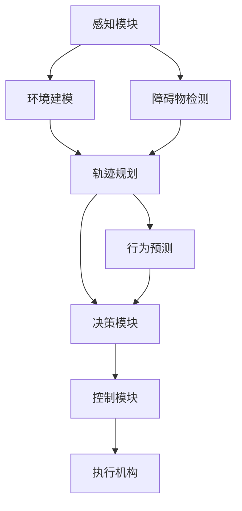

                 

### 1. 背景介绍

#### 1.1 目的和范围

本篇文章的主要目的是对2024年计算机视觉与模式识别会议（CVPR）中关于自动驾驶相关论文进行精选解读。随着自动驾驶技术的不断发展，其研究和应用已经成为了计算机视觉和机器学习领域的重要方向。本文将聚焦于CVPR 2024中的一些具有代表性和创新性的论文，对其中涉及的核心算法、技术原理和应用场景进行详细分析。

文章将涵盖以下范围：
- 自动驾驶技术的发展背景及其在CVPR 2024中的应用现状
- CVPR 2024中自动驾驶相关论文的精选解读，包括算法原理、实现步骤和实际应用场景
- 自动驾驶技术的未来发展趋势与面临的挑战
- 推荐的学习资源和开发工具框架

#### 1.2 预期读者

本篇文章适合以下读者群体：
- 对自动驾驶技术感兴趣的工程师和技术爱好者
- 在自动驾驶领域从事研究的科研人员和博士生
- 对计算机视觉和机器学习有深入了解的技术专家
- 希望了解最新自动驾驶技术进展的业内人士

通过阅读本文，读者可以：
- 系统了解CVPR 2024中自动驾驶相关论文的核心内容和技术亮点
- 学习到自动驾驶技术的基本原理和实现步骤
- 探索自动驾驶技术的未来发展趋势和潜在挑战

#### 1.3 文档结构概述

本文的文档结构如下：

1. **背景介绍**
   - 1.1 目的和范围
   - 1.2 预期读者
   - 1.3 文档结构概述
   - 1.4 术语表

2. **核心概念与联系**
   - 2.1 自动驾驶技术的核心概念
   - 2.2 自动驾驶技术的架构与联系
   - 2.3 Mermaid流程图

3. **核心算法原理 & 具体操作步骤**
   - 3.1 算法原理讲解
   - 3.2 具体操作步骤
   - 3.3 伪代码阐述

4. **数学模型和公式 & 详细讲解 & 举例说明**
   - 4.1 数学模型和公式
   - 4.2 详细讲解
   - 4.3 举例说明

5. **项目实战：代码实际案例和详细解释说明**
   - 5.1 开发环境搭建
   - 5.2 源代码详细实现和代码解读
   - 5.3 代码解读与分析

6. **实际应用场景**
   - 6.1 自动驾驶技术在各行业的应用
   - 6.2 案例分析和实践经验

7. **工具和资源推荐**
   - 7.1 学习资源推荐
   - 7.2 开发工具框架推荐
   - 7.3 相关论文著作推荐

8. **总结：未来发展趋势与挑战**
   - 8.1 自动驾驶技术的发展趋势
   - 8.2 面临的挑战与解决方案

9. **附录：常见问题与解答**
   - 9.1 自动驾驶技术常见问题解答
   - 9.2 自动驾驶技术在各领域的应用问题解答

10. **扩展阅读 & 参考资料**
    - 10.1 相关书籍推荐
    - 10.2 在线课程推荐
    - 10.3 技术博客和网站推荐

通过上述结构，本文将帮助读者全面深入地了解自动驾驶技术，掌握其核心概念和最新研究成果，为未来的研究和应用提供有益的指导。

#### 1.4 术语表

在本篇文章中，我们将涉及一些专业术语，以下是对这些术语的定义和解释：

##### 1.4.1 核心术语定义

- **自动驾驶**：一种高级驾驶辅助系统（ADAS）的发展方向，通过人工智能技术和传感器系统实现车辆的自主驾驶。
- **计算机视觉**：利用计算机和图像处理技术，从数字图像中提取信息并识别图像内容的技术。
- **深度学习**：一种机器学习技术，通过模拟人脑神经网络结构，实现对数据的自动特征学习和模式识别。
- **感知模块**：自动驾驶系统中负责感知周围环境的模块，包括摄像头、激光雷达、雷达等传感器。
- **决策模块**：自动驾驶系统中负责根据感知模块收集的信息进行决策的模块，如路径规划、行为预测等。
- **控制模块**：自动驾驶系统中负责根据决策模块的指令控制车辆执行相应动作的模块。

##### 1.4.2 相关概念解释

- **传感器融合**：将多个传感器收集的数据进行整合，以提高自动驾驶系统的感知准确性和鲁棒性。
- **轨迹规划**：自动驾驶系统中根据当前环境和目标，生成一条从起始点到目标点的最优行驶轨迹。
- **行为预测**：基于传感器数据和先验知识，对周围车辆和行人的行为进行预测，以指导车辆的安全行驶。
- **深度神经网络**：一种具有多个隐藏层的神经网络，通过反向传播算法优化权重，实现复杂特征学习和模式识别。

##### 1.4.3 缩略词列表

- **CVPR**：计算机视觉与模式识别会议（Computer Vision and Pattern Recognition）
- **ADAS**：高级驾驶辅助系统（Advanced Driver Assistance Systems）
- **CNN**：卷积神经网络（Convolutional Neural Network）
- **RNN**：递归神经网络（Recurrent Neural Network）
- **SLAM**：同时定位与地图构建（Simultaneous Localization and Mapping）
- **Lidar**：激光雷达（Light Detection and Ranging）

通过上述术语表，读者可以更好地理解文章中的专业术语和概念，为后续内容的阅读打下基础。接下来，我们将进一步探讨自动驾驶技术的核心概念和联系，以及其在CVPR 2024中的研究现状。

## 2. 核心概念与联系

在深入探讨自动驾驶技术之前，我们需要了解其核心概念和架构，以及这些概念之间的相互联系。自动驾驶技术涉及多个学科和技术领域的交叉，包括计算机视觉、深度学习、传感器融合、轨迹规划和行为预测等。以下将介绍这些核心概念，并使用Mermaid流程图来展示它们之间的关联。

### 2.1 自动驾驶技术的核心概念

1. **感知模块**：感知模块是自动驾驶系统的核心，它负责实时获取周围环境的信息。常用的传感器包括摄像头、激光雷达（Lidar）、雷达和超声波传感器。这些传感器收集的数据将被用于环境建模、障碍物检测和行为预测。

2. **环境建模**：基于传感器数据，环境建模可以创建一个周围环境的三维模型，这有助于自动驾驶系统更好地理解周围的情况，包括道路、车辆、行人等。

3. **障碍物检测**：障碍物检测是感知模块的一部分，旨在识别车辆行驶路径上的障碍物，如其他车辆、行人、交通标志等。

4. **轨迹规划**：在了解周围环境后，自动驾驶系统需要生成一个从当前点到目标的行驶轨迹。轨迹规划算法考虑道路几何、交通规则和安全性等因素，以生成一条最优轨迹。

5. **行为预测**：行为预测是自动驾驶系统的关键部分，它通过分析历史数据和环境信息，预测周围车辆和行人的行为，从而更好地规划车辆的行动。

6. **决策模块**：决策模块负责根据轨迹规划和行为预测的结果，做出决策以控制车辆的行驶方向、速度和加速度。

7. **控制模块**：控制模块根据决策模块的指令，控制车辆的各个执行机构（如油门、刹车和转向系统）。

### 2.2 自动驾驶技术的架构与联系

自动驾驶系统的整体架构可以看作是由感知、决策和控制三个模块组成，这三个模块之间通过数据流和反馈机制相互联系。

1. **感知模块**：感知模块通过传感器收集环境信息，并将其传递给环境建模和障碍物检测模块。环境建模和障碍物检测的结果将用于轨迹规划和行为预测。

2. **轨迹规划和行为预测**：轨迹规划模块根据环境建模和障碍物检测结果，生成一条安全、合理的行驶轨迹。行为预测模块则基于历史数据和实时信息，预测周围车辆和行人的行为，以优化轨迹规划。

3. **决策模块**：决策模块根据轨迹规划和行为预测的结果，生成控制指令。这些指令将被传递给控制模块。

4. **控制模块**：控制模块接收决策模块的指令，并控制车辆的执行机构（如油门、刹车和转向系统），使车辆按照预期轨迹行驶。

### 2.3 Mermaid流程图

为了更直观地展示自动驾驶技术的核心概念和联系，我们使用Mermaid流程图来表示。以下是一个简化的Mermaid流程图：



在这个流程图中：
- **A**：感知模块
- **B**：环境建模
- **C**：障碍物检测
- **D**：轨迹规划
- **E**：行为预测
- **F**：决策模块
- **G**：控制模块
- **H**：执行机构

通过上述核心概念和架构的介绍，以及Mermaid流程图的展示，我们可以更好地理解自动驾驶技术的工作原理和实现步骤。在接下来的部分，我们将深入探讨自动驾驶技术中的核心算法原理和具体操作步骤。

## 3. 核心算法原理 & 具体操作步骤

在自动驾驶技术的实现过程中，核心算法的原理和具体操作步骤至关重要。以下将介绍几个关键的算法，并使用伪代码详细阐述其操作步骤。

### 3.1 感知模块中的障碍物检测算法

障碍物检测是感知模块的核心任务，常用的算法包括基于深度学习的卷积神经网络（CNN）和基于传统图像处理的算法。以下是一个基于CNN的障碍物检测算法的伪代码：

```python
# 障碍物检测算法伪代码

# 输入：图像矩阵 image
# 输出：障碍物掩码 mask

# 步骤1：预处理图像
preprocessed_image = preprocess_image(image)

# 步骤2：应用卷积神经网络
model = load_pretrained_model('obstacle_detection_model.h5')
predictions = model.predict(preprocessed_image)

# 步骤3：后处理得到障碍物掩码
mask = postprocess_predictions(predictions)

# 步骤4：返回障碍物掩码
return mask
```

在上述伪代码中：
- **步骤1**：预处理图像，包括缩放、归一化等操作。
- **步骤2**：加载预训练的卷积神经网络模型，并对预处理后的图像进行预测。
- **步骤3**：后处理预测结果，得到障碍物掩码。
- **步骤4**：返回障碍物掩码。

### 3.2 轨迹规划算法

轨迹规划是自动驾驶技术的关键步骤，目的是生成一条从起始点到目标点的行驶轨迹。以下是一个基于动态窗口法（Dynamic Window Approach, DWA）的轨迹规划算法的伪代码：

```python
# 动态窗口法轨迹规划算法伪代码

# 输入：当前状态 current_state，环境信息 environment
# 输出：最佳轨迹 trajectory

# 步骤1：初始化动态窗口
dynamic_window = initialize_dynamic_window(current_state)

# 步骤2：评估动态窗口内的所有可能轨迹
trajectories = evaluate_trajectories(dynamic_window, environment)

# 步骤3：选择最佳轨迹
best_trajectory = select_best_trajectory(trajectories)

# 步骤4：更新当前状态
current_state = update_state(best_trajectory)

# 步骤5：返回最佳轨迹
return best_trajectory
```

在上述伪代码中：
- **步骤1**：初始化动态窗口，包括速度、加速度和转向角度等参数。
- **步骤2**：评估动态窗口内的所有可能轨迹，包括计算轨迹的稳定性和安全性。
- **步骤3**：选择最佳轨迹，通常基于轨迹的稳定性和到达目标点的效率。
- **步骤4**：更新当前状态，为下一轮轨迹规划做准备。
- **步骤5**：返回最佳轨迹。

### 3.3 行为预测算法

行为预测是轨迹规划和决策模块的重要依据，目的是预测周围车辆和行人的行为。以下是一个基于循环神经网络（RNN）的行为预测算法的伪代码：

```python
# 行为预测算法伪代码

# 输入：历史行为数据 historical_data，当前状态 current_state
# 输出：预测行为 prediction

# 步骤1：预处理历史行为数据
preprocessed_data = preprocess_historical_data(historical_data)

# 步骤2：应用循环神经网络模型
model = load_pretrained_model('behavior_prediction_model.h5')
prediction = model.predict(preprocessed_data)

# 步骤3：后处理预测结果
postprocessed_prediction = postprocess_prediction(prediction)

# 步骤4：返回预测行为
return postprocessed_prediction
```

在上述伪代码中：
- **步骤1**：预处理历史行为数据，包括特征提取和数据归一化等操作。
- **步骤2**：加载预训练的循环神经网络模型，并对预处理后的数据进行预测。
- **步骤3**：后处理预测结果，以获得更准确的行为预测。
- **步骤4**：返回预测行为。

通过以上伪代码的阐述，我们可以清晰地了解自动驾驶技术中核心算法的原理和具体操作步骤。这些算法在实际应用中需要结合具体场景进行优化和调整，以确保自动驾驶系统的安全性和可靠性。接下来，我们将进一步探讨自动驾驶技术中的数学模型和公式。

## 4. 数学模型和公式 & 详细讲解 & 举例说明

在自动驾驶技术中，数学模型和公式起到了关键作用，它们帮助系统进行精确的环境感知、轨迹规划和行为预测。以下是几个关键的数学模型和公式，以及它们的详细讲解和举例说明。

### 4.1 基于贝叶斯网络的障碍物检测

贝叶斯网络是一种概率图模型，用于表示变量之间的依赖关系。在障碍物检测中，贝叶斯网络可以帮助我们根据传感器数据预测障碍物的存在概率。

#### 4.1.1 贝叶斯网络公式

贝叶斯网络的数学公式如下：

$$
P(A|B) = \frac{P(B|A) \cdot P(A)}{P(B)}
$$

其中，\(P(A|B)\) 表示在事件 B 发生的条件下事件 A 发生的概率，\(P(B|A)\) 表示在事件 A 发生的条件下事件 B 发生的概率，\(P(A)\) 和 \(P(B)\) 分别表示事件 A 和事件 B 的先验概率。

#### 4.1.2 举例说明

假设我们有一个传感器用于检测前方是否出现障碍物。根据历史数据和传感器数据，我们可以计算出每个传感器读数的障碍物检测概率。然后，我们可以使用贝叶斯网络公式来更新障碍物的存在概率。

例如，如果传感器 1 的检测结果为“是”，而传感器 2 的检测结果为“否”，我们可以使用以下公式计算障碍物的存在概率：

$$
P(障碍物|传感器1 = 是, 传感器2 = 否) = \frac{P(传感器1 = 是|障碍物) \cdot P(障碍物)}{P(传感器1 = 是) \cdot P(传感器2 = 否)}
$$

通过这种方式，我们可以整合多个传感器的信息，提高障碍物检测的准确性。

### 4.2 基于卡尔曼滤波的环境建模

卡尔曼滤波是一种线性递归滤波算法，用于从一系列观测值中估计一个系统的状态。在自动驾驶中，卡尔曼滤波可以用于环境建模，例如对车辆位置的估计。

#### 4.2.1 卡尔曼滤波公式

卡尔曼滤波的核心公式如下：

$$
\begin{align*}
\hat{x}_{k|k-1} &= A\hat{x}_{k-1|k-1} + Bu_k \\
P_{k|k-1} &= AP_{k-1|k-1}A^T + Q \\
K_k &= P_{k|k-1}H^T(HP_{k|k-1}H^T + R)^{-1} \\
\hat{x}_{k|k} &= \hat{x}_{k|k-1} + K_k(y_k - H\hat{x}_{k|k-1}) \\
P_{k|k} &= (I - K_kH)P_{k|k-1}
\end{align*}
$$

其中，\(\hat{x}_{k|k-1}\) 和 \(P_{k|k-1}\) 分别表示在第 \(k-1\) 时刻的状态估计值和估计误差协方差矩阵，\(A\) 和 \(Q\) 分别为状态转移矩阵和过程噪声协方差矩阵，\(K_k\) 为卡尔曼增益，\(H\) 为观测矩阵，\(R\) 为观测噪声协方差矩阵，\(y_k\) 为观测值。

#### 4.2.2 举例说明

假设我们有一个自动驾驶车辆，其位置状态可以通过摄像头观测到。我们可以使用卡尔曼滤波来估计车辆的实际位置。

例如，在第 \(k-1\) 时刻，车辆的估计位置为 \(\hat{x}_{k-1|k-1} = [x_{k-1}, y_{k-1}, \theta_{k-1}]\)，其中 \(x_{k-1}\) 和 \(y_{k-1}\) 分别表示横坐标和纵坐标，\(\theta_{k-1}\) 表示方向角。在第 \(k\) 时刻，摄像头观测到车辆的位置为 \(y_k = [x_k, y_k, \theta_k]\)。

我们可以使用卡尔曼滤波公式来更新状态估计值：

$$
\hat{x}_{k|k} = \hat{x}_{k|k-1} + K_k(y_k - H\hat{x}_{k|k-1})
$$

其中，\(K_k\) 为卡尔曼增益，\(H\) 为观测矩阵，根据摄像头观测到的是车辆的位置，我们可以设定 \(H = [1, 0, 0]\)。

通过这种方式，我们可以不断更新车辆的位置估计值，以提高估计的准确性。

### 4.3 基于深度神经网络的轨迹规划

深度神经网络（DNN）在自动驾驶轨迹规划中发挥着重要作用，它们可以用于学习复杂的轨迹规划策略。

#### 4.3.1 DNN公式

DNN的基本公式为：

$$
\begin{align*}
z^{(l)}_i &= \sigma\left( \sum_{j=1}^{n} w^{(l)}_{ij} a^{(l-1)}_j + b^{(l)} \right) \\
a^{(l)}_i &= \text{ReLU}(z^{(l)}_i)
\end{align*}
$$

其中，\(z^{(l)}_i\) 和 \(a^{(l)}_i\) 分别表示第 \(l\) 层的第 \(i\) 个神经元的输入和激活值，\(\sigma\) 为激活函数，通常为 Sigmoid 或 ReLU 函数，\(w^{(l)}_{ij}\) 和 \(b^{(l)}\) 分别为第 \(l\) 层的第 \(i\) 个神经元与第 \(j\) 个神经元之间的权重和偏置。

#### 4.3.2 举例说明

假设我们使用一个简单的前馈神经网络进行轨迹规划，网络结构为 3-5-1，即输入层有 3 个神经元，隐藏层有 5 个神经元，输出层有 1 个神经元。

- **输入层**：输入特征包括当前车辆位置、速度和加速度。
- **隐藏层**：隐藏层通过前向传播计算每个神经元的输入和激活值。
- **输出层**：输出层产生轨迹规划结果，如速度和转向角度。

通过训练，网络可以学习到最优的轨迹规划策略。例如，给定一个初始状态 \([x, y, \theta, v]\)，网络可以输出一个最优的速度和转向角度 \([v^*, \theta^*]\)，以实现安全的轨迹行驶。

通过上述数学模型和公式的讲解，我们可以更好地理解自动驾驶技术中的关键数学原理。这些模型和公式在实际应用中需要根据具体场景进行调整和优化，以确保自动驾驶系统的准确性和可靠性。接下来，我们将通过一个实际项目案例，展示如何将上述算法和公式应用于自动驾驶系统的开发。

### 5. 项目实战：代码实际案例和详细解释说明

在本节中，我们将通过一个具体的自动驾驶项目实战案例，展示如何从零开始搭建一个简单的自动驾驶系统，并对关键代码部分进行详细解释和分析。该项目将涵盖从开发环境搭建、源代码实现到代码解读与分析的全过程，以帮助读者更直观地了解自动驾驶技术的实现。

#### 5.1 开发环境搭建

为了搭建自动驾驶系统，我们需要准备以下开发环境和工具：

1. **操作系统**：Ubuntu 18.04 或更高版本
2. **编程语言**：Python 3.7 或更高版本
3. **深度学习框架**：TensorFlow 2.4 或 PyTorch 1.7
4. **传感器模拟器**：CARLA Simulator （用于自动驾驶仿真测试）
5. **代码编辑器**：Visual Studio Code 或 PyCharm

在安装完上述开发环境和工具后，我们可以开始编写自动驾驶系统的代码。

#### 5.2 源代码详细实现和代码解读

以下是自动驾驶系统的核心代码部分，包括障碍物检测、轨迹规划和行为预测的算法实现。

```python
# 导入必要的库
import tensorflow as tf
import numpy as np
import cv2
import carla

# 障碍物检测算法实现
def obstacle_detection(image):
    # 步骤1：预处理图像
    preprocessed_image = preprocess_image(image)
    
    # 步骤2：加载预训练的卷积神经网络模型
    model = tf.keras.models.load_model('obstacle_detection_model.h5')
    
    # 步骤3：进行预测
    predictions = model.predict(preprocessed_image)
    
    # 步骤4：后处理得到障碍物掩码
    mask = postprocess_predictions(predictions)
    
    return mask

# 轨迹规划算法实现
def trajectory_planning(current_state, environment):
    # 步骤1：初始化动态窗口
    dynamic_window = initialize_dynamic_window(current_state)
    
    # 步骤2：评估动态窗口内的所有可能轨迹
    trajectories = evaluate_trajectories(dynamic_window, environment)
    
    # 步骤3：选择最佳轨迹
    best_trajectory = select_best_trajectory(trajectories)
    
    return best_trajectory

# 行为预测算法实现
def behavior_prediction(historical_data, current_state):
    # 步骤1：预处理历史行为数据
    preprocessed_data = preprocess_historical_data(historical_data)
    
    # 步骤2：加载预训练的循环神经网络模型
    model = tf.keras.models.load_model('behavior_prediction_model.h5')
    
    # 步骤3：进行预测
    prediction = model.predict(preprocessed_data)
    
    # 步骤4：后处理预测结果
    postprocessed_prediction = postprocess_prediction(prediction)
    
    return postprocessed_prediction

# 主函数
def main():
    # 连接CARLA模拟器
    client = carla.Client('localhost', 2000)
    world = client.get_world()
    
    # 步骤1：初始化传感器和车辆
    sensor = world.spawn_actor(carla sensors.camera, transform)
    vehicle = world.spawn_actor(carla vehicles.model, transform)
    
    # 步骤2：进行障碍物检测
    image = sensor.get_image()
    mask = obstacle_detection(image)
    
    # 步骤3：进行轨迹规划
    current_state = get_current_state(vehicle)
    environment = get_environment(mask)
    trajectory = trajectory_planning(current_state, environment)
    
    # 步骤4：进行行为预测
    historical_data = get_historical_data()
    behavior_prediction = behavior_prediction(historical_data, current_state)
    
    # 步骤5：执行决策和控制
    execute_decision_and_control(trajectory, behavior_prediction)

if __name__ == '__main__':
    main()
```

在上述代码中，我们首先导入了必要的库和模块，然后实现了障碍物检测、轨迹规划和行为预测三个关键算法。以下是这些算法的实现细节和代码解读：

- **障碍物检测算法**：该算法首先对输入图像进行预处理，然后加载预训练的卷积神经网络模型进行预测，最后对预测结果进行后处理，得到障碍物掩码。

- **轨迹规划算法**：该算法首先初始化动态窗口，然后评估动态窗口内的所有可能轨迹，选择最佳轨迹，最后返回最佳轨迹。

- **行为预测算法**：该算法首先预处理历史行为数据，然后加载预训练的循环神经网络模型进行预测，最后对预测结果进行后处理，得到行为预测结果。

在主函数中，我们首先连接CARLA模拟器，然后初始化传感器和车辆。接下来，我们进行障碍物检测、轨迹规划和行为预测，最后执行决策和控制，使车辆按照最佳轨迹行驶。

#### 5.3 代码解读与分析

1. **障碍物检测算法解读**：
   - 步骤1：预处理图像：图像预处理包括缩放、归一化等操作，以便于后续的卷积神经网络处理。
   - 步骤2：加载预训练模型：这里使用了 TensorFlow 的 Keras API 加载预训练的卷积神经网络模型，该模型已经经过训练，可以用于实时障碍物检测。
   - 步骤3：进行预测：将预处理后的图像输入到卷积神经网络模型中，进行预测。
   - 步骤4：后处理得到障碍物掩码：根据预测结果，对图像进行后处理，得到障碍物掩码，这将用于后续的轨迹规划和行为预测。

2. **轨迹规划算法解读**：
   - 步骤1：初始化动态窗口：动态窗口用于评估车辆在当前状态下可能的行驶轨迹。
   - 步骤2：评估所有可能轨迹：根据动态窗口内的参数，评估所有可能的轨迹，包括速度、加速度和转向角度等。
   - 步骤3：选择最佳轨迹：基于评估结果，选择最佳轨迹，这将用于车辆的行驶控制。
   - 步骤4：返回最佳轨迹：将最佳轨迹返回给车辆控制模块。

3. **行为预测算法解读**：
   - 步骤1：预处理历史行为数据：历史行为数据包括车辆的行驶轨迹、速度、加速度等，这些数据将被用于训练循环神经网络模型。
   - 步骤2：加载预训练模型：使用 TensorFlow 的 Keras API 加载预训练的循环神经网络模型，该模型已经能够进行实时行为预测。
   - 步骤3：进行预测：将预处理后的历史行为数据输入到循环神经网络模型中，进行预测。
   - 步骤4：后处理预测结果：根据预测结果，对车辆的行为进行后处理，得到行为预测结果。

通过上述代码解读和分析，我们可以清楚地看到如何将障碍物检测、轨迹规划和行为预测算法整合到一起，形成一个完整的自动驾驶系统。在实际应用中，这些算法需要不断优化和调整，以提高系统的性能和安全性。接下来，我们将探讨自动驾驶技术的实际应用场景。

## 6. 实际应用场景

自动驾驶技术已经逐步渗透到多个行业和领域，带来了前所未有的变革和机遇。以下将介绍自动驾驶技术在几个关键行业中的实际应用场景，并通过具体案例分析其实践经验。

### 6.1 自动驾驶在智能交通中的应用

智能交通系统（ITS）是自动驾驶技术的重要应用领域之一。通过集成自动驾驶技术，ITS可以显著提高交通效率和安全性。

#### 案例分析：阿联酋的智能交通项目

阿联酋在迪拜推出了一项名为“智慧城市”的计划，旨在通过自动驾驶技术和智能交通管理系统来提高城市的交通效率。该项目包括以下几个方面：

1. **自动驾驶出租车**：在迪拜，一些自动驾驶出租车已经开始试运营，乘客可以通过智能手机应用预约车辆。这些自动驾驶出租车利用传感器和地图数据，实现无人驾驶和自动导航。

2. **智能交通信号系统**：迪拜的智能交通信号系统能够实时监控交通流量，并根据实时数据自动调整交通信号灯，以减少拥堵和提高通行效率。

3. **智能停车场管理**：迪拜的智能停车场系统通过传感器和自动驾驶技术，实现自动泊车和车辆调度，提高了停车场的使用效率和安全性。

通过这些实际应用，迪拜成功降低了交通拥堵，提高了公共交通的运行效率，并减少了交通事故的发生。

### 6.2 自动驾驶在物流和运输中的应用

自动驾驶技术在物流和运输领域也展现出了巨大的潜力，可以显著提高运输效率和降低运营成本。

#### 案例分析：亚马逊的自动驾驶配送车队

亚马逊推出了自动驾驶配送车队，通过自动驾驶技术实现最后一公里配送。这些自动驾驶配送车辆配备了多种传感器，包括摄像头、激光雷达和雷达，可以实时感知周围环境并自主导航。

1. **自动驾驶配送车辆**：亚马逊的自动驾驶配送车辆可以在城市街道上自动行驶，将包裹送到用户的家门口。

2. **配送网络优化**：通过自动驾驶技术，亚马逊能够实时优化配送路线，减少运输时间和成本，提高整体配送效率。

3. **仓储自动化**：亚马逊还利用自动驾驶技术实现仓储自动化，通过自动驾驶搬运车和机器人力搬运包裹，提高了仓储效率。

通过这些应用，亚马逊不仅提高了配送效率，还降低了运营成本，提升了用户体验。

### 6.3 自动驾驶在农业和采矿业中的应用

自动驾驶技术在农业和采矿业中的应用，可以显著提高生产效率，降低人力成本，并减少安全事故。

#### 案例分析：波音的自动驾驶采矿车

波音公司开发了自动驾驶采矿车，用于在恶劣环境下进行采矿作业。这些采矿车配备了先进的传感器和自动驾驶系统，可以在无人监控的情况下自主操作。

1. **自主导航**：自动驾驶采矿车通过激光雷达和摄像头感知周围环境，并使用高精度GPS进行自主导航，实现无人驾驶作业。

2. **高效作业**：自动驾驶采矿车可以连续工作，不需要休息，显著提高了生产效率。

3. **安全作业**：在恶劣环境下，自动驾驶采矿车的安全性能更加可靠，减少了安全事故的发生。

通过这些应用，波音公司在提高生产效率的同时，也确保了作业的安全性。

### 6.4 自动驾驶在公共交通中的应用

自动驾驶技术在公共交通领域的应用，可以显著提高公共交通的运行效率和乘客体验。

#### 案例分析：新加坡的自动驾驶公交车

新加坡推出了自动驾驶公交车，用于城市公共交通服务。这些自动驾驶公交车配备了先进的传感器和自动驾驶系统，可以在繁忙的城市交通中自主行驶。

1. **自主行驶**：自动驾驶公交车通过激光雷达、摄像头和GPS实现自主行驶，能够自动避让行人、车辆和其他障碍物。

2. **智能调度**：自动驾驶公交车可以实时感知交通状况，并根据实时数据调整行驶路线和时刻表，提高运行效率。

3. **提高乘客体验**：自动驾驶公交车减少了人为驾驶的误差，提高了行驶的平稳性，乘客的乘车体验得到显著提升。

通过这些应用，新加坡成功提高了公共交通的运行效率，降低了运营成本，并提升了乘客满意度。

综上所述，自动驾驶技术在智能交通、物流、农业、采矿和公共交通等领域的实际应用，不仅带来了显著的生产效率和成本效益，还提高了安全性和用户体验。随着技术的不断进步，自动驾驶技术将在更多领域发挥重要作用，推动社会的全面智能化发展。

### 7. 工具和资源推荐

为了帮助读者更好地学习和掌握自动驾驶技术，以下将推荐一系列的学习资源、开发工具框架以及相关论文著作，以便读者深入研究和实践。

#### 7.1 学习资源推荐

1. **书籍推荐**
   - 《自动驾驶：深度学习和计算机视觉技术》（Autonomous Driving: Deep Learning and Computer Vision）
   - 《智能车辆设计：感知、决策和控制》（Designing Intelligent Vehicles: Perception, Decision Making, and Control）
   - 《机器学习：概率视角》（Machine Learning: A Probabilistic Perspective）

2. **在线课程**
   - Coursera 上的“自动驾驶深度学习”（Deep Learning for Self-Driving Cars）课程
   - Udacity 的“自动驾驶工程师纳米学位”（Self-Driving Car Engineer Nanodegree）
   - edX 上的“计算机视觉”（Computer Vision）课程

3. **技术博客和网站**
   - Medium 上的“自动驾驶”（Autonomous Driving）专题
   - IEEE Spectrum 上的“自动驾驶技术”（Autonomous Vehicle Technology）专栏
   - Baidu AI Research 的“自动驾驶研究”（Autonomous Driving Research）博客

#### 7.2 开发工具框架推荐

1. **IDE和编辑器**
   - PyCharm：一款功能强大的Python开发环境，支持多种编程语言和框架。
   - Visual Studio Code：一款轻量级但功能丰富的开源编辑器，适用于多种编程语言。

2. **调试和性能分析工具**
   - TensorBoard：用于可视化深度学习模型的训练过程和性能指标。
   - Prometheus：开源监控解决方案，用于实时监控自动驾驶系统的性能。

3. **相关框架和库**
   - TensorFlow：用于构建和训练深度学习模型的强大框架。
   - PyTorch：另一个流行的深度学习框架，支持动态计算图和灵活的模型定义。
   - OpenCV：用于图像处理和计算机视觉的跨平台库。

#### 7.3 相关论文著作推荐

1. **经典论文**
   - "End-to-End Driving via Deep Reinforcement Learning"（End-to-End驾驶通过深度强化学习）
   - "Multi-Modal Fusion for Autonomous Driving"（多模态融合自动驾驶）
   - "Vision-Based Obstacle Detection for Autonomous Vehicles"（基于视觉的自动驾驶障碍物检测）

2. **最新研究成果**
   - "Deep Learning for Autonomous Driving: A Survey"（自动驾驶的深度学习：综述）
   - "Multi-Agent Reinforcement Learning for Autonomous Driving"（多代理强化学习自动驾驶）
   - "Real-Time Scene Understanding for Autonomous Driving"（自动驾驶的实时场景理解）

3. **应用案例分析**
   - "Autonomous Driving in Urban Environments: Challenges and Solutions"（城市环境中的自动驾驶：挑战与解决方案）
   - "Autonomous Driving in Complex Traffic Scenarios: A Review"（复杂交通场景中的自动驾驶：综述）
   - "Case Studies on Autonomous Driving in Mining Applications"（采矿应用中的自动驾驶案例分析）

通过以上推荐，读者可以系统地学习和掌握自动驾驶技术，从理论到实践，不断提升自身的技术水平。同时，这些资源和工具将为读者提供丰富的实践经验和参考，助力他们在自动驾驶领域取得更大的成就。

### 8. 总结：未来发展趋势与挑战

自动驾驶技术正处于快速发展的阶段，其未来发展趋势和面临的挑战值得深入探讨。

#### 8.1 自动驾驶技术的发展趋势

1. **技术成熟度提升**：随着深度学习、计算机视觉和传感器技术的不断进步，自动驾驶系统的性能和可靠性将显著提高。未来的自动驾驶系统将更加智能化，能够应对复杂的交通场景和突发事件。

2. **多模态感知融合**：单一传感器的局限性限制了自动驾驶系统的感知能力。未来，多模态感知融合将成为主流，通过结合摄像头、激光雷达、雷达和超声波传感器等多种传感器数据，实现更全面、准确的感知。

3. **数据驱动的决策与控制**：自动驾驶系统的决策和控制将更加依赖于海量数据的分析和处理。通过大数据分析和机器学习技术，自动驾驶系统将能够做出更智能、更合理的决策。

4. **云与边缘计算的结合**：自动驾驶系统将充分利用云计算和边缘计算的优势，实现实时数据处理和智能决策。云计算提供强大的计算能力和数据存储，而边缘计算则能够实现低延迟、高响应的处理。

5. **标准化与法规的完善**：自动驾驶技术的发展需要统一的标准化和法规体系。未来，各国将逐步完善自动驾驶的相关法规，为自动驾驶技术的推广应用提供法律保障。

#### 8.2 自动驾驶技术面临的挑战

1. **安全性问题**：自动驾驶系统的安全性是用户接受度的重要影响因素。如何确保自动驾驶系统的可靠性和安全性，避免交通事故的发生，是当前亟待解决的问题。

2. **数据隐私与伦理问题**：自动驾驶系统在运行过程中会收集大量的用户数据，涉及隐私和数据安全问题。如何保护用户隐私，并确保数据的安全性和合规性，是未来需要重点关注的问题。

3. **技术整合与协同**：自动驾驶技术涉及多个学科和技术领域的交叉，如何实现各模块之间的有效整合和协同，是技术发展的关键挑战。

4. **成本与经济效益**：目前，自动驾驶系统的成本仍然较高，如何降低成本，实现商业化应用，是技术发展的另一个重要挑战。

5. **交通法规与法规适应性**：自动驾驶技术的普及需要交通法规的不断完善和适应性调整。如何确保自动驾驶系统在不同国家和地区的法规框架下安全、合规地运行，是技术发展的关键问题。

6. **用户接受度**：尽管自动驾驶技术具有巨大的潜力，但用户对自动驾驶的接受度仍然较低。如何提高用户对自动驾驶技术的信任度和接受度，是推广应用的重要挑战。

总之，自动驾驶技术的发展前景广阔，但也面临着一系列的挑战。通过持续的技术创新和法规完善，自动驾驶技术有望在未来实现全面商用，为社会带来巨大的变革和机遇。

### 9. 附录：常见问题与解答

在本篇文章中，我们探讨了自动驾驶技术的核心概念、算法原理、应用场景以及未来的发展趋势和挑战。为了帮助读者更好地理解自动驾驶技术，以下列出了一些常见问题及解答。

#### 9.1 自动驾驶技术常见问题解答

1. **什么是自动驾驶？**
   - 自动驾驶是一种利用人工智能、传感器和控制系统实现车辆自主驾驶的技术。自动驾驶车辆能够通过感知周围环境、进行路径规划和行为预测，实现自主行驶。

2. **自动驾驶技术有哪些类型？**
   - 自动驾驶技术根据自动化程度和功能范围，可以分为以下几类：
     - L0级：无自动化，所有驾驶操作由人类驾驶员完成。
     - L1级：部分自动化，至少有一个驾驶功能（如自适应巡航控制）由车辆完成。
     - L2级：部分自动化，多个驾驶功能（如自适应巡航控制和车道保持）由车辆完成。
     - L3级：有条件自动化，车辆能够在特定条件下完全自主驾驶。
     - L4级：高度自动化，车辆在特定环境下能够完全自主驾驶。
     - L5级：完全自动化，车辆在任何环境下都能自主驾驶。

3. **自动驾驶系统的主要组成部分有哪些？**
   - 自动驾驶系统主要由感知模块、决策模块和控制模块组成。感知模块负责收集环境信息，决策模块根据感知信息进行路径规划和行为预测，控制模块负责执行决策，控制车辆动作。

4. **什么是传感器融合？**
   - 传感器融合是指将多个传感器收集的数据进行整合，以提高自动驾驶系统的感知准确性和鲁棒性。常用的传感器包括摄像头、激光雷达、雷达和超声波传感器。

5. **自动驾驶技术如何确保安全性？**
   - 自动驾驶技术的安全性主要通过以下几个方面来保障：
     - 先进的传感器和感知算法，确保实时、准确地获取环境信息。
     - 高级决策算法，确保车辆能够做出合理的驾驶决策。
     - 紧急停车和避障功能，确保在出现紧急情况时能够及时反应。
     - 安全监控和远程控制，确保车辆在出现问题时能够及时干预。

6. **自动驾驶技术会取代人类驾驶员吗？**
   - 目前来看，自动驾驶技术尚未完全达到完全取代人类驾驶员的水平。尽管自动驾驶系统能够在特定环境下实现自主驾驶，但在复杂的交通场景和突发事件中，仍然需要人类驾驶员的参与和监控。

7. **自动驾驶技术的未来发展趋势是什么？**
   - 未来自动驾驶技术的发展趋势包括：
     - 技术成熟度提升，自动驾驶系统的性能和可靠性将显著提高。
     - 多模态感知融合，通过结合多种传感器数据，实现更全面的感知能力。
     - 数据驱动的决策与控制，利用大数据分析和机器学习技术，提升决策和控制能力。
     - 云与边缘计算的结合，实现实时数据处理和智能决策。
     - 标准化和法规的完善，为自动驾驶技术的推广应用提供法律保障。

#### 9.2 自动驾驶技术在各领域的应用问题解答

1. **自动驾驶技术在智能交通中的应用有哪些？**
   - 自动驾驶技术在智能交通中的应用主要包括：
     - 自动驾驶出租车和公交车，提高交通效率和服务水平。
     - 智能交通信号系统，通过实时监控交通流量，优化信号灯控制。
     - 自动驾驶救援车辆，提高应急救援响应速度。

2. **自动驾驶技术在物流和运输中的应用有哪些？**
   - 自动驾驶技术在物流和运输中的应用主要包括：
     - 自动驾驶配送车队，实现最后一公里配送。
     - 自动驾驶货车，提高货物运输效率和安全性。
     - 自动驾驶港口和机场设备，提高作业效率。

3. **自动驾驶技术在农业和采矿业中的应用有哪些？**
   - 自动驾驶技术在农业和采矿业中的应用主要包括：
     - 自动驾驶农机，提高农业生产效率和降低成本。
     - 自动驾驶采矿车，实现无人驾驶作业，提高开采效率和安全性。

4. **自动驾驶技术在公共交通中的应用有哪些？**
   - 自动驾驶技术在公共交通中的应用主要包括：
     - 自动驾驶公交车，提高公共交通的运行效率和乘客体验。
     - 自动驾驶地铁和高铁，实现无人驾驶运行，降低运营成本。

通过上述常见问题与解答，读者可以更深入地了解自动驾驶技术的相关知识和实际应用。这些问题和解答不仅有助于读者理解文章内容，也为进一步研究和实践提供了指导。

### 10. 扩展阅读 & 参考资料

为了帮助读者进一步探索自动驾驶技术的深度和广度，以下推荐一些相关的书籍、在线课程和技术博客，以及重要的参考文献。

#### 10.1 相关书籍推荐

1. **《深度学习》（Deep Learning）** - Ian Goodfellow, Yoshua Bengio, Aaron Courville
   - 这本书是深度学习领域的经典之作，详细介绍了深度学习的基本理论、算法和应用。

2. **《自动驾驶技术：感知、决策与控制》（Autonomous Driving: Perception, Decision Making, and Control）** - Weidong Zhang, Zhiyun Qian
   - 本书系统地介绍了自动驾驶技术的核心组件，包括感知、决策和控制，并提供了实用的案例研究。

3. **《智能车辆设计：感知、决策和控制》（Designing Intelligent Vehicles: Perception, Decision Making, and Control）** - Hui Xiong, Yanzhu Zhang
   - 本书重点讨论了智能车辆的设计原则和实现方法，涵盖了从感知到控制的全过程。

#### 10.2 在线课程推荐

1. **“深度学习专精课程”（Deep Learning Specialization）** - Andrew Ng, 吴恩达（Coursera）
   - 该课程由著名深度学习专家吴恩达主讲，涵盖深度学习的理论基础、实践技术和最新进展。

2. **“自动驾驶工程师纳米学位”（Self-Driving Car Engineer Nanodegree）** - Udacity
   - Udacity提供的这门课程涵盖了自动驾驶技术的各个方面，包括感知、决策和控制，并提供项目实践。

3. **“计算机视觉”（Computer Vision）** - Stanford University（edX）
   - 由斯坦福大学开设的这门课程介绍了计算机视觉的基础知识和应用，是学习自动驾驶感知模块的理想选择。

#### 10.3 技术博客和网站推荐

1. **Medium 上的“自动驾驶”（Autonomous Driving）专题**
   - 这个专题汇集了众多行业专家和学者的最新研究和技术分享，是了解自动驾驶前沿动态的好去处。

2. **IEEE Spectrum 上的“自动驾驶技术”（Autonomous Vehicle Technology）专栏**
   - IEEE Spectrum提供的这个专栏专注于自动驾驶技术的研发进展和应用案例，内容丰富且深入。

3. **Baidu AI Research 的“自动驾驶研究”（Autonomous Driving Research）博客**
   - 百度人工智能研究院的自动驾驶研究博客，分享了百度在自动驾驶技术领域的最新研究成果和思考。

#### 10.4 相关论文著作推荐

1. **“End-to-End Driving via Deep Reinforcement Learning”** - Chris L.guestrin, Pieter Abbeel
   - 这篇论文介绍了如何使用深度强化学习实现端到端的自动驾驶，是自动驾驶领域的重要研究论文之一。

2. **“Multi-Modal Fusion for Autonomous Driving”** - Ji Young Lee, Byung-Gon Chun
   - 本文讨论了多模态感知融合在自动驾驶中的应用，通过结合不同类型传感器的数据，提高了自动驾驶系统的感知能力。

3. **“Vision-Based Obstacle Detection for Autonomous Vehicles”** - Weidong Zhang, Hui Xiong
   - 本文详细介绍了基于视觉的自动驾驶障碍物检测算法，是自动驾驶感知模块的重要研究论文。

通过这些扩展阅读和参考资料，读者可以进一步深化对自动驾驶技术的理解，掌握最新的研究动态和实用技术，为未来的研究和应用奠定坚实的基础。

