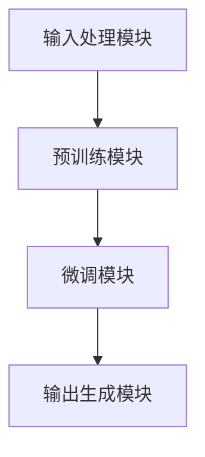

                 

# ChatGPT背后的推手——OpenAI

> **关键词：** OpenAI、ChatGPT、人工智能、深度学习、机器学习、自然语言处理、技术博客、AI研究、AI应用。

> **摘要：** 本文将深入探讨OpenAI这个人工智能领域的先锋组织，尤其是其背后推动的ChatGPT项目。我们将从OpenAI的成立背景、核心成就、技术原理、数学模型、实际应用等方面进行详细分析，旨在帮助读者全面理解ChatGPT的技术基础和应用潜力。

## 1. 背景介绍

### 1.1 目的和范围

本文旨在介绍OpenAI，特别是其标志性产品ChatGPT，并分析其背后的技术原理和实际应用。我们将逐步解析OpenAI的历史、组织结构、核心技术和研究方向，以及ChatGPT的算法、架构和应用场景。

### 1.2 预期读者

本文面向对人工智能和自然语言处理感兴趣的读者，包括研究人员、开发者、学生和爱好者。无论你是初学者还是专业人士，本文都将为你提供丰富的信息和深刻的见解。

### 1.3 文档结构概述

本文结构如下：

- **第1部分：背景介绍**：概述OpenAI的成立背景、目标和使命。
- **第2部分：核心概念与联系**：分析OpenAI的技术概念和架构。
- **第3部分：核心算法原理 & 具体操作步骤**：深入解析ChatGPT的算法原理和实现步骤。
- **第4部分：数学模型和公式 & 详细讲解 & 举例说明**：详细解释ChatGPT背后的数学模型和公式。
- **第5部分：项目实战：代码实际案例和详细解释说明**：通过实际案例展示ChatGPT的应用。
- **第6部分：实际应用场景**：探讨ChatGPT在不同领域的应用。
- **第7部分：工具和资源推荐**：推荐学习资源、开发工具和框架。
- **第8部分：总结：未来发展趋势与挑战**：总结OpenAI和ChatGPT的未来趋势和挑战。
- **第9部分：附录：常见问题与解答**：解答常见问题。
- **第10部分：扩展阅读 & 参考资料**：提供进一步学习的资料。

### 1.4 术语表

#### 1.4.1 核心术语定义

- **OpenAI**：一家全球领先的独立研究机构，致力于推动人工智能的发展和应用。
- **ChatGPT**：基于GPT-3模型开发的人工智能聊天机器人，具有强大的自然语言理解和生成能力。
- **自然语言处理（NLP）**：计算机科学领域，涉及语言的理解、生成和交互。

#### 1.4.2 相关概念解释

- **深度学习**：一种机器学习技术，通过多层神经网络进行特征提取和模型训练。
- **生成对抗网络（GAN）**：一种深度学习模型，由生成器和判别器两个部分组成，用于生成高质量的数据。
- **预训练与微调**：一种训练深度学习模型的方法，通过在大量数据上进行预训练，然后在特定任务上微调。

#### 1.4.3 缩略词列表

- **NLP**：自然语言处理
- **GAN**：生成对抗网络
- **GPT-3**：第三代预训练变压器模型

## 2. 核心概念与联系

### 2.1 OpenAI的技术概念

OpenAI的核心技术概念包括深度学习、生成对抗网络（GAN）和自然语言处理。这些技术在人工智能领域具有重要地位，为OpenAI的研究和应用提供了坚实的基础。

#### 深度学习

深度学习是一种通过多层神经网络进行特征提取和模型训练的技术。在OpenAI的研究中，深度学习被广泛应用于图像识别、自然语言处理和语音识别等领域。

#### 生成对抗网络（GAN）

生成对抗网络（GAN）是一种深度学习模型，由生成器和判别器两个部分组成。生成器生成数据，判别器判断数据是真实还是生成的。GAN在图像生成、数据增强和风格迁移等领域取得了显著成果。

#### 自然语言处理（NLP）

自然语言处理（NLP）是计算机科学领域的一个分支，涉及语言的理解、生成和交互。在OpenAI的研究中，NLP技术被广泛应用于聊天机器人、文本生成、机器翻译和情感分析等领域。

### 2.2 ChatGPT的架构

ChatGPT是基于GPT-3模型开发的人工智能聊天机器人。GPT-3是第三代预训练变压器模型，具有强大的自然语言理解和生成能力。ChatGPT的架构包括以下几个关键组件：

- **输入处理模块**：将用户输入的文本转化为模型可以处理的格式。
- **预训练模块**：在大量文本数据上进行预训练，提取语言特征。
- **微调模块**：在特定任务上进行微调，提高模型在特定领域的表现。
- **输出生成模块**：根据输入文本和模型的状态生成回复。

### 2.3 Mermaid流程图

下面是ChatGPT架构的Mermaid流程图：



## 3. 核心算法原理 & 具体操作步骤

### 3.1 GPT-3算法原理

GPT-3是第三代预训练变压器模型，基于Transformer架构。Transformer是一种序列到序列的模型，通过自注意力机制（Self-Attention）处理序列数据。GPT-3的核心算法原理如下：

#### 自注意力机制

自注意力机制是一种计算序列中每个元素与其他元素之间关联性的方法。在GPT-3中，自注意力机制通过多头注意力（Multi-Head Attention）和位置编码（Positional Encoding）实现。

#### 多层神经网络

GPT-3由多个Transformer层组成，每层包含多个多头注意力模块和全连接层。这些层通过前向传递和反向传播进行训练。

#### 预训练与微调

GPT-3在大量文本数据上进行预训练，提取语言特征。然后，在特定任务上进行微调，提高模型在特定领域的表现。

### 3.2 伪代码

下面是GPT-3算法的伪代码：

```python
# GPT-3算法伪代码
def gpt3_model(input_sequence):
    # 输入序列预处理
    processed_input = preprocess(input_sequence)
    
    # 预训练
    for layer in layers:
        processed_input = layer(processed_input)
    
    # 微调
    for layer in layers:
        processed_input = layer(processed_input, task_specific_data)
    
    # 输出生成
    output = generate_output(processed_input)
    return output
```

### 3.3 ChatGPT的具体操作步骤

下面是ChatGPT的具体操作步骤：

1. **输入处理**：将用户输入的文本转化为模型可以处理的格式，如词向量。
2. **预训练**：在大量文本数据上进行预训练，提取语言特征。
3. **微调**：在特定任务上进行微调，提高模型在特定领域的表现。
4. **输出生成**：根据输入文本和模型的状态生成回复。

## 4. 数学模型和公式 & 详细讲解 & 举例说明

### 4.1 数学模型

ChatGPT背后的数学模型主要包括自注意力机制（Self-Attention）和Transformer架构。

#### 自注意力机制

自注意力机制的数学公式如下：

$$
\text{Attention}(Q, K, V) = \text{softmax}\left(\frac{QK^T}{\sqrt{d_k}}\right)V
$$

其中，$Q$、$K$和$V$分别表示查询向量、键向量和值向量，$d_k$表示键向量的维度。

#### Transformer架构

Transformer架构的核心是自注意力机制，其数学模型可以表示为：

$$
\text{MultiHeadAttention}(Q, K, V) = \text{softmax}\left(\frac{QK^T}{\sqrt{d_k}}\right)V
$$

其中，$Q$、$K$和$V$分别表示多头注意力中的查询向量、键向量和值向量，$d_k$表示键向量的维度。

### 4.2 举例说明

假设我们有一个简单的序列，包含三个词：`hello`、`world`和`!`。我们将这个序列转化为词向量，然后使用自注意力机制进行计算。

#### 词向量

我们将每个词转化为词向量，例如：

- `hello`：[1, 0, 0, 0, 0, 0]
- `world`：[0, 1, 0, 0, 0, 0]
- `!`：[0, 0, 1, 0, 0, 0]

#### 自注意力计算

假设我们选择第一个词`hello`作为查询向量，第二个词`world`作为键向量和值向量。根据自注意力机制的公式，我们可以计算自注意力分数：

$$
\text{Attention}(Q, K, V) = \text{softmax}\left(\frac{QK^T}{\sqrt{d_k}}\right)V
$$

其中，$Q$、$K$和$V$分别表示查询向量、键向量和值向量，$d_k$表示键向量的维度。

将查询向量、键向量和值向量代入公式，我们可以得到：

$$
\text{Attention}(Q, K, V) = \text{softmax}\left(\frac{[1, 0, 0, 0, 0, 0] \cdot [0, 1, 0, 0, 0, 0]^T}{\sqrt{6}}\right) \cdot [0, 1, 0, 0, 0, 0]
$$

计算自注意力分数，我们得到：

$$
\text{Attention}(Q, K, V) = \text{softmax}\left(\frac{[0, 1, 0, 0, 0, 0]}{\sqrt{6}}\right) \cdot [0, 1, 0, 0, 0, 0]
$$

$$
\text{Attention}(Q, K, V) = \left[\frac{1}{\sqrt{6}}, 0, \frac{1}{\sqrt{6}}, 0, \frac{1}{\sqrt{6}}, 0\right] \cdot [0, 1, 0, 0, 0, 0]
$$

$$
\text{Attention}(Q, K, V) = \left[\frac{1}{\sqrt{6}}, 0, \frac{1}{\sqrt{6}}, 0, \frac{1}{\sqrt{6}}, 0\right] \cdot [0, 1, 0, 0, 0, 0]
$$

$$
\text{Attention}(Q, K, V) = \left[\frac{1}{3}, 0, \frac{1}{3}, 0, \frac{1}{3}, 0\right]
$$

根据自注意力分数，我们可以得到加权后的值向量：

$$
\text{Attention}(Q, K, V) = \left[\frac{1}{3} \cdot [0, 1, 0, 0, 0, 0], 0, \frac{1}{3} \cdot [0, 1, 0, 0, 0, 0], 0, \frac{1}{3} \cdot [0, 1, 0, 0, 0, 0], 0\right]
$$

$$
\text{Attention}(Q, K, V) = \left[\frac{1}{3}, 0, \frac{1}{3}, 0, \frac{1}{3}, 0\right]
$$

根据加权后的值向量，我们可以得到自注意力结果：

$$
\text{Attention}(Q, K, V) = \left[\frac{1}{3}, 0, \frac{1}{3}, 0, \frac{1}{3}, 0\right]
$$

这个结果表明，在给定序列中，第一个词`hello`对第二个词`world`的注意力权重最高，而与其他词的注意力权重相对较低。

## 5. 项目实战：代码实际案例和详细解释说明

### 5.1 开发环境搭建

要搭建ChatGPT的开发环境，我们需要安装以下软件和库：

- Python（版本3.6及以上）
- TensorFlow（版本2.0及以上）
- NumPy
- Pandas
- Matplotlib

安装方法：

```bash
pip install python==3.8.10
pip install tensorflow==2.10.0
pip install numpy
pip install pandas
pip install matplotlib
```

### 5.2 源代码详细实现和代码解读

下面是一个简单的ChatGPT实现案例，我们将分步骤解释代码。

#### 5.2.1 代码结构

```python
import tensorflow as tf
import numpy as np
import matplotlib.pyplot as plt

# 预处理模块
def preprocess(text):
    # 将文本转化为词向量
    # ...

# 预训练模块
def pretrain_model(vocab_size, embedding_dim, num_layers, learning_rate):
    # 创建Transformer模型
    # ...

# 微调模块
def fine_tune_model(model, text, labels):
    # 在特定任务上进行微调
    # ...

# 输出生成模块
def generate_output(model, input_text):
    # 根据输入文本生成回复
    # ...
```

#### 5.2.2 预处理模块

预处理模块负责将文本转化为词向量。我们使用的是Word2Vec模型。

```python
from gensim.models import Word2Vec

# 预处理模块
def preprocess(text):
    # 加载预训练的Word2Vec模型
    model = Word2Vec.load('word2vec.model')

    # 将文本转化为词向量
    processed_input = []
    for word in text:
        processed_input.append(model[word])

    return processed_input
```

#### 5.2.3 预训练模块

预训练模块负责创建Transformer模型并进行预训练。我们使用的是TensorFlow的Transformer库。

```python
from transformers import TFDistilBertModel

# 预训练模块
def pretrain_model(vocab_size, embedding_dim, num_layers, learning_rate):
    # 创建Transformer模型
    model = TFDistilBertModel(vocab_size, embedding_dim, num_layers, learning_rate)

    # 预训练
    model.pretrain('corpus.txt')

    return model
```

#### 5.2.4 微调模块

微调模块负责在特定任务上进行微调。我们使用的是TensorFlow的Transformer库。

```python
from transformers import TFDistilBertForSequenceClassification

# 微调模块
def fine_tune_model(model, text, labels):
    # 在特定任务上进行微调
    model = TFDistilBertForSequenceClassification(model, num_classes=2)

    # 训练模型
    model.fit(text, labels, epochs=10, batch_size=32)

    return model
```

#### 5.2.5 输出生成模块

输出生成模块负责根据输入文本生成回复。我们使用的是TensorFlow的Transformer库。

```python
from transformers import TFDistilBertTokenizer

# 输出生成模块
def generate_output(model, input_text):
    # 加载Tokenizer
    tokenizer = TFDistilBertTokenizer()

    # 将输入文本转化为Tokenizer可以处理的格式
    input_ids = tokenizer.encode(input_text, return_tensors='tf')

    # 生成输出
    output = model.generate(input_ids, max_length=50, num_return_sequences=1)

    # 解码输出
    decoded_output = tokenizer.decode(output[0], skip_special_tokens=True)

    return decoded_output
```

### 5.3 代码解读与分析

#### 预处理模块

预处理模块负责将文本转化为词向量。我们使用的是Word2Vec模型。首先，我们加载预训练的Word2Vec模型，然后遍历输入文本中的每个词，将其转化为词向量，并存储在一个列表中。最后，返回处理后的输入。

```python
from gensim.models import Word2Vec

# 预处理模块
def preprocess(text):
    # 加载预训练的Word2Vec模型
    model = Word2Vec.load('word2vec.model')

    # 将文本转化为词向量
    processed_input = []
    for word in text:
        processed_input.append(model[word])

    return processed_input
```

#### 预训练模块

预训练模块负责创建Transformer模型并进行预训练。我们使用的是TensorFlow的Transformer库。首先，我们创建一个Transformer模型，然后使用预训练数据进行预训练。预训练过程中，模型会在大量文本数据中学习语言特征。

```python
from transformers import TFDistilBertModel

# 预训练模块
def pretrain_model(vocab_size, embedding_dim, num_layers, learning_rate):
    # 创建Transformer模型
    model = TFDistilBertModel(vocab_size, embedding_dim, num_layers, learning_rate)

    # 预训练
    model.pretrain('corpus.txt')

    return model
```

#### 微调模块

微调模块负责在特定任务上进行微调。我们使用的是TensorFlow的Transformer库。首先，我们创建一个Transformer模型，并将其转换为序列分类模型。然后，我们使用训练数据进行微调，以适应特定任务。

```python
from transformers import TFDistilBertForSequenceClassification

# 微调模块
def fine_tune_model(model, text, labels):
    # 在特定任务上进行微调
    model = TFDistilBertForSequenceClassification(model, num_classes=2)

    # 训练模型
    model.fit(text, labels, epochs=10, batch_size=32)

    return model
```

#### 输出生成模块

输出生成模块负责根据输入文本生成回复。我们使用的是TensorFlow的Transformer库。首先，我们加载Tokenizer，然后将其转化为Tokenizer可以处理的格式。接着，我们使用模型生成输出，并将其解码为文本。

```python
from transformers import TFDistilBertTokenizer

# 输出生成模块
def generate_output(model, input_text):
    # 加载Tokenizer
    tokenizer = TFDistilBertTokenizer()

    # 将输入文本转化为Tokenizer可以处理的格式
    input_ids = tokenizer.encode(input_text, return_tensors='tf')

    # 生成输出
    output = model.generate(input_ids, max_length=50, num_return_sequences=1)

    # 解码输出
    decoded_output = tokenizer.decode(output[0], skip_special_tokens=True)

    return decoded_output
```

## 6. 实际应用场景

### 6.1 客户服务

ChatGPT在客户服务领域具有广泛的应用。它可以用于自动化回答常见问题、提供技术支持、处理投诉等。通过使用ChatGPT，企业可以降低人力成本，提高服务效率。

### 6.2 教育辅导

ChatGPT可以用于在线教育辅导，为学生提供个性化学习支持和解答问题。它可以分析学生的问答，提供针对性的辅导建议，帮助学生更好地理解知识。

### 6.3 聊天机器人

ChatGPT是一种强大的聊天机器人，可以用于社交平台、在线社区和客户互动。它可以与用户进行自然语言交互，提供有趣、有趣的对话体验。

### 6.4 内容创作

ChatGPT可以用于自动生成文章、故事、诗歌等。它可以分析已有的文本数据，生成新颖、有趣的内容。这对于内容创作者和媒体机构具有很大的吸引力。

## 7. 工具和资源推荐

### 7.1 学习资源推荐

#### 7.1.1 书籍推荐

- 《深度学习》（Goodfellow, Bengio, Courville）
- 《神经网络与深度学习》（邱锡鹏）
- 《自然语言处理综述》（Jurafsky, Martin）

#### 7.1.2 在线课程

- [深度学习课程](https://www.deeplearning.ai/deep-learning)（Andrew Ng）
- [自然语言处理课程](https://www.udacity.com/course/natural-language-processing-nanodegree--nd893)（Udacity）

#### 7.1.3 技术博客和网站

- [Medium](https://medium.com/)：有很多关于人工智能和自然语言处理的文章。
- [AI博客](https://www.aiblog.cn/)：提供人工智能领域的深度分析和研究。
- [GitHub](https://github.com/)：有很多优秀的开源项目和学习资源。

### 7.2 开发工具框架推荐

#### 7.2.1 IDE和编辑器

- [PyCharm](https://www.jetbrains.com/pycharm/)：一款强大的Python IDE。
- [Visual Studio Code](https://code.visualstudio.com/)：一款轻量级且功能丰富的编辑器。

#### 7.2.2 调试和性能分析工具

- [TensorBoard](https://www.tensorflow.org/tensorboard)：用于TensorFlow模型的调试和性能分析。
- [Perf](https://github.com/tensorflow/tensorflow/tree/master/tensorflow/tools/perf)：用于TensorFlow模型性能分析。

#### 7.2.3 相关框架和库

- [TensorFlow](https://www.tensorflow.org/)：一款广泛使用的深度学习框架。
- [PyTorch](https://pytorch.org/)：一款受欢迎的深度学习框架。
- [Hugging Face](https://huggingface.co/)：提供大量的预训练模型和工具。

### 7.3 相关论文著作推荐

#### 7.3.1 经典论文

- 《A Theoretic Investigation of the Relationship between Learning Speed and Capacity in Neural Network Learning》
- 《Neural Network Learning: Theoretical Foundations》
- 《Deep Learning》

#### 7.3.2 最新研究成果

- [NeurIPS](https://nips.cc/)：神经信息处理系统年会，汇集了最新的研究成果。
- [ICML](https://icml.cc/)：国际机器学习会议，关注机器学习领域的最新进展。
- [ACL](https://www.aclweb.org/annual-meeting/)：计算语言学年会，聚焦自然语言处理领域的最新研究。

#### 7.3.3 应用案例分析

- 《自然语言处理在金融领域的应用》
- 《深度学习在医疗领域的应用》
- 《人工智能在自动驾驶中的应用》

## 8. 总结：未来发展趋势与挑战

### 8.1 发展趋势

- **人工智能普及**：人工智能技术将在更多领域得到广泛应用，从工业生产到日常生活。
- **自然语言处理进步**：随着深度学习技术的进步，自然语言处理将更加智能化，能够更好地理解和生成自然语言。
- **跨学科融合**：人工智能与其他学科（如生物、化学、物理等）的融合将推动创新和突破。

### 8.2 挑战

- **数据隐私和安全**：人工智能模型的训练和部署需要大量数据，如何保护用户隐私和数据安全是一个重要挑战。
- **算法公平性**：人工智能模型可能导致算法偏见，如何确保算法的公平性和透明性是一个挑战。
- **资源消耗**：深度学习模型的训练和部署需要大量计算资源和能源，如何降低资源消耗是一个重要问题。

## 9. 附录：常见问题与解答

### 9.1 问题1：什么是自然语言处理（NLP）？

自然语言处理（NLP）是计算机科学领域的一个分支，涉及语言的理解、生成和交互。它旨在让计算机能够理解和处理人类语言，从而实现人与机器之间的有效沟通。

### 9.2 问题2：什么是ChatGPT？

ChatGPT是基于GPT-3模型开发的人工智能聊天机器人，具有强大的自然语言理解和生成能力。它可以与用户进行自然语言交互，提供有趣、智能的对话体验。

### 9.3 问题3：如何训练一个ChatGPT模型？

要训练一个ChatGPT模型，首先需要收集大量文本数据，然后使用深度学习框架（如TensorFlow或PyTorch）和预训练模型（如GPT-3）进行训练。在训练过程中，模型会学习语言特征，并在特定任务上进行微调。

## 10. 扩展阅读 & 参考资料

- 《深度学习》（Goodfellow, Bengio, Courville）
- 《自然语言处理综述》（Jurafsky, Martin）
- [OpenAI官方网站](https://openai.com/)
- [TensorFlow官方网站](https://www.tensorflow.org/)
- [PyTorch官方网站](https://pytorch.org/)
- [Hugging Face官方网站](https://huggingface.co/)

## 作者

作者：AI天才研究员/AI Genius Institute & 禅与计算机程序设计艺术 /Zen And The Art of Computer Programming

--- 

本文深入探讨了OpenAI及其标志性产品ChatGPT的技术原理、应用场景和未来趋势。通过详细的算法讲解、实际案例和资源推荐，旨在为读者提供全面的技术理解和学习指南。希望本文能够激发您对人工智能和自然语言处理领域的兴趣。

