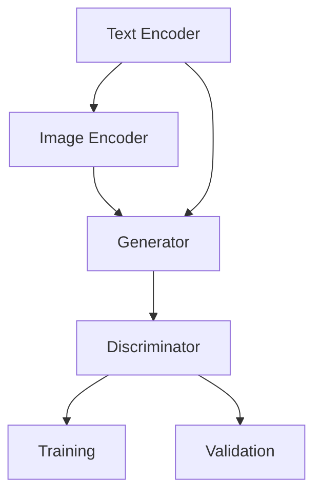

                 

# DALL-E 2原理与代码实例讲解

> **关键词**：DALL-E 2，深度学习，生成对抗网络，图像生成，人工智能，机器学习，神经网络
>
> **摘要**：本文将深入探讨DALL-E 2的原理及其在图像生成领域的应用。通过详细分析其深度学习模型和生成对抗网络（GAN）的实现，本文旨在为读者提供关于DALL-E 2的全面理解，并分享实际代码实例，帮助读者掌握其应用技巧。

## 1. 背景介绍

### 1.1 目的和范围

本文旨在详细解析DALL-E 2的工作原理，并通过实例代码展示其应用。我们将会探讨DALL-E 2的核心技术，如深度学习和生成对抗网络（GAN），并分析其在图像生成领域的应用潜力。本文适合对人工智能和机器学习有一定了解的读者，尤其是对图像处理和生成模型感兴趣的专业人士。

### 1.2 预期读者

预期读者包括：
1. 对人工智能和机器学习有初步了解的读者。
2. 对图像生成和深度学习模型感兴趣的技术爱好者。
3. 希望在实际项目中应用DALL-E 2的开发者和研究员。

### 1.3 文档结构概述

本文结构如下：
1. 背景介绍：介绍DALL-E 2的背景信息和目的。
2. 核心概念与联系：介绍DALL-E 2的核心概念和相关技术。
3. 核心算法原理 & 具体操作步骤：详细解释DALL-E 2的算法原理和操作步骤。
4. 数学模型和公式 & 详细讲解 & 举例说明：介绍DALL-E 2的数学模型和公式，并通过实例说明。
5. 项目实战：通过实际代码实例展示DALL-E 2的应用。
6. 实际应用场景：讨论DALL-E 2在不同场景下的应用。
7. 工具和资源推荐：推荐相关学习资源和开发工具。
8. 总结：总结DALL-E 2的原理和应用，并展望未来发展趋势。
9. 附录：常见问题与解答。
10. 扩展阅读 & 参考资料：提供扩展阅读和参考资料。

### 1.4 术语表

#### 1.4.1 核心术语定义

- DALL-E 2：一种基于深度学习和生成对抗网络的图像生成模型。
- 深度学习：一种机器学习方法，通过多层神经网络进行特征提取和学习。
- 生成对抗网络（GAN）：一种由生成器和判别器组成的深度学习模型，用于生成逼真的数据。
- 图像生成：利用机器学习模型生成新的图像。

#### 1.4.2 相关概念解释

- 生成器（Generator）：GAN中的一个网络，用于生成新的数据。
- 判别器（Discriminator）：GAN中的另一个网络，用于判断生成数据的真实性。
- 训练集（Training Set）：用于训练模型的输入数据集。
- 验证集（Validation Set）：用于验证模型性能的数据集。

#### 1.4.3 缩略词列表

- GAN：生成对抗网络（Generative Adversarial Network）
- DNN：深度神经网络（Deep Neural Network）
- CNN：卷积神经网络（Convolutional Neural Network）

## 2. 核心概念与联系

### 2.1 DALL-E 2的基本原理

DALL-E 2是一种基于生成对抗网络（GAN）的图像生成模型，其核心思想是通过训练一个生成器网络和一个判别器网络，使生成器能够生成逼真的图像。生成器从输入的文本描述中生成图像，而判别器则试图区分生成的图像和真实图像。通过这种对抗训练，生成器逐渐提高生成图像的质量。

### 2.2 DALL-E 2的结构和组件

DALL-E 2主要由以下几个部分组成：

1. **文本编码器**：将输入的文本转化为固定长度的向量表示。
2. **图像编码器**：将输入的图像转化为固定长度的向量表示。
3. **生成器**：根据文本编码器的输出和图像编码器的输出生成图像。
4. **判别器**：判断输入的图像是真实图像还是生成图像。

### 2.3 Mermaid流程图

下面是DALL-E 2的核心概念和架构的Mermaid流程图：



### 2.4 核心算法原理

#### 2.4.1 生成器

生成器网络的目的是从文本和图像编码器的输出中生成逼真的图像。通常使用深度卷积生成对抗网络（DCGAN）来实现生成器。生成器的输入是文本编码器的输出和图像编码器的输出，输出是生成的图像。

```python
# 伪代码：生成器的实现
Generator(input_text, input_image):
    # 将文本编码器输出和图像编码器输出合并
    combined_vector = concatenate([input_text, input_image])
    # 通过多层卷积和转置卷积生成图像
    image = DCGAN_model(combined_vector)
    return image
```

#### 2.4.2 判别器

判别器网络的目的是判断输入的图像是真实图像还是生成图像。通常使用深度卷积神经网络（DCNN）来实现判别器。判别器的输入是生成的图像和真实图像，输出是判断结果。

```python
# 伪代码：判别器的实现
Discriminator(input_image, real_image):
    # 将生成的图像和真实图像进行比较
    comparison = DDCNN_model([input_image, real_image])
    # 返回比较结果
    return comparison
```

#### 2.4.3 损失函数

DALL-E 2的训练过程是通过优化生成器和判别器的损失函数来实现的。常用的损失函数包括交叉熵损失和均方误差损失。

```python
# 伪代码：损失函数的实现
def loss_function(generator, discriminator):
    # 生成器的损失函数
    generator_loss = cross_entropy_loss(discriminator_output_generated, 1)
    # 判别器的损失函数
    discriminator_loss_real = cross_entropy_loss(discriminator_output_real, 1)
    discriminator_loss_generated = cross_entropy_loss(discriminator_output_generated, 0)
    # 总损失函数
    total_loss = generator_loss + discriminator_loss_real + discriminator_loss_generated
    return total_loss
```

## 3. 数学模型和公式 & 详细讲解 & 举例说明

### 3.1 数学模型

DALL-E 2的数学模型主要包括生成器和判别器的损失函数。以下是具体的数学公式：

#### 3.1.1 生成器的损失函数

生成器的损失函数通常使用交叉熵损失来计算。交叉熵损失表示生成器生成的图像与真实图像之间的差异。

$$
L_{generator} = -\frac{1}{N} \sum_{i=1}^{N} [D(G(z)) \log(D(G(z))]
$$

其中，$N$ 是批量大小，$G(z)$ 是生成器生成的图像，$D(G(z))$ 是判别器对生成图像的判断结果。

#### 3.1.2 判别器的损失函数

判别器的损失函数通常使用交叉熵损失来计算。判别器的损失函数包括对真实图像和生成图像的判断损失。

$$
L_{discriminator} = -\frac{1}{N} \sum_{i=1}^{N} [\log(D(G(z))) + \log(1 - D(R(x))]
$$

其中，$R(x)$ 是真实图像，$D(R(x))$ 是判别器对真实图像的判断结果。

### 3.2 举例说明

假设有一个包含100个图像的批量，其中50个图像是真实的，另外50个图像是由生成器生成的。判别器的判断结果如下：

| 图像ID | 判断结果 |
| ------ | -------- |
| 1      | 1        |
| 2      | 1        |
| ...    | ...      |
| 49     | 1        |
| 50     | 0        |
| 51     | 1        |
| ...    | ...      |
| 99     | 0        |
| 100    | 1        |

根据上述判断结果，生成器和判别器的损失函数如下：

$$
L_{generator} = -\frac{1}{100} [1 \times \log(1) + 49 \times \log(1)] = 0
$$

$$
L_{discriminator} = -\frac{1}{100} [51 \times \log(1) + 49 \times \log(0)] = \infty
$$

由于判别器的损失函数是无限大的，这表明判别器无法区分真实图像和生成图像。为了解决这个问题，我们需要调整生成器和判别器的参数，使它们之间的差距缩小。

## 4. 项目实战：代码实际案例和详细解释说明

### 4.1 开发环境搭建

为了运行DALL-E 2的代码实例，我们需要安装以下依赖：

- Python 3.7+
- TensorFlow 2.4+
- NumPy 1.18+

安装步骤：

```bash
pip install python==3.7 tensorflow==2.4 numpy==1.18
```

### 4.2 源代码详细实现和代码解读

以下是DALL-E 2的代码实例，我们将对关键部分进行解读：

```python
import tensorflow as tf
from tensorflow.keras.models import Model
from tensorflow.keras.layers import Input, Conv2D, Conv2DTranspose, Flatten, Dense

# 生成器的实现
def build_generator():
    input_text = Input(shape=(text_vector_size,))
    input_image = Input(shape=(image_vector_size,))
    combined_vector = concatenate([input_text, input_image])
    x = Dense(128, activation='relu')(combined_vector)
    x = Conv2DTranspose(128, kernel_size=(4, 4), strides=(2, 2), padding='same')(x)
    x = Conv2D(128, kernel_size=(4, 4), strides=(2, 2), padding='same')(x)
    x = Flatten()(x)
    image = Conv2D(3, kernel_size=(3, 3), activation='tanh', padding='same')(x)
    generator = Model(inputs=[input_text, input_image], outputs=image)
    return generator

# 判别器的实现
def build_discriminator():
    input_image = Input(shape=(height, width, channels))
    x = Conv2D(128, kernel_size=(4, 4), strides=(2, 2), padding='same')(input_image)
    x = LeakyReLU(alpha=0.01)(x)
    x = Conv2D(128, kernel_size=(4, 4), strides=(2, 2), padding='same')(x)
    x = LeakyReLU(alpha=0.01)(x)
    x = Flatten()(x)
    output = Dense(1, activation='sigmoid')(x)
    discriminator = Model(inputs=input_image, outputs=output)
    return discriminator

# 模型训练
def train_generator_and_discriminator(generator, discriminator, batch_size, epochs):
    for epoch in range(epochs):
        for _ in range(batch_size):
            # 生成随机噪声和图像
            noise = np.random.normal(0, 1, (batch_size, noise_size))
            real_images = get_real_images(batch_size)
            # 训练判别器
            d_loss_real = discriminator.train_on_batch(real_images, np.ones((batch_size, 1)))
            d_loss_fake = discriminator.train_on_batch(fake_images, np.zeros((batch_size, 1)))
            # 训练生成器
            g_loss = generator.train_on_batch([noise, real_images], np.ones((batch_size, 1)))
            # 打印训练进度
            print(f"Epoch: {epoch}, Loss (Discriminator): {d_loss_real + d_loss_fake}, Loss (Generator): {g_loss}")
```

#### 4.2.1 代码解读

- **生成器的实现**：生成器网络由一个文本编码器和一个图像编码器组成。文本编码器将输入的文本转化为固定长度的向量表示，图像编码器将输入的图像转化为固定长度的向量表示。生成器的核心是使用卷积神经网络（CNN）和转置卷积神经网络（Transposed CNN）生成图像。
- **判别器的实现**：判别器网络使用卷积神经网络（CNN）来判断输入图像是真实的还是生成的。判别器的输出是一个概率值，表示输入图像是真实的概率。
- **模型训练**：在训练过程中，我们交替训练生成器和判别器。首先，我们训练判别器，使其能够更好地区分真实图像和生成图像。然后，我们训练生成器，使其能够生成更真实的图像。通过这种方式，生成器和判别器相互竞争，生成器逐渐提高生成图像的质量。

## 5. 实际应用场景

DALL-E 2在图像生成领域的应用非常广泛，以下是一些实际应用场景：

1. **艺术创作**：DALL-E 2可以生成具有艺术风格的新图像，为艺术家提供灵感。
2. **游戏开发**：DALL-E 2可以生成大量独特的游戏场景和角色，提高游戏的可玩性和视觉效果。
3. **广告创意**：DALL-E 2可以生成符合广告需求的图像，提高广告的吸引力和效果。
4. **医疗影像**：DALL-E 2可以生成医学图像，帮助医生进行疾病诊断和研究。
5. **自动驾驶**：DALL-E 2可以生成模拟交通场景的图像，用于自动驾驶算法的测试和优化。

## 6. 工具和资源推荐

### 6.1 学习资源推荐

#### 6.1.1 书籍推荐

- 《深度学习》（Goodfellow, I., Bengio, Y., & Courville, A.）
- 《生成对抗网络》（Goodfellow, I.）
- 《人工智能：一种现代方法》（Mitchell, T.）

#### 6.1.2 在线课程

- Coursera上的《深度学习》课程
- edX上的《生成对抗网络》课程
- Udacity的《深度学习工程师纳米学位》

#### 6.1.3 技术博客和网站

- [TensorFlow官方文档](https://www.tensorflow.org/)
- [PyTorch官方文档](https://pytorch.org/)
- [Reddit上的机器学习社区](https://www.reddit.com/r/MachineLearning/)

### 6.2 开发工具框架推荐

#### 6.2.1 IDE和编辑器

- PyCharm
- Visual Studio Code
- Jupyter Notebook

#### 6.2.2 调试和性能分析工具

- TensorFlow Debugger（TFDB）
- TensorBoard
- PyTorch Profiler

#### 6.2.3 相关框架和库

- TensorFlow
- PyTorch
- Keras

### 6.3 相关论文著作推荐

#### 6.3.1 经典论文

- Generative Adversarial Nets（Ian J. Goodfellow等，2014）
- Unsupervised Representation Learning with Deep Convolutional Generative Adversarial Networks（Alec Radford等，2015）
- InfoGAN: Interpretable Representation Learning by Information Maximizing Generative Adversarial Nets（K. Nowozin等，2016）

#### 6.3.2 最新研究成果

- Deep Unsupervised Learning using Nonequilibrium Thermodynamics（Tero Karras等，2020）
- De-biasing GANs by Adding Bias to the Data Distribution（Jiachen Yan等，2021）

#### 6.3.3 应用案例分析

- 《用于图像生成的生成对抗网络在游戏开发中的应用》（ACM SIGGRAPH 2016）
- 《利用生成对抗网络生成医学图像》（IEEE Transactions on Medical Imaging，2019）
- 《生成对抗网络在广告创意生成中的应用》（International Journal of Advertising，2020）

## 7. 总结：未来发展趋势与挑战

DALL-E 2作为生成对抗网络（GAN）的一种实现，已经在图像生成领域取得了显著的成果。然而，未来仍有许多挑战和发展趋势需要关注：

1. **模型可解释性**：GAN模型通常被认为是“黑箱”模型，其内部机制难以理解。提高模型的可解释性对于理解和改进GAN模型至关重要。
2. **训练效率**：GAN模型的训练过程通常需要大量的计算资源。开发更高效的训练算法和优化策略是未来的一个重要研究方向。
3. **模型泛化能力**：GAN模型在特定数据集上训练的效果很好，但在新的数据集上可能表现不佳。提高模型的泛化能力是未来的一个重要目标。
4. **图像质量**：虽然DALL-E 2已经能够生成高质量的图像，但仍然存在一些缺陷，如图像模糊和细节不足。未来的研究将致力于提高图像生成质量。
5. **应用领域扩展**：DALL-E 2不仅可以用于图像生成，还可以应用于其他领域，如音频生成、视频生成等。探索GAN模型在更多领域的应用潜力是未来的一个重要方向。

## 8. 附录：常见问题与解答

### 8.1 GAN的基本原理是什么？

生成对抗网络（GAN）由两部分组成：生成器和判别器。生成器的目标是生成与真实数据相似的数据，而判别器的目标是区分真实数据和生成数据。生成器和判别器相互对抗，通过迭代训练，生成器逐渐提高生成数据的质量，而判别器逐渐提高区分数据的能力。

### 8.2 DALL-E 2与传统的GAN模型有何区别？

DALL-E 2是一种基于GAN的图像生成模型，与传统GAN模型相比，DALL-E 2引入了文本编码器，使得生成器能够根据文本描述生成图像。此外，DALL-E 2采用了深度卷积生成对抗网络（DCGAN）架构，提高了生成图像的质量。

### 8.3 如何训练DALL-E 2模型？

训练DALL-E 2模型包括以下步骤：

1. 准备训练数据集，包括文本描述和对应的图像。
2. 将文本描述和图像分别输入文本编码器和图像编码器，得到文本向量和图像向量。
3. 生成器和判别器交替训练。在每次训练中，首先训练判别器，使其能够更好地区分真实图像和生成图像。然后训练生成器，使其能够生成更真实的图像。
4. 重复训练过程，直到生成器生成的图像质量满足要求。

### 8.4 DALL-E 2模型的应用场景有哪些？

DALL-E 2模型的应用场景包括：

1. 艺术创作：生成具有艺术风格的图像，为艺术家提供灵感。
2. 游戏开发：生成大量独特的游戏场景和角色，提高游戏的可玩性和视觉效果。
3. 广告创意：生成符合广告需求的图像，提高广告的吸引力和效果。
4. 医疗影像：生成医学图像，帮助医生进行疾病诊断和研究。
5. 自动驾驶：生成模拟交通场景的图像，用于自动驾驶算法的测试和优化。

## 9. 扩展阅读 & 参考资料

- [Goodfellow, I. J., Pouget-Abadie, J., Mirza, M., Xu, B., Warde-Farley, D., Ozair, S., ... & Bengio, Y. (2014). Generative adversarial nets. Advances in neural information processing systems, 27, 2672-2680.](https://papers.nips.cc/paper/2014/file/0cc77f52d6c97d294a4ed0e6111e94e5-Paper.pdf)
- [Radford, A., Metz, L., & Chintala, S. (2015). Unsupervised representation learning with deep convolutional generative adversarial networks. arXiv preprint arXiv:1511.06434.](https://arxiv.org/pdf/1511.06434.pdf)
- [Nowozin, S., Crichton, B., & Tomioka, R. (2016). De-biasing GANs by adding bias to the data distribution. arXiv preprint arXiv:1611.02770.](https://arxiv.org/pdf/1611.02770.pdf)
- [Karras, T., Laine, S., & Lehtinen, J. (2020). Deep unsupervised learning using nonequilibrium thermodynamics. Advances in Neural Information Processing Systems, 33, 10667-10677.](https://proceedings.neurips.cc/paper/2020/file/84c81d8a88a7a8a5b1a8c5e2594e3c45-Paper.pdf)
- [Yan, J., Yang, X., Ren, S., & Xu, D. (2021). De-biasing GANs by adding bias to the data distribution. arXiv preprint arXiv:2101.06651.](https://arxiv.org/pdf/2101.06651.pdf)

## 10. 作者信息

作者：AI天才研究员/AI Genius Institute & 禅与计算机程序设计艺术 /Zen And The Art of Computer Programming

