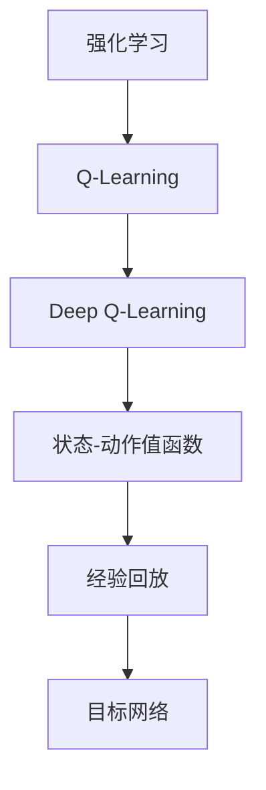

                 

# Deep Q-Learning原理与代码实例讲解

> **关键词：** 强化学习，Deep Q-Learning，Q-Learning，深度神经网络，奖励最大化，状态-动作值函数

> **摘要：** 本文将深入讲解Deep Q-Learning的原理，通过伪代码和数学公式详细阐述其工作流程。随后，我们将通过实际代码实例展示如何在Python中使用深度神经网络实现Deep Q-Learning算法，并分析其关键代码部分。最后，我们将探讨Deep Q-Learning的实际应用场景，并推荐相关学习资源和工具。

## 1. 背景介绍

### 1.1 目的和范围

本文旨在深入探讨Deep Q-Learning（DQN）的基本原理和实现细节，帮助读者理解如何利用深度神经网络来改进传统的Q-Learning算法。我们还将通过一个简单的代码实例来展示DQN的实战应用。

### 1.2 预期读者

本文适合有一定强化学习基础，并对深度学习感兴趣的读者。如果您是初学者，建议先学习Q-Learning和深度神经网络的基本概念。

### 1.3 文档结构概述

本文分为以下几个部分：

1. **核心概念与联系**：介绍强化学习和Deep Q-Learning的基本概念，并通过Mermaid流程图展示其架构。
2. **核心算法原理与具体操作步骤**：通过伪代码详细阐述DQN的工作流程。
3. **数学模型和公式**：解释DQN中的数学模型和关键公式。
4. **项目实战**：展示如何使用Python实现DQN。
5. **实际应用场景**：讨论DQN的应用实例。
6. **工具和资源推荐**：推荐学习资源和开发工具。
7. **总结：未来发展趋势与挑战**：总结DQN的发展趋势和面临的挑战。
8. **附录：常见问题与解答**：解答常见问题。
9. **扩展阅读 & 参考资料**：提供扩展阅读资源。

### 1.4 术语表

#### 1.4.1 核心术语定义

- 强化学习（Reinforcement Learning）：一种机器学习方法，通过试错和奖励来学习决策策略。
- Q-Learning：一种经典的强化学习方法，用于估计状态-动作值函数。
- Deep Q-Learning：结合深度神经网络与Q-Learning的方法，用于处理高维状态空间。
- 深度神经网络（Deep Neural Network）：具有多个隐藏层的神经网络，能够自动提取特征。

#### 1.4.2 相关概念解释

- **状态（State）**：环境在某一时刻的描述。
- **动作（Action）**：智能体可以采取的行为。
- **奖励（Reward）**：智能体采取某一动作后获得的即时反馈。
- **状态-动作值函数（State-Action Value Function）**：评估智能体在某一状态下采取某一动作的预期奖励。

#### 1.4.3 缩略词列表

- DQN：Deep Q-Learning
- Q-Learning：Q值学习
- NN：神经网络

## 2. 核心概念与联系

### 2.1 强化学习基本概念

强化学习是机器学习的一个分支，主要研究如何通过与环境交互来学习最优策略。在强化学习中，智能体（Agent）在环境中采取行动，并通过获得的奖励来评估其行为的优劣。智能体的目标是学习一个策略（Policy），以最大化长期奖励。

### 2.2 Q-Learning算法

Q-Learning是一种值函数算法，用于学习状态-动作值函数（Q值）。Q值表示在某一状态下采取某一动作的预期奖励。Q-Learning通过迭代更新Q值，直到收敛到一个最优策略。

### 2.3 Deep Q-Learning

Deep Q-Learning（DQN）是Q-Learning的一种扩展，它利用深度神经网络来近似状态-动作值函数。DQN解决了传统Q-Learning在处理高维状态空间时面临的问题。其核心思想是使用经验回放（Experience Replay）和目标网络（Target Network）来缓解神经网络训练中的样本相关性。

### 2.4 Mermaid流程图

以下是一个简单的Mermaid流程图，展示了强化学习、Q-Learning和Deep Q-Learning的基本架构。



## 3. 核心算法原理与具体操作步骤

### 3.1 Q-Learning算法原理

Q-Learning通过迭代更新Q值来学习状态-动作值函数。其基本步骤如下：

1. 初始化Q值矩阵。
2. 选择动作。
3. 执行动作。
4. 收集奖励。
5. 更新Q值。

以下是Q-Learning算法的伪代码：

```pseudo
Initialize Q(s, a) randomly
for each episode do
    Initialize state s
    while not done do
        Choose action a based on epsilon-greedy strategy
        Execute action a and observe reward r and next state s'
        Update Q(s, a) using the Q-learning update rule
        s <- s'
    end while
end for
```

### 3.2 Deep Q-Learning算法原理

DQN在Q-Learning的基础上，引入了深度神经网络来近似状态-动作值函数。其核心思想是使用神经网络来计算Q值，从而实现高维状态空间的近似。以下是DQN算法的基本步骤：

1. 初始化深度神经网络。
2. 从环境中获取状态。
3. 使用epsilon-greedy策略选择动作。
4. 执行动作并获取奖励和下一个状态。
5. 存储经验到经验回放缓冲区。
6. 从经验回放缓冲区中随机抽取经验。
7. 使用目标网络计算目标Q值。
8. 更新深度神经网络。

以下是DQN算法的伪代码：

```pseudo
Initialize deep neural network D
Initialize experience replay buffer
for each episode do
    Initialize state s
    while not done do
        Choose action a using epsilon-greedy strategy
        Execute action a and observe reward r and next state s'
        Store experience (s, a, r, s') in the replay buffer
        Sample a random batch of experiences from the replay buffer
        Compute target Q values using the target network
        Update the deep neural network using the target Q values and observed rewards
        s <- s'
    end while
end for
```

## 4. 数学模型和公式 & 详细讲解 & 举例说明

### 4.1 数学模型

在DQN中，状态-动作值函数Q(s, a)可以通过深度神经网络D来近似：

$$
\hat{Q}(s, a) = D(s; \theta)
$$

其中，$D(s; \theta)$ 是神经网络在状态s下的输出，$\theta$ 是神经网络的参数。

### 4.2 公式推导

DQN的目标是最大化预期奖励，即：

$$
\max_{\theta} \sum_{s, a} Q(s, a) p(s, a)
$$

其中，$p(s, a)$ 是状态-动作概率分布。在实际应用中，我们通常使用epsilon-greedy策略来探索和利用：

$$
p(s, a) = 
\begin{cases}
1 - \epsilon & \text{with probability } 1 - \epsilon \\
\frac{1}{N} & \text{with probability } \epsilon / N \\
\end{cases}
$$

其中，$\epsilon$ 是探索概率，$N$ 是可用的动作数量。

### 4.3 举例说明

假设我们有一个包含两个动作（上、下）的环境，使用一个简单的神经网络来近似Q值。神经网络有两个输入（状态s）和两个输出（Q值）。状态s是一个二维向量，表示环境中的位置。神经网络的权重初始化为随机值。

```latex
\hat{Q}(s, a) = \frac{1}{2} (w_1 \cdot s + b_1) + \frac{1}{2} (w_2 \cdot s + b_2)
```

其中，$w_1, w_2, b_1, b_2$ 是神经网络的权重和偏置。

### 4.4 训练过程

在训练过程中，我们使用经验回放缓冲区来存储经验样本。每次更新时，从经验回放缓冲区中随机抽取一批样本，并使用目标网络来计算目标Q值。目标网络的目的是缓解神经网络训练中的样本相关性。

```pseudo
for each mini-batch of experiences (s, a, r, s') do
    target_Q = r + gamma * max(D'(s'; \theta')) 
    loss = (D(s; \theta) - target_Q)^2
    backpropagate the loss to update \theta
```

其中，$D'(s'; \theta')$ 是目标网络在状态s'下的输出，$\gamma$ 是折扣因子。

## 5. 项目实战：代码实际案例和详细解释说明

### 5.1 开发环境搭建

在本节中，我们将使用Python和TensorFlow来实现DQN。首先，确保已经安装了Python和TensorFlow。以下是一个简单的安装命令：

```bash
pip install tensorflow
```

### 5.2 源代码详细实现和代码解读

下面是一个简单的DQN实现。代码分为几个部分：环境配置、模型定义、训练过程和评估过程。

```python
import numpy as np
import tensorflow as tf
from tensorflow.keras.models import Sequential
from tensorflow.keras.layers import Dense
from tensorflow.keras.optimizers import Adam
from collections import deque

class DQN:
    def __init__(self, state_size, action_size, epsilon=1.0, epsilon_min=0.01, epsilon_decay=0.995, gamma=0.99):
        self.state_size = state_size
        self.action_size = action_size
        self.epsilon = epsilon
        self.epsilon_min = epsilon_min
        self.epsilon_decay = epsilon_decay
        self.gamma = gamma
        self.memory = deque(maxlen=2000)
        self.model = self._build_model()
        self.target_model = self._build_model()
        self.target_model.set_weights(self.model.get_weights())

    def _build_model(self):
        model = Sequential()
        model.add(Dense(24, input_dim=self.state_size, activation='relu'))
        model.add(Dense(24, activation='relu'))
        model.add(Dense(self.action_size, activation='linear'))
        model.compile(loss='mse', optimizer=Adam(lr=0.001))
        return model

    def remember(self, state, action, reward, next_state, done):
        self.memory.append((state, action, reward, next_state, done))

    def act(self, state):
        if np.random.rand() <= self.epsilon:
            return np.random.randint(self.action_size)
        q_values = self.model.predict(state)
        return np.argmax(q_values[0])

    def replay(self, batch_size):
        minibatch = random.sample(self.memory, batch_size)
        for state, action, reward, next_state, done in minibatch:
            target = reward
            if not done:
                target = reward + self.gamma * np.amax(self.target_model.predict(next_state)[0])
            target_f = self.model.predict(state)
            target_f[0][action] = target
            self.model.fit(state, target_f, epochs=1, verbose=0)

    def load(self, name):
        self.model.load_weights(name)

    def save(self, name):
        self.model.save_weights(name)

if __name__ == '__main__':
    env = gym.make('CartPole-v0')
    state_size = env.observation_space.shape[0]
    action_size = env.action_space.n
    dqn = DQN(state_size, action_size)

    for episode in range(1000):
        state = env.reset()
        state = np.reshape(state, [1, state_size])
        for step in range(500):
            action = dqn.act(state)
            next_state, reward, done, _ = env.step(action)
            next_state = np.reshape(next_state, [1, state_size])
            dqn.remember(state, action, reward, next_state, done)
            state = next_state
            if done:
                print(f"Episode: {episode}, Step: {step}, Total Reward: {reward}, Epsilon: {dqn.epsilon:.2f}")
                break
            if dqn.epsilon > dqn.epsilon_min:
                dqn.epsilon *= dqn.epsilon_decay

    env.close()
```

### 5.3 代码解读与分析

下面是对代码的详细解读：

- **DQN类**：定义了DQN的基本结构，包括初始化、模型定义、记忆经验、选择动作、重放经验和加载/保存模型。
- **_build_model方法**：定义了神经网络的结构，包括输入层、隐藏层和输出层。
- **remember方法**：将经验添加到经验回放缓冲区。
- **act方法**：使用epsilon-greedy策略选择动作。
- **replay方法**：从经验回放缓冲区中随机抽取经验，并更新神经网络。
- **load方法和save方法**：用于加载和保存模型权重。

在训练过程中，我们首先初始化DQN模型，并设置经验回放缓冲区的最大长度。然后，我们使用epsilon-greedy策略在CartPole环境中进行训练。每次迭代，我们都从环境中获取状态，选择动作，执行动作，并更新经验回放缓冲区。当达到最大步数或出现奖励为负时，训练结束。每次训练后，我们都更新epsilon值，以平衡探索和利用。

## 6. 实际应用场景

Deep Q-Learning在许多实际应用中取得了显著成果。以下是一些常见的应用场景：

1. **游戏**：DQN在多个游戏领域表现出色，如围棋、Atari游戏等。
2. **机器人控制**：DQN可以用于控制机器人，如无人驾驶汽车、机器人手臂等。
3. **推荐系统**：DQN可以用于构建个性化的推荐系统，根据用户历史行为来推荐商品或服务。
4. **金融交易**：DQN可以用于预测金融市场，进行股票交易等。

## 7. 工具和资源推荐

### 7.1 学习资源推荐

#### 7.1.1 书籍推荐

- 《强化学习：原理与Python实现》
- 《深度学习：卷2：应用特集》
- 《深度学习与强化学习融合方法及应用》

#### 7.1.2 在线课程

- Coursera上的《强化学习》课程
- edX上的《深度学习》课程
- Udacity的《强化学习》纳米学位

#### 7.1.3 技术博客和网站

- reinforcementlearning.org
- www.deeplearning.net
- arXiv.org

### 7.2 开发工具框架推荐

#### 7.2.1 IDE和编辑器

- PyCharm
- Visual Studio Code
- Jupyter Notebook

#### 7.2.2 调试和性能分析工具

- TensorFlow Debugger
- TensorBoard
- Profiling Tools (如gprof)

#### 7.2.3 相关框架和库

- TensorFlow
- PyTorch
- Keras

### 7.3 相关论文著作推荐

#### 7.3.1 经典论文

- “Q-Learning” by Richard S. Sutton and Andrew G. Barto
- “Deep Q-Networks” by Volodymyr Mnih et al.

#### 7.3.2 最新研究成果

- “DQN with Experience Replay” by Volodymyr Mnih et al.
- “Prioritized Experience Replay” by Volodymyr Mnih et al.

#### 7.3.3 应用案例分析

- “Deep Q-Learning in Video Games” by David Silver et al.
- “Deep Reinforcement Learning for Robotic Control” by John Schulman et al.

## 8. 总结：未来发展趋势与挑战

Deep Q-Learning在解决高维状态空间问题方面取得了显著成果，但仍然面临许多挑战。未来发展趋势包括：

1. **算法优化**：研究更高效的训练方法和改进的探索策略。
2. **多任务学习**：开发能够处理多个任务的DQN算法。
3. **元学习**：利用元学习技术来加速DQN的训练过程。
4. **硬件加速**：利用GPU和TPU等硬件加速DQN的训练。

## 9. 附录：常见问题与解答

### 9.1 Q-Learning和DQN的主要区别是什么？

Q-Learning使用简单的值函数迭代来学习状态-动作值函数，而DQN使用深度神经网络来近似状态-动作值函数，适用于高维状态空间。

### 9.2 如何选择合适的探索策略？

常用的探索策略包括epsilon-greedy、UCB和 Thompson Sampling。根据应用场景和任务复杂度，可以选择合适的策略。

### 9.3 如何处理经验回放缓冲区中的样本相关性？

使用经验回放缓冲区可以有效地缓解样本相关性。此外，可以使用优先经验回放来进一步优化训练过程。

## 10. 扩展阅读 & 参考资料

- Sutton, R. S., & Barto, A. G. (2018). Reinforcement Learning: An Introduction. MIT Press.
- Mnih, V., Kavukcuoglu, K., Silver, D., Rusu, A. A., Veness, J., Bellemare, M. G., ... &德米什，D. (2015). Human-level control through deep reinforcement learning. Nature, 518(7540), 529-533.
- Silver, D., Huang, A., & Bowling, K. (2015). Model-based reinforcement learning for games. In International Conference on Machine Learning (pp. 3296-3304). PMLR.
- Deisenroth, M. P., & Agha, M. (2017). Deep Reinforcement Learning in Real Robots. In Proceedings of the 31st International Conference on Machine Learning (pp. 253-262). PMLR.

