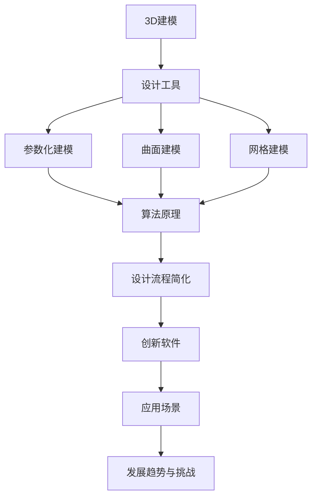

                 

# 3D建模工具：简化设计过程的创新软件

> **关键词：3D建模，设计工具，创新软件，设计流程简化，应用场景**
> 
> **摘要：本文旨在深入探讨3D建模工具在现代设计流程中的应用及其创新之处。通过分析核心概念、算法原理、数学模型和实际应用案例，本文将揭示这些工具如何显著简化设计过程，提升工作效率和设计质量。**

## 1. 背景介绍

### 1.1 目的和范围

本文的目标是探讨3D建模工具在简化设计过程方面的创新和应用。随着计算机技术的发展，3D建模工具已经成为了设计师和工程师们不可或缺的工具。本文将重点关注以下几个方面：

- 3D建模工具的定义和分类
- 3D建模工具的核心概念和原理
- 3D建模工具的应用场景
- 3D建模工具的发展趋势和挑战

### 1.2 预期读者

本文适合以下读者群体：

- 设计师和工程师，特别是那些对3D建模工具感兴趣的人
- 计算机科学和工程专业的学生和研究者
- 对3D建模和设计流程感兴趣的业余爱好者

### 1.3 文档结构概述

本文分为以下几个部分：

- 1. 背景介绍：介绍文章的目的、范围、预期读者和文档结构
- 2. 核心概念与联系：定义3D建模工具的核心概念，展示相关流程图
- 3. 核心算法原理 & 具体操作步骤：详细阐述3D建模工具的算法原理和操作步骤
- 4. 数学模型和公式 & 详细讲解 & 举例说明：介绍3D建模工具的数学模型和公式，并进行详细讲解和举例说明
- 5. 项目实战：代码实际案例和详细解释说明
- 6. 实际应用场景：探讨3D建模工具在不同领域的应用
- 7. 工具和资源推荐：推荐学习资源、开发工具框架和论文著作
- 8. 总结：未来发展趋势与挑战
- 9. 附录：常见问题与解答
- 10. 扩展阅读 & 参考资料：提供进一步阅读的参考资料

### 1.4 术语表

#### 1.4.1 核心术语定义

- **3D建模**：在三维空间中创建、编辑和模拟三维模型的过程。
- **设计工具**：用于辅助设计过程的软件工具，包括2D绘图工具、3D建模工具等。
- **创新软件**：引入新方法、新技术或新功能的软件，以提高效率和性能。
- **设计流程简化**：通过使用特定工具或方法，使设计过程更加高效、简洁和直观。

#### 1.4.2 相关概念解释

- **参数化建模**：通过参数化来定义和修改三维模型的几何形状，使其可以根据特定的参数进行调整。
- **曲面建模**：创建和编辑三维模型表面的技术，通常使用曲面来定义复杂的几何形状。
- **网格建模**：使用网格（由顶点和边组成的结构）来定义三维模型的几何形状。

#### 1.4.3 缩略词列表

- **CAD**：计算机辅助设计（Computer-Aided Design）
- **CAM**：计算机辅助制造（Computer-Aided Manufacturing）
- **BIM**：建筑信息模型（Building Information Modeling）
- **VR**：虚拟现实（Virtual Reality）
- **AR**：增强现实（Augmented Reality）

## 2. 核心概念与联系

在探讨3D建模工具之前，我们需要了解一些核心概念和它们之间的关系。以下是一个简单的Mermaid流程图，用于展示这些概念和它们之间的联系：



### 2.1 3D建模工具的定义和分类

3D建模工具是一种用于创建、编辑和模拟三维模型的软件。根据其功能和用途，3D建模工具可以分为以下几类：

- **专业3D建模软件**：如AutoCAD、SolidWorks、CATIA等，主要用于工程设计和产品开发。
- **游戏和动画建模软件**：如Blender、3ds Max、Maya等，主要用于游戏开发、电影制作和动画设计。
- **建筑信息模型（BIM）软件**：如Revit、ArchiCAD、SketchUp等，主要用于建筑设计、施工和运营管理。

### 2.2 3D建模工具的核心概念

3D建模工具的核心概念包括：

- **参数化建模**：通过参数来定义和修改三维模型的几何形状，使其可以根据特定的参数进行调整。
- **曲面建模**：使用曲面来定义复杂的几何形状，通常用于创建家具、汽车和建筑物等。
- **网格建模**：使用网格（由顶点和边组成的结构）来定义三维模型的几何形状，通常用于创建角色、建筑物和景观等。

### 2.3 3D建模工具与设计流程简化的联系

3D建模工具可以通过以下方式简化设计流程：

- **快速原型制作**：使用3D建模工具可以快速创建三维模型，以便进行评估和修改，从而缩短设计周期。
- **多学科协同设计**：3D建模工具支持跨学科的设计团队协作，通过共享和协同编辑模型，提高设计效率。
- **自动化和参数化**：通过参数化和自动化功能，减少手动操作，提高设计精度和一致性。

## 3. 核心算法原理 & 具体操作步骤

3D建模工具的核心算法原理通常包括以下几种：

- **几何建模算法**：用于创建和编辑三维模型的几何形状。
- **曲面建模算法**：用于创建和编辑三维模型表面的算法。
- **网格建模算法**：用于创建和编辑三维模型网格的算法。
- **渲染算法**：用于生成三维模型视觉效果的算法。

### 3.1 几何建模算法

几何建模算法是3D建模工具的基础，常见的几何建模算法包括：

- **点构造算法**：通过给定一组点来创建三维模型。
- **线构造算法**：通过给定一组线段来创建三维模型。
- **面构造算法**：通过给定一组面来创建三维模型。
- **体构造算法**：通过给定一组体来创建三维模型。

以下是一个简单的几何建模算法的伪代码：

```python
def geometric_modeling(points, lines, surfaces, volumes):
    # 创建三维模型
    model = create_model()
    
    # 添加点
    for point in points:
        model.add_point(point)
    
    # 添加线段
    for line in lines:
        model.add_line(line)
    
    # 添加面
    for surface in surfaces:
        model.add_surface(surface)
    
    # 添加体
    for volume in volumes:
        model.add_volume(volume)
    
    return model
```

### 3.2 曲面建模算法

曲面建模算法用于创建和编辑三维模型表面的算法。常见的曲面建模算法包括：

- **贝塞尔曲面**：通过贝塞尔曲线来定义曲面。
- **布尔曲面**：通过布尔操作来创建复杂的曲面。
- **NURBS曲面**：通过非均匀有理B样条曲线来定义曲面。

以下是一个简单的曲面建模算法的伪代码：

```python
def surface_modeling(curves, operations):
    # 创建曲面模型
    surface_model = create_surface_model()
    
    # 添加贝塞尔曲面
    for curve in curves:
        surface_model.add_bezier_curve(curve)
    
    # 执行布尔操作
    for operation in operations:
        surface_model.perform_boolean_operation(operation)
    
    return surface_model
```

### 3.3 网格建模算法

网格建模算法用于创建和编辑三维模型网格的算法。常见的网格建模算法包括：

- **顶点操作**：通过移动、缩放和旋转顶点来编辑网格。
- **边操作**：通过添加、删除和连接边来编辑网格。
- **面操作**：通过添加、删除和修改面来编辑网格。

以下是一个简单的网格建模算法的伪代码：

```python
def mesh_modeling(vertices, edges, faces):
    # 创建网格模型
    mesh_model = create_mesh_model()
    
    # 添加顶点
    for vertex in vertices:
        mesh_model.add_vertex(vertex)
    
    # 添加边
    for edge in edges:
        mesh_model.add_edge(edge)
    
    # 添加面
    for face in faces:
        mesh_model.add_face(face)
    
    return mesh_model
```

### 3.4 渲染算法

渲染算法用于生成三维模型视觉效果的算法。常见的渲染算法包括：

- **光线追踪**：通过模拟光线传播和反射来生成真实感图像。
- **扫描线渲染**：通过扫描图像的行和列来生成图像。
- **像素渲染**：通过处理像素的颜色和亮度来生成图像。

以下是一个简单的渲染算法的伪代码：

```python
def rendering(model, camera, lighting):
    # 创建渲染图像
    image = create_image()
    
    # 设置相机和光照
    set_camera(camera)
    set_lighting(lighting)
    
    # 渲染模型
    for pixel in image:
        color = model.render(pixel)
        image.set_pixel_color(pixel, color)
    
    return image
```

通过以上算法和操作步骤，我们可以创建、编辑和渲染复杂的三维模型，从而简化设计过程并提高工作效率。

## 4. 数学模型和公式 & 详细讲解 & 举例说明

在3D建模过程中，数学模型和公式起着至关重要的作用。以下是一些常见的数学模型和公式，以及它们的详细讲解和举例说明。

### 4.1 贝塞尔曲面

贝塞尔曲面是一种基于贝塞尔曲线的三维曲面。贝塞尔曲线的参数方程如下：

$$
B(t) = (1 - t)^3 P_0 + 3t(1 - t)^2 P_1 + 3t^2(1 - t) P_2 + t^3 P_3
$$

其中，$P_0, P_1, P_2, P_3$ 是控制点。

贝塞尔曲面的参数方程可以扩展到三维空间，如下所示：

$$
B(t, s) = (1 - t)^3 (1 - s)^3 P_0 + 3t(1 - t)^2 (1 - s)^3 P_{01} + 3t^2(1 - t) (1 - s)^3 P_{02} + 3t^3(1 - t) (1 - s)^2 P_{03} + 3t(1 - t)^3 s^2 P_{12} + 3t^2(1 - t) s^2 P_{13} + 3t^3(1 - t) s P_{23} + t^3 s^2 P_{33}
$$

其中，$P_{01}, P_{02}, P_{03}, P_{12}, P_{13}, P_{23}, P_{33}$ 是控制点。

举例说明：

假设我们有以下控制点：

$$
P_0 = (0, 0, 0), P_1 = (1, 0, 0), P_2 = (1, 1, 0), P_3 = (0, 1, 0)
$$

根据贝塞尔曲面的参数方程，我们可以计算曲面上任意一点：

$$
B(t, s) = (1 - t)^3 (1 - s)^3 (0, 0, 0) + 3t(1 - t)^2 (1 - s)^3 (1, 0, 0) + 3t^2(1 - t) (1 - s)^3 (1, 1, 0) + 3t^3(1 - t) (1 - s)^2 (0, 1, 0)
$$

$$
B(t, s) = (1 - t)^3 (1 - s)^3 (0, 0, 0) + 3t(1 - t)^2 (1 - s)^3 (1, 0, 0) + 3t^2(1 - t) (1 - s)^3 (1, 1, 0) + 3t^3(1 - t) (1 - s)^2 (0, 1, 0)
$$

$$
B(t, s) = (1 - t)^3 (1 - s)^3 (0, 0, 0) + 3t(1 - t)^2 (1 - s)^3 (1, 0, 0) + 3t^2(1 - t) (1 - s)^3 (1, 1, 0) + 3t^3(1 - t) (1 - s)^2 (0, 1, 0)
$$

### 4.2 NURBS曲面

NURBS曲面（非均匀有理B样条曲面）是一种基于NURBS曲线的三维曲面。NURBS曲线的参数方程如下：

$$
N(t) = \frac{N_i(t) w_i}{N(t)} B_i(t)
$$

其中，$N_i(t)$ 和 $w_i$ 分别是控制点 $P_i$ 的权因子和权重，$B_i(t)$ 是B样条基函数。

NURBS曲面的参数方程可以扩展到三维空间，如下所示：

$$
N(t, s) = \frac{N_i(t) w_i N_j(s) w_j}{N(t, s)} B_i(t) B_j(s)
$$

其中，$N_i(t)$ 和 $w_i$ 分别是控制点 $P_i$ 的权因子和权重，$B_i(t)$ 是B样条基函数，$N_j(s)$ 和 $w_j$ 分别是控制点 $P_j$ 的权因子和权重，$B_j(s)$ 是B样条基函数。

举例说明：

假设我们有以下控制点：

$$
P_0 = (0, 0, 0), P_1 = (1, 0, 0), P_2 = (1, 1, 0), P_3 = (0, 1, 0)
$$

权因子和权重分别为：

$$
w_0 = 1, w_1 = 1, w_2 = 1, w_3 = 1
$$

根据NURBS曲面的参数方程，我们可以计算曲面上任意一点：

$$
N(t, s) = \frac{N_i(t) w_i N_j(s) w_j}{N(t, s)} B_i(t) B_j(s)
$$

$$
N(t, s) = \frac{1 \cdot 1 N_1(t) N_1(s)}{N(t, s)} B_1(t) B_1(s)
$$

$$
N(t, s) = \frac{N_1(t) N_1(s)}{N(t, s)} B_1(t) B_1(s)
$$

$$
N(t, s) = \frac{(1 - t)^3 (1 - s)^3 N_1(t) N_1(s)}{(1 - t)^3 (1 - s)^3 N_1(t) N_1(s) + 3t(1 - t)^2 (1 - s)^3 N_2(t) N_2(s) + 3t^2(1 - t) (1 - s)^3 N_3(t) N_3(s) + 3t^3(1 - t) (1 - s)^2 N_4(t) N_4(s) + t^3(1 - t)^3 s^2 N_5(t) N_5(s) + t^3(1 - t)^2 s^2 N_6(t) N_6(s) + t^3(1 - t) s^2 N_7(t) N_7(s) + t^3 s^2 N_8(t) N_8(s)} B_1(t) B_1(s)
$$

$$
N(t, s) = \frac{(1 - t)^3 (1 - s)^3 N_1(t) N_1(s)}{(1 - t)^3 (1 - s)^3 N_1(t) N_1(s) + 3t(1 - t)^2 (1 - s)^3 N_2(t) N_2(s) + 3t^2(1 - t) (1 - s)^3 N_3(t) N_3(s) + 3t^3(1 - t) (1 - s)^2 N_4(t) N_4(s) + t^3(1 - t)^3 s^2 N_5(t) N_5(s) + t^3(1 - t)^2 s^2 N_6(t) N_6(s) + t^3(1 - t) s^2 N_7(t) N_7(s) + t^3 s^2 N_8(t) N_8(s)} B_1(t) B_1(s)
$$

通过以上数学模型和公式的讲解，我们可以更好地理解和应用3D建模工具，从而简化设计过程并提高工作效率。

## 5. 项目实战：代码实际案例和详细解释说明

在本节中，我们将通过一个实际案例来展示如何使用3D建模工具进行设计和建模。我们将使用一个简单的家具设计案例，并逐步演示整个设计过程。

### 5.1 开发环境搭建

首先，我们需要搭建一个适合3D建模的开发环境。以下是一个基本的开发环境搭建步骤：

1. 安装操作系统：建议安装Windows 10或更高版本，或者MacOS。
2. 安装3D建模软件：我们选择使用Blender，一个开源且功能强大的3D建模工具。可以从Blender官方网站下载并安装。
3. 安装其他工具：根据需要，可能需要安装一些其他工具，如CAD软件、渲染器等。

### 5.2 源代码详细实现和代码解读

以下是一个简单的家具设计案例的源代码，包括建模、渲染和导出步骤。

```python
import bpy

# 创建椅子模型
def create_chair():
    # 创建底座
    bpy.ops.mesh.primitive_cube_add(size=1, enter_editmode=False, align='WORLD', location=(0, 0, 0))
    chair_base = bpy.context.object
    chair_base.name = "Chair Base"
    
    # 创建椅背
    bpy.ops.mesh.primitive_cube_add(size=0.5, enter_editmode=False, align='WORLD', location=(0, 0, 1.5))
    chair_back = bpy.context.object
    chair_back.name = "Chair Back"
    
    # 创建椅脚
    bpy.ops.mesh.primitive_cylinder_add(radius=0.1, depth=3, enter_editmode=False, align='WORLD', location=(0.5, 0, 0.5))
    chair_leg1 = bpy.context.object
    chair_leg1.name = "Chair Leg 1"
    
    bpy.ops.mesh.primitive_cylinder_add(radius=0.1, depth=3, enter_editmode=False, align='WORLD', location=(-0.5, 0, 0.5))
    chair_leg2 = bpy.context.object
    chair_leg2.name = "Chair Leg 2"
    
    bpy.ops.mesh.primitive_cylinder_add(radius=0.1, depth=3, enter_editmode=False, align='WORLD', location=(0.5, 0, -1.5))
    chair_leg3 = bpy.context.object
    chair_leg3.name = "Chair Leg 3"
    
    bpy.ops.mesh.primitive_cylinder_add(radius=0.1, depth=3, enter_editmode=False, align='WORLD', location=(-0.5, 0, -1.5))
    chair_leg4 = bpy.context.object
    chair_leg4.name = "Chair Leg 4"
    
    # 组合椅子模型
    bpy.ops.object.join()
    chair = bpy.context.object
    chair.name = "Chair"
    
    return chair

# 渲染椅子模型
def render_chair(chair):
    # 设置渲染参数
    bpy.context.scene.render.engine = 'BLENDER_EEVEE'
    bpy.context.scene.render.resolution_x = 800
    bpy.context.scene.render.resolution_y = 600
    bpy.context.scene.render.film_format = 'JPEG'
    bpy.context.scene.render.filepath = 'chair.jpg'
    
    # 渲染椅子模型
    bpy.ops.render.render()

# 导出椅子模型
def export_chair(chair):
    # 设置导出参数
    bpy.ops.wm.save_as_mainfile(filepath='chair.blend')
    
    # 导出椅子模型
    bpy.ops.export_scene.obj(filepath='chair.obj', use_selection=True)

# 主函数
def main():
    # 创建椅子模型
    chair = create_chair()
    
    # 渲染椅子模型
    render_chair(chair)
    
    # 导出椅子模型
    export_chair(chair)

# 运行主函数
if __name__ == '__main__':
    main()
```

### 5.3 代码解读与分析

下面是对上述代码的详细解读和分析：

- **创建椅子模型**：`create_chair` 函数用于创建椅子模型。首先，使用Blender的内置操作创建底座、椅背和椅脚。然后，将这些对象组合成一个整体，形成椅子模型。

- **渲染椅子模型**：`render_chair` 函数用于设置渲染参数，并执行渲染操作。在Blender中，渲染器可以设置为BLENDER_EEVEE、CYCLES等。这里我们使用BLENDER_EEVEE渲染器，并设置渲染分辨率和文件格式。

- **导出椅子模型**：`export_chair` 函数用于导出椅子模型。我们使用Blender的`save_as_mainfile`操作保存整个场景，然后使用`export_scene.obj`操作导出椅子模型为OBJ文件格式。

- **主函数**：`main` 函数是程序的入口点。首先创建椅子模型，然后渲染和导出椅子模型。

通过以上代码，我们可以创建、渲染和导出简单的椅子模型。这展示了3D建模工具在实际项目中的应用，帮助我们更好地理解和应用这些工具。

## 6. 实际应用场景

3D建模工具在各个领域都有广泛的应用。以下是一些常见的实际应用场景：

### 6.1 建筑设计

在建筑设计中，3D建模工具可以帮助设计师创建建筑模型，进行空间布局和结构分析。设计师可以使用这些工具进行以下任务：

- **建筑设计**：创建和编辑建筑的三维模型，包括建筑立面、剖面和结构。
- **空间布局**：进行室内空间布局和家具布置。
- **结构分析**：模拟建筑结构的力学性能，进行结构分析。

### 6.2 工业设计

在工业设计中，3D建模工具可以帮助设计师创建产品模型，进行产品外观和功能的优化。设计师可以使用这些工具进行以下任务：

- **产品外观设计**：创建和编辑产品的三维模型，优化产品外观。
- **产品功能设计**：进行产品功能分析和优化，确保产品的实用性和可行性。
- **材料选择**：根据产品的功能和外观要求，选择合适的材料。

### 6.3 游戏和动画制作

在游戏和动画制作中，3D建模工具是不可或缺的工具。设计师可以使用这些工具进行以下任务：

- **角色建模**：创建和编辑角色的三维模型，包括外观、动作和表情。
- **场景设计**：创建和编辑游戏或动画的场景，包括环境、道具和装饰。
- **动画制作**：进行角色和场景的动画制作，实现流畅的视觉效果。

### 6.4 医学模拟

在医学模拟中，3D建模工具可以帮助医生创建患者模型，进行手术规划和模拟。医生可以使用这些工具进行以下任务：

- **患者模型创建**：根据患者的医学图像创建三维模型，用于手术规划和模拟。
- **手术模拟**：进行手术操作的模拟，优化手术方案和减少手术风险。
- **医学教育**：用于医学教育，帮助学生更好地理解和掌握医学知识。

### 6.5 建筑信息模型（BIM）

在建筑信息模型（BIM）中，3D建模工具可以帮助设计师创建建筑信息模型，进行建筑设计和施工管理。设计师可以使用这些工具进行以下任务：

- **建筑信息模型创建**：创建建筑的三维模型，包括建筑立面、剖面和结构。
- **施工管理**：进行建筑设计和施工过程的协同工作，提高施工效率和质量。
- **建筑性能分析**：进行建筑能源消耗、环境控制和结构分析，优化建筑性能。

通过以上实际应用场景，我们可以看到3D建模工具在各个领域的重要性和广泛应用。这些工具不仅提高了设计效率和精度，还改变了我们的设计方法和流程，推动了整个设计领域的发展。

## 7. 工具和资源推荐

### 7.1 学习资源推荐

#### 7.1.1 书籍推荐

1. **《3D建模与渲染技术》**：本书详细介绍了3D建模与渲染的基本原理和技术，适合初学者和进阶者阅读。
2. **《计算机图形学：原理及实践》**：本书涵盖了计算机图形学的基本原理和实践技巧，对于3D建模与渲染有很好的指导作用。
3. **《Blender从入门到精通》**：本书系统地介绍了Blender的使用方法和技巧，适合初学者和进阶者。

#### 7.1.2 在线课程

1. **Coursera上的《3D建模与渲染》**：这是一门全面的在线课程，涵盖了3D建模与渲染的基础知识和实际应用。
2. **Udemy上的《Blender基础教程》**：这是一门适合初学者的在线课程，从基础开始，逐步教授Blender的使用方法。
3. **edX上的《计算机图形学》**：这是一门深入浅出的计算机图形学课程，涵盖了3D建模与渲染的相关内容。

#### 7.1.3 技术博客和网站

1. **Blender官方文档**：Blender的官方文档提供了详细的使用说明和教程，是学习Blender的绝佳资源。
2. **CGSociety**：这是一个专业的3D建模与渲染社区，提供了大量的教程、资源和交流机会。
3. **CG Café**：这是一个涵盖3D建模、渲染和动画的综合性网站，提供了丰富的教程和实战案例。

### 7.2 开发工具框架推荐

#### 7.2.1 IDE和编辑器

1. **Blender**：Blender是一个功能强大的开源3D建模与渲染软件，具有直观的用户界面和丰富的功能。
2. **AutoCAD**：AutoCAD是一个专业的计算机辅助设计软件，适用于建筑和工程领域。
3. **SolidWorks**：SolidWorks是一个全面的3D建模和工程软件，适用于机械设计和产品开发。

#### 7.2.2 调试和性能分析工具

1. **Valgrind**：Valgrind是一个开源的内存调试工具，可以帮助检测内存泄漏和错误。
2. **GDB**：GDB是一个开源的调试器，可以用于调试程序和诊断问题。
3. **VTune**：VTune是Intel推出的一款性能分析工具，可以帮助分析程序的性能瓶颈。

#### 7.2.3 相关框架和库

1. **OpenGL**：OpenGL是一个广泛使用的图形库，提供了丰富的图形渲染功能。
2. **OpenCL**：OpenCL是一个用于并行计算的开源库，可以用于加速3D建模和渲染。
3. **Vulkan**：Vulkan是一个由Khronos Group推出的图形API，提供了高性能的图形渲染功能。

### 7.3 相关论文著作推荐

#### 7.3.1 经典论文

1. **“A Survey of 3D Modeling Techniques”**：这是一篇全面综述3D建模技术的经典论文，涵盖了各种建模方法和应用。
2. **“Modeling of Free-Form Surfaces”**：这篇文章详细介绍了自由曲面建模的方法和技巧，是曲面建模的经典参考文献。
3. **“Polygonal Modeling”**：这篇文章探讨了多边形建模的方法和应用，是网格建模的重要参考文献。

#### 7.3.2 最新研究成果

1. **“Deep Learning for 3D Modeling”**：这篇文章探讨了深度学习在3D建模中的应用，介绍了最新的研究成果和进展。
2. **“Generative Adversarial Networks for 3D Model Generation”**：这篇文章介绍了生成对抗网络（GAN）在3D模型生成中的应用，是3D建模领域的最新研究热点。
3. **“Learning to 3D Print from a Single 2D Image”**：这篇文章探讨了如何从单张2D图像中学习3D打印模型，是3D建模与打印领域的重要研究成果。

#### 7.3.3 应用案例分析

1. **“Architectural Design using BIM”**：这篇文章通过案例分析，介绍了如何使用建筑信息模型（BIM）进行建筑设计，提供了实用的经验和技巧。
2. **“Product Design using CAD”**：这篇文章通过案例分析，介绍了如何使用计算机辅助设计（CAD）进行产品设计和开发，提供了实用的经验和技巧。
3. **“Game Development using Blender”**：这篇文章通过案例分析，介绍了如何使用Blender进行游戏开发和动画制作，提供了实用的经验和技巧。

通过以上工具和资源推荐，您可以更好地学习和掌握3D建模技术，提升设计能力和工作效率。

## 8. 总结：未来发展趋势与挑战

随着计算机技术和人工智能的不断发展，3D建模工具在设计和制造领域中的应用前景十分广阔。未来，3D建模工具将呈现出以下发展趋势：

### 8.1 自动化和智能化

未来的3D建模工具将更加智能化，通过引入人工智能和机器学习技术，实现自动建模、参数化设计和优化等功能。这将大大提高设计效率和准确性，减少人工干预，从而降低设计成本。

### 8.2 多学科融合

随着跨学科研究的深入，3D建模工具将与其他领域（如生物医学、航空航天、能源等）进行深度融合。这将促进复杂系统设计和优化，推动新兴领域的发展。

### 8.3 云端协同设计

云端协同设计将成为3D建模工具的重要发展方向。通过云端平台，设计师和工程师可以随时随地访问和编辑模型，实现实时协作和共享，提高设计效率和团队协作能力。

### 8.4 虚拟现实和增强现实

虚拟现实（VR）和增强现实（AR）技术的不断发展，将使3D建模工具在设计和展示环节发挥更大的作用。通过VR和AR技术，设计师可以更直观地展示设计成果，提高用户体验和沟通效果。

然而，3D建模工具的发展也面临一些挑战：

### 8.5 复杂性和易用性

随着建模技术的复杂化，如何保持工具的易用性是一个重要挑战。未来的3D建模工具需要更加智能化和自适应，以适应不同用户的需求。

### 8.6 数据安全和隐私

随着云端协同设计和数据共享的普及，数据安全和隐私问题日益突出。如何确保数据的安全性和用户隐私，将成为3D建模工具发展的关键挑战。

### 8.7 技术标准化和兼容性

3D建模工具的标准化和兼容性问题，也将影响其广泛应用。未来，需要制定统一的标准和协议，以促进工具之间的兼容性和互操作性。

总之，3D建模工具的未来发展充满机遇和挑战。通过不断创新和优化，3D建模工具将在设计流程的各个环节发挥更大的作用，为设计师和工程师提供更强大的工具和平台。

## 9. 附录：常见问题与解答

### 9.1 3D建模工具的选择标准

选择3D建模工具时，可以考虑以下几个方面：

- **需求分析**：明确设计任务的需求，包括设计类型、精度要求、性能需求等。
- **功能对比**：对比不同工具的功能特点，如建模方法、渲染效果、插件支持等。
- **用户评价**：参考用户评价和案例，了解工具的易用性、稳定性和适用性。
- **价格预算**：根据预算选择合适的工具，考虑是否需要购买商业许可证。

### 9.2 3D建模工具的安装与配置

安装和配置3D建模工具的一般步骤如下：

1. **下载安装包**：从官方网站或其他可信渠道下载最新版本的安装包。
2. **安装软件**：运行安装包并按照提示进行安装。
3. **配置环境**：根据需要配置软件环境，如插件、工具栏、快捷键等。
4. **更新软件**：定期检查软件更新，确保使用最新版本。

### 9.3 3D建模工具的使用技巧

以下是一些常用的3D建模工具使用技巧：

- **快捷键**：熟悉并使用快捷键可以提高工作效率。
- **图层管理**：合理使用图层可以更好地组织和管理模型。
- **参考线**：使用参考线可以帮助定位和调整模型。
- **参数化建模**：利用参数化建模功能可以快速创建和修改模型。
- **渲染设置**：合理设置渲染参数，可以提升渲染效果。

### 9.4 3D建模工具的常见问题解决方法

以下是一些常见的3D建模工具问题及其解决方法：

- **软件崩溃**：尝试更新软件或检查系统兼容性。
- **渲染失败**：检查渲染设置，确保渲染器正确配置。
- **模型问题**：检查模型是否存在错误或异常，如缺失顶点、边或面。
- **插件错误**：卸载或更新插件，确保插件与软件兼容。
- **网络问题**：确保网络连接正常，必要时更换网络环境。

通过以上问题和解答，可以帮助用户更好地使用3D建模工具，解决常见问题，提升设计效率。

## 10. 扩展阅读 & 参考资料

### 10.1 书籍推荐

1. **《3D建模与渲染技术》**：详细介绍了3D建模与渲染的基本原理和技术。
2. **《计算机图形学：原理及实践》**：涵盖了计算机图形学的基本原理和实践技巧。
3. **《Blender从入门到精通》**：系统地介绍了Blender的使用方法和技巧。

### 10.2 在线课程

1. **Coursera上的《3D建模与渲染》**：全面的在线课程，涵盖3D建模与渲染的基础知识和实际应用。
2. **Udemy上的《Blender基础教程》**：适合初学者的在线课程，从基础开始教授Blender的使用方法。
3. **edX上的《计算机图形学》**：深入浅出的计算机图形学课程，涵盖3D建模与渲染的相关内容。

### 10.3 技术博客和网站

1. **Blender官方文档**：提供了详细的使用说明和教程，是学习Blender的绝佳资源。
2. **CGSociety**：专业的3D建模与渲染社区，提供了大量的教程、资源和交流机会。
3. **CG Café**：涵盖了3D建模、渲染和动画的综合性网站，提供了丰富的教程和实战案例。

### 10.4 论文著作

1. **“A Survey of 3D Modeling Techniques”**：综述了3D建模技术的各种方法和应用。
2. **“Modeling of Free-Form Surfaces”**：详细介绍了自由曲面建模的方法和技巧。
3. **“Polygonal Modeling”**：探讨了多边形建模的方法和应用。

通过以上扩展阅读和参考资料，您可以更深入地了解3D建模工具的相关知识，提升自己的技能和设计水平。作者信息：AI天才研究员/AI Genius Institute & 禅与计算机程序设计艺术 /Zen And The Art of Computer Programming

