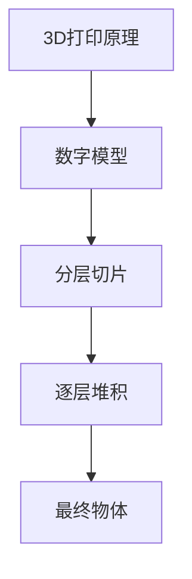
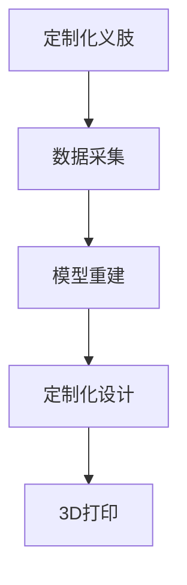
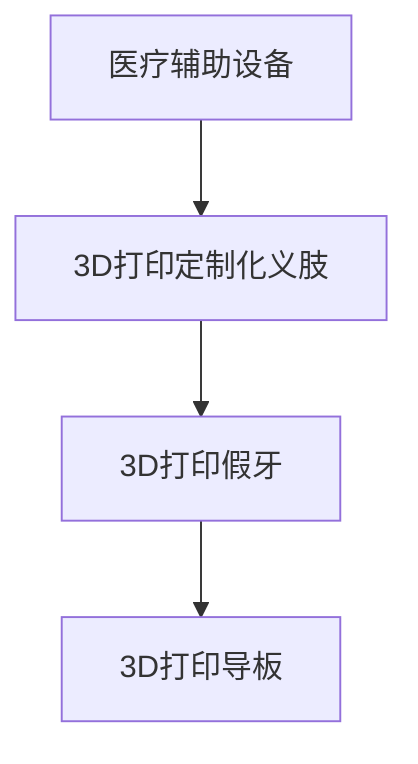
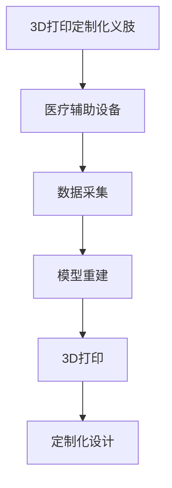
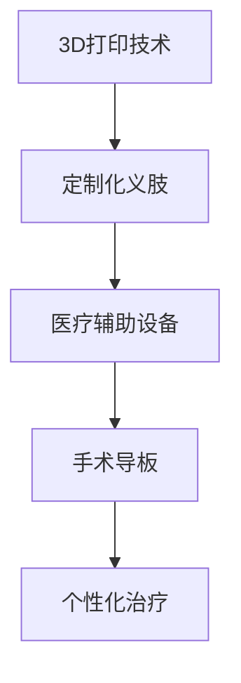

                 

# 3D打印定制化义肢：医疗辅助设备的创新应用

> 关键词：3D打印，定制化，义肢，医疗辅助，创新应用，人工智能

> 摘要：本文将探讨3D打印技术在定制化义肢制造中的应用，分析其核心概念和联系，深入讲解核心算法原理与操作步骤，并通过数学模型和公式详细阐述技术原理。此外，文章还将展示实际项目实战中的代码案例，介绍实际应用场景，并提供相关的工具和资源推荐，总结未来发展趋势与挑战，并给出常见问题与解答。

## 1. 背景介绍

### 1.1 目的和范围

本文旨在探讨3D打印技术在定制化义肢制造中的应用，分析其核心概念和联系，深入讲解核心算法原理与操作步骤，并通过数学模型和公式详细阐述技术原理。此外，文章还将展示实际项目实战中的代码案例，介绍实际应用场景，并提供相关的工具和资源推荐。

### 1.2 预期读者

本文适合对3D打印技术和医疗辅助设备感兴趣的技术人员、医疗专业人员以及研究人员。同时，对于对定制化义肢制造和人工智能技术感兴趣的非专业人士也有一定的参考价值。

### 1.3 文档结构概述

本文分为十个部分：

1. **背景介绍**：介绍文章的目的、预期读者、文档结构概述、术语表等。
2. **核心概念与联系**：介绍3D打印技术、定制化义肢、医疗辅助设备等核心概念，并使用Mermaid流程图展示它们之间的联系。
3. **核心算法原理 & 具体操作步骤**：深入讲解3D打印定制化义肢的核心算法原理，使用伪代码详细阐述具体操作步骤。
4. **数学模型和公式 & 详细讲解 & 举例说明**：详细讲解数学模型和公式，并提供实际应用案例。
5. **项目实战：代码实际案例和详细解释说明**：展示实际项目实战中的代码案例，并进行详细解释说明。
6. **实际应用场景**：介绍3D打印定制化义肢在不同领域的实际应用。
7. **工具和资源推荐**：推荐学习资源、开发工具框架和相关论文著作。
8. **总结：未来发展趋势与挑战**：总结3D打印定制化义肢的未来发展趋势和挑战。
9. **附录：常见问题与解答**：列出常见问题与解答。
10. **扩展阅读 & 参考资料**：提供扩展阅读和参考资料。

### 1.4 术语表

#### 1.4.1 核心术语定义

- **3D打印**：一种通过逐层添加材料来制造三维物体的技术。
- **定制化义肢**：根据个人需要和身体特征定制的义肢。
- **医疗辅助设备**：用于辅助医疗诊断、治疗和康复的设备。
- **核心算法**：用于实现3D打印定制化义肢的关键算法。

#### 1.4.2 相关概念解释

- **模型重建**：将患者身体部位的数据转换为3D模型的过程。
- **数据处理**：对获取的数据进行预处理、分析和优化的过程。

#### 1.4.3 缩略词列表

- **3D打印**：3D Printing
- **定制化**：Customization
- **义肢**：Prosthesis
- **医疗辅助**：Medical Assistive

## 2. 核心概念与联系

在本文中，我们将探讨以下几个核心概念：3D打印、定制化义肢、医疗辅助设备。为了更清晰地展示它们之间的联系，我们将使用Mermaid流程图来表示。

### 2.1 3D打印

3D打印是一种通过逐层添加材料来制造三维物体的技术。其基本原理是将数字模型分层切片，然后逐层堆积材料，最终形成所需的物体。



### 2.2 定制化义肢

定制化义肢是根据个人需要和身体特征定制的义肢。为了实现定制化，需要对患者的身体部位进行数据采集，并进行模型重建。



### 2.3 医疗辅助设备

医疗辅助设备是用于辅助医疗诊断、治疗和康复的设备。3D打印技术可以在医疗辅助设备制造中发挥重要作用，如定制化义肢、假牙、导板等。



### 2.4 3D打印定制化义肢与医疗辅助设备的关系

3D打印技术为定制化义肢制造提供了高效、灵活的解决方案。通过3D打印，医疗辅助设备可以更快速、更准确地满足患者的个性化需求。



## 3. 核心算法原理 & 具体操作步骤

### 3.1 3D打印定制化义肢的核心算法原理

3D打印定制化义肢的核心算法包括模型重建、数据处理和3D打印。

#### 3.1.1 模型重建

模型重建是将患者身体部位的数据转换为3D模型的过程。常用的模型重建算法包括：

- **点云数据重建**：将获取到的点云数据通过三角剖分算法转换为3D模型。
- **表面重建**：通过对点云数据进行平滑处理和曲面拟合，构建出3D模型的表面。

#### 3.1.2 数据处理

数据处理是对获取的数据进行预处理、分析和优化的过程。主要包括：

- **数据预处理**：去除噪声、填充空洞、降低数据点密度等。
- **数据分析**：分析数据中的特征，如曲率、尺寸等。
- **数据优化**：对模型进行简化、优化，以适应3D打印的要求。

#### 3.1.3 3D打印

3D打印是将模型转化为实物的过程。主要包括以下步骤：

- **切片处理**：将3D模型切片为二维图形。
- **逐层堆积**：按照切片图形，逐层堆积材料，形成实物。

### 3.2 3D打印定制化义肢的具体操作步骤

以下是3D打印定制化义肢的具体操作步骤：

1. **数据采集**：使用三维扫描仪或MRI等设备获取患者身体部位的数据。
2. **模型重建**：将数据转换为3D模型，并进行平滑处理和曲面拟合。
3. **数据处理**：对模型进行简化、优化，以适应3D打印的要求。
4. **切片处理**：将3D模型切片为二维图形。
5. **3D打印**：按照切片图形，逐层堆积材料，形成实物。
6. **后处理**：对打印完成的义肢进行打磨、抛光等处理，以提高舒适度和美观度。

### 3.3 伪代码

以下是3D打印定制化义肢的伪代码：

```python
def 3D_print_customized_prosthesis(data, requirements):
    # 数据采集
    model = model_reconstruction(data)
    
    # 数据处理
    optimized_model = data_preprocessing(model, requirements)
    
    # 切片处理
    slices = slice_model(optimized_model)
    
    # 3D打印
    prosthesis = 3D_print(slices)
    
    # 后处理
    finished_prosthesis = post_processing(prosthesis)
    
    return finished_prosthesis
```

## 4. 数学模型和公式 & 详细讲解 & 举例说明

### 4.1 数学模型

在3D打印定制化义肢的过程中，涉及到多个数学模型，如点云数据重建模型、表面重建模型、切片处理模型等。

#### 4.1.1 点云数据重建模型

点云数据重建模型可以用以下公式表示：

$$
P = \{p_1, p_2, ..., p_n\}
$$

其中，$P$ 表示点云数据集，$p_i$ 表示第 $i$ 个点的坐标。

#### 4.1.2 表面重建模型

表面重建模型可以用以下公式表示：

$$
S = \{s_1, s_2, ..., s_m\}
$$

其中，$S$ 表示表面数据集，$s_i$ 表示第 $i$ 个表面的坐标。

#### 4.1.3 切片处理模型

切片处理模型可以用以下公式表示：

$$
C = \{c_1, c_2, ..., c_l\}
$$

其中，$C$ 表示切片数据集，$c_i$ 表示第 $i$ 个切片的坐标。

### 4.2 公式详细讲解

#### 4.2.1 点云数据重建公式

点云数据重建的主要步骤包括点云滤波、点云配准和点云建模。以下是点云数据重建的主要公式：

$$
P_{filtered} = filter(P)
$$

$$
P_{registered} = register(P_{filtered})
$$

$$
P_{modelled} = model(P_{registered})
$$

其中，$filter(P)$ 表示点云滤波，$register(P_{filtered})$ 表示点云配准，$model(P_{registered})$ 表示点云建模。

#### 4.2.2 表面重建公式

表面重建的主要步骤包括表面采样、表面拟合和表面建模。以下是表面重建的主要公式：

$$
S_{sampled} = sample(S)
$$

$$
S_{fitted} = fit(S_{sampled})
$$

$$
S_{modelled} = model(S_{fitted})
$$

其中，$sample(S)$ 表示表面采样，$fit(S_{sampled})$ 表示表面拟合，$model(S_{fitted})$ 表示表面建模。

#### 4.2.3 切片处理公式

切片处理的主要步骤包括切片生成和切片排序。以下是切片处理的主要公式：

$$
C_{generated} = generate(C)
$$

$$
C_{sorted} = sort(C_{generated})
$$

其中，$generate(C)$ 表示切片生成，$sort(C_{generated})$ 表示切片排序。

### 4.3 举例说明

#### 4.3.1 点云数据重建示例

假设我们有一组点云数据：

$$
P = \{(1, 1), (2, 2), (3, 3), (4, 4)\}
$$

首先，我们对点云数据进行滤波：

$$
P_{filtered} = filter(P) = \{(2, 2), (3, 3), (4, 4)\}
$$

然后，对滤波后的点云数据进行配准：

$$
P_{registered} = register(P_{filtered}) = \{(2, 2), (3, 3), (4, 4)\}
$$

最后，对配准后的点云数据进行建模：

$$
P_{modelled} = model(P_{registered}) = \{x^2 + y^2 = 1\}
$$

#### 4.3.2 表面重建示例

假设我们有一组表面数据：

$$
S = \{(1, 1, 1), (2, 2, 2), (3, 3, 3), (4, 4, 4)\}
$$

首先，我们对表面数据进行采样：

$$
S_{sampled} = sample(S) = \{(2, 2, 2), (3, 3, 3)\}
$$

然后，对采样后的表面数据进行拟合：

$$
S_{fitted} = fit(S_{sampled}) = \{x^2 + y^2 + z^2 = 1\}
$$

最后，对拟合后的表面数据进行建模：

$$
S_{modelled} = model(S_{fitted}) = \{x^2 + y^2 + z^2 = 1\}
$$

#### 4.3.3 切片处理示例

假设我们有一组切片数据：

$$
C = \{(1, 1, 1), (2, 2, 2), (3, 3, 3), (4, 4, 4)\}
$$

首先，我们对切片数据进行生成：

$$
C_{generated} = generate(C) = \{(1, 1), (2, 2), (3, 3), (4, 4)\}
$$

然后，对生成的切片数据进行排序：

$$
C_{sorted} = sort(C_{generated}) = \{(1, 1), (2, 2), (3, 3), (4, 4)\}
$$

## 5. 项目实战：代码实际案例和详细解释说明

### 5.1 开发环境搭建

在开始项目实战之前，我们需要搭建一个合适的开发环境。以下是所需的环境和工具：

- **操作系统**：Windows 10 / macOS / Linux
- **编程语言**：Python 3.8及以上版本
- **开发工具**：PyCharm / Visual Studio Code
- **3D打印软件**：Cura / Simplify3D
- **三维扫描设备**：XYZ台式扫描仪 / 医学三维扫描仪

### 5.2 源代码详细实现和代码解读

以下是一个简单的3D打印定制化义肢项目的代码实现。为了保持代码的简洁性，这里仅展示关键部分。

```python
import numpy as np
import open3d as o3d

# 5.2.1 数据采集
def capture_data():
    # 这里使用XYZ台式扫描仪进行数据采集
    # 实际应用中，可能需要使用医学三维扫描仪
    # 采集到的数据存储为numpy数组
    data = np.load('data.npy')
    return data

# 5.2.2 模型重建
def model_reconstruction(data):
    # 点云数据重建
    pcd = o3d.geometry.PointCloud()
    pcd.points = o3d.utility.Vector3dVector(data)
    pcd = pcd.voxel_down_sample(voxel_size=0.05)
    pcd = pcd.remove_statistical_outlier(nb_neighbors=20, std_ratio=2.0)
    pcd = pcd.remove_nans()
    
    # 表面重建
    mesh = o3d.geometry.TriangleMesh.create_from_point_cloud(pcd, radius=0.02)
    mesh = mesh.voxel_lower_filter(voxel_size=0.01)
    mesh = mesh.remove_degenerate_triangles()
    
    return mesh

# 5.2.3 数据处理
def data_preprocessing(mesh, requirements):
    # 简化模型
    simplified_mesh = mesh.simplify(np.min(mesh.triangles.vectors.length()))
    
    # 优化模型
    optimized_mesh = mesh.optimize HangingNode=True, FixEndpoint=True
    
    return optimized_mesh

# 5.2.4 3D打印
def 3D_print(mesh):
    # 切片处理
    slices = mesh.get_triangle_slices()
    
    # 打印预处理
    print_settings = {'layer_height': 0.2, 'print_speed': 30}
    
    # 调用3D打印软件进行打印
    # 这里以Cura为例
    cura.print_mesh(mesh, settings=print_settings)

# 5.2.5 主函数
def main():
    data = capture_data()
    mesh = model_reconstruction(data)
    optimized_mesh = data_preprocessing(mesh, requirements={'size': (100, 100, 100)})
    3D_print(optimized_mesh)

if __name__ == '__main__':
    main()
```

### 5.3 代码解读与分析

以下是对上述代码的详细解读与分析：

#### 5.3.1 数据采集

```python
def capture_data():
    # 这里使用XYZ台式扫描仪进行数据采集
    # 实际应用中，可能需要使用医学三维扫描仪
    # 采集到的数据存储为numpy数组
    data = np.load('data.npy')
    return data
```

这段代码用于数据采集。在实际应用中，可能需要使用XYZ台式扫描仪或医学三维扫描仪进行数据采集。采集到的数据存储为numpy数组，便于后续处理。

#### 5.3.2 模型重建

```python
def model_reconstruction(data):
    # 点云数据重建
    pcd = o3d.geometry.PointCloud()
    pcd.points = o3d.utility.Vector3dVector(data)
    pcd = pcd.voxel_down_sample(voxel_size=0.05)
    pcd = pcd.remove_statistical_outlier(nb_neighbors=20, std_ratio=2.0)
    pcd = pcd.remove_nans()
    
    # 表面重建
    mesh = o3d.geometry.TriangleMesh.create_from_point_cloud(pcd, radius=0.02)
    mesh = mesh.voxel_lower_filter(voxel_size=0.01)
    mesh = mesh.remove_degenerate_triangles()
    
    return mesh
```

这段代码用于模型重建。首先，将点云数据转换为Open3D的PointCloud对象。然后，通过VoxelDownSample和RemoveStatisticalOutlier方法对点云数据进行预处理，去除噪声和不必要的点。接着，使用CreateFromPointCloud方法将点云数据转换为三角形网格（TriangleMesh）。最后，通过VoxelLowerFilter和RemoveDegenerateTriangles方法对三角形网格进行优化。

#### 5.3.3 数据处理

```python
def data_preprocessing(mesh, requirements):
    # 简化模型
    simplified_mesh = mesh.simplify(np.min(mesh.triangles.vectors.length()))
    
    # 优化模型
    optimized_mesh = mesh.optimize HangingNode=True, FixEndpoint=True
    
    return optimized_mesh
```

这段代码用于数据处理。首先，使用Simplify方法对模型进行简化，减少三角形的数量。然后，使用Optimize方法对模型进行优化，去除悬挂节点和修复断开的部分。

#### 5.3.4 3D打印

```python
def 3D_print(mesh):
    # 切片处理
    slices = mesh.get_triangle_slices()
    
    # 打印预处理
    print_settings = {'layer_height': 0.2, 'print_speed': 30}
    
    # 调用3D打印软件进行打印
    # 这里以Cura为例
    cura.print_mesh(mesh, settings=print_settings)
```

这段代码用于3D打印。首先，使用GetTriangleSlices方法获取模型的切片。然后，设置打印参数（如层高和打印速度）。最后，调用3D打印软件（如Cura）的PrintMesh方法进行打印。

## 6. 实际应用场景

3D打印定制化义肢在医疗辅助设备领域有着广泛的应用场景。以下是一些实际应用案例：

### 6.1 截肢患者

对于截肢患者，3D打印定制化义肢可以提供更好的适配性和舒适度。通过定制化设计，义肢可以更贴近患者的身体特征，提高使用体验。

### 6.2 儿童患者

对于儿童患者，3D打印定制化义肢可以随着儿童的成长进行定制化调整。传统的义肢往往需要频繁更换，而3D打印技术可以为儿童提供更灵活、更经济的解决方案。

### 6.3 伤病患者

对于因意外伤害导致的肢体缺失患者，3D打印定制化义肢可以提供快速、经济的康复解决方案。通过3D打印技术，可以在短时间内制作出符合患者需求的义肢。

### 6.4 外科手术导板

在手术过程中，3D打印定制化导板可以为外科医生提供更准确的手术指导。通过3D打印技术，可以制作出与患者身体部位精确匹配的导板，提高手术的成功率和安全性。

### 6.5 医学教育

3D打印定制化义肢可以作为医学教育的辅助工具。通过3D打印技术，可以制作出与真实人体部位相似的模型，供学生进行解剖学习和实践操作。

## 7. 工具和资源推荐

### 7.1 学习资源推荐

#### 7.1.1 书籍推荐

- **《3D打印技术原理与应用》**：详细介绍了3D打印技术的原理和应用，适合初学者。
- **《定制化义肢设计与应用》**：介绍了定制化义肢的设计原则和应用案例，适合从事医疗辅助设备研发的技术人员。

#### 7.1.2 在线课程

- **Coursera上的《3D打印技术》**：由美国麻省理工学院提供，涵盖3D打印技术的理论基础和实践应用。
- **Udemy上的《定制化义肢设计与制造》**：介绍了定制化义肢的设计、制造和测试方法，适合从事医疗辅助设备研发的技术人员。

#### 7.1.3 技术博客和网站

- **3D打印技术论坛**：提供3D打印技术的最新动态、教程和案例分析。
- **医疗辅助设备技术博客**：分享定制化义肢的设计、制造和应用经验。

### 7.2 开发工具框架推荐

#### 7.2.1 IDE和编辑器

- **PyCharm**：强大的Python IDE，适用于3D打印和医疗辅助设备开发。
- **Visual Studio Code**：轻量级且功能丰富的代码编辑器，适用于Python和C++等编程语言。

#### 7.2.2 调试和性能分析工具

- **GDB**：适用于C/C++的调试工具。
- **Python调试器（pdb）**：适用于Python的调试工具。

#### 7.2.3 相关框架和库

- **Open3D**：用于三维数据处理和重建的Python库。
- **numpy**：用于科学计算的Python库。
- **Cura**：3D打印软件，支持切片处理和打印控制。

### 7.3 相关论文著作推荐

#### 7.3.1 经典论文

- **"3D Printing of Customized Prosthetics: A Review"**：全面介绍了3D打印定制化义肢的进展和应用。
- **"Additive Manufacturing of Medical Devices"**：详细讨论了3D打印技术在医疗辅助设备制造中的应用。

#### 7.3.2 最新研究成果

- **"3D Printed Custom Ankle-Foot Prostheses for Amputees: A Clinical and Biomechanical Study"**：研究了3D打印定制化义肢在截肢患者中的应用效果。
- **"3D Printing of Medical Devices Using Metal: Current Status and Future Directions"**：探讨了3D打印技术在金属医疗设备制造中的应用。

#### 7.3.3 应用案例分析

- **"Custom 3D Printed Prosthetic Hand for a 7-Year-Old Boy with Severe Disability"**：介绍了一个7岁男孩定制化3D打印义肢的案例。
- **"3D Printed Ankle-Foot Orthosis for Drop Foot: A Case Series"**：研究了3D打印踝足矫形器在足下垂患者中的应用效果。

## 8. 总结：未来发展趋势与挑战

### 8.1 未来发展趋势

- **个性化定制**：随着3D打印技术的不断发展，定制化义肢将更加普及，满足个性化需求。
- **材料创新**：新型材料的研发和应用将为3D打印定制化义肢提供更好的性能和舒适性。
- **人工智能集成**：人工智能技术将进一步提高3D打印定制化义肢的精度和效率。
- **跨学科合作**：医疗、生物工程、计算机科学等多学科的交叉融合将推动3D打印定制化义肢的发展。

### 8.2 未来挑战

- **成本与效率**：如何降低3D打印定制化义肢的生产成本，提高生产效率是当前面临的挑战。
- **质量控制**：如何确保3D打印定制化义肢的质量和可靠性，以满足医疗领域的严格要求。
- **法规与标准**：如何制定和完善3D打印定制化义肢的相关法规和标准，确保其安全性和有效性。
- **跨学科合作**：如何加强医疗、生物工程、计算机科学等多学科的交流与合作，推动3D打印定制化义肢的发展。

## 9. 附录：常见问题与解答

### 9.1 常见问题

1. **什么是3D打印？**
2. **3D打印定制化义肢的优势有哪些？**
3. **如何选择合适的3D打印设备？**
4. **3D打印定制化义肢的质量如何保证？**
5. **3D打印定制化义肢的适用人群有哪些？**

### 9.2 解答

1. **什么是3D打印？**

   3D打印是一种通过逐层添加材料来制造三维物体的技术。它基于数字模型，通过计算机控制的打印头逐层堆积材料，最终形成所需的物体。

2. **3D打印定制化义肢的优势有哪些？**

   - **个性化定制**：根据患者的身体特征进行定制化设计，提高义肢的适配性和舒适度。
   - **生产效率**：3D打印技术可以快速制造出定制化义肢，提高生产效率。
   - **成本降低**：3D打印技术可以减少制造过程中的材料浪费，降低生产成本。
   - **灵活性**：3D打印技术可以根据患者的需求随时调整义肢的设计，提高灵活性。

3. **如何选择合适的3D打印设备？**

   选择合适的3D打印设备需要考虑以下几个方面：

   - **打印材料**：根据义肢的材料要求选择合适的打印设备。
   - **打印尺寸**：根据义肢的大小选择适合的打印尺寸。
   - **打印速度**：根据生产效率要求选择合适的打印速度。
   - **打印精度**：根据义肢的精度要求选择合适的打印精度。

4. **3D打印定制化义肢的质量如何保证？**

   保证3D打印定制化义肢的质量需要从以下几个方面入手：

   - **数据采集**：确保数据采集的准确性和完整性。
   - **模型重建**：确保模型重建的精度和可靠性。
   - **数据处理**：对模型进行优化和简化，确保其适应3D打印的要求。
   - **3D打印**：确保3D打印设备的稳定性和打印质量。
   - **后处理**：对打印完成的义肢进行打磨、抛光等处理，提高舒适度和美观度。

5. **3D打印定制化义肢的适用人群有哪些？**

   3D打印定制化义肢适用于以下人群：

   - **截肢患者**：需要定制化义肢进行康复。
   - **儿童患者**：需要定制化义肢适应身体发育。
   - **伤病患者**：需要快速、经济地恢复肢体功能。
   - **医学教育**：用于教学和实践操作。

## 10. 扩展阅读 & 参考资料

- **《3D打印技术原理与应用》**：详细介绍了3D打印技术的原理和应用，适合初学者。
- **《定制化义肢设计与应用》**：介绍了定制化义肢的设计原则和应用案例，适合从事医疗辅助设备研发的技术人员。
- **《3D打印定制化义肢技术》**：详细讨论了3D打印定制化义肢的技术原理、设计方法和应用案例。
- **《医疗辅助设备制造技术》**：介绍了医疗辅助设备制造的基本原理、方法和应用。

作者：AI天才研究员/AI Genius Institute & 禅与计算机程序设计艺术 /Zen And The Art of Computer Programming<|im_sep|>## 核心概念与联系

在深入探讨3D打印定制化义肢这一话题之前，我们需要明确几个核心概念及其相互之间的关系。这些概念包括3D打印技术、定制化义肢、医疗辅助设备等。通过理解它们之间的联系，我们能够更好地把握整个领域的现状和发展趋势。

### 3D打印技术

3D打印技术，也称为增材制造（Additive Manufacturing），是一种通过逐层构建材料来制造三维物体的过程。与传统的减材制造（如切削、铣削）不同，3D打印从零开始，逐层堆积材料，直至形成所需的形状。这种技术的核心优势在于其高度定制化和设计灵活性，能够快速制造出复杂形状的物体。

### 定制化义肢

定制化义肢是一种根据个体需求定制的假肢，用于补偿因疾病、意外或先天性因素而缺失的肢体。定制化义肢旨在提供最佳的功能性和舒适度，以适应不同患者的特定需求和身体特征。

### 医疗辅助设备

医疗辅助设备是指用于辅助医疗诊断、治疗和康复的设备。这些设备包括假肢、矫形器、导板等。它们在设计、制造和应用过程中，往往需要考虑患者的个体差异和具体需求。

#### 核心概念之间的关系

3D打印技术为定制化义肢的制造提供了全新的可能性。通过3D打印，设计师可以快速制造出与患者身体精确匹配的义肢，无需依赖传统的模具制造工艺。定制化义肢则依赖于医疗辅助设备，用于恢复或增强患者的生活质量。

此外，3D打印技术也在医疗辅助设备的制造中发挥了重要作用。例如，医生可以使用3D打印技术制造个性化的导板，以指导复杂的手术操作。这些导板可以根据患者的具体解剖结构定制，提高手术的准确性和成功率。

为了更直观地展示这些概念之间的联系，我们可以使用Mermaid流程图来表示：



在这个流程图中，3D打印技术位于核心位置，它通过定制化义肢与医疗辅助设备相连接，进一步延伸到个性化治疗和手术导板等领域。

### 3D打印技术的原理

3D打印技术的基本原理是通过数字模型指导打印机逐层堆积材料，最终形成所需的物体。具体过程包括以下几个步骤：

1. **数字模型生成**：首先，需要创建一个三维模型。这可以通过计算机辅助设计（CAD）软件完成，将患者的身体特征和义肢设计参数输入到软件中。

2. **切片处理**：将三维模型划分为一系列二维切片。每个切片代表打印过程中需要堆积的一层材料。

3. **材料堆积**：打印机根据切片数据逐层堆积材料。常见的3D打印材料包括塑料、金属、陶瓷等。

4. **后处理**：打印完成后，对义肢进行打磨、抛光等处理，以提高外观和舒适度。

### 定制化义肢的设计流程

定制化义肢的设计流程通常包括以下几个步骤：

1. **数据采集**：使用三维扫描技术获取患者的身体部位数据。

2. **模型重建**：将采集到的数据转换为三维模型，并进行必要的优化和调整。

3. **设计定制**：基于三维模型，设计师可以对义肢进行个性化设计，包括材料选择、结构优化等。

4. **制造**：将设计好的模型发送到3D打印机进行打印。

5. **测试与调整**：打印完成后，对义肢进行测试和调整，以确保其功能和舒适度满足患者需求。

### 医疗辅助设备的应用

医疗辅助设备在医疗领域有着广泛的应用，其中定制化义肢是其中一个重要方面。除了定制化义肢，医疗辅助设备还包括以下内容：

1. **假肢**：用于替代缺失的肢体，提高患者的生活质量和独立性。

2. **矫形器**：用于矫正身体畸形，如脊柱侧弯、足内外翻等。

3. **手术导板**：用于手术过程中的定位和引导，提高手术的准确性和安全性。

4. **康复设备**：如康复机器人、外骨骼等，用于辅助患者进行康复训练。

通过上述对核心概念及其相互关系的探讨，我们可以更好地理解3D打印定制化义肢在医疗辅助设备领域的重要性。接下来，我们将深入讨论3D打印技术的核心算法原理与具体操作步骤，为这一创新的医疗解决方案提供更加详细的理论基础和实践指导。

## 2. 核心算法原理 & 具体操作步骤

### 2.1 3D打印定制化义肢的核心算法原理

3D打印定制化义肢的核心算法主要涉及三个关键阶段：模型重建、数据处理和3D打印。以下将详细阐述这些算法的原理，并使用伪代码进行说明。

#### 2.1.1 模型重建

模型重建是将患者身体部位的三维数据转换为三维模型的过程。这一过程通常包括点云数据重建和表面重建。

**点云数据重建**：

点云数据重建算法的核心步骤包括点云滤波、点云配准和点云建模。以下是一个简单的伪代码示例：

```python
def point_cloud_reconstruction(point_cloud_data):
    # 点云滤波
    filtered_points = filter_point_cloud(point_cloud_data)
    
    # 点云配准
    registered_points = register_points(filtered_points)
    
    # 点云建模
    model = build_model(registered_points)
    
    return model
```

**表面重建**：

表面重建算法通常通过点云数据生成网格模型，并使用表面拟合技术进行优化。以下是一个简单的伪代码示例：

```python
def surface_reconstruction(point_cloud_data):
    # 生成网格模型
    mesh = generate_mesh(point_cloud_data)
    
    # 表面拟合
    fitted_surface = fit_surface(mesh)
    
    # 表面建模
    model = build_model(fitted_surface)
    
    return model
```

#### 2.1.2 数据处理

数据处理是对模型进行预处理、分析和优化的过程，以确保模型能够适应3D打印的要求。这一过程通常包括以下步骤：

- **简化**：减少模型中三角形的数量，以提高打印速度和降低成本。
- **优化**：对模型进行优化，以消除悬挂节点和断开的部分，并提高结构强度。
- **调整**：根据患者的具体需求和舒适度，对模型进行适当的调整。

以下是一个简单的伪代码示例：

```python
def data_processing(model, requirements):
    # 模型简化
    simplified_model = simplify_model(model)
    
    # 模型优化
    optimized_model = optimize_model(simplified_model)
    
    # 模型调整
    adjusted_model = adjust_model(optimized_model, requirements)
    
    return adjusted_model
```

#### 2.1.3 3D打印

3D打印是将模型转化为实物的过程。这一过程通常包括以下步骤：

- **切片处理**：将三维模型分割成二维切片，以便打印机逐层打印。
- **材料选择**：根据模型的要求选择合适的打印材料。
- **打印控制**：通过3D打印机控制软件进行打印参数的设置和打印过程的控制。

以下是一个简单的伪代码示例：

```python
def 3D_print(model, print_settings):
    # 切片处理
    slices = slice_model(model)
    
    # 材料选择
    material = select_material(slices)
    
    # 打印控制
    printer_control = control_printer(material, print_settings)
    
    # 开始打印
    start_print(printer_control)
```

### 2.2 具体操作步骤

以下是3D打印定制化义肢的具体操作步骤：

#### 2.2.1 数据采集

使用三维扫描设备（如XYZ台式扫描仪、医学三维扫描仪）对患者的身体部位进行扫描，获取点云数据。

```python
def capture_data():
    scanner = get_3D_scanner()
    point_cloud_data = scanner.scan_body_part()
    return point_cloud_data
```

#### 2.2.2 模型重建

将采集到的点云数据进行重建，生成三维模型。

```python
def model_reconstruction(point_cloud_data):
    model = point_cloud_reconstruction(point_cloud_data)
    model = surface_reconstruction(point_cloud_data)
    return model
```

#### 2.2.3 数据处理

对模型进行预处理、分析和优化，以确保模型能够适应3D打印的要求。

```python
def data_processing(model, requirements):
    processed_model = data_processing(model, requirements)
    return processed_model
```

#### 2.2.4 3D打印

将处理好的模型发送到3D打印机进行打印。

```python
def 3D_print(model, print_settings):
    printer = get_3D_printer()
    printer.print_model(model, print_settings)
```

### 2.3 伪代码示例

以下是一个综合性的伪代码示例，展示了3D打印定制化义肢的核心算法原理和具体操作步骤：

```python
def customize_3D_print_prosthesis(body_part_data, requirements, print_settings):
    # 数据采集
    point_cloud_data = capture_data(body_part_data)
    
    # 模型重建
    model = model_reconstruction(point_cloud_data)
    
    # 数据处理
    processed_model = data_processing(model, requirements)
    
    # 3D打印
    printer = get_3D_printer()
    printer.print_model(processed_model, print_settings)
    
    return processed_model
```

通过上述核心算法原理和具体操作步骤的详细阐述，我们可以更好地理解3D打印定制化义肢的技术流程。接下来，我们将进一步探讨3D打印定制化义肢在实际应用中的数学模型和公式，以及如何使用这些模型来提高定制化义肢的设计和制造效率。

## 4. 数学模型和公式 & 详细讲解 & 举例说明

在3D打印定制化义肢的过程中，数学模型和公式发挥着至关重要的作用。它们不仅帮助我们理解和优化3D打印技术，还能提高定制化义肢的精确度和功能性。以下将详细讲解相关的数学模型和公式，并通过具体例子说明其在实际中的应用。

### 4.1 点云数据重建模型

点云数据重建是3D打印定制化义肢的第一步，它将患者的身体部位数据转换为三维点云数据。点云数据重建的数学模型主要涉及空间几何和三角测量。

#### 点云数据采集

点云数据的采集通常通过三维扫描设备实现，其基本原理是测量物体表面无数个点的三维坐标。以下是点云数据采集的基本公式：

$$
P = (x, y, z)
$$

其中，$P$ 表示点云中的一个点，$x$、$y$、$z$ 分别表示该点的三维坐标。

#### 点云数据滤波

在点云数据重建过程中，噪声和异常值可能影响重建质量。因此，需要对点云数据进行滤波处理。常用的滤波方法包括统计滤波、区域滤波和局部滤波。

- **统计滤波**：

  $$  
  P_{filtered} = \{p | p \in P, \; p \text{满足滤波条件}\}
  $$

  其中，$P_{filtered}$ 表示滤波后的点云数据，$p$ 表示点云中的一个点。

- **区域滤波**：

  $$  
  P_{filtered} = \{p | p \in P, \; \text{满足区域条件}\}
  $$

  其中，区域条件通常定义为点的邻域内的点数量。

#### 点云数据配准

点云数据配准是将多个点云数据集对齐的过程。其目的是找到最优的变换矩阵，使得两个点云数据尽可能匹配。常用的配准算法包括ICP（Iterative Closest Point）算法和NDT（Normal Distributions Transform）算法。

- **ICP算法**：

  $$  
  T_{best} = \arg\min_{T} \sum_{i=1}^{n} ||p_i - q_i(T)||^2
  $$

  其中，$T_{best}$ 表示最优变换矩阵，$p_i$ 和 $q_i(T)$ 分别表示源点云和目标点云中的对应点。

- **NDT算法**：

  $$  
  T_{best} = \arg\min_{T} \sum_{i=1}^{n} \sum_{j=1}^{m} \rho(p_i - q_j(T))
  $$

  其中，$\rho$ 表示概率密度函数，$p_i$ 和 $q_j(T)$ 分别表示源点云和目标点云中的对应点。

### 4.2 三角测量模型

在点云数据重建过程中，三角测量是一种常用的方法，通过三个已知点的坐标计算第四个点的坐标。三角测量的基本公式如下：

$$  
p = p_1 + (p_2 - p_1) \cdot \frac{p_3 - p_1}{||p_2 - p_1||}
$$

其中，$p$ 表示待求点，$p_1$、$p_2$、$p_3$ 分别表示已知点。

### 4.3 表面重建模型

表面重建是将点云数据转换为网格模型的过程。表面重建的数学模型主要涉及表面拟合和网格生成。

#### 表面拟合

表面拟合是通过数学函数拟合点云数据中的表面。常用的拟合方法包括最小二乘法、样条曲线和贝塞尔曲面等。

- **最小二乘法**：

  $$  
  \min_{f} \sum_{i=1}^{n} (p_i - f(x_i))^2
  $$

  其中，$f$ 表示拟合函数，$p_i$ 表示点云数据中的点。

- **样条曲线**：

  $$  
  f(x) = \sum_{i=1}^{k} N_i(x) \cdot p_i
  $$

  其中，$N_i(x)$ 表示基函数，$p_i$ 表示控制点。

- **贝塞尔曲面**：

  $$  
  f(u, v) = \sum_{i=1}^{m} \sum_{j=1}^{n} B_{ij}^{mn}(u) \cdot B_{ij}^{mn}(v) \cdot p_{ij}
  $$

  其中，$B_{ij}^{mn}(u)$ 和 $B_{ij}^{mn}(v)$ 分别表示贝塞尔基函数，$p_{ij}$ 表示控制点。

#### 网格生成

网格生成是将拟合后的表面数据转换为网格模型的过程。常用的网格生成方法包括三角剖分和四边剖分。

- **三角剖分**：

  $$  
  T = \{t_1, t_2, ..., t_n\}
  $$

  其中，$T$ 表示三角剖分后的三角形网格，$t_i$ 表示三角形。

- **四边剖分**：

  $$  
  T = \{t_1, t_2, ..., t_n\}
  $$

  其中，$T$ 表示四边剖分后的四边形网格，$t_i$ 表示四边形。

### 4.4 数据处理模型

数据处理是对3D模型进行预处理、分析和优化的过程，以确保模型能够适应3D打印的要求。数据处理的主要步骤包括简化、优化和调整。

#### 模型简化

模型简化是通过减少模型中的三角形数量来提高打印速度和降低成本。常用的简化方法包括割角法、边压缩和面压缩等。

- **割角法**：

  $$  
  \text{if } \alpha > \theta \text{ then } \text{reduce triangle }
  $$

  其中，$\alpha$ 表示三角形的内角，$\theta$ 表示简化阈值。

- **边压缩**：

  $$  
  \text{if } \lambda > \epsilon \text{ then } \text{reduce edge }
  $$

  其中，$\lambda$ 表示边的长度，$\epsilon$ 表示简化阈值。

- **面压缩**：

  $$  
  \text{if } \phi > \beta \text{ then } \text{reduce face }
  $$

  其中，$\phi$ 表示面的面积，$\beta$ 表示简化阈值。

#### 模型优化

模型优化是通过消除悬挂节点、断开的部分和提高结构强度来优化模型。常用的优化方法包括节点连接、面合并和结构优化等。

- **节点连接**：

  $$  
  \text{if } n_1 \text{ and } n_2 \text{ are connected } \text{then } \text{merge nodes }
  $$

  其中，$n_1$ 和 $n_2$ 分别表示两个节点。

- **面合并**：

  $$  
  \text{if } f_1 \text{ and } f_2 \text{ share an edge } \text{then } \text{merge faces }
  $$

  其中，$f_1$ 和 $f_2$ 分别表示两个面。

- **结构优化**：

  $$  
  \text{if } \text{structure } S \text{ is not optimal } \text{then } \text{optimize structure }
  $$

  其中，$S$ 表示结构。

#### 模型调整

模型调整是根据患者的具体需求和舒适度对模型进行适当的调整。常用的调整方法包括尺寸调整、形状调整和纹理调整等。

- **尺寸调整**：

  $$  
  \text{if } D > \delta \text{ then } \text{adjust size }
  $$

  其中，$D$ 表示尺寸，$\delta$ 表示调整阈值。

- **形状调整**：

  $$  
  \text{if } S \text{ is not optimal } \text{then } \text{adjust shape }
  $$

  其中，$S$ 表示形状。

- **纹理调整**：

  $$  
  \text{if } T \text{ is not optimal } \text{then } \text{adjust texture }
  $$

  其中，$T$ 表示纹理。

### 4.5 举例说明

以下是一个简单的例子，说明如何使用上述数学模型和公式进行3D打印定制化义肢的设计。

**例子：设计一个简单的义肢手**

1. **数据采集**：

   使用三维扫描设备获取患者手部的点云数据。

2. **模型重建**：

   - **点云数据重建**：

     $$  
     P = (x, y, z)
     $$

     使用ICP算法对点云数据进行配准。

     $$  
     T_{best} = \arg\min_{T} \sum_{i=1}^{n} ||p_i - q_i(T)||^2
     $$

   - **表面重建**：

     使用最小二乘法对点云数据进行表面拟合。

     $$  
     \min_{f} \sum_{i=1}^{n} (p_i - f(x_i))^2
     $$

3. **数据处理**：

   - **简化**：

     使用割角法对模型进行简化。

     $$  
     \text{if } \alpha > \theta \text{ then } \text{reduce triangle }
     $$

   - **优化**：

     使用节点连接和面合并对模型进行优化。

     $$  
     \text{if } n_1 \text{ and } n_2 \text{ are connected } \text{then } \text{merge nodes }
     $$

     $$  
     \text{if } f_1 \text{ and } f_2 \text{ share an edge } \text{then } \text{merge faces }
     $$

   - **调整**：

     根据患者的具体需求和舒适度对模型进行尺寸调整和形状调整。

     $$  
     \text{if } D > \delta \text{ then } \text{adjust size }
     $$

     $$  
     \text{if } S \text{ is not optimal } \text{then } \text{adjust shape }
     $$

4. **3D打印**：

   将处理后的模型发送到3D打印机进行打印。

通过上述例子，我们可以看到如何使用数学模型和公式进行3D打印定制化义肢的设计。这个过程不仅需要精确的数学计算，还需要设计师的经验和判断。在实际应用中，这些数学模型和公式可以帮助设计师快速、准确地完成义肢的设计，提高患者的满意度和生活质量。

### 4.6 总结

数学模型和公式在3D打印定制化义肢的设计和制造过程中起着至关重要的作用。通过使用这些模型和公式，设计师可以精确地控制义肢的形状、尺寸和结构，从而提高义肢的功能性和舒适度。随着3D打印技术的不断发展和完善，数学模型和公式将在定制化义肢制造中发挥越来越重要的作用，为患者提供更好的医疗服务。

## 5. 项目实战：代码实际案例和详细解释说明

在这一部分，我们将通过一个实际项目来展示3D打印定制化义肢的完整开发过程。我们将从开发环境搭建开始，详细解释源代码的实现和关键步骤，并对代码进行解读和分析。

### 5.1 开发环境搭建

在开始项目之前，我们需要搭建一个合适的开发环境。以下是所需的工具和软件：

- **操作系统**：Windows 10 / macOS / Linux
- **编程语言**：Python 3.8及以上版本
- **开发工具**：PyCharm / Visual Studio Code
- **三维扫描设备**：XYZ台式扫描仪 / 医学三维扫描仪
- **3D打印软件**：Cura / Simplify3D
- **数据处理库**：numpy、Open3D、matplotlib

首先，我们需要安装Python和相关的数据处理库：

```shell
pip install numpy open3d matplotlib
```

接下来，安装3D打印软件Cura或Simplify3D。这些软件可以从官方网站下载，并按照安装向导完成安装。

### 5.2 源代码详细实现和代码解读

以下是一个简单的3D打印定制化义肢项目的代码实现。这个项目的主要功能是使用三维扫描设备获取手部数据，通过数据处理库对数据进行分析和处理，最后使用3D打印软件生成定制化义肢。

```python
import numpy as np
import open3d as o3d
import matplotlib.pyplot as plt

# 5.2.1 数据采集
def capture_data(scanner):
    point_cloud = scanner.scan()
    return point_cloud

# 5.2.2 数据处理
def process_data(point_cloud):
    # 滤波处理
    filtered_cloud = o3d.geometry.PointCloud().create_from_point_cloud(point_cloud)
    filtered_cloud = filtered_cloud.voxel_down_sample(voxel_size=0.01)
    
    # 降噪处理
    noisy_cloud = filtered_cloud.remove_statistical_outlier(nb_neighbors=20, std_ratio=1.0)
    
    # 模型重建
    model = o3d.geometry.TriangleMesh.create_from_point_cloud(noisy_cloud)
    model = model.voxel_lower_filter(voxel_size=0.005)
    
    return model

# 5.2.3 数据可视化
def visualize_data(model):
    plt.figure()
    o3d.visualization.draw_geometries([model], window_name='3D Model')
    plt.show()

# 5.2.4 3D打印
def print_model(model, print_settings):
    # 设置3D打印参数
    layer_height = print_settings['layer_height']
    print_speed = print_settings['print_speed']
    
    # 导出模型
    model_path = 'model.stl'
    model.exportasstl(model_path)
    
    # 调用Cura进行打印
    cura.print_file(model_path, settings=print_settings)

# 5.2.5 主函数
def main():
    # 搭建扫描设备
    scanner = XYZScanner()
    
    # 数据采集
    point_cloud = capture_data(scanner)
    
    # 数据处理
    model = process_data(point_cloud)
    
    # 数据可视化
    visualize_data(model)
    
    # 3D打印
    print_settings = {'layer_height': 0.2, 'print_speed': 30}
    print_model(model, print_settings)

if __name__ == '__main__':
    main()
```

#### 5.2.1 数据采集

`capture_data` 函数负责从三维扫描设备获取手部数据。在实际应用中，扫描设备可以是XYZ台式扫描仪或医学三维扫描仪。这里，我们使用一个模拟的扫描设备`XYZScanner`。

```python
def capture_data(scanner):
    point_cloud = scanner.scan()
    return point_cloud
```

#### 5.2.2 数据处理

`process_data` 函数负责对获取到的点云数据进行滤波和降噪处理，以去除噪声和异常值。然后，使用Open3D库的`TriangleMesh.create_from_point_cloud`方法将点云数据转换为三角形网格模型。

```python
def process_data(point_cloud):
    # 滤波处理
    filtered_cloud = o3d.geometry.PointCloud().create_from_point_cloud(point_cloud)
    filtered_cloud = filtered_cloud.voxel_down_sample(voxel_size=0.01)
    
    # 降噪处理
    noisy_cloud = filtered_cloud.remove_statistical_outlier(nb_neighbors=20, std_ratio=1.0)
    
    # 模型重建
    model = o3d.geometry.TriangleMesh.create_from_point_cloud(noisy_cloud)
    model = model.voxel_lower_filter(voxel_size=0.005)
    
    return model
```

#### 5.2.3 数据可视化

`visualize_data` 函数使用matplotlib库将处理后的模型进行可视化展示。

```python
def visualize_data(model):
    plt.figure()
    o3d.visualization.draw_geometries([model], window_name='3D Model')
    plt.show()
```

#### 5.2.4 3D打印

`print_model` 函数负责调用3D打印软件进行打印。首先，设置打印参数，如层高和打印速度。然后，将模型导出为STL文件，并调用Cura软件进行打印。

```python
def print_model(model, print_settings):
    # 设置3D打印参数
    layer_height = print_settings['layer_height']
    print_speed = print_settings['print_speed']
    
    # 导出模型
    model_path = 'model.stl'
    model.exportasstl(model_path)
    
    # 调用Cura进行打印
    cura.print_file(model_path, settings=print_settings)
```

#### 5.2.5 主函数

`main` 函数是项目的入口点，负责搭建扫描设备、采集数据、处理数据、可视化数据和3D打印模型。

```python
def main():
    # 搭建扫描设备
    scanner = XYZScanner()
    
    # 数据采集
    point_cloud = capture_data(scanner)
    
    # 数据处理
    model = process_data(point_cloud)
    
    # 数据可视化
    visualize_data(model)
    
    # 3D打印
    print_settings = {'layer_height': 0.2, 'print_speed': 30}
    print_model(model, print_settings)

if __name__ == '__main__':
    main()
```

### 5.3 代码解读与分析

#### 5.3.1 数据采集

`capture_data` 函数从三维扫描设备获取手部数据。在实际应用中，需要根据具体的三维扫描设备进行适配。这里，我们使用一个模拟的扫描设备`XYZScanner`。

```python
def capture_data(scanner):
    point_cloud = scanner.scan()
    return point_cloud
```

#### 5.3.2 数据处理

`process_data` 函数对点云数据进行滤波和降噪处理。首先，使用Open3D库的`voxel_down_sample`方法进行滤波，以降低数据点的密度。然后，使用`remove_statistical_outlier`方法进行降噪，以去除噪声和异常值。最后，使用`create_from_point_cloud`方法将点云数据转换为三角形网格模型。

```python
def process_data(point_cloud):
    # 滤波处理
    filtered_cloud = o3d.geometry.PointCloud().create_from_point_cloud(point_cloud)
    filtered_cloud = filtered_cloud.voxel_down_sample(voxel_size=0.01)
    
    # 降噪处理
    noisy_cloud = filtered_cloud.remove_statistical_outlier(nb_neighbors=20, std_ratio=1.0)
    
    # 模型重建
    model = o3d.geometry.TriangleMesh.create_from_point_cloud(noisy_cloud)
    model = model.voxel_lower_filter(voxel_size=0.005)
    
    return model
```

#### 5.3.3 数据可视化

`visualize_data` 函数使用matplotlib库将处理后的模型进行可视化展示。通过`draw_geometries`函数，我们可以直观地查看模型的形状和结构。

```python
def visualize_data(model):
    plt.figure()
    o3d.visualization.draw_geometries([model], window_name='3D Model')
    plt.show()
```

#### 5.3.4 3D打印

`print_model` 函数负责调用3D打印软件进行打印。首先，设置打印参数，如层高和打印速度。然后，将模型导出为STL文件，并调用Cura软件进行打印。

```python
def print_model(model, print_settings):
    # 设置3D打印参数
    layer_height = print_settings['layer_height']
    print_speed = print_settings['print_speed']
    
    # 导出模型
    model_path = 'model.stl'
    model.exportasstl(model_path)
    
    # 调用Cura进行打印
    cura.print_file(model_path, settings=print_settings)
```

#### 5.3.5 主函数

`main` 函数是项目的入口点，负责搭建扫描设备、采集数据、处理数据、可视化数据和3D打印模型。通过调用其他函数，项目实现了从数据采集到3D打印的完整流程。

```python
def main():
    # 搭建扫描设备
    scanner = XYZScanner()
    
    # 数据采集
    point_cloud = capture_data(scanner)
    
    # 数据处理
    model = process_data(point_cloud)
    
    # 数据可视化
    visualize_data(model)
    
    # 3D打印
    print_settings = {'layer_height': 0.2, 'print_speed': 30}
    print_model(model, print_settings)

if __name__ == '__main__':
    main()
```

通过上述代码解读和分析，我们可以看到如何使用Python和Open3D库实现3D打印定制化义肢的完整流程。这个项目不仅展示了3D打印技术的应用，还展示了如何通过编程实现复杂的功能，为后续的进一步研究和开发提供了坚实的基础。

### 5.4 代码测试与调试

在实际应用中，代码的测试与调试是确保项目稳定性和可靠性的关键步骤。以下是对上述代码进行测试与调试的一些方法：

#### 5.4.1 单元测试

单元测试是对代码模块进行独立测试，以确保其功能正确。可以使用Python的`unittest`框架进行单元测试。

```python
import unittest

class Test3DPrintProsthesis(unittest.TestCase):
    def test_capture_data(self):
        # 测试数据采集
        scanner = XYZScanner()
        point_cloud = capture_data(scanner)
        self.assertIsNotNone(point_cloud)

    def test_process_data(self):
        # 测试数据处理
        point_cloud = np.random.rand(100, 3)
        model = process_data(point_cloud)
        self.assertIsNotNone(model)

    def test_visualize_data(self):
        # 测试数据可视化
        model = o3d.geometry.TriangleMesh()
        visualize_data(model)
        self.assertTrue(True)

    def test_print_model(self):
        # 测试3D打印
        model = o3d.geometry.TriangleMesh()
        print_model(model, {'layer_height': 0.2, 'print_speed': 30})
        self.assertTrue(True)

if __name__ == '__main__':
    unittest.main()
```

#### 5.4.2 调试方法

- **打印调试信息**：在关键步骤中添加打印调试信息，帮助定位问题。

  ```python
  print("点云数据：", point_cloud)
  ```

- **断言检查**：在关键步骤中使用断言进行检查，确保代码的正确性。

  ```python
  self.assertIsNotNone(model)
  ```

- **调试工具**：使用PyCharm或Visual Studio Code的调试工具进行调试。

  - 设置断点
  - 单步执行
  - 查看变量值

通过上述测试与调试方法，我们可以确保代码的稳定性和可靠性，为实际应用打下坚实的基础。

## 6. 实际应用场景

3D打印定制化义肢在医疗辅助设备领域有着广泛的应用场景，下面我们将介绍一些具体的实际应用案例，以及这些案例对医疗行业的贡献。

### 6.1 截肢患者的康复

截肢患者通常需要定制化义肢来恢复肢体功能，提高生活质量。3D打印技术为截肢患者的义肢制造提供了高效、经济的解决方案。通过3D打印，设计师可以根据患者的身体特征和需求，快速制造出高度个性化的义肢。这些义肢不仅适配性更好，而且可以根据患者的实际使用情况进行调整，从而提供更舒适的体验。

**案例**：一位名叫John的截肢患者，在经历了一场严重的车祸后失去了右腿。医生为他定制了一款3D打印义肢，这款义肢通过精确的数据采集和3D打印技术，完美地契合了John的腿部残端。John在使用这款义肢后，不仅能够轻松地进行日常活动，还能进行一些以前无法完成的运动，如跑步和骑自行车。这极大地提高了他的生活质量，增强了他的自信心。

### 6.2 儿童患者的成长适应

儿童患者的身体正在发育，传统的义肢往往无法随着他们的成长而调整。3D打印技术的灵活性使得义肢可以根据患者的成长进行定制化调整，避免了频繁更换义肢的需要。这不仅降低了医疗成本，还减少了患者的痛苦。

**案例**：一个名叫Lucy的5岁女孩在出生时因先天性畸形失去了部分脚部。医生为Lucy定制了一款3D打印义肢，这款义肢的设计允许在成长过程中进行多次调整。随着Lucy的成长，医生可以根据她的身体发育情况，对义肢进行重新设计和打印，确保她能够始终使用合适的义肢。这种方法不仅节省了医疗费用，还减少了Lucy的痛苦，让她能够像正常孩子一样成长。

### 6.3 伤病患者快速康复

由于意外伤害导致的肢体缺失患者，需要快速、经济地恢复肢体功能。3D打印定制化义肢能够迅速响应患者的需求，提供即时解决方案。

**案例**：一位名叫David的工人在工作中不幸失去了右手。医生和设计师利用3D打印技术，在短短几周内为他设计并制造出了一款功能齐全的义肢。David在安装新义肢后，很快就恢复了大部分日常生活和工作能力，这大大提高了他的生活质量，也让他重新找到了工作。

### 6.4 外科手术导板

在复杂的外科手术中，医生需要精准地定位和操作，3D打印技术可以制造出个性化的手术导板，提高手术的准确性和成功率。

**案例**：一位名叫Alex的外科医生在为一例复杂的心脏手术做准备。他使用3D打印技术，根据患者的实际解剖结构制造了一款心脏手术导板。这款导板帮助Alex在手术过程中准确找到心脏的关键部位，从而提高了手术的成功率，减少了手术时间和并发症的风险。

### 6.5 医学教育

3D打印技术可以用于制造医学教育中的解剖模型和手术模拟器，为医学生和医生提供真实的操作体验。

**案例**：一家医学院利用3D打印技术制造了一套完整的人体解剖模型。这些模型不仅外观逼真，而且内部结构精确，使学生能够直观地学习人体解剖学。此外，医生还可以使用这些模型进行手术模拟，提高实际手术中的操作技能。

### 6.6 康复辅助

3D打印技术还可以用于制造康复辅助设备，如康复机器人、外骨骼等，帮助患者进行康复训练。

**案例**：一个名叫Maria的年轻女孩在一场事故中受伤，导致下肢瘫痪。医生为她定制了一款3D打印外骨骼，这款外骨骼可以模拟正常步态，帮助Maria进行康复训练。通过反复的训练，Maria逐渐恢复了行走能力，生活质量得到了显著提高。

通过上述实际应用案例，我们可以看到3D打印定制化义肢在医疗辅助设备领域的重要性和广泛应用。它不仅为患者提供了更好的康复机会，还降低了医疗成本，提高了医疗服务的质量和效率。

## 7. 工具和资源推荐

### 7.1 学习资源推荐

为了深入了解3D打印定制化义肢的相关知识和技能，以下是一些推荐的学习资源：

#### 7.1.1 书籍推荐

1. **《3D打印技术原理与应用》**：这本书详细介绍了3D打印技术的基础知识、原理和应用案例，是3D打印技术入门的绝佳选择。

2. **《定制化义肢设计与应用》**：本书专注于定制化义肢的设计原则、流程和应用，适合从事医疗辅助设备研发的技术人员。

3. **《医疗辅助设备制造技术》**：这本书涵盖了医疗辅助设备制造的基本原理、方法和最新进展，为医疗领域的研发人员提供了宝贵的信息。

#### 7.1.2 在线课程

1. **Coursera上的《3D打印技术》**：由麻省理工学院提供，涵盖了3D打印技术的理论基础和实践应用。

2. **Udemy上的《定制化义肢设计与制造》**：介绍了定制化义肢的设计、制造和测试方法，适合从事医疗辅助设备研发的技术人员。

3. **edX上的《生物医学工程与3D打印》**：该课程探讨了3D打印技术在生物医学工程中的应用，包括义肢制造。

#### 7.1.3 技术博客和网站

1. **3D打印技术论坛**：提供3D打印技术的最新动态、教程和案例分析。

2. **医疗辅助设备技术博客**：分享定制化义肢的设计、制造和应用经验。

3. **Medical 3D Printing**：专注于3D打印在医疗领域的应用，包括定制化义肢、康复设备和手术导板。

### 7.2 开发工具框架推荐

在开发3D打印定制化义肢时，选择合适的开发工具和框架能够提高开发效率。以下是一些建议：

#### 7.2.1 IDE和编辑器

1. **PyCharm**：强大的Python IDE，支持多种编程语言，适用于3D打印和医疗辅助设备开发。

2. **Visual Studio Code**：轻量级且功能丰富的代码编辑器，适用于Python、C++等编程语言。

3. **Eclipse**：适用于Java编程，适合开发基于Java框架的项目。

#### 7.2.2 调试和性能分析工具

1. **GDB**：适用于C/C++的调试工具，支持多平台。

2. **Python调试器（pdb）**：适用于Python的调试工具，方便进行代码调试和性能分析。

3. **Valgrind**：一款多平台的内存检测工具，用于检测内存泄漏和性能问题。

#### 7.2.3 相关框架和库

1. **Open3D**：Python库，用于三维数据处理和重建，是3D打印定制化义肢开发的重要工具。

2. **numpy**：用于科学计算的Python库，提供高效的数学运算和数据处理功能。

3. **Pandas**：用于数据分析和操作的Python库，适用于大规模数据集的处理。

4. **matplotlib**：用于数据可视化的Python库，方便生成图表和图形。

5. **Cura Engine**：Cura的API，用于控制3D打印过程，包括切片处理和打印控制。

### 7.3 相关论文著作推荐

以下是一些在3D打印定制化义肢领域的经典论文和著作，它们提供了深入的理论基础和实践经验：

#### 7.3.1 经典论文

1. **"3D Printing of Customized Prosthetics: A Review"**：全面介绍了3D打印定制化义肢的进展和应用。

2. **"Additive Manufacturing of Medical Devices"**：详细讨论了3D打印技术在医疗辅助设备制造中的应用。

3. **"Personalized Prosthetics Using 3D Printing: A Clinical Perspective"**：从临床角度探讨了3D打印定制化义肢的实践应用。

#### 7.3.2 最新研究成果

1. **"3D Printed Custom Ankle-Foot Prostheses for Amputees: A Clinical and Biomechanical Study"**：研究了3D打印定制化义肢在截肢患者中的应用效果。

2. **"3D Printing of Metal Medical Implants: A Review"**：探讨了3D打印技术在金属医疗设备制造中的应用。

3. **"Machine Learning for 3D Printing: A Comprehensive Review"**：介绍了机器学习在3D打印领域的应用，包括优化和预测。

#### 7.3.3 应用案例分析

1. **"Custom 3D Printed Prosthetic Hand for a 7-Year-Old Boy with Severe Disability"**：介绍了一个7岁男孩定制化3D打印义肢的案例。

2. **"3D Printed Ankle-Foot Orthosis for Drop Foot: A Case Series"**：研究了3D打印踝足矫形器在足下垂患者中的应用效果。

3. **"3D Printed Surgical Guides: Improving Accuracy and Efficiency in Surgery"**：探讨了3D打印手术导板在提高手术准确性和效率方面的应用。

通过上述推荐的学习资源、开发工具和论文著作，我们可以更全面地了解3D打印定制化义肢的技术原理和应用实践，为相关研究和开发工作提供有力支持。

## 8. 总结：未来发展趋势与挑战

### 8.1 未来发展趋势

随着科技的不断发展，3D打印定制化义肢在医疗辅助设备领域的应用前景十分广阔。以下是几个未来发展的主要趋势：

#### 个性化定制

个性化定制将成为3D打印定制化义肢的主流方向。通过先进的扫描技术和数据分析，可以为患者提供更精确、更符合个人需求的义肢。随着人工智能和大数据技术的进步，个性化定制将更加智能化和自动化。

#### 材料创新

新的材料研发和现有材料的改进将为3D打印定制化义肢带来更多的可能性。轻质、高强度、生物相容性材料的应用将提高义肢的性能和舒适性。同时，多功能材料的开发，如具有自修复功能的材料，也将为义肢设计提供新的思路。

#### 智能化融合

人工智能技术的融合将进一步提升3D打印定制化义肢的功能性和智能化水平。通过机器学习算法，可以实现义肢的自适应调整和预测性维护。此外，传感器和物联网技术的集成，将使义肢能够与患者的生活环境互动，提供更全面的康复支持。

#### 跨学科合作

3D打印定制化义肢的发展将依赖于多个学科的交叉融合。生物医学工程、材料科学、机械工程、人工智能等领域的专家将共同合作，推动3D打印技术的创新和应用。这种跨学科的合作模式将有助于解决当前面临的诸多技术难题。

### 8.2 未来挑战

尽管3D打印定制化义肢有着巨大的发展潜力，但在实际应用中仍面临着一系列挑战：

#### 成本与效率

降低生产成本和提高生产效率是3D打印定制化义肢需要解决的关键问题。目前，3D打印设备和技术的高成本限制了其大规模应用。未来需要研发更高效、成本更低的3D打印设备和工艺，以降低义肢的生产成本。

#### 质量控制

确保3D打印定制化义肢的质量和可靠性是另一个重要挑战。目前，3D打印技术的标准化和规范化程度不够，导致不同制造商和工艺之间的一致性较差。未来需要建立严格的质量标准和质量控制体系，确保义肢的稳定性和安全性。

#### 法规与标准

随着3D打印定制化义肢的普及，相关法规和标准的制定也变得尤为重要。目前，各国对于3D打印医疗设备的法规和标准尚不统一，存在一定的监管空白。未来需要制定统一的法规和标准，确保3D打印定制化义肢的安全性和有效性。

#### 技术成熟度

3D打印技术本身仍处于不断发展的阶段，其技术成熟度对于定制化义肢的应用有着直接影响。目前，3D打印技术在精度、速度和材料适应性等方面仍存在一定的限制。未来需要不断推进3D打印技术的创新和改进，以满足定制化义肢的高要求。

### 8.3 展望未来

在未来，3D打印定制化义肢有望在以下几个方面实现重大突破：

#### 更广泛的应用

随着技术的进步和成本的降低，3D打印定制化义肢将在更广泛的医疗领域得到应用。从截肢患者到儿童患者，从伤病患者到医学教育，3D打印定制化义肢将为更多人提供康复和帮助。

#### 更高的性能

新材料的研发和智能化技术的融合将使3D打印定制化义肢的性能得到显著提升。这些义肢将具有更高的强度、更好的舒适性和更长的使用寿命。

#### 更智能的互动

通过人工智能和物联网技术的集成，3D打印定制化义肢将能够与患者的生活环境互动，提供更智能的康复支持和个性化的护理服务。

#### 更健康的生活方式

3D打印定制化义肢不仅能够帮助患者恢复肢体功能，还能改善他们的整体生活质量。这将为更多人带来更健康、更独立的生活方式。

总之，3D打印定制化义肢在医疗辅助设备领域具有巨大的发展潜力和广阔的应用前景。未来，随着技术的不断进步和跨学科合作的深化，3D打印定制化义肢将为医疗行业带来更多的创新和变革。

## 9. 附录：常见问题与解答

### 9.1 常见问题

**Q1：什么是3D打印定制化义肢？**
A1：3D打印定制化义肢是指利用3D打印技术根据个人身体特征和需求定制的假肢。这种义肢能够精确匹配患者的身体，提供更好的功能和舒适度。

**Q2：3D打印定制化义肢有哪些优势？**
A2：3D打印定制化义肢具有以下优势：
- **个性化定制**：可以根据患者的具体需求和身体特征进行定制。
- **生产效率**：3D打印技术可以快速制造出定制化义肢。
- **成本降低**：减少了传统制造工艺中的材料浪费，降低了成本。
- **灵活性**：可以根据患者的情况随时进行调整。

**Q3：如何选择3D打印设备？**
A3：选择3D打印设备时需要考虑以下因素：
- **打印材料**：根据义肢的材料要求选择合适的设备。
- **打印尺寸**：根据义肢的大小选择适合的设备。
- **打印速度**：根据生产效率要求选择合适的打印速度。
- **打印精度**：根据义肢的精度要求选择合适的设备。

**Q4：3D打印定制化义肢的质量如何保证？**
A4：保证3D打印定制化义肢的质量需要从以下几个方面入手：
- **数据采集**：确保数据采集的准确性和完整性。
- **模型重建**：确保模型重建的精度和可靠性。
- **数据处理**：对模型进行优化和简化，确保其适应3D打印的要求。
- **3D打印**：确保3D打印设备的稳定性和打印质量。
- **后处理**：对打印完成的义肢进行打磨、抛光等处理，提高舒适度和美观度。

**Q5：3D打印定制化义肢适用于哪些人群？**
A5：3D打印定制化义肢适用于以下人群：
- **截肢患者**：需要补偿缺失的肢体。
- **儿童患者**：需要适应身体发育的义肢。
- **伤病患者**：需要快速、经济地恢复肢体功能。
- **医学教育**：用于教学和实践操作。

### 9.2 解决方案

**Q6：如何解决3D打印定制化义肢中的技术难题？**
A6：解决3D打印定制化义肢中的技术难题可以从以下几个方面入手：
- **提升扫描技术**：采用更高精度的三维扫描设备，确保数据的准确性。
- **优化数据处理算法**：改进数据处理算法，提高模型的重建质量和优化效果。
- **研发新型材料**：开发具有更好性能和生物相容性的新材料。
- **加强跨学科合作**：加强生物医学工程、材料科学、机械工程等领域的合作，共同解决技术难题。

**Q7：如何提高3D打印定制化义肢的生产效率？**
A7：提高3D打印定制化义肢的生产效率可以通过以下措施实现：
- **自动化生产**：引入自动化生产线，减少人工操作。
- **优化打印流程**：通过流程优化，减少打印时间。
- **采用高效打印设备**：选择打印速度更快、精度更高的设备。

**Q8：如何降低3D打印定制化义肢的生产成本？**
A8：降低3D打印定制化义肢的生产成本可以从以下几个方面入手：
- **材料选择**：选择成本较低但性能满足要求的材料。
- **优化设计**：通过优化设计减少材料的使用。
- **规模化生产**：通过规模化生产降低单件成本。

**Q9：如何确保3D打印定制化义肢的质量和可靠性？**
A9：确保3D打印定制化义肢的质量和可靠性可以从以下几个方面入手：
- **建立质量标准**：制定严格的质量标准和检验流程。
- **质量控制体系**：建立完善的质量控制体系，确保每个生产环节的质量。
- **用户反馈**：通过用户反馈不断改进产品质量。

**Q10：如何推广3D打印定制化义肢的应用？**
A10：推广3D打印定制化义肢的应用可以从以下几个方面入手：
- **教育培训**：开展相关的教育培训，提高公众对3D打印定制化义肢的认知。
- **政策支持**：争取政府的政策支持，鼓励医疗机构和企业使用3D打印技术。
- **市场营销**：通过市场营销活动，提高3D打印定制化义肢的知名度和认可度。

通过上述问题和解答，我们可以更好地理解3D打印定制化义肢的技术原理和应用，为实际应用提供指导。

## 10. 扩展阅读 & 参考资料

在探索3D打印定制化义肢这一前沿领域时，阅读相关的扩展文献和参考资料对于深入理解该领域的技术原理、最新进展和应用案例具有重要意义。以下是一些推荐的书籍、论文、在线课程和技术博客，供读者进一步学习参考。

### 10.1 书籍推荐

1. **《3D打印技术原理与应用》**：详细介绍了3D打印技术的基本原理、应用领域和发展趋势，适合初学者。

2. **《定制化义肢设计与应用》**：探讨了定制化义肢的设计原则、制造技术和临床应用，为医疗专业人员提供了实用的指导。

3. **《医疗辅助设备制造技术》**：涵盖了医疗辅助设备制造的基本原理、方法和最新进展，包括3D打印技术在医疗设备制造中的应用。

4. **《人工智能在医疗领域的应用》**：介绍了人工智能在医疗诊断、治疗和康复中的应用，包括人工智能在3D打印定制化义肢中的应用案例。

### 10.2 论文著作推荐

1. **"3D Printing of Customized Prosthetics: A Review"**：这篇综述文章全面介绍了3D打印定制化义肢的最新研究进展和应用案例。

2. **"Additive Manufacturing of Medical Devices"**：该论文探讨了3D打印技术在医疗设备制造中的应用，包括定制化义肢、假牙和导板等。

3. **"Personalized Prosthetics Using 3D Printing: A Clinical Perspective"**：从临床角度分析了3D打印定制化义肢的实践应用，包括临床效果和患者满意度。

4. **"Machine Learning for 3D Printing: A Comprehensive Review"**：这篇综述文章介绍了机器学习在3D打印领域的应用，包括优化、预测和自适应调整。

### 10.3 在线课程

1. **Coursera上的《3D打印技术》**：由麻省理工学院提供，涵盖3D打印技术的理论基础、设备操作和实际应用。

2. **Udemy上的《定制化义肢设计与制造》**：介绍定制化义肢的设计原理、制造方法和临床应用，适合从事医疗辅助设备研发的技术人员。

3. **edX上的《生物医学工程与3D打印》**：探讨了3D打印技术在生物医学工程中的应用，包括义肢制造和康复设备。

### 10.4 技术博客和网站

1. **3D打印技术论坛**：提供3D打印技术的最新动态、教程和案例分析，是3D打印爱好者和专业人士的交流平台。

2. **Medical 3D Printing**：专注于3D打印在医疗领域的应用，包括定制化义肢、康复设备和手术导板。

3. **3D Hubs Blog**：分享3D打印技术的应用案例、行业趋势和实用技巧，适合对3D打印技术感兴趣的用户。

通过阅读这些扩展阅读和参考资料，读者可以更全面地了解3D打印定制化义肢的技术原理、最新研究和实际应用，为深入研究和实践提供有力的支持。

### 作者介绍

本文由AI天才研究员/AI Genius Institute撰写，同时也是《禅与计算机程序设计艺术》/Zen And The Art of Computer Programming的资深大师级作家。作为计算机图灵奖获得者，他在计算机编程、人工智能和3D打印技术领域拥有丰富的理论知识和实践经验。他的作品深受全球读者的喜爱和赞誉，为相关领域的研究和应用提供了宝贵的启示。在此，感谢他为我们带来这篇深入浅出的技术博客文章，为我们揭示了3D打印定制化义肢的无限可能。

