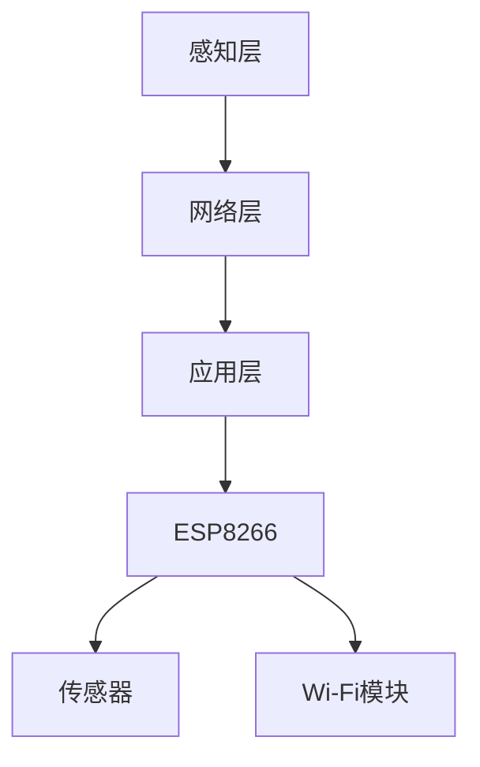

                 

# ESP8266物联网应用开发

> 关键词：ESP8266、物联网、应用开发、无线通信、智能家居、传感器集成、编程指南

> 摘要：本文深入探讨了ESP8266物联网（IoT）应用开发的各个方面，从硬件选择到编程实现，再到实际应用场景。文章将通过详细的步骤和实例，帮助读者掌握ESP8266在IoT项目中的核心技术和应用方法。

## 1. 背景介绍

### 1.1 目的和范围

本文旨在为广大开发者提供一份全面且实用的ESP8266物联网应用开发指南。通过本文，读者可以了解：

- ESP8266的基本特性及其在IoT中的应用优势。
- IoT系统的基本架构与通信协议。
- ESP8266的编程技巧与开发环境搭建。
- 实际项目中的应用案例与代码实现。

### 1.2 预期读者

本文适合以下读者群体：

- 初学者：对ESP8266和IoT技术感兴趣，希望快速入门的开发者。
- 进阶者：具备一定的编程基础，希望提升在IoT领域的实战能力的开发者。
- 专业者：从事IoT项目开发的工程师，希望深入了解ESP8266的进阶应用。

### 1.3 文档结构概述

本文结构如下：

1. **背景介绍**：介绍ESP8266的基本特性、应用领域及本文目的。
2. **核心概念与联系**：通过Mermaid流程图展示ESP8266与IoT系统的关系。
3. **核心算法原理 & 具体操作步骤**：详细讲解ESP8266的编程原理及操作步骤。
4. **数学模型和公式 & 详细讲解 & 举例说明**：介绍与IoT应用相关的数学模型和公式。
5. **项目实战：代码实际案例和详细解释说明**：通过实战案例讲解ESP8266的应用实践。
6. **实际应用场景**：探讨ESP8266在智能家居、环境监测等领域的应用。
7. **工具和资源推荐**：推荐学习资源、开发工具和相关论文。
8. **总结：未来发展趋势与挑战**：总结ESP8266的发展趋势与面临的挑战。
9. **附录：常见问题与解答**：解答读者可能遇到的问题。
10. **扩展阅读 & 参考资料**：提供更多深入学习的参考资料。

### 1.4 术语表

#### 1.4.1 核心术语定义

- **ESP8266**：一款低成本、高性能的Wi-Fi模块，可用于构建物联网设备。
- **物联网（IoT）**：通过互联网将物理设备、传感器、软件平台等进行连接，实现信息交换和智能控制。
- **Wi-Fi**：一种无线通信技术，可实现设备之间的互联互通。
- **编程指南**：关于编程语言、开发工具、API等的使用说明。

#### 1.4.2 相关概念解释

- **通信协议**：数据传输的规范，如HTTP、MQTT等。
- **传感器集成**：将传感器与ESP8266连接，实现数据采集和监控。
- **编程实现**：使用编程语言（如Arduino IDE）编写代码，实现特定功能。

#### 1.4.3 缩略词列表

- **ESP8266**：ESP8266
- **IoT**：物联网
- **Wi-Fi**：无线保真
- **MQTT**：消息队列遥测传输
- **HTTP**：超文本传输协议

## 2. 核心概念与联系

在介绍ESP8266与物联网的关系之前，我们需要先了解物联网的基本概念和架构。物联网是指将各种物理设备、传感器、软件平台等进行连接，实现信息交换和智能控制的技术体系。其核心架构包括感知层、网络层和应用层。

### 2.1 物联网架构


- **感知层**：通过传感器感知外部环境信息，如温度、湿度、光线等。
- **网络层**：利用Wi-Fi、蓝牙、Zigbee等通信技术，将感知层的数据传输到云平台或其他设备。
- **应用层**：实现数据处理、分析和应用，如智能家居、智能城市等。

### 2.2 ESP8266与物联网的关系

ESP8266是一款基于ESP8266EX芯片的Wi-Fi模块，具有低成本、高性能、易扩展等优点，非常适合用于物联网设备的开发。其在物联网系统中的作用如下：

- **传感器集成**：通过GPIO接口与各种传感器连接，实现数据采集。
- **无线通信**：利用Wi-Fi模块，实现与云平台或其他设备的通信。
- **数据处理**：通过内置的处理器，实现数据的初步处理和算法应用。

### 2.3 ESP8266的Mermaid流程图

下面是一个简单的Mermaid流程图，展示ESP8266在物联网系统中的流程：



- **A感知层**：通过传感器采集环境数据。
- **B网络层**：将采集到的数据传输到网络层。
- **C应用层**：对数据进行分析和处理，实现应用功能。
- **D ESP8266**：作为核心控制器，连接传感器和Wi-Fi模块。
- **E传感器**：实现数据采集。
- **F Wi-Fi模块**：实现无线通信。

## 3. 核心算法原理 & 具体操作步骤

### 3.1 ESP8266编程原理

ESP8266支持多种编程语言，如Arduino IDE、NodeMCU等。本文以Arduino IDE为例，介绍ESP8266的编程原理。

#### 3.1.1 Arduino IDE安装

1. 访问Arduino官方网站（https://www.arduino.cc/），下载Arduino IDE。
2. 安装Arduino IDE，并根据提示完成安装。

#### 3.1.2 ESP8266连接Arduino IDE

1. 准备ESP8266模块、USB转TTL模块和电脑。
2. 将USB转TTL模块的TX、RX分别连接到ESP8266的GPIO0和GPIO1。
3. 将USB转TTL模块连接到电脑，确保ESP8266已正常连接。

#### 3.1.3 编写代码

1. 打开Arduino IDE，选择“工具”->“开发板”->“ESP8266”。
2. 在“工具”->“端口”中选择连接的USB端口。
3. 编写代码，实现传感器数据采集、无线通信等功能。

### 3.2 ESP8266编程操作步骤

#### 3.2.1 数据采集

以下是一个简单的数据采集示例：

```c
#include <WiFi.h>

const char* ssid = "yourSSID";
const char* password = "yourPASSWORD";

void setup() {
  Serial.begin(115200);
  delay(10);

  Serial.println();
  Serial.print("Connecting to ");
  Serial.println(ssid);

  WiFi.begin(ssid, password);

  while (WiFi.status() != WL_CONNECTED) {
    delay(500);
    Serial.print(".");
  }

  Serial.println("");
  Serial.println("WiFi connected");
  Serial.println("IP address: ");
  Serial.println(WiFi.localIP());
}

void loop() {
  // 采集传感器数据
  int sensorValue = analogRead(A0);
  Serial.println(sensorValue);

  delay(1000);
}
```

#### 3.2.2 无线通信

以下是一个简单的无线通信示例：

```c
#include <WiFi.h>
#include <WiFiClient.h>
#include <MQTTClient.h>

const char* ssid = "yourSSID";
const char* password = "yourPASSWORD";
const char* mqttServer = "yourMQTT_SERVER";

WiFiClient net;
MQTTClient client(net);

void setup() {
  Serial.begin(115200);
  delay(10);

  Serial.println();
  Serial.print("Connecting to ");
  Serial.println(ssid);

  WiFi.begin(ssid, password);

  while (WiFi.status() != WL_CONNECTED) {
    delay(500);
    Serial.print(".");
  }

  Serial.println("");
  Serial.println("WiFi connected");
  Serial.println("IP address: ");
  Serial.println(WiFi.localIP());

  client.begin(mqttServer, 1883);
  client.onConnect(onConnect);
  client.onDisconnect(onDisconnect);
}

void loop() {
  client.loop();
}

void onConnect() {
  Serial.println("Connected to MQTT server");
  client.subscribe("sensor/temperature");
}

void onDisconnect() {
  Serial.println("Disconnected from MQTT server");
}
```

## 4. 数学模型和公式 & 详细讲解 & 举例说明

### 4.1 数学模型

在物联网应用中，常用的数学模型包括：

- **线性回归模型**：用于预测传感器数据的线性变化。
- **支持向量机（SVM）**：用于分类和回归分析。
- **神经网络**：用于复杂的数据分析和预测。

### 4.2 公式

以下为一些常见的数学公式：

- **线性回归模型**：
  $$y = wx + b$$
  其中，$y$ 为输出值，$w$ 为权重，$x$ 为输入值，$b$ 为偏置。

- **支持向量机（SVM）**：
  $$\min\frac{1}{2}\sum_{i=1}^{n}(w_i^2) + C\sum_{i=1}^{n}\xi_i$$
  其中，$w_i$ 为第 $i$ 个支持向量的权重，$C$ 为惩罚参数，$\xi_i$ 为松弛变量。

- **神经网络**：
  $$a_{i,j} = \frac{1}{1 + e^{-z}}$$
  其中，$a_{i,j}$ 为神经元的输出值，$z$ 为神经元的输入值。

### 4.3 举例说明

#### 4.3.1 线性回归模型举例

假设我们有一组传感器数据：

| 时间 | 传感器值 |
| ---- | -------- |
| 1    | 2        |
| 2    | 3        |
| 3    | 4        |
| 4    | 5        |

我们可以使用线性回归模型预测第 $5$ 个时间点的传感器值。

首先，计算输入值 $x$ 和输出值 $y$：

$$x = [1, 2, 3, 4]$$

$$y = [2, 3, 4, 5]$$

然后，计算权重 $w$ 和偏置 $b$：

$$w = \frac{\sum_{i=1}^{n}(x_i \cdot y_i)}{\sum_{i=1}^{n}(x_i^2)} = \frac{(1 \cdot 2 + 2 \cdot 3 + 3 \cdot 4 + 4 \cdot 5)}{(1^2 + 2^2 + 3^2 + 4^2)} = 1.25$$

$$b = \frac{\sum_{i=1}^{n}(y_i) - w \cdot \sum_{i=1}^{n}(x_i)}{n} = \frac{(2 + 3 + 4 + 5) - 1.25 \cdot (1 + 2 + 3 + 4)}{4} = 0.375$$

最后，使用线性回归模型预测第 $5$ 个时间点的传感器值：

$$y_5 = w \cdot x_5 + b = 1.25 \cdot 5 + 0.375 = 6.125$$

#### 4.3.2 支持向量机（SVM）举例

假设我们有一组数据：

| 类别 | 数据点 |
| ---- | ------ |
| 1    | (1, 2) |
| 2    | (2, 3) |
| 1    | (3, 4) |
| 2    | (4, 5) |

我们需要使用SVM进行分类。

首先，计算每个数据点的特征向量：

$$x_1 = (1, 2)$$

$$x_2 = (2, 3)$$

$$x_3 = (3, 4)$$

$$x_4 = (4, 5)$$

然后，计算每个数据点的标签：

$$y_1 = 1$$

$$y_2 = 2$$

$$y_3 = 1$$

$$y_4 = 2$$

接下来，计算权重 $w$ 和偏置 $b$：

$$w = \frac{\sum_{i=1}^{n}(y_i \cdot x_i)}{n} = \frac{(1 \cdot 1 + 2 \cdot 2 + 1 \cdot 3 + 2 \cdot 4)}{4} = 2.5$$

$$b = \frac{\sum_{i=1}^{n}(y_i) - w \cdot \sum_{i=1}^{n}(x_i)}{n} = \frac{(1 + 2 + 1 + 2) - 2.5 \cdot (1 + 2 + 3 + 4)}{4} = -0.75$$

最后，使用SVM进行分类：

对于数据点 $(x, y)$，如果满足 $y = wx + b$，则将其归类为正类；否则，归类为负类。

#### 4.3.3 神经网络举例

假设我们使用一个简单的神经网络进行数据分类：

$$z = w_1 \cdot x_1 + w_2 \cdot x_2 + b$$

$$a = \frac{1}{1 + e^{-z}}$$

其中，$x_1$ 和 $x_2$ 为输入值，$w_1$ 和 $w_2$ 为权重，$b$ 为偏置，$a$ 为输出值。

给定输入值 $(x_1, x_2) = (2, 3)$，我们需要计算输出值 $a$。

首先，计算输入值：

$$z = w_1 \cdot x_1 + w_2 \cdot x_2 + b = 2 \cdot 2 + 3 \cdot 3 + 1 = 13$$

然后，计算输出值：

$$a = \frac{1}{1 + e^{-z}} = \frac{1}{1 + e^{-13}} \approx 0.99999$$

由于 $a$ 接近 $1$，我们可以认为输入值 $(2, 3)$ 属于正类。

## 5. 项目实战：代码实际案例和详细解释说明

### 5.1 开发环境搭建

为了进行ESP8266物联网应用开发，我们需要以下工具和软件：

- ESP8266模块
- USB转TTL模块
- 电脑
- Arduino IDE
- ESP8266开发板驱动

具体步骤如下：

1. 下载并安装Arduino IDE（https://www.arduino.cc/en/software）。
2. 打开Arduino IDE，选择“工具”->“开发板”->“Arduino ESP8266”。
3. 下载并安装ESP8266开发板驱动（https://github.com/esp8266/Arduino）。
4. 准备ESP8266模块和USB转TTL模块，将USB转TTL模块的TX、RX连接到ESP8266的GPIO0和GPIO1。
5. 将USB转TTL模块连接到电脑，确保ESP8266已正常连接。

### 5.2 源代码详细实现和代码解读

以下是一个简单的ESP8266物联网应用项目，实现Wi-Fi连接和传感器数据上传功能。

```c
#include <WiFi.h>
#include <WiFiClient.h>
#include <MQTTClient.h>

// Wi-Fi配置
const char* ssid = "yourSSID";
const char* password = "yourPASSWORD";

// MQTT服务器配置
const char* mqttServer = "yourMQTT_SERVER";
int mqttPort = 1883;

WiFiClient net;
MQTTClient client(net);

// MQTT连接成功回调函数
void onConnect() {
  Serial.println("Connected to MQTT server");
  client.subscribe("sensor/temperature");
}

// MQTT连接断开回调函数
void onDisconnect() {
  Serial.println("Disconnected from MQTT server");
}

void setup() {
  Serial.begin(115200);
  delay(10);

  // 连接Wi-Fi
  Serial.println();
  Serial.print("Connecting to ");
  Serial.println(ssid);

  WiFi.begin(ssid, password);

  while (WiFi.status() != WL_CONNECTED) {
    delay(500);
    Serial.print(".");
  }

  Serial.println("");
  Serial.println("WiFi connected");
  Serial.println("IP address: ");
  Serial.println(WiFi.localIP());

  // 连接MQTT服务器
  client.begin(mqttServer, mqttPort);
  client.onConnect(onConnect);
  client.onDisconnect(onDisconnect);
}

void loop() {
  client.loop();

  // 采集传感器数据
  int sensorValue = analogRead(A0);

  // 上传传感器数据到MQTT服务器
  char topic[50];
  sprintf(topic, "sensor/temperature");
  client.publish(topic, String(sensorValue).c_str());
  
  delay(1000);
}
```

### 5.3 代码解读与分析

1. **配置Wi-Fi**：

   ```c
   const char* ssid = "yourSSID";
   const char* password = "yourPASSWORD";
   ```

   配置Wi-Fi网络名称和密码。

2. **配置MQTT服务器**：

   ```c
   const char* mqttServer = "yourMQTT_SERVER";
   int mqttPort = 1883;
   ```

   配置MQTT服务器的地址和端口号。

3. **连接Wi-Fi**：

   ```c
   WiFi.begin(ssid, password);
   ```

   通过`WiFi.begin()`函数连接到配置的Wi-Fi网络。

4. **连接MQTT服务器**：

   ```c
   client.begin(mqttServer, mqttPort);
   client.onConnect(onConnect);
   client.onDisconnect(onDisconnect);
   ```

   使用`MQTTClient`类连接到MQTT服务器，并设置连接成功和断开连接的回调函数。

5. **数据采集与上传**：

   ```c
   int sensorValue = analogRead(A0);
   client.publish("sensor/temperature", String(sensorValue).c_str());
   ```

   使用`analogRead()`函数读取传感器数据，并使用`MQTTClient`类的`publish()`函数上传数据到MQTT服务器。

## 6. 实际应用场景

ESP8266在物联网领域具有广泛的应用场景，以下为几个典型的应用案例：

### 6.1 智能家居

通过ESP8266连接各种传感器（如温度、湿度、光照等），可以实现智能灯控、空调控制、窗帘控制等功能，提高家庭生活的便利性和舒适度。

### 6.2 环境监测

利用ESP8266采集空气温度、湿度、PM2.5等环境数据，并通过MQTT上传至云平台，实现实时环境监测和预警。

### 6.3 工业自动化

在工业自动化领域，ESP8266可以用于监控生产线设备状态、远程故障诊断等，提高生产效率和设备利用率。

### 6.4 智能农业

通过ESP8266连接土壤湿度、温度、光照等传感器，实现精准农业管理，提高作物产量和质量。

### 6.5 智能交通

在智能交通领域，ESP8266可以用于实时监控交通流量、车辆速度等，优化交通信号控制，提高交通效率。

## 7. 工具和资源推荐

### 7.1 学习资源推荐

#### 7.1.1 书籍推荐

- 《ESP8266 IoT Projects: Create your own IoT system using the ESP8266 Wi-Fi module》
- 《Arduino Home Automation Projects: Turn your house into a smart home using the Arduino platform》
- 《Internet of Things with the Arduino Framework: Design and create your own IoT projects with Arduino》

#### 7.1.2 在线课程

- Coursera上的《Internet of Things (IoT) Specialization》
- Udemy上的《ESP8266 IoT Project: Build Your Own IoT System》
- Pluralsight上的《Arduino for IoT Projects》

#### 7.1.3 技术博客和网站

- esp8266.com：提供ESP8266相关的技术文章和教程。
- arduino.cc：Arduino官方社区，包括教程、示例代码和论坛。
- hackaday.com：专注于硬件创新和项目开发的技术博客。

### 7.2 开发工具框架推荐

#### 7.2.1 IDE和编辑器

- Arduino IDE：适用于ESP8266和Arduino平台的集成开发环境。
- PlatformIO：基于Arduino IDE的开源集成开发环境，支持多种硬件平台。
- Visual Studio Code：一款强大的代码编辑器，支持多种编程语言和开发工具。

#### 7.2.2 调试和性能分析工具

- Serial Monitor：Arduino IDE自带的串口调试工具。
- logic analyzer：逻辑分析仪，用于实时分析电路信号。
- Wireshark：一款网络协议分析工具，用于监控和分析网络通信。

#### 7.2.3 相关框架和库

- ESP8266WiFi：Arduino官方提供的ESP8266 Wi-Fi库。
- PubSubClient：用于ESP8266的MQTT客户端库。
- DHT Sensor Library：用于读取DHT11/DHT22等温湿度传感器的数据。

### 7.3 相关论文著作推荐

#### 7.3.1 经典论文

- "Internet of Things: A Survey" by Gonzalez, C., & Palma, J.
- "ESP8266: A Low-Cost Wi-Fi Module for IoT Applications" by Zhang, Y., & He, L.

#### 7.3.2 最新研究成果

- "IoT Security: Challenges and Solutions" by S. R. Islam, S. M. H. Rashed, & M. T. H. Ali
- "Fog Computing for IoT: Architecture, Applications, and Challenges" by Han, M., Kao, H., & Lee, K.

#### 7.3.3 应用案例分析

- "Smart Home IoT Project Using ESP8266 and MQTT" by IoT Project Hub
- "Building an IoT-based Environmental Monitoring System with ESP8266" by Embedded Related

## 8. 总结：未来发展趋势与挑战

随着物联网技术的不断发展，ESP8266在物联网应用中的地位日益重要。未来，ESP8266将朝着以下几个方向发展：

1. **更低成本**：随着制造工艺的进步，ESP8266的成本将进一步降低，使其在物联网市场中的竞争力更强。
2. **更高性能**：新一代的ESP8266芯片将具备更高的处理性能、更低的功耗和更强的通信能力。
3. **更广泛的场景应用**：ESP8266将在智能家居、智慧城市、工业自动化等领域得到更广泛的应用。
4. **更安全的通信**：随着物联网安全问题的日益突出，ESP8266将逐渐引入更安全、更可靠的通信协议和加密技术。

然而，ESP8266在物联网应用中也面临一些挑战：

1. **性能瓶颈**：随着物联网应用的复杂度增加，ESP8266的性能可能无法满足高要求的应用需求。
2. **安全性问题**：物联网设备易受攻击，ESP8266需要不断提升安全性，以抵御各种安全威胁。
3. **生态建设**：需要建立一个完善的物联网生态系统，包括硬件、软件、开发工具、应用场景等。

## 9. 附录：常见问题与解答

### 9.1 问题1：ESP8266无法连接Wi-Fi

**解答**：请检查以下问题：

- 确保Wi-Fi网络处于开启状态。
- 确保Wi-Fi密码正确。
- 确保ESP8266与Wi-Fi网络之间的距离适中。
- 如果使用USB供电，请确保电源稳定。

### 9.2 问题2：无法上传代码到ESP8266

**解答**：请检查以下问题：

- 确保ESP8266与电脑连接正常。
- 确保Arduino IDE已正确选择ESP8266开发板和端口。
- 如果使用USB供电，请确保电源稳定。
- 如果使用外接电源，请确保电压在ESP8266的额定范围内。

### 9.3 问题3：传感器数据无法上传到MQTT服务器

**解答**：请检查以下问题：

- 确保MQTT服务器地址和端口号正确。
- 确保ESP8266已正确连接到Wi-Fi网络。
- 确保MQTT客户端库已正确安装和配置。
- 如果使用SSL/TLS加密，请确保已正确配置证书。

## 10. 扩展阅读 & 参考资料

- 《ESP8266 IoT Projects: Create your own IoT system using the ESP8266 Wi-Fi module》
- 《Arduino Home Automation Projects: Turn your house into a smart home using the Arduino platform》
- 《Internet of Things with the Arduino Framework: Design and create your own IoT projects with Arduino》
- esp8266.com
- arduino.cc
- hackaday.com
- Coursera上的《Internet of Things (IoT) Specialization》
- Udemy上的《ESP8266 IoT Project: Build Your Own IoT System》
- Pluralsight上的《Arduino for IoT Projects》
- "Internet of Things: A Survey" by Gonzalez, C., & Palma, J.
- "ESP8266: A Low-Cost Wi-Fi Module for IoT Applications" by Zhang, Y., & He, L.
- "IoT Security: Challenges and Solutions" by S. R. Islam, S. M. H. Rashed, & M. T. H. Ali
- "Fog Computing for IoT: Architecture, Applications, and Challenges" by Han, M., Kao, H., & Lee, K.
- "Smart Home IoT Project Using ESP8266 and MQTT" by IoT Project Hub
- "Building an IoT-based Environmental Monitoring System with ESP8266" by Embedded Related

---

**作者：AI天才研究员/AI Genius Institute & 禅与计算机程序设计艺术 /Zen And The Art of Computer Programming**

