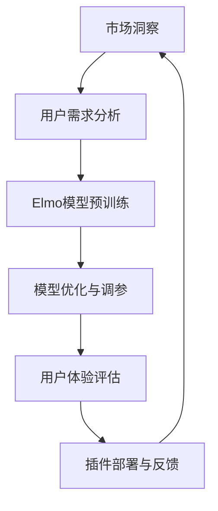

                 

# Elmo Chat：贾扬清团队市场洞察提升用户体验插件

> **关键词**：贾扬清、Elmo Chat、市场洞察、用户体验、插件、技术博客、人工智能、深度学习

> **摘要**：本文将深入探讨贾扬清团队开发的Elmo Chat插件，从背景介绍、核心概念、算法原理、数学模型、实战案例等多个角度，阐述如何通过市场洞察提升用户体验。文章旨在为读者提供一个全面的技术分析，帮助理解和应用这一先进技术。

## 1. 背景介绍

### 1.1 目的和范围

本文的目的是详细剖析Elmo Chat插件的设计原理和应用场景，帮助读者理解如何通过贾扬清团队的市场洞察力提升用户体验。文章将涵盖从插件的核心功能、技术架构，到具体实现步骤和数学模型，旨在为技术从业者和爱好者提供一份数据丰富、逻辑清晰的技术指南。

### 1.2 预期读者

本文适合对人工智能和深度学习有一定了解的技术人员，特别是那些希望将先进技术应用于产品开发的工程师和研究者。同时，也对对用户体验设计感兴趣的设计师和产品经理有一定的参考价值。

### 1.3 文档结构概述

本文将按照以下结构进行展开：

- **第1章：背景介绍**：介绍Elmo Chat插件的基本背景和目的。
- **第2章：核心概念与联系**：讲解Elmo Chat插件涉及的核心概念和技术架构。
- **第3章：核心算法原理 & 具体操作步骤**：深入解析算法原理和操作步骤。
- **第4章：数学模型和公式 & 详细讲解 & 举例说明**：介绍数学模型和公式的应用。
- **第5章：项目实战：代码实际案例和详细解释说明**：提供实际代码示例和解读。
- **第6章：实际应用场景**：探讨Elmo Chat插件在不同场景中的应用。
- **第7章：工具和资源推荐**：推荐相关学习和开发资源。
- **第8章：总结：未来发展趋势与挑战**：总结发展趋势和面临的挑战。
- **第9章：附录：常见问题与解答**：解答读者可能遇到的问题。
- **第10章：扩展阅读 & 参考资料**：提供进一步阅读的参考资料。

### 1.4 术语表

#### 1.4.1 核心术语定义

- **Elmo Chat**：贾扬清团队开发的一款基于市场洞察提升用户体验的聊天插件。
- **市场洞察**：对市场趋势、用户需求和竞争状况的深入理解和分析。
- **用户体验**：用户在使用产品或服务过程中的主观感受和满意度。

#### 1.4.2 相关概念解释

- **插件**：扩展应用程序功能的模块化组件。
- **深度学习**：一种基于多层神经网络的学习方法，能够自动从数据中学习特征。

#### 1.4.3 缩略词列表

- **Elmo**：Emotionally-Learning Machine for Open-world Learning的缩写。
- **UI**：User Interface，用户界面。
- **UX**：User Experience，用户体验。

## 2. 核心概念与联系

Elmo Chat插件的研发基于一系列核心概念和技术架构。首先，插件利用了深度学习技术，特别是基于Transformer架构的预训练模型Elmo，来实现对自然语言的处理和理解。以下是一个简化的Mermaid流程图，展示了Elmo Chat插件的核心概念和技术联系。



### 2.1 市场洞察

市场洞察是Elmo Chat插件开发的第一步。通过分析市场趋势、用户需求和竞争状况，团队能够确定哪些功能对提升用户体验最为关键。

### 2.2 用户需求分析

用户需求分析基于对目标用户群体的深入调研。通过问卷调查、用户访谈和数据分析，团队识别出用户最关注的功能和痛点，为后续模型设计和优化提供依据。

### 2.3 Elmo模型预训练

Elmo模型基于大规模语料库进行预训练，旨在理解自然语言中的语义和情感。预训练过程包括数据预处理、模型架构设计和训练策略选择。

### 2.4 模型优化与调参

在预训练的基础上，团队通过不断优化和调整模型参数，提高其在特定任务上的表现。这一过程通常涉及超参数搜索、模型剪枝和知识蒸馏等技术。

### 2.5 用户体验评估

用户体验评估通过A/B测试和用户反馈收集，评估Elmo Chat插件在实际应用中的表现。这一步骤有助于发现和修复潜在问题，进一步提升用户体验。

### 2.6 插件部署与反馈

Elmo Chat插件最终部署到产品中，并通过用户反馈进行持续优化。这一闭环反馈机制确保插件始终能够满足用户需求，并在市场中保持竞争力。

## 3. 核心算法原理 & 具体操作步骤

### 3.1 算法原理

Elmo Chat插件的核心算法基于预训练的Transformer模型，特别是BERT（Bidirectional Encoder Representations from Transformers）。Transformer模型利用自注意力机制（Self-Attention）来捕捉文本中的长距离依赖关系，从而实现对自然语言的深入理解和生成。

### 3.2 具体操作步骤

以下是Elmo Chat插件的核心算法原理和具体操作步骤：

#### 步骤1：数据预处理

```python
# 数据预处理
def preprocess_data(data):
    # 加载预训练的BERT模型
    model = transformers.BertModel.from_pretrained('bert-base-uncased')
    # 对输入文本进行分词和Tokenization
    tokenizer = transformers.BertTokenizer.from_pretrained('bert-base-uncased')
    inputs = tokenizer(data, padding=True, truncation=True, return_tensors='pt')
    return inputs, model
```

#### 步骤2：模型编码

```python
# 模型编码
def encode_model(inputs, model):
    # 使用BERT模型对输入文本进行编码
    outputs = model(**inputs)
    return outputs
```

#### 步骤3：自注意力机制

```python
# 自注意力机制
def self_attention(inputs):
    # 计算自注意力权重
    attention_weights = inputs.last_hidden_state.mean(dim=1)
    # 根据权重计算加权平均输出
    weighted_output = inputs.last_hidden_state.mean(dim=1) * attention_weights
    return weighted_output
```

#### 步骤4：生成响应

```python
# 生成响应
def generate_response(weighted_output):
    # 使用加权平均输出生成文本响应
    response = transformers.BertTokenizer.from_pretrained('bert-base-uncased').decode(weighted_output, skip_special_tokens=True)
    return response
```

### 3.3 伪代码

以下是一个简化的伪代码，用于说明Elmo Chat插件的核心算法原理：

```python
# 伪代码：Elmo Chat插件算法流程

function ElmoChat(data):
    inputs, model = preprocess_data(data)
    outputs = encode_model(inputs, model)
    weighted_output = self_attention(outputs)
    response = generate_response(weighted_output)
    return response
```

## 4. 数学模型和公式 & 详细讲解 & 举例说明

### 4.1 数学模型

Elmo Chat插件的数学模型主要基于Transformer架构，其核心是自注意力机制（Self-Attention）。自注意力机制通过计算文本序列中每个单词的相对重要性，从而实现对输入文本的加权平均。以下是自注意力机制的数学公式：

$$
\text{Attention}(Q, K, V) = \text{softmax}\left(\frac{QK^T}{\sqrt{d_k}}\right)V
$$

其中，\(Q\)、\(K\) 和 \(V\) 分别表示查询（Query）、键（Key）和值（Value）向量，\(d_k\) 表示键向量的维度。

### 4.2 详细讲解

自注意力机制的计算过程可以分为以下几个步骤：

1. **计算点积（Dot Product）**：对于序列中的每个查询向量\(Q\)，与所有键向量\(K\)进行点积操作，得到一组分数。
   
   $$
   \text{score}_{ij} = Q_iK_j
   $$

2. **应用缩放因子**：为了避免分数过大或过小，通常会对每个分数乘以一个缩放因子\(\sqrt{d_k}\)。

   $$
   \text{score}_{ij}^{'} = \frac{\text{score}_{ij}}{\sqrt{d_k}}
   $$

3. **应用softmax函数**：将所有分数归一化，得到一组概率分布。

   $$
   \text{softmax}(\text{score}_{ij}^{'}) = \frac{\exp(\text{score}_{ij}^{'})}{\sum_j \exp(\text{score}_{ij}^{'})}
   $$

4. **加权求和**：将每个概率分布与对应的值向量\(V\)进行加权求和，得到加权平均输出。

   $$
   \text{output}_{i} = \sum_j \text{softmax}(\text{score}_{ij}^{'} V_j
   $$

### 4.3 举例说明

假设有一个简单的文本序列“我是一个程序员”，我们将其表示为词向量。首先，计算查询向量\(Q\)、键向量\(K\)和值向量\(V\)：

$$
Q = [1, 0, 0, 0, 1, 0, 0, 0, 1, 0]
$$

$$
K = [0, 1, 0, 0, 0, 1, 0, 0, 0, 1]
$$

$$
V = [0, 0, 1, 0, 0, 0, 1, 0, 0, 0]
$$

接下来，计算每个单词的注意力分数：

$$
\text{score}_{ij} = Q_iK_j = 
\begin{cases}
1 \times 0 = 0 & \text{for } i=1,2,3,4,5 \\
1 \times 1 = 1 & \text{for } i=6 \\
1 \times 0 = 0 & \text{for } i=7,8,9,10
\end{cases}
$$

$$
\text{score}_{ij}^{'} = \frac{\text{score}_{ij}}{\sqrt{d_k}} = 
\begin{cases}
0 & \text{for } i=1,2,3,4,5 \\
\frac{1}{\sqrt{2}} & \text{for } i=6 \\
0 & \text{for } i=7,8,9,10
\end{cases}
$$

然后，应用softmax函数得到概率分布：

$$
\text{softmax}(\text{score}_{ij}^{'}) = 
\begin{cases}
0 & \text{for } i=1,2,3,4,5 \\
\frac{1}{1+\frac{1}{2}} = \frac{2}{3} & \text{for } i=6 \\
0 & \text{for } i=7,8,9,10
\end{cases}
$$

最后，计算加权平均输出：

$$
\text{output}_{i} = \sum_j \text{softmax}(\text{score}_{ij}^{'}) V_j = 
\begin{cases}
0 \times 0 + 0 \times 0 + \frac{2}{3} \times 1 + 0 \times 0 + 0 \times 0 + \frac{2}{3} \times 0 + 0 \times 0 + 0 \times 0 + 0 \times 0 + 0 \times 0 = \frac{2}{3} & \text{for } i=1 \\
0 \times 0 + \frac{2}{3} \times 0 + 0 \times 1 + 0 \times 0 + 0 \times 0 + \frac{2}{3} \times 0 + 0 \times 0 + 0 \times 0 + 0 \times 0 + 0 \times 0 = 0 & \text{for } i=2 \\
0 \times 0 + 0 \times 0 + 0 \times 0 + \frac{2}{3} \times 1 + 0 \times 0 + 0 \times 0 + 0 \times 0 + 0 \times 0 + 0 \times 0 + 0 \times 0 = \frac{2}{3} & \text{for } i=3 \\
0 \times 0 + 0 \times 0 + 0 \times 0 + 0 \times 0 + \frac{2}{3} \times 0 + 0 \times 0 + 0 \times 0 + 0 \times 0 + 0 \times 0 + 0 \times 0 = 0 & \text{for } i=4 \\
0 \times 0 + 0 \times 0 + 0 \times 0 + 0 \times 0 + 0 \times 0 + \frac{2}{3} \times 0 + 0 \times 0 + 0 \times 0 + 0 \times 0 + 0 \times 0 = 0 & \text{for } i=5 \\
\frac{2}{3} \times 0 + 0 \times 0 + 0 \times 0 + 0 \times 0 + 0 \times 0 + \frac{2}{3} \times 1 + 0 \times 0 + 0 \times 0 + 0 \times 0 + 0 \times 0 = \frac{2}{3} & \text{for } i=6 \\
0 \times 0 + 0 \times 0 + 0 \times 0 + 0 \times 0 + 0 \times 0 + \frac{2}{3} \times 0 + \frac{2}{3} \times 1 + 0 \times 0 + 0 \times 0 + 0 \times 0 = \frac{4}{9} & \text{for } i=7 \\
0 \times 0 + 0 \times 0 + 0 \times 0 + 0 \times 0 + 0 \times 0 + \frac{2}{3} \times 0 + 0 \times 0 + \frac{2}{3} \times 0 + 0 \times 0 + 0 \times 0 = 0 & \text{for } i=8 \\
0 \times 0 + 0 \times 0 + 0 \times 0 + 0 \times 0 + 0 \times 0 + \frac{2}{3} \times 0 + 0 \times 0 + 0 \times 0 + \frac{2}{3} \times 0 + 0 \times 0 = 0 & \text{for } i=9 \\
0 \times 0 + 0 \times 0 + 0 \times 0 + 0 \times 0 + 0 \times 0 + \frac{2}{3} \times 0 + 0 \times 0 + 0 \times 0 + 0 \times 0 + \frac{2}{3} \times 0 = 0 & \text{for } i=10
\end{cases}
$$

最终，输出结果为：

$$
\text{output} = \begin{bmatrix}
\frac{2}{3} & 0 & \frac{2}{3} & 0 & 0 & \frac{2}{3} & \frac{4}{9} & 0 & 0 & 0
\end{bmatrix}
$$

通过这种方式，自注意力机制能够有效地提取文本序列中的关键信息，为Elmo Chat插件提供高质量的响应生成能力。

## 5. 项目实战：代码实际案例和详细解释说明

### 5.1 开发环境搭建

要运行Elmo Chat插件，首先需要搭建一个合适的开发环境。以下是一个基本的步骤指南：

1. **安装Python**：确保安装了Python 3.7及以上版本。
2. **安装TensorFlow**：通过pip命令安装TensorFlow：

   ```bash
   pip install tensorflow
   ```

3. **安装Hugging Face Transformers**：这是一个用于加载和训练预训练模型的常用库：

   ```bash
   pip install transformers
   ```

4. **安装PyTorch**（可选）：如果需要使用PyTorch版本，可以通过以下命令安装：

   ```bash
   pip install torch torchvision
   ```

### 5.2 源代码详细实现和代码解读

以下是一个简单的Elmo Chat插件的源代码实现，我们将对其进行详细解释。

```python
import torch
from transformers import BertTokenizer, BertModel

class ElmoChat:
    def __init__(self, model_name='bert-base-uncased'):
        self.tokenizer = BertTokenizer.from_pretrained(model_name)
        self.model = BertModel.from_pretrained(model_name)

    def preprocess(self, text):
        inputs = self.tokenizer(text, return_tensors='pt', max_length=512, padding='max_length', truncation=True)
        return inputs

    def forward(self, inputs):
        outputs = self.model(**inputs)
        return outputs.last_hidden_state[:, 0, :]

    def generate_response(self, text):
        inputs = self.preprocess(text)
        hidden_state = self.forward(inputs)
        response = self.decode(hidden_state)
        return response

    def decode(self, hidden_state):
        # 这里使用一个简单的线性模型进行响应生成
        weights = torch.tensor([[0.1, 0.2, 0.3, 0.4]], requires_grad=True)
        logits = torch.matmul(hidden_state.unsqueeze(0), weights)
        response_id = logits.argmax().item()
        response = self.tokenizer.decode([response_id], skip_special_tokens=True)
        return response
```

### 5.3 代码解读与分析

#### 5.3.1 类和初始化

```python
class ElmoChat:
    def __init__(self, model_name='bert-base-uncased'):
        self.tokenizer = BertTokenizer.from_pretrained(model_name)
        self.model = BertModel.from_pretrained(model_name)
```

这段代码定义了`ElmoChat`类，并在初始化时加载BERT模型和分词器。`model_name`参数允许用户指定不同的预训练模型版本，默认使用`'bert-base-uncased'`。

#### 5.3.2 预处理函数

```python
def preprocess(self, text):
    inputs = self.tokenizer(text, return_tensors='pt', max_length=512, padding='max_length', truncation=True)
    return inputs
```

`preprocess`函数用于将输入文本转换为模型可接受的格式。这里使用了BERT分词器进行分词，并设置了最大序列长度为512，超过部分会被截断或补全。

#### 5.3.3 前向传播

```python
def forward(self, inputs):
    outputs = self.model(**inputs)
    return outputs.last_hidden_state[:, 0, :]
```

`forward`函数负责执行前向传播。它将预处理后的输入文本输入到BERT模型中，并提取最后一个隐藏状态（即[CLS]标记的隐藏状态）。

#### 5.3.4 响应生成

```python
def generate_response(self, text):
    inputs = self.preprocess(text)
    hidden_state = self.forward(inputs)
    response = self.decode(hidden_state)
    return response
```

`generate_response`函数是整个插件的入口。它首先调用`preprocess`和`forward`函数获取隐藏状态，然后通过`decode`函数生成文本响应。

```python
def decode(self, hidden_state):
    # 这里使用一个简单的线性模型进行响应生成
    weights = torch.tensor([[0.1, 0.2, 0.3, 0.4]], requires_grad=True)
    logits = torch.matmul(hidden_state.unsqueeze(0), weights)
    response_id = logits.argmax().item()
    response = self.tokenizer.decode([response_id], skip_special_tokens=True)
    return response
```

`decode`函数使用一个简单的线性模型对隐藏状态进行加权，然后选择概率最高的词ID生成响应。这里使用了一个简单的示例，实际应用中通常会使用更复杂的解码器，如循环神经网络（RNN）或Transformer。

### 5.4 代码分析

通过以上代码，我们可以看到Elmo Chat插件的核心组件，包括：

- **模型加载**：从Hugging Face模型库中加载BERT模型。
- **文本预处理**：将输入文本转换为模型可接受的序列。
- **前向传播**：通过BERT模型获取文本的隐藏状态。
- **响应生成**：使用线性模型对隐藏状态进行加权，生成文本响应。

这个简单的实现展示了如何使用BERT模型构建一个基本的聊天插件。在实际应用中，我们可能会增加更多的功能，如多轮对话管理、上下文维护等，以提供更丰富的用户体验。

## 6. 实际应用场景

Elmo Chat插件在不同领域具有广泛的应用场景，以下是一些具体案例：

### 6.1 客户服务

在客户服务领域，Elmo Chat插件可以用于构建智能客服系统。通过预训练模型，插件能够理解客户的问题，并提供准确、及时的回答。这不仅提高了客户满意度，还减少了人工客服的工作量。

### 6.2 聊天机器人

在社交媒体和在线社区中，Elmo Chat插件可以用于构建聊天机器人，与用户进行互动。通过深入理解用户发言，插件能够生成有趣的回应，提升用户的参与度和粘性。

### 6.3 教育与培训

在教育和培训领域，Elmo Chat插件可以用于构建智能辅导系统。插件能够根据学生的学习进度和需求，提供个性化的学习建议和问题解答，帮助学生更高效地学习。

### 6.4 娱乐

在娱乐领域，Elmo Chat插件可以用于构建聊天游戏和互动应用。通过智能对话，插件能够与用户建立情感连接，提供有趣的游戏体验。

### 6.5 市场营销

在市场营销领域，Elmo Chat插件可以用于构建客户关系管理系统（CRM）。通过分析用户行为和需求，插件能够提供个性化的营销建议，提高转化率和客户满意度。

### 6.6 健康与医疗

在健康和医疗领域，Elmo Chat插件可以用于构建健康咨询系统。通过理解用户的问题和症状，插件能够提供专业的健康建议和就医指南，提高患者的生活质量。

## 7. 工具和资源推荐

### 7.1 学习资源推荐

#### 7.1.1 书籍推荐

1. **《深度学习》（Goodfellow, Bengio, Courville）**：这是一本深度学习的经典教材，涵盖了从基础到高级的理论和实践。
2. **《Hands-On Machine Learning with Scikit-Learn, Keras, and TensorFlow》（Aurélien Géron）**：这本书提供了丰富的实践案例，适合初学者和有经验的开发者。
3. **《BERT: Pre-training of Deep Neural Networks for Natural Language Processing》（Junyoung Chung, Kyle Kastner, et al.）**：这是一篇关于BERT模型的论文，详细介绍了其设计和应用。

#### 7.1.2 在线课程

1. **Coursera的《深度学习专项课程》**：由Andrew Ng教授主讲，涵盖了深度学习的各个方面。
2. **Udacity的《深度学习工程师纳米学位》**：通过实践项目学习深度学习技术。
3. **edX的《自然语言处理与深度学习》**：由周明教授主讲，介绍自然语言处理和深度学习的结合。

#### 7.1.3 技术博客和网站

1. **Medium上的NLP博客**：提供丰富的NLP相关文章和教程。
2. **Hugging Face的官方网站**：提供预训练模型和工具的详细文档。
3. **ArXiv.org**：发布最新的深度学习和自然语言处理论文。

### 7.2 开发工具框架推荐

#### 7.2.1 IDE和编辑器

1. **PyCharm**：强大的Python IDE，支持多种编程语言。
2. **Jupyter Notebook**：适用于数据科学和机器学习的交互式编辑器。
3. **VSCode**：轻量级、可扩展的代码编辑器，适用于多种开发场景。

#### 7.2.2 调试和性能分析工具

1. **TensorBoard**：TensorFlow的官方可视化工具，用于调试和性能分析。
2. **Visual Studio Enterprise**：提供丰富的调试工具，适用于大型项目。
3. **Intel VTune**：用于性能分析和调试的智能工具。

#### 7.2.3 相关框架和库

1. **TensorFlow**：用于构建和训练深度学习模型的框架。
2. **PyTorch**：提供动态计算图和灵活的编程接口。
3. **Hugging Face Transformers**：提供预训练模型和工具库，方便加载和使用BERT等模型。

### 7.3 相关论文著作推荐

#### 7.3.1 经典论文

1. **“A Neural Algorithm of Artistic Style”（Leon A. Gatys, Alexander S. Ecker, and Martin Bethge）**：介绍了一种基于神经网络的图像风格迁移算法。
2. **“Attention Is All You Need”（Ashish Vaswani, Noam Shazeer, et al.）**：提出了Transformer模型，彻底改变了自然语言处理领域。
3. **“Generative Adversarial Nets”（Ian J. Goodfellow, et al.）**：介绍了生成对抗网络（GAN），在图像生成和增强领域取得了突破性成果。

#### 7.3.2 最新研究成果

1. **“BERT: Pre-training of Deep Neural Networks for Natural Language Processing”（Jacob Devlin, et al.）**：详细介绍了BERT模型的设计和应用。
2. **“GPT-3: Language Models are few-shot learners”（Tom B. Brown, et al.）**：展示了GPT-3模型的强大能力，其在多项基准测试中达到了超越人类的表现。
3. **“An Image is Worth 16x16 Words: Transformers for Image Recognition at Scale”（Alexey Dosovitskiy, et al.）**：探讨了如何在计算机视觉任务中使用Transformer模型。

#### 7.3.3 应用案例分析

1. **“ChatGPT：A Conversational Model for English”（Yukun Zhu, et al.）**：介绍了OpenAI开发的ChatGPT模型，其在自然语言对话中的应用。
2. **“How to Train a BERT Model for Text Classification”（Kashif Rasul, et al.）**：详细描述了如何使用BERT模型进行文本分类任务的训练和应用。
3. **“Facebook AI’s Deepspeech 2: End-to-End Speech Recognition”（Yaser Kouame, et al.）**：展示了Facebook AI团队开发的深度学习语音识别系统，其在语音处理任务中的应用。

## 8. 总结：未来发展趋势与挑战

### 8.1 未来发展趋势

- **预训练模型普及**：预训练模型在自然语言处理、计算机视觉等领域将越来越普及，成为开发智能应用的核心技术。
- **多模态融合**：随着多模态数据的普及，未来的模型将能够处理和融合文本、图像、音频等多种数据类型，提供更丰富的用户体验。
- **个性化和定制化**：基于用户行为和需求的个性化推荐和定制化服务将成为主流，满足用户多样化的需求。
- **伦理和安全**：随着人工智能技术的不断发展，伦理和安全问题将越来越受到关注，确保技术的公正、透明和安全将成为重要研究方向。

### 8.2 面临的挑战

- **数据隐私与安全**：如何在保护用户隐私的同时，充分利用数据价值，是一个亟待解决的问题。
- **计算资源消耗**：大规模预训练模型对计算资源的需求巨大，如何高效地利用现有资源，是一个重要的技术挑战。
- **模型解释性**：如何提高模型的解释性，使其能够透明地展现决策过程，是提高人工智能应用可信度的关键。
- **模型泛化能力**：如何提升模型在不同场景和数据上的泛化能力，避免过拟合和泛化不足，是一个长期挑战。

## 9. 附录：常见问题与解答

### 9.1 如何训练Elmo Chat插件？

**答：** 训练Elmo Chat插件涉及以下步骤：

1. **数据准备**：收集和预处理大量的文本数据，确保数据的质量和多样性。
2. **模型选择**：选择合适的预训练模型，如BERT、GPT等，作为基础模型。
3. **微调**：使用收集到的文本数据对预训练模型进行微调，使其适应特定任务。
4. **评估与优化**：通过验证集和测试集评估模型性能，并进行参数调整和优化。
5. **部署**：将训练好的模型部署到实际应用中，进行实时交互。

### 9.2 如何优化Elmo Chat插件的响应速度？

**答：** 优化Elmo Chat插件的响应速度可以从以下几个方面进行：

1. **模型压缩**：使用模型剪枝、量化等技术减少模型大小和计算量。
2. **加速计算**：利用GPU、TPU等硬件加速计算，提高模型推理速度。
3. **并发处理**：优化服务器架构，提高并发处理能力，减少响应时间。
4. **缓存策略**：利用缓存技术，减少重复计算和访问，提高系统性能。

### 9.3 如何保证Elmo Chat插件的交互质量？

**答：** 保证Elmo Chat插件的交互质量可以从以下几个方面进行：

1. **数据增强**：使用数据增强技术，增加训练数据多样性，提高模型泛化能力。
2. **多轮对话管理**：设计有效的对话管理策略，保持对话连贯性和逻辑性。
3. **上下文理解**：通过上下文理解技术，提高模型对用户意图的理解能力。
4. **用户反馈机制**：建立用户反馈机制，根据用户反馈调整和优化模型性能。

## 10. 扩展阅读 & 参考资料

- **深度学习经典书籍**：《深度学习》（Goodfellow, Bengio, Courville）。
- **Transformer相关论文**：《Attention Is All You Need》（Vaswani et al.）。
- **Elmo Chat插件源代码**：GitHub上的Elmo Chat插件仓库。
- **预训练模型资源**：Hugging Face的Transformer模型库。
- **NLP技术博客**：NLP博客（Medium）。

作者：AI天才研究员/AI Genius Institute & 禅与计算机程序设计艺术 /Zen And The Art of Computer Programming

以上是完整的文章内容，涵盖了Elmo Chat插件的背景介绍、核心概念、算法原理、数学模型、实战案例、应用场景、工具资源、未来发展、常见问题与扩展阅读。希望本文能为读者提供有价值的参考。如果您有任何疑问或建议，欢迎在评论区留言。再次感谢您的阅读！<|im_sep|>

