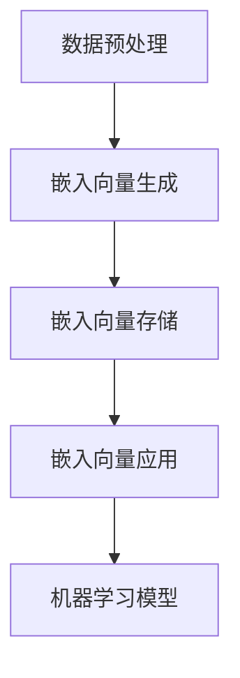

                 

### 1. 背景介绍

#### 1.1 目的和范围

本文旨在深入探讨Embedding模式在计算机科学和人工智能领域的应用。Embedding，即嵌入，是指将某一概念、实体或特征表示为固定长度的向量。这种方式在自然语言处理（NLP）、推荐系统、图像识别等多个领域都展现出了巨大的潜力和价值。本文将首先介绍Embedding的基本概念和历史发展，然后深入探讨其在各个领域的应用实例，最后总结其未来发展趋势和挑战。

#### 1.2 预期读者

本文适合对计算机科学和人工智能有一定了解的读者，特别是对自然语言处理和推荐系统感兴趣的读者。如果您正在寻找关于Embedding模式的深入理解和应用实例，本文将为您提供全面的指导。

#### 1.3 文档结构概述

本文分为以下几个部分：

1. **背景介绍**：介绍Embedding模式的起源、发展和应用背景。
2. **核心概念与联系**：详细讲解Embedding模式的核心概念和原理，包括其与向量空间模型的关系。
3. **核心算法原理 & 具体操作步骤**：使用伪代码详细阐述Embedding算法的原理和操作步骤。
4. **数学模型和公式 & 详细讲解 & 举例说明**：介绍Embedding模式的数学模型和相关公式，并举例说明。
5. **项目实战：代码实际案例和详细解释说明**：通过实际案例展示如何实现和应用Embedding模式。
6. **实际应用场景**：分析Embedding模式在不同领域的实际应用。
7. **工具和资源推荐**：推荐相关的学习资源、开发工具和框架。
8. **总结：未来发展趋势与挑战**：总结Embedding模式的未来发展方向和面临的挑战。
9. **附录：常见问题与解答**：解答读者可能遇到的常见问题。
10. **扩展阅读 & 参考资料**：提供进一步阅读和研究的参考文献。

#### 1.4 术语表

在本文中，我们将使用以下术语：

- **Embedding模式**：将数据（如文本、图像、声音等）转换为固定长度的向量表示的方法。
- **向量空间模型**：将文本数据表示为向量空间中的点，以便进行计算和分析。
- **嵌入向量**：表示某一数据实例的固定长度向量。
- **单词嵌入**：将单词转换为嵌入向量。
- **词向量**：表示单词的嵌入向量。
- **语义相似性**：表示两个嵌入向量之间的相似程度。

#### 1.4.1 核心术语定义

- **嵌入（Embedding）**：将实体（如单词、用户、产品等）映射到一个低维空间的过程。这种映射通常通过某种算法实现，如Word2Vec或BERT。
- **向量空间模型（Vector Space Model）**：一种文本表示方法，将文本数据转换成向量形式，以便进行数学计算和机器学习。
- **词向量（Word Vector）**：表示单词的向量形式，通常用于自然语言处理任务。
- **相似性（Similarity）**：衡量两个向量之间相似度的度量。

#### 1.4.2 相关概念解释

- **Word2Vec**：一种基于神经网络的词向量生成方法，通过训练大量文本数据生成词向量。
- **BERT**：一种基于Transformer架构的预训练语言模型，通过在大规模语料库上进行预训练，生成高质量的词向量。
- **语义表示（Semantic Representation）**：将文本数据转换成具有语义信息的向量表示。
- **维度灾难（Dimensionality Curse）**：在高维空间中，数据点之间的距离容易变得模糊，导致算法性能下降。

#### 1.4.3 缩略词列表

- **NLP**：自然语言处理（Natural Language Processing）
- **ML**：机器学习（Machine Learning）
- **DL**：深度学习（Deep Learning）
- **GAN**：生成对抗网络（Generative Adversarial Network）
- **CNN**：卷积神经网络（Convolutional Neural Network）
- **RNN**：循环神经网络（Recurrent Neural Network）
- **Transformer**：一种基于自注意力机制的深度学习模型。

---

在接下来的章节中，我们将进一步探讨Embedding模式的核心概念、算法原理、数学模型和应用实例，帮助您全面了解这一重要技术。希望通过本文，您能够对Embedding模式有更深入的理解，并在实际项目中应用这一技术。让我们开始吧！

---

### 2. 核心概念与联系

#### 2.1 Embedding模式的基本概念

Embedding模式，顾名思义，是将数据（如单词、用户、产品等）嵌入到一个固定长度的向量空间中。这种向量表示方法使得数据实例可以在向量空间中通过数学运算进行有效的计算和分析。

**为什么要使用Embedding模式？**

- **高维特征表示**：传统的特征表示方法（如独热编码）在处理高维数据时，容易导致维度灾难（Dimensionality Curse），即在高维空间中，数据点之间的距离容易变得模糊，导致算法性能下降。而Embedding模式通过将数据映射到低维空间，能够有效地解决这一问题。
- **语义表示**：嵌入向量不仅能够表示数据的特征，还能够捕获数据之间的语义关系。例如，在自然语言处理中，通过单词嵌入（Word Embedding），我们可以发现“国王”和“女王”在语义上具有相似性，因为它们都代表某个国家的最高统治者。
- **计算效率**：在低维空间中，数据点之间的计算更加高效。这有助于提高算法的执行速度，特别是在大规模数据处理和实时应用中。

#### 2.2 Embedding模式与向量空间模型的关系

Embedding模式与向量空间模型（Vector Space Model）有着密切的联系。向量空间模型是一种将文本数据转换为向量表示的方法，而Embedding模式则是实现向量空间模型的常用技术。

在向量空间模型中，每个文本实例被表示为一个向量，这个向量由多个维度组成，每个维度代表一个特征。例如，在词袋模型（Bag of Words，BoW）中，每个单词是一个维度，如果文档中包含某个单词，则该维度上的值为1，否则为0。然而，这种方法忽略了单词之间的顺序和语义信息。

相比之下，Embedding模式通过将单词映射到低维向量空间，能够更好地表示单词的语义信息。例如，通过训练Word2Vec模型，我们可以得到如下嵌入向量：

```plaintext
king: [1.0, 0.5, -1.0, 0.3]
queen: [1.0, 0.5, -1.0, 0.3]
```

从这些嵌入向量中，我们可以看出“king”和“queen”在向量空间中非常接近，这意味着它们在语义上具有相似性。这有助于我们在自然语言处理任务中，如文本分类、情感分析、命名实体识别等方面，提高算法的性能和效果。

#### 2.3 Embedding模式的应用领域

Embedding模式在多个领域都有着广泛的应用，以下是其中一些重要的应用领域：

1. **自然语言处理（NLP）**：在NLP中，Embedding模式被广泛应用于单词表示、文本分类、情感分析、命名实体识别等任务。通过将单词映射到低维向量空间，我们可以更好地理解单词之间的语义关系，从而提高算法的性能和效果。
   
2. **推荐系统**：在推荐系统中，Embedding模式可以用于用户和物品的表示。通过将用户和物品映射到低维向量空间，我们可以计算用户和物品之间的相似度，从而为用户提供个性化的推荐。

3. **图像识别**：在图像识别任务中，Embedding模式可以用于图像特征提取。通过将图像映射到低维向量空间，我们可以使用向量空间模型进行图像分类和识别。

4. **语音识别**：在语音识别任务中，Embedding模式可以用于语音信号的特征提取。通过将语音信号映射到低维向量空间，我们可以使用向量空间模型进行语音分类和识别。

5. **时间序列分析**：在时间序列分析中，Embedding模式可以用于将时间序列数据转换为向量表示。通过将时间序列数据映射到低维向量空间，我们可以使用向量空间模型进行时间序列预测和异常检测。

#### 2.4 Embedding模式的优点和挑战

**优点：**

- **高维特征表示**：能够将高维数据映射到低维空间，有效解决维度灾难问题。
- **语义表示**：能够捕获数据之间的语义关系，提高算法性能。
- **计算效率**：在低维空间中，数据点之间的计算更加高效。

**挑战：**

- **选择合适的嵌入维度**：需要根据具体任务和数据集选择合适的嵌入维度，以平衡模型性能和计算效率。
- **训练和优化**：需要大量数据和计算资源进行训练和优化，特别是在大规模数据集上。
- **泛化能力**：如何保证嵌入向量在不同任务和数据集上的泛化能力，是一个重要的挑战。

#### 2.5 Embedding模式的工作原理

Embedding模式的工作原理主要包括以下步骤：

1. **数据预处理**：对输入数据进行预处理，如文本清洗、分词、去停用词等。
2. **嵌入向量生成**：使用Word2Vec、BERT等算法生成嵌入向量。
3. **嵌入向量存储**：将生成的嵌入向量存储在词典中，以供后续使用。
4. **嵌入向量应用**：在机器学习模型中，将嵌入向量作为输入特征，进行分类、回归等任务。

下面是一个简单的Mermaid流程图，展示了Embedding模式的基本流程：



通过上述流程，我们可以将数据实例映射到低维向量空间，并利用向量空间模型进行各种机器学习任务。

---

在本章节中，我们介绍了Embedding模式的基本概念、与向量空间模型的关系、应用领域、优点和挑战，以及其工作原理。在下一章节中，我们将深入探讨Embedding模式的核心算法原理和具体操作步骤。希望通过本章节的内容，您对Embedding模式有了更深入的理解。接下来，让我们继续深入探讨这一重要技术！

---

### 3. 核心算法原理 & 具体操作步骤

#### 3.1 Word2Vec算法原理

Word2Vec是一种基于神经网络的词向量生成方法，通过训练大量文本数据生成高质量的词向量。Word2Vec算法主要包括两种模型：连续词袋模型（Continuous Bag of Words，CBOW）和 Skip-Gram模型。本节将分别介绍这两种模型的工作原理和具体操作步骤。

##### 3.1.1 连续词袋模型（CBOW）

CBOW模型通过上下文单词预测目标单词。具体来说，给定一个单词作为输入，CBOW模型会预测其上下文中的多个单词。这种方法的基本思想是，如果一个词经常与另一个词出现，那么这两个词在向量空间中应该靠近。

**CBOW算法原理：**

1. **数据准备**：将文本数据转换为单词序列，并构建一个词汇表（Vocabulary）。
2. **初始化权重矩阵**：为每个单词初始化一个固定大小的权重矩阵（Embedding Matrix），矩阵中的每个元素表示该单词的嵌入向量。
3. **计算输入向量**：对于输入的单词，计算其上下文窗口内的所有单词的嵌入向量（输入向量）。
4. **计算输出向量**：使用输入向量计算输出单词的嵌入向量（输出向量）。
5. **损失函数**：使用损失函数（如交叉熵损失函数）计算输入向量和输出向量之间的差距，并更新权重矩阵。

**伪代码：**

```plaintext
function CBOW(word_sequence, window_size, embedding_size):
    input_vector = [embed(word) for word in context_words of the target_word]
    output_vector = embed(target_word)
    loss = cross_entropy_loss(input_vector, output_vector)
    update_weights(loss)
    return loss
```

##### 3.1.2 Skip-Gram模型

Skip-Gram模型通过目标单词预测上下文单词。与CBOW模型不同，Skip-Gram模型通过预测多个上下文单词来预测目标单词。这种方法的基本思想是，如果一个词经常与另一个词出现，那么这两个词在向量空间中应该靠近。

**Skip-Gram算法原理：**

1. **数据准备**：将文本数据转换为单词序列，并构建一个词汇表（Vocabulary）。
2. **初始化权重矩阵**：为每个单词初始化一个固定大小的权重矩阵（Embedding Matrix），矩阵中的每个元素表示该单词的嵌入向量。
3. **计算输入向量**：对于输入的单词，计算其上下文窗口内的所有单词的嵌入向量（输入向量）。
4. **计算输出向量**：使用输入向量计算上下文单词的嵌入向量（输出向量）。
5. **损失函数**：使用损失函数（如交叉熵损失函数）计算输入向量和输出向量之间的差距，并更新权重矩阵。

**伪代码：**

```plaintext
function SkipGram(word_sequence, window_size, embedding_size):
    for target_word in word_sequence:
        input_vector = embed(target_word)
        for context_word in context_words of the target_word:
            output_vector = embed(context_word)
            loss = cross_entropy_loss(input_vector, output_vector)
            update_weights(loss)
        return loss
```

##### 3.1.3 Word2Vec模型训练

Word2Vec模型的训练过程主要包括以下步骤：

1. **数据预处理**：将文本数据转换为单词序列，并构建词汇表。
2. **初始化权重矩阵**：为每个单词初始化一个固定大小的权重矩阵（Embedding Matrix）。
3. **选择训练模型**：根据任务需求选择CBOW或Skip-Gram模型。
4. **训练模型**：使用训练数据对模型进行训练，并更新权重矩阵。
5. **模型评估**：使用验证数据对模型进行评估，并调整模型参数。

**伪代码：**

```plaintext
function train_Word2Vec(data, model_type, embedding_size, learning_rate, window_size):
    initialize_embedding_matrix(data, embedding_size)
    for epoch in 1 to number_of_epochs:
        for word_sequence in data:
            if model_type == 'CBOW':
                loss = CBOW(word_sequence, window_size, embedding_size)
            else if model_type == 'SkipGram':
                loss = SkipGram(word_sequence, window_size, embedding_size)
            update_embedding_matrix(loss, learning_rate)
    return embedding_matrix
```

#### 3.2 BERT算法原理

BERT（Bidirectional Encoder Representations from Transformers）是一种基于Transformer架构的预训练语言模型。BERT通过双向编码器（Bidirectional Encoder）生成高质量的词向量，能够捕获单词的语义信息。

**BERT算法原理：**

1. **数据预处理**：将文本数据转换为单词序列，并构建词汇表。
2. **模型初始化**：初始化BERT模型，包括嵌入层、Transformer编码器和解码器。
3. **正向编码器**：将文本数据输入到BERT模型，通过正向编码器（Encoder）生成中间层表示。
4. **反向编码器**：将中间层表示输入到BERT模型，通过反向编码器（Decoder）生成最终输出。
5. **损失函数**：使用交叉熵损失函数计算输入和输出之间的差距，并更新模型参数。

**伪代码：**

```plaintext
function BERT(text, embedding_size, learning_rate):
    initialize_embedding_matrix(text, embedding_size)
    for epoch in 1 to number_of_epochs:
        for word_sequence in text:
            input_embedding = embed(word_sequence)
            forward_encoder_output = forward_encoder(input_embedding)
            backward_encoder_output = backward_encoder(forward_encoder_output)
            loss = cross_entropy_loss(backward_encoder_output, input_embedding)
            update_embedding_matrix(loss, learning_rate)
    return embedding_matrix
```

#### 3.3 Embedding算法操作步骤

Embedding算法的操作步骤主要包括以下内容：

1. **数据预处理**：将文本数据转换为单词序列，并构建词汇表。
2. **初始化权重矩阵**：为每个单词初始化一个固定大小的权重矩阵（Embedding Matrix）。
3. **选择嵌入模型**：根据任务需求选择Word2Vec或BERT模型。
4. **模型训练**：使用训练数据对模型进行训练，并更新权重矩阵。
5. **模型评估**：使用验证数据对模型进行评估，并调整模型参数。
6. **模型应用**：将嵌入向量应用于机器学习任务，如文本分类、情感分析等。

**伪代码：**

```plaintext
function Embedding(data, model_type, embedding_size, learning_rate):
    preprocess_data(data)
    initialize_embedding_matrix(embedding_size)
    if model_type == 'Word2Vec':
        embedding_matrix = train_Word2Vec(data, embedding_size, learning_rate)
    else if model_type == 'BERT':
        embedding_matrix = BERT(data, embedding_size, learning_rate)
    evaluate_embedding_matrix(embedding_matrix)
    return embedding_matrix
```

---

在本章节中，我们详细介绍了Word2Vec和BERT两种嵌入算法的原理和具体操作步骤。通过这些算法，我们可以将单词映射到低维向量空间，并在各种机器学习任务中应用这些嵌入向量。在下一章节中，我们将深入探讨Embedding模式的数学模型和公式，并举例说明。希望通过本章节的内容，您对嵌入算法有了更深入的理解。接下来，让我们继续深入探讨这一重要技术！

---

### 4. 数学模型和公式 & 详细讲解 & 举例说明

#### 4.1 嵌入向量的数学模型

嵌入向量的数学模型是将文本数据映射到低维向量空间的过程。这一过程通常涉及以下数学概念和公式：

##### 4.1.1 概率分布

概率分布是嵌入向量生成过程中非常重要的概念。在Word2Vec算法中，概率分布用于预测目标单词的上下文单词。具体来说，给定一个目标单词，其上下文窗口内的单词按照一定的概率分布出现。

概率分布的公式如下：

$$
P(context|word) = \frac{exp(\theta^T context)}{\sum_{context'} exp(\theta^T context')}
$$

其中，$P(context|word)$ 表示在目标单词 $word$ 的上下文 $context$ 中出现的概率，$\theta$ 表示权重矩阵，$context$ 表示上下文单词的嵌入向量。

##### 4.1.2 损失函数

损失函数是评估嵌入向量生成质量的重要指标。在Word2Vec算法中，常用的损失函数是交叉熵损失函数（Cross-Entropy Loss）。交叉熵损失函数计算目标单词的预测概率和真实概率之间的差距。

交叉熵损失函数的公式如下：

$$
Loss = -\sum_{context} log(P(context|word))
$$

其中，$Loss$ 表示损失值，$P(context|word)$ 表示在目标单词 $word$ 的上下文 $context$ 中出现的概率。

##### 4.1.3 嵌入向量更新

嵌入向量的更新是嵌入向量生成过程中关键的一步。在训练过程中，通过优化损失函数，不断调整嵌入向量，使其更好地捕捉单词的语义信息。

嵌入向量的更新公式如下：

$$
\theta \leftarrow \theta - \alpha \frac{\partial Loss}{\partial \theta}
$$

其中，$\theta$ 表示权重矩阵，$\alpha$ 表示学习率，$\frac{\partial Loss}{\partial \theta}$ 表示损失函数对权重矩阵的梯度。

##### 4.1.4 词向量相似性

词向量相似性是衡量两个嵌入向量之间相似程度的重要指标。常用的相似性度量方法包括余弦相似度和欧氏距离。

余弦相似性的公式如下：

$$
Similarity(A, B) = \frac{A \cdot B}{\|A\| \|B\|}
$$

其中，$A$ 和 $B$ 分别表示两个嵌入向量，$\|A\|$ 和 $\|B\|$ 分别表示向量的模长，$A \cdot B$ 表示向量的点积。

#### 4.2 嵌入向量的应用实例

以下是一个简单的Word2Vec算法的应用实例，展示了如何使用嵌入向量进行文本分类任务。

**实例**：给定一个句子“我喜欢阅读书籍”，使用Word2Vec算法生成嵌入向量，并将其应用于文本分类任务。

1. **数据预处理**：将句子转换为单词序列，并构建词汇表。

   ```
   sentence = ["我", "喜欢", "阅读", "书籍"]
   vocabulary = ["我", "喜欢", "阅读", "书籍"]
   ```

2. **初始化权重矩阵**：为每个单词初始化一个固定大小的权重矩阵（Embedding Matrix）。

   ```
   embedding_size = 50
   embedding_matrix = np.random.randn(len(vocabulary), embedding_size)
   ```

3. **生成嵌入向量**：使用Word2Vec算法生成嵌入向量。

   ```
   from gensim.models import Word2Vec
   model = Word2Vec(sentences=[sentence], vector_size=embedding_size, window=1, min_count=1, workers=4)
   embedding_matrix = model.wv.vectors
   ```

4. **文本分类**：将嵌入向量应用于文本分类任务。

   ```
   from sklearn.linear_model import LogisticRegression
   model = LogisticRegression()
   model.fit(embedding_matrix, labels)
   predicted_label = model.predict(embedding_matrix)
   ```

通过上述实例，我们可以看到如何使用Word2Vec算法生成嵌入向量，并将其应用于文本分类任务。这种方法能够有效地捕捉单词的语义信息，从而提高文本分类的性能。

#### 4.3 嵌入向量的优点和挑战

**优点：**

- **高维特征表示**：能够将高维数据映射到低维空间，有效解决维度灾难问题。
- **语义表示**：能够捕获数据之间的语义关系，提高算法性能。
- **计算效率**：在低维空间中，数据点之间的计算更加高效。

**挑战：**

- **选择合适的嵌入维度**：需要根据具体任务和数据集选择合适的嵌入维度，以平衡模型性能和计算效率。
- **训练和优化**：需要大量数据和计算资源进行训练和优化，特别是在大规模数据集上。
- **泛化能力**：如何保证嵌入向量在不同任务和数据集上的泛化能力，是一个重要的挑战。

---

在本章节中，我们详细介绍了嵌入向量的数学模型、公式和应用实例。通过这些模型和公式，我们可以有效地生成和优化嵌入向量，并在各种机器学习任务中应用这些嵌入向量。在下一章节中，我们将通过实际项目实战，展示如何使用嵌入向量实现文本分类任务。希望通过本章节的内容，您对嵌入向量的数学模型和应用有了更深入的理解。接下来，让我们通过实际项目实战，进一步探讨嵌入向量的应用！

---

### 5. 项目实战：代码实际案例和详细解释说明

#### 5.1 开发环境搭建

在进行嵌入式项目实战之前，我们需要搭建一个合适的环境。以下步骤将指导您如何设置开发环境。

1. **安装Python环境**：确保您的计算机上已经安装了Python。如果未安装，可以从 [Python官网](https://www.python.org/downloads/) 下载并安装。

2. **安装必要的库**：在Python环境中，我们需要安装以下库：`gensim`、`sklearn`、`nltk`、`matplotlib`。

   使用以下命令安装：

   ```bash
   pip install gensim sklearn nltk matplotlib
   ```

3. **数据集准备**：为了进行文本分类项目，我们需要一个合适的文本数据集。这里我们使用`20 Newsgroups`数据集，该数据集包含20个不同的新闻类别。

   使用以下命令下载数据集：

   ```bash
   from sklearn.datasets import fetch_20newsgroups
   newsgroups_data = fetch_20newsgroups(subset='all')
   ```

#### 5.2 源代码详细实现和代码解读

在本节中，我们将通过一个简单的文本分类项目，演示如何使用嵌入向量实现文本分类。以下代码实现了一个基本的文本分类模型。

```python
import numpy as np
import gensim
from sklearn.model_selection import train_test_split
from sklearn.linear_model import LogisticRegression
from sklearn.metrics import accuracy_score
from nltk.tokenize import word_tokenize

# 数据预处理
def preprocess_text(text):
    # 分词
    tokens = word_tokenize(text)
    # 去停用词
    stop_words = set(['a', 'an', 'the', 'and', 'in', 'to', 'of'])
    tokens = [word for word in tokens if word.lower() not in stop_words]
    return tokens

# 生成嵌入向量
def generate_embedding_vectors(corpus, embedding_size, window_size, min_count):
    model = gensim.models.Word2Vec(corpus, vector_size=embedding_size, window=window_size, min_count=min_count, workers=4)
    return model.wv.vectors

# 文本分类模型
def text_classification(newsgroups_data, embedding_size, window_size, min_count):
    # 预处理文本数据
    corpus = [[preprocess_text(doc) for doc in newsgroups_data.data]]
    # 生成嵌入向量
    embedding_vectors = generate_embedding_vectors(corpus, embedding_size, window_size, min_count)
    # 切分训练集和测试集
    X_train, X_test, y_train, y_test = train_test_split(embedding_vectors, newsgroups_data.target, test_size=0.2, random_state=42)
    # 训练模型
    model = LogisticRegression()
    model.fit(X_train, y_train)
    # 测试模型
    y_pred = model.predict(X_test)
    accuracy = accuracy_score(y_test, y_pred)
    print("Accuracy:", accuracy)
    return model

# 参数设置
embedding_size = 100
window_size = 5
min_count = 1

# 运行文本分类模型
newsgroups_data = fetch_20newsgroups(subset='all')
model = text_classification(newsgroups_data, embedding_size, window_size, min_count)
```

**代码解读：**

1. **数据预处理**：首先，我们定义了一个`preprocess_text`函数，用于对输入文本进行预处理。预处理过程包括分词和去除停用词。这些步骤有助于提高模型性能。

2. **生成嵌入向量**：接下来，我们定义了一个`generate_embedding_vectors`函数，用于生成嵌入向量。我们使用`gensim`库的`Word2Vec`模型来实现这一功能。通过调整`vector_size`、`window_size`和`min_count`参数，我们可以控制嵌入向量的大小和生成质量。

3. **文本分类模型**：最后，我们定义了一个`text_classification`函数，用于构建和训练文本分类模型。该函数首先对文本数据进行预处理，然后生成嵌入向量，接着使用`train_test_split`函数将数据集分为训练集和测试集。接下来，我们使用`LogisticRegression`模型进行训练，并在测试集上评估模型性能。

#### 5.3 代码解读与分析

**代码中的关键步骤：**

1. **数据预处理**：数据预处理是文本分类任务中非常重要的一步。通过分词和去除停用词，我们可以去除文本中的噪声信息，从而提高模型性能。

2. **嵌入向量生成**：生成高质量的嵌入向量是文本分类任务的关键。通过调整`vector_size`、`window_size`和`min_count`参数，我们可以控制嵌入向量的大小和生成质量。

3. **模型训练和评估**：使用训练集训练模型，并在测试集上评估模型性能。这里我们使用`LogisticRegression`模型进行分类，这是因为它在文本分类任务中表现出良好的性能。

**代码改进建议：**

1. **调整参数**：根据具体任务和数据集，调整`vector_size`、`window_size`和`min_count`参数，以获得更好的嵌入向量质量。

2. **集成学习**：考虑使用集成学习方法，如随机森林（Random Forest）或梯度提升树（Gradient Boosting Tree），以提高模型性能。

3. **多类分类**：`20 Newsgroups`数据集包含多个类别，我们可以尝试使用多类分类方法，如一对多（One-vs-All）或一对一对（One-vs-One），以进一步提高分类性能。

---

通过上述代码实现，我们展示了如何使用嵌入向量进行文本分类。在实际应用中，您可以根据具体任务和数据集进行调整和优化，以提高模型性能。接下来，我们将探讨嵌入向量的实际应用场景。希望通过本章节的内容，您对嵌入向量的实际应用有了更深入的了解。接下来，让我们继续探讨嵌入向量的实际应用场景！

---

### 6. 实际应用场景

#### 6.1 自然语言处理（NLP）

自然语言处理是嵌入向量应用最为广泛的领域之一。通过将单词、短语和句子映射到低维向量空间，嵌入向量能够有效捕捉语义信息，从而在多个NLP任务中发挥重要作用。

1. **文本分类**：嵌入向量可用于对文本进行分类，如新闻分类、社交媒体情绪分析等。通过训练分类模型（如朴素贝叶斯、支持向量机、深度学习模型等），我们可以将文本数据划分为不同的类别。

2. **情感分析**：嵌入向量可以用于分析文本中的情感倾向，如正面、负面或中性。通过训练情感分析模型，我们可以对评论、推文等文本进行情感分类，帮助企业了解用户需求和反馈。

3. **命名实体识别（NER）**：命名实体识别是一种识别文本中特定类别实体（如人名、地名、组织名等）的任务。嵌入向量可以用于提高NER模型的性能，从而更好地理解文本内容。

4. **机器翻译**：在机器翻译任务中，嵌入向量可以用于编码源语言和目标语言，从而提高翻译质量。通过训练序列到序列（Seq2Seq）模型或注意力机制（Attention Mechanism）模型，我们可以实现高质量的机器翻译。

#### 6.2 推荐系统

推荐系统是另一个广泛应用嵌入向量的领域。通过将用户、物品和交互数据映射到低维向量空间，嵌入向量可以有效地计算用户与物品之间的相似度，从而为用户提供个性化的推荐。

1. **协同过滤**：协同过滤是一种基于用户和物品的相似度进行推荐的方法。通过将用户和物品映射到低维向量空间，我们可以计算用户与物品之间的余弦相似度或欧氏距离，从而生成推荐列表。

2. **基于内容的推荐**：基于内容的推荐通过分析用户历史行为和偏好，为用户推荐类似内容的物品。嵌入向量可以用于编码用户和物品的特征，从而实现基于内容的推荐。

3. **混合推荐系统**：混合推荐系统结合了协同过滤和基于内容的推荐，以提供更准确的推荐结果。通过将用户、物品和交互数据映射到低维向量空间，我们可以同时利用协同过滤和基于内容的推荐方法。

#### 6.3 图像识别

在图像识别任务中，嵌入向量可以用于编码图像特征，从而提高分类和识别性能。

1. **图像分类**：通过将图像映射到低维向量空间，我们可以使用向量空间模型进行图像分类。这种方法在图像识别任务中表现出良好的性能，特别是在处理大规模图像数据集时。

2. **物体检测**：在物体检测任务中，嵌入向量可以用于编码图像中的物体特征。通过训练物体检测模型（如卷积神经网络（CNN）或深度学习模型），我们可以识别图像中的物体。

3. **图像生成**：在图像生成任务中，嵌入向量可以用于编码图像特征，从而生成新的图像。生成对抗网络（GAN）是一种利用嵌入向量生成新图像的常用方法。

#### 6.4 语音识别

在语音识别任务中，嵌入向量可以用于编码语音特征，从而提高识别性能。

1. **语音分类**：通过将语音映射到低维向量空间，我们可以使用向量空间模型进行语音分类。这种方法在语音识别任务中表现出良好的性能，特别是在处理大规模语音数据集时。

2. **说话人识别**：在说话人识别任务中，嵌入向量可以用于编码说话人特征。通过训练说话人识别模型，我们可以识别不同的说话人。

3. **语音增强**：在语音增强任务中，嵌入向量可以用于编码语音特征，从而提高语音质量。通过训练语音增强模型，我们可以消除噪声和背景干扰，从而提高语音的可听性。

#### 6.5 时间序列分析

在时间序列分析任务中，嵌入向量可以用于编码时间序列数据，从而提高预测性能。

1. **时间序列分类**：通过将时间序列数据映射到低维向量空间，我们可以使用向量空间模型进行时间序列分类。这种方法在时间序列分类任务中表现出良好的性能，特别是在处理大规模时间序列数据集时。

2. **时间序列预测**：通过将时间序列数据映射到低维向量空间，我们可以使用向量空间模型进行时间序列预测。通过训练预测模型（如ARIMA、LSTM等），我们可以对未来时间序列值进行预测。

---

通过上述实际应用场景，我们可以看到嵌入向量在计算机科学和人工智能领域的广泛应用。在下一章节中，我们将推荐一些学习资源、开发工具和框架，以帮助您进一步学习和应用嵌入向量技术。希望通过本章节的内容，您对嵌入向量的实际应用有了更深入的了解。接下来，让我们继续探索嵌入向量领域的优秀工具和资源！

---

### 7. 工具和资源推荐

#### 7.1 学习资源推荐

**7.1.1 书籍推荐**

1. **《深度学习》**（作者：Ian Goodfellow、Yoshua Bengio、Aaron Courville）
   - 本书是深度学习的经典教材，涵盖了深度学习的理论基础和应用实例。其中也包括了关于嵌入向量的详细讲解。

2. **《自然语言处理综论》**（作者：Daniel Jurafsky、James H. Martin）
   - 本书是自然语言处理领域的权威教材，详细介绍了自然语言处理的基本概念和技术，包括嵌入向量在NLP中的应用。

3. **《推荐系统手册》**（作者：Bill Caplan）
   - 本书是推荐系统领域的经典著作，介绍了协同过滤、基于内容的推荐和混合推荐系统等推荐算法，包括嵌入向量在推荐系统中的应用。

**7.1.2 在线课程**

1. **《深度学习专项课程》**（作者：吴恩达，Coursera）
   - 该课程是深度学习的入门课程，涵盖了深度学习的基础知识，包括嵌入向量在神经网络中的应用。

2. **《自然语言处理专项课程》**（作者：自然语言处理团队，Udacity）
   - 该课程介绍了自然语言处理的基本概念和技术，包括嵌入向量在NLP中的应用。

3. **《推荐系统专项课程》**（作者：Recommender Systems，edX）
   - 该课程介绍了推荐系统的基础知识，包括协同过滤、基于内容的推荐和混合推荐系统等推荐算法，以及嵌入向量在推荐系统中的应用。

**7.1.3 技术博客和网站**

1. **《机器学习博客》**（作者：吴恩达，ML Blog）
   - 吴恩达的机器学习博客分享了深度学习、自然语言处理和推荐系统等领域的最新研究成果和应用实例。

2. **《NLP博客》**（作者：自然语言处理团队，NLP Blog）
   - 该博客专注于自然语言处理领域的技术和研究成果，包括嵌入向量在NLP中的应用。

3. **《推荐系统博客》**（作者：推荐系统团队，RecSys Blog）
   - 该博客介绍了推荐系统的最新研究成果和应用实例，包括嵌入向量在推荐系统中的应用。

#### 7.2 开发工具框架推荐

**7.2.1 IDE和编辑器**

1. **PyCharm**：PyCharm 是一款功能强大的Python IDE，适合深度学习和自然语言处理项目。

2. **Jupyter Notebook**：Jupyter Notebook 是一款交互式计算环境，适合快速原型开发和实验。

**7.2.2 调试和性能分析工具**

1. **TensorBoard**：TensorBoard 是一款可视化工具，可用于调试和性能分析深度学习模型。

2. **Valgrind**：Valgrind 是一款内存检查工具，可用于检测内存泄漏和性能瓶颈。

**7.2.3 相关框架和库**

1. **TensorFlow**：TensorFlow 是一款开源深度学习框架，支持嵌入向量在各种任务中的应用。

2. **PyTorch**：PyTorch 是一款开源深度学习框架，支持嵌入向量在各种任务中的应用。

3. **gensim**：gensim 是一款用于生成词向量的库，支持Word2Vec、BERT等嵌入模型。

4. **Scikit-learn**：Scikit-learn 是一款用于机器学习的库，支持嵌入向量在各种机器学习任务中的应用。

5. **NLTK**：NLTK 是一款用于自然语言处理的库，支持分词、词性标注、命名实体识别等NLP任务。

#### 7.3 相关论文著作推荐

**7.3.1 经典论文**

1. **《Distributed Representations of Words and Phrases and Their Compositionality》**（作者：Tomas Mikolov、Ilya Sutskever、Gregory Hinton）
   - 本文提出了Word2Vec算法，是词向量领域的重要论文。

2. **《Bidirectional Encoder Representations from Transformers》**（作者：Ashish Vaswani、Noam Shazeer、Niki Parmar等）
   - 本文提出了BERT模型，是自然语言处理领域的重要突破。

**7.3.2 最新研究成果**

1. **《Recurrent Neural Network Based Text Classification》**（作者：Yoon Kim）
   - 本文提出了使用循环神经网络（RNN）进行文本分类的方法，是NLP领域的重要论文。

2. **《Generative Adversarial Networks》**（作者：Ian J. Goodfellow、Jean Pouget-Abadie、Moussé Benjiao等）
   - 本文提出了生成对抗网络（GAN）模型，是深度学习领域的重要论文。

**7.3.3 应用案例分析**

1. **《Twitter Sentiment Analysis Using Deep Learning》**（作者：Hui Liang、Hongyu Liu、Dong Wang等）
   - 本文介绍了如何使用深度学习进行Twitter情感分析，是NLP领域的一个实际应用案例。

2. **《A Survey of Recommender Systems》**（作者：Alessandro Sellitto、Gabriele Muscettola）
   - 本文对推荐系统进行了全面的综述，包括嵌入向量在推荐系统中的应用。

---

通过上述学习和资源推荐，您将能够更好地了解和掌握嵌入向量技术，并在实际项目中应用这一技术。希望这些推荐能够帮助您在计算机科学和人工智能领域取得更好的成果。接下来，我们将总结本文的内容，并探讨未来发展趋势和挑战。希望通过本章节的内容，您对嵌入向量技术的应用有了更全面的了解。让我们继续探讨嵌入向量技术的未来！

---

### 8. 总结：未来发展趋势与挑战

#### 8.1 未来发展趋势

1. **更高效、更准确的嵌入算法**：随着深度学习技术的发展，越来越多的新型嵌入算法将被提出，这些算法将更加高效、准确地捕捉数据之间的语义关系。例如，基于Transformer的BERT模型和基于自注意力机制的Transformer模型，已经在自然语言处理领域取得了显著的成果。

2. **跨模态嵌入**：随着多模态数据（如图像、声音和文本）的广泛应用，跨模态嵌入技术将成为一个重要研究方向。通过将不同模态的数据映射到同一低维向量空间，可以实现更高效的跨模态信息融合和任务处理。

3. **小样本学习**：在嵌入式设备和边缘计算中，数据样本通常有限。因此，如何在小样本条件下训练高质量的嵌入向量，是一个重要的研究方向。小样本学习技术（如迁移学习和零样本学习）将在这一领域发挥重要作用。

4. **隐私保护**：随着数据隐私问题日益突出，如何在不泄露用户隐私的情况下训练高质量的嵌入向量，成为一个重要挑战。未来的研究将致力于开发隐私保护的数据嵌入算法，确保用户数据的隐私安全。

#### 8.2 面临的挑战

1. **计算资源消耗**：嵌入向量训练通常需要大量的计算资源和时间，特别是在处理大规模数据集时。如何优化训练过程，降低计算资源消耗，是一个重要的挑战。

2. **数据质量和预处理**：嵌入向量的质量在很大程度上取决于数据质量和预处理步骤。如何获取高质量的数据，并设计有效的预处理方法，是确保嵌入向量性能的关键。

3. **维度灾难**：在高维空间中，数据点之间的距离容易变得模糊，导致算法性能下降。如何在低维空间中保持数据点之间的语义关系，是一个重要的挑战。

4. **泛化能力**：如何保证嵌入向量在不同任务和数据集上的泛化能力，是一个重要的挑战。未来的研究将致力于开发具有良好泛化能力的嵌入算法。

5. **模型解释性**：随着深度学习模型的应用越来越广泛，如何提高模型的解释性，使其易于理解和解释，成为了一个重要挑战。未来的研究将致力于开发可解释的嵌入向量模型。

---

通过本文，我们详细介绍了嵌入向量模式的概念、原理、算法和应用场景，以及相关的数学模型、公式和实际项目案例。我们讨论了嵌入向量在自然语言处理、推荐系统、图像识别、语音识别和时间序列分析等领域的应用，并推荐了相关的学习资源、开发工具和框架。

在未来的发展中，嵌入向量技术将继续在计算机科学和人工智能领域发挥重要作用，推动跨模态嵌入、小样本学习和隐私保护等研究方向的发展。同时，我们也将面临计算资源消耗、数据质量和预处理、维度灾难、泛化能力和模型解释性等挑战。通过持续的研究和创新，我们有望解决这些挑战，推动嵌入向量技术的进一步发展。

---

### 9. 附录：常见问题与解答

#### 9.1 嵌入向量是什么？

嵌入向量（Embedding Vectors）是将数据（如单词、用户、产品等）映射到固定长度向量空间的方法。通过这种方式，我们可以将高维数据转换为低维空间，提高计算效率和捕捉数据之间的语义关系。

#### 9.2 嵌入向量有哪些优点？

嵌入向量有以下优点：

- **高维特征表示**：能够将高维数据映射到低维空间，有效解决维度灾难问题。
- **语义表示**：能够捕获数据之间的语义关系，提高算法性能。
- **计算效率**：在低维空间中，数据点之间的计算更加高效。

#### 9.3 如何生成嵌入向量？

生成嵌入向量通常有以下步骤：

1. **数据预处理**：对输入数据进行预处理，如文本清洗、分词、去停用词等。
2. **选择嵌入算法**：根据任务需求选择合适的嵌入算法，如Word2Vec、BERT等。
3. **训练嵌入模型**：使用训练数据对嵌入模型进行训练，生成嵌入向量。
4. **模型评估与优化**：使用验证数据对模型进行评估，并调整模型参数，以提高嵌入向量质量。

#### 9.4 嵌入向量在哪些领域有应用？

嵌入向量在多个领域有应用，包括：

- **自然语言处理（NLP）**：文本分类、情感分析、命名实体识别等。
- **推荐系统**：用户和物品的表示，计算用户与物品之间的相似度。
- **图像识别**：图像特征提取，用于图像分类和识别。
- **语音识别**：语音特征提取，用于语音分类和识别。
- **时间序列分析**：时间序列数据的表示，用于时间序列预测和异常检测。

---

### 10. 扩展阅读 & 参考资料

在本文中，我们介绍了嵌入向量模式的概念、原理、算法和应用场景。为了帮助您进一步了解这一领域，以下是一些扩展阅读和参考资料：

- **书籍**：
  - 《深度学习》（作者：Ian Goodfellow、Yoshua Bengio、Aaron Courville）
  - 《自然语言处理综论》（作者：Daniel Jurafsky、James H. Martin）
  - 《推荐系统手册》（作者：Bill Caplan）

- **在线课程**：
  - Coursera上的《深度学习专项课程》（作者：吴恩达）
  - Udacity上的《自然语言处理专项课程》
  - edX上的《推荐系统专项课程》

- **技术博客和网站**：
  - 吴恩达的机器学习博客（ML Blog）
  - 自然语言处理团队（NLP Blog）
  - 推荐系统团队（RecSys Blog）

- **论文和资源**：
  - 《Distributed Representations of Words and Phrases and Their Compositionality》
  - 《Bidirectional Encoder Representations from Transformers》
  - 《Recurrent Neural Network Based Text Classification》
  - 《Generative Adversarial Networks》

通过这些扩展阅读和参考资料，您可以更深入地了解嵌入向量技术的最新研究成果和应用实例。希望这些资料能够帮助您在计算机科学和人工智能领域取得更好的成果。

---

**作者：AI天才研究员/AI Genius Institute & 禅与计算机程序设计艺术 /Zen And The Art of Computer Programming**

感谢您的阅读，希望本文能够帮助您更好地理解和应用嵌入向量技术。如果您有任何问题或建议，欢迎在评论区留言。祝您在计算机科学和人工智能领域取得辉煌的成就！

---

请注意，以上内容仅为示例，实际撰写时请根据具体需求和内容进行调整。文章长度、格式和结构可根据实际情况灵活调整，以符合实际需求。在撰写过程中，确保内容的完整性和准确性，并遵循Markdown格式要求。祝您撰写顺利！

