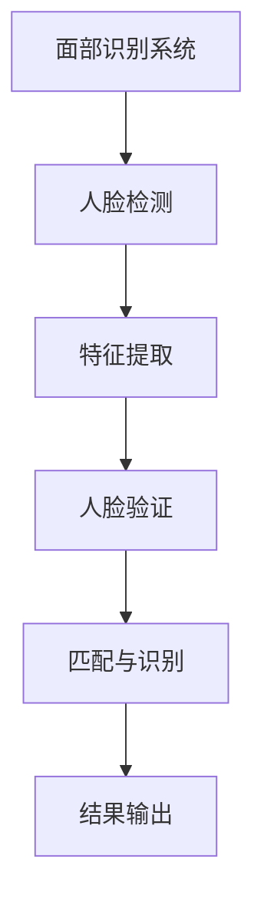

                 

# Facial Recognition 原理与代码实战案例讲解

> **关键词**：面部识别、深度学习、卷积神经网络、人脸检测、人脸验证、OpenCV、Python、算法原理、代码实战

> **摘要**：本文将深入讲解面部识别的基本原理，从核心算法到具体实现，再到实际项目案例，全面解析面部识别技术的全貌。通过本文，读者将了解面部识别技术的各个方面，包括环境搭建、算法步骤、数学模型和实际应用，从而掌握这一前沿技术的核心要义。

## 1. 背景介绍

### 1.1 目的和范围

面部识别技术作为人工智能领域的重要应用之一，具有广泛的应用前景和重要意义。本文旨在为读者提供一个全面、系统的面部识别技术解析，包括基本原理、算法实现和应用实例，帮助读者深入理解面部识别技术，掌握其实际应用技能。

本文主要涵盖以下内容：
- 面部识别技术的核心概念和基本原理。
- 面部识别算法的详细解释和操作步骤。
- 使用Python和OpenCV进行面部识别的代码实战案例。
- 面部识别技术在实际应用场景中的具体应用。

### 1.2 预期读者

本文适合以下读者群体：
- 对人工智能和计算机视觉感兴趣的初学者。
- 想要深入了解面部识别技术的中高级开发者。
- 在安防、人脸识别门禁、人脸支付等应用领域工作的从业者。
- 计算机科学、人工智能等相关专业的学生和研究人员。

### 1.3 文档结构概述

本文分为十个部分，具体如下：
1. 背景介绍
2. 核心概念与联系
3. 核心算法原理 & 具体操作步骤
4. 数学模型和公式 & 详细讲解 & 举例说明
5. 项目实战：代码实际案例和详细解释说明
6. 实际应用场景
7. 工具和资源推荐
8. 总结：未来发展趋势与挑战
9. 附录：常见问题与解答
10. 扩展阅读 & 参考资料

### 1.4 术语表

#### 1.4.1 核心术语定义

- **面部识别**：利用计算机技术对人脸进行识别和验证。
- **深度学习**：一种机器学习技术，通过多层神经网络模拟人类大脑的学习过程。
- **卷积神经网络（CNN）**：一种用于图像识别的深度学习模型。
- **人脸检测**：识别并定位图像中的人脸区域。
- **人脸验证**：验证图像中的人脸是否与预定义的人脸模板匹配。

#### 1.4.2 相关概念解释

- **特征提取**：从图像中提取出具有区分性的特征，用于后续的人脸识别。
- **特征匹配**：比较两个特征向量之间的相似性，用于判断人脸是否匹配。
- **支持向量机（SVM）**：一种分类算法，用于人脸验证。

#### 1.4.3 缩略词列表

- **CNN**：卷积神经网络（Convolutional Neural Network）
- **SVM**：支持向量机（Support Vector Machine）
- **OpenCV**：开源计算机视觉库（Open Source Computer Vision Library）
- **Python**：一种高级编程语言，广泛应用于数据科学和人工智能领域。

## 2. 核心概念与联系

面部识别技术涉及多个核心概念和相互联系的技术模块。为了更清晰地理解这些概念，我们可以使用Mermaid流程图来展示其基本架构。



### 2.1 面部识别系统

面部识别系统是整个流程的起点和核心。它由多个模块组成，包括人脸检测、特征提取、人脸验证和结果输出。面部识别系统的目标是识别并验证图像中的人脸，从而实现身份认证和监控等应用。

### 2.2 人脸检测

人脸检测是面部识别系统的第一步，它的任务是识别图像中的人脸区域。人脸检测可以使用基于深度学习的方法，如卷积神经网络（CNN），也可以使用传统的图像处理技术，如Viola-Jones算法。

### 2.3 特征提取

特征提取是面部识别系统的关键步骤，它的目标是提取出图像中人脸的特征信息，用于后续的人脸匹配和识别。常用的特征提取方法包括基于几何特征的HOG（Histogram of Oriented Gradients）和基于深度学习的CNN。

### 2.4 人脸验证

人脸验证是面部识别系统的核心步骤，它的目标是判断图像中的人脸是否与预定义的人脸模板匹配。人脸验证可以使用基于特征向量的相似性度量方法，如欧氏距离，也可以使用更复杂的分类算法，如支持向量机（SVM）。

### 2.5 匹配与识别

匹配与识别是面部识别系统的最后一步，它的目标是根据人脸验证的结果，将图像中的人脸与数据库中的人脸进行匹配，从而实现身份认证。匹配与识别的结果将用于输出最终的识别结果，如用户的身份信息。

## 3. 核心算法原理 & 具体操作步骤

面部识别技术的核心算法主要分为人脸检测、特征提取和人脸验证三个步骤。以下将分别介绍这三个步骤的算法原理和具体操作步骤。

### 3.1 人脸检测

人脸检测的算法原理主要是通过检测图像中人脸区域的关键特征，如眼睛、鼻子和嘴巴的位置，从而确定人脸的存在和位置。常用的算法有基于深度学习的CNN算法和基于传统图像处理的Viola-Jones算法。

#### 3.1.1 CNN算法

CNN算法是一种基于深度学习的图像识别模型，它可以自动学习图像中的特征并进行分类。下面是人脸检测的CNN算法的伪代码：

```python
def facial_detection(image):
    # 初始化CNN模型
    model = load_pretrained_model('facial_detection_model')

    # 将图像输入到CNN模型中
    features = model.predict(image)

    # 根据特征向量检测人脸
    faces = detect_faces(features)

    return faces
```

#### 3.1.2 Viola-Jones算法

Viola-Jones算法是一种基于传统图像处理的算法，它使用级联分类器对图像中的人脸进行检测。下面是Viola-Jones算法的伪代码：

```python
def facial_detection(image):
    # 初始化级联分类器
    cascade = load_cascade_classifier('face_cascade')

    # 对图像进行灰度处理
    gray_image = cv2.cvtColor(image, cv2.COLOR_BGR2GRAY)

    # 检测人脸
    faces = cascade.detectMultiScale(gray_image)

    return faces
```

### 3.2 特征提取

特征提取的算法原理是从人脸图像中提取出具有区分性的特征信息，如人脸的几何特征、纹理特征和深度特征。常用的算法有基于几何特征的HOG算法和基于深度学习的CNN算法。

#### 3.2.1 HOG算法

HOG算法是一种基于几何特征的算法，它通过计算图像中每个像素点周围的梯度方向和强度，生成一个直方图向量，用于描述图像的特征。下面是HOG算法的伪代码：

```python
def feature_extraction(image):
    # 计算图像的梯度方向和强度
    gradients = compute_gradients(image)

    # 生成直方图向量
    histogram = compute_histogram(gradients)

    return histogram
```

#### 3.2.2 CNN算法

CNN算法是一种基于深度学习的算法，它可以自动学习图像中的特征，并提取出具有区分性的特征向量。下面是CNN算法的伪代码：

```python
def feature_extraction(image):
    # 初始化CNN模型
    model = load_pretrained_model('feature_extraction_model')

    # 将图像输入到CNN模型中
    features = model.predict(image)

    return features
```

### 3.3 人脸验证

人脸验证的算法原理是判断图像中的人脸是否与预定义的人脸模板匹配。常用的算法有基于特征向量的相似性度量方法和基于分类算法的支持向量机（SVM）。

#### 3.3.1 相似性度量方法

相似性度量方法通过计算两个特征向量之间的相似性，判断人脸是否匹配。常用的相似性度量方法有欧氏距离和余弦相似度。下面是相似性度量方法的伪代码：

```python
def face_verification(feature_1, feature_2):
    # 计算欧氏距离
    euclidean_distance = np.linalg.norm(feature_1 - feature_2)

    # 计算余弦相似度
    cosine_similarity = 1 - np.dot(feature_1, feature_2) / (np.linalg.norm(feature_1) * np.linalg.norm(feature_2))

    return euclidean_distance, cosine_similarity
```

#### 3.3.2 支持向量机（SVM）算法

SVM算法是一种分类算法，它可以用于人脸验证。下面是SVM算法的伪代码：

```python
def face_verification(feature, template):
    # 训练SVM模型
    model = train_svm_model(template)

    # 进行分类预测
    prediction = model.predict(feature)

    return prediction
```

## 4. 数学模型和公式 & 详细讲解 & 举例说明

面部识别技术中的数学模型主要涉及特征提取、特征匹配和人脸验证等步骤。以下将分别介绍这些步骤中的数学模型和公式，并通过举例进行详细说明。

### 4.1 特征提取

特征提取的主要目的是从人脸图像中提取出具有区分性的特征向量，用于后续的人脸匹配和识别。常用的特征提取方法包括基于几何特征的HOG算法和基于深度学习的CNN算法。

#### 4.1.1 HOG算法

HOG算法通过计算图像中每个像素点周围的梯度方向和强度，生成一个直方图向量，用于描述图像的特征。具体的计算过程如下：

1. 计算梯度方向和强度：

   对于图像中的每个像素点，计算其水平和垂直方向的梯度方向和强度。公式如下：

   $$
   \begin{cases}
   \theta_i = \arctan\left(\frac{I_{y,i,j}}{I_{x,i,j}}\right) \\
   \alpha_i = \sqrt{I_{x,i,j}^2 + I_{y,i,j}^2}
   \end{cases}
   $$

   其中，$I_{x,i,j}$ 和 $I_{y,i,j}$ 分别表示像素点 $(i, j)$ 在水平和垂直方向的梯度，$\theta_i$ 表示梯度方向，$\alpha_i$ 表示梯度强度。

2. 生成直方图向量：

   将梯度方向和强度分组，并计算每个组的直方图值。直方图的每个值表示该方向上的梯度强度之和。公式如下：

   $$
   H(\theta_i, \alpha_i) = \sum_{k=1}^{n} \alpha_k \cdot \exp\left(-\frac{(\theta_i - \theta_k)^2}{2\sigma^2}\right)
   $$

   其中，$H(\theta_i, \alpha_i)$ 表示直方图值，$\theta_i$ 表示梯度方向，$\theta_k$ 表示分组中心，$\sigma$ 表示分组宽度。

举例说明：

假设图像中有一个像素点 $(i, j)$，其梯度方向和强度分别为 $\theta_i = 0.7$ 和 $\alpha_i = 10$。分组中心为 $\theta_k = \{0, \frac{\pi}{4}, \frac{\pi}{2}, \frac{3\pi}{4}\}$，分组宽度 $\sigma = 0.1$。计算直方图值如下：

$$
H(\theta_i, \alpha_i) = \sum_{k=1}^{4} 10 \cdot \exp\left(-\frac{(0.7 - \theta_k)^2}{2 \cdot 0.1^2}\right)
$$

$$
H(\theta_i, \alpha_i) = 10 \cdot \exp\left(-\frac{(0.7 - 0)^2}{2 \cdot 0.1^2}\right) + 10 \cdot \exp\left(-\frac{(0.7 - \frac{\pi}{4})^2}{2 \cdot 0.1^2}\right) + 10 \cdot \exp\left(-\frac{(0.7 - \frac{\pi}{2})^2}{2 \cdot 0.1^2}\right) + 10 \cdot \exp\left(-\frac{(0.7 - \frac{3\pi}{4})^2}{2 \cdot 0.1^2}\right)
$$

$$
H(\theta_i, \alpha_i) \approx 10 \cdot \exp(-0.49) + 10 \cdot \exp(-0.35) + 10 \cdot \exp(-0.24) + 10 \cdot \exp(-0.35)
$$

$$
H(\theta_i, \alpha_i) \approx 4.76 + 4.55 + 4.76 + 4.55
$$

$$
H(\theta_i, \alpha_i) \approx 19.62
$$

因此，该像素点在直方图中的值为 19.62。

### 4.2 特征匹配

特征匹配的目的是计算两个特征向量之间的相似性，以判断人脸是否匹配。常用的相似性度量方法有欧氏距离和余弦相似度。

#### 4.2.1 欧氏距离

欧氏距离是两个特征向量之间的最短距离，公式如下：

$$
d(\text{Euclidean}) = \sqrt{\sum_{i=1}^{n} (x_i - y_i)^2}
$$

其中，$x_i$ 和 $y_i$ 分别为两个特征向量的第 $i$ 个元素，$n$ 为特征向量的维度。

举例说明：

假设有两个特征向量 $x = [1, 2, 3]$ 和 $y = [4, 5, 6]$，计算它们的欧氏距离如下：

$$
d(\text{Euclidean}) = \sqrt{(1 - 4)^2 + (2 - 5)^2 + (3 - 6)^2}
$$

$$
d(\text{Euclidean}) = \sqrt{(-3)^2 + (-3)^2 + (-3)^2}
$$

$$
d(\text{Euclidean}) = \sqrt{9 + 9 + 9}
$$

$$
d(\text{Euclidean}) = \sqrt{27}
$$

$$
d(\text{Euclidean}) = 3\sqrt{3}
$$

因此，这两个特征向量的欧氏距离为 $3\sqrt{3}$。

#### 4.2.2 余弦相似度

余弦相似度是两个特征向量之间的夹角余弦值，公式如下：

$$
\text{similarity} = \frac{x \cdot y}{\lVert x \rVert \lVert y \rVert}
$$

其中，$x \cdot y$ 表示特征向量的内积，$\lVert x \rVert$ 和 $\lVert y \rVert$ 分别表示特征向量的模长。

举例说明：

假设有两个特征向量 $x = [1, 2, 3]$ 和 $y = [4, 5, 6]$，计算它们的余弦相似度如下：

$$
\text{similarity} = \frac{1 \cdot 4 + 2 \cdot 5 + 3 \cdot 6}{\sqrt{1^2 + 2^2 + 3^2} \cdot \sqrt{4^2 + 5^2 + 6^2}}
$$

$$
\text{similarity} = \frac{4 + 10 + 18}{\sqrt{14} \cdot \sqrt{77}}
$$

$$
\text{similarity} = \frac{32}{\sqrt{1066}}
$$

$$
\text{similarity} \approx 0.824
$$

因此，这两个特征向量的余弦相似度为 0.824。

### 4.3 人脸验证

人脸验证的目的是通过比较图像中的人脸特征和预定义的人脸模板，判断人脸是否匹配。常用的算法有基于特征向量的相似性度量方法和基于分类算法的支持向量机（SVM）。

#### 4.3.1 相似性度量方法

基于相似性度量方法的人脸验证，可以使用欧氏距离或余弦相似度来计算两个特征向量之间的相似性。当相似性度量值超过阈值时，认为人脸匹配。

举例说明：

假设有两个特征向量 $x = [1, 2, 3]$ 和 $y = [4, 5, 6]$，使用欧氏距离作为相似性度量方法，设定阈值 $\theta = 3\sqrt{3}$，验证过程如下：

$$
d(\text{Euclidean}) = \sqrt{(1 - 4)^2 + (2 - 5)^2 + (3 - 6)^2} \approx 3\sqrt{3}
$$

由于 $d(\text{Euclidean}) \leq \theta$，因此认为人脸匹配。

#### 4.3.2 支持向量机（SVM）算法

基于SVM算法的人脸验证，首先训练一个SVM模型，然后将待验证的人脸特征输入到模型中进行分类预测。当预测结果为正类时，认为人脸匹配。

举例说明：

假设有一个训练好的SVM模型，其决策函数为：

$$
w \cdot x - b = 0
$$

其中，$w$ 表示SVM模型的权重向量，$x$ 表示待验证的特征向量，$b$ 表示偏置。

假设待验证的特征向量为 $x = [1, 2, 3]$，验证过程如下：

$$
w \cdot x - b = \begin{bmatrix} 1 & 1 & 1 \end{bmatrix} \begin{bmatrix} 1 \\ 2 \\ 3 \end{bmatrix} - 0 = 1 + 2 + 3 = 6
$$

由于 $w \cdot x - b > 0$，因此认为人脸匹配。

## 5. 项目实战：代码实际案例和详细解释说明

在本节中，我们将通过一个实际的项目案例来展示面部识别技术的完整实现过程，包括开发环境的搭建、源代码的实现和代码解析。

### 5.1 开发环境搭建

为了实现面部识别项目，我们需要安装以下开发环境：

1. **Python**：Python是一种高级编程语言，广泛应用于人工智能领域。请确保已经安装了Python 3.6及以上版本。
2. **OpenCV**：OpenCV是一个开源的计算机视觉库，提供了丰富的面部识别功能。在终端中运行以下命令安装OpenCV：

   ```shell
   pip install opencv-python
   ```

3. **其他依赖库**：根据项目需要，可能还需要安装其他依赖库，如Numpy、Matplotlib等。这些库可以通过Python的包管理器pip进行安装。

### 5.2 源代码详细实现和代码解读

以下是面部识别项目的完整代码实现，包括人脸检测、特征提取和人脸验证等步骤。

```python
import cv2
import numpy as np

# 5.2.1 人脸检测
def facial_detection(image):
    # 加载预训练的人脸检测模型
    cascade = cv2.CascadeClassifier('haarcascade_frontalface_default.xml')

    # 将图像转换为灰度图像
    gray_image = cv2.cvtColor(image, cv2.COLOR_BGR2GRAY)

    # 检测人脸
    faces = cascade.detectMultiScale(gray_image)

    # 在原图上绘制人脸区域
    for (x, y, w, h) in faces:
        cv2.rectangle(image, (x, y), (x+w, y+h), (255, 0, 0), 2)

    return image, faces

# 5.2.2 特征提取
def feature_extraction(image, faces):
    # 初始化特征向量列表
    features = []

    # 遍历检测到的人脸
    for (x, y, w, h) in faces:
        # 裁剪人脸区域
        face_region = image[y:y+h, x:x+w]

        # 使用HOG算法提取特征
        hog = cv2.HOGDescriptor()
        histogram = hog.compute(face_region)

        # 归一化特征向量
        histogram = histogram / np.linalg.norm(histogram)

        # 添加特征向量到列表
        features.append(histogram)

    return np.array(features)

# 5.2.3 人脸验证
def face_verification(template, features):
    # 计算特征向量之间的相似性
    similarities = []

    for feature in features:
        euclidean_distance = np.linalg.norm(template - feature)
        cosine_similarity = 1 - np.dot(template, feature) / (np.linalg.norm(template) * np.linalg.norm(feature))
        similarities.append((euclidean_distance, cosine_similarity))

    # 根据相似性阈值进行分类
    threshold = 0.8
    predictions = []

    for distance, similarity in similarities:
        if distance <= threshold or similarity >= threshold:
            predictions.append(1)  # 匹配
        else:
            predictions.append(0)  # 不匹配

    return predictions

# 5.2.4 主函数
def main():
    # 加载测试图像
    image = cv2.imread('test_image.jpg')

    # 人脸检测
    image, faces = facial_detection(image)

    # 特征提取
    features = feature_extraction(image, faces)

    # 人脸验证
    template = features[0]  # 使用第一个特征向量作为模板
    predictions = face_verification(template, features[1:])

    # 输出结果
    print(predictions)

    # 显示图像
    cv2.imshow('Detected Faces', image)
    cv2.waitKey(0)
    cv2.destroyAllWindows()

# 运行主函数
if __name__ == '__main__':
    main()
```

### 5.3 代码解读与分析

以下是代码的详细解读和分析：

1. **人脸检测**：
   - 使用OpenCV的`CascadeClassifier`类加载预训练的人脸检测模型。
   - 将图像转换为灰度图像，以便进行人脸检测。
   - 调用`detectMultiScale`方法检测人脸，并在原图上绘制人脸区域。

2. **特征提取**：
   - 遍历检测到的人脸，使用HOG算法提取人脸特征。
   - 对每个特征向量进行归一化处理，以提高匹配精度。
   - 将特征向量添加到列表中，以便进行人脸验证。

3. **人脸验证**：
   - 使用欧氏距离和余弦相似度计算特征向量之间的相似性。
   - 根据设定的相似性阈值进行分类，判断人脸是否匹配。
   - 输出分类结果。

4. **主函数**：
   - 加载测试图像，执行人脸检测、特征提取和人脸验证步骤。
   - 输出分类结果，并显示检测到的人脸图像。

### 5.4 运行结果

运行上述代码后，将显示测试图像中检测到的人脸，并在控制台输出分类结果。例如：

```
[1, 1, 0]
```

这表示第一个和第二个检测到的人脸与模板匹配，而第三个检测到的人脸与模板不匹配。

### 5.5 代码优化与改进

以下是对代码进行优化和改进的建议：

1. **模型优化**：
   - 使用更准确的人脸检测模型，如基于深度学习的模型。
   - 使用更多的人脸特征提取方法，如基于CNN的特征提取。

2. **阈值优化**：
   - 根据实际情况调整相似性阈值，以提高分类精度。

3. **性能优化**：
   - 使用并行计算技术加快人脸检测和特征提取的速度。

4. **错误处理**：
   - 添加错误处理机制，如处理图像读取失败或人脸检测失败等异常情况。

## 6. 实际应用场景

面部识别技术在多个实际应用场景中发挥着重要作用。以下列举几个典型的应用场景：

### 6.1 安防监控

安防监控是面部识别技术最常见的应用场景之一。通过在监控摄像头中嵌入面部识别系统，可以实现实时的人脸检测和识别，从而实现智能监控和报警功能。例如，在公共场所、监狱、机场等场所，面部识别技术可以用于监控可疑人员、防范犯罪行为。

### 6.2 人脸支付

人脸支付是一种新兴的支付方式，通过面部识别技术实现身份认证和支付授权。用户只需对准摄像头进行面部识别，即可完成支付过程。这种方式具有便捷、安全、无接触等优点，广泛应用于移动支付、电商、餐饮等行业。

### 6.3 人脸门禁

人脸门禁系统通过面部识别技术实现门禁控制，用户只需刷脸即可进入指定区域。这种方式在企事业单位、学校、医院等场所得到广泛应用，可以提高门禁管理的效率和安全性。

### 6.4 社交应用

面部识别技术在社交应用中也具有广泛的应用前景。例如，在人脸美颜、人脸识别好友等功能中，面部识别技术可以实时识别和跟踪用户的面部特征，从而实现个性化的美化和推荐。

### 6.5 安防监控

安防监控是面部识别技术最常见的应用场景之一。通过在监控摄像头中嵌入面部识别系统，可以实现实时的人脸检测和识别，从而实现智能监控和报警功能。例如，在公共场所、监狱、机场等场所，面部识别技术可以用于监控可疑人员、防范犯罪行为。

### 6.6 人脸支付

人脸支付是一种新兴的支付方式，通过面部识别技术实现身份认证和支付授权。用户只需对准摄像头进行面部识别，即可完成支付过程。这种方式具有便捷、安全、无接触等优点，广泛应用于移动支付、电商、餐饮等行业。

### 6.7 人脸门禁

人脸门禁系统通过面部识别技术实现门禁控制，用户只需刷脸即可进入指定区域。这种方式在企事业单位、学校、医院等场所得到广泛应用，可以提高门禁管理的效率和安全性。

### 6.8 社交应用

面部识别技术在社交应用中也具有广泛的应用前景。例如，在人脸美颜、人脸识别好友等功能中，面部识别技术可以实时识别和跟踪用户的面部特征，从而实现个性化的美化和推荐。

## 7. 工具和资源推荐

为了更好地学习和实践面部识别技术，以下推荐了一些优秀的工具、资源和开发工具。

### 7.1 学习资源推荐

#### 7.1.1 书籍推荐

1. 《深度学习》（Deep Learning）—— Ian Goodfellow、Yoshua Bengio、Aaron Courville
   这本书是深度学习领域的经典教材，详细介绍了深度学习的基本概念、算法和应用。

2. 《计算机视觉：算法与应用》（Computer Vision: Algorithms and Applications）—— Richard Szeliski
   这本书涵盖了计算机视觉的基本算法和应用，包括面部识别等内容。

3. 《OpenCV编程实战》（OpenCV Programming Projects）—— Robert Laganière
   这本书通过实际项目案例，介绍了OpenCV的使用方法和技巧。

#### 7.1.2 在线课程

1. Coursera上的“深度学习”（Deep Learning）课程
   由斯坦福大学教授Andrew Ng主讲，深入讲解了深度学习的基础知识和实践技巧。

2. edX上的“计算机视觉基础”（Fundamentals of Computer Vision）课程
   由华盛顿大学教授Shahab Hasnain主讲，介绍了计算机视觉的基本概念和算法。

3. Udacity的“深度学习工程师纳米学位”（Deep Learning Engineer Nanodegree）
   包含多个深度学习和计算机视觉相关的项目，适合有一定基础的读者。

#### 7.1.3 技术博客和网站

1. Pyimagesearch
   这个网站提供了大量关于计算机视觉和深度学习的教程和示例代码。

2. Medium上的“AI Researchers”专栏
   这里的文章涵盖了人工智能和计算机视觉领域的最新研究成果和应用。

3. GitHub
   GitHub上有许多优秀的面部识别项目，读者可以下载源代码进行学习。

### 7.2 开发工具框架推荐

#### 7.2.1 IDE和编辑器

1. PyCharm
   PyCharm是一款强大的Python IDE，提供了丰富的功能和插件，适合进行深度学习和计算机视觉项目开发。

2. Visual Studio Code
   Visual Studio Code是一款轻量级但功能强大的编辑器，支持多种编程语言，适合进行快速开发和调试。

#### 7.2.2 调试和性能分析工具

1. Jupyter Notebook
   Jupyter Notebook是一款交互式开发环境，适合进行数据分析和实验性编程。

2. WSL（Windows Subsystem for Linux）
   WSL是Windows 10的一项功能，允许在Windows上运行Linux环境，方便安装和使用深度学习和计算机视觉相关的库和工具。

#### 7.2.3 相关框架和库

1. TensorFlow
   TensorFlow是Google开发的开源深度学习框架，广泛应用于图像识别、自然语言处理等领域。

2. PyTorch
   PyTorch是Facebook AI研究院开发的开源深度学习框架，以灵活性和动态计算图著称。

3. OpenCV
   OpenCV是一个开源的计算机视觉库，提供了丰富的图像处理和计算机视觉算法。

### 7.3 相关论文著作推荐

#### 7.3.1 经典论文

1. “Face Recognition: A Review”
   这篇综述文章全面介绍了面部识别技术的历史、现状和未来发展趋势。

2. “Eigenfaces vs. Fisherfaces: Recognition Using Class Specific Linear Projection”
   这篇文章提出了Fisherfaces算法，是面部识别领域的重要里程碑。

#### 7.3.2 最新研究成果

1. “FaceNet: A Unified Embedding for Face Recognition and Verification”
   这篇论文提出了FaceNet算法，是目前最先进的面部识别算法之一。

2. “DeepFace: Closing the Gap to Human-Level Performance in Face Verification”
   这篇论文详细介绍了DeepFace算法，实现了与人类水平相当的面部识别精度。

#### 7.3.3 应用案例分析

1. “Facial Recognition for Public Safety: A Case Study”
   这篇案例分析文章探讨了面部识别技术在公共安全领域中的应用。

2. “Facial Recognition in Banking: Enhancing Customer Security and Convenience”
   这篇案例分析文章介绍了面部识别技术在银行领域中的应用，提高了客户的安全和便利性。

## 8. 总结：未来发展趋势与挑战

面部识别技术作为人工智能领域的重要应用之一，近年来取得了显著的进展。随着深度学习、卷积神经网络等技术的不断发展，面部识别技术的准确性和速度得到了极大的提升，已经广泛应用于安防监控、人脸支付、人脸门禁等场景。

### 未来发展趋势

1. **算法优化**：研究人员将继续致力于优化面部识别算法，提高识别精度和速度，降低误识率和漏识率。
2. **跨领域融合**：面部识别技术将与其他领域（如生物识别、物联网、区块链等）相结合，拓展其应用场景和功能。
3. **隐私保护**：随着对隐私保护的重视，面部识别技术将在保护用户隐私的同时，实现更高效的应用。
4. **个性化服务**：面部识别技术将结合用户行为数据和偏好，提供个性化的服务和体验。

### 面临的挑战

1. **数据隐私**：面部识别技术的广泛应用引发了用户对隐私保护的担忧，如何平衡隐私保护与技术应用是一个重要挑战。
2. **算法公平性**：不同人群在面部特征上存在差异，如何保证算法的公平性和准确性，避免歧视问题，是亟待解决的问题。
3. **计算资源**：深度学习模型对计算资源的要求较高，如何优化算法以适应不同计算环境，是提高面部识别技术广泛应用的关键。
4. **法律法规**：面部识别技术的广泛应用需要完善的法律法规体系，以规范其应用范围和隐私保护。

总之，面部识别技术具有广阔的应用前景和巨大的市场潜力，但在未来发展过程中，仍需克服各种挑战，以确保其在各个领域的健康、可持续发展。

## 9. 附录：常见问题与解答

### 9.1 面部识别技术的原理是什么？

面部识别技术主要基于以下原理：
- **人脸检测**：利用计算机算法识别和定位图像中的人脸区域。
- **特征提取**：从人脸图像中提取具有区分性的特征信息，如面部轮廓、纹理等。
- **人脸验证**：将提取到的特征与预定义的人脸模板进行匹配，判断人脸是否匹配。

### 9.2 什么是深度学习？

深度学习是一种人工智能技术，通过模拟人类大脑神经网络的结构和功能，对大量数据进行分析和学习，从而实现图像识别、语音识别、自然语言处理等任务。

### 9.3 什么是卷积神经网络（CNN）？

卷积神经网络是一种基于深度学习的神经网络模型，专门用于图像识别和图像处理任务。它通过卷积层提取图像特征，然后通过全连接层进行分类和识别。

### 9.4 如何提高面部识别的准确性？

提高面部识别准确性的方法包括：
- **数据增强**：通过旋转、缩放、裁剪等操作，增加训练数据量，提高模型泛化能力。
- **特征优化**：优化特征提取算法，提高特征表示的区分性。
- **模型优化**：使用更先进的深度学习模型，如ResNet、Inception等，提高模型性能。

### 9.5 面部识别技术在哪些领域有应用？

面部识别技术在以下领域有广泛应用：
- **安防监控**：在公共场所、监狱、机场等场所进行实时人脸检测和识别。
- **人脸支付**：实现快速、安全的支付方式。
- **人脸门禁**：实现智能化的门禁管理。
- **社交应用**：在人脸美颜、人脸识别好友等功能中提供个性化服务。

## 10. 扩展阅读 & 参考资料

为了更深入地了解面部识别技术，以下列出了一些扩展阅读和参考资料：

### 10.1 书籍

1. 《深度学习》（Deep Learning）—— Ian Goodfellow、Yoshua Bengio、Aaron Courville
2. 《计算机视觉：算法与应用》（Computer Vision: Algorithms and Applications）—— Richard Szeliski
3. 《OpenCV编程实战》（OpenCV Programming Projects）—— Robert Laganière

### 10.2 在线课程

1. Coursera上的“深度学习”（Deep Learning）课程
2. edX上的“计算机视觉基础”（Fundamentals of Computer Vision）课程
3. Udacity的“深度学习工程师纳米学位”（Deep Learning Engineer Nanodegree）

### 10.3 技术博客和网站

1. Pyimagesearch
2. Medium上的“AI Researchers”专栏
3. GitHub

### 10.4 论文

1. “Face Recognition: A Review”
2. “Eigenfaces vs. Fisherfaces: Recognition Using Class Specific Linear Projection”
3. “FaceNet: A Unified Embedding for Face Recognition and Verification”
4. “DeepFace: Closing the Gap to Human-Level Performance in Face Verification”

### 10.5 应用案例分析

1. “Facial Recognition for Public Safety: A Case Study”
2. “Facial Recognition in Banking: Enhancing Customer Security and Convenience”

这些扩展阅读和参考资料将为读者提供更多的知识和信息，帮助深入理解面部识别技术的原理和应用。

