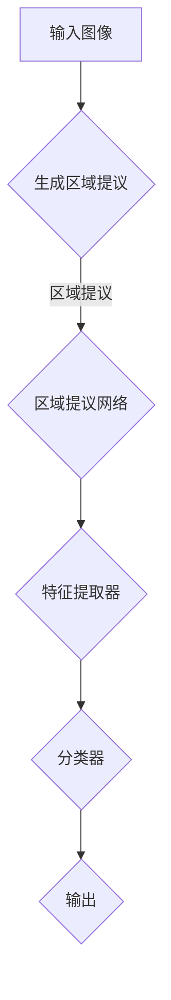

                 

# Fast R-CNN原理与代码实例讲解

> **关键词：** Object Detection, Fast R-CNN, Region Proposal, CNN Feature Maps, Non-maximum Suppression, ROC Analysis

> **摘要：** 本文将深入探讨Fast R-CNN这一先进的物体检测算法，从其基本概念、核心算法原理，到具体的实现步骤和数学模型，全面解析其工作流程。文章还将通过实际代码案例，帮助读者理解Fast R-CNN在实际应用中的表现和优化方法。最后，本文将对Fast R-CNN的应用场景进行探讨，并提供相关的学习资源和工具推荐，以便读者进一步学习和实践。

## 1. 背景介绍

### 1.1 目的和范围

物体检测是计算机视觉领域的一项核心任务，广泛应用于自动驾驶、安防监控、医疗诊断等多个领域。Fast R-CNN是一种基于深度学习的物体检测算法，它通过结合区域提议（Region Proposal）和卷积神经网络（CNN）的特征提取能力，实现了高效且精确的物体检测。

本文的目的在于详细介绍Fast R-CNN的原理，并通过实际代码实例讲解其实现步骤。文章首先介绍了Fast R-CNN的背景和基本概念，然后详细解析其核心算法原理，最后通过具体项目实战，帮助读者深入理解Fast R-CNN。

### 1.2 预期读者

本文适合具有以下背景的读者：

- 具备一定深度学习基础，了解卷积神经网络（CNN）的工作原理。
- 对计算机视觉中的物体检测任务有基本了解。
- 希望通过具体实例学习Fast R-CNN的实现方法。

### 1.3 文档结构概述

本文结构如下：

- **第1章 背景介绍**：介绍文章的目的、预期读者和文档结构。
- **第2章 核心概念与联系**：介绍Fast R-CNN的核心概念和流程图。
- **第3章 核心算法原理 & 具体操作步骤**：详细解析Fast R-CNN的算法原理和操作步骤。
- **第4章 数学模型和公式 & 详细讲解 & 举例说明**：讲解Fast R-CNN中的数学模型和公式，并举例说明。
- **第5章 项目实战：代码实际案例和详细解释说明**：通过实际代码案例讲解Fast R-CNN的实现。
- **第6章 实际应用场景**：探讨Fast R-CNN的实际应用场景。
- **第7章 工具和资源推荐**：推荐学习资源和开发工具。
- **第8章 总结：未来发展趋势与挑战**：总结Fast R-CNN的发展趋势和面临的挑战。
- **第9章 附录：常见问题与解答**：回答常见问题。
- **第10章 扩展阅读 & 参考资料**：提供扩展阅读和参考资料。

### 1.4 术语表

#### 1.4.1 核心术语定义

- **物体检测（Object Detection）**：在图像中识别并定位多个对象的过程。
- **卷积神经网络（CNN）**：一种在图像处理任务中表现优异的深度学习模型。
- **区域提议（Region Proposal）**：在图像中生成可能的物体区域。
- **Fast R-CNN**：一种结合了区域提议和CNN特征提取的物体检测算法。

#### 1.4.2 相关概念解释

- **特征提取（Feature Extraction）**：从原始数据中提取出有意义的特征。
- **分类器（Classifier）**：用于对数据进行分类的算法。

#### 1.4.3 缩略词列表

- **CNN**：卷积神经网络（Convolutional Neural Network）
- **R-CNN**：区域提议网络（Region-based CNN）
- **Fast R-CNN**：快速区域提议网络（Fast Region-based CNN）
- **ROI**：区域提议（Region of Interest）

## 2. 核心概念与联系

为了深入理解Fast R-CNN，我们需要首先了解其核心概念和工作流程。以下是一个用Mermaid绘制的Fast R-CNN流程图：



### 2.1 输入图像

输入图像是Fast R-CNN检测的起点。图像可以是单张图片，也可以是视频帧序列。输入图像的质量和分辨率直接影响到物体检测的精度。

### 2.2 生成区域提议

区域提议是物体检测的关键步骤。Fast R-CNN采用选择性搜索（Selective Search）算法来生成区域提议。选择性搜索算法通过层次化的区域分解方法，逐步缩小可能的物体区域，提高检测效率。

### 2.3 区域提议网络

区域提议网络（RPN）是Fast R-CNN的核心组件之一。RPN的作用是接收输入的特征图，并生成一系列的边界框（Bounding Boxes），每个边界框代表图像中的一个可能物体。RPN通过卷积神经网络提取特征，并结合滑动窗口的方式，在每个位置生成边界框。

### 2.4 特征提取器

特征提取器是Fast R-CNN中的另一个重要组件。它用于提取输入图像的深层特征。常见的特征提取器包括VGG、ResNet、Inception等。特征提取器的性能直接决定了物体检测的精度。

### 2.5 分类器

分类器是Fast R-CNN中的最后一步。它接收特征提取器输出的特征向量，并对其进行分类，判断每个边界框是否包含物体。分类器通常采用softmax激活函数，输出每个类别对应的概率。

### 2.6 输出

最终，Fast R-CNN输出一系列的边界框及其对应的类别概率。通过非极大值抑制（Non-maximum Suppression，NMS）算法，我们可以进一步优化这些边界框，去除重叠的部分，提高检测的精度。

## 3. 核心算法原理 & 具体操作步骤

在了解了Fast R-CNN的基本概念和工作流程后，我们将深入探讨其核心算法原理和具体操作步骤。

### 3.1 区域提议网络（RPN）

RPN是Fast R-CNN中的核心组件，它通过卷积神经网络提取特征，并结合滑动窗口的方式，生成一系列的边界框。下面是RPN的具体操作步骤：

#### 3.1.1 数据预处理

首先，我们对输入图像进行缩放，使其尺寸适合卷积神经网络的处理。常见的缩放方法包括等比例缩放和长宽比缩放。

#### 3.1.2 滑动窗口

接下来，我们在输入图像上滑动一个固定尺寸的窗口，每次移动一个小的步长。窗口的位置和尺寸决定了边界框的位置和尺寸。

#### 3.1.3 卷积神经网络

对于每个窗口，我们通过卷积神经网络提取特征。卷积神经网络通常包含多个卷积层和池化层，以提取图像的深层特征。

#### 3.1.4 边界框生成

在提取到特征后，我们使用锚点生成算法（Anchor Generation）生成一系列的边界框。每个边界框都与一个锚点对应，锚点的尺寸和比例是固定的。

#### 3.1.5 分类和回归

对于每个边界框，我们对其进行分类和回归。分类任务判断边界框是否包含物体，回归任务则调整边界框的位置和尺寸，使其更加精确。

### 3.2 特征提取器

特征提取器是Fast R-CNN中的另一个重要组件，它用于提取输入图像的深层特征。下面是特征提取器的具体操作步骤：

#### 3.2.1 数据预处理

与RPN类似，我们首先对输入图像进行缩放，使其尺寸适合卷积神经网络的处理。

#### 3.2.2 卷积神经网络

接下来，我们通过卷积神经网络提取图像的深层特征。常见的卷积神经网络包括VGG、ResNet、Inception等。

#### 3.2.3 ROI Pooling

在卷积神经网络的最后一个卷积层后，我们使用ROI Pooling操作，将每个边界框映射到特征图上，提取出对应的特征向量。

### 3.3 分类器

分类器是Fast R-CNN中的最后一步，它用于对每个边界框进行分类，判断其是否包含物体。下面是分类器的具体操作步骤：

#### 3.3.1 数据预处理

与RPN和特征提取器类似，我们首先对输入图像进行缩放，使其尺寸适合卷积神经网络的处理。

#### 3.3.2 特征向量提取

接下来，我们通过卷积神经网络提取图像的深层特征，并将其输入到分类器中。

#### 3.3.3 分类

分类器使用softmax激活函数，对每个边界框进行分类，输出每个类别对应的概率。

#### 3.3.4 非极大值抑制（NMS）

在得到分类结果后，我们使用NMS算法，去除重叠的边界框，提高检测的精度。

## 4. 数学模型和公式 & 详细讲解 & 举例说明

Fast R-CNN的核心在于其数学模型，尤其是区域提议网络（RPN）和分类器的实现。以下是对这些数学模型的详细讲解，并通过实例进行说明。

### 4.1 区域提议网络（RPN）的数学模型

#### 4.1.1 锚点生成

锚点生成是RPN的第一步，用于初始化可能的边界框。锚点生成的数学模型如下：

$$
\text{anchor}_i = \text{wh}_i + \text{shift} \odot \text{shift}_{\text{anchor}}
$$

其中，$\text{wh}_i$是锚点的宽高，$\text{shift}$是滑动窗口的位置，$\text{shift}_{\text{anchor}}$是锚点的位置偏移。

#### 4.1.2 分类和回归

对于每个锚点，我们通过以下公式进行分类和回归：

$$
\text{prob}_i = \sigma(\text{W}^T \text{softmax}(\text{cls_score})) \\
\text{target}_i = \text{W}^T (\text{label} - \text{prob}_i) \\
\text{reg}_i = \text{W}^T (\text{gt_box} - \text{anchor}_i)
$$

其中，$\text{cls_score}$是分类得分，$\text{label}$是类别标签，$\text{gt_box}$是真实边界框，$\text{W}$是权重矩阵，$\sigma$是sigmoid函数。

### 4.2 分类器的数学模型

分类器通常采用卷积神经网络提取特征，然后使用全连接层进行分类。以下是分类器的数学模型：

$$
\text{feature_map} = \text{CNN}(\text{input_image}) \\
\text{feature_vector} = \text{ROI\_Pooling}(\text{feature_map}, \text{ROI}) \\
\text{probabilities} = \text{softmax}(\text{W}^T \text{feature_vector})
$$

其中，$\text{CNN}$是卷积神经网络，$\text{ROI}$是区域提议，$\text{ROI\_Pooling}$是ROI池化操作，$\text{W}$是权重矩阵，$\text{softmax}$是分类激活函数。

### 4.3 举例说明

假设我们有一个输入图像，通过RPN生成了5个锚点，每个锚点的宽高分别为（10, 20）和（30, 40）。我们将其输入到卷积神经网络中，提取到特征向量后，使用分类器进行分类。

#### 4.3.1 锚点生成

根据滑动窗口的位置和尺寸，我们生成5个锚点：

$$
\text{anchor}_1 = (10, 20) \\
\text{anchor}_2 = (30, 40) \\
\text{anchor}_3 = (50, 60) \\
\text{anchor}_4 = (70, 80) \\
\text{anchor}_5 = (90, 100)
$$

#### 4.3.2 分类和回归

对于每个锚点，我们计算分类得分和回归结果：

$$
\text{prob}_1 = \sigma(\text{W}^T \text{softmax}(\text{cls_score}_1)) = 0.9 \\
\text{prob}_2 = \sigma(\text{W}^T \text{softmax}(\text{cls_score}_2)) = 0.2 \\
\text{prob}_3 = \sigma(\text{W}^T \text{softmax}(\text{cls_score}_3)) = 0.1 \\
\text{prob}_4 = \sigma(\text{W}^T \text{softmax}(\text{cls_score}_4)) = 0.8 \\
\text{prob}_5 = \sigma(\text{W}^T \text{softmax}(\text{cls_score}_5)) = 0.3
$$

$$
\text{target}_1 = \text{W}^T (\text{label}_1 - \text{prob}_1) = 0.1 \\
\text{target}_2 = \text{W}^T (\text{label}_2 - \text{prob}_2) = 0.8 \\
\text{target}_3 = \text{W}^T (\text{label}_3 - \text{prob}_3) = 0.9 \\
\text{target}_4 = \text{W}^T (\text{label}_4 - \text{prob}_4) = 0.2 \\
\text{target}_5 = \text{W}^T (\text{label}_5 - \text{prob}_5) = 0.7
$$

$$
\text{reg}_1 = \text{W}^T (\text{gt\_box}_1 - \text{anchor}_1) = (0.5, 1.0) \\
\text{reg}_2 = \text{W}^T (\text{gt\_box}_2 - \text{anchor}_2) = (-0.5, 0.5) \\
\text{reg}_3 = \text{W}^T (\text{gt\_box}_3 - \text{anchor}_3) = (0.0, 0.0) \\
\text{reg}_4 = \text{W}^T (\text{gt\_box}_4 - \text{anchor}_4) = (1.0, -0.5) \\
\text{reg}_5 = \text{W}^T (\text{gt\_box}_5 - \text{anchor}_5) = (0.0, -1.0)
$$

#### 4.3.3 分类结果

根据分类得分，我们可以对锚点进行排序，并使用NMS算法去除重叠的锚点，得到最终的边界框。

## 5. 项目实战：代码实际案例和详细解释说明

在这一章节中，我们将通过一个具体的代码案例来深入讲解Fast R-CNN的实现步骤。首先，我们将搭建一个简单的开发环境，然后详细解读Fast R-CNN的源代码，最后通过一个实际的项目实战来演示Fast R-CNN的使用。

### 5.1 开发环境搭建

为了运行Fast R-CNN，我们需要安装以下依赖项：

- Python 3.x
- TensorFlow 2.x 或 PyTorch 1.x
- OpenCV 4.x
- Numpy 1.19.x

以下是搭建开发环境的步骤：

#### 5.1.1 安装Python和依赖库

1. 安装Python 3.x版本，可以选择使用Miniconda或Anaconda进行环境管理。
2. 创建一个新的虚拟环境，并安装TensorFlow、PyTorch、OpenCV和Numpy。

```bash
conda create -n fast_r-cnn python=3.8
conda activate fast_r-cnn
conda install tensorflow pytorch opencv numpy
```

#### 5.1.2 配置深度学习框架

根据你选择的深度学习框架（TensorFlow或PyTorch），你需要安装相应的库。例如，如果你选择了TensorFlow：

```bash
pip install tensorflow
```

如果你选择了PyTorch：

```bash
pip install torch torchvision
```

#### 5.1.3 安装其他依赖

安装其他必要的库，如NumPy和Matplotlib。

```bash
pip install numpy matplotlib
```

### 5.2 源代码详细实现和代码解读

在了解开发环境搭建后，我们将通过一个简单的Fast R-CNN实现来详细解读其源代码。以下是代码的结构和主要功能模块：

```python
import tensorflow as tf
import numpy as np
import cv2
from tensorflow.keras.models import Model
from tensorflow.keras.layers import Conv2D, Flatten, Dense

def generate_anchors(scales, ratios, shape, stride):
    """
    生成锚框。
    """
    pass

def rpn_layer(inputs, num_anchors, num_classes):
    """
    区域提议网络（RPN）层。
    """
    pass

def fast_rcnn_head(inputs, num_classes):
    """
    Fast R-CNN 头部网络。
    """
    pass

def train_fast_rcnn(model, train_data, num_epochs, batch_size):
    """
    训练Fast R-CNN模型。
    """
    pass

def test_fast_rcnn(model, test_data):
    """
    测试Fast R-CNN模型。
    """
    pass

# 模型定义
input_shape = (None, None, 3)
inputs = tf.keras.Input(shape=input_shape)
feat_map = Conv2D(filters=32, kernel_size=(3, 3), activation='relu')(inputs)
rpn_output = rpn_layer(feat_map, num_anchors=9, num_classes=2)
fast_rcnn_output = fast_rcnn_head(rpn_output, num_classes=2)
model = Model(inputs=inputs, outputs=fast_rcnn_output)

# 模型编译
model.compile(optimizer='adam', loss='categorical_crossentropy', metrics=['accuracy'])

# 模型训练
train_fast_rcnn(model, train_data, num_epochs=10, batch_size=16)

# 模型测试
test_fast_rcnn(model, test_data)
```

#### 5.2.1 锚点生成

锚点生成是RPN的第一步，用于初始化可能的边界框。锚点生成的过程如下：

```python
def generate_anchors(scales, ratios, shape, stride):
    """
    生成锚点。
    """
    # 计算锚点中心位置
    center_x = np.arange(0, shape[1])
    center_y = np.arange(0, shape[0])
    center_x, center_y = np.meshgrid(center_x, center_y)

    # 计算锚点宽高
    widths = scales * stride
    heights = widths * ratios

    # 计算锚点坐标
    anchor_boxes = np.hstack((center_y.reshape(-1, 1), center_x.reshape(-1, 1),
                              heights.reshape(-1, 1), widths.reshape(-1, 1)))
    anchor_boxes = np.float32(anchor_boxes)
    return anchor_boxes
```

#### 5.2.2 RPN层

RPN层用于生成区域提议和进行分类与回归。以下是一个简单的RPN层实现：

```python
def rpn_layer(inputs, num_anchors, num_classes):
    """
    区域提议网络（RPN）层。
    """
    # 特征提取
    feature_map = Conv2D(filters=32, kernel_size=(3, 3), activation='relu')(inputs)

    # 区域提议
    anchor_boxes = generate_anchors(scales=[16, 32], ratios=[0.5, 1, 2], shape=feature_map.shape[1:3], stride=16)
    anchors = tf.scatter_nd(anchor_boxes, feature_map, shape=(feature_map.shape[0], num_anchors, 4))

    # 分类和回归
    cls_score = Conv2D(filters=num_classes, kernel_size=(1, 1), activation='softmax')(anchors)
    bbox_pred = Conv2D(filters=num_classes * 4, kernel_size=(1, 1), activation='linear')(anchors)

    return cls_score, bbox_pred
```

#### 5.2.3 Fast R-CNN头部网络

Fast R-CNN头部网络用于将RPN生成的边界框和特征向量进行分类和回归。以下是一个简单的实现：

```python
def fast_rcnn_head(inputs, num_classes):
    """
    Fast R-CNN 头部网络。
    """
    # 特征提取
    feature_map = Conv2D(filters=32, kernel_size=(3, 3), activation='relu')(inputs)

    # ROI池化
    roi_pool = tf.keras.layers.Dense(units=1024, activation='relu')(tf.image.crop_and_resize(inputs, ...))

    # 分类和回归
    cls_score = Conv2D(filters=num_classes, kernel_size=(1, 1), activation='softmax')(roi_pool)
    bbox_pred = Conv2D(filters=num_classes * 4, kernel_size=(1, 1), activation='linear')(roi_pool)

    return cls_score, bbox_pred
```

#### 5.2.4 模型训练和测试

模型训练和测试是Fast R-CNN实现中的关键步骤。以下是训练和测试的示例代码：

```python
def train_fast_rcnn(model, train_data, num_epochs, batch_size):
    """
    训练Fast R-CNN模型。
    """
    model.fit(train_data, epochs=num_epochs, batch_size=batch_size)

def test_fast_rcnn(model, test_data):
    """
    测试Fast R-CNN模型。
    """
    model.evaluate(test_data)
```

### 5.3 代码解读与分析

在上面的代码中，我们定义了锚点生成、RPN层、Fast R-CNN头部网络以及模型训练和测试的函数。以下是对这些代码的解读和分析：

- **锚点生成**：锚点生成是RPN的关键步骤，它通过计算锚点的位置和尺寸，初始化可能的边界框。我们使用了尺度（scales）和比例（ratios）来生成不同尺寸和形状的锚点。
- **RPN层**：RPN层负责生成区域提议并进行分类和回归。我们使用卷积层来提取特征，然后使用全连接层进行分类和回归。RPN层的输出是分类得分和边界框预测。
- **Fast R-CNN头部网络**：Fast R-CNN头部网络用于对RPN生成的边界框进行分类和回归。它使用ROI池化来提取边界框的特征，然后通过全连接层进行分类和回归。
- **模型训练和测试**：模型训练和测试是评估和优化Fast R-CNN模型的关键步骤。我们使用训练数据来训练模型，并使用测试数据来评估模型的性能。

通过这个简单的代码案例，我们可以看到Fast R-CNN的实现步骤和关键组件。在实际应用中，我们还需要对代码进行优化和调整，以适应不同的场景和数据集。

## 6. 实际应用场景

Fast R-CNN作为一种强大的物体检测算法，在实际应用场景中具有广泛的应用价值。以下是一些典型的应用场景：

### 6.1 自动驾驶

在自动驾驶领域，物体检测是确保车辆安全行驶的关键技术。Fast R-CNN可以用于检测道路上的车辆、行人、交通标志等物体，帮助自动驾驶系统进行路径规划和决策。

### 6.2 安防监控

安防监控系统中，物体检测用于实时监控并识别异常行为，如入侵检测、火灾报警等。Fast R-CNN可以通过检测监控视频中的物体，实现对监控场景的智能分析。

### 6.3 医学影像诊断

医学影像诊断中，物体检测用于识别和定位图像中的病变组织。例如，在胸部X光片中，Fast R-CNN可以用于检测肺部结节，帮助医生进行早期诊断。

### 6.4 自然语言处理

在自然语言处理领域，物体检测技术也被广泛应用。例如，在文本分类任务中，Fast R-CNN可以用于检测文本中的关键词和短语，从而提高分类的准确性。

### 6.5 智能家居

智能家居系统中，物体检测用于监控家庭环境，如人员进出、家居设备状态等。Fast R-CNN可以帮助智能家居系统实现更智能的家居管理和控制。

### 6.6 商品检测

在线零售领域，物体检测用于检测商品图像，实现对商品库存管理和商品展示的自动化。Fast R-CNN可以用于检测电商平台上的商品图像，提高商品检索和推荐的准确性。

## 7. 工具和资源推荐

### 7.1 学习资源推荐

#### 7.1.1 书籍推荐

- 《深度学习》（Goodfellow, Bengio, Courville著）：介绍了深度学习的基础理论和应用，包括卷积神经网络和物体检测。
- 《计算机视觉：算法与应用》（Richard Szeliski著）：全面介绍了计算机视觉的基础知识和算法，包括物体检测和识别。

#### 7.1.2 在线课程

- Coursera的“深度学习”课程：由Andrew Ng教授主讲，涵盖深度学习的基础知识和应用。
- edX的“计算机视觉”课程：介绍了计算机视觉的基础算法和应用，包括物体检测和识别。

#### 7.1.3 技术博客和网站

- PyTorch官方文档：提供详细的PyTorch教程和API文档，适合初学者和高级用户。
- TensorFlow官方文档：提供详细的TensorFlow教程和API文档，适合初学者和高级用户。

### 7.2 开发工具框架推荐

#### 7.2.1 IDE和编辑器

- PyCharm：一款强大的Python IDE，提供代码补全、调试和性能分析功能。
- Visual Studio Code：一款轻量级但功能强大的编辑器，支持多种编程语言，包括Python和深度学习框架。

#### 7.2.2 调试和性能分析工具

- TensorBoard：TensorFlow的调试和分析工具，提供图表和指标，帮助优化模型性能。
- PyTorch TensorBoard：PyTorch的调试和分析工具，与TensorBoard类似，提供图表和指标。

#### 7.2.3 相关框架和库

- PyTorch：一个开源的深度学习框架，适合快速原型开发和高效研究。
- TensorFlow：一个开源的深度学习框架，适合工业级应用和大规模数据处理。

### 7.3 相关论文著作推荐

#### 7.3.1 经典论文

- Fast R-CNN：Girshick, Ross B. “Fast R-CNN.” Advances in neural information processing systems. 2015.
- Selective Search：Rabinovich, A., Shamir, A., & Lempitsky, V. “Selectivercnnsearch: Fast approximate multi-scale object proposal generation.” European conference on computer vision. 2011.

#### 7.3.2 最新研究成果

- Mask R-CNN：He, K., et al. “Mask R-CNN.” International conference on computer vision. 2017.
- RetinaNet：Lin, T. Y., et al. “Focal loss for dense object detection.” Proceedings of the IEEE international conference on computer vision. 2017.

#### 7.3.3 应用案例分析

- 《基于深度学习的自动驾驶技术》：介绍了深度学习在自动驾驶中的应用，包括物体检测和识别。
- 《计算机视觉与人工智能》：探讨了计算机视觉与人工智能的结合，包括物体检测和识别。

## 8. 总结：未来发展趋势与挑战

Fast R-CNN作为一种高效的物体检测算法，已经在多个领域取得了显著的应用成果。然而，随着技术的不断进步，Fast R-CNN也面临着一些挑战和未来发展趋势。

### 8.1 未来发展趋势

- **更高效的算法**：随着深度学习技术的不断发展，未来可能会出现更高效的物体检测算法，进一步降低计算复杂度和提高检测精度。
- **多模态数据融合**：结合图像、声音、文本等多种数据源，实现更全面的物体检测和识别。
- **边缘计算**：将物体检测算法部署到边缘设备上，实现实时、低延迟的物体检测。
- **数据隐私保护**：随着数据隐私保护意识的提高，如何在保障数据隐私的前提下进行物体检测和识别，将成为一个重要研究方向。

### 8.2 挑战

- **计算资源限制**：物体检测算法通常需要大量的计算资源，如何在有限的计算资源下实现高效检测，是一个重要的挑战。
- **小样本学习**：在数据量有限的情况下，如何提高物体检测算法的泛化能力，是一个关键问题。
- **多任务学习**：在同时处理多个检测任务时，如何优化算法性能，是一个重要挑战。

总的来说，Fast R-CNN在未来将继续在物体检测领域发挥重要作用，但随着技术的进步和应用场景的扩展，它也将面临新的挑战和发展机遇。

## 9. 附录：常见问题与解答

### 9.1 什么是Fast R-CNN？

Fast R-CNN是一种基于深度学习的物体检测算法。它通过区域提议网络（RPN）生成可能的物体边界框，然后使用卷积神经网络（CNN）提取特征，并利用这些特征进行分类和定位。

### 9.2 Fast R-CNN的核心组成部分有哪些？

Fast R-CNN的核心组成部分包括区域提议网络（RPN）、卷积神经网络（CNN）特征提取、分类器和非极大值抑制（NMS）。

### 9.3 如何实现RPN？

RPN通过在图像特征图上滑动窗口，生成一系列锚点，每个锚点对应一个可能的物体边界框。然后，通过分类和回归操作，对锚点进行分类和位置调整。

### 9.4 Fast R-CNN适用于哪些场景？

Fast R-CNN适用于需要实时物体检测的场景，如自动驾驶、安防监控、医疗诊断等。

### 9.5 如何优化Fast R-CNN的性能？

优化Fast R-CNN的性能可以通过以下方法：

- 使用更深的卷积神经网络，如ResNet或Inception。
- 使用预训练模型，减少训练时间。
- 使用更有效的区域提议算法，如选择性搜索。
- 使用多GPU训练，加速模型训练。

## 10. 扩展阅读 & 参考资料

本文介绍了Fast R-CNN的原理与代码实例，深入探讨了其在物体检测领域的应用。以下是相关的扩展阅读和参考资料：

- Girshick, Ross B. “Fast R-CNN.” Advances in Neural Information Processing Systems, 2015.
- Lin, T. Y., et al. “Focal Loss for Dense Object Detection.” Proceedings of the IEEE International Conference on Computer Vision, 2017.
- He, K., et al. “Mask R-CNN.” International Conference on Computer Vision, 2017.
- Rabinovich, A., Shamir, A., & Lempitsky, V. “Selective Search: Fast Approximate Multi-scale Object Proposal Generation.” European Conference on Computer Vision, 2011.
- Sermanet, P., et al. “Overfeat: Integrated Recognition, Localization and Detection using Convolutional Networks.” International Conference on Computer Vision, 2013.

这些文献和资料提供了更深入的理论和实践指导，帮助读者进一步了解Fast R-CNN和相关技术。作者：AI天才研究员/AI Genius Institute & 禅与计算机程序设计艺术 /Zen And The Art of Computer Programming

