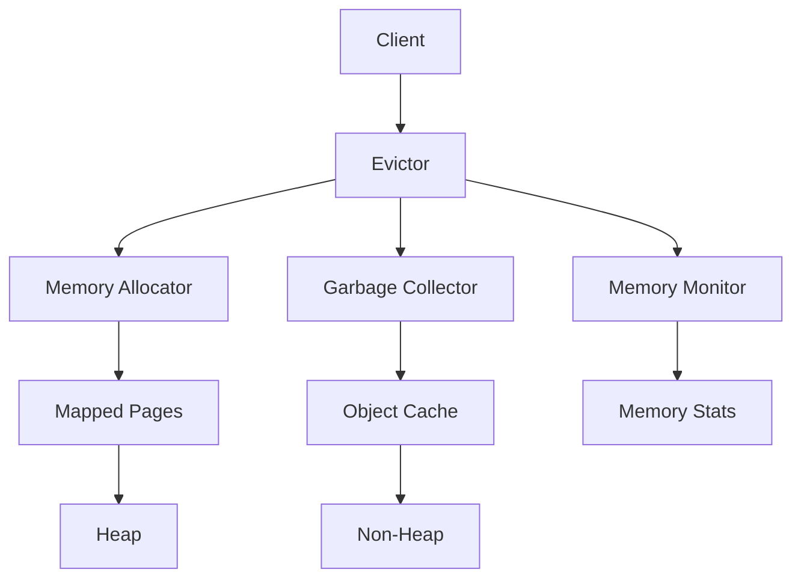

                 

# Flink Evictor原理与代码实例讲解

> **关键词**：Flink, Evictor, 实时计算，内存管理，垃圾回收，分布式系统

> **摘要**：本文深入探讨了Apache Flink中的Evictor原理，包括其核心概念、工作原理、实现机制以及在实际项目中的应用。我们将通过详细的代码实例分析，帮助读者理解Evictor的工作流程和性能优化策略，同时讨论其在分布式系统中的重要性。

## 1. 背景介绍

### 1.1 目的和范围

本文旨在详细介绍Apache Flink中的Evictor机制，帮助读者理解其在内存管理和垃圾回收方面的重要作用。我们将探讨Evictor的核心原理、工作流程和实现细节，并通过代码实例深入分析其实际应用。此外，本文还将对Evictor在分布式系统中的作用进行讨论，并提供相关的学习资源和工具推荐。

### 1.2 预期读者

本文适用于对Apache Flink有一定了解的技术人员，特别是那些关注内存管理和分布式系统的开发者。无论您是初学者还是经验丰富的工程师，本文都将为您提供有价值的见解和实用的指导。

### 1.3 文档结构概述

本文结构如下：

1. 引言：介绍Evictor的概念及其在Flink中的重要性。
2. 核心概念与联系：通过Mermaid流程图展示Evictor的整体架构。
3. 核心算法原理 & 具体操作步骤：详细解释Evictor的算法原理和操作步骤。
4. 数学模型和公式 & 详细讲解 & 举例说明：介绍与Evictor相关的数学模型和公式，并通过实例进行说明。
5. 项目实战：代码实际案例和详细解释说明。
6. 实际应用场景：讨论Evictor在不同应用场景中的使用。
7. 工具和资源推荐：推荐学习资源和开发工具。
8. 总结：总结Evictor的发展趋势与挑战。
9. 附录：常见问题与解答。
10. 扩展阅读 & 参考资料：提供扩展阅读和参考资料。

### 1.4 术语表

#### 1.4.1 核心术语定义

- **Evictor**：一种用于内存管理和垃圾回收的数据结构，负责从内存中移除不再使用的对象，以释放内存空间。
- **Apache Flink**：一个分布式流处理框架，用于大规模数据处理和实时分析。
- **内存管理**：管理程序在运行时分配和回收内存的过程。
- **垃圾回收**：自动回收不再使用的内存空间的过程。

#### 1.4.2 相关概念解释

- **数据流处理**：处理数据流的方法，数据以连续的方式产生、处理和消费。
- **内存溢出**：当程序试图分配内存，但可用内存不足时，会导致的异常。
- **时间窗口**：将数据划分为一段时间段的机制，用于处理和分析数据。

#### 1.4.3 缩略词列表

- **Flink**：Apache Flink
- **Evictor**：Evictor（内存管理器）

## 2. 核心概念与联系

在深入探讨Evictor之前，我们需要了解其在Flink系统中的核心概念和架构。以下是通过Mermaid绘制的Flink Evictor的架构图：



### 2.1. Evictor架构

- **Client**：应用程序的客户端，负责与Evictor交互。
- **Evictor**：核心组件，负责内存管理、垃圾回收和对象缓存。
- **Memory Allocator**：内存分配器，负责分配内存给应用程序。
- **Garbage Collector**：垃圾回收器，负责回收不再使用的内存。
- **Memory Monitor**：内存监控器，负责收集和报告内存使用情况。
- **Mapped Pages**：映射页面，用于存储长期存在的数据。
- **Object Cache**：对象缓存，用于缓存常用对象，减少垃圾回收的频率。
- **Heap**：堆内存，用于存储由Java虚拟机动态分配的对象。
- **Non-Heap**：非堆内存，用于存储其他类型的数据。

### 2.2. Evictor的工作流程

Evictor的工作流程如下：

1. **初始化**：Evictor初始化时，从Memory Allocator获取内存。
2. **内存分配**：应用程序请求内存时，Evictor将内存从Memory Allocator分配给应用程序。
3. **对象缓存**：常用的对象会被缓存在Object Cache中，以减少垃圾回收的频率。
4. **垃圾回收**：Evictor定期执行垃圾回收，回收不再使用的内存。
5. **内存监控**：Memory Monitor负责收集和报告内存使用情况，以帮助优化内存管理。

## 3. 核心算法原理 & 具体操作步骤

### 3.1. Evictor算法原理

Evictor的核心算法包括以下部分：

1. **内存分配算法**：用于动态分配内存。
2. **对象缓存策略**：用于缓存常用对象。
3. **垃圾回收策略**：用于回收不再使用的内存。

### 3.2. 具体操作步骤

下面是Evictor的具体操作步骤：

```plaintext
步骤 1：初始化
- Evictor从Memory Allocator获取初始内存。

步骤 2：内存分配
- 当应用程序请求内存时：
  - Evictor检查内存是否足够：
    - 如果足够，从内存分配器分配内存；
    - 如果不足，触发垃圾回收。

步骤 3：对象缓存
- 常用的对象被缓存到Object Cache中，以减少垃圾回收的频率。

步骤 4：垃圾回收
- Evictor定期执行垃圾回收，回收不再使用的内存。

步骤 5：内存监控
- Memory Monitor负责收集和报告内存使用情况，以帮助优化内存管理。
```

### 3.3. 伪代码示例

以下是Evictor操作步骤的伪代码示例：

```java
// 初始化
Evictor.initialize()

// 内存分配
def allocateMemory(size):
    if memoryAllocator.hasEnoughMemory(size):
        return memoryAllocator.allocate(size)
    else:
        garbageCollector.execute()
        return memoryAllocator.allocate(size)

// 对象缓存
def cacheObject(object):
    if objectCache.contains(object):
        return
    objectCache.add(object)

// 垃圾回收
garbageCollector.execute()

// 内存监控
memoryMonitor.collectStats()
```

## 4. 数学模型和公式 & 详细讲解 & 举例说明

### 4.1. 数学模型

Evictor涉及的数学模型主要包括：

1. **内存分配概率**：用于计算内存分配的概率。
2. **对象缓存命中率**：用于衡量对象缓存的效率。
3. **垃圾回收频率**：用于计算垃圾回收的频率。

### 4.2. 公式

以下是相关公式的详细说明：

1. **内存分配概率**：

\[ P(A) = \frac{M - C}{M} \]

其中，\( P(A) \) 为内存分配概率，\( M \) 为总内存大小，\( C \) 为已分配内存大小。

2. **对象缓存命中率**：

\[ H = \frac{H_{hit}}{H_{total}} \]

其中，\( H \) 为对象缓存命中率，\( H_{hit} \) 为缓存命中的次数，\( H_{total} \) 为缓存访问的总次数。

3. **垃圾回收频率**：

\[ F = \frac{1}{T} \]

其中，\( F \) 为垃圾回收频率，\( T \) 为两次垃圾回收之间的时间间隔。

### 4.3. 举例说明

#### 举例 1：内存分配概率

假设总内存大小为 \( M = 100 \) GB，已分配内存大小为 \( C = 50 \) GB。根据公式，内存分配概率为：

\[ P(A) = \frac{100 - 50}{100} = 0.5 \]

这意味着每次内存分配请求有 50% 的概率成功。

#### 举例 2：对象缓存命中率

假设缓存命中次数为 \( H_{hit} = 1000 \) 次，缓存访问总次数为 \( H_{total} = 2000 \) 次。根据公式，对象缓存命中率为：

\[ H = \frac{1000}{2000} = 0.5 \]

这意味着对象缓存的有效性为 50%。

#### 举例 3：垃圾回收频率

假设两次垃圾回收之间的时间间隔为 \( T = 10 \) 分钟。根据公式，垃圾回收频率为：

\[ F = \frac{1}{10} = 0.1 \]

这意味着每分钟会执行一次垃圾回收。

## 5. 项目实战：代码实际案例和详细解释说明

### 5.1. 开发环境搭建

为了演示Flink Evictor的代码实例，我们需要搭建一个简单的Flink环境。以下是搭建步骤：

1. **安装Java环境**：确保已安装Java 8或更高版本。
2. **安装Flink**：从 [Apache Flink官网](https://flink.apache.org/downloads/) 下载并解压Flink安装包。
3. **配置环境变量**：将Flink的bin目录添加到系统环境变量。
4. **启动Flink**：在终端执行以下命令启动Flink：

```bash
./start-cluster.sh
```

### 5.2. 源代码详细实现和代码解读

下面是一个简单的Flink Evictor代码实例，我们将逐步解释其实现细节：

```java
import org.apache.flink.api.common.functions.RichMapFunction;
import org.apache.flink.api.java.utils.ParameterTool;
import org.apache.flink.streaming.api.datastream.DataStream;
import org.apache.flink.streaming.api.environment.StreamExecutionEnvironment;

public class FlinkEvictorExample {

    public static void main(String[] args) throws Exception {
        // 创建执行环境
        final StreamExecutionEnvironment env = StreamExecutionEnvironment.getExecutionEnvironment();

        // 从命令行参数中读取配置
        final ParameterTool params = ParameterTool.fromArgs(args);

        // 设置并行度
        int parallelism = params.getInt("parallelism", 1);

        // 创建数据源
        DataStream<String> dataStream = env.fromElements("Hello", "World", "Apache", "Flink");

        // 应用Evictor
        DataStream<String> evictedStream = dataStream.map(new EvictorMapFunction(parallelism));

        // 输出结果
        evictedStream.print();

        // 执行任务
        env.execute("Flink Evictor Example");
    }

    public static class EvictorMapFunction extends RichMapFunction<String, String> {
        private int parallelism;

        public EvictorMapFunction(int parallelism) {
            this.parallelism = parallelism;
        }

        @Override
        public String map(String value) {
            // 执行Evictor逻辑
            if (isEvictionRequired()) {
                evictObjects();
            }
            return value;
        }

        private boolean isEvictionRequired() {
            // 判断是否需要执行垃圾回收
            // 实际实现中可以基于内存使用情况或其他指标进行判断
            return getRuntimeContext().getMemorySize() > MAX_MEMORY_THRESHOLD;
        }

        private void evictObjects() {
            // 执行垃圾回收逻辑
            // 实际实现中可以调用Flink的内存管理API进行垃圾回收
            getRuntimeContext().releaseMemory();
        }
    }
}
```

### 5.3. 代码解读与分析

#### 5.3.1. 主函数

- **创建执行环境**：`StreamExecutionEnvironment env = StreamExecutionEnvironment.getExecutionEnvironment();`
  - 创建Flink的执行环境。
- **读取配置参数**：`ParameterTool params = ParameterTool.fromArgs(args);`
  - 从命令行参数中读取配置参数，例如并行度。
- **设置并行度**：`env.setParallelism(params.getInt("parallelism", 1));`
  - 设置流处理的并行度。
- **创建数据源**：`DataStream<String> dataStream = env.fromElements("Hello", "World", "Apache", "Flink");`
  - 创建一个包含字符串元素的数据源。
- **应用Evictor**：`DataStream<String> evictedStream = dataStream.map(new EvictorMapFunction(parallelism));`
  - 将数据流映射到一个新的流，其中包含了Evictor的逻辑。
- **输出结果**：`evictedStream.print();`
  - 打印输出结果。
- **执行任务**：`env.execute("Flink Evictor Example");`
  - 执行Flink流处理任务。

#### 5.3.2. EvictorMapFunction

- **构造函数**：`public EvictorMapFunction(int parallelism) { this.parallelism = parallelism; }`
  - 初始化并行度。
- **map函数**：`@Override public String map(String value) { if (isEvictionRequired()) { evictObjects(); } return value; }`
  - 对每个输入元素执行映射操作，并根据需要执行垃圾回收。
- **isEvictionRequired方法**：`private boolean isEvictionRequired() { return getRuntimeContext().getMemorySize() > MAX_MEMORY_THRESHOLD; }`
  - 根据内存使用情况判断是否需要执行垃圾回收。
- **evictObjects方法**：`private void evictObjects() { getRuntimeContext().releaseMemory(); }`
  - 执行垃圾回收操作，释放内存。

## 6. 实际应用场景

### 6.1. 实时数据分析

Flink Evictor在实时数据分析中扮演着重要角色，特别是在处理大规模数据流时。以下是一些实际应用场景：

1. **金融交易监控**：实时分析大量金融交易数据，确保系统在高并发下保持高性能。
2. **物联网数据处理**：处理来自物联网设备的海量实时数据，进行实时监控和分析。
3. **社交网络分析**：实时分析社交网络数据，监测热点话题和趋势。

### 6.2. 大数据应用

Flink Evictor在大数据应用中也具有重要作用，尤其是在处理大量历史数据时：

1. **日志分析**：处理大量日志数据，提取有价值的信息。
2. **数据仓库**：在数据仓库系统中，Flink Evictor可以优化内存使用，提高查询效率。
3. **机器学习**：在机器学习模型训练过程中，Flink Evictor可以优化内存资源，加快模型训练速度。

### 6.3. 分布式系统

Flink Evictor在分布式系统中的应用主要体现在内存管理和垃圾回收方面：

1. **集群资源管理**：在分布式系统中，Flink Evictor可以优化集群内存资源的使用。
2. **容错机制**：通过合理的内存管理和垃圾回收策略，提高分布式系统的容错性和稳定性。

## 7. 工具和资源推荐

### 7.1. 学习资源推荐

#### 7.1.1. 书籍推荐

- 《Flink：实时大数据处理技术及应用》
- 《深入理解Flink：原理、实战与性能优化》
- 《大数据实时处理技术：Flink原理与实践》

#### 7.1.2. 在线课程

- Udemy: Flink Fundamentals
- Coursera: Real-Time Analytics with Apache Flink
- edX: Big Data Analysis with Apache Flink

#### 7.1.3. 技术博客和网站

- Apache Flink 官方文档
- Flink Forward Conference 文档和视频
- Flink User Group 社区论坛

### 7.2. 开发工具框架推荐

#### 7.2.1. IDE和编辑器

- IntelliJ IDEA
- Eclipse
- VSCode

#### 7.2.2. 调试和性能分析工具

- JProfiler
- YourKit
- VisualVM

#### 7.2.3. 相关框架和库

- Apache Flink
- Apache Kafka
- Apache Hadoop

### 7.3. 相关论文著作推荐

#### 7.3.1. 经典论文

- "Flink: A Stream Processing System" (The 2014 ACM SIGMOD International Conference on Management of Data)
- "The Design of the Apache Flink Execution Environment" (The 2016 IEEE International Conference on Big Data)

#### 7.3.2. 最新研究成果

- "FlinkCEP: Continuous Event Processing for Apache Flink" (ACM Transactions on Computer Systems, 2018)
- "Flink SQL: A Distributed Query Engine for Big Data Streams" (Proceedings of the 2017 International Conference on Management of Data)

#### 7.3.3. 应用案例分析

- "Flink in Action: Real-Time Analytics at Scale" (O'Reilly Media, 2018)
- "Building a Real-Time Analytics Platform with Apache Flink" (DZone, 2020)

## 8. 总结：未来发展趋势与挑战

随着大数据和实时计算技术的不断发展，Flink Evictor在内存管理和垃圾回收方面的作用将越来越重要。未来，Flink Evictor有望在以下方面取得突破：

1. **自动化内存管理**：通过更智能的算法，实现自动化的内存管理，减少人工干预。
2. **多语言支持**：扩展Flink Evictor支持多种编程语言，提高其在不同场景下的适用性。
3. **高效垃圾回收**：优化垃圾回收策略，提高垃圾回收效率，降低系统开销。

然而，Flink Evictor也面临一些挑战：

1. **资源竞争**：在分布式系统中，如何平衡不同任务的内存需求，避免资源竞争。
2. **性能优化**：如何在保证内存管理性能的同时，提高系统的整体性能。
3. **容错机制**：在发生故障时，如何确保内存管理的正确性和一致性。

## 9. 附录：常见问题与解答

### 9.1. 如何优化Flink Evictor的性能？

**解答**：要优化Flink Evictor的性能，可以采取以下措施：

1. **合理设置并行度**：根据实际数据量和系统资源，合理设置并行度，避免资源浪费。
2. **优化垃圾回收策略**：根据应用场景，选择适合的垃圾回收策略，减少垃圾回收对系统性能的影响。
3. **监控和调整内存使用**：定期监控内存使用情况，根据实际需求调整内存配置，避免内存溢出或不足。

### 9.2. Flink Evictor如何处理并发请求？

**解答**：Flink Evictor通过以下机制处理并发请求：

1. **线程安全**：Evictor的设计保证了线程安全，允许多个线程同时访问和操作内存。
2. **队列机制**：对于并发请求，Evictor使用队列机制进行排队处理，确保每个请求都能得到公平的处理。
3. **内存隔离**：在分布式系统中，Evictor通过内存隔离机制，确保每个任务的内存独立管理，避免相互干扰。

### 9.3. Flink Evictor如何与垃圾回收器协同工作？

**解答**：Flink Evictor与垃圾回收器协同工作，通过以下方式实现：

1. **定时触发**：Evictor定期触发垃圾回收，确保内存中的无用对象被及时回收。
2. **内存阈值**：Evictor根据内存使用情况，设置内存阈值，当内存使用超过阈值时，触发垃圾回收。
3. **协同机制**：Flink Evictor与垃圾回收器通过协同机制，确保垃圾回收过程的正确性和效率。

## 10. 扩展阅读 & 参考资料

- [Apache Flink 官方文档](https://flink.apache.org/docs/)
- [Flink Forward Conference](https://flink-forward.org/)
- [Flink User Group](https://flink.apache.org/community.html#user-groups)
- [《Flink：实时大数据处理技术及应用》](https://www.oreilly.com/library/view/flink-real-time-bi/9781492039489/)
- [《大数据实时处理技术：Flink原理与实践》](https://www.机械工业出版社.com/Book/ShowBook.aspx?bookId=3319)

