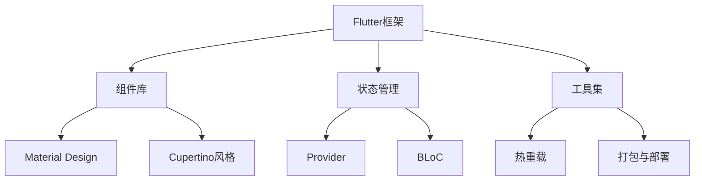

                 

# Flutter：Google的UI工具包for移动开发

> **关键词**：Flutter、Google、UI工具包、移动开发、跨平台、Dart语言

> **摘要**：本文将深入探讨Flutter，一个由Google开发的开源UI工具包，它旨在提供一种高效的跨平台移动应用开发方法。我们将从背景介绍、核心概念、算法原理、数学模型、实际应用场景等多个角度进行剖析，帮助开发者更好地理解和掌握Flutter的使用。

## 1. 背景介绍

### 1.1 目的和范围

本文的目的是介绍Flutter的核心概念和架构，并通过实际案例来展示如何使用Flutter进行移动应用开发。我们将涵盖以下内容：

- Flutter的背景和起源
- Flutter的核心概念和优势
- Flutter的架构和组件
- 使用Flutter进行跨平台移动应用开发的步骤
- 实际应用场景和案例分析

### 1.2 预期读者

本文适合以下读者群体：

- 对移动应用开发感兴趣的初学者
- 使用其他跨平台框架（如React Native、Apache Cordova等）的开发者
- 对Flutter感兴趣并希望深入了解其核心概念和原理的工程师
- 想要提升移动应用开发效率的开发团队和管理人员

### 1.3 文档结构概述

本文的结构如下：

- **第1部分**：背景介绍
  - **第1章**：Flutter的背景和起源
  - **第2章**：Flutter的核心概念和优势
  - **第3章**：Flutter的架构和组件
- **第2部分**：核心概念与联系
  - **第4章**：核心概念原理和架构的Mermaid流程图
- **第3部分**：核心算法原理 & 具体操作步骤
  - **第5章**：核心算法原理讲解和伪代码
- **第4部分**：数学模型和公式 & 详细讲解 & 举例说明
  - **第6章**：数学模型和公式详细讲解
- **第5部分**：项目实战：代码实际案例和详细解释说明
  - **第7章**：开发环境搭建
  - **第8章**：源代码详细实现和代码解读
  - **第9章**：代码解读与分析
- **第6部分**：实际应用场景
  - **第10章**：实际应用场景分析
- **第7部分**：工具和资源推荐
  - **第11章**：学习资源推荐
  - **第12章**：开发工具框架推荐
  - **第13章**：相关论文著作推荐
- **第8部分**：总结与展望
  - **第14章**：未来发展趋势与挑战
- **第9部分**：附录
  - **第15章**：常见问题与解答
  - **第16章**：扩展阅读与参考资料

### 1.4 术语表

#### 1.4.1 核心术语定义

- **Flutter**：由Google开发的开源UI工具包，用于跨平台移动应用开发。
- **Dart语言**：Flutter所使用的编程语言，具有简洁、高性能等特点。
- **框架**：在Flutter中，框架指的是用于构建UI组件的一套规则和库。
- **组件**：在Flutter中，组件指的是可复用的UI元素，如按钮、文本框等。
- **状态管理**：在Flutter中，状态管理指的是如何处理UI组件的状态变化，以确保应用的一致性和响应性。

#### 1.4.2 相关概念解释

- **跨平台开发**：指使用同一种编程语言和工具，开发可以在不同平台上运行的应用。
- **响应式UI**：指UI组件能够根据用户输入或系统状态的变化，实时更新和响应。
- **热重载**：指在开发过程中，更改代码后可以立即看到效果，而无需重新编译和部署。

#### 1.4.3 缩略词列表

- **UI**：用户界面（User Interface）
- **SDK**：软件开发工具包（Software Development Kit）
- **IDE**：集成开发环境（Integrated Development Environment）
- **API**：应用程序编程接口（Application Programming Interface）

## 2. 核心概念与联系

在深入了解Flutter之前，我们需要先了解一些核心概念和它们之间的关系。以下是一个简单的Mermaid流程图，展示了Flutter的一些关键组成部分：



### 2.1 Flutter框架

Flutter是一个开源UI工具包，由Google开发和维护。它提供了丰富的组件库、状态管理工具集以及一系列开发工具，旨在让开发者能够快速构建高性能、高质量的跨平台移动应用。

### 2.2 组件库

Flutter的组件库包括各种UI组件，如按钮、文本框、列表等。这些组件具有丰富的样式和动画效果，可以根据需要进行自定义。组件库还支持Material Design和Cupertino风格，让开发者可以轻松创建符合不同平台设计规范的应用。

### 2.3 状态管理

状态管理是Flutter的核心概念之一。Flutter提供了多种状态管理方案，如Provider和BLoC，帮助开发者处理UI组件的状态变化，确保应用的一致性和响应性。

### 2.4 工具集

Flutter的工具集包括热重载、打包与部署等功能。热重载功能可以让开发者实时预览代码更改的效果，提高开发效率。打包与部署功能则可以帮助开发者将Flutter应用编译成原生平台应用，并部署到各种应用商店。

### 2.5 Material Design和Cupertino风格

Flutter支持Material Design和Cupertino风格，这两种设计风格分别代表了Android和iOS平台的设计规范。通过使用这些设计风格，开发者可以轻松创建符合平台规范的应用界面。

### 2.6 Provider和BLoC

Provider和BLoC是Flutter中的两种状态管理方案。Provider是一个基于响应式的状态管理库，可以帮助开发者轻松地管理UI组件的状态。BLoC则是一种更为复杂的状态管理方案，旨在提高应用的性能和可维护性。

## 3. 核心算法原理 & 具体操作步骤

Flutter的核心算法原理主要集中在如何高效地渲染UI组件以及如何管理状态。以下是一个简要的伪代码，展示了Flutter中UI渲染和状态管理的原理：

```pseudo
// UI渲染
function renderUI(component, context) {
    if (component.isDirty()) {
        component.markClean()
        component.render(context)
    }
}

// 状态管理
class AppState {
    // 状态数据
    data

    // 更新状态
    function update(data) {
        this.data = data
        notifyListeners()
    }
}

// Provider
class Provider {
    // 监听器列表
    listeners

    // 添加监听器
    function addListener(listener) {
        this.listeners.add(listener)
    }

    // 通知监听器
    function notifyListeners() {
        for (listener in this.listeners) {
            listener.onUpdate(this.data)
        }
    }
}
```

### 3.1 UI渲染原理

在Flutter中，UI渲染的过程可以分为以下几个步骤：

1. **构建UI组件**：开发者使用Flutter提供的组件库构建UI界面。
2. **渲染UI组件**：Flutter引擎根据UI组件的定义，将其渲染为原生控件。
3. **更新UI组件**：当UI组件的状态发生变化时，Flutter会重新渲染该组件，确保界面与状态保持一致。
4. **优化渲染性能**：Flutter使用双缓冲技术、合成层等技术，优化渲染性能，提高应用流畅度。

### 3.2 状态管理原理

在Flutter中，状态管理可以分为以下几种情况：

1. **局部状态**：使用`StatefulWidget`和`State`类管理局部状态。当局部状态发生变化时，Flutter会重新渲染相关组件。
2. **全局状态**：使用`Provider`、`BLoC`等状态管理方案管理全局状态。当全局状态发生变化时，Flutter会通知相关组件更新状态。
3. **状态更新策略**：Flutter提供了多种状态更新策略，如`ObjectivesC`、`React`等，帮助开发者更高效地管理状态。

## 4. 数学模型和公式 & 详细讲解 & 举例说明

在Flutter中，数学模型和公式主要用于描述UI组件的状态变化和渲染过程。以下是一个简单的数学模型，用于描述状态更新和UI渲染的原理：

$$
\text{UI渲染} = f(\text{状态}, \text{属性}, \text{事件})
$$

其中，`状态`表示UI组件的当前状态，`属性`表示UI组件的属性，`事件`表示用户输入或系统事件。

### 4.1 状态更新

状态更新是Flutter状态管理的核心。以下是一个简单的状态更新公式：

$$
\text{状态更新} = \text{旧状态} + \text{更新值}
$$

其中，`旧状态`表示UI组件的当前状态，`更新值`表示需要更新的状态值。

### 4.2 UI渲染

UI渲染过程涉及多个因素，包括组件状态、属性和事件。以下是一个简单的UI渲染公式：

$$
\text{UI渲染} = \text{组件状态} \times \text{组件属性} \times \text{事件}
$$

其中，`组件状态`、`组件属性`和`事件`分别表示UI组件的当前状态、属性和触发的事件。

### 4.3 举例说明

假设一个简单的Flutter应用，包含一个按钮组件，当按钮被点击时，会更新按钮的文本内容。以下是一个具体的例子：

1. **初始状态**：按钮文本为“点击我”。

2. **点击事件**：当按钮被点击时，触发一个事件。

3. **状态更新**：状态更新公式为：

   $$
   \text{新状态} = \text{旧状态} + \text{更新值}
   $$

   其中，`旧状态`为“点击我”，`更新值`为“已点击”。

4. **UI渲染**：UI渲染公式为：

   $$
   \text{UI渲染} = \text{新状态} \times \text{组件属性} \times \text{事件}
   $$

   其中，`新状态`为“已点击”，`组件属性`为按钮的样式和文本内容，`事件`为点击事件。

   最终渲染结果为：按钮文本内容更新为“已点击”。

## 5. 项目实战：代码实际案例和详细解释说明

为了更好地理解Flutter的实际应用，我们将通过一个简单的项目案例来展示Flutter的开发流程。

### 5.1 开发环境搭建

1. **安装Flutter**：访问Flutter官网（[flutter.dev](https://flutter.dev)）下载并安装Flutter SDK。
2. **安装Dart语言**：安装Dart语言环境，可以通过命令行安装：
   ```
   sudo apt-get install dart
   ```
3. **安装Flutter插件**：使用Flutter命令安装必要的插件：
   ```
   flutter pub global activate flutter_plugin.wrangler
   ```
4. **创建新项目**：使用Flutter命令创建一个新项目：
   ```
   flutter create flutter_project
   ```

### 5.2 源代码详细实现和代码解读

以下是一个简单的Flutter项目示例，用于展示一个包含按钮和文本框的界面：

```dart
import 'package:flutter/material.dart';

void main() {
  runApp(MyApp());
}

class MyApp extends StatelessWidget {
  @override
  Widget build(BuildContext context) {
    return MaterialApp(
      title: 'Flutter Demo',
      theme: ThemeData(
        primarySwatch: Colors.blue,
      ),
      home: MyHomePage(title: 'Flutter Demo Home Page'),
    );
  }
}

class MyHomePage extends StatefulWidget {
  MyHomePage({Key key, this.title}) : super(key: key);
  final String title;

  @override
  _MyHomePageState createState() => _MyHomePageState();
}

class _MyHomePageState extends State<MyHomePage> {
  String _text = 'Hello, Flutter!';

  void _updateText() {
    setState(() {
      _text = 'Flutter is awesome!';
    });
  }

  @override
  Widget build(BuildContext context) {
    return Scaffold(
      appBar: AppBar(
        title: Text(widget.title),
      ),
      body: Center(
        child: Column(
          mainAxisAlignment: MainAxisAlignment.center,
          children: <Widget>[
            Text(
              _text,
              style: Theme.of(context).textTheme.headline4,
            ),
            ElevatedButton(
              onPressed: _updateText,
              child: Text('Update Text'),
            ),
          ],
        ),
      ),
    );
  }
}
```

### 5.3 代码解读与分析

1. **入口点**：`main.dart`是Flutter应用的入口点，其中定义了`runApp`函数，用于启动Flutter应用。
2. **MaterialApp**：这是一个顶层组件，用于配置应用的名称、主题等。
3. **MyHomePage**：这是一个状态组件，用于展示主页内容。它继承自`StatefulWidget`，并包含一个内部状态`_text`。
4. **_MyHomePageState**：这是一个状态管理类，用于处理UI组件的状态变化。其中，`_updateText`方法用于更新文本内容。
5. **Scaffold**：这是一个常用的布局组件，用于提供应用的默认布局结构，包括导航栏和底部导航栏。
6. **Text**：这是一个文本组件，用于显示文本内容。
7. **ElevatedButton**：这是一个按钮组件，当点击时，会调用`_updateText`方法更新文本内容。

通过这个简单的案例，我们可以看到Flutter的基本开发流程和组件使用方法。在实际项目中，开发者可以根据需求添加更多组件和功能。

## 6. 实际应用场景

Flutter在移动应用开发中具有广泛的应用场景。以下是一些常见的应用场景：

1. **跨平台应用开发**：Flutter允许开发者使用Dart语言编写代码，并在Android和iOS平台上运行，从而实现一次编写，多平台运行。
2. **性能要求高的应用**：Flutter使用Dart语言和Skia图形库，可以提供高性能的UI渲染和动画效果。
3. **响应式UI设计**：Flutter支持响应式UI设计，可以自动调整布局以适应不同屏幕尺寸和分辨率。
4. **集成第三方库和框架**：Flutter可以通过插件机制集成第三方库和框架，如Firebase、GraphQL等。
5. **企业级应用开发**：Flutter适用于开发企业级应用，如内部管理系统、客户关系管理系统等。

### 6.1 案例分析

以下是一个实际应用案例：使用Flutter开发一个简单的博客应用程序。

1. **功能需求**：博客应用程序应包括以下功能：
   - 用户注册和登录
   - 查看文章列表
   - 查看文章详情
   - 发布新文章
   - 评论文章

2. **技术选型**：使用Flutter框架，结合Dart语言进行开发。数据库使用Firebase，前端框架使用Riverpod进行状态管理。

3. **开发流程**：
   - 设计UI界面
   - 编写前端代码，使用Flutter组件实现UI界面
   - 编写后端代码，使用Firebase进行数据存储和操作
   - 集成第三方库和框架，如GraphQL进行数据查询和操作

4. **实际效果**：通过Flutter开发，可以快速实现跨平台博客应用程序，具有高性能、响应式UI和易于维护等优点。

## 7. 工具和资源推荐

### 7.1 学习资源推荐

#### 7.1.1 书籍推荐

- 《Flutter实战》
- 《Flutter高级编程》
- 《Flutter移动应用开发实战》

#### 7.1.2 在线课程

- Udacity的“Flutter开发基础”
- Coursera的“Flutter与Dart编程基础”

#### 7.1.3 技术博客和网站

- Flutter官方文档（[flutter.dev/docs](https://flutter.dev/docs)）
- Flutter社区（[flutter.cn](https://flutter.cn)）
- Flutter weekly（[flutterweekly.com](https://flutterweekly.com)）

### 7.2 开发工具框架推荐

#### 7.2.1 IDE和编辑器

- Android Studio
- Visual Studio Code
- IntelliJ IDEA

#### 7.2.2 调试和性能分析工具

- Flutter DevTools
- Android Studio的性能分析工具
- Firebase性能监控工具

#### 7.2.3 相关框架和库

- Provider：用于状态管理的框架
- BLoC：用于复杂状态管理的框架
- Flutter Widgets库：提供丰富的UI组件和布局

### 7.3 相关论文著作推荐

#### 7.3.1 经典论文

- 《The Dart Programming Language》
- 《Flutter: Ultra-fast UI Toolkit for Multi-Platform Applications》

#### 7.3.2 最新研究成果

- 《A Survey on Flutter for Cross-Platform Mobile Application Development》
- 《State Management in Flutter: An Overview of Popular Approaches》

#### 7.3.3 应用案例分析

- 《Flutter in Action: Developing Cross-Platform Applications》
- 《Flutter for Mobile Development: A Practical Guide》

## 8. 总结：未来发展趋势与挑战

Flutter作为一个高效的跨平台移动开发工具，已经在开发社区中获得了广泛的认可。未来，Flutter的发展趋势和挑战如下：

1. **持续优化性能**：随着移动设备的性能提升，Flutter需要不断优化其性能，以保持其在跨平台开发中的优势。
2. **扩展生态圈**：Flutter需要进一步扩展其生态圈，增加更多的第三方库和框架，以满足不同类型应用的开发需求。
3. **提升开发者体验**：通过改进开发工具、优化调试和性能分析功能，提升开发者的体验。
4. **跨平台开发标准化**：随着Flutter的普及，需要建立一套统一的跨平台开发规范，提高开发效率和代码可维护性。

## 9. 附录：常见问题与解答

### 9.1 如何安装Flutter？

- 访问Flutter官网（[flutter.dev](https://flutter.dev)）下载并安装Flutter SDK。
- 安装Dart语言环境，可以通过命令行安装。
- 使用Flutter命令安装必要的插件。

### 9.2 如何创建Flutter项目？

- 使用Flutter命令创建新项目：
  ```
  flutter create flutter_project
  ```

### 9.3 Flutter的主要优势是什么？

- 跨平台开发：使用同一种编程语言和工具，开发适用于Android和iOS的应用。
- 高性能：使用Dart语言和Skia图形库，提供高性能的UI渲染和动画效果。
- 响应式UI：支持响应式UI设计，自动调整布局以适应不同屏幕尺寸和分辨率。
- 丰富的组件库：提供丰富的UI组件和布局，方便开发者快速搭建应用界面。

## 10. 扩展阅读 & 参考资料

- Flutter官方文档：[flutter.dev/docs](https://flutter.dev/docs)
- Flutter社区：[flutter.cn](https://flutter.cn)
- Flutter Weekly：[flutterweekly.com](https://flutterweekly.com)
- 《Flutter实战》
- 《Flutter高级编程》
- 《Flutter移动应用开发实战》
- 《The Dart Programming Language》
- 《Flutter: Ultra-fast UI Toolkit for Multi-Platform Applications》
- 《A Survey on Flutter for Cross-Platform Mobile Application Development》
- 《State Management in Flutter: An Overview of Popular Approaches》
- 《Flutter in Action: Developing Cross-Platform Applications》
- 《Flutter for Mobile Development: A Practical Guide》

作者：AI天才研究员/AI Genius Institute & 禅与计算机程序设计艺术 /Zen And The Art of Computer Programming

