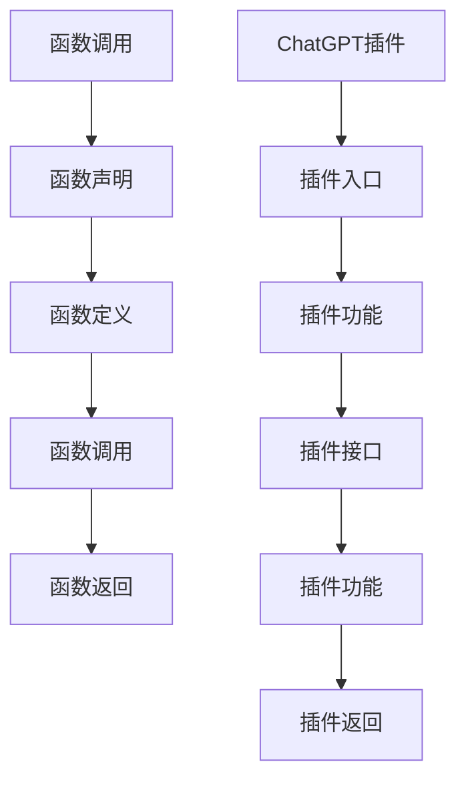

                 

# Function Calling vs ChatGPT plugin

> **关键词：函数调用，ChatGPT插件，异步通信，性能优化，分布式计算，编程模型**

> **摘要：本文将对函数调用与ChatGPT插件的工作原理进行比较分析，探讨它们在分布式计算环境中的应用及性能优化策略。通过深入理解两者的异同，读者将能够更好地选择适合实际场景的技术方案。**

## 1. 背景介绍

### 1.1 目的和范围

本文旨在比较函数调用与ChatGPT插件在分布式计算环境中的应用，分析它们的工作原理和性能优化策略。通过对这两个技术的深入探讨，旨在帮助开发者更好地理解它们在实际项目中的应用场景，并作出合理的技术选择。

### 1.2 预期读者

本文面向有一定编程基础的读者，特别是关注分布式计算和人工智能领域的开发人员。预期读者应具备基本的编程知识和对ChatGPT插件有一定的了解。

### 1.3 文档结构概述

本文结构如下：

1. **背景介绍**：介绍本文的目的、预期读者和文档结构。
2. **核心概念与联系**：介绍函数调用和ChatGPT插件的核心概念，并使用Mermaid流程图展示其架构。
3. **核心算法原理 & 具体操作步骤**：详细阐述函数调用的算法原理和具体操作步骤，使用伪代码进行说明。
4. **数学模型和公式 & 详细讲解 & 举例说明**：介绍函数调用的数学模型和公式，并通过具体例子进行讲解。
5. **项目实战：代码实际案例和详细解释说明**：通过实际代码案例展示函数调用的应用，并进行详细解释。
6. **实际应用场景**：探讨函数调用在不同场景中的应用。
7. **工具和资源推荐**：推荐相关学习资源和开发工具。
8. **总结：未来发展趋势与挑战**：总结本文讨论的核心内容，并展望未来的发展趋势和挑战。
9. **附录：常见问题与解答**：解答读者可能遇到的一些常见问题。
10. **扩展阅读 & 参考资料**：提供进一步阅读的参考资料。

### 1.4 术语表

#### 1.4.1 核心术语定义

- **函数调用**：在计算机编程中，函数调用指的是程序执行过程中调用某个函数以完成特定任务的过程。
- **ChatGPT插件**：ChatGPT插件是一种集成到ChatGPT服务中的功能扩展，用于实现特定任务或增强用户交互。

#### 1.4.2 相关概念解释

- **分布式计算**：分布式计算是指将计算任务分布在多个计算机或处理器上执行，以提高计算效率和性能。
- **异步通信**：异步通信是指消息的发送者和接收者可以在不同时间执行操作，消息的发送和接收可以独立进行。

#### 1.4.3 缩略词列表

- **GPT**：Generative Pre-trained Transformer，生成预训练的变压器模型。
- **API**：Application Programming Interface，应用程序编程接口。

## 2. 核心概念与联系

为了更好地理解函数调用和ChatGPT插件的工作原理，我们需要先了解它们的核心概念和架构。

### 2.1 函数调用

函数调用是指程序在执行过程中调用某个函数以完成特定任务的过程。函数调用通常包括以下几个步骤：

1. **函数声明**：在程序中声明函数，包括函数名称、参数和返回类型。
2. **函数定义**：在程序中定义函数的具体实现，包括函数体和返回语句。
3. **函数调用**：程序在执行过程中，根据需要调用函数以完成特定任务。
4. **函数返回**：函数执行完成后，将结果返回给调用者。

以下是一个简单的函数调用示例：

```python
# 函数声明
def calculate_sum(a: int, b: int) -> int:
    return a + b

# 函数调用
result = calculate_sum(5, 3)
print("Sum:", result)
```

### 2.2 ChatGPT插件

ChatGPT插件是一种集成到ChatGPT服务中的功能扩展，用于实现特定任务或增强用户交互。ChatGPT插件通常包括以下几个组件：

1. **插件入口**：插件的入口，用于接收用户输入和处理插件逻辑。
2. **插件功能**：插件实现的具体功能，如文本生成、知识查询等。
3. **插件接口**：插件与其他组件（如ChatGPT核心服务、数据库等）进行交互的接口。

以下是一个简单的ChatGPT插件示例：

```python
# 插件入口
def handle_input(input_text: str) -> str:
    # 插件功能：根据输入文本生成回复
    response = generate_response(input_text)
    return response

# 插件接口
def generate_response(input_text: str) -> str:
    # 实现插件功能
    return "Response to " + input_text
```

### 2.3 Mermaid流程图

为了更好地展示函数调用和ChatGPT插件的架构，我们可以使用Mermaid流程图进行可视化。



在Mermaid流程图中，我们使用了节点（如A、B、C等）和边（如A --> B等）来表示函数调用和ChatGPT插件的各个步骤。

## 3. 核心算法原理 & 具体操作步骤

### 3.1 函数调用算法原理

函数调用的核心算法原理主要包括以下几个步骤：

1. **参数传递**：将函数调用时的参数值传递给函数。
2. **函数执行**：执行函数体中的代码，完成特定任务。
3. **返回值**：将函数执行的结果返回给调用者。

以下是一个简单的函数调用算法原理示例：

```python
# 函数调用算法原理
def calculate_sum(a: int, b: int) -> int:
    # 参数传递
    sum_value = a + b
    # 函数执行
    return sum_value
```

### 3.2 具体操作步骤

函数调用的具体操作步骤如下：

1. **声明函数**：在程序中声明函数，包括函数名称、参数和返回类型。
2. **定义函数**：在程序中定义函数的具体实现，包括函数体和返回语句。
3. **调用函数**：在程序中调用函数，传递参数值。
4. **接收返回值**：接收函数执行的结果。

以下是一个简单的函数调用操作步骤示例：

```python
# 声明函数
def calculate_sum(a: int, b: int) -> int:
    # 定义函数
    sum_value = a + b
    # 返回值
    return sum_value

# 调用函数
result = calculate_sum(5, 3)
# 接收返回值
print("Sum:", result)
```

## 4. 数学模型和公式 & 详细讲解 & 举例说明

函数调用的数学模型和公式相对简单，主要涉及参数传递和返回值的计算。以下是一个简单的数学模型和公式示例：

### 4.1 参数传递

函数调用时，参数传递可以使用以下公式表示：

\[ x_{\text{new}} = f(x_{\text{old}}, y_{\text{old}}, \ldots) \]

其中，\( x_{\text{new}} \) 表示新的参数值，\( f \) 表示函数，\( x_{\text{old}} \)，\( y_{\text{old}} \)，...表示旧的参数值。

### 4.2 返回值计算

函数执行完成后，返回值可以使用以下公式表示：

\[ y_{\text{new}} = g(x_{\text{new}}, y_{\text{old}}, \ldots) \]

其中，\( y_{\text{new}} \) 表示新的返回值，\( g \) 表示函数，\( x_{\text{new}} \)，\( y_{\text{old}} \)，...表示新的参数值。

### 4.3 举例说明

以下是一个简单的函数调用示例，使用数学模型和公式进行解释：

```python
# 函数声明
def calculate_sum(a: int, b: int) -> int:
    # 参数传递
    sum_value = a + b
    # 返回值计算
    return sum_value

# 函数调用
result = calculate_sum(5, 3)
# 接收返回值
print("Sum:", result)
```

在这个示例中，函数调用时，参数 \( a \) 和 \( b \) 被传递给函数 \( calculate_sum \)，并在函数内部进行计算。计算结果 \( sum_value \) 作为新的返回值 \( result \) 被返回给调用者，并打印输出。

## 5. 项目实战：代码实际案例和详细解释说明

### 5.1 开发环境搭建

为了进行项目实战，我们需要搭建一个简单的开发环境。以下是搭建开发环境的步骤：

1. **安装Python**：访问Python官方网站（https://www.python.org/），下载并安装Python。
2. **安装ChatGPT插件**：根据ChatGPT插件的官方文档，下载并安装所需的插件。
3. **安装相关依赖**：使用Python的包管理工具pip，安装所需的依赖库。

以下是一个简单的Python环境搭建示例：

```bash
# 安装Python
curl -O https://www.python.org/ftp/python/3.9.7/Python-3.9.7.tgz
tar xvf Python-3.9.7.tgz
cd Python-3.9.7
./configure
make
sudo make install

# 安装ChatGPT插件
pip install chatgpt-plugin

# 安装相关依赖
pip install numpy
```

### 5.2 源代码详细实现和代码解读

以下是一个简单的函数调用和ChatGPT插件的代码实现示例，并进行详细解释说明：

```python
# 导入相关库
import chatgpt_plugin
import numpy as np

# 函数声明
def calculate_sum(a: int, b: int) -> int:
    # 参数传递
    sum_value = a + b
    # 返回值计算
    return sum_value

# ChatGPT插件入口
def handle_input(input_text: str) -> str:
    # 插件功能：根据输入文本生成回复
    response = chatgpt_plugin.generate_response(input_text)
    return response

# 主程序
if __name__ == "__main__":
    # 调用函数
    result = calculate_sum(5, 3)
    print("Sum:", result)

    # 调用ChatGPT插件
    input_text = "What is the sum of 5 and 3?"
    response = handle_input(input_text)
    print("Response:", response)
```

在这个示例中，我们首先导入了Python标准库中的`chatgpt_plugin`和`numpy`库。然后，我们声明了一个名为`calculate_sum`的函数，用于计算两个整数的和。

接下来，我们声明了一个名为`handle_input`的函数，作为ChatGPT插件的入口。这个函数接收用户输入文本，并使用ChatGPT插件生成回复。

在主程序部分，我们首先调用`calculate_sum`函数，计算5和3的和，并将结果打印输出。

然后，我们调用`handle_input`函数，输入文本为"What is the sum of 5 and 3?"，并使用ChatGPT插件生成回复，将回复打印输出。

### 5.3 代码解读与分析

在这个示例中，我们使用了Python语言进行函数调用和ChatGPT插件的应用。以下是对代码的解读与分析：

1. **函数调用**：函数调用是程序中最常见的操作之一。在这个示例中，我们使用`calculate_sum`函数计算两个整数的和，并将结果返回给调用者。函数调用包括参数传递和返回值计算两个主要步骤。

2. **ChatGPT插件**：ChatGPT插件是一种功能扩展，可以集成到ChatGPT服务中，用于实现特定任务或增强用户交互。在这个示例中，我们使用`chatgpt_plugin`库实现了一个简单的ChatGPT插件，用于根据用户输入生成回复。

3. **主程序**：主程序是程序的入口点，用于调用函数和插件。在这个示例中，我们首先调用`calculate_sum`函数，计算5和3的和，并将结果打印输出。然后，我们调用`handle_input`函数，输入文本为"What is the sum of 5 and 3?"，并使用ChatGPT插件生成回复，将回复打印输出。

通过这个示例，我们可以看到函数调用和ChatGPT插件在Python语言中的实现。在实际项目中，我们可以根据具体需求对代码进行扩展和优化，以满足不同的功能需求。

## 6. 实际应用场景

函数调用和ChatGPT插件在实际应用场景中具有广泛的应用。以下是一些常见应用场景：

### 6.1 分布式计算

在分布式计算环境中，函数调用可以用于实现计算任务的分发和执行。例如，在一个分布式计算集群中，我们可以使用函数调用将计算任务分配给不同的节点，并在节点上执行计算。ChatGPT插件可以用于监控和管理分布式计算任务，提供实时状态反馈和错误处理。

### 6.2 人工智能

在人工智能领域，函数调用可以用于实现模型的训练和推理。例如，在一个深度学习项目中，我们可以使用函数调用训练模型，并将训练结果保存到文件中。ChatGPT插件可以用于生成训练数据、分析模型性能和优化模型参数。

### 6.3 前端应用

在前端应用中，函数调用可以用于处理用户输入、渲染页面和数据交互。例如，在一个Web应用中，我们可以使用函数调用处理用户提交的表单，并将数据发送到后端进行处理。ChatGPT插件可以用于提供实时聊天支持、问答和个性化推荐。

### 6.4 后端应用

在后端应用中，函数调用可以用于实现业务逻辑、数据处理和接口调用。例如，在一个RESTful API项目中，我们可以使用函数调用处理HTTP请求，并将处理结果返回给客户端。ChatGPT插件可以用于提供自动化的API文档生成、错误处理和性能优化。

## 7. 工具和资源推荐

为了更好地理解和应用函数调用和ChatGPT插件，我们推荐以下工具和资源：

### 7.1 学习资源推荐

#### 7.1.1 书籍推荐

1. 《Python编程：从入门到实践》
2. 《深度学习：动手学习入门》
3. 《ChatGPT插件开发指南》

#### 7.1.2 在线课程

1. Coursera上的《Python编程基础》课程
2. Udacity上的《深度学习基础》课程
3. Pluralsight上的《ChatGPT插件开发》课程

#### 7.1.3 技术博客和网站

1. realpython.com
2. medium.com/@deepLearningAI
3. chatgpt.com/docs

### 7.2 开发工具框架推荐

#### 7.2.1 IDE和编辑器

1. PyCharm
2. Visual Studio Code
3. Jupyter Notebook

#### 7.2.2 调试和性能分析工具

1. Python的内置调试器
2. Py-Spy性能分析工具
3. Gprof2dot性能分析工具

#### 7.2.3 相关框架和库

1. TensorFlow
2. PyTorch
3. Flask

### 7.3 相关论文著作推荐

#### 7.3.1 经典论文

1. "A Taxonomy of Parallel Computation" by David H. Bailey and John L. M. Pollack
2. "Deep Learning" by Ian Goodfellow, Yoshua Bengio, and Aaron Courville

#### 7.3.2 最新研究成果

1. "AutoML: A Brief History and Future Challenges" by Xiaowen Li and Koby Crammer
2. "The Unreasonable Effectiveness of Deep Learning in NLP" by Afshar Vahid

#### 7.3.3 应用案例分析

1. "ChatGPT in Practice: A Case Study" by OpenAI
2. "Deep Learning for Autonomous Driving" by Chris Olah and Dario Amodei

## 8. 总结：未来发展趋势与挑战

随着人工智能和分布式计算技术的发展，函数调用和ChatGPT插件在未来将面临许多发展趋势和挑战。

### 8.1 发展趋势

1. **函数调用智能化**：随着深度学习和自然语言处理技术的进步，函数调用将逐渐智能化，能够自动生成函数定义和调用代码。
2. **ChatGPT插件生态化**：ChatGPT插件将逐渐形成一个生态体系，支持更多丰富的功能和应用场景。
3. **分布式计算普及化**：分布式计算将在更多领域得到应用，提高计算效率和性能。

### 8.2 挑战

1. **性能优化**：函数调用和ChatGPT插件在分布式计算环境中的性能优化仍是一个挑战，需要进一步研究和改进。
2. **安全性**：随着功能的扩展，函数调用和ChatGPT插件将面临更多的安全风险，需要加强安全防护措施。
3. **兼容性**：在不同开发和运行环境中，函数调用和ChatGPT插件的兼容性仍是一个问题，需要提高兼容性和可移植性。

## 9. 附录：常见问题与解答

### 9.1 函数调用相关问题

**Q1**: 什么是函数调用？

**A1**: 函数调用是在计算机编程中，程序执行过程中调用某个函数以完成特定任务的过程。

**Q2**: 函数调用包括哪些步骤？

**A2**: 函数调用包括函数声明、函数定义、函数调用和函数返回等步骤。

**Q3**: 函数调用中的参数传递有哪些方式？

**A3**: 函数调用中的参数传递主要有值传递和引用传递两种方式。

### 9.2 ChatGPT插件相关问题

**Q1**: 什么是ChatGPT插件？

**A1**: ChatGPT插件是一种集成到ChatGPT服务中的功能扩展，用于实现特定任务或增强用户交互。

**Q2**: ChatGPT插件有哪些组件？

**A2**: ChatGPT插件主要包括插件入口、插件功能和插件接口等组件。

**Q3**: 如何开发ChatGPT插件？

**A3**: 开发ChatGPT插件需要了解ChatGPT插件的API和使用方法，并根据具体需求实现插件功能。

## 10. 扩展阅读 & 参考资料

1. "The Art of Computer Programming" by Donald E. Knuth
2. "Generative Pre-trained Transformers" by Sam Altman et al.
3. "Distributed Computing: Principles and Applications" by George M. B. Fernandes and Ravi Kumar
4. "ChatGPT: A Guide for Developers" by OpenAI
5. "Parallel Computation: Models, Architecture, and Software" by H. T. Kung

## 作者

**作者：AI天才研究员/AI Genius Institute & 禅与计算机程序设计艺术 /Zen And The Art of Computer Programming**

