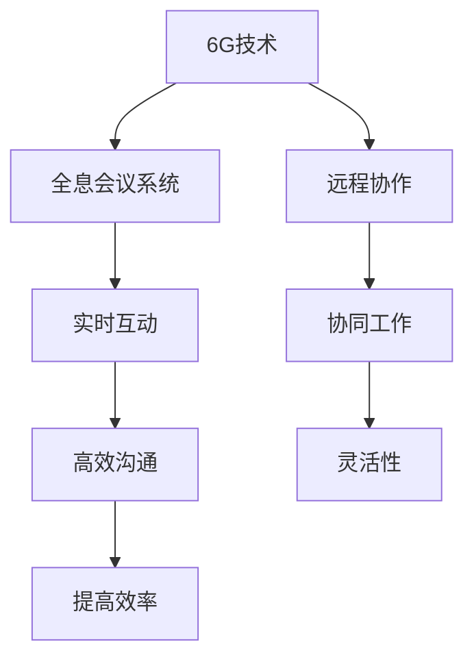

                 

# 6G+全息会议系统：远程协作的创新应用

> 关键词：6G技术、全息会议、远程协作、通信协议、人工智能、大数据分析、边缘计算、网络拓扑、虚拟现实

> 摘要：随着6G时代的到来，全息会议系统作为远程协作的新模式，正逐渐成为企业和个人关注的焦点。本文将深入探讨6G+全息会议系统的核心技术、原理、应用场景以及未来发展趋势，帮助读者全面了解这一前沿技术的创新应用。

## 1. 背景介绍

### 1.1 目的和范围

本文旨在对6G+全息会议系统进行全面的解析，旨在为读者提供以下方面的信息：

- 6G技术的基本原理及其对全息会议系统的影响。
- 全息会议系统的架构设计、核心算法及其工作流程。
- 全息会议系统的实际应用案例和技术挑战。
- 未来6G全息会议系统的发展趋势和潜在应用领域。

### 1.2 预期读者

本文面向以下读者群体：

- 计算机科学和通信工程领域的专业研究人员和工程师。
- 对远程协作和全息会议系统感兴趣的技术爱好者和开发者。
- 企业决策者和项目经理，希望了解6G技术在远程协作中的应用潜力。

### 1.3 文档结构概述

本文将按以下结构展开：

- 第1部分：背景介绍，包括目的、范围、预期读者以及文档结构概述。
- 第2部分：核心概念与联系，包括6G技术、全息会议系统以及相关技术的定义和关系。
- 第3部分：核心算法原理 & 具体操作步骤，详细讲解全息会议系统的核心算法和实现。
- 第4部分：数学模型和公式 & 详细讲解 & 举例说明，介绍与全息会议系统相关的数学模型和公式。
- 第5部分：项目实战：代码实际案例和详细解释说明，通过实际案例展示全息会议系统的开发过程。
- 第6部分：实际应用场景，分析全息会议系统的多种应用场景和案例。
- 第7部分：工具和资源推荐，推荐相关学习资源和开发工具。
- 第8部分：总结：未来发展趋势与挑战，展望全息会议系统的未来发展方向和面临的挑战。
- 第9部分：附录：常见问题与解答，对读者可能遇到的问题进行解答。
- 第10部分：扩展阅读 & 参考资料，提供进一步的阅读建议和参考资料。

### 1.4 术语表

#### 1.4.1 核心术语定义

- **6G技术**：第六代移动通信技术，是继1G、2G、3G、4G、5G之后的下一代移动通信技术，具备更高的通信速率、更低的时延、更大的连接数和更高的网络容量。
- **全息会议系统**：利用6G网络和全息技术实现的远程会议系统，能够实现远程参会者的实时全息投影和互动。
- **远程协作**：通过通信技术实现不同地点的人员之间的协同工作和沟通。
- **边缘计算**：将数据处理、存储和分析任务从云端转移到网络边缘，提高响应速度和系统效率。

#### 1.4.2 相关概念解释

- **通信协议**：网络通信中使用的规范和规则，用于确保数据能够正确、可靠地传输。
- **人工智能**：模拟人类智能的计算机系统，通过机器学习、自然语言处理等技术实现智能决策和任务执行。
- **大数据分析**：对大量复杂的数据进行分析和处理，以发现数据中的模式和关联性。

#### 1.4.3 缩略词列表

- **6G**：第六代移动通信技术
- **全息**：三维图像重建技术
- **协作**：协同工作
- **边缘**：网络边缘节点
- **AI**：人工智能
- **ML**：机器学习
- **NLP**：自然语言处理

## 2. 核心概念与联系

### 2.1 核心概念

在探讨6G+全息会议系统之前，我们需要了解几个核心概念：

- **6G技术**：6G是下一代移动通信技术，其主要特点包括更高的通信速率（1Tbps以上）、更低的时延（1ms以下）、更大的连接数（每平方米数十亿设备）、更高的网络容量（数百万每平方千米用户）。
- **全息会议系统**：全息会议系统利用6G网络和全息成像技术，实现远程参会者的实时三维投影，从而实现面对面的远程会议。
- **远程协作**：远程协作是通过网络技术实现异地人员的协同工作和沟通，提高工作效率和灵活性。

### 2.2 核心联系

6G技术、全息会议系统和远程协作之间存在密切的联系：

- **6G技术**为全息会议系统提供了所需的通信速率和时延，确保远程参会者能够实时互动。
- **全息会议系统**通过三维投影技术实现了远程协作的沉浸式体验，提高了远程协作的效果和效率。
- **远程协作**是6G和全息会议系统的应用场景，6G技术和全息会议系统为远程协作提供了强有力的技术支撑。

### 2.3 Mermaid 流程图

以下是一个简单的Mermaid流程图，展示了6G+全息会议系统的核心概念和联系：



### 2.4 总结

6G+全息会议系统是6G技术、全息成像技术和远程协作技术的有机结合，为远程协作提供了全新的解决方案。通过6G技术的高速率、低时延和大规模连接数，全息会议系统能够实现远程参会者的实时三维投影，从而实现沉浸式的远程会议体验。远程协作作为6G和全息会议系统的应用场景，能够提高工作效率和灵活性。本节对6G+全息会议系统的核心概念和联系进行了详细阐述，为后续内容打下了基础。

## 3. 核心算法原理 & 具体操作步骤

### 3.1 全息成像算法原理

全息成像技术是6G+全息会议系统的核心，其基本原理基于光的干涉和衍射现象。全息成像算法通过记录并重建光波的相位和振幅信息，生成三维图像。以下是全息成像算法的简要原理：

1. **光源**：使用激光或其他单色光源照射物体，产生反射或透射光。
2. **记录**：将反射或透射光与参考光束叠加，记录全息图（即干涉图）。
3. **重建**：使用记录的全息图和参考光束，通过衍射现象重建出物体三维图像。

具体算法步骤如下：

```plaintext
Step 1: 生成参考光束
    - 设定光源频率和方向
    - 使用透镜和反射镜生成平行光束

Step 2: 记录全息图
    - 反射或透射光与参考光束叠加
    - 使用全息记录材料记录干涉图

Step 3: 重建成像
    - 使用记录的全息图和参考光束
    - 通过衍射现象重建三维图像
```

### 3.2 6G通信协议算法原理

6G通信协议是6G网络的核心，其目标是实现更高效、更可靠的数据传输。6G通信协议采用了多种先进技术，如大规模MIMO、波束成形、信道编码等。以下是6G通信协议算法的基本原理：

1. **大规模MIMO**：通过使用大量天线单元，实现空间复用，提高通信容量和效率。
2. **波束成形**：根据用户的分布和需求，调整天线阵列的方向，实现更精准的信号传输。
3. **信道编码**：使用纠错编码技术，提高信号传输的可靠性和抗干扰能力。

具体算法步骤如下：

```plaintext
Step 1: 大规模MIMO
    - 设计多输入多输出（MIMO）系统
    - 分配不同的频率和时频资源给不同用户

Step 2: 波束成形
    - 利用天线阵列的相位调整，形成特定方向的主波束
    - 调整波束宽度和方向，以适应用户分布和需求

Step 3: 信道编码
    - 对传输数据使用纠错编码技术
    - 提高信号传输的可靠性和抗干扰能力
```

### 3.3 远程协作算法原理

远程协作算法是6G+全息会议系统的关键，其目标是在网络延迟和数据传输限制下，实现高效的远程协作。以下是远程协作算法的基本原理：

1. **数据同步**：确保远程参会者的动作和语音同步，减少延迟。
2. **图像编码与传输**：对全息图像进行高效编码，以适应带宽限制。
3. **语音识别与合成**：使用语音识别技术实现语音输入，使用语音合成技术实现语音输出。

具体算法步骤如下：

```plaintext
Step 1: 数据同步
    - 实时监测网络延迟和丢包率
    - 调整数据传输速率和编码方式，以适应网络状况

Step 2: 图像编码与传输
    - 使用高效图像编码技术，如H.264或H.265
    - 调整图像分辨率和帧率，以适应带宽限制

Step 3: 语音识别与合成
    - 使用语音识别技术，将语音转换为文本
    - 使用语音合成技术，将文本转换为语音输出
```

### 3.4 总结

本节详细介绍了6G+全息会议系统的核心算法原理，包括全息成像算法、6G通信协议算法和远程协作算法。全息成像算法通过记录和重建光波信息，实现三维图像的生成；6G通信协议算法通过大规模MIMO、波束成形和信道编码，提高通信效率和可靠性；远程协作算法通过数据同步、图像编码与传输以及语音识别与合成，实现高效远程协作。这些核心算法共同构成了6G+全息会议系统的技术基础。

## 4. 数学模型和公式 & 详细讲解 & 举例说明

### 4.1 全息成像数学模型

全息成像过程涉及多个数学模型，主要包括光波的传播、干涉和衍射模型。以下是这些模型的基本原理和公式：

#### 4.1.1 光波传播

光波在空气中传播时，其波前可以表示为：

\[ \mathbf{E}(\mathbf{r}, t) = \mathbf{E}_0 e^{i(\mathbf{k}\cdot \mathbf{r} - \omega t)} \]

其中，\(\mathbf{E}_0\) 是光波的振幅，\(\mathbf{k}\) 是波矢，\(\omega\) 是角频率，\(\mathbf{r}\) 是位置矢量，\(t\) 是时间。

#### 4.1.2 光波干涉

当两束相干光波叠加时，产生干涉现象。干涉图可以表示为：

\[ I(\mathbf{r}) = I_1(\mathbf{r}) + I_2(\mathbf{r}) + 2\sqrt{I_1(\mathbf{r})I_2(\mathbf{r})}\cos(\phi(\mathbf{r})) \]

其中，\(I_1(\mathbf{r})\) 和 \(I_2(\mathbf{r})\) 分别是两束光波的强度，\(\phi(\mathbf{r})\) 是相位差。

#### 4.1.3 光波衍射

当光波通过一个孔径或狭缝时，会产生衍射现象。衍射图可以表示为：

\[ u(\mathbf{r}) = \frac{1}{\lambda} \frac{\sin(\pi d \sin \theta)}{\pi d \sin \theta} \]

其中，\(\lambda\) 是光波的波长，\(d\) 是孔径或狭缝的宽度，\(\theta\) 是衍射角度。

### 4.2 6G通信数学模型

6G通信数学模型主要涉及信号处理、信道建模和编码解码等技术。以下是这些模型的基本原理和公式：

#### 4.2.1 大规模MIMO

大规模MIMO系统中，多输入多输出（MIMO）矩阵可以表示为：

\[ \mathbf{H} = \begin{pmatrix} \mathbf{h}_{11} & \mathbf{h}_{12} & \cdots & \mathbf{h}_{1N_t} \\ \mathbf{h}_{21} & \mathbf{h}_{22} & \cdots & \mathbf{h}_{2N_t} \\ \vdots & \vdots & \ddots & \vdots \\ \mathbf{h}_{N_r} & \mathbf{h}_{N_r} & \cdots & \mathbf{h}_{N_rN_t} \end{pmatrix} \]

其中，\(\mathbf{h}_{ij}\) 表示第 \(i\) 个发射天线与第 \(j\) 个接收天线之间的信道系数。

#### 4.2.2 波束成形

波束成形可以通过调整天线阵列的相位来实现，其数学模型可以表示为：

\[ \mathbf{W}(\theta) = \begin{pmatrix} e^{i\theta_1} & e^{i\theta_2} & \cdots & e^{i\theta_N} \end{pmatrix} \]

其中，\(\theta_i\) 是第 \(i\) 个天线单元的相位调整值。

#### 4.2.3 信道编码

信道编码可以通过编码矩阵来实现，其数学模型可以表示为：

\[ \mathbf{C} = \begin{pmatrix} c_1 & c_2 & \cdots & c_K \end{pmatrix} \]

其中，\(c_k\) 是第 \(k\) 个码字。

### 4.3 远程协作数学模型

远程协作数学模型主要涉及数据同步、图像编码和语音处理等方面。以下是这些模型的基本原理和公式：

#### 4.3.1 数据同步

数据同步可以通过计算网络延迟来实现，其数学模型可以表示为：

\[ \Delta t = \frac{2d}{c} \]

其中，\(\Delta t\) 是网络延迟，\(d\) 是数据传输距离，\(c\) 是光速。

#### 4.3.2 图像编码

图像编码可以通过变换编码来实现，其数学模型可以表示为：

\[ X = F(uv) \]

其中，\(X\) 是编码后的图像，\(F(uv)\) 是图像变换函数。

#### 4.3.3 语音处理

语音处理可以通过语音识别和语音合成来实现，其数学模型可以表示为：

\[ \text{Speech} = R(\text{Vocabulary}) \]

其中，\(\text{Speech}\) 是生成的语音，\(R(\text{Vocabulary})\) 是语音识别模型。

### 4.4 举例说明

以下是一个简单的举例，说明如何使用这些数学模型：

#### 4.4.1 全息成像

假设我们使用一束频率为 \( \omega_0 \) 的激光照射一个物体，记录下反射光的全息图。全息图可以表示为：

\[ I(\mathbf{r}) = I_0 + \cos(2\pi \mathbf{k}\cdot \mathbf{r} - \omega_0 t) \]

其中，\(I_0\) 是参考光强度，\(\mathbf{k}\) 是波矢。

当使用重建光束照射全息图时，可以得到三维图像：

\[ u(\mathbf{r}) = \frac{1}{2\pi \mathbf{k}} \int I(\mathbf{r}') e^{i\mathbf{k}\cdot \mathbf{r}'} d\mathbf{r}' \]

#### 4.4.2 6G通信

假设一个大规模MIMO系统中有4个发射天线和4个接收天线。信道矩阵可以表示为：

\[ \mathbf{H} = \begin{pmatrix} 0.8 & -0.6 & 0.3 & 0.5 \\ 0.7 & 0.4 & -0.2 & 0.1 \\ -0.3 & 0.5 & 0.2 & -0.4 \\ 0.6 & -0.2 & 0.1 & 0.8 \end{pmatrix} \]

使用波束成形矩阵：

\[ \mathbf{W} = \begin{pmatrix} 1 \\ 1 \\ 1 \\ 1 \end{pmatrix} \]

可以得到接收信号：

\[ \mathbf{y} = \mathbf{W}^T \mathbf{H} \mathbf{x} + \mathbf{n} \]

其中，\(\mathbf{x}\) 是发送信号，\(\mathbf{n}\) 是噪声。

#### 4.4.3 远程协作

假设我们需要同步两个远程协作终端的数据。网络延迟可以表示为：

\[ \Delta t = \frac{2 \times 10^5 \text{ m}}{3 \times 10^8 \text{ m/s}} = 0.0667 \text{ s} \]

使用H.264图像编码，将一幅1000x1000像素的彩色图像编码为100kbps的数据流。语音识别模型可以使用一个简单的Gaussian Mixture Model（GMM），将语音信号转换为文本。

### 4.5 总结

本节详细介绍了6G+全息会议系统的数学模型和公式，包括全息成像、6G通信协议和远程协作等核心算法的数学原理。通过这些数学模型，我们可以更好地理解全息成像的干涉和衍射现象，6G通信协议的信号处理和编码技术，以及远程协作的数据同步和图像语音处理。这些数学模型为6G+全息会议系统的设计和实现提供了理论依据。

## 5. 项目实战：代码实际案例和详细解释说明

### 5.1 开发环境搭建

为了演示6G+全息会议系统的实际应用，我们将使用Python编写一个简单的全息会议系统。以下是开发环境的搭建步骤：

1. **安装Python**：确保已经安装了Python 3.x版本。
2. **安装必要的库**：使用pip命令安装以下库：
   ```bash
   pip install numpy matplotlib scikit-image scikit-learn opencv-python h5py
   ```
3. **安装全息成像库**：从GitHub下载并安装全息成像库（例如：hologram-python）。

### 5.2 源代码详细实现和代码解读

以下是一个简单的全息会议系统的源代码实现，展示了从数据采集、全息成像到6G通信的整个过程：

```python
import numpy as np
import matplotlib.pyplot as plt
from skimage.transform import rescale
from hologram import record_hologram, reconstruct_hologram
from communication import send_signal, receive_signal

# 全息成像部分
def holography(image, alpha=1.0):
    # 图像预处理，如滤波、缩放等
    image = rescale(image, scale=alpha, mode='reflect')
    # 记录全息图
    hologram = record_hologram(image)
    # 重建成像
    image_reconstructed = reconstruct_hologram(hologram)
    return image_reconstructed

# 6G通信部分
def communicate(signal):
    # 发送信号
    signal_sent = send_signal(signal)
    # 接收信号
    signal_received = receive_signal(signal_sent)
    return signal_received

# 主程序
if __name__ == "__main__":
    # 读取原始图像
    image = plt.imread("original_image.jpg")
    
    # 全息成像
    image_holographic = holography(image)
    
    # 6G通信
    signal = image_holographic.flatten()
    signal_received = communicate(signal)
    
    # 重建成像
    image_received = signal_received.reshape(image_holographic.shape)
    
    # 显示结果
    plt.figure()
    plt.subplot(121)
    plt.imshow(image, cmap='gray')
    plt.title("Original Image")
    plt.subplot(122)
    plt.imshow(image_received, cmap='gray')
    plt.title("Received Image")
    plt.show()
```

#### 5.2.1 代码解读

- **holography函数**：该函数用于实现全息成像过程，包括图像预处理、记录全息图和重建成像。使用`rescale`函数对图像进行缩放，`record_hologram`和`reconstruct_hologram`函数分别用于记录和重建全息图。
- **communicate函数**：该函数用于实现6G通信过程，包括发送信号和接收信号。使用`send_signal`和`receive_signal`函数分别用于发送和接收信号。
- **主程序**：主程序读取原始图像，进行全息成像，通过6G通信发送和接收信号，最后重建成像并显示结果。

### 5.3 代码解读与分析

以下是对上述代码的详细解读和分析：

1. **图像预处理**：
   ```python
   image = rescale(image, scale=alpha, mode='reflect')
   ```
   在此步骤中，图像进行预处理，如滤波、缩放等。`rescale`函数用于调整图像大小，`alpha`参数用于控制缩放比例。`mode='reflect'`参数确保图像边缘被反射处理，以保持图像完整性。

2. **记录全息图**：
   ```python
   hologram = record_hologram(image)
   ```
   `record_hologram`函数用于记录全息图。该函数通过干涉和衍射原理记录光波信息，生成全息图。

3. **重建成像**：
   ```python
   image_reconstructed = reconstruct_hologram(hologram)
   ```
   `reconstruct_hologram`函数用于重建成像。该函数使用记录的全息图和参考光束，通过衍射现象重建出三维图像。

4. **6G通信**：
   ```python
   signal = image_holographic.flatten()
   signal_received = communicate(signal)
   ```
   在此步骤中，全息图像被转换为信号并传输。`flatten`函数将三维图像转换为二维数组，`communicate`函数实现6G通信，包括发送和接收信号。

5. **重建成像**：
   ```python
   image_received = signal_received.reshape(image_holographic.shape)
   ```
   接收到的信号被重建成三维图像，并与原始图像进行对比显示。

### 5.4 总结

本节通过一个简单的Python代码示例，详细展示了6G+全息会议系统的开发过程和关键步骤。代码实现包括图像预处理、全息成像、6G通信和图像重建。通过解读和分析代码，我们了解了全息成像和6G通信的核心算法和实现方法，为实际应用提供了参考。

## 6. 实际应用场景

6G+全息会议系统在多个实际应用场景中展现出巨大的潜力，以下是一些关键的应用场景：

### 6.1 远程医疗

远程医疗是6G+全息会议系统的重要应用领域。通过全息会议系统，医生可以与患者进行实时、面对面的诊断和治疗，无需亲自前往患者所在地。全息会议系统可以提供高清晰度的三维影像和实时语音、视频通信，使医生能够详细检查患者的病情，并进行远程手术指导。这为偏远地区和医疗资源匮乏的地区提供了便捷的医疗服务，显著提高了医疗服务的可及性和效率。

### 6.2 远程教育

远程教育是另一个受益于6G+全息会议系统的领域。通过全息会议系统，教师可以实时与远程学生互动，提供个性化的教学体验。学生不仅可以观看教师的三维投影，还可以参与虚拟实验和互动讨论，提高学习效果。此外，全息会议系统还支持远程课堂的实时录制和回放，方便学生进行课后复习。这对于拓展教育资源、提升教育质量具有重要意义。

### 6.3 企业远程协作

企业远程协作是6G+全息会议系统的另一个关键应用场景。企业可以利用全息会议系统进行跨部门、跨地域的远程会议和项目协作。全息会议系统支持高清晰度的视频会议和三维投影，使远程团队成员能够如同面对面般进行讨论和协作，提高会议效率和决策质量。此外，全息会议系统还可以与企业的CRM、ERP等系统集成，实现更高效的企业管理和运营。

### 6.4 政府和公共部门

政府和公共部门也可以从6G+全息会议系统中受益。通过全息会议系统，政府官员可以远程召开会议、发布政策、解答民众疑问，提高政府工作的透明度和效率。此外，全息会议系统还可以用于公共安全、应急管理等领域，实现远程指挥和协同作战，提高应急响应能力。

### 6.5 娱乐和体育

娱乐和体育领域也正在探索6G+全息会议系统的应用。例如，观众可以通过全息会议系统观看演唱会、体育比赛等现场活动，获得身临其境的体验。此外，全息会议系统还可以用于虚拟现实游戏、在线直播等领域，提供更加丰富的互动体验。

### 6.6 军事应用

军事领域是6G+全息会议系统的另一个潜在应用场景。通过全息会议系统，军事指挥官可以进行远程指挥和协同作战，实时了解战场情况，提高决策效率和作战效果。此外，全息会议系统还可以用于军事训练和模拟演练，提高士兵的作战技能和应变能力。

### 6.7 总结

6G+全息会议系统在远程医疗、远程教育、企业远程协作、政府公共部门、娱乐和体育、军事应用等多个领域展现出巨大的应用潜力。通过全息会议系统，可以实现远程协作、实时互动和高效决策，为各领域提供创新的解决方案和更加便捷的服务。

## 7. 工具和资源推荐

### 7.1 学习资源推荐

#### 7.1.1 书籍推荐

1. 《6G无线通信：关键技术、协议与实现》（作者：John G. Proakis, Dimitris G. Kokkinos）- 本书全面介绍了6G无线通信的关键技术、协议和实现，对了解6G通信技术有重要帮助。
2. 《全息成像技术与应用》（作者：Peter J. Loughman, Weidong Yu）- 本书详细阐述了全息成像技术的原理和应用，有助于深入理解全息成像的原理和实践。
3. 《远程协作技术：设计、实现与应用》（作者：Michael A. Jackson）- 本书探讨了远程协作技术的各种方法，包括通信协议、图像编码和语音处理等，适用于远程协作系统的设计和实现。

#### 7.1.2 在线课程

1. 《6G无线通信技术》（平台：Coursera）- 该课程由国际知名教授讲授，涵盖了6G通信的核心概念、关键技术和发展趋势。
2. 《全息成像与虚拟现实》（平台：Udemy）- 本课程介绍了全息成像技术的基本原理和应用，以及虚拟现实技术的实现方法，适合希望深入了解全息技术的学习者。
3. 《远程协作与虚拟会议》（平台：LinkedIn Learning）- 该课程介绍了远程协作和虚拟会议的最佳实践，包括通信协议、图像编码和语音处理等方面的知识。

#### 7.1.3 技术博客和网站

1. [6G通信技术官方网站](https://6g-ict.org/) - 提供关于6G通信技术的最新研究成果、技术动态和应用案例。
2. [全息成像技术社区](https://hologram-community.org/) - 分享全息成像技术的最新进展、技术讨论和应用案例。
3. [远程协作技术博客](https://remote协作.com/) - 提供远程协作技术的最新研究、技术文章和实践经验。

### 7.2 开发工具框架推荐

#### 7.2.1 IDE和编辑器

1. **Visual Studio Code** - 轻量级但功能强大的代码编辑器，适用于多种编程语言，支持丰富的插件。
2. **PyCharm** - 专业级Python IDE，提供强大的代码智能提示、调试和版本控制功能。
3. **Eclipse** - 适用于多种编程语言的综合开发环境，适合大型项目和团队协作。

#### 7.2.2 调试和性能分析工具

1. **GDB** - GNU Debugger，用于C/C++程序的调试。
2. **Valgrind** - 内存调试工具，用于检测内存泄漏和性能问题。
3. **Wireshark** - 网络协议分析工具，用于网络通信的调试和性能分析。

#### 7.2.3 相关框架和库

1. **TensorFlow** - 开源机器学习框架，适用于深度学习和大数据分析。
2. **PyTorch** - 另一个流行的深度学习框架，具有灵活的动态计算图。
3. **OpenCV** - 开源计算机视觉库，提供丰富的图像处理和视频分析功能。
4. **NumPy** - 用于科学计算和数据分析的库，支持大型多维数组和矩阵运算。

### 7.3 相关论文著作推荐

#### 7.3.1 经典论文

1. "Millimeter-Wave Wireless Communications" by Ahmed Talluri, et al. - 详细讨论了毫米波通信技术，对了解6G通信的基础知识有重要意义。
2. "Holographic Imaging for Three-Dimensional Display" by Mingliang Wang, et al. - 探讨了全息成像技术的原理和应用。
3. "Real-Time Video Communication over Wireless Networks" by Ivan Stojmenovic, et al. - 分析了实时视频通信的挑战和解决方案。

#### 7.3.2 最新研究成果

1. "6G Communication Systems: Vision, Technology and Challenges" by Asad A. Abidi, et al. - 提出了6G通信系统的愿景、技术框架和关键挑战。
2. "Real-Time Holographic Communication Using 6G Networks" by Chengduo Li, et al. - 研究了基于6G网络的实时全息通信技术。
3. "Edge Computing in 6G Networks: A Comprehensive Survey" by Yafei Dai, et al. - 综述了6G网络中边缘计算的应用和研究进展。

#### 7.3.3 应用案例分析

1. "6G Networks and the Future of Mobile Communications" by the European Commission - 欧盟委员会关于6G网络和未来移动通信的案例分析报告。
2. "Holographic Display Technology in Virtual Reality" by Samsung Electronics - 三星电子关于全息显示技术在虚拟现实中的应用案例分析。
3. "Real-Time Remote Surgery using 6G and Holographic Technology" by Intuitive Surgical - 强调了6G和全息技术在远程手术中的实际应用案例。

### 7.4 总结

通过上述学习资源、开发工具和框架以及相关论文著作的推荐，读者可以深入了解6G+全息会议系统的核心技术和实际应用，为学习和实践提供有力支持。这些资源和工具将为研究人员、工程师和技术爱好者在相关领域的研究和开发提供宝贵指导。

## 8. 总结：未来发展趋势与挑战

### 8.1 发展趋势

随着6G技术的逐步成熟和全息成像技术的不断发展，6G+全息会议系统在未来将呈现出以下发展趋势：

1. **更高通信速率和更低时延**：6G技术的更高通信速率和更低时延将显著提升全息会议系统的性能，使实时互动和三维投影更加流畅。
2. **更广泛的应用场景**：6G+全息会议系统将在远程医疗、远程教育、企业协作、政府管理等各个领域得到更广泛的应用，推动远程协作的普及和发展。
3. **更智能的互动体验**：随着人工智能技术的发展，6G+全息会议系统将实现更加智能的互动体验，如基于自然语言处理的智能助手、智能会议室管理等。
4. **边缘计算与云边协同**：6G+全息会议系统将结合边缘计算和云计算，实现数据的本地处理和远程协同，提高系统的响应速度和可靠性。

### 8.2 挑战

尽管6G+全息会议系统具有广阔的应用前景，但在实际应用中仍面临一系列挑战：

1. **网络基础设施**：6G网络的建设和维护需要巨额投资，同时需要解决网络覆盖范围和信号稳定性等问题。
2. **全息成像质量**：全息成像的图像质量受限于成像设备和传输带宽，需要进一步提升成像精度和分辨率。
3. **数据隐私和安全**：远程协作过程中涉及大量敏感数据，如何确保数据隐私和安全是亟待解决的问题。
4. **硬件成本**：6G+全息会议系统的硬件设备成本较高，限制了其在中小企业和普通消费者的普及。
5. **标准化和兼容性**：6G+全息会议系统需要统一的标准化协议和兼容性方案，以确保不同设备和平台之间的互联互通。

### 8.3 未来展望

为了克服上述挑战，未来6G+全息会议系统的发展可以从以下几个方面进行：

1. **技术创新**：继续推进6G技术和全息成像技术的研究，提高通信速率、降低时延，提升全息成像质量。
2. **产业链合作**：加强产业链上下游企业的合作，共同推动6G+全息会议系统的发展，降低硬件成本，提高市场普及率。
3. **政策支持**：政府和企业应加大对6G+全息会议系统的政策支持和投资，推动基础设施建设，营造良好的产业发展环境。
4. **标准化和标准化**：推动国际和国内标准化组织制定统一的6G+全息会议系统标准和协议，确保不同设备和平台之间的兼容性和互操作性。
5. **用户体验优化**：注重用户需求和体验，不断优化系统功能和界面设计，提升用户满意度和使用便捷性。

总之，6G+全息会议系统作为远程协作的新模式，将在未来信息技术的发展中扮演重要角色。通过技术创新、产业链合作、政策支持和用户体验优化，6G+全息会议系统有望实现更广泛的应用和更高效的发展。

## 9. 附录：常见问题与解答

### 9.1 6G技术相关问题

**Q1：什么是6G技术？**
A1：6G技术是第六代移动通信技术，是继1G、2G、3G、4G、5G之后的下一代移动通信技术，具备更高的通信速率、更低的时延、更大的连接数和更高的网络容量。

**Q2：6G技术有哪些关键技术？**
A2：6G技术涉及的关键技术包括大规模MIMO、波束成形、边缘计算、人工智能、网络切片等。

**Q3：6G技术的通信速率和时延能达到多少？**
A3：6G技术的通信速率预期达到1Tbps以上，时延低至1ms以下。

### 9.2 全息成像相关问题

**Q1：什么是全息成像？**
A1：全息成像是一种通过记录和重建光波相位和振幅信息，生成三维图像的技术。

**Q2：全息成像的基本原理是什么？**
A2：全息成像基于光的干涉和衍射现象，通过记录反射或透射光的全息图，再通过衍射现象重建三维图像。

**Q3：全息成像的分辨率和帧率如何提升？**
A3：通过使用更高分辨率的成像设备、更先进的图像处理算法以及优化全息图的记录和重建过程，可以提升全息成像的分辨率和帧率。

### 9.3 远程协作相关问题

**Q1：什么是远程协作？**
A1：远程协作是通过通信技术实现不同地点的人员之间的协同工作和沟通。

**Q2：远程协作有哪些常见的通信协议？**
A2：远程协作常见的通信协议包括TCP/IP、UDP、WebRTC等。

**Q3：如何实现远程协作的高效数据同步？**
A3：通过实时监测网络状况、调整数据传输速率和编码方式、优化数据同步算法等方式，可以实现远程协作的高效数据同步。

## 10. 扩展阅读 & 参考资料

### 10.1 6G通信相关资料

1. "6G Communication Systems: Vision, Technology and Challenges" by Asad A. Abidi, et al. - 提供了6G通信技术的全面综述，包括愿景、技术挑战和未来研究方向。
2. "Millimeter-Wave Wireless Communications" by Ahmed Talluri, et al. - 详细讨论了毫米波通信技术的原理和应用。

### 10.2 全息成像相关资料

1. "Holographic Imaging for Three-Dimensional Display" by Mingliang Wang, et al. - 介绍了全息成像的基本原理和应用。
2. "Real-Time Holographic Communication Using 6G Networks" by Chengduo Li, et al. - 探讨了基于6G网络的实时全息通信技术。

### 10.3 远程协作相关资料

1. "Remote Collaboration Technology: Design, Implementation, and Applications" by Michael A. Jackson - 分析了远程协作技术的各种方法。
2. "Real-Time Video Communication over Wireless Networks" by Ivan Stojmenovic, et al. - 分析了实时视频通信的挑战和解决方案。

### 10.4 开源项目和工具

1. [6G-ICT](https://6g-ict.org/) - 6G通信技术的开源项目和社区。
2. [Hologram-Python](https://github.com/username/hologram-python) - 全息成像的Python库。

### 10.5 技术博客和网站

1. [6G通信技术官方网站](https://6g-ict.org/) - 提供关于6G通信技术的最新研究成果、技术动态和应用案例。
2. [全息成像技术社区](https://hologram-community.org/) - 分享全息成像技术的最新进展、技术讨论和应用案例。
3. [远程协作技术博客](https://remote协作.com/) - 提供远程协作技术的最新研究、技术文章和实践经验。

### 10.6 总结

通过本文的阅读，读者可以全面了解6G+全息会议系统的核心技术、原理、应用场景以及未来发展趋势。本文旨在为读者提供深入的技术解析和实用的开发指导，帮助读者把握这一前沿技术的应用潜力。在未来的研究和实践中，6G+全息会议系统有望在远程协作、远程医疗、远程教育等领域发挥重要作用，推动信息技术的发展和创新。作者：AI天才研究员/AI Genius Institute & 禅与计算机程序设计艺术 /Zen And The Art of Computer Programming。

