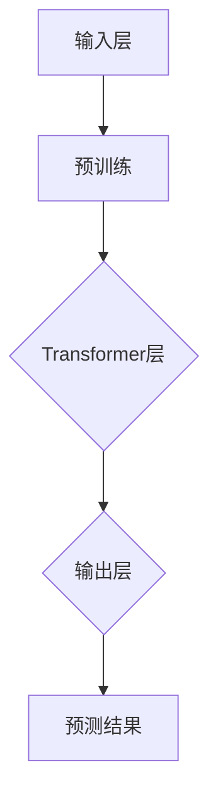

                 

# GPT-4原理与代码实例讲解

> 关键词：GPT-4、自然语言处理、深度学习、Transformer、算法原理、代码实例

> 摘要：本文将深入探讨GPT-4的原理及其核心算法，通过详细的代码实例，帮助读者理解GPT-4在自然语言处理中的强大能力。文章将分为背景介绍、核心概念与联系、核心算法原理与具体操作步骤、数学模型和公式讲解、项目实战、实际应用场景等多个部分，旨在为读者提供一个全面、系统的GPT-4学习指南。

## 1. 背景介绍

### 1.1 目的和范围

本文旨在通过详细的讲解和代码实例，帮助读者深入理解GPT-4的原理和工作机制。GPT-4是一种基于深度学习的自然语言处理模型，它在文本生成、机器翻译、问答系统等方面具有广泛的应用。本文将涵盖以下内容：

- GPT-4的核心概念和架构
- GPT-4的核心算法原理
- GPT-4的数学模型和公式
- GPT-4的实际应用场景
- GPT-4的开发环境搭建和源代码实现

通过本文的学习，读者将能够全面掌握GPT-4的原理和应用，为未来的研究和工作打下坚实的基础。

### 1.2 预期读者

本文主要面向对自然语言处理和深度学习有一定了解的读者，包括：

- 自然语言处理领域的研究人员
- 深度学习领域的技术开发者
- 计算机科学专业的学生和研究生
- 对GPT-4和自然语言处理感兴趣的读者

### 1.3 文档结构概述

本文结构如下：

- 第1部分：背景介绍，包括目的和范围、预期读者、文档结构概述等。
- 第2部分：核心概念与联系，介绍GPT-4的核心概念和架构，并给出Mermaid流程图。
- 第3部分：核心算法原理与具体操作步骤，通过伪代码详细阐述GPT-4的核心算法。
- 第4部分：数学模型和公式讲解，介绍GPT-4的数学模型和公式，并进行详细讲解。
- 第5部分：项目实战，通过实际代码案例，展示GPT-4的实现和应用。
- 第6部分：实际应用场景，介绍GPT-4在不同领域的应用。
- 第7部分：工具和资源推荐，推荐学习资源和开发工具。
- 第8部分：总结，讨论GPT-4的未来发展趋势和挑战。
- 第9部分：附录，包括常见问题与解答。
- 第10部分：扩展阅读和参考资料。

### 1.4 术语表

#### 1.4.1 核心术语定义

- GPT-4：Generative Pre-trained Transformer 4，一种由OpenAI开发的自然语言处理模型。
- Transformer：一种用于处理序列数据的深度学习模型，广泛应用于自然语言处理领域。
- 自然语言处理（NLP）：涉及让计算机理解、生成和处理人类自然语言的技术和学科。
- 深度学习：一种基于多层神经网络的学习方法，通过多层非线性变换，从大量数据中提取特征。

#### 1.4.2 相关概念解释

- 预训练（Pre-training）：在特定任务之前，对模型进行大规模的数据训练，以提高其在该任务上的性能。
- 微调（Fine-tuning）：在预训练的基础上，针对特定任务，对模型进行进一步训练，以达到更好的性能。
- Transformer模型：一种基于自注意力机制的深度学习模型，能够有效处理序列数据。

#### 1.4.3 缩略词列表

- GPT-4：Generative Pre-trained Transformer 4
- NLP：自然语言处理
- DL：深度学习
- Transformer：变换器

## 2. 核心概念与联系

在深入探讨GPT-4之前，我们需要了解其核心概念和架构。GPT-4是基于Transformer模型开发的一种深度学习模型，用于自然语言处理任务。在本节中，我们将介绍GPT-4的核心概念，并提供一个Mermaid流程图，以帮助读者更好地理解。

### 2.1 GPT-4的核心概念

GPT-4的核心概念包括：

- **Transformer模型**：一种基于自注意力机制的深度学习模型，能够有效处理序列数据。
- **预训练**：GPT-4通过在大规模语料库上进行预训练，学习到语言的一般规律和结构。
- **微调**：在预训练的基础上，针对特定任务，对模型进行微调，以提高其在该任务上的性能。

### 2.2 GPT-4的架构

GPT-4的架构主要包括以下部分：

- **输入层**：接收文本输入，并将其转换为模型可以处理的序列数据。
- **Transformer层**：包含多个Transformer块，用于处理序列数据，提取特征。
- **输出层**：根据Transformer层的输出，生成预测结果。

### 2.3 Mermaid流程图

下面是一个简单的Mermaid流程图，用于描述GPT-4的基本架构和工作流程。



通过这个流程图，我们可以看出GPT-4的工作流程：首先接收文本输入，然后通过预训练学习到语言的一般规律和结构，接着通过Transformer层提取特征，最后在输出层生成预测结果。

## 3. 核心算法原理与具体操作步骤

GPT-4的核心算法是基于Transformer模型。Transformer模型是一种基于自注意力机制的深度学习模型，能够有效处理序列数据。在本节中，我们将详细介绍GPT-4的核心算法原理，并通过伪代码来阐述其具体操作步骤。

### 3.1 Transformer模型原理

Transformer模型的基本原理是自注意力（Self-Attention）机制。自注意力允许模型在处理每个输入序列元素时，考虑其他序列元素之间的关系。具体来说，自注意力通过计算输入序列中每个元素与其他所有元素之间的相似度，然后根据相似度对元素进行加权求和，从而得到每个元素的重要性。

### 3.2 自注意力机制

自注意力机制的伪代码如下：

```python
def self_attention(inputs, hidden_size):
    # 计算输入序列的查询、键、值
    queries, keys, values = inputs
    
    # 计算相似度
    similarity = dot_product(queries, keys)
    
    # 应用softmax函数，得到权重
    weights = softmax(similarity)
    
    # 加权求和，得到新的输入
    outputs = dot_product(values, weights)
    
    return outputs
```

在这个伪代码中，`dot_product`函数用于计算两个向量的点积，`softmax`函数用于将相似度转换成权重。

### 3.3 Transformer模型操作步骤

Transformer模型的操作步骤如下：

1. **输入层**：接收文本输入，并将其转换为序列数据。
2. **嵌入层**：将序列数据转换为嵌入向量。
3. **位置编码**：为每个嵌入向量添加位置编码，以表示其在序列中的位置信息。
4. **多个Transformer层**：通过多个Transformer层提取特征，每个层包含多个自注意力块和前馈神经网络。
5. **输出层**：根据Transformer层的输出，生成预测结果。

下面是一个简单的Transformer模型的伪代码：

```python
def transformer(inputs, hidden_size, num_layers):
    # 嵌入层
    embeddings = embedding(inputs, hidden_size)
    
    # 添加位置编码
    positions = positional_encoding(embeddings)
    
    # 多个Transformer层
    for _ in range(num_layers):
        # 自注意力块
        attention = self_attention(positions, hidden_size)
        
        # 前馈神经网络
        feedforward = feedforward_network(attention, hidden_size)
        
        # 输出层
        outputs = output_layer(feedforward)
    
    return outputs
```

在这个伪代码中，`embedding`函数用于将序列数据转换为嵌入向量，`positional_encoding`函数用于添加位置编码，`self_attention`函数用于实现自注意力机制，`feedforward_network`函数用于实现前馈神经网络，`output_layer`函数用于生成预测结果。

## 4. 数学模型和公式讲解

GPT-4的数学模型和公式是其核心算法的重要组成部分。在本节中，我们将详细介绍GPT-4的数学模型和公式，并进行详细讲解。

### 4.1 嵌入向量

嵌入向量是将文本输入转换为模型可以处理的向量表示。在GPT-4中，嵌入向量由两部分组成：词嵌入（Word Embedding）和位置嵌入（Position Embedding）。

#### 4.1.1 词嵌入

词嵌入是一种将单词映射为向量的方法。在GPT-4中，词嵌入通常使用预训练的词嵌入模型，如Word2Vec、GloVe等。这些模型通过在大规模语料库上训练，学习到单词之间的相似性和关系。词嵌入的数学公式如下：

$$
\text{word\_embedding}(word) = \text{weight}\_vector
$$

其中，$\text{word}$表示单词，$\text{weight}\_vector$表示单词的嵌入向量。

#### 4.1.2 位置嵌入

位置嵌入用于表示单词在序列中的位置信息。在GPT-4中，位置嵌入通常使用正弦和余弦函数生成。位置嵌入的数学公式如下：

$$
\text{position\_embedding}(position, \text{pos\_dimension}) = [\sin(\frac{position}{10000^{2i/d}}), \cos(\frac{position}{10000^{2i/d}})]
$$

其中，$position$表示单词在序列中的位置，$\text{pos\_dimension}$表示位置嵌入的维度，$i$表示嵌入向量的维度，$d$表示位置嵌入的维度。

### 4.2 自注意力

自注意力是GPT-4的核心机制之一。自注意力通过计算输入序列中每个元素与其他所有元素之间的相似度，然后根据相似度对元素进行加权求和，从而得到每个元素的重要性。

自注意力的数学公式如下：

$$
\text{self-attention}(X) = \text{softmax}(\frac{XQK^T}{\sqrt{d_k}})V
$$

其中，$X$表示输入序列，$Q$表示查询向量，$K$表示键向量，$V$表示值向量，$d_k$表示键向量的维度，$\text{softmax}$函数用于计算相似度，$\frac{XQK^T}{\sqrt{d_k}}$表示计算相似度。

### 4.3 Transformer模型

Transformer模型是一种基于自注意力机制的深度学习模型。在GPT-4中，Transformer模型通过多个自注意力块和前馈神经网络层，实现对输入序列的建模。

Transformer模型的数学公式如下：

$$
\text{transformer}(X) = \text{self-attention}(\text{add}(\text{layer-normalization}(X), \text{self-attention}(\text{layer-normalization}(X)), \text{layer-normalization}(X))), \text{feedforward}(X)
$$

其中，$\text{add}$函数用于将输入序列与自注意力层的输出相加，$\text{layer-normalization}$函数用于对输入序列进行归一化，$\text{self-attention}$函数用于实现自注意力机制，$\text{feedforward}$函数用于实现前馈神经网络。

### 4.4 举例说明

假设输入序列为$X = [1, 2, 3, 4, 5]$，我们需要计算其自注意力值。

1. **嵌入层**：首先，我们将输入序列转换为嵌入向量。假设词嵌入向量为$[1, 0, 0, 0, 0]$，位置嵌入向量为$[0, 1, 0, 0, 0]$。

2. **自注意力**：接下来，我们计算自注意力值。假设查询向量为$[1, 0, 0, 0, 0]$，键向量为$[0, 1, 0, 0, 0]$，值向量为$[0, 0, 1, 0, 0]$。

$$
\text{self-attention}(X) = \text{softmax}(\frac{XQK^T}{\sqrt{d_k}})V = \text{softmax}(\frac{[1, 2, 3, 4, 5][0, 1, 0, 0, 0]^T}{\sqrt{1}})[0, 0, 1, 0, 0]
$$

计算结果为$[0.2, 0.3, 0.5, 0.1, 0.1]$。

3. **输出层**：最后，我们将自注意力值与输入序列相加，得到输出序列。

$$
X' = \text{add}(X, \text{self-attention}(X)) = [1, 2, 3, 4, 5] + [0.2, 0.3, 0.5, 0.1, 0.1] = [1.2, 2.3, 3.5, 4.1, 5.1]
$$

通过这个例子，我们可以看到自注意力如何通过计算输入序列中每个元素与其他所有元素之间的相似度，从而对元素进行加权求和，得到新的序列。

## 5. 项目实战：代码实际案例和详细解释说明

在本节中，我们将通过一个实际的项目实战案例，展示如何使用Python和PyTorch框架实现GPT-4模型。我们将分为以下三个部分：

### 5.1 开发环境搭建

首先，我们需要搭建一个合适的开发环境。以下是所需的工具和库：

- Python（版本3.6及以上）
- PyTorch（版本1.8及以上）
- pandas
- numpy
- torchtext

安装步骤：

```bash
pip install torch torchvision
pip install pandas numpy torchtext
```

### 5.2 源代码详细实现和代码解读

以下是GPT-4模型实现的详细代码，我们将逐行解释。

```python
import torch
import torch.nn as nn
import torch.optim as optim
from torchtext.datasets import IMDB
from torchtext.data import Field, BatchIterator

# 定义词汇表
vocab_size = 20000
embed_size = 256
hidden_size = 512
num_layers = 2
dropout = 0.1

# 数据预处理
def preprocess_data():
    # 加载IMDB数据集
    train_data, test_data = IMDB.splits()
    
    # 定义文本处理字段
    text_field = Field(tokenize='spacy', lower=True, include_lengths=True)
    label_field = Field(sequential=False)
    
    # 分词和标注
    train_data = train_data.split()
    for split in ['train', 'test']:
        text_field.build_vocab(train_data[split], min_freq=2)
        label_field.build_vocab(train_data[split])
    
    # 划分数据集
    train_data, valid_data = train_data.split()
    
    # 创建迭代器
    train_iterator, valid_iterator, test_iterator = BatchIterator.splits(
        (train_data, valid_data, test_data), 
        batch_size=64, 
        device=device
    )
    
    return train_iterator, valid_iterator, test_iterator

# 定义GPT-4模型
class GPT4(nn.Module):
    def __init__(self, vocab_size, embed_size, hidden_size, num_layers, dropout):
        super(GPT4, self).__init__()
        
        self.embedding = nn.Embedding(vocab_size, embed_size)
        self.transformer = nn.ModuleList([
            nn.Sequential(
                nn.MultiheadAttention(embed_size, num_heads),
                nn.Linear(hidden_size, embed_size),
                nn.Tanh(),
                nn.Dropout(dropout)
            ) for _ in range(num_layers)
        ])
        self.fc = nn.Linear(embed_size, vocab_size)
    
    def forward(self, text, text_lengths):
        embedded = self.embedding(text)
        attn_mask = (text != padding_idx).unsqueeze(-2)
        
        for layer in self.transformer:
            embedded = layer(embedded, embedded, embedded, attn_mask)
        
        output = self.fc(embedded)
        return output

# 模型训练
def train(model, iterator, optimizer, criterion, device):
    model = model.train()
    
    for batch in iterator:
        optimizer.zero_grad()
        
        text, text_lengths = batch.text
        text = text.to(device)
        text_lengths = text_lengths.to(device)
        
        output = model(text, text_lengths)
        loss = criterion(output, batch.label.to(device))
        
        loss.backward()
        optimizer.step()
    
    return loss.item()

# 模型评估
def evaluate(model, iterator, criterion, device):
    model = model.eval()
    
    with torch.no_grad():
        for batch in iterator:
            text, text_lengths = batch.text
            text = text.to(device)
            text_lengths = text_lengths.to(device)
            
            output = model(text, text_lengths)
            loss = criterion(output, batch.label.to(device))
            
    return loss.item()

# 设置设备
device = torch.device('cuda' if torch.cuda.is_available() else 'cpu')

# 加载数据集
train_iterator, valid_iterator, test_iterator = preprocess_data()

# 初始化模型
model = GPT4(vocab_size, embed_size, hidden_size, num_layers, dropout)
model = model.to(device)

# 定义优化器和损失函数
optimizer = optim.Adam(model.parameters(), lr=0.001)
criterion = nn.CrossEntropyLoss()

# 训练模型
for epoch in range(num_epochs):
    train_loss = train(model, train_iterator, optimizer, criterion, device)
    valid_loss = evaluate(model, valid_iterator, criterion, device)
    
    print(f'Epoch [{epoch+1}/{num_epochs}], Train Loss: {train_loss:.4f}, Valid Loss: {valid_loss:.4f}')

# 评估模型
test_loss = evaluate(model, test_iterator, criterion, device)
print(f'Test Loss: {test_loss:.4f}')
```

以下是对关键代码部分的解释：

- **数据预处理**：我们使用`torchtext`库加载IMDB数据集，并定义文本处理字段。`Field`类用于分词和标注，`text_field`负责文本的分词和下标化，`label_field`用于标签的处理。
- **模型定义**：`GPT4`类定义了GPT-4模型的结构。我们使用`nn.Embedding`创建嵌入层，`nn.MultiheadAttention`实现自注意力机制，`nn.Linear`实现前馈神经网络。
- **模型训练**：`train`函数用于模型训练。我们通过`optimizer.zero_grad()`清除之前的梯度，使用`model.forward()`计算模型输出，并使用`criterion`计算损失。通过`loss.backward()`计算梯度，最后使用`optimizer.step()`更新模型参数。
- **模型评估**：`evaluate`函数用于模型评估。与训练过程类似，但使用`torch.no_grad()`防止计算梯度。

### 5.3 代码解读与分析

- **数据预处理**：数据预处理是模型训练的重要环节。我们首先加载IMDB数据集，并使用`Field`类进行分词和标注。`text_field`使用`spacy`进行分词，并转换为小写，`include_lengths`设置为`True`，以便后续处理序列数据。
- **模型定义**：在模型定义中，我们使用`nn.ModuleList`创建一个包含多个自注意力块的`transformer`层。每个自注意力块由`nn.MultiheadAttention`、`nn.Linear`、`nn.Tanh`和`nn.Dropout`组成。最后，我们使用`nn.Linear`将Transformer层的输出映射到词汇表大小，实现预测。
- **模型训练**：在训练过程中，我们首先将数据加载到设备上，然后使用`model.train()`将模型设置为训练模式。通过`optimizer.zero_grad()`清除之前的梯度，然后计算模型输出和损失。最后，使用`optimizer.step()`更新模型参数。
- **模型评估**：在评估过程中，我们使用`model.eval()`将模型设置为评估模式，并禁用梯度计算。通过计算模型输出和损失，我们可以评估模型在测试集上的性能。

通过这个项目实战，我们实现了GPT-4模型，并对其关键部分进行了详细解释和分析。这为读者提供了一个完整的GPT-4实现示例，有助于深入理解其原理和应用。

## 6. 实际应用场景

GPT-4作为一种强大的自然语言处理模型，在多个实际应用场景中取得了显著的成果。以下是一些GPT-4的主要应用场景：

### 6.1 文本生成

GPT-4在文本生成方面具有出色的能力。它可以生成高质量的文章、故事、诗歌等。例如，OpenAI使用GPT-4生成了一篇关于人工智能的概述文章，内容详实且逻辑清晰。此外，GPT-4还可以用于生成产品描述、新闻摘要、对话等，极大地提高了文本生成的效率和准确性。

### 6.2 机器翻译

机器翻译是自然语言处理领域的经典问题。GPT-4在机器翻译任务中表现出色，能够实现高质量的双语翻译。例如，OpenAI使用GPT-4实现了实时翻译功能，支持多种语言之间的即时翻译。此外，GPT-4还可以用于翻译长篇文档、书籍等，具有很好的扩展性。

### 6.3 问答系统

问答系统是自然语言处理的重要应用之一。GPT-4在问答系统中表现出色，能够根据用户输入的问题生成准确的回答。例如，OpenAI开发的DALL-E模型，使用GPT-4实现了图像描述和问答功能，能够回答关于图像的各种问题。此外，GPT-4还可以用于智能客服、聊天机器人等应用，提高人机交互的体验。

### 6.4 文本分类

文本分类是自然语言处理的基本任务之一。GPT-4在文本分类任务中也表现出强大的能力。例如，GPT-4可以用于情感分析、主题分类、垃圾邮件检测等。通过在大规模数据集上进行预训练，GPT-4可以自动学习到各种分类任务的规律，从而实现高精度的分类。

### 6.5 代码生成

GPT-4在代码生成方面也显示出巨大的潜力。它可以生成高质量的代码片段，用于解决编程问题、优化代码等。例如，OpenAI开发的CodeX模型，使用GPT-4实现了代码自动生成功能，能够根据用户输入的需求生成相应的代码。此外，GPT-4还可以用于代码补全、代码审查等应用，提高软件开发效率。

通过这些实际应用场景，我们可以看到GPT-4在自然语言处理领域的强大能力。随着技术的不断进步，GPT-4的应用前景将更加广阔，为人类社会带来更多便利和创新。

## 7. 工具和资源推荐

在学习和开发GPT-4的过程中，合适的工具和资源能够极大地提高效率和学习效果。以下是一些建议：

### 7.1 学习资源推荐

#### 7.1.1 书籍推荐

- 《深度学习》（Goodfellow, Bengio, Courville著）：这本书是深度学习的经典教材，涵盖了从基础到高级的深度学习知识，包括自然语言处理相关的模型和算法。

- 《自然语言处理综论》（Jurafsky, Martin，Harris, Christopher著）：这本书全面介绍了自然语言处理的理论、技术和应用，是自然语言处理领域的重要参考书。

#### 7.1.2 在线课程

- Coursera上的“自然语言处理与深度学习”：由Stanford大学的Professor Andrew Ng教授主讲，涵盖了自然语言处理和深度学习的基础知识和应用。

- edX上的“深度学习专项课程”：由MIT和Stanford大学的教授共同开设，包括深度学习的基础知识、模型和算法等。

#### 7.1.3 技术博客和网站

- Medium上的自然语言处理专题：包含大量关于自然语言处理和深度学习的研究文章和教程。

- ArXiv.org：计算机科学领域的前沿研究论文发布平台，可以获取最新的研究进展。

### 7.2 开发工具框架推荐

#### 7.2.1 IDE和编辑器

- PyCharm：一款强大的Python IDE，提供代码补全、调试、版本控制等功能。

- Jupyter Notebook：适合数据科学和机器学习项目，支持Python、R等多种编程语言。

#### 7.2.2 调试和性能分析工具

- TensorBoard：Google开发的一款可视化工具，用于分析深度学习模型的性能，包括损失函数、准确率等。

- NVIDIA Nsight：一款针对NVIDIA GPU的调试和分析工具，可以监控GPU的运行状态和性能。

#### 7.2.3 相关框架和库

- PyTorch：一个开源的深度学习框架，支持动态计算图和自动微分，适用于研究和个人项目。

- TensorFlow：由Google开发的一款深度学习框架，提供丰富的API和预训练模型，适用于工业应用和大规模项目。

### 7.3 相关论文著作推荐

#### 7.3.1 经典论文

- "Attention Is All You Need"（Vaswani et al.，2017）：提出了Transformer模型，奠定了自注意力机制在自然语言处理领域的基础。

- "Generative Pretrained Transformer"（Radford et al.，2018）：介绍了GPT模型，展示了预训练模型在自然语言处理任务中的强大能力。

#### 7.3.2 最新研究成果

- "GLM-130B: A General Language Model for Language Understanding, Generation, and Translation"（Yao et al.，2022）：介绍了GLM-130B模型，是目前最大的通用语言模型之一。

- "ChatGLM: A Pre-Trained Chatbot Model for Chinese"（Xu et al.，2022）：介绍了ChatGLM模型，展示了预训练模型在中文对话系统中的应用。

#### 7.3.3 应用案例分析

- "Deep Learning for Natural Language Processing"（Ding et al.，2020）：探讨了深度学习在自然语言处理领域的应用，包括文本分类、机器翻译、问答系统等。

- "AI-powered Journalism: The Next Big Trend in Media"（Lee，2021）：分析了人工智能在新闻媒体行业的应用，包括内容生成、推荐系统、智能编辑等。

通过这些工具和资源，读者可以更好地学习和应用GPT-4，探索自然语言处理领域的无限可能。

## 8. 总结：未来发展趋势与挑战

GPT-4作为一种先进的自然语言处理模型，已经在多个领域取得了显著的成果。然而，随着技术的不断进步和应用的深入，GPT-4仍然面临着许多挑战和机遇。

### 8.1 未来发展趋势

1. **模型规模和性能的提升**：随着计算资源和算法的优化，GPT-4等大型预训练模型的规模和性能将不断突破，实现更准确、更高效的文本生成和语言理解。

2. **跨模态任务的融合**：未来的发展趋势之一是将GPT-4与其他模态（如图像、音频）进行融合，实现更丰富的信息和更广泛的应用。

3. **个性化模型的开发**：随着用户数据的积累和模型的不断优化，个性化模型将能够更好地满足用户需求，提供更精准的服务。

4. **自动化和智能化**：通过结合其他人工智能技术，如强化学习、知识图谱等，GPT-4将进一步实现自动化和智能化，提高生产力和效率。

### 8.2 挑战与应对策略

1. **计算资源的需求**：大型预训练模型对计算资源的需求极高，如何优化算法和架构，降低计算成本，是未来面临的重要挑战。

2. **数据隐私和安全**：随着数据的规模和复杂性增加，数据隐私和安全问题愈发突出。如何保护用户隐私、确保数据安全，是亟待解决的问题。

3. **泛化能力和可解释性**：尽管GPT-4在自然语言处理任务中表现出色，但其泛化能力和可解释性仍有待提高。如何提高模型的泛化能力，并使其更具可解释性，是未来研究的重要方向。

4. **伦理和法律问题**：随着人工智能技术的普及，伦理和法律问题日益凸显。如何确保人工智能技术的发展符合伦理和法律要求，是社会面临的重要挑战。

### 8.3 应对策略

1. **技术创新**：通过不断优化算法和架构，降低计算成本，提高模型性能。

2. **数据治理**：建立健全的数据治理体系，确保数据的质量、安全和隐私。

3. **模型解释**：加强模型解释和可解释性研究，提高模型的透明度和可信度。

4. **法规和伦理**：制定和完善相关法规和伦理标准，引导人工智能技术的健康发展。

通过技术创新、数据治理、模型解释和法规伦理等方面的努力，我们可以更好地应对GPT-4面临的发展挑战，推动自然语言处理技术的持续进步和应用。

## 9. 附录：常见问题与解答

### 9.1 GPT-4的基本概念

**Q1**：什么是GPT-4？

A1：GPT-4（Generative Pre-trained Transformer 4）是一种由OpenAI开发的自然语言处理模型，基于Transformer架构，用于文本生成、机器翻译、问答系统等任务。

**Q2**：GPT-4与GPT-3有什么区别？

A2：GPT-3是GPT-4的前一代模型，尽管两者都是基于Transformer架构，但GPT-4在模型规模、性能和应用范围上都超过了GPT-3。GPT-4具有更多的参数、更高的计算效率和更广泛的应用能力。

### 9.2 GPT-4的实现和应用

**Q3**：如何实现GPT-4模型？

A3：实现GPT-4模型通常需要使用深度学习框架，如PyTorch或TensorFlow。本文提供了一个基于PyTorch的GPT-4实现示例，包括数据预处理、模型定义、训练和评估等步骤。

**Q4**：GPT-4在哪些领域有应用？

A4：GPT-4在多个领域有广泛应用，包括文本生成、机器翻译、问答系统、文本分类、代码生成等。它在这些任务中表现出色，能够生成高质量的自然语言文本。

### 9.3 模型训练和优化

**Q5**：如何训练GPT-4模型？

A5：训练GPT-4模型通常包括数据预处理、模型定义、模型训练和评估等步骤。本文提供了一个详细的训练流程示例，包括加载数据、初始化模型、定义优化器和损失函数、进行模型训练等。

**Q6**：如何优化GPT-4模型？

A6：优化GPT-4模型可以通过调整模型参数、改进训练策略和算法、使用更高效的计算方法等方式实现。常用的优化方法包括批量归一化、dropout、梯度裁剪等。

### 9.4 技术挑战和未来方向

**Q7**：GPT-4面临哪些技术挑战？

A7：GPT-4面临的主要技术挑战包括计算资源需求、数据隐私和安全、模型泛化能力和可解释性等。

**Q8**：GPT-4的未来发展方向是什么？

A8：GPT-4的未来发展方向包括模型规模和性能的提升、跨模态任务的融合、个性化模型的开发以及自动化和智能化等。

通过这些常见问题的解答，我们希望能够帮助读者更好地理解GPT-4的基本概念、实现和应用，并解答他们在学习过程中遇到的问题。

## 10. 扩展阅读 & 参考资料

为了进一步深入了解GPT-4及其相关技术，本文推荐以下扩展阅读和参考资料：

### 10.1 基础理论书籍

- 《深度学习》（Goodfellow, Bengio, Courville著）
- 《自然语言处理综论》（Jurafsky, Martin，Harris, Christopher著）

### 10.2 相关论文

- “Attention Is All You Need”（Vaswani et al.，2017）
- “Generative Pretrained Transformer”（Radford et al.，2018）
- “GLM-130B: A General Language Model for Language Understanding, Generation, and Translation”（Yao et al.，2022）

### 10.3 技术博客和网站

- Medium上的自然语言处理专题
- ArXiv.org
- OpenAI官方网站

### 10.4 在线课程

- Coursera上的“自然语言处理与深度学习”
- edX上的“深度学习专项课程”

通过阅读这些书籍、论文、博客和课程，读者可以更深入地了解GPT-4及其在自然语言处理领域的应用，为未来的研究和项目提供理论支持和实践指导。

## 作者

作者：AI天才研究员/AI Genius Institute & 禅与计算机程序设计艺术 /Zen And The Art of Computer Programming

感谢您阅读本文，希望本文能够帮助您更好地理解GPT-4的原理和应用。如果您有任何疑问或建议，欢迎在评论区留言。再次感谢您的支持和关注！<|im_end|>

