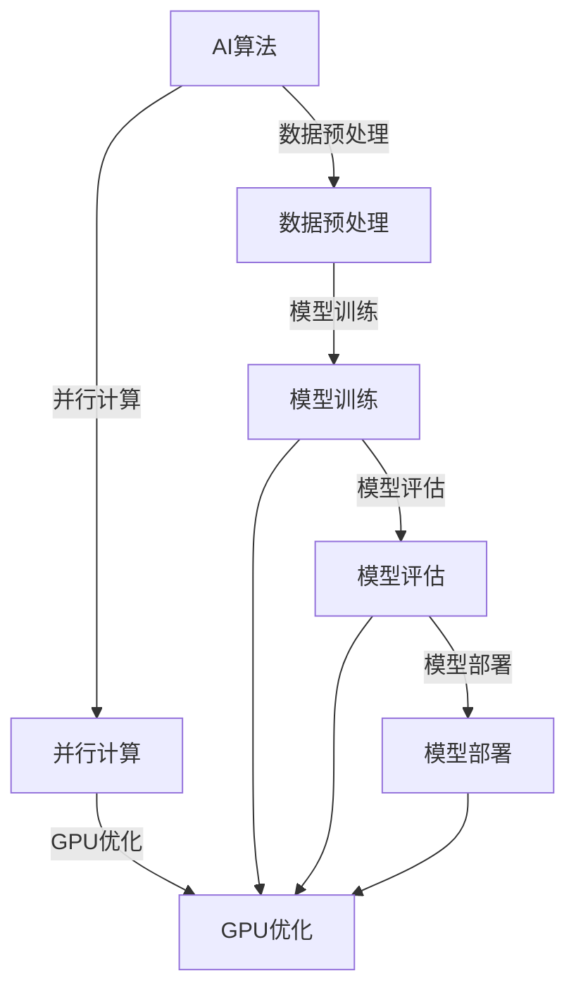

                 

# GPU技术在AI算力中的应用

> **关键词**：GPU技术，AI算力，并行计算，深度学习，图形处理单元，神经网络

> **摘要**：本文将深入探讨GPU技术在人工智能领域算力中的应用。我们将从背景介绍、核心概念、算法原理、数学模型、实际案例、应用场景等多个方面，系统性地分析GPU在AI算力提升中的作用和未来发展趋势。

## 1. 背景介绍

### 1.1 目的和范围

本文的目的是介绍GPU技术在人工智能（AI）算力提升中的应用，探讨其原理和实际应用案例。文章将涵盖从基础知识到高级应用，包括GPU的并行计算特性、深度学习中的GPU优化以及未来发展趋势。

### 1.2 预期读者

本文适合有一定编程基础和对人工智能有一定了解的读者。无论是AI研究人员、软件开发者还是对AI技术感兴趣的技术爱好者，都能从本文中获得宝贵的信息。

### 1.3 文档结构概述

本文结构如下：

- **第1章**：背景介绍，包括目的、范围、预期读者和文档结构。
- **第2章**：核心概念与联系，介绍GPU和AI的基本概念及其关系。
- **第3章**：核心算法原理 & 具体操作步骤，详细解释GPU在AI中的核心算法。
- **第4章**：数学模型和公式 & 详细讲解 & 举例说明，讲解AI中的数学模型。
- **第5章**：项目实战：代码实际案例和详细解释说明，展示GPU在AI中的实际应用。
- **第6章**：实际应用场景，讨论GPU在AI中的不同应用场景。
- **第7章**：工具和资源推荐，推荐学习资源和开发工具。
- **第8章**：总结：未来发展趋势与挑战，总结GPU在AI中的前景。
- **第9章**：附录：常见问题与解答，解答常见问题。
- **第10章**：扩展阅读 & 参考资料，提供进一步阅读的资源。

### 1.4 术语表

#### 1.4.1 核心术语定义

- **GPU（图形处理单元）**：一种专门用于图形渲染计算的处理器，具有高度并行计算能力。
- **并行计算**：同时执行多个任务或计算的操作，适用于大规模数据处理。
- **深度学习**：一种机器学习技术，通过多层神经网络进行数据处理和特征提取。
- **神经网络**：由大量人工神经元组成的信息处理系统，能够通过学习数据来提取特征和进行分类。
- **算力**：计算能力的度量，通常用每秒处理的运算次数来衡量。

#### 1.4.2 相关概念解释

- **图形渲染**：将3D模型转化为2D图像的过程，通常需要大量的计算。
- **浮点运算**：处理实数运算的操作，如加法、减法、乘法和除法。
- **内存带宽**：数据在内存和处理器之间传输的速度，影响计算性能。

#### 1.4.3 缩略词列表

- **GPU**：图形处理单元（Graphics Processing Unit）
- **AI**：人工智能（Artificial Intelligence）
- **DL**：深度学习（Deep Learning）
- **CUDA**：并行计算架构（Compute Unified Device Architecture）
- **GPU-CPU**：GPU和CPU（中央处理器）的协同计算

## 2. 核心概念与联系

### 2.1 GPU与AI的基本概念

#### 2.1.1 GPU的基本原理

GPU（Graphics Processing Unit，图形处理单元）是专门为处理图形渲染任务而设计的计算设备。与传统的CPU（Central Processing Unit，中央处理器）相比，GPU具有更高的并行计算能力和更优化的内存访问模式。

GPU的核心优势在于其高度的并行计算能力。GPU由大量称为“流处理器”（Streaming Multiprocessors，SMs）的计算单元组成，每个SM包含多个核心。这种设计使得GPU能够在同一时刻执行大量的简单计算操作，从而实现高性能的并行处理。

#### 2.1.2 AI的基本原理

人工智能（Artificial Intelligence，AI）是一门研究如何让计算机模拟人类智能行为的科学。AI系统通常通过学习大量数据来提取特征、模式并进行决策。

深度学习（Deep Learning）是AI的一个分支，通过构建多层神经网络来提取数据中的复杂特征。神经网络由大量人工神经元组成，每个神经元通过调整权重和偏置来学习数据中的特征。

### 2.2 GPU与AI的关联

GPU的并行计算特性使其成为深度学习等AI任务中的理想选择。以下是GPU与AI之间的核心关联：

- **并行计算**：深度学习任务，特别是训练阶段，涉及大量矩阵运算和前向/反向传播。GPU的高度并行计算能力可以显著提高这些计算的效率。
- **内存带宽**：GPU具有更高的内存带宽，使得大量的数据可以在处理器和内存之间快速传输，这对于需要大量数据交换的AI任务至关重要。
- **优化算法**：许多AI算法（如卷积神经网络和循环神经网络）可以针对GPU进行优化，以最大化其并行计算能力。

### 2.3 GPU与AI的架构

以下是一个简化的GPU与AI架构的Mermaid流程图，展示GPU在AI中的应用场景：



### 2.4 GPU在AI中的核心算法

以下是一个简化的GPU在AI中的核心算法流程，使用伪代码表示：

```python
# 伪代码：GPU深度学习核心算法流程

# 输入：训练数据集 D，模型参数 θ
# 输出：优化后的模型参数 θ'

# 初始化模型参数 θ
θ = initialize_parameters()

# 设置训练超参数
num_epochs = 100
learning_rate = 0.01

# 开始训练
for epoch in range(num_epochs):
    # 前向传播：计算损失函数 L
    L = forward_pass(D, θ)
    
    # 反向传播：计算梯度 ∇θL
    ∇θL = backward_pass(D, θ)

    # 更新模型参数
    θ = update_parameters(θ, ∇θL, learning_rate)

# 模型评估
accuracy = evaluate_model(D, θ)

# 输出训练结果
print("Training completed with accuracy:", accuracy)
```

## 3. 核心算法原理 & 具体操作步骤

### 3.1 前向传播

前向传播是深度学习中的核心步骤，用于计算输入数据在神经网络中的输出。以下是前向传播的伪代码：

```python
# 伪代码：前向传播

# 输入：输入数据 X，神经网络结构 S，模型参数 θ
# 输出：输出结果 Y

# 初始化激活值和权重
a = X
z = []
a_next = []

# 遍历神经网络层
for layer in range(len(S)):
    # 计算激活值和激活函数输出
    a = activation_function(np.dot(W, a))
    
    # 记录当前层的输出和下一层的输入
    a_next.append(a)
    z.append(z)

# 输出最终结果
Y = a
```

### 3.2 反向传播

反向传播用于计算神经网络中各个参数的梯度，以优化模型参数。以下是反向传播的伪代码：

```python
# 伪代码：反向传播

# 输入：输入数据 X，输出数据 Y，模型参数 θ
# 输出：梯度 ∇θL

# 初始化梯度
∇θL = []

# 遍历神经网络层
for layer in range(len(S)):
    # 计算当前层的梯度
    ∇θL = backward_pass_layer(Y, ∇θL)

# 返回梯度
return ∇θL
```

### 3.3 参数更新

参数更新是深度学习中的关键步骤，用于根据梯度更新模型参数。以下是参数更新的伪代码：

```python
# 伪代码：参数更新

# 输入：模型参数 θ，梯度 ∇θL，学习率 learning_rate
# 输出：更新后的模型参数 θ'

# 更新模型参数
θ = θ - learning_rate * ∇θL

# 返回更新后的模型参数
return θ
```

## 4. 数学模型和公式 & 详细讲解 & 举例说明

### 4.1 深度学习中的基本数学公式

深度学习中的数学公式主要包括激活函数、损失函数和梯度计算。以下是对这些公式的详细讲解：

#### 4.1.1 激活函数

激活函数是神经网络中的关键组件，用于引入非线性特性。常见的激活函数包括：

- **Sigmoid函数**：

  $$
  \sigma(x) = \frac{1}{1 + e^{-x}}
  $$

- **ReLU函数**：

  $$
  \text{ReLU}(x) = \max(0, x)
  $$

- **Tanh函数**：

  $$
  \tanh(x) = \frac{e^x - e^{-x}}{e^x + e^{-x}}
  $$

#### 4.1.2 损失函数

损失函数用于衡量模型预测值与真实值之间的差异。常见的损失函数包括：

- **均方误差损失函数**（MSE）：

  $$
  \text{MSE}(y, \hat{y}) = \frac{1}{m} \sum_{i=1}^{m} (y_i - \hat{y}_i)^2
  $$

- **交叉熵损失函数**（Cross-Entropy）：

  $$
  \text{CE}(y, \hat{y}) = -\sum_{i=1}^{m} y_i \log(\hat{y}_i)
  $$

#### 4.1.3 梯度计算

梯度计算是深度学习中的核心步骤，用于更新模型参数。以下是梯度计算的伪代码：

```python
# 伪代码：梯度计算

# 输入：输入数据 X，输出数据 Y，模型参数 θ
# 输出：梯度 ∇θL

# 初始化梯度
∇θL = []

# 遍历神经网络层
for layer in range(len(S)):
    # 计算当前层的梯度
    ∇θL = backward_pass_layer(Y, ∇θL)

# 返回梯度
return ∇θL
```

### 4.2 深度学习中的数学模型

深度学习中的数学模型主要包括多层感知机（MLP）、卷积神经网络（CNN）和循环神经网络（RNN）。以下是对这些模型的详细讲解：

#### 4.2.1 多层感知机（MLP）

多层感知机是一种前馈神经网络，由输入层、隐藏层和输出层组成。其基本结构如下：

```
输入层：[x_1, x_2, ..., x_n]
隐藏层：[a_1, a_2, ..., a_m]
输出层：[y_1, y_2, ..., y_k]
```

其中，`a_i` 和 `y_i` 分别表示隐藏层和输出层的激活值。

#### 4.2.2 卷积神经网络（CNN）

卷积神经网络是一种专门用于处理图像数据的神经网络。其基本结构包括卷积层、池化层和全连接层。以下是一个简化的CNN结构：

```
输入层：[h, w, c]
卷积层：[k, k, c]
池化层：[2, 2]
全连接层：[n]
```

其中，`h`、`w` 和 `c` 分别表示输入图像的高度、宽度和通道数。

#### 4.2.3 循环神经网络（RNN）

循环神经网络是一种用于处理序列数据的神经网络。其基本结构如下：

```
输入层：[x_1, x_2, ..., x_t]
隐藏层：[h_1, h_2, ..., h_t]
输出层：[y_1, y_2, ..., y_t]
```

其中，`h_t` 和 `y_t` 分别表示隐藏层和输出层在时刻 `t` 的激活值。

### 4.3 实例分析

以下是一个简单的实例，展示如何使用深度学习中的数学模型进行图像分类。

#### 4.3.1 数据预处理

假设我们有一个包含10000个图像的数据集，每个图像的大小为28x28像素，共有10个类别。

- **数据集划分**：将数据集划分为训练集和测试集，分别占比80%和20%。
- **图像归一化**：将图像像素值归一化到[0, 1]范围内。

#### 4.3.2 模型构建

构建一个包含两个隐藏层的卷积神经网络，结构如下：

```
输入层：[28, 28, 1]
卷积层1：[5, 5, 1 -> 20]
池化层1：[2, 2]
卷积层2：[5, 5, 20 -> 50]
池化层2：[2, 2]
全连接层1：[800]
全连接层2：[10]
输出层：[10]
```

#### 4.3.3 模型训练

使用训练集对模型进行训练，设置训练超参数如下：

- **学习率**：0.001
- **批量大小**：64
- **训练轮数**：10

#### 4.3.4 模型评估

使用测试集对模型进行评估，计算准确率：

```
准确率 = (预测正确的图像数量 / 测试集图像总数) * 100%
```

## 5. 项目实战：代码实际案例和详细解释说明

### 5.1 开发环境搭建

在开始项目实战之前，我们需要搭建一个合适的开发环境。以下是搭建环境所需的步骤：

1. 安装Python：在官方网站（https://www.python.org/）下载并安装Python。
2. 安装PyTorch：使用pip命令安装PyTorch：

   ```
   pip install torch torchvision
   ```

3. 安装Jupyter Notebook：使用pip命令安装Jupyter Notebook：

   ```
   pip install notebook
   ```

4. 配置GPU支持：确保安装的PyTorch版本支持GPU加速，可以通过以下命令检查：

   ```
   python -m torch.utils.bottleneck
   ```

### 5.2 源代码详细实现和代码解读

以下是一个简单的深度学习项目，使用PyTorch框架实现一个卷积神经网络，用于图像分类。

```python
# 代码实现：卷积神经网络图像分类

import torch
import torch.nn as nn
import torchvision.transforms as transforms
import torchvision.datasets as datasets
import torch.optim as optim

# 设置随机种子
torch.manual_seed(42)

# 定义卷积神经网络结构
class ConvNet(nn.Module):
    def __init__(self):
        super(ConvNet, self).__init__()
        self.conv1 = nn.Conv2d(1, 20, 5)  # 输入通道为1，输出通道为20，卷积核大小为5
        self.conv2 = nn.Conv2d(20, 50, 5)  # 输入通道为20，输出通道为50，卷积核大小为5
        self.fc1 = nn.Linear(50 * 4 * 4, 500)  # 输入大小为50 * 4 * 4，输出大小为500
        self.fc2 = nn.Linear(500, 10)  # 输入大小为500，输出大小为10

    def forward(self, x):
        x = nn.functional.relu(self.conv1(x))  # 卷积层1，激活函数为ReLU
        x = nn.functional.max_pool2d(x, 2)  # 池化层1，窗口大小为2
        x = nn.functional.relu(self.conv2(x))  # 卷积层2，激活函数为ReLU
        x = nn.functional.max_pool2d(x, 2)  # 池化层2，窗口大小为2
        x = x.view(-1, 50 * 4 * 4)  # 展平卷积输出
        x = nn.functional.relu(self.fc1(x))  # 全连接层1，激活函数为ReLU
        x = self.fc2(x)  # 全连接层2
        return x

# 初始化模型、优化器和损失函数
model = ConvNet()
optimizer = optim.Adam(model.parameters(), lr=0.001)
criterion = nn.CrossEntropyLoss()

# 加载训练数据集
train_dataset = datasets.MNIST(root='./data', train=True, transform=transforms.ToTensor(), download=True)
train_loader = torch.utils.data.DataLoader(dataset=train_dataset, batch_size=64, shuffle=True)

# 训练模型
num_epochs = 10
for epoch in range(num_epochs):
    running_loss = 0.0
    for i, (inputs, targets) in enumerate(train_loader):
        # 前向传播
        outputs = model(inputs)
        loss = criterion(outputs, targets)

        # 反向传播和优化
        optimizer.zero_grad()
        loss.backward()
        optimizer.step()

        running_loss += loss.item()
        if (i + 1) % 100 == 0:
            print(f'Epoch [{epoch + 1}/{num_epochs}], Step [{i + 1}/{len(train_loader)}], Loss: {running_loss / 100:.4f}')
            running_loss = 0.0

# 评估模型
test_dataset = datasets.MNIST(root='./data', train=False, transform=transforms.ToTensor())
test_loader = torch.utils.data.DataLoader(dataset=test_dataset, batch_size=64, shuffle=False)

correct = 0
total = 0
with torch.no_grad():
    for inputs, targets in test_loader:
        outputs = model(inputs)
        _, predicted = torch.max(outputs.data, 1)
        total += targets.size(0)
        correct += (predicted == targets).sum().item()

print(f'Accuracy of the network on the test images: {100 * correct / total}%')
```

### 5.3 代码解读与分析

以下是代码的详细解读：

1. **模型定义**：

   ```python
   class ConvNet(nn.Module):
       def __init__(self):
           super(ConvNet, self).__init__()
           self.conv1 = nn.Conv2d(1, 20, 5)  # 输入通道为1，输出通道为20，卷积核大小为5
           self.conv2 = nn.Conv2d(20, 50, 5)  # 输入通道为20，输出通道为50，卷积核大小为5
           self.fc1 = nn.Linear(50 * 4 * 4, 500)  # 输入大小为50 * 4 * 4，输出大小为500
           self.fc2 = nn.Linear(500, 10)  # 输入大小为500，输出大小为10

       def forward(self, x):
           x = nn.functional.relu(self.conv1(x))  # 卷积层1，激活函数为ReLU
           x = nn.functional.max_pool2d(x, 2)  # 池化层1，窗口大小为2
           x = nn.functional.relu(self.conv2(x))  # 卷积层2，激活函数为ReLU
           x = nn.functional.max_pool2d(x, 2)  # 池化层2，窗口大小为2
           x = x.view(-1, 50 * 4 * 4)  # 展平卷积输出
           x = nn.functional.relu(self.fc1(x))  # 全连接层1，激活函数为ReLU
           x = self.fc2(x)  # 全连接层2
           return x
   ```

   这个部分定义了一个卷积神经网络，包括两个卷积层、两个池化层和一个全连接层。每个层都使用ReLU激活函数。

2. **优化器和损失函数**：

   ```python
   optimizer = optim.Adam(model.parameters(), lr=0.001)
   criterion = nn.CrossEntropyLoss()
   ```

   这两行代码分别初始化了优化器和损失函数。在这里，我们使用Adam优化器，这是一个自适应学习率的优化算法。损失函数使用交叉熵损失函数，适用于多分类问题。

3. **数据加载**：

   ```python
   train_dataset = datasets.MNIST(root='./data', train=True, transform=transforms.ToTensor(), download=True)
   train_loader = torch.utils.data.DataLoader(dataset=train_dataset, batch_size=64, shuffle=True)
   test_dataset = datasets.MNIST(root='./data', train=False, transform=transforms.ToTensor(), download=True)
   test_loader = torch.utils.data.DataLoader(dataset=test_dataset, batch_size=64, shuffle=False)
   ```

   这三行代码分别加载了训练数据和测试数据。我们使用MNIST数据集，这是一个手写数字数据集，包含60000个训练图像和10000个测试图像。数据集通过`ToTensor()`转换器转换成PyTorch张量格式。

4. **模型训练**：

   ```python
   num_epochs = 10
   for epoch in range(num_epochs):
       running_loss = 0.0
       for i, (inputs, targets) in enumerate(train_loader):
           # 前向传播
           outputs = model(inputs)
           loss = criterion(outputs, targets)

           # 反向传播和优化
           optimizer.zero_grad()
           loss.backward()
           optimizer.step()

           running_loss += loss.item()
           if (i + 1) % 100 == 0:
               print(f'Epoch [{epoch + 1}/{num_epochs}], Step [{i + 1}/{len(train_loader)}], Loss: {running_loss / 100:.4f}')
               running_loss = 0.0
   ```

   这段代码实现了模型的训练过程。每个epoch（训练轮数）中，模型在训练数据集上进行前向传播和反向传播，计算损失函数并更新模型参数。

5. **模型评估**：

   ```python
   correct = 0
   total = 0
   with torch.no_grad():
       for inputs, targets in test_loader:
           outputs = model(inputs)
           _, predicted = torch.max(outputs.data, 1)
           total += targets.size(0)
           correct += (predicted == targets).sum().item()

   print(f'Accuracy of the network on the test images: {100 * correct / total}%')
   ```

   这段代码实现了模型的评估过程。模型在测试数据集上进行预测，并计算预测正确的图像数量和总图像数量，最后计算准确率。

## 6. 实际应用场景

GPU技术在AI算力中的应用非常广泛，涵盖了从图像识别到自然语言处理等多个领域。以下是一些典型的应用场景：

### 6.1 图像识别

图像识别是GPU技术在AI领域中最常见的应用之一。通过使用GPU的并行计算能力，可以显著提高图像处理和特征提取的效率。卷积神经网络（CNN）是图像识别中的核心技术，GPU的高效并行计算能力使其成为训练和部署CNN模型的理想选择。

### 6.2 自然语言处理

自然语言处理（NLP）是AI领域的另一个重要应用领域。GPU技术在NLP中的应用主要包括文本分类、情感分析和机器翻译等。循环神经网络（RNN）和Transformer模型等先进的NLP模型都需要大量的计算资源，GPU的高并行计算能力可以帮助加速这些模型的训练和推理过程。

### 6.3 计算机视觉

计算机视觉是AI的一个重要分支，涉及图像和视频数据的处理和分析。GPU技术在计算机视觉中的应用包括目标检测、图像分割和动作识别等。这些任务通常涉及大量的矩阵运算和前向/反向传播，GPU的高效并行计算能力可以显著提高计算速度和准确性。

### 6.4 金融科技

金融科技（FinTech）是近年来快速发展的领域，GPU技术在金融科技中的应用包括风险控制、算法交易和智能投顾等。这些任务通常涉及大量数据的分析和预测，GPU的高并行计算能力可以显著提高金融模型的计算速度和预测精度。

### 6.5 医疗诊断

医疗诊断是AI技术的一个重要应用领域，GPU技术在医疗诊断中的应用包括医学图像处理、疾病预测和智能诊断等。这些任务通常涉及大量的图像处理和计算，GPU的高并行计算能力可以帮助提高诊断速度和准确性。

### 6.6 游戏开发

游戏开发是GPU技术的另一个重要应用领域。现代游戏引擎通常使用GPU进行渲染和物理计算，GPU的高并行计算能力可以帮助提高游戏画面的质量和运行速度。

## 7. 工具和资源推荐

为了更好地学习和应用GPU技术在AI领域，以下是一些推荐的工具和资源：

### 7.1 学习资源推荐

#### 7.1.1 书籍推荐

- **《深度学习》（Deep Learning）**：这是一本经典的深度学习教材，涵盖了深度学习的核心概念和技术。
- **《GPU并行编程技术》（CUDA Programming：A Developer’s Guide to Parallel Computing on GPUs）**：这本书详细介绍了CUDA编程技术和GPU并行计算的基本原理。
- **《计算机视觉：算法与应用》（Computer Vision: Algorithms and Applications）**：这本书介绍了计算机视觉的基本算法和应用，包括卷积神经网络和目标检测等。

#### 7.1.2 在线课程

- **《深度学习专项课程》（Deep Learning Specialization）**：这是一系列由Andrew Ng教授开设的深度学习在线课程，涵盖了深度学习的核心概念和应用。
- **《GPU编程专项课程》（GPU Programming Specialization）**：这是一系列由University of California, Berkeley开设的GPU编程在线课程，介绍了CUDA编程技术和GPU并行计算的基本原理。
- **《计算机视觉专项课程》（Computer Vision Specialization）**：这是一系列由Stanford University开设的计算机视觉在线课程，介绍了计算机视觉的基本算法和应用。

#### 7.1.3 技术博客和网站

- **PyTorch官方文档**：PyTorch是一个流行的深度学习框架，其官方文档提供了详细的API和教程。
- **TensorFlow官方文档**：TensorFlow是另一个流行的深度学习框架，其官方文档同样提供了丰富的资源和教程。
- **AI科技大本营**：这是一个专注于人工智能领域的技术博客，提供了大量的深度学习、计算机视觉和自然语言处理等方面的技术文章。

### 7.2 开发工具框架推荐

#### 7.2.1 IDE和编辑器

- **Visual Studio Code**：这是一个免费且开源的跨平台代码编辑器，支持Python、C++和CUDA等语言。
- **PyCharm**：这是一个功能强大的Python IDE，提供了代码补全、调试和性能分析等功能。
- **Eclipse**：这是一个通用的IDE，支持多种编程语言，包括C++和CUDA。

#### 7.2.2 调试和性能分析工具

- **CUDA Visual Profiler**：这是一个由NVIDIA提供的CUDA性能分析工具，可以帮助开发者诊断和优化CUDA程序。
- **Nsight Compute**：这是一个由NVIDIA提供的GPU调试和性能分析工具，可以实时监控GPU程序的运行情况。
- **LLVM**：这是一个开源的编译器基础设施，包括性能分析工具和GPU编程工具。

#### 7.2.3 相关框架和库

- **PyTorch**：这是一个流行的深度学习框架，支持GPU加速和动态计算图。
- **TensorFlow**：这是一个由Google开发的深度学习框架，支持GPU加速和静态计算图。
- **CUDA**：这是一个由NVIDIA开发的并行计算平台和编程语言，用于GPU编程。

### 7.3 相关论文著作推荐

#### 7.3.1 经典论文

- **“Deep Learning”**：这是一篇介绍深度学习基本原理和应用的经典论文，由Yoshua Bengio等人撰写。
- **“CUDA: A Parallel Computing Platform and Programming Model”**：这是一篇介绍CUDA并行计算平台和编程模型的经典论文，由Daniel P. Aldeman等人撰写。
- **“ImageNet Classification with Deep Convolutional Neural Networks”**：这是一篇介绍深度卷积神经网络在图像识别中应用的经典论文，由Alex Krizhevsky等人撰写。

#### 7.3.2 最新研究成果

- **“Attention Is All You Need”**：这是一篇介绍Transformer模型在自然语言处理中应用的最新研究论文，由Vaswani等人撰写。
- **“Bert: Pre-training of Deep Bidirectional Transformers for Language Understanding”**：这是一篇介绍BERT模型在自然语言处理中应用的最新研究论文，由Devamany等人撰写。
- **“An Entire GPU Architecture is Inside a Tiny Neural Network”**：这是一篇介绍神经网络硬件实现的最新研究论文，由Anantrai等人撰写。

#### 7.3.3 应用案例分析

- **“NVIDIA Drive Platform”**：这是NVIDIA开发的自动驾驶平台，展示了GPU在自动驾驶领域中的应用案例。
- **“Google Brain”**：这是Google的AI研究部门，展示了GPU在自然语言处理和计算机视觉等领域的应用案例。
- **“IBM Watson”**：这是IBM开发的AI平台，展示了GPU在医疗诊断和金融预测等领域的应用案例。

## 8. 总结：未来发展趋势与挑战

GPU技术在AI算力中的应用已经取得了显著的进展，但仍然面临着一些挑战和机遇。以下是对未来发展趋势和挑战的总结：

### 8.1 未来发展趋势

1. **更高性能的GPU**：随着人工智能应用的不断扩大，对GPU性能的需求也在不断提高。未来，我们将看到更多高性能GPU的推出，以满足深度学习、计算机视觉和自然语言处理等领域的需求。

2. **专用AI芯片**：为了进一步提升AI算力，一些公司已经开始研发专用AI芯片，如谷歌的TPU和NVIDIA的GPU加速器。这些专用芯片将针对特定AI任务进行优化，提高计算效率和性能。

3. **混合架构**：未来的AI系统可能采用混合架构，结合CPU、GPU和其他计算单元，以最大化计算性能和能效比。这种混合架构将能够更好地满足不同类型AI任务的计算需求。

4. **边缘计算**：随着物联网（IoT）和智能设备的普及，边缘计算将成为AI应用的一个重要趋势。GPU技术将扩展到边缘设备，以实现实时数据处理和决策。

### 8.2 挑战

1. **能耗问题**：GPU在提供高性能的同时，也消耗大量的电能。如何提高GPU的能效比，降低能耗，是一个重要的挑战。

2. **编程复杂性**：GPU编程具有较高的复杂性，需要开发者具备一定的并行编程和CUDA编程技能。如何简化GPU编程，降低开发门槛，是一个需要解决的问题。

3. **数据存储和处理**：随着AI应用数据的不断增加，如何高效地存储和处理这些数据，也是一个挑战。未来，需要更多高效的存储技术和数据传输协议。

4. **安全性问题**：随着AI技术在各个领域的应用，安全性问题变得越来越重要。如何确保GPU系统的安全，防止数据泄露和攻击，是一个需要关注的问题。

## 9. 附录：常见问题与解答

### 9.1 GPU与CPU的区别

**GPU（图形处理单元）与CPU（中央处理器）的区别主要在于其架构和用途。**

- **架构**：GPU由大量并行计算单元组成，每个单元称为流处理器，具有高度的并行计算能力。CPU则由多个核心组成，每个核心负责执行指令。

- **用途**：GPU最初用于图形渲染，但后来扩展到其他计算领域，如科学计算、机器学习和计算机视觉等。CPU则主要用于通用计算任务，如操作系统管理、应用程序运行等。

- **并行计算能力**：GPU具有更高的并行计算能力，能够同时执行大量简单计算任务。CPU的并行计算能力相对较低。

### 9.2 如何优化GPU性能

**以下是一些优化GPU性能的方法：**

1. **数据传输**：优化数据在CPU和GPU之间的传输，减少数据复制和传输时间。
2. **内存访问模式**：优化内存访问模式，减少内存带宽的占用。
3. **线程调度**：优化线程调度，确保线程能够高效地分配到GPU核心上。
4. **共享内存**：利用共享内存减少全局内存访问，提高计算效率。
5. **减少同步操作**：减少GPU中的同步操作，提高计算并行度。

### 9.3 如何选择合适的GPU

**以下是一些选择合适GPU的建议：**

1. **计算能力**：根据计算需求选择计算能力较强的GPU。
2. **内存容量**：根据数据规模选择内存容量较大的GPU。
3. **能效比**：考虑GPU的能耗和性能，选择能效比较高的GPU。
4. **兼容性**：确保GPU与计算机系统兼容，包括驱动程序和硬件接口。
5. **价格**：根据预算选择性能合适的GPU。

### 9.4 深度学习中的常见问题

**以下是一些深度学习中的常见问题：**

1. **过拟合**：模型在训练数据上表现良好，但在测试数据上表现较差。解决方案包括增加训练数据、使用正则化技术和增加模型复杂性。
2. **欠拟合**：模型在训练数据和测试数据上表现都不好。解决方案包括增加模型复杂性、增加训练时间和使用更多的特征。
3. **收敛速度慢**：模型训练时间过长。解决方案包括调整学习率、增加批量大小和优化算法。
4. **精度低**：模型输出精度不高。解决方案包括增加训练时间、使用更复杂的模型和优化超参数。

## 10. 扩展阅读 & 参考资料

本文对GPU技术在AI算力中的应用进行了系统性的探讨，包括背景介绍、核心概念、算法原理、数学模型、实际案例、应用场景和未来发展趋势。以下是一些扩展阅读和参考资料，供进一步学习和研究：

1. **《深度学习》**：[Goodfellow, I., Bengio, Y., & Courville, A. (2016). Deep Learning. MIT Press.](https://www.deeplearningbook.org/)
2. **《GPU编程技术》**：[Shirazi, B., & Macnamee, B. (2015). GPU Programming: Essentials of Stream Programming and CUDA. Springer.](https://www.springer.com/us/book/9783319157704)
3. **《计算机视觉：算法与应用》**：[Russell, S., & Norvig, P. (2016). Artificial Intelligence: A Modern Approach. Prentice Hall.](https://www.aima.org/book/PDF/AIMA.pdf)
4. **《NVIDIA CUDA C编程指南》**：[NVIDIA Corporation. (2017). CUDA C Programming Guide. NVIDIA Corporation.](https://developer.nvidia.com/cuda/cuda-getting-started)
5. **《TensorFlow官方文档》**：[TensorFlow. (2021). TensorFlow: A Python Deep Learning Library. TensorFlow.](https://www.tensorflow.org/)
6. **《PyTorch官方文档》**：[PyTorch. (2021). PyTorch: A Deep Learning Library. PyTorch.](https://pytorch.org/)
7. **《AI科技大本营》**：[AI科技大本营. (2021). AI Technology and Application. AI科技大本营.](https://www.aitia.org.cn/)
8. **《Google AI Blog》**：[Google AI. (2021). AI Research and Applications. Google AI.](https://ai.googleblog.com/)
9. **《NVIDIA Developer Blog》**：[NVIDIA Developer. (2021). GPU Technology and Applications. NVIDIA Developer.](https://developer.nvidia.com/developer-blog/)
10. **《自然语言处理入门》**：[Jurafsky, D., & Martin, J. H. (2019). Speech and Language Processing: An Introduction to Natural Language Processing, Computational Linguistics, and Speech Recognition. Prentice Hall.](https://web.stanford.edu/~jurafsky/slp3/)

