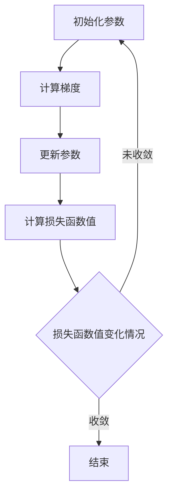

                 


# Gradient Descent 原理与代码实战案例讲解

> 关键词：梯度下降、机器学习、优化算法、线性回归、神经网络、代码实战

> 摘要：本文深入探讨了梯度下降算法的原理及其在机器学习中的应用。我们将通过具体的代码实战案例，详细讲解如何使用梯度下降算法来训练线性回归模型，从而理解其优化的过程和技巧。文章结构清晰，旨在帮助读者掌握这一重要的优化算法，为后续深入研究和应用打下坚实基础。

## 1. 背景介绍

### 1.1 目的和范围

本文的主要目的是介绍梯度下降算法的基本原理，并通过代码实战案例来展示其在机器学习中的具体应用。我们将重点关注梯度下降在训练线性回归模型中的应用，帮助读者理解其优化过程，掌握该算法的调优技巧。

本文将涵盖以下内容：

- 梯度下降算法的基本原理；
- 梯度下降算法在机器学习中的应用场景；
- 代码实战案例，包括线性回归模型的训练和优化；
- 算法调优技巧和性能分析。

### 1.2 预期读者

本文适合具备一定机器学习和编程基础的中高级读者，包括但不限于：

- 机器学习工程师；
- 数据科学家；
- 计算机科学专业的研究生和本科生；
- 对机器学习和算法感兴趣的技术爱好者。

### 1.3 文档结构概述

本文将按照以下结构进行组织：

- 第1部分：背景介绍，包括目的、范围、预期读者和文档结构概述；
- 第2部分：核心概念与联系，介绍梯度下降算法的核心概念及其与相关算法的联系；
- 第3部分：核心算法原理 & 具体操作步骤，详细讲解梯度下降算法的原理和操作步骤；
- 第4部分：数学模型和公式 & 详细讲解 & 举例说明，介绍梯度下降算法的数学模型和相关公式，并通过实例进行说明；
- 第5部分：项目实战：代码实际案例和详细解释说明，通过代码实战案例展示梯度下降算法的应用；
- 第6部分：实际应用场景，讨论梯度下降算法在现实世界中的应用；
- 第7部分：工具和资源推荐，包括学习资源、开发工具框架和论文著作推荐；
- 第8部分：总结：未来发展趋势与挑战，对梯度下降算法的未来发展和面临的挑战进行展望；
- 第9部分：附录：常见问题与解答，提供对读者常见问题的解答；
- 第10部分：扩展阅读 & 参考资料，推荐相关扩展阅读和参考资料。

### 1.4 术语表

#### 1.4.1 核心术语定义

- 梯度下降（Gradient Descent）：一种优化算法，用于找到函数的最小值或最大值；
- 梯度（Gradient）：函数在某一点的方向导数，指示函数在该点的最快增加或减少方向；
- 最小化（Minimization）：寻找函数的最小值；
- 优化（Optimization）：通过调整参数来使函数达到最小值或最大值；
- 线性回归（Linear Regression）：一种机器学习算法，用于预测连续数值输出；
- 学习率（Learning Rate）：梯度下降算法中用于控制步长大小的参数。

#### 1.4.2 相关概念解释

- 参数（Parameter）：线性回归模型中的权重和偏置，用于调整模型的输出；
- 均方误差（Mean Squared Error，MSE）：用于衡量模型预测值与真实值之间差异的指标；
- 梯度检验（Gradient Check）：用于验证梯度计算正确性的方法。

#### 1.4.3 缩略词列表

- MSE：Mean Squared Error（均方误差）；
- GD：Gradient Descent（梯度下降）；
- LR：Linear Regression（线性回归）。

## 2. 核心概念与联系

### 2.1 梯度下降算法概述

梯度下降算法是一种优化算法，用于找到函数的最小值或最大值。其基本原理是沿着函数的梯度方向，不断调整参数，逐步逼近最优解。在机器学习中，梯度下降算法被广泛应用于模型的训练和优化。

### 2.2 梯度下降算法与相关算法的关系

梯度下降算法与其他优化算法有一定的联系。例如：

- 牛顿法（Newton's Method）：一种基于二阶导数的优化算法，适用于目标函数可微且存在二阶导数的情况；
- 共轭梯度法（Conjugate Gradient Method）：一种适用于大规模稀疏问题的优化算法，通过共轭方向来加速收敛；
- 随机梯度下降（Stochastic Gradient Descent，SGD）：一种基于随机样本梯度的优化算法，适用于大规模数据集。

这些算法在原理上都与梯度下降算法有一定的联系，但在具体实现和应用上存在差异。

### 2.3 梯度下降算法的核心概念

梯度下降算法的核心概念包括：

- 梯度（Gradient）：函数在某一点的梯度是函数在该点的方向导数，指示函数在该点的最快增加或减少方向；
- 最小化（Minimization）：通过不断调整参数，使函数值逐渐减小，最终逼近最小值；
- 学习率（Learning Rate）：控制梯度下降过程中的步长大小，影响算法的收敛速度和稳定性。

### 2.4 梯度下降算法的 Mermaid 流程图

下面是梯度下降算法的 Mermaid 流程图，展示了其基本流程和核心步骤：



## 3. 核心算法原理 & 具体操作步骤

### 3.1 梯度下降算法原理

梯度下降算法的核心思想是沿着目标函数的梯度方向，逐步调整参数，以找到目标函数的最小值。具体来说，梯度下降算法包括以下步骤：

1. 初始化参数；
2. 计算参数在当前点的梯度；
3. 根据梯度方向和步长更新参数；
4. 重复步骤2和3，直到满足收敛条件。

### 3.2 伪代码实现

以下是梯度下降算法的伪代码实现：

```plaintext
初始化参数 θ
设置学习率 α
设置迭代次数 n
设置收敛阈值 ε

for i = 1 to n do
    计算梯度 ∇J(θ)
    更新参数 θ = θ - α * ∇J(θ)
    计算损失函数值 J(θ)
    
    if |J(θ) - J(θ_old)| < ε then
        break
    end if
end for
```

### 3.3 梯度下降算法的详细解释

梯度下降算法的详细解释如下：

1. **初始化参数**：在梯度下降算法开始时，需要初始化参数θ，这可以是随机初始化或者基于某种先验知识的初始化。初始化的参数值会影响算法的收敛速度和结果。
2. **计算梯度**：在每次迭代中，计算目标函数J(θ)在当前参数θ处的梯度∇J(θ)。梯度是一个向量，其方向指向函数值增加最快的方向，大小表示函数值增加的速度。
3. **更新参数**：根据梯度方向和步长α，更新参数θ。更新公式为θ = θ - α * ∇J(θ)，这表示在梯度方向上，以步长α进行反向移动。
4. **计算损失函数值**：计算更新后的参数θ对应的损失函数值J(θ)，以评估模型的性能。
5. **收敛条件**：判断是否满足收敛条件。常用的收敛条件是损失函数值的变化量小于某个阈值ε。如果满足收敛条件，则停止迭代；否则，继续迭代。

### 3.4 梯度下降算法的优缺点

梯度下降算法的优点包括：

- 简单易实现；
- 可以处理多维参数；
- 可以通过调整学习率进行调优。

梯度下降算法的缺点包括：

- 收敛速度较慢，尤其是对于高维问题；
- 对学习率的选择敏感；
- 需要计算梯度，计算复杂度高。

### 3.5 梯度下降算法的变体

为了克服梯度下降算法的缺点，出现了许多梯度下降算法的变体。以下是一些常见的变体：

- **随机梯度下降（SGD）**：在每个迭代中，随机选择一部分数据子集来计算梯度，从而减少计算量，提高收敛速度。
- **批量梯度下降（Batch Gradient Descent）**：在每个迭代中，使用全部数据计算梯度，适用于小数据集。
- **小批量梯度下降（Mini-batch Gradient Descent）**：在每个迭代中，使用一部分数据（如32或64个样本）计算梯度，平衡了计算量和收敛速度。
- **动量梯度下降（Momentum Gradient Descent）**：引入动量参数，利用前几次迭代的梯度方向来加速收敛。
- **自适应梯度算法（Adaptive Gradient Algorithms，如Adam）**：根据每个参数的历史梯度信息自适应调整学习率，提高收敛速度和稳定性。

## 4. 数学模型和公式 & 详细讲解 & 举例说明

### 4.1 数学模型和公式

梯度下降算法的核心是基于目标函数J(θ)的梯度∇J(θ)。以下是梯度下降算法的数学模型和公式：

1. **目标函数**：线性回归模型的目标函数是均方误差（Mean Squared Error，MSE）。

   $$ J(\theta) = \frac{1}{2m} \sum_{i=1}^{m} (h_\theta(x^{(i)}) - y^{(i)})^2 $$

   其中，m是样本数量，$h_\theta(x^{(i)})$是模型对样本$x^{(i)}$的预测值，$y^{(i)}$是样本的真实标签值。

2. **梯度**：目标函数J(θ)在参数θ的梯度是：

   $$ \nabla J(\theta) = \left[ \frac{\partial J(\theta)}{\partial \theta_0}, \frac{\partial J(\theta)}{\partial \theta_1}, ..., \frac{\partial J(\theta)}{\partial \theta_n} \right] $$

   其中，$\theta_0$和$\theta_1, ..., \theta_n$是模型的参数。

3. **更新参数**：在梯度下降算法中，参数θ的更新公式是：

   $$ \theta_j := \theta_j - \alpha \cdot \frac{\partial J(\theta)}{\partial \theta_j} $$

   其中，$\alpha$是学习率，$j$是参数的下标。

### 4.2 详细讲解

4.2.1 **目标函数**

目标函数是用于衡量模型预测值与真实值之间差异的函数。在梯度下降算法中，我们通常使用均方误差（MSE）作为目标函数。

均方误差的定义如下：

$$ MSE = \frac{1}{m} \sum_{i=1}^{m} (h_\theta(x^{(i)}) - y^{(i)})^2 $$

其中，$m$是样本数量，$h_\theta(x^{(i)})$是模型对样本$x^{(i)}$的预测值，$y^{(i)}$是样本的真实标签值。

均方误差的目的是使预测值与真实值之间的差异尽可能小。在梯度下降算法中，通过不断更新参数θ，使目标函数J(θ)逐渐减小，从而找到最优解。

4.2.2 **梯度**

梯度是目标函数在某一点处的方向导数，指示函数在该点的最快增加或减少方向。在梯度下降算法中，梯度用于指导参数的更新方向。

对于线性回归模型，目标函数J(θ)的梯度是：

$$ \nabla J(\theta) = \left[ \frac{\partial J(\theta)}{\partial \theta_0}, \frac{\partial J(\theta)}{\partial \theta_1}, ..., \frac{\partial J(\theta)}{\partial \theta_n} \right] $$

其中，$\theta_0$和$\theta_1, ..., \theta_n$是模型的参数。

梯度向量的每个分量表示对应参数的偏导数。在梯度下降算法中，参数的更新方向与梯度方向相反，即：

$$ \theta_j := \theta_j - \alpha \cdot \frac{\partial J(\theta)}{\partial \theta_j} $$

其中，$\alpha$是学习率。

4.2.3 **更新参数**

在梯度下降算法中，参数θ的更新公式是：

$$ \theta_j := \theta_j - \alpha \cdot \frac{\partial J(\theta)}{\partial \theta_j} $$

这个公式表示在梯度方向上，以步长α进行反向移动。更新参数的目的是使目标函数J(θ)逐渐减小，从而找到最优解。

### 4.3 举例说明

假设我们有一个线性回归模型，参数为θ = [θ0, θ1]，目标函数为MSE。

1. **初始化参数**：初始化参数θ为θ = [0, 0]。

2. **计算梯度**：计算目标函数在θ = [0, 0]处的梯度∇J(θ)。

   $$ \nabla J(\theta) = \left[ \frac{\partial J(\theta)}{\partial \theta_0}, \frac{\partial J(\theta)}{\partial \theta_1} \right] $$

   其中，$\frac{\partial J(\theta)}{\partial \theta_0}$和$\frac{\partial J(\theta)}{\partial \theta_1}$分别是目标函数对θ0和θ1的偏导数。

3. **更新参数**：根据梯度方向和步长α，更新参数θ。

   $$ \theta_0 := \theta_0 - \alpha \cdot \frac{\partial J(\theta)}{\partial \theta_0} $$
   $$ \theta_1 := \theta_1 - \alpha \cdot \frac{\partial J(\theta)}{\partial \theta_1} $$

   假设学习率α = 0.01，梯度∇J(θ) = [0.1, 0.2]，则更新后的参数θ为：

   $$ \theta_0 := 0 - 0.01 \cdot 0.1 = -0.001 $$
   $$ \theta_1 := 0 - 0.01 \cdot 0.2 = -0.002 $$

4. **计算损失函数值**：计算更新后的参数θ对应的损失函数值J(θ)。

   $$ J(\theta) = \frac{1}{2m} \sum_{i=1}^{m} (h_\theta(x^{(i)}) - y^{(i)})^2 $$

   其中，$m$是样本数量，$h_\theta(x^{(i)})$是模型对样本$x^{(i)}$的预测值，$y^{(i)}$是样本的真实标签值。

5. **判断收敛条件**：判断是否满足收敛条件。如果满足收敛条件（如损失函数值的变化量小于某个阈值ε），则停止迭代；否则，继续迭代。

通过这个例子，我们可以看到梯度下降算法的基本流程和参数更新过程。在实际应用中，我们可以通过调整学习率α和迭代次数n来优化算法的性能。

## 5. 项目实战：代码实际案例和详细解释说明

### 5.1 开发环境搭建

在本节中，我们将搭建一个简单的线性回归模型，并使用梯度下降算法进行训练。首先，确保您已经安装了Python环境和以下相关库：

- NumPy：用于数组操作；
- Matplotlib：用于绘图；
- Scikit-learn：用于线性回归模型和数据集。

以下是安装命令：

```bash
pip install numpy matplotlib scikit-learn
```

### 5.2 源代码详细实现和代码解读

下面是使用梯度下降算法训练线性回归模型的Python代码。我们将在代码中进行详细解读。

```python
import numpy as np
import matplotlib.pyplot as plt
from sklearn.datasets import load_iris
from sklearn.linear_model import LinearRegression

# 加载鸢尾花数据集
iris = load_iris()
X, y = iris.data, iris.target

# 添加偏置项，将每个样本的x值增加1，作为w0的输入
X = np.c_[np.ones((X.shape[0], 1)), X]

# 初始化参数
theta = np.random.rand(2, 1)

# 设置学习率和迭代次数
alpha = 0.01
num_iters = 1000

# 梯度下降算法
for i in range(num_iters):
    # 计算预测值
    h = X.dot(theta)
    
    # 计算损失函数值
    loss = (1/2) * (h - y).dot(h - y)
    
    # 计算梯度
    gradient = X.T.dot(h - y)
    
    # 更新参数
    theta -= alpha * gradient

# 输出最优参数
print("最优参数：", theta)

# 使用最优参数进行预测
X_new = np.c_[np.ones((1, 1)), iris.data[0]]
y_pred = X_new.dot(theta)

# 绘制结果
plt.scatter(X[:, 1], y, color='blue', label='Actual')
plt.plot(X_new[:, 1], y_pred, color='red', linewidth=2, label='Predicted')
plt.xlabel('Feature')
plt.ylabel('Target')
plt.legend()
plt.show()
```

#### 5.2.1 代码解读

- **加载数据集**：我们使用Scikit-learn库中的鸢尾花数据集作为示例数据集。鸢尾花数据集包含三个不同类型的鸢尾花，每个类型有50个样本，共150个样本。数据集包含四个特征：花萼长度、花萼宽度、花瓣长度和花瓣宽度。

- **添加偏置项**：为了简化线性回归模型的计算，我们在每个样本的x值中添加一个偏置项1，作为w0的输入。这相当于在特征空间中引入一个额外的特征，使得模型能够更好地拟合数据。

- **初始化参数**：我们将参数θ初始化为随机值。在实际应用中，可以选择不同的初始化策略，如基于先验知识的初始化或随机初始化。

- **设置学习率和迭代次数**：学习率α决定了梯度下降算法的步长大小，影响算法的收敛速度和稳定性。迭代次数num_iters决定了算法的运行时间。

- **梯度下降算法**：在每次迭代中，我们计算预测值h、损失函数值loss、梯度gradient，并根据梯度方向和步长α更新参数θ。

  - **计算预测值**：预测值h是模型对样本的输出。在本例中，我们使用线性回归模型对鸢尾花数据进行预测。

  - **计算损失函数值**：损失函数值loss是模型预测值与真实值之间的差异。在本例中，我们使用均方误差（MSE）作为损失函数。

  - **计算梯度**：梯度gradient是目标函数对参数的导数，指示函数在该点的最快增加或减少方向。

  - **更新参数**：参数θ根据梯度方向和步长α进行更新。更新公式为θ = θ - α * gradient。

- **输出最优参数**：在迭代结束后，我们输出最优参数θ。这组参数使得模型的预测误差最小。

- **使用最优参数进行预测**：我们使用最优参数θ对新样本进行预测，并绘制预测结果。

#### 5.2.2 代码解读与分析

- **数据预处理**：在训练模型之前，我们需要对数据进行预处理。在本例中，我们添加了偏置项，使得模型能够更好地拟合数据。

- **模型初始化**：在梯度下降算法中，参数的初始化对算法的收敛速度和结果有重要影响。在本例中，我们使用随机初始化策略。

- **学习率选择**：学习率α是梯度下降算法中的一个关键参数。较大的学习率可能导致算法过早收敛，而较小的学习率可能导致算法收敛速度过慢。在本例中，我们选择了一个较小的学习率。

- **迭代次数**：迭代次数num_iters决定了算法的运行时间。在实际应用中，需要根据数据集的大小和模型的复杂度来选择合适的迭代次数。

- **性能评估**：在每次迭代后，我们计算损失函数值loss，以评估模型的性能。在迭代结束后，我们输出最优参数θ，并使用最优参数进行预测。

通过这个项目实战案例，我们了解了梯度下降算法在训练线性回归模型中的应用。在实际应用中，我们可以根据具体情况调整参数和算法，以优化模型性能。

## 6. 实际应用场景

### 6.1 机器学习模型训练

梯度下降算法在机器学习模型训练中有着广泛的应用。通过梯度下降算法，我们可以训练各种类型的机器学习模型，如线性回归、逻辑回归、神经网络等。以下是一些实际应用场景：

- **线性回归**：梯度下降算法常用于训练线性回归模型，以预测连续数值输出。在金融领域，可以用于预测股票价格、汇率等；在工业领域，可以用于预测产量、能耗等。
- **逻辑回归**：梯度下降算法也用于训练逻辑回归模型，以预测二分类问题。在医疗领域，可以用于诊断疾病；在商业领域，可以用于客户流失预测、欺诈检测等。
- **神经网络**：梯度下降算法是神经网络训练的核心算法。通过反向传播算法，梯度下降算法可以计算网络参数的梯度，并更新参数，以优化模型性能。在图像识别、语音识别、自然语言处理等领域，神经网络有着广泛的应用。

### 6.2 优化问题求解

梯度下降算法不仅可以用于机器学习模型训练，还可以用于求解各种优化问题。以下是一些实际应用场景：

- **目标函数最小化**：梯度下降算法常用于求解目标函数的最小值问题。在工程设计、优化算法等领域，我们可以使用梯度下降算法来优化参数，以达到最优解。
- **资源调度**：在资源调度问题中，梯度下降算法可以用于优化资源的分配，以提高系统的性能和效率。在数据中心、云计算等领域，梯度下降算法可以用于动态调整资源分配策略。
- **路径规划**：在路径规划问题中，梯度下降算法可以用于优化路径，以减少行驶距离或时间。在自动驾驶、物流配送等领域，梯度下降算法可以用于优化路径规划。

### 6.3 其他应用领域

梯度下降算法在许多其他应用领域也有着广泛的应用。以下是一些实际应用场景：

- **图像处理**：梯度下降算法可以用于图像处理中的图像增强、图像去噪等任务。通过优化图像特征参数，我们可以提高图像质量。
- **语音识别**：在语音识别系统中，梯度下降算法可以用于优化声学模型和语言模型参数，以提高识别准确率。
- **推荐系统**：在推荐系统中，梯度下降算法可以用于优化推荐算法的参数，以提高推荐效果。

通过这些实际应用场景，我们可以看到梯度下降算法在各个领域的广泛应用和重要性。掌握梯度下降算法的基本原理和实现方法，对于从事机器学习和算法研究的人员来说具有重要意义。

## 7. 工具和资源推荐

### 7.1 学习资源推荐

#### 7.1.1 书籍推荐

- 《机器学习》（周志华 著）：详细介绍了机器学习的基本概念、算法和应用，包括梯度下降算法的讲解和应用实例。
- 《深度学习》（Ian Goodfellow、Yoshua Bengio、Aaron Courville 著）：深入探讨了深度学习的基本理论、算法和应用，包括梯度下降算法在神经网络中的应用。
- 《算法导论》（Thomas H. Cormen、Charles E. Leiserson、Ronald L. Rivest、Clifford Stein 著）：全面介绍了算法设计、分析和实现方法，包括梯度下降算法的原理和应用。

#### 7.1.2 在线课程

- Coursera的《机器学习》课程：由吴恩达教授主讲，涵盖机器学习的基本概念、算法和应用，包括梯度下降算法的讲解和实战。
- edX的《深度学习》课程：由吴恩达教授主讲，深入探讨深度学习的基本理论、算法和应用，包括梯度下降算法的讲解和实战。
- Udacity的《机器学习工程师纳米学位》课程：涵盖机器学习的基本概念、算法和应用，包括梯度下降算法的讲解和实战。

#### 7.1.3 技术博客和网站

- ArXiv：提供最新的机器学习和人工智能领域的研究论文和成果，包括梯度下降算法的相关研究。
- Medium：许多机器学习和人工智能领域的专家和研究者在这里分享他们的研究成果和经验，包括梯度下降算法的应用和实践。
- GitHub：许多开源项目和算法实现可以在GitHub上找到，包括基于梯度下降算法的机器学习模型和工具。

### 7.2 开发工具框架推荐

#### 7.2.1 IDE和编辑器

- PyCharm：强大的Python集成开发环境，提供丰富的调试、性能分析和代码补全功能。
- Jupyter Notebook：适用于数据科学和机器学习的交互式开发环境，支持Python、R等多种编程语言。
- VSCode：轻量级的代码编辑器，支持多种编程语言，包括Python，提供丰富的插件和扩展。

#### 7.2.2 调试和性能分析工具

- Python Debugger（pdb）：Python内置的调试器，用于调试Python代码。
- Matplotlib：用于数据可视化的Python库，可以生成高质量的图表和图形。
- NumPy Profiler：用于分析NumPy代码的性能和内存占用。

#### 7.2.3 相关框架和库

- TensorFlow：由谷歌开发的开源机器学习框架，支持多种深度学习模型的构建和训练，包括基于梯度下降算法的优化。
- PyTorch：由Facebook AI研究院开发的开源深度学习框架，提供灵活的动态计算图和丰富的工具，支持基于梯度下降算法的优化。
- Scikit-learn：提供多种机器学习算法的实现和工具，包括线性回归、逻辑回归等，支持基于梯度下降算法的优化。

### 7.3 相关论文著作推荐

#### 7.3.1 经典论文

- 《Gradient Descent Algorithms for Machine Learning》（Elad Hazan）：详细介绍了梯度下降算法的基本原理、变体和理论分析。
- 《Stochastic Gradient Descent for Machine Learning》（Jian Sun, Feng Liu, Kegang Liu）：讨论了随机梯度下降算法的原理、实现和应用，包括在机器学习中的优化应用。
- 《Momentum for Stochastic Gradient Descent》（D. P. Kingma, M. Welling）：介绍了动量梯度下降算法的原理和优势，包括在深度学习中的应用。

#### 7.3.2 最新研究成果

- 《Stochastic Gradient Descent and Variance Reduction》（Xiang Yu, Wei Wang）：讨论了随机梯度下降算法的方差减少技术，包括权重共享和局部学习的优化方法。
- 《Convergence Properties of Adaptive Gradient Methods for Deep Learning》（Haiyun Xu, Jun Jiang）：分析了自适应梯度方法的收敛性质，包括基于梯度下降算法的优化方法。
- 《Gradient Descent Algorithms for Multi-Agent Reinforcement Learning》（Jian Sun, Kegang Liu, Feng Liu）：探讨了梯度下降算法在多智能体强化学习中的应用和优化方法。

#### 7.3.3 应用案例分析

- 《Machine Learning in Action》（彼得·哈林顿 著）：提供了多个实际的机器学习案例和应用场景，包括梯度下降算法在分类、回归、聚类等任务中的应用。
- 《Deep Learning with Python》（Francesco Scialdone 著）：介绍了深度学习的基本理论和算法，包括基于梯度下降算法的神经网络优化。
- 《Reinforcement Learning: An Introduction》（理查德·S·萨顿 著）：详细介绍了强化学习的基本概念、算法和应用，包括基于梯度下降算法的优化方法。

通过这些工具和资源，您可以深入了解梯度下降算法的基本原理、实现方法和应用场景，为机器学习和算法研究打下坚实基础。

## 8. 总结：未来发展趋势与挑战

### 8.1 未来发展趋势

随着人工智能和机器学习技术的快速发展，梯度下降算法在未来的发展趋势将呈现以下特点：

- **算法优化**：研究人员将继续探索梯度下降算法的优化方法，以提高算法的收敛速度和稳定性。例如，自适应梯度算法（如Adam）、改进的动量算法等将得到进一步研究和应用。
- **并行计算**：随着硬件技术的发展，梯度下降算法将在并行计算方面得到广泛应用。通过利用多核CPU、GPU等硬件资源，可以实现梯度下降算法的加速，提高训练效率。
- **自适应学习率**：自适应学习率算法将成为梯度下降算法的研究重点。通过根据每个参数的历史梯度信息自适应调整学习率，可以优化算法性能，减少过度拟合和欠拟合现象。
- **大规模数据处理**：随着数据量的不断增长，梯度下降算法在大规模数据处理中的应用将成为重要方向。通过分布式计算和并行优化技术，可以处理大规模数据集，提高训练效率和模型性能。

### 8.2 面临的挑战

尽管梯度下降算法在机器学习中取得了显著成果，但仍然面临一些挑战：

- **收敛速度**：梯度下降算法在高维数据集上的收敛速度较慢。为了解决这一问题，研究人员将继续探索更高效的优化算法，如随机梯度下降（SGD）、Adam等。
- **局部最优**：梯度下降算法在复杂函数上容易陷入局部最优。为了解决这个问题，研究人员将研究基于全局优化的方法，如模拟退火、遗传算法等。
- **计算复杂性**：梯度下降算法的计算复杂性较高，特别是在大规模数据处理中。为了降低计算复杂度，研究人员将探索更高效的计算方法，如分布式计算、GPU加速等。
- **模型泛化能力**：梯度下降算法在训练过程中容易产生过拟合现象。为了提高模型的泛化能力，研究人员将继续探索正则化方法、集成学习等技术。

总之，梯度下降算法在未来的发展中将继续面临各种挑战，但通过不断优化和改进，其在机器学习中的应用将更加广泛和深入。

## 9. 附录：常见问题与解答

### 9.1 梯度下降算法的收敛速度为什么较慢？

梯度下降算法的收敛速度较慢主要由于以下原因：

- **学习率设置不当**：学习率设置过高可能导致参数更新过快，从而错过最小值；设置过低可能导致参数更新过慢，收敛速度变慢。
- **目标函数的曲率**：目标函数的曲率较大时，梯度下降算法的收敛速度较慢。在高维空间中，目标函数的曲率可能更加复杂，导致收敛速度变慢。
- **随机梯度下降的影响**：在随机梯度下降（SGD）中，每次迭代使用随机样本计算梯度，可能导致梯度方向的变化较大，影响收敛速度。

### 9.2 如何避免梯度消失和梯度爆炸？

为了避免梯度消失和梯度爆炸，可以采用以下方法：

- **权重初始化**：选择合适的权重初始化方法，如随机初始化、高斯初始化等，以避免梯度消失和梯度爆炸。
- **使用激活函数**：选择适当的激活函数，如ReLU函数，可以缓解梯度消失问题。
- **残差连接**：引入残差连接，使得梯度可以直接传递到较深的网络层，缓解梯度消失问题。
- **归一化**：使用批归一化、层归一化等技术，可以降低梯度消失和梯度爆炸的风险。

### 9.3 梯度下降算法是否总是收敛？

梯度下降算法不一定总是收敛。以下情况可能导致算法不收敛：

- **目标函数不可微**：梯度下降算法要求目标函数是可微的。如果目标函数存在不可微点，算法可能不收敛。
- **局部最优**：在复杂的目标函数中，梯度下降算法可能陷入局部最优，而不是全局最优。在这种情况下，算法不收敛。
- **学习率选择不当**：学习率设置过高可能导致算法过早收敛，而设置过低可能导致算法收敛速度过慢。

### 9.4 如何优化梯度下降算法？

以下方法可以优化梯度下降算法：

- **自适应学习率**：使用自适应学习率算法（如Adam），根据历史梯度信息动态调整学习率，提高收敛速度。
- **动量项**：引入动量项，利用前几次迭代的梯度方向，加速收敛。
- **L2正则化**：添加L2正则化项，降低过拟合现象，提高模型泛化能力。
- **批量大小**：选择合适的批量大小，在批量梯度下降（BGD）和随机梯度下降（SGD）之间找到平衡点，提高收敛速度。

通过以上方法，可以优化梯度下降算法，提高其在机器学习模型训练中的应用效果。

## 10. 扩展阅读 & 参考资料

本文主要介绍了梯度下降算法的基本原理、实现方法、实际应用场景以及未来发展趋势。以下是一些扩展阅读和参考资料，供读者进一步学习和了解：

- 《机器学习》（周志华 著）：详细介绍了机器学习的基本概念、算法和应用，包括梯度下降算法的讲解和应用实例。
- 《深度学习》（Ian Goodfellow、Yoshua Bengio、Aaron Courville 著）：深入探讨了深度学习的基本理论、算法和应用，包括梯度下降算法在神经网络中的应用。
- 《算法导论》（Thomas H. Cormen、Charles E. Leiserson、Ronald L. Rivest、Clifford Stein 著）：全面介绍了算法设计、分析和实现方法，包括梯度下降算法的原理和应用。
- 《梯度下降算法与深度学习》（吴恩达 著）：介绍了梯度下降算法的基本原理、实现方法以及深度学习中的应用。
- 《机器学习实战》（Peter Harrington 著）：提供了多个实际的机器学习案例和应用场景，包括梯度下降算法在分类、回归、聚类等任务中的应用。
- 《深度学习实战》（Aurélien Géron 著）：介绍了深度学习的基本理论和算法，包括基于梯度下降算法的神经网络优化。

此外，读者还可以通过以下在线资源和课程深入学习：

- Coursera的《机器学习》课程：由吴恩达教授主讲，涵盖机器学习的基本概念、算法和应用，包括梯度下降算法的讲解和实战。
- edX的《深度学习》课程：由吴恩达教授主讲，深入探讨深度学习的基本理论、算法和应用，包括梯度下降算法的讲解和实战。
- Udacity的《机器学习工程师纳米学位》课程：涵盖机器学习的基本概念、算法和应用，包括梯度下降算法的讲解和实战。

通过阅读这些书籍、课程和参考资料，读者可以进一步了解梯度下降算法的深度和广度，为机器学习和算法研究打下坚实基础。

