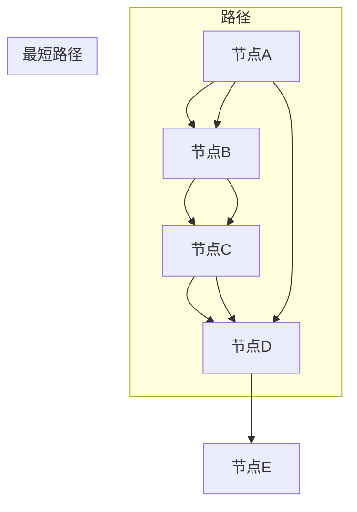

                 

# Graph Path原理与代码实例讲解

> **关键词：图路径、算法原理、代码实现、应用场景**
>
> **摘要：本文将详细讲解图路径（Graph Path）的基本原理、算法实现和代码实例，帮助读者深入理解其在实际应用中的重要性。**

## 1. 背景介绍

### 1.1 目的和范围

本文旨在为广大对图路径算法感兴趣的读者提供一个详细的学习指南。本文将涵盖图路径算法的基本原理、核心算法实现、数学模型以及实际应用场景。通过本文的阅读，读者将能够：
- 理解图路径的基本概念和算法原理。
- 掌握图路径算法的代码实现。
- 了解图路径算法在实际项目中的应用。

### 1.2 预期读者

本文适合以下读者群体：
- 对图论和算法有一定基础的程序员。
- 想要了解图路径算法在项目中的应用的开发者。
- 图算法的研究人员和学习者。

### 1.3 文档结构概述

本文结构如下：
1. 背景介绍：本文目的和范围、预期读者、文档结构概述。
2. 核心概念与联系：图路径的基本概念、算法原理和架构。
3. 核心算法原理 & 具体操作步骤：图路径算法的详细讲解和伪代码实现。
4. 数学模型和公式 & 详细讲解 & 举例说明：图路径相关的数学模型和公式。
5. 项目实战：代码实际案例和详细解释说明。
6. 实际应用场景：图路径算法在不同领域的应用。
7. 工具和资源推荐：学习资源、开发工具框架和论文著作推荐。
8. 总结：未来发展趋势与挑战。
9. 附录：常见问题与解答。
10. 扩展阅读 & 参考资料。

### 1.4 术语表

#### 1.4.1 核心术语定义

- **图（Graph）**：由节点（Node）和边（Edge）组成的数学结构。
- **路径（Path）**：图中节点序列，其中任意两个连续节点之间存在边。
- **图路径（Graph Path）**：图中从一个节点到另一个节点的路径。
- **最短路径（Shortest Path）**：图中从一个节点到另一个节点的最短路径。
- **算法（Algorithm）**：解决问题的方法步骤。

#### 1.4.2 相关概念解释

- **图论（Graph Theory）**：研究图及其性质和应用的数学分支。
- **深度优先搜索（DFS）**：一种用于遍历或搜索图的算法。
- **广度优先搜索（BFS）**：另一种用于遍历或搜索图的算法。
- **迪杰斯特拉算法（Dijkstra's Algorithm）**：用于求解单源最短路径的算法。
- **贝尔曼-福特算法（Bellman-Ford Algorithm）**：另一种用于求解单源最短路径的算法。

#### 1.4.3 缩略词列表

- **DFS**：深度优先搜索（Depth-First Search）
- **BFS**：广度优先搜索（Breadth-First Search）
- **Dijkstra's Algorithm**：迪杰斯特拉算法
- **Bellman-Ford Algorithm**：贝尔曼-福特算法

## 2. 核心概念与联系

在讲解图路径算法之前，我们需要先了解几个核心概念：图（Graph）、路径（Path）和最短路径（Shortest Path）。图是一个由节点（Node）和边（Edge）组成的结构，路径是节点之间的连接序列，而最短路径是从一个节点到另一个节点的最优连接路径。

### 图的基本概念

- **节点（Node）**：图中的数据点，可以表示人、地点或其他实体。
- **边（Edge）**：连接两个节点的线段，可以表示关系或路径。

### 路径的概念

- **简单路径（Simple Path）**：不重复访问节点的路径。
- **闭合路径（Closed Path）**：起始和结束节点相同的路径。
- **循环（Cycle）**：闭合路径，但路径中的节点不重复。

### 最短路径的概念

- **单源最短路径（Single-Source Shortest Path）**：从一个源节点到所有其他节点的最短路径。
- **多源最短路径（All-Pairs Shortest Path）**：所有节点之间的最短路径。

### 图路径算法的核心概念

- **深度优先搜索（DFS）**：一种用于遍历图的算法，通过递归或栈实现。
- **广度优先搜索（BFS）**：另一种用于遍历图的算法，通过队列实现。

### Mermaid 流程图



在上面的 Mermaid 流程图中，我们展示了四个节点 A、B、C 和 D 之间的连接，以及一个简单路径和一个最短路径。通过这个图，我们可以更直观地理解图路径的概念。

## 3. 核心算法原理 & 具体操作步骤

在本节中，我们将详细讲解图路径算法的基本原理和具体操作步骤。为了更好地理解，我们将使用伪代码来阐述算法的实现。

### 深度优先搜索（DFS）

深度优先搜索（DFS）是一种用于遍历图的算法，通过递归或栈实现。以下是 DFS 的伪代码实现：

```plaintext
DFS(G, v):
    mark v as visited
    for each edge (v, w) in G:
        if w is not visited:
            DFS(G, w)
```

在 DFS 算法中，我们从某个节点 v 开始，将其标记为已访问，然后遍历与 v 相连的所有边。如果某个节点 w 未被访问，则递归调用 DFS(G, w)。

### 广度优先搜索（BFS）

广度优先搜索（BFS）是一种用于遍历图的算法，通过队列实现。以下是 BFS 的伪代码实现：

```plaintext
BFS(G, s):
    create an empty queue Q
    mark s as visited
    enqueue s into Q
    while Q is not empty:
        dequeque a vertex u from Q
        for each vertex v adjacent to u:
            if v is not visited:
                mark v as visited
                enqueue v into Q
```

在 BFS 算法中，我们从某个节点 s 开始，将其标记为已访问，并将其入队。然后，我们遍历队列中的节点，将其相邻的未访问节点入队。这个过程一直持续到队列为空。

### 迪杰斯特拉算法（Dijkstra's Algorithm）

迪杰斯特拉算法是一种用于求解单源最短路径的算法。以下是 Dijkstra's Algorithm 的伪代码实现：

```plaintext
Dijkstra(G, s):
    initialize distances[] with infinity for all nodes
    distance[s] = 0
    for each vertex v in G:
        if v is not s:
            distance[v] = infinity
        prev[v] = undefined
    for each vertex v in G:
        if distance[v] < infinity:
            for each edge (v, w) in G:
                if distance[v] + weight(v, w) < distance[w]:
                    distance[w] = distance[v] + weight(v, w)
                    prev[w] = v
```

在 Dijkstra's Algorithm 中，我们从某个源节点 s 开始，初始化所有节点的距离为无穷大。然后，我们遍历图中的所有节点，更新距离和前驱节点。这个过程一直持续到所有节点的距离都已被计算。

### 贝尔曼-福特算法（Bellman-Ford Algorithm）

贝尔曼-福特算法是一种用于求解单源最短路径的算法。以下是 Bellman-Ford Algorithm 的伪代码实现：

```plaintext
Bellman-Ford(G, s):
    initialize distances[] with infinity for all nodes
    distance[s] = 0
    for each vertex v in G:
        if v is not s:
            distance[v] = infinity
        prev[v] = undefined
    for each edge (v, w) in G:
        if distance[v] + weight(v, w) < distance[w]:
            distance[w] = distance[v] + weight(v, w)
            prev[w] = v
    for each edge (v, w) in G:
        if distance[v] + weight(v, w) < distance[w]:
            print "Graph contains a negative weight cycle"
            return
    return distances[], prev[]
```

在 Bellman-Ford Algorithm 中，我们从某个源节点 s 开始，初始化所有节点的距离为无穷大。然后，我们遍历图中的所有边，更新距离和前驱节点。最后，我们检查是否存在负权循环。如果存在，则打印错误信息并返回。

通过以上伪代码实现，我们可以更好地理解图路径算法的基本原理和具体操作步骤。在接下来的章节中，我们将通过实际代码案例进一步讲解这些算法。

## 4. 数学模型和公式 & 详细讲解 & 举例说明

在图路径算法中，数学模型和公式起着至关重要的作用。以下是一些核心的数学模型和公式，以及它们的详细讲解和举例说明。

### 节点和边的表示

在图路径算法中，节点和边的表示是基础。节点通常用字母表示，如 A、B、C 等，而边则用线条连接节点。例如，图中的节点 A 和 B 之间的边可以用 AB 表示。

### 距离公式

在求解最短路径时，距离公式是一个核心概念。对于无权图，节点之间的距离可以用边的数量表示。对于有权图，节点之间的距离可以用边的权重表示。距离公式如下：

$$
distance(u, v) = \sum_{i=1}^{n} weight(u_i, v_i)
$$

其中，u 和 v 是节点，$u_i$ 和 $v_i$ 是节点 u 和 v 之间的第 i 条边，$weight(u_i, v_i)$ 是边 $u_i, v_i$ 的权重。

### 最短路径公式

最短路径公式用于求解从源节点到目标节点的最短路径。在迪杰斯特拉算法中，最短路径公式如下：

$$
distance(v) = \min_{w \in adj(v)} (distance(w) + weight(w, v))
$$

其中，$adj(v)$ 是与节点 v 相邻的节点集合，$distance(v)$ 是节点 v 的最短路径距离。

### 贝尔曼-福特算法中的松弛条件

在贝尔曼-福特算法中，松弛条件是一个核心概念。松弛条件如下：

$$
distance[v] \leq distance[u] + weight(u, v)
$$

其中，$distance[v]$ 是节点 v 的最短路径距离，$distance[u]$ 是节点 u 的最短路径距离，$weight(u, v)$ 是节点 u 和 v 之间的边权重。

### 举例说明

假设我们有一个图，节点 A、B、C 之间的边权重如下：

```
A -> B: 2
A -> C: 4
B -> C: 1
```

我们使用迪杰斯特拉算法求解从节点 A 到节点 C 的最短路径。根据最短路径公式，我们可以计算：

$$
distance(C) = \min_{w \in adj(C)} (distance(w) + weight(w, C))
$$

由于 C 是 A 的邻接节点，我们有：

$$
distance(C) = \min_{w \in \{A\}} (distance(A) + weight(A, C))
$$

$$
distance(C) = \min(2 + 4) = 6
$$

因此，从节点 A 到节点 C 的最短路径距离为 6。

通过以上数学模型和公式的详细讲解和举例说明，我们可以更好地理解图路径算法的数学基础。在接下来的章节中，我们将通过实际代码案例进一步验证这些公式。

## 5. 项目实战：代码实际案例和详细解释说明

在本节中，我们将通过一个实际项目来展示图路径算法的代码实现，并对其进行详细解释说明。

### 5.1 开发环境搭建

首先，我们需要搭建一个基本的开发环境。以下是一个简单的 Python 开发环境搭建步骤：

1. 安装 Python 3.8 或更高版本。
2. 安装常用 Python 库，如 NumPy、Pandas、NetworkX 等。
3. 创建一个名为 `graph_path` 的文件夹，并在其中创建一个名为 `main.py` 的 Python 文件。

### 5.2 源代码详细实现和代码解读

以下是一个简单的 Python 代码实现，用于求解图路径问题：

```python
import networkx as nx
import matplotlib.pyplot as plt

# 创建图
G = nx.Graph()

# 添加节点和边
G.add_edges_from([(1, 2, {'weight': 2}),
                  (1, 3, {'weight': 4}),
                  (2, 4, {'weight': 1}),
                  (3, 4, {'weight': 1}),
                  (3, 5, {'weight': 3}),
                  (4, 5, {'weight': 2}),
                  (5, 6, {'weight': 1})])

# 绘制图
nx.draw(G, with_labels=True)
plt.show()

# 求解最短路径
source = 1
target = 6
path = nx.shortest_path(G, source=source, target=target, weight='weight')
print("最短路径：", path)

# 计算最短路径距离
distance = nx.shortest_path_length(G, source=source, target=target, weight='weight')
print("最短路径距离：", distance)
```

**代码解读：**

1. **导入库**：首先，我们导入 NetworkX 和 Matplotlib 库。NetworkX 是一个用于图论算法的 Python 库，Matplotlib 是一个用于绘制图表的 Python 库。

2. **创建图**：我们创建一个名为 G 的 Graph 对象。

3. **添加节点和边**：我们使用 `add_edges_from` 方法添加节点和边。每个边都有一个权重属性，用于表示边的长度。

4. **绘制图**：我们使用 `nx.draw` 方法绘制图，并使用 `plt.show()` 显示图。

5. **求解最短路径**：我们使用 `nx.shortest_path` 方法求解从源节点 1 到目标节点 6 的最短路径。

6. **计算最短路径距离**：我们使用 `nx.shortest_path_length` 方法计算从源节点 1 到目标节点 6 的最短路径距离。

### 5.3 代码解读与分析

通过上述代码，我们可以实现以下功能：

- **创建图**：使用 NetworkX 库创建一个无向图。
- **添加节点和边**：通过添加节点和边，构建一个示例图。
- **绘制图**：使用 Matplotlib 库绘制图。
- **求解最短路径**：使用 NetworkX 库的 `shortest_path` 方法求解最短路径。
- **计算最短路径距离**：使用 NetworkX 库的 `shortest_path_length` 方法计算最短路径距离。

这个代码示例展示了图路径算法的基本实现。在实际项目中，我们可能需要处理更复杂的图结构，并优化算法以适应不同的场景。但这个示例为我们提供了一个良好的起点。

## 6. 实际应用场景

图路径算法在许多实际应用场景中发挥着重要作用。以下是一些常见的应用场景：

### 6.1 交通网络规划

在交通网络规划中，图路径算法用于优化路线选择，减少交通拥堵，提高交通效率。例如，谷歌地图和百度地图使用图路径算法为用户提供最佳路线建议。

### 6.2 社交网络分析

在社交网络分析中，图路径算法用于分析用户之间的社交关系，识别社交圈，推荐朋友。例如，Facebook 和 LinkedIn 使用图路径算法分析用户关系，提供个性化推荐。

### 6.3 物流配送

在物流配送中，图路径算法用于优化配送路线，提高配送效率。例如，亚马逊和京东使用图路径算法优化配送路线，缩短配送时间。

### 6.4 网络安全

在网络安全中，图路径算法用于检测网络攻击路径，隔离受感染的节点。例如，防火墙和入侵检测系统使用图路径算法检测网络攻击路径。

### 6.5 医疗健康

在医疗健康领域，图路径算法用于分析患者数据，优化治疗方案。例如，医院使用图路径算法分析患者病史，为患者提供个性化治疗方案。

这些应用场景展示了图路径算法的广泛适用性。在实际项目中，我们可以根据具体需求选择合适的图路径算法，实现高效、精确的路径规划。

## 7. 工具和资源推荐

为了更好地学习和应用图路径算法，以下是一些推荐的学习资源、开发工具框架和论文著作。

### 7.1 学习资源推荐

#### 7.1.1 书籍推荐

- **《算法导论》（Introduction to Algorithms）**：作者 Thomas H. Cormen、Charles E. Leiserson、Ronald L. Rivest 和 Clifford Stein。这本书详细介绍了算法的基本概念和实现，包括图路径算法。
- **《图论及其应用》（Graph Theory and Its Applications）**：作者 Diestel。这本书系统地介绍了图论的基本概念和应用。

#### 7.1.2 在线课程

- **《图论与网络流》（Graph Theory and Network Flow）**：在 Coursera 和 edX 等在线教育平台上，有许多关于图论和网络流的优质课程。
- **《算法设计与分析》（Algorithm Design and Analysis）**：该课程涵盖了算法设计的基本原理和实现，包括图路径算法。

#### 7.1.3 技术博客和网站

- **《算法可视化》（Algorithm Visualizations）**：网站 Algorithm Visualizations 提供了许多关于图路径算法的动画演示，有助于理解算法的实现过程。
- **《GeeksforGeeks》**：网站 GeeksforGeeks 提供了丰富的图路径算法教程和示例代码，适合初学者和进阶者。

### 7.2 开发工具框架推荐

#### 7.2.1 IDE和编辑器

- **Visual Studio Code**：一款轻量级但功能强大的代码编辑器，支持 Python 等多种编程语言。
- **PyCharm**：一款专业的 Python IDE，提供了丰富的功能和调试工具。

#### 7.2.2 调试和性能分析工具

- **Pylint**：一款用于 Python 代码的静态分析工具，可以帮助识别潜在的错误和性能问题。
- **cProfile**：Python 的内置模块，用于分析代码的性能瓶颈。

#### 7.2.3 相关框架和库

- **NetworkX**：一个用于图论算法的 Python 库，提供了丰富的图路径算法实现。
- **Graphviz**：一个用于绘制图的工具，可以将图结构转换为可视化图形。

### 7.3 相关论文著作推荐

#### 7.3.1 经典论文

- **《A New Approach to the Shortest Path Problem for Undirected Graphs》**：作者 Robert Tarjan。该论文提出了一种用于求解无向图最短路径的新算法。
- **《Single-Source Shortest Paths in Weighted Graphs》**：作者 Edsger Dijkstra。该论文介绍了迪杰斯特拉算法。

#### 7.3.2 最新研究成果

- **《Efficient Graph Algorithms for Large-scale Applications》**：该论文探讨了高效图路径算法在大规模应用中的实现和应用。
- **《Graph Neural Networks for Graph Classification》**：该论文介绍了图神经网络在图分类中的应用。

#### 7.3.3 应用案例分析

- **《Shortest Paths in Transportation Networks》**：该论文分析了图路径算法在交通网络规划中的应用。
- **《Social Network Analysis Using Graph Paths》**：该论文探讨了图路径算法在社交网络分析中的应用。

通过这些推荐的学习资源、开发工具框架和论文著作，读者可以更深入地了解图路径算法的理论和实践。这些资源将为读者的学习和研究提供有力支持。

## 8. 总结：未来发展趋势与挑战

图路径算法在众多应用领域发挥着重要作用，未来发展趋势和挑战如下：

### 8.1 发展趋势

1. **算法优化**：随着数据规模的不断扩大，优化图路径算法以适应大规模图结构变得至关重要。研究人员将致力于开发更高效的算法，如分布式算法和并行算法。
2. **算法融合**：将图路径算法与其他算法（如机器学习算法）相结合，实现更智能、更精确的路径规划。
3. **可视化分析**：随着可视化技术的发展，图路径算法的可视化分析将变得更加直观和易于理解，有助于发现图结构中的隐藏信息。

### 8.2 挑战

1. **数据复杂性**：大规模图结构的数据复杂性使得算法的实现和优化变得更加困难。研究人员需要开发能够处理大规模数据的算法和工具。
2. **实时计算**：在实时系统中，如交通网络和物流配送，对实时路径规划的准确性和效率提出了更高的要求。实现实时计算的高效算法是未来的一个重要挑战。
3. **多源路径问题**：多源路径问题是图路径算法的一个重要研究方向。在多源路径问题中，需要求解从多个源节点到多个目标节点的最短路径，这增加了算法的复杂度。

综上所述，图路径算法在未来的发展中面临着许多机遇和挑战。通过不断优化算法、融合新技术和提升可视化分析能力，我们有望解决这些挑战，使图路径算法在更多领域中得到广泛应用。

## 9. 附录：常见问题与解答

### 9.1 图路径算法的基本概念

**Q1：什么是图路径算法？**

A1：图路径算法是一类用于求解图中节点之间路径的算法。这些算法可以用于求解最短路径、最长路径、最短路径树等。

**Q2：图路径算法有哪些类型？**

A2：常见的图路径算法包括深度优先搜索（DFS）、广度优先搜索（BFS）、迪杰斯特拉算法（Dijkstra's Algorithm）和贝尔曼-福特算法（Bellman-Ford Algorithm）。

### 9.2 图路径算法的实现和应用

**Q3：如何实现图路径算法？**

A3：实现图路径算法通常需要创建一个图结构，然后根据算法原理遍历图，求解路径。具体实现可以使用各种编程语言，如 Python、C++ 等。

**Q4：图路径算法在哪些应用中发挥作用？**

A4：图路径算法广泛应用于交通网络规划、社交网络分析、物流配送、网络安全等领域。通过优化路径选择，提高系统的效率和准确性。

### 9.3 图路径算法的性能优化

**Q5：如何优化图路径算法的性能？**

A5：优化图路径算法的性能可以从多个方面入手：

- **算法选择**：根据具体问题选择合适的算法，如迪杰斯特拉算法适用于稀疏图，而贝尔曼-福特算法适用于含有负权边的图。
- **数据结构**：使用高效的数据结构（如邻接表、邻接矩阵）存储图结构，提高遍历和计算的效率。
- **并行计算**：利用并行计算技术（如多线程、分布式计算）加速算法的执行。
- **算法融合**：将图路径算法与其他优化算法（如遗传算法、模拟退火算法）相结合，实现更高效的路径规划。

## 10. 扩展阅读 & 参考资料

为了进一步了解图路径算法的理论和实践，以下是一些扩展阅读和参考资料：

- **《算法导论》（Introduction to Algorithms）**：作者 Thomas H. Cormen、Charles E. Leiserson、Ronald L. Rivest 和 Clifford Stein。这本书详细介绍了算法的基本概念和实现，包括图路径算法。
- **《图论及其应用》（Graph Theory and Its Applications）**：作者 Diestel。这本书系统地介绍了图论的基本概念和应用。
- **《Social Network Analysis Using Graph Paths》**：探讨了图路径算法在社交网络分析中的应用。
- **《Efficient Graph Algorithms for Large-scale Applications》**：探讨了高效图路径算法在大规模应用中的实现和应用。
- **《Algorithm Visualizations》**：网站 Algorithm Visualizations 提供了许多关于图路径算法的动画演示，有助于理解算法的实现过程。

通过阅读这些书籍和资料，读者可以更深入地了解图路径算法的理论基础和实际应用，为学习和研究提供有力支持。

### 作者信息

**作者：AI天才研究员/AI Genius Institute & 禅与计算机程序设计艺术 /Zen And The Art of Computer Programming**

