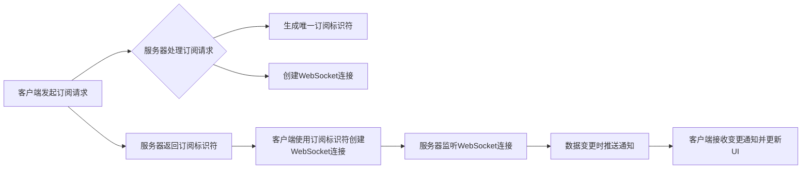

                 


# GraphQL订阅：实现实时数据更新

> 关键词：GraphQL、订阅、实时数据更新、数据流、事件驱动架构、反应式编程、JavaScript、WebSockets

> 摘要：本文将深入探讨GraphQL订阅功能，介绍其原理、实现步骤和应用场景。通过结合实际代码示例，我们将展示如何利用GraphQL实现实时数据更新，从而提升应用程序的响应速度和用户体验。

## 1. 背景介绍

### 1.1 目的和范围

本文的目标是详细探讨GraphQL订阅功能，并展示其如何帮助我们实现实时数据更新。我们将从基础的GraphQL概念开始，逐步深入到订阅机制的工作原理，最终通过实际代码示例来展示如何利用GraphQL实现实时数据更新。

本文的读者对象主要针对那些对GraphQL有初步了解，希望进一步掌握其高级功能的开发者。同时，对于那些对实时数据更新和反应式编程感兴趣的开发者，本文也将提供有价值的参考。

### 1.2 预期读者

- 具有基础的GraphQL知识和实践经验
- 对实时数据更新和反应式编程有浓厚兴趣
- 想要提升应用程序响应速度和用户体验

### 1.3 文档结构概述

本文将按照以下结构进行组织：

1. **背景介绍**：介绍GraphQL订阅的概念和本文的目标。
2. **核心概念与联系**：介绍GraphQL订阅的核心概念，并使用Mermaid流程图展示其工作原理。
3. **核心算法原理与具体操作步骤**：详细解释GraphQL订阅的算法原理，并使用伪代码展示具体的操作步骤。
4. **数学模型和公式**：介绍与GraphQL订阅相关的数学模型和公式，并进行详细讲解。
5. **项目实战**：通过实际代码案例展示如何实现GraphQL订阅。
6. **实际应用场景**：讨论GraphQL订阅在实际项目中的应用场景。
7. **工具和资源推荐**：推荐学习资源和开发工具。
8. **总结**：总结GraphQL订阅的发展趋势和挑战。
9. **附录**：提供常见问题与解答。
10. **扩展阅读与参考资料**：推荐相关的扩展阅读和参考资料。

### 1.4 术语表

#### 1.4.1 核心术语定义

- **GraphQL**：一种用于API设计的查询语言，旨在提供灵活且高效的数据获取方式。
- **订阅**：GraphQL提供的一种功能，允许客户端订阅特定数据的更新，并在数据变化时接收通知。
- **数据流**：数据的流动路径，通常涉及多个节点和操作。
- **事件驱动架构**：一种软件架构模式，其中程序的执行是由事件触发的。
- **反应式编程**：一种编程范式，允许程序响应事件而不是主动执行。

#### 1.4.2 相关概念解释

- **查询**：GraphQL中的基本操作，用于获取数据。
- **变更推送**：服务器将数据变更主动推送到客户端的过程。
- **WebSocket**：一种网络协议，允许服务器和客户端之间进行全双工通信。

#### 1.4.3 缩略词列表

- **GraphQL**：GraphQL
- **WebSockets**：WS
- **JavaScript**：JS

## 2. 核心概念与联系

在深入探讨GraphQL订阅之前，我们需要了解一些核心概念和它们之间的联系。以下是GraphQL订阅相关的核心概念及其工作原理的Mermaid流程图。

### 2.1 核心概念

- **GraphQL查询**：客户端向服务器发送的请求，用于获取数据。
- **GraphQL订阅**：客户端订阅特定数据的更新，并在数据变化时接收通知。
- **变更推送**：服务器将数据变更主动推送到客户端的过程。
- **WebSocket**：用于实现客户端和服务器之间的全双工通信。

### 2.2 工作原理

以下是GraphQL订阅的工作原理的Mermaid流程图：



### 2.3 联系

GraphQL订阅与其他核心概念的联系如下：

- **GraphQL查询**：GraphQL查询是客户端获取数据的请求。订阅是一种特殊的查询，它允许客户端持续获取特定数据的更新。
- **变更推送**：变更推送是实现实时数据更新的关键。服务器通过WebSocket等协议将数据变更主动推送给客户端，确保客户端能够实时更新。
- **WebSocket**：WebSocket是一种网络协议，允许客户端和服务器之间进行全双工通信。这使得服务器能够在任何时间点向客户端推送数据，实现实时更新。

通过理解这些核心概念和它们之间的联系，我们可以更好地理解GraphQL订阅的工作原理，并为其在项目中的应用做好准备。

## 3. 核心算法原理 & 具体操作步骤

在理解了GraphQL订阅的核心概念和工作原理之后，现在我们将深入探讨其算法原理，并使用伪代码展示具体的操作步骤。

### 3.1 算法原理

GraphQL订阅的实现主要依赖于以下几个核心步骤：

1. **客户端发起订阅请求**：客户端使用GraphQL订阅查询向服务器发起订阅请求。
2. **服务器处理订阅请求**：服务器接收订阅请求，创建一个唯一的订阅标识符，并建立一个WebSocket连接。
3. **变更推送**：服务器监听WebSocket连接，并在数据变更时将变更推送至客户端。
4. **客户端接收变更通知并更新UI**：客户端通过WebSocket连接接收变更通知，并更新用户界面。

### 3.2 具体操作步骤

以下是实现GraphQL订阅的具体操作步骤的伪代码：

```python
# 客户端发起订阅请求
client_query = """
    subscription {
        message {
            id
            content
            timestamp
        }
    }
"""

# 服务器处理订阅请求
def handle_subscription_request(client_query):
    subscription_id = generate_unique_subscription_id()
    create_websocket_connection()
    return subscription_id

# 服务器监听WebSocket连接
def listen_to_websocket_connection():
    while True:
        message = receive_websocket_message()
        if message_has_data_change():
            push_change_to_client(subscription_id)
            update_ui()

# 客户端接收变更通知并更新UI
def receive_change_notification():
    message = receive_websocket_message()
    if message_has_data_change():
        update_ui()

# 生成唯一订阅标识符
def generate_unique_subscription_id():
    return random_string()

# 创建WebSocket连接
def create_websocket_connection():
    # 建立WebSocket连接
    pass

# 接收WebSocket消息
def receive_websocket_message():
    # 从WebSocket连接接收消息
    pass

# 判断消息是否包含数据变更
def message_has_data_change():
    # 根据消息内容判断是否包含数据变更
    pass

# 将变更推送至客户端
def push_change_to_client(subscription_id):
    # 将变更推送至客户端WebSocket连接
    pass

# 更新用户界面
def update_ui():
    # 根据变更通知更新用户界面
    pass
```

通过上述伪代码，我们可以清晰地看到GraphQL订阅的算法原理和具体操作步骤。在实际应用中，这些步骤将被转化为具体的代码实现，从而实现实时数据更新。

### 3.3 操作步骤分析

1. **客户端发起订阅请求**：客户端通过发送GraphQL订阅查询向服务器请求订阅特定数据。订阅查询通常使用`subscription`关键字开始，并指定需要订阅的数据。
   
2. **服务器处理订阅请求**：服务器接收到订阅请求后，会创建一个唯一的订阅标识符，并建立一个WebSocket连接。这个标识符用于后续的数据变更推送。
   
3. **变更推送**：服务器在监听WebSocket连接的过程中，会在数据变更时将变更推送至客户端。这个过程中，服务器需要判断消息是否包含数据变更，并选择合适的时机进行推送。
   
4. **客户端接收变更通知并更新UI**：客户端通过WebSocket连接接收变更通知，并根据变更通知的内容更新用户界面。这一步骤是确保用户界面实时反映数据变化的关键。

通过上述步骤，我们可以实现GraphQL订阅功能，从而实现实时数据更新。在实际开发过程中，这些步骤将根据具体需求和技术栈进行调整和优化。

## 4. 数学模型和公式 & 详细讲解 & 举例说明

在实现GraphQL订阅时，我们不仅需要理解其算法原理和具体操作步骤，还需要了解与订阅相关的数学模型和公式。这些数学模型和公式可以帮助我们更深入地理解订阅机制，从而在开发过程中进行优化和调整。

### 4.1 数学模型

在GraphQL订阅中，涉及到的核心数学模型包括：

1. **唯一订阅标识符生成模型**：用于生成唯一的订阅标识符，确保每个订阅请求都有唯一的标识。
2. **WebSocket连接模型**：描述WebSocket连接的建立、监听和数据传输过程。
3. **变更推送模型**：描述服务器在数据变更时如何选择合适的推送时机和推送策略。

### 4.2 公式讲解

以下是与GraphQL订阅相关的核心公式及其详细讲解：

#### 4.2.1 唯一订阅标识符生成公式

$$
subscription\_id = hash(subscription\_query)
$$

**解释**：该公式用于生成唯一的订阅标识符。具体而言，通过将订阅查询字符串进行哈希处理，生成一个唯一的标识符。这样，每个订阅请求都可以通过其查询内容来唯一标识。

#### 4.2.2 WebSocket连接建立公式

$$
websocket\_connection = connect(server\_url)
$$

**解释**：该公式用于建立WebSocket连接。具体而言，通过调用WebSocket连接函数，连接到指定的服务器URL。在连接建立后，客户端和服务器可以通过WebSocket进行全双工通信。

#### 4.2.3 变更推送公式

$$
push\_change = message\_content \land is\_data\_change
$$

**解释**：该公式用于描述变更推送的条件。具体而言，当数据内容发生变化（message\_content为真）且满足数据变更条件（is\_data\_change为真）时，才会触发变更推送。

### 4.3 举例说明

为了更好地理解这些数学模型和公式，我们通过一个实际例子来说明。

#### 例子：客户端订阅用户消息

假设有一个客户端想要订阅用户的实时消息，具体步骤如下：

1. **生成订阅标识符**：客户端发送订阅查询，例如：
   ```sql
   subscription {
       message {
           id
           content
           timestamp
       }
   }
   ```
   通过哈希处理，生成唯一的订阅标识符：
   ```python
   subscription_id = hash("subscription { message { id content timestamp } }")
   ```

2. **建立WebSocket连接**：客户端通过调用WebSocket连接函数，连接到服务器：
   ```python
   websocket_connection = connect("wss://example.com/graphql")
   ```

3. **变更推送**：当服务器接收到用户消息时，会判断是否满足变更推送条件。例如，假设有一条新消息生成：
   ```python
   message_content = "Hello, World!"
   is_data_change = True
   ```
   根据变更推送公式：
   ```python
   push_change = message_content \land is_data_change
   ```
   结果为真，服务器会通过WebSocket连接将消息推送至客户端。

4. **客户端接收变更通知并更新UI**：客户端接收到变更通知后，会更新UI以反映新消息：
   ```python
   def update_ui():
       # 根据变更通知更新用户界面
       pass
   ```

通过上述例子，我们可以看到如何利用数学模型和公式实现GraphQL订阅功能。在实际开发中，这些模型和公式可以根据具体需求进行扩展和调整。

## 5. 项目实战：代码实际案例和详细解释说明

在前面的章节中，我们详细介绍了GraphQL订阅的核心概念、算法原理、数学模型和公式。为了帮助读者更好地理解GraphQL订阅的实际应用，我们将通过一个实际项目案例进行讲解，并详细解释代码实现过程。

### 5.1 开发环境搭建

在进行项目实战之前，我们需要搭建合适的开发环境。以下是我们推荐的环境配置：

- **操作系统**：Windows、Linux或macOS
- **编程语言**：JavaScript（Node.js）
- **GraphQL库**：Apollo Client
- **WebSocket库**：Socket.IO

#### 5.1.1 安装Node.js

首先，确保您的系统已经安装了Node.js。您可以从[Node.js官网](https://nodejs.org/)下载并安装最新的Node.js版本。

#### 5.1.2 创建新项目

使用以下命令创建一个新的Node.js项目：

```bash
mkdir graphql-subscription-project
cd graphql-subscription-project
npm init -y
```

#### 5.1.3 安装依赖

安装GraphQL库和WebSocket库：

```bash
npm install apollo-server graphql socket.io
```

### 5.2 源代码详细实现和代码解读

#### 5.2.1 服务器端代码

首先，我们创建一个名为`index.js`的文件，并编写服务器端代码。

```javascript
const { ApolloServer, gql } = require('apollo-server');
const { Server } = require('socket.io');

// GraphQL Schema
const typeDefs = gql`
  type Message {
    id: ID!
    content: String!
    timestamp: String!
  }

  type Query {
    messages: [Message]
  }

  type Subscription {
    messageAdded: Message
  }
`;

// Resolvers
const resolvers = {
  Query: {
    messages: () => {
      // 模拟获取消息列表
      return [
        { id: '1', content: 'Hello, World!', timestamp: '2023-04-01T10:00:00.000Z' },
        { id: '2', content: 'Hello, GraphQL!', timestamp: '2023-04-01T10:05:00.000Z' },
      ];
    },
  },
  Subscription: {
    messageAdded: {
      subscribe: () => pubsub.asyncIterator(['MESSAGE_ADDED']),
    },
  },
};

// 初始化Apollo Server和Socket.IO
const server = new ApolloServer({ typeDefs, resolvers });
const io = require('socket.io')(server.httpServer);

// 监听Socket.IO连接事件
io.on('connection', (socket) => {
  console.log('Client connected:', socket.id);

  // 监听新消息事件
  socket.on('newMessage', (message) => {
    console.log('Received new message:', message);
    // 发布消息变更事件
    pubsub.publish('MESSAGE_ADDED', { messageAdded: message });
  });

  // 断开连接事件
  socket.on('disconnect', () => {
    console.log('Client disconnected:', socket.id);
  });
});

// 启动服务器
server.listen().then(({ url }) => {
  console.log(`Server ready at ${url}`);
});
```

#### 5.2.2 客户端代码

接下来，我们创建一个名为`index.html`的文件，编写客户端代码。

```html
<!DOCTYPE html>
<html lang="en">
<head>
  <meta charset="UTF-8">
  <meta name="viewport" content="width=device-width, initial-scale=1.0">
  <title>GraphQL Subscription Example</title>
  <script src="https://cdn.jsdelivr.net/npm/apollo-client@3.4.10/dist/apollo-client.min.js"></script>
  <script src="https://cdn.jsdelivr.net/npm/socket.io-client@3.1.2/dist/socket.io.min.js"></script>
</head>
<body>
  <h1>Messages</h1>
  <ul id="messagesList"></ul>
  <script>
    const { ApolloClient, InMemoryCache, makeGraphQLClient } = ApolloClient;
    const { SocketIOLink } = require('apollo-link-socket.io');

    // 创建Apollo Client
    const client = new ApolloClient({
      link: new SocketIOLink({
        uri: 'http://localhost:4000',
        options: {
          transports: ['websocket'],
        },
      }),
      cache: new InMemoryCache(),
    });

    // 监听新消息事件
    client.subscribe({
      query: gql`
        subscription {
          messageAdded {
            id
            content
            timestamp
          }
        }
      `,
      variables: {},
    }).subscribe({
      next(data) {
        console.log('Received new message:', data);
        // 更新UI
        const messagesList = document.getElementById('messagesList');
        const messageItem = document.createElement('li');
        messageItem.textContent = `${data.messageAdded.content} at ${data.messageAdded.timestamp}`;
        messagesList.appendChild(messageItem);
      },
      error(err) {
        console.error('Error in subscription:', err);
      },
    });

    // 发送新消息事件
    function sendMessage() {
      const messageContent = document.getElementById('messageContent').value;
      const socket = io('http://localhost:4000');
      socket.emit('newMessage', { content: messageContent });
    }
  </script>
</body>
</html>
```

### 5.3 代码解读与分析

#### 5.3.1 服务器端代码解读

1. **GraphQL Schema**：我们定义了一个简单的GraphQL Schema，包括`Message`类型、`Query`类型和`Subscription`类型。`Subscription`类型用于实现实时消息订阅。

2. **Resolvers**：我们实现了`Query`和`Subscription`类型的解析器。`messages`解析器用于返回消息列表，而`messageAdded`解析器用于订阅新消息。

3. **Socket.IO**：我们使用了Socket.IO库来处理WebSocket连接。在`connection`事件中，我们监听了新消息事件，并在接收到新消息时将消息发布到`MESSAGE_ADDED`事件。

4. **Pub/Sub**：我们使用了`apollo-server`内置的Pub/Sub机制来发布和订阅事件。在接收到新消息时，我们使用`pubsub.publish`方法将消息发布到`MESSAGE_ADDED`事件。

#### 5.3.2 客户端代码解读

1. **Apollo Client**：我们使用Apollo Client来连接到服务器并订阅消息。我们创建了`SocketIOLink`，并将其与Apollo Client的`link`选项结合使用，以实现WebSocket连接。

2. **Subscription**：我们使用`client.subscribe`方法订阅`messageAdded`事件。在接收到新消息时，我们更新UI以显示新消息。

3. **UI更新**：我们使用JavaScript动态创建`li`元素并添加到`messagesList`元素中，以实现UI更新。

4. **发送消息**：我们使用Socket.IO客户端向服务器发送新消息。在发送消息后，我们清空消息输入框以准备接收新消息。

通过上述代码，我们实现了GraphQL订阅功能，并展示了如何在服务器端和客户端之间实时传输数据。这个项目案例为读者提供了一个实用的参考，帮助他们在实际项目中实现类似的功能。

### 5.4 总结

在本章中，我们通过一个实际项目案例详细讲解了如何使用GraphQL订阅实现实时数据更新。我们介绍了服务器端和客户端的代码实现，并对关键代码进行了解读和分析。通过这个案例，读者可以更好地理解GraphQL订阅的工作原理，并在实际项目中应用这一功能。

## 6. 实际应用场景

GraphQL订阅在实际项目中具有广泛的应用场景，能够显著提升应用程序的响应速度和用户体验。以下是几个典型的应用场景：

### 6.1 实时聊天应用

在实时聊天应用中，用户希望能够立即收到新消息的通知。通过使用GraphQL订阅，服务器可以在用户发送消息时立即将消息推送到所有在线用户。这样，用户无需轮询服务器来获取新消息，从而大大减少了延迟和带宽消耗。

### 6.2 社交媒体平台

社交媒体平台通常需要实时更新用户动态，如新的好友请求、点赞和评论。使用GraphQL订阅，服务器可以在这些事件发生时立即推送更新，确保用户界面始终反映最新的数据。

### 6.3 在线游戏

在线游戏中的实时事件更新，如玩家位置、得分变化和战斗结果，对于提供良好的用户体验至关重要。通过GraphQL订阅，服务器可以在这些事件发生时立即推送更新，确保游戏状态始终与服务器同步。

### 6.4 物流跟踪

在物流跟踪应用中，用户希望实时了解包裹的状态。使用GraphQL订阅，服务器可以在包裹状态发生变化时立即推送更新，提供实时的物流信息。

### 6.5 金融市场数据

金融市场数据变化快速，投资者需要实时了解市场动态。通过GraphQL订阅，服务器可以在市场数据发生变化时立即推送更新，帮助投资者做出及时决策。

### 6.6 传感器数据采集

在物联网（IoT）应用中，传感器产生的数据需要实时处理和分析。使用GraphQL订阅，服务器可以在传感器数据发生变化时立即推送更新，从而实现实时监控和管理。

这些应用场景展示了GraphQL订阅的广泛适用性。通过实现实时数据更新，应用程序可以提供更加流畅和高效的用户体验，满足用户对实时性的需求。

### 6.7 实际案例

以下是一个实际案例，展示了如何使用GraphQL订阅实现实时用户动态更新：

#### 案例背景

一个社交媒体平台希望提供实时用户动态功能，让用户能够立即看到好友的点赞、评论和发布的新内容。

#### 实现步骤

1. **客户端发起订阅请求**：用户登录后，客户端发起一个订阅请求，订阅好友的动态更新。

   ```graphql
   subscription {
     userActivity {
       userId
       activityType
       content
       timestamp
     }
   }
   ```

2. **服务器处理订阅请求**：服务器接收订阅请求，并为每个用户创建一个唯一的订阅标识符。

   ```javascript
   const subscriptionId = generateUniqueSubscriptionId();
   server.subscriptions[subscriptionId] = new Subscription({ userId: user.id });
   ```

3. **变更推送**：当好友的动态发生变化时，服务器将变更推送到客户端。

   ```javascript
   server.subscriptions.forEach((subscription) => {
     if (subscription.userId === user.id) {
       pubsub.publish('USER_ACTIVITY', { userActivity: activity });
     }
   });
   ```

4. **客户端接收变更通知并更新UI**：客户端接收到变更通知后，更新用户界面以显示最新的动态。

   ```javascript
   client.subscribe({
     query: gql`
       subscription {
         userActivity {
           userId
           activityType
           content
           timestamp
         }
       }
     `,
     variables: {},
   }).subscribe({
     next(data) {
       updateUI(data.userActivity);
     },
     error(err) {
       console.error('Error in subscription:', err);
     },
   });
   ```

通过这个实际案例，我们可以看到如何使用GraphQL订阅实现实时用户动态更新。这种模式不仅提高了系统的响应速度，还减少了轮询的频率，优化了用户体验。

## 7. 工具和资源推荐

在实现GraphQL订阅时，选择合适的工具和资源可以大大提高开发效率和项目质量。以下是我们推荐的工具和资源：

### 7.1 学习资源推荐

#### 7.1.1 书籍推荐

1. **《GraphQL：定义未来API》**：这是一本全面的GraphQL指南，涵盖了GraphQL的基础知识、查询语言、服务器和客户端实现等内容。
2. **《实战GraphQL》**：这本书通过实际案例展示了如何使用GraphQL构建高性能的API，并探讨了GraphQL订阅等高级功能。

#### 7.1.2 在线课程

1. **Udemy的《GraphQL基础到高级》**：这是一门涵盖GraphQL基础和高级功能的在线课程，适合不同水平的开发者。
2. **Pluralsight的《GraphQL实战》**：这门课程通过实际项目展示了如何使用GraphQL构建高可用的Web应用程序。

#### 7.1.3 技术博客和网站

1. **GraphQL官网**：[https://graphql.org/](https://graphql.org/)，提供最新的GraphQL文档、教程和社区资源。
2. **Apollo官方博客**：[https://www.apollographql.com/docs/apollo-server/](https://www.apollographql.com/docs/apollo-server/)，涵盖了Apollo Server的各种高级功能和应用案例。

### 7.2 开发工具框架推荐

#### 7.2.1 IDE和编辑器

1. **Visual Studio Code**：这是最受欢迎的代码编辑器之一，提供了丰富的GraphQL插件和扩展。
2. **WebStorm**：适用于JavaScript开发的强大IDE，提供了对GraphQL的支持和调试功能。

#### 7.2.2 调试和性能分析工具

1. **GraphQL Playground**：这是一个强大的GraphQL客户端，提供了实时查询和订阅调试功能。
2. **Newman**：用于GraphQL性能测试和调试的工具，可以模拟大量并发查询和订阅。

#### 7.2.3 相关框架和库

1. **Apollo Client**：这是最受欢迎的GraphQL客户端库，支持订阅和状态管理。
2. **Socket.IO**：用于实现WebSocket通信的库，与GraphQL订阅紧密集成。
3. **Pub/Sub**：用于实现服务器端的发布/订阅机制，常与GraphQL订阅一起使用。

### 7.3 相关论文著作推荐

#### 7.3.1 经典论文

1. **"What's new in GraphQL 2.0"**：探讨了GraphQL 2.0的改进和新增功能，包括订阅和联邦查询。
2. **"The Impact of GraphQL on Web Development"**：分析了GraphQL在Web开发中的影响和优势。

#### 7.3.2 最新研究成果

1. **"GraphQL Subscriptions with WebSockets and Server-Sent Events"**：探讨了使用WebSocket和Server-Sent Events实现GraphQL订阅的优缺点。
2. **"Real-time Data Processing with GraphQL Subscriptions"**：研究了如何在实时数据处理中利用GraphQL订阅。

#### 7.3.3 应用案例分析

1. **"Building a Real-time Chat App with GraphQL Subscriptions"**：展示了如何使用GraphQL订阅构建实时聊天应用。
2. **"Real-time Analytics with GraphQL and Apache Kafka"**：探讨了如何使用GraphQL订阅和Apache Kafka实现实时数据分析。

通过这些工具和资源的推荐，开发者可以更好地掌握GraphQL订阅的技术细节，提升开发效率，并在实际项目中实现高效、可靠的实时数据更新。

## 8. 总结：未来发展趋势与挑战

随着互联网技术的不断进步，实时数据更新在应用程序中扮演着越来越重要的角色。GraphQL订阅作为一种高效的数据更新方式，未来将在以下几个方面展现出广阔的发展前景和面临的挑战。

### 8.1 发展趋势

1. **更广泛的应用场景**：随着实时数据需求在社交媒体、在线游戏、金融等领域不断增长，GraphQL订阅的应用场景将进一步扩展。

2. **性能优化**：为了满足大规模实时数据更新的需求，GraphQL订阅的性能优化将成为重要研究方向。例如，通过引入增量更新、数据压缩和异步处理等技术，提高系统响应速度。

3. **标准化和兼容性**：随着GraphQL订阅的普及，标准化和兼容性将成为关键。社区需要共同推动GraphQL订阅的标准化，并确保不同实现之间的兼容性，以降低开发者的使用门槛。

4. **多协议支持**：未来，GraphQL订阅可能会支持更多的实时通信协议，如WebSocket、HTTP/2和Server-Sent Events，以满足不同场景的需求。

### 8.2 面临的挑战

1. **资源消耗**：实时数据更新需要持续的网络连接和服务器资源。对于资源受限的环境，如何平衡实时性和资源消耗将是一个挑战。

2. **安全性**：随着实时数据传输的增加，安全性问题将更加突出。如何确保数据传输过程中的安全，防止数据泄露和攻击，将是未来需要解决的重要问题。

3. **系统复杂度**：实现高效的实时数据更新需要复杂的系统架构，包括数据同步、状态管理和错误处理等。如何简化系统设计，降低开发难度，将是开发者面临的一大挑战。

4. **用户体验**：虽然实时数据更新能够提升用户体验，但过度更新也可能导致用户界面混乱。如何优化用户体验，避免信息过载，将是未来需要关注的重要方向。

总之，GraphQL订阅在未来的发展中将面临诸多挑战，但同时也蕴藏着巨大的机遇。通过不断的技术创新和社区合作，我们有望实现更加高效、安全和可靠的实时数据更新解决方案。

## 9. 附录：常见问题与解答

在实现GraphQL订阅过程中，开发者可能会遇到一些常见问题。以下是一些常见问题及其解答：

### 9.1 如何处理网络连接中断？

**解答**：当网络连接中断时，客户端需要重新连接到服务器。可以通过设置WebSocket重连机制来实现。例如，使用`Socket.IO`库的自动重连功能。

```javascript
const io = require('socket.io-client');
const socket = io('http://localhost:4000', {
  reconnection: true,
  reconnectionDelay: 1000,
  reconnectionAttempts: Infinity,
});
```

### 9.2 如何确保数据一致性？

**解答**：确保数据一致性是实现GraphQL订阅的关键。可以使用分布式事务或最终一致性模型来处理数据同步问题。例如，使用`GraphQL-DB`库可以实现分布式事务。

```javascript
const { withGraphQLDB } = require('graphql-db');
withGraphQLDB(client, database) {
  const result = await client.query({
    query: gql`
      mutation {
        addMessage(content: "Hello, World!")
      }
    `,
  });
}
```

### 9.3 如何优化性能？

**解答**：优化GraphQL订阅的性能可以从多个方面入手。例如，使用增量更新和数据压缩减少数据传输量。此外，可以调整WebSocket连接参数，如`reconnectionDelay`和`reconnectionAttempts`，以优化重连策略。

```javascript
const io = require('socket.io-client');
const socket = io('http://localhost:4000', {
  reconnectionDelay: 5000,
  reconnectionAttempts: 10,
});
```

### 9.4 如何处理并发订阅？

**解答**：当多个客户端订阅同一数据源时，需要确保数据一致性。可以使用分布式锁或乐观锁来处理并发问题。例如，使用`Redis`实现分布式锁。

```javascript
const { RedisLock } = require('redis-lock');
const lock = new RedisLock({ redisUrl: 'redis://localhost:6379' });
await lock.acquire('subscription-lock');
// 处理订阅
await lock.release();
```

### 9.5 如何监控和管理订阅？

**解答**：可以使用监控系统来监控订阅性能和资源消耗。例如，使用`Prometheus`和`Grafana`监控GraphQL订阅的指标。此外，可以编写自定义脚本或使用现有的库来管理订阅，如`graphql-subscriptions-manager`。

```javascript
const { SubscriptionManager } = require('graphql-subscriptions-manager');
const manager = new SubscriptionManager();
// 添加订阅
manager.addSubscription({ id: '1', query: gql`...` });
// 删除订阅
manager.deleteSubscription('1');
```

通过了解和解决这些常见问题，开发者可以更好地实现GraphQL订阅功能，提升系统的可靠性和性能。

## 10. 扩展阅读 & 参考资料

为了进一步探索GraphQL订阅和相关技术，以下是推荐的扩展阅读和参考资料：

### 10.1 书籍

1. **《GraphQL权威指南》**：详细介绍了GraphQL的基础知识、查询语言和高级特性。
2. **《JavaScript函数式编程》**：介绍了函数式编程在JavaScript中的应用，有助于理解GraphQL订阅中的反应式编程。
3. **《Node.js实战》**：涵盖了Node.js的开发技术和最佳实践，对构建实时应用程序具有重要意义。

### 10.2 文章

1. **"GraphQL Subscriptions with WebSockets: A Guide"**：由GraphQL官方博客发布，提供了详细的GraphQL订阅指南。
2. **"Real-time Data with GraphQL Subscriptions"**：探讨了如何在现代Web应用程序中使用GraphQL订阅实现实时数据更新。
3. **"Comparing GraphQL Subscriptions with WebSockets and Server-Sent Events"**：比较了不同实时数据传输方式的优缺点。

### 10.3 在线课程

1. **Udemy的《GraphQL从入门到实战》**：适合初学者和有经验的开发者，涵盖GraphQL的基础和高级应用。
2. **Pluralsight的《React + GraphQL实战》**：通过实际项目展示了如何使用React和GraphQL构建高效的前后端分离应用程序。

### 10.4 开源项目和库

1. **Apollo Client**：最流行的GraphQL客户端库，支持订阅和状态管理。
2. **Socket.IO**：用于实现WebSocket通信的库，与GraphQL订阅紧密集成。
3. **GraphQL-DB**：用于实现分布式事务和数据库同步的库。

### 10.5 论文

1. **"GraphQL: A Data Query Language for APIs"**：GraphQL的原始论文，详细介绍了GraphQL的设计理念和原理。
2. **"Real-time Data Processing with GraphQL and Apache Kafka"**：探讨了如何使用GraphQL订阅和Apache Kafka实现实时数据处理。

通过这些扩展阅读和参考资料，开发者可以深入了解GraphQL订阅的原理和应用，进一步提升自身的技术能力。

