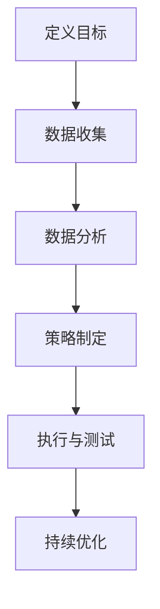
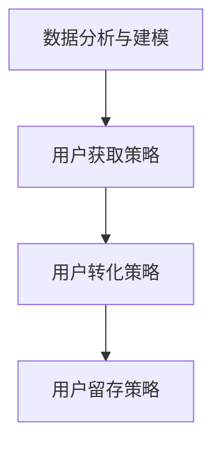

                 

# Growth Hacking创业：快速增长的秘诀

> **关键词：** 创业、增长黑客、市场扩张、用户获取、数据驱动、用户体验、技术创新

> **摘要：** 本文将深入探讨Growth Hacking在创业领域的应用，解析其核心原理、方法和工具，并通过实际案例展示如何实现快速、可持续的业务增长。我们将逐步分析Growth Hacking的策略，探讨其在不同行业中的成功实践，并提供实用的建议，以帮助创业者实现企业的快速增长。

## 1. 背景介绍

### 1.1 目的和范围

本文旨在为创业者提供关于Growth Hacking的全面指南。我们将讨论Growth Hacking的定义、核心概念、实施策略和关键工具。文章将涵盖以下内容：

- Growth Hacking的定义和起源
- Growth Hacking的核心原则和方法
- Growth Hacking在不同行业的应用案例
- 实现Growth Hacking的实用策略和工具

通过本文的阅读，创业者将能够更好地理解Growth Hacking的重要性，并学会如何将其应用于自己的业务中，实现快速增长。

### 1.2 预期读者

本文适合以下读者群体：

- 创业者：正在创业或计划创业的人，希望了解如何实现快速增长的策略。
- 市场营销人员：从事市场营销工作，希望提升用户获取和转化率的专业人士。
- 产品经理：关注产品增长和用户体验，希望提高产品市场竞争力的产品经理。
- 数据分析师：负责分析用户行为和市场需求，为增长策略提供数据支持的数据分析师。

### 1.3 文档结构概述

本文将分为以下几个部分：

- **1. 背景介绍**：介绍本文的目的、范围、预期读者和文档结构。
- **2. 核心概念与联系**：介绍Growth Hacking的核心概念、原理和架构。
- **3. 核心算法原理 & 具体操作步骤**：详细阐述Growth Hacking的具体操作步骤和算法原理。
- **4. 数学模型和公式 & 详细讲解 & 举例说明**：讲解与Growth Hacking相关的数学模型和公式，并提供实例说明。
- **5. 项目实战：代码实际案例和详细解释说明**：通过实际案例展示如何实现Growth Hacking策略。
- **6. 实际应用场景**：探讨Growth Hacking在不同行业中的应用场景。
- **7. 工具和资源推荐**：推荐用于Growth Hacking的学习资源和开发工具。
- **8. 总结：未来发展趋势与挑战**：分析Growth Hacking的未来发展趋势和面临的挑战。
- **9. 附录：常见问题与解答**：解答读者可能遇到的问题。
- **10. 扩展阅读 & 参考资料**：提供扩展阅读和参考资料。

### 1.4 术语表

#### 1.4.1 核心术语定义

- **Growth Hacking**：一种以数据驱动的方式，通过创新的策略和创意，实现业务快速增长的方法。
- **用户获取成本（CAC）**：获取一个新用户所需的平均成本。
- **用户生命周期价值（LTV）**：一个用户在整个生命周期中为企业带来的总价值。
- **转化率**：用户完成特定行为（如注册、购买等）的比例。
- **A/B测试**：一种对比测试方法，通过将用户分为两组，比较不同策略的效果。

#### 1.4.2 相关概念解释

- **病毒式营销**：利用用户口碑和分享，实现快速传播和增长的方法。
- **产品-市场匹配**：将产品与市场需求相匹配，确保产品能够满足用户需求。
- **数据分析**：使用统计方法和工具，从数据中提取有价值的信息。

#### 1.4.3 缩略词列表

- **Growth Hacking**：增长黑客
- **CAC**：用户获取成本
- **LTV**：用户生命周期价值
- **A/B测试**：A/B测试

## 2. 核心概念与联系

### 2.1 Growth Hacking的定义与核心概念

Growth Hacking是一种以数据驱动的方式，通过创新的策略和创意，实现业务快速增长的方法。它结合了市场营销、产品开发和数据分析的元素，旨在通过优化用户获取、留存和转化，实现业务的快速增长。

Growth Hacking的核心概念包括：

1. **用户获取（User Acquisition）**：通过多种渠道获取新用户，如社交媒体、内容营销、广告等。
2. **用户留存（User Retention）**：提高用户留存率，确保用户持续使用产品或服务。
3. **用户转化（User Conversion）**：将潜在用户转化为实际用户，提升转化率。
4. **数据分析（Data Analysis）**：通过数据分析，了解用户行为，优化增长策略。

### 2.2 Growth Hacking的架构与流程

Growth Hacking的架构可以分为以下几个步骤：

1. **定义目标（Define Goals）**：明确业务目标和增长指标，如用户获取、留存、转化等。
2. **数据收集（Data Collection）**：收集用户数据，包括用户行为、偏好、反馈等。
3. **数据分析（Data Analysis）**：对收集到的数据进行分析，了解用户行为和需求。
4. **策略制定（Strategy Development）**：基于数据分析，制定具体的增长策略。
5. **执行与测试（Execution & Testing）**：执行增长策略，并通过A/B测试等方法进行优化。
6. **持续优化（Continuous Optimization）**：根据用户反馈和测试结果，持续优化增长策略。

### 2.3 Growth Hacking的Mermaid流程图

以下是一个简单的Mermaid流程图，展示了Growth Hacking的基本流程：



### 2.4 Growth Hacking与市场营销的区别

虽然Growth Hacking和市场营销有许多相似之处，但它们的目标和方法有所不同。

- **目标**：市场营销的目标是提高品牌知名度和市场份额，而Growth Hacking的目标是快速实现业务增长，特别是在早期阶段。
- **方法**：市场营销通常依赖于传统广告、公关和销售渠道，而Growth Hacking更注重数据驱动和创新策略，如病毒式营销、A/B测试等。

## 3. 核心算法原理 & 具体操作步骤

### 3.1 Growth Hacking的核心算法原理

Growth Hacking的核心算法原理可以总结为以下几点：

1. **数据分析与建模**：通过数据分析，了解用户行为和需求，建立用户画像和预测模型。
2. **用户获取策略**：根据用户画像和需求，制定针对性的用户获取策略，如内容营销、社交媒体推广、广告投放等。
3. **用户转化策略**：通过优化用户体验、提高产品价值，提高用户转化率。
4. **用户留存策略**：通过提供优质服务和持续优化产品，提高用户留存率。

### 3.2 Growth Hacking的具体操作步骤

以下是一个简单的Growth Hacking操作步骤：



### 3.2.1 数据分析与建模

1. **数据收集**：收集用户行为数据，如浏览量、点击量、转化率等。
2. **数据清洗**：清洗和整理数据，去除重复和无效数据。
3. **数据可视化**：使用图表和可视化工具，展示数据分布和趋势。
4. **用户画像**：根据数据，构建用户画像，了解用户需求和偏好。
5. **预测模型**：使用机器学习算法，建立预测模型，预测用户行为和需求。

### 3.2.2 用户获取策略

1. **目标用户定位**：根据用户画像，确定目标用户群体。
2. **内容营销**：通过高质量的内容，吸引目标用户，如博客、视频、社交媒体等。
3. **社交媒体推广**：利用社交媒体平台，提高品牌知名度和用户关注度。
4. **广告投放**：在合适的平台和渠道投放广告，吸引新用户。

### 3.2.3 用户转化策略

1. **优化用户体验**：提高产品的易用性和用户满意度。
2. **提升产品价值**：通过功能优化和产品创新，提高产品价值。
3. **促销活动**：举办促销活动，如限时优惠、赠品等，刺激用户购买。

### 3.2.4 用户留存策略

1. **提供优质服务**：确保用户在使用过程中得到满意的体验。
2. **持续优化产品**：根据用户反馈和需求，不断优化产品。
3. **用户社群建设**：建立用户社群，提高用户参与度和忠诚度。

## 4. 数学模型和公式 & 详细讲解 & 举例说明

### 4.1 用户获取成本（CAC）模型

用户获取成本（CAC）是衡量增长策略效果的重要指标。其计算公式如下：

\[ \text{CAC} = \frac{\text{总营销成本}}{\text{新增用户数}} \]

#### 4.1.1 详细讲解

- **总营销成本**：包括所有用于用户获取的营销费用，如广告费用、内容制作费用、推广费用等。
- **新增用户数**：在特定时间段内，通过营销活动新增的用户数量。

#### 4.1.2 举例说明

假设一家公司在一个季度内花费了10万元用于市场营销，成功吸引了1000名新用户。则该公司的用户获取成本（CAC）为：

\[ \text{CAC} = \frac{100,000}{1,000} = 100 \text{元/人} \]

### 4.2 用户生命周期价值（LTV）模型

用户生命周期价值（LTV）是预测用户为企业带来的总价值。其计算公式如下：

\[ \text{LTV} = \text{平均订单价值} \times \text{平均回购频率} \times \text{用户生命周期时长} \]

#### 4.2.1 详细讲解

- **平均订单价值**：用户每次购买的平均金额。
- **平均回购频率**：用户平均多久回购一次。
- **用户生命周期时长**：用户从首次购买到停止购买的时间。

#### 4.2.2 举例说明

假设一家电商平台的平均订单价值为200元，平均回购频率为每月一次，用户生命周期时长为12个月。则该平台的用户生命周期价值（LTV）为：

\[ \text{LTV} = 200 \times 1 \times 12 = 2,400 \text{元/人} \]

### 4.3 转化率模型

转化率是衡量用户完成特定行为的比例。其计算公式如下：

\[ \text{转化率} = \frac{\text{完成特定行为的用户数}}{\text{总用户数}} \]

#### 4.3.1 详细讲解

- **完成特定行为的用户数**：指在特定时间段内，完成指定行为的用户数量，如注册、购买等。
- **总用户数**：在特定时间段内，访问网站或使用产品的用户总数。

#### 4.3.2 举例说明

假设在一个推广活动中，共有1000名用户访问了网站，其中200名用户完成了注册。则该活动的转化率为：

\[ \text{转化率} = \frac{200}{1,000} = 20\% \]

## 5. 项目实战：代码实际案例和详细解释说明

### 5.1 开发环境搭建

在本节中，我们将搭建一个简单的Growth Hacking项目环境，使用Python编程语言和相关的库，如NumPy和Pandas。以下是开发环境搭建的步骤：

1. **安装Python**：从[Python官网](https://www.python.org/downloads/)下载并安装Python 3.x版本。
2. **安装Jupyter Notebook**：在命令行中运行以下命令安装Jupyter Notebook：

   ```bash
   pip install notebook
   ```

3. **安装相关库**：在命令行中运行以下命令安装NumPy和Pandas：

   ```bash
   pip install numpy pandas
   ```

完成以上步骤后，就可以在Jupyter Notebook中编写和运行Python代码了。

### 5.2 源代码详细实现和代码解读

下面是一个简单的Python代码示例，用于计算用户获取成本（CAC）和用户生命周期价值（LTV）。代码使用NumPy和Pandas库进行数据处理和计算。

```python
import numpy as np
import pandas as pd

# 示例数据
data = {
    'total_marketing_cost': [100000, 120000, 150000],
    'new_users': [1000, 1200, 1500],
    'average_order_value': [200, 220, 250],
    'average回购频率': [1, 1.2, 1.5],
    'user_lifetime_duration': [12, 12, 12]
}

# 创建DataFrame
df = pd.DataFrame(data)

# 计算用户获取成本（CAC）
df['user_acquisition_cost'] = df['total_marketing_cost'] / df['new_users']

# 计算用户生命周期价值（LTV）
df['lifetime_value'] = df['average_order_value'] * df['average回购频率'] * df['user_lifetime_duration']

# 打印结果
print(df)
```

#### 5.2.1 代码解读

- **导入库**：使用`numpy`和`pandas`库进行数据处理和计算。
- **示例数据**：创建一个包含总营销成本、新增用户数、平均订单价值、平均回购频率和用户生命周期时长的数据字典。
- **创建DataFrame**：将数据字典转换为Pandas DataFrame，方便进行数据处理和计算。
- **计算用户获取成本（CAC）**：使用`total_marketing_cost`除以`new_users`，计算每个时间段的用户获取成本。
- **计算用户生命周期价值（LTV）**：使用`average_order_value`、`average回购频率`和`user_lifetime_duration`，计算每个时间段的用户生命周期价值。
- **打印结果**：打印计算得到的用户获取成本和用户生命周期价值。

### 5.3 代码解读与分析

该代码示例通过简单的数据处理和计算，展示了如何计算用户获取成本（CAC）和用户生命周期价值（LTV）。在实际项目中，可以扩展此代码，添加更多的数据分析和预测功能，如用户流失预测、交叉销售机会等。

- **数据收集**：在实际项目中，需要收集更多的数据，如用户行为数据、订单数据、客户反馈等，以便进行更全面的数据分析。
- **数据处理**：使用Pandas库对收集到的数据进行处理和清洗，确保数据质量。
- **数据可视化**：使用图表和可视化工具，展示数据分布和趋势，帮助理解用户行为和需求。
- **预测模型**：使用机器学习算法，建立预测模型，预测用户行为和需求，为增长策略提供数据支持。

## 6. 实际应用场景

### 6.1 社交媒体营销

社交媒体营销是Growth Hacking中最常用的策略之一。通过社交媒体平台，如Facebook、Twitter和Instagram，企业可以与潜在用户建立联系，提高品牌知名度和用户参与度。以下是一个实际应用案例：

- **目标**：提高品牌知名度和用户参与度。
- **策略**：发布高质量的内容，如教育性博客文章、视频和图像，鼓励用户分享和评论。
- **效果**：通过病毒式营销，吸引了大量新用户，提高了用户参与度和品牌知名度。

### 6.2 内容营销

内容营销是Growth Hacking的另一个重要策略。通过提供有价值的内容，如博客文章、电子书和教程，企业可以吸引目标用户，建立品牌信任，并促进用户转化。以下是一个实际应用案例：

- **目标**：提高网站流量和用户转化率。
- **策略**：发布高质量的内容，解决用户问题和需求，鼓励用户下载电子书或注册会员。
- **效果**：通过内容营销，吸引了大量新用户，提高了网站流量和用户转化率。

### 6.3 A/B测试

A/B测试是一种常用的Growth Hacking工具，用于比较不同策略的效果，并选择最优策略。以下是一个实际应用案例：

- **目标**：提高用户转化率。
- **策略**：设计两个不同的页面版本，对一半用户显示版本A，对另一半用户显示版本B，比较两个版本的转化率。
- **效果**：通过A/B测试，发现版本B的转化率更高，因此将版本B作为最终版本。

### 6.4 病毒式营销

病毒式营销是一种通过用户口碑和分享实现快速传播的策略。以下是一个实际应用案例：

- **目标**：提高用户获取和品牌知名度。
- **策略**：设计有趣的营销活动，鼓励用户分享，如提供免费试用、分享优惠码等。
- **效果**：通过病毒式营销，吸引了大量新用户，提高了品牌知名度。

## 7. 工具和资源推荐

### 7.1 学习资源推荐

#### 7.1.1 书籍推荐

- **《Growth Hacker's Guide to the Galaxy》**：由Growth Hacking之父Ryan Holiday所著，详细介绍Growth Hacking的理论和实践。
- **《Crossing the Chasm》**：作者Geoffrey A. Moore，探讨产品市场匹配和增长策略。
- **《Lean Analytics》**：作者Alistair Croll和Brian D. Jones，介绍如何使用数据分析实现业务增长。

#### 7.1.2 在线课程

- **Coursera上的《Growth Hacking for Startups》**：由Google Ventures和Coursera联合推出，详细介绍Growth Hacking的理论和实践。
- **Udemy上的《Growth Hacking: The Complete Guide》**：提供全面的Growth Hacking教程，包括用户获取、留存和转化策略。

#### 7.1.3 技术博客和网站

- **GrowthHackers.com**：一个关于Growth Hacking的在线社区，提供最新的Growth Hacking资源和讨论。
- **Traction Book**：作者Gabrielle D. Sculley，详细介绍各种Growth Hacking策略和案例。

### 7.2 开发工具框架推荐

#### 7.2.1 IDE和编辑器

- **PyCharm**：一款功能强大的Python IDE，适合进行数据分析和开发。
- **Visual Studio Code**：一款轻量级、可扩展的代码编辑器，适合编写Python代码。

#### 7.2.2 调试和性能分析工具

- **Jupyter Notebook**：一款基于Web的交互式计算环境，适合进行数据分析和调试。
- **Postman**：一款API调试工具，可用于测试和优化API接口。

#### 7.2.3 相关框架和库

- **Pandas**：一款强大的数据处理库，适合进行数据分析和清洗。
- **NumPy**：一款用于科学计算的基础库，与Pandas结合使用，可以高效地处理大数据。

### 7.3 相关论文著作推荐

#### 7.3.1 经典论文

- **"Growth Hacking: The New Marketing Movement"**：由Ryan Holiday发表于哈佛商业评论。
- **"Crossing the Chasm"**：由Geoffrey A. Moore发表于哈佛商业评论。

#### 7.3.2 最新研究成果

- **"Growth Hacking: A Comprehensive Framework for Rapid Business Expansion"**：由Avinash Kaushik发表于Web Analytics World。
- **"Data-Driven Growth Hacking: Leveraging Analytics for Business Success"**：由Vivek Bhaskaran发表于Journal of Business Research。

#### 7.3.3 应用案例分析

- **"The Growth Hacker's Playbook"**：作者Ryan Holiday，详细介绍了各种Growth Hacking策略和案例。
- **"Growth Hacking: The Ultimate Guide to Explosive Business Growth"**：作者Nateqq，提供实用的Growth Hacking策略和工具。

## 8. 总结：未来发展趋势与挑战

### 8.1 未来发展趋势

- **数据驱动的增长策略**：随着大数据和人工智能技术的发展，数据驱动的增长策略将成为主流，企业将更加依赖数据分析来优化业务。
- **跨渠道整合**：企业将整合线上线下渠道，实现全渠道营销，提高用户体验和转化率。
- **个性化营销**：通过用户画像和数据分析，企业将实现个性化营销，提高用户满意度和忠诚度。
- **技术创新**：技术创新将持续推动Growth Hacking的发展，如区块链、物联网和虚拟现实等新兴技术。

### 8.2 面临的挑战

- **数据隐私和安全**：随着数据隐私和安全问题的日益突出，企业需要确保用户数据的安全和隐私。
- **竞争加剧**：随着更多企业采用Growth Hacking策略，市场竞争将变得更加激烈。
- **资源分配**：企业在资源有限的情况下，需要合理分配预算，确保Growth Hacking策略的有效实施。
- **技术更新换代**：技术更新换代速度加快，企业需要不断学习和适应新技术。

## 9. 附录：常见问题与解答

### 9.1 什么是Growth Hacking？

Growth Hacking是一种以数据驱动的方式，通过创新的策略和创意，实现业务快速增长的方法。它结合了市场营销、产品开发和数据分析的元素，旨在通过优化用户获取、留存和转化，实现业务的快速增长。

### 9.2 Growth Hacking的核心原则是什么？

Growth Hacking的核心原则包括：

- **数据驱动**：以数据为基础，制定和优化增长策略。
- **快速迭代**：通过不断测试和优化，快速实现增长目标。
- **创新思维**：采用创新的策略和创意，实现业务增长。
- **团队协作**：跨部门协作，确保增长策略的有效实施。

### 9.3 如何衡量Growth Hacking的效果？

衡量Growth Hacking效果的关键指标包括：

- **用户获取成本（CAC）**：获取一个新用户所需的平均成本。
- **用户生命周期价值（LTV）**：一个用户在整个生命周期中为企业带来的总价值。
- **转化率**：用户完成特定行为（如注册、购买等）的比例。
- **用户留存率**：用户持续使用产品或服务的比例。

通过分析这些指标，可以评估Growth Hacking策略的效果，并做出相应的调整。

## 10. 扩展阅读 & 参考资料

- **《Growth Hacker's Guide to the Galaxy》**：[https://www.amazon.com/Growth-Hackers-Guide-Galaxy/dp/1591849621](https://www.amazon.com/Growth-Hackers-Guide-Galaxy/dp/1591849621)
- **《Crossing the Chasm》**：[https://www.amazon.com/Crossing-Chasm-Geoffrey-Moore/dp/0071350156](https://www.amazon.com/Crossing-Chasm-Geoffrey-Moore/dp/0071350156)
- **《Lean Analytics》**：[https://www.amazon.com/Lean-Analytics-What-Metrics/dp/1449305353](https://www.amazon.com/Lean-Analytics-What-Metrics/dp/1449305353)
- **GrowthHackers.com**：[https://growthhackers.com/](https://growthhackers.com/)
- **Traction Book**：[https://tractionbook.com/](https://tractionbook.com/)
- **《Growth Hacking: The Complete Guide》**：[https://www.udemy.com/course/growth-hacking-the-complete-guide/](https://www.udemy.com/course/growth-hacking-the-complete-guide/)

# 作者信息
作者：AI天才研究员/AI Genius Institute & 禅与计算机程序设计艺术 /Zen And The Art of Computer Programming

