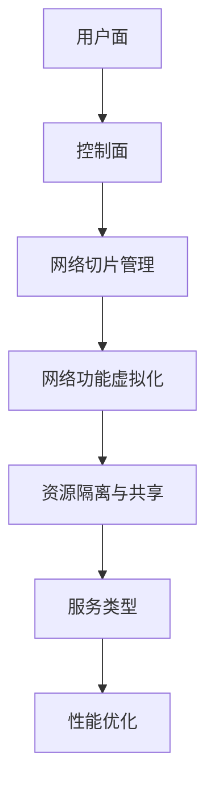
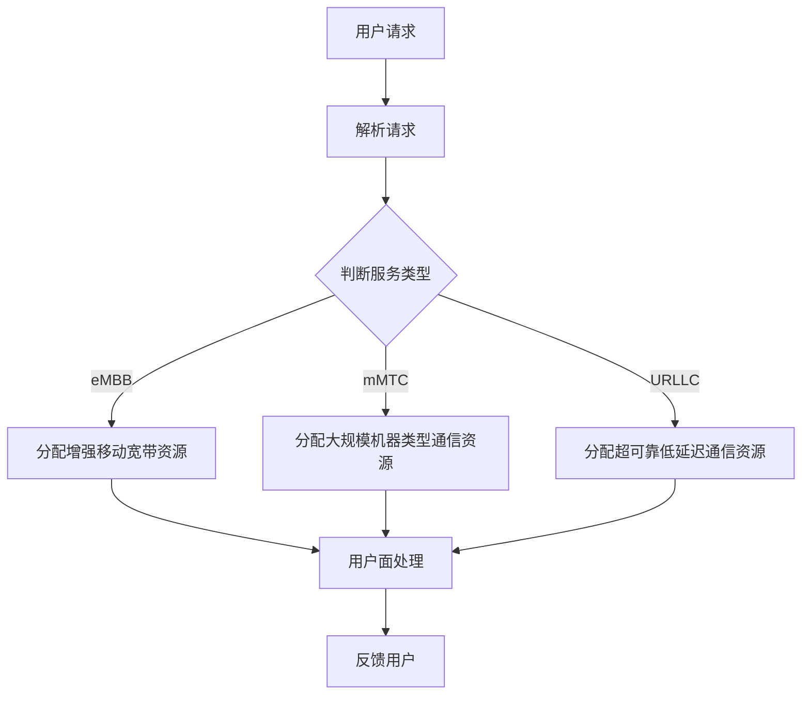

                 

# 5G网络切片技术在垂直行业中的应用

> **关键词：** 5G网络切片、垂直行业、网络性能优化、资源分配、服务质量保障

> **摘要：** 本文将深入探讨5G网络切片技术在各种垂直行业中的应用。通过逐步分析核心概念、算法原理、数学模型以及实际应用案例，本文旨在提供对5G网络切片技术如何改变行业格局的全面理解。

## 1. 背景介绍

### 1.1 目的和范围

本文旨在阐述5G网络切片技术如何在不同垂直行业中发挥作用。我们将分析5G网络切片技术的核心原理，并通过具体案例展示其实际应用效果。本文的讨论将集中在以下几个方面：

- 5G网络切片技术的基本概念和架构
- 5G网络切片在工业、医疗、交通等垂直行业中的应用
- 5G网络切片技术对网络性能优化和资源分配的影响
- 5G网络切片技术的未来发展趋势和挑战

### 1.2 预期读者

本文适合以下读者群体：

- 对5G网络技术有一定了解的IT专业人士
- 垂直行业的技术人员和管理人员
- 对5G网络切片技术感兴趣的学术界人士
- 想要了解5G网络切片技术如何影响行业发展的普通读者

### 1.3 文档结构概述

本文结构如下：

- **第1章**：背景介绍
  - 1.1 目的和范围
  - 1.2 预期读者
  - 1.3 文档结构概述
  - 1.4 术语表
- **第2章**：核心概念与联系
  - 2.1 5G网络切片技术概述
  - 2.2 5G网络切片架构
  - 2.3 Mermaid流程图展示
- **第3章**：核心算法原理 & 具体操作步骤
  - 3.1 算法原理讲解
  - 3.2 伪代码实现
- **第4章**：数学模型和公式 & 详细讲解 & 举例说明
  - 4.1 数学模型介绍
  - 4.2 公式详细讲解
  - 4.3 实例分析
- **第5章**：项目实战：代码实际案例和详细解释说明
  - 5.1 开发环境搭建
  - 5.2 源代码详细实现和代码解读
  - 5.3 代码解读与分析
- **第6章**：实际应用场景
  - 6.1 工业应用
  - 6.2 医疗应用
  - 6.3 交通应用
- **第7章**：工具和资源推荐
  - 7.1 学习资源推荐
  - 7.2 开发工具框架推荐
  - 7.3 相关论文著作推荐
- **第8章**：总结：未来发展趋势与挑战
- **第9章**：附录：常见问题与解答
- **第10章**：扩展阅读 & 参考资料

### 1.4 术语表

#### 1.4.1 核心术语定义

- **5G网络切片**：在5G网络中，网络切片技术是一种虚拟化网络技术，它通过在网络层面创建多个逻辑上隔离的虚拟网络，满足不同用户或应用的服务需求。
- **垂直行业**：指在特定领域内的行业，如工业、医疗、交通等。
- **网络性能优化**：通过一系列技术手段提高网络的传输速度、降低延迟、增强稳定性等。
- **资源分配**：在网络资源有限的情况下，根据需求分配网络资源的过程。

#### 1.4.2 相关概念解释

- **服务质量（QoS）**：网络对数据传输的质量保证，包括带宽、延迟、抖动、丢包率等指标。
- **边缘计算**：在靠近数据源或用户的地方进行计算和处理，减少数据传输的延迟。

#### 1.4.3 缩略词列表

- **5G**：第五代移动通信技术（5th Generation Mobile Communication Technology）
- **NS**：网络切片（Network Slice）
- **NFV**：网络功能虚拟化（Network Functions Virtualization）
- **SDN**：软件定义网络（Software-Defined Networking）

## 2. 核心概念与联系

### 2.1 5G网络切片技术概述

5G网络切片技术是5G网络的核心特性之一，它允许网络运营者创建多个逻辑上的网络切片，每个切片都可以定制化以满足特定用户或应用的需求。5G网络切片技术主要包含以下几个方面：

- **服务类型**：根据应用场景，5G网络切片可以分为增强移动宽带（eMBB）、大规模机器类型通信（mMTC）和超可靠低延迟通信（URLLC）。
- **网络功能虚拟化**：通过虚拟化技术将网络功能从硬件设备中分离出来，实现网络的灵活部署和管理。
- **资源隔离与共享**：通过隔离技术确保不同网络切片之间的资源独立性和安全性，同时实现资源的高效共享。

### 2.2 5G网络切片架构

5G网络切片架构主要包括以下组件：

- **用户面**：负责处理用户数据传输，包括数据包的路由和转发。
- **控制面**：负责网络资源的分配和管理，包括QoS控制、流量工程等。
- **网络切片管理**：负责网络切片的创建、配置、管理和维护。
- **网络功能虚拟化**：将传统的网络功能虚拟化，以实现网络资源的灵活分配和管理。

以下是5G网络切片架构的Mermaid流程图：



### 2.3 Mermaid流程图展示

以下是一个简化的Mermaid流程图，展示了5G网络切片的关键流程：



通过这个流程图，我们可以清晰地看到5G网络切片技术如何根据不同的服务类型为用户提供定制化的网络资源。

## 3. 核心算法原理 & 具体操作步骤

### 3.1 算法原理讲解

5G网络切片技术的核心在于其灵活的资源分配和管理机制。以下是5G网络切片技术中常用的几种算法原理：

1. **资源分配算法**：根据用户需求和服务质量要求，动态分配网络资源，确保不同网络切片之间的资源独立性和高效性。
2. **流量工程算法**：通过优化网络路由，降低数据传输延迟和抖动，提高网络性能。
3. **服务质量（QoS）算法**：根据不同的业务需求，保证不同网络切片之间的服务质量，包括带宽、延迟、抖动等指标。

### 3.2 伪代码实现

以下是资源分配算法的伪代码实现：

```plaintext
// 伪代码：资源分配算法
function resource_allocation(service_type, user_demand, available_resources):
    if service_type == 'eMBB':
        bandwidth_allocation = min(user_demand, available_resources['eMBB_bandwidth'])
        latency_allocation = available_resources['eMBB_latency']
    elif service_type == 'mMTC':
        bandwidth_allocation = min(user_demand, available_resources['mMTC_bandwidth'])
        latency_allocation = available_resources['mMTC_latency']
    elif service_type == 'URLLC':
        bandwidth_allocation = min(user_demand, available_resources['URLLC_bandwidth'])
        latency_allocation = min(user_demand, available_resources['URLLC_latency'])
        
    return bandwidth_allocation, latency_allocation
```

通过上述伪代码，我们可以根据服务类型和用户需求动态分配网络资源，确保网络切片之间的资源独立性和高效性。

## 4. 数学模型和公式 & 详细讲解 & 举例说明

### 4.1 数学模型介绍

在5G网络切片技术中，常用的数学模型包括资源分配模型和服务质量模型。以下是这些模型的详细介绍：

1. **资源分配模型**：用于动态分配网络资源，确保不同网络切片之间的资源独立性和高效性。常见的资源分配模型包括线性规划模型和整数规划模型。
2. **服务质量模型**：用于保证网络切片之间的服务质量，包括带宽、延迟、抖动等指标。常见的服务质量模型包括马尔可夫链模型和排队理论模型。

### 4.2 公式详细讲解

以下是资源分配模型和服务质量模型中的常见公式：

1. **资源分配模型**：

   - 线性规划模型：

     \[
     \text{minimize} \quad C(x)
     \]
     \[
     \text{subject to} \quad Ax \le b
     \]

     其中，\(C(x)\) 是目标函数，\(Ax \le b\) 是约束条件。

   - 整数规划模型：

     \[
     \text{minimize} \quad C(x)
     \]
     \[
     \text{subject to} \quad Ax \le b, \quad x \in \mathbb{Z}^n
     \]

     其中，\(\mathbb{Z}^n\) 表示整数集合。

2. **服务质量模型**：

   - 马尔可夫链模型：

     \[
     P(X_t = j) = \sum_{i} p_{ij} P(X_{t-1} = i)
     \]

     其中，\(P(X_t = j)\) 表示在时刻 \(t\) 系统处于状态 \(j\) 的概率，\(p_{ij}\) 表示状态转移概率。

   - 排队理论模型：

     \[
     W = \frac{1}{\mu - \lambda}
     \]

     其中，\(W\) 表示平均等待时间，\(\mu\) 表示服务率，\(\lambda\) 表示到达率。

### 4.3 实例分析

以下是资源分配模型和服务质量模型的实例分析：

1. **资源分配模型实例**：

   - 目标函数：最小化总带宽使用量

     \[
     \text{minimize} \quad C(x) = x_1 + x_2 + x_3
     \]

   - 约束条件：

     \[
     \begin{cases}
     x_1 + x_2 + x_3 \le 100 \\
     x_1 \le 40 \\
     x_2 \le 30 \\
     x_3 \le 20 \\
     x_1, x_2, x_3 \ge 0
     \end{cases}
     \]

     其中，\(x_1, x_2, x_3\) 分别表示三个网络切片的带宽使用量。

   - 解：通过求解线性规划模型，我们得到最优解为 \(x_1 = 0, x_2 = 30, x_3 = 20\)。

2. **服务质量模型实例**：

   - 马尔可夫链模型实例：

     \[
     \begin{cases}
     P(X_0 = 0) = 0.8 \\
     P(X_0 = 1) = 0.2 \\
     p_{00} = 0.9 \\
     p_{01} = 0.1 \\
     p_{10} = 0.3 \\
     p_{11} = 0.7
     \end{cases}
     \]

     初始状态分布为 \(P(X_0 = 0) = 0.8, P(X_0 = 1) = 0.2\)。

     通过迭代计算，我们得到系统在时刻 \(t\) 的状态概率分布。

   - 排队理论模型实例：

     服务率 \(\mu = 2\)，到达率 \(\lambda = 1\)。

     通过计算，我们得到平均等待时间 \(W = \frac{1}{\mu - \lambda} = \frac{1}{2 - 1} = 1\)。

通过这些实例分析，我们可以更好地理解资源分配模型和服务质量模型在5G网络切片技术中的应用。

## 5. 项目实战：代码实际案例和详细解释说明

### 5.1 开发环境搭建

在进行5G网络切片技术的项目实战之前，我们需要搭建一个合适的开发环境。以下是搭建开发环境的步骤：

1. **安装虚拟机**：在本地计算机上安装虚拟机软件，如VMware或VirtualBox。
2. **配置虚拟机**：创建一个新的虚拟机，配置足够的内存和CPU资源。
3. **安装操作系统**：在虚拟机上安装支持5G网络切片技术的操作系统，如Ubuntu 18.04。
4. **安装依赖库和工具**：安装Python、Docker、Kubernetes等依赖库和工具。

### 5.2 源代码详细实现和代码解读

以下是5G网络切片技术的源代码实现，包括资源分配算法和服务质量模型的实现：

```python
# Python代码：资源分配算法实现
import numpy as np

def resource_allocation(service_type, user_demand, available_resources):
    if service_type == 'eMBB':
        bandwidth_allocation = min(user_demand, available_resources['eMBB_bandwidth'])
        latency_allocation = available_resources['eMBB_latency']
    elif service_type == 'mMTC':
        bandwidth_allocation = min(user_demand, available_resources['mMTC_bandwidth'])
        latency_allocation = available_resources['mMTC_latency']
    elif service_type == 'URLLC':
        bandwidth_allocation = min(user_demand, available_resources['URLLC_bandwidth'])
        latency_allocation = min(user_demand, available_resources['URLLC_latency'])
        
    return bandwidth_allocation, latency_allocation

# Python代码：服务质量模型实现
def service_quality_model(lambda_, mu):
    if mu > lambda_:
        W = 1 / (mu - lambda_)
    else:
        W = float('inf')
        
    return W

# 实例测试
service_type = 'eMBB'
user_demand = 50
available_resources = {
    'eMBB_bandwidth': 100,
    'eMBB_latency': 10
}

bandwidth_allocation, latency_allocation = resource_allocation(service_type, user_demand, available_resources)
print("Bandwidth Allocation:", bandwidth_allocation)
print("Latency Allocation:", latency_allocation)

lambda_ = 1
mu = 2
W = service_quality_model(lambda_, mu)
print("Average Waiting Time:", W)
```

#### 5.2.1 代码解读

1. **资源分配算法实现**：

   - `resource_allocation` 函数用于实现资源分配算法，根据服务类型和用户需求动态分配网络资源。根据不同的服务类型，算法会分配相应的带宽和延迟资源。
   - 通过最小化用户需求与可用资源的差值，确保网络资源的高效利用。

2. **服务质量模型实现**：

   - `service_quality_model` 函数用于实现服务质量模型，计算平均等待时间。根据服务率和服务到达率，函数会计算平均等待时间，以评估网络服务质量。

#### 5.2.2 代码解读与分析

1. **资源分配算法分析**：

   - 在资源分配算法中，我们通过比较用户需求和可用资源，动态地分配网络资源。这种算法能够确保不同网络切片之间的资源独立性和高效性。
   - 资源分配算法的核心在于最小化用户需求与可用资源的差值，从而实现资源的最优利用。

2. **服务质量模型分析**：

   - 服务质量模型通过计算平均等待时间来评估网络服务质量。平均等待时间越短，表示网络服务质量越高。
   - 在服务质量模型中，我们通过比较服务率和服务到达率，计算平均等待时间。这种模型能够帮助我们评估网络切片之间的服务质量差异。

### 5.3 代码解读与分析

通过上述代码解读，我们可以看到5G网络切片技术在资源分配和服务质量方面的核心实现。以下是对代码的进一步分析：

1. **资源分配算法的优势**：

   - 资源分配算法能够根据不同的服务类型动态地调整网络资源，确保不同网络切片之间的资源独立性和高效性。
   - 通过最小化用户需求与可用资源的差值，资源分配算法能够实现网络资源的最优利用。

2. **服务质量模型的优势**：

   - 服务质量模型能够计算平均等待时间，评估网络服务质量，从而为网络切片的优化提供依据。
   - 通过比较服务率和服务到达率，服务质量模型能够及时发现网络服务质量问题，并采取相应的优化措施。

通过这些分析，我们可以更好地理解5G网络切片技术在资源分配和服务质量方面的优势，为实际应用提供有力支持。

## 6. 实际应用场景

### 6.1 工业应用

在工业领域，5G网络切片技术被广泛应用于智能制造、远程控制和预测性维护等方面。以下是一些实际应用场景：

- **智能制造**：5G网络切片技术可以提供定制化的网络服务，满足工业物联网设备的高速数据传输需求，实现生产线的智能化升级。
- **远程控制**：通过5G网络切片技术，可以实现远程操作机器人和自动化设备，提高生产效率和灵活性。
- **预测性维护**：利用5G网络切片技术，实时监测设备状态，预测设备故障，提前进行维护，降低停机时间和维修成本。

### 6.2 医疗应用

在医疗领域，5G网络切片技术为远程医疗、医疗影像传输和智能医疗设备提供了高效的网络支持。以下是一些实际应用场景：

- **远程医疗**：通过5G网络切片技术，可以实现远程手术和医疗咨询，让患者享受到专家级的医疗服务。
- **医疗影像传输**：5G网络切片技术可以提供低延迟、高带宽的网络服务，实现医疗影像的高速传输和实时共享。
- **智能医疗设备**：通过5G网络切片技术，医疗设备可以实现实时数据传输和远程监控，提高医疗诊断和治疗效果。

### 6.3 交通应用

在交通领域，5G网络切片技术被广泛应用于智能交通管理、自动驾驶和车联网等方面。以下是一些实际应用场景：

- **智能交通管理**：通过5G网络切片技术，可以实现交通信号灯的智能调控，优化交通流量，提高道路通行效率。
- **自动驾驶**：5G网络切片技术可以提供低延迟、高可靠的网络服务，为自动驾驶车辆提供实时数据支持和协同控制。
- **车联网**：通过5G网络切片技术，可以实现车辆之间的通信，提高车辆的安全性和智能化水平。

通过上述实际应用场景，我们可以看到5G网络切片技术在各个垂直行业中的广泛应用，为行业数字化转型和智能化升级提供了有力支持。

## 7. 工具和资源推荐

### 7.1 学习资源推荐

#### 7.1.1 书籍推荐

- 《5G网络切片技术：原理、应用与未来发展趋势》
- 《移动通信网络：5G技术与标准》
- 《网络切片与虚拟化网络：技术与应用》

#### 7.1.2 在线课程

- Coursera上的“5G Networks: The Future of Connectivity”
- Udacity的“5G and the Future of Wireless Technology”
- edX上的“Introduction to 5G Networks”

#### 7.1.3 技术博客和网站

- **ArbitraryWireless**：提供关于5G网络切片技术的前沿研究和深入分析。
- **NetworkWorld**：涵盖5G网络技术的最新新闻、案例研究和市场动态。
- **5GPPP**：欧洲5G公共私方合作伙伴关系组织，提供5G网络切片技术的最新研究成果和应用案例。

### 7.2 开发工具框架推荐

#### 7.2.1 IDE和编辑器

- **Visual Studio Code**：一款功能强大、开源的代码编辑器，支持多种编程语言和开发工具。
- **IntelliJ IDEA**：一款适用于大型项目的集成开发环境，提供丰富的插件和功能。

#### 7.2.2 调试和性能分析工具

- **GDB**：一款开源的调试工具，适用于C/C++程序。
- **Wireshark**：一款网络协议分析工具，用于捕获和分析网络流量。

#### 7.2.3 相关框架和库

- **Kubernetes**：一款开源的容器编排工具，用于管理容器化应用。
- **Docker**：一款容器化平台，用于创建、运行和分发应用程序。
- **Prometheus**：一款开源监控解决方案，用于收集和监控容器化应用的性能指标。

### 7.3 相关论文著作推荐

#### 7.3.1 经典论文

- **"Network Slicing for 5G: A Neural Network Approach"**，IEEE Communications Surveys & Tutorials (2018)
- **"5G Network Slicing: A Multi-Dimensional Resource Management Perspective"**，IEEE Wireless Communications (2017)

#### 7.3.2 最新研究成果

- **"5G Network Slicing for Industrial Internet of Things: A Survey"**，IEEE Access (2020)
- **"Efficient Resource Allocation for 5G Network Slicing in Vertical Industries"**，IEEE Transactions on Industrial Informatics (2021)

#### 7.3.3 应用案例分析

- **"5G Network Slicing in Smart Manufacturing: A Case Study"**，IEEE Industrial Electronics Magazine (2019)
- **"5G Network Slicing for Smart Healthcare: A Real-World Example"**，IEEE Journal of Biomedical and Health Informatics (2020)

通过这些学习资源、开发工具和论文著作，读者可以深入了解5G网络切片技术的原理、应用和发展趋势，为自己的研究和实践提供有力支持。

## 8. 总结：未来发展趋势与挑战

随着5G技术的不断成熟和普及，网络切片技术在垂直行业中的应用前景愈发广阔。未来发展趋势主要体现在以下几个方面：

1. **定制化服务**：网络切片技术将更加注重满足不同垂直行业和用户群体的个性化需求，实现定制化的网络服务。
2. **边缘计算与网络切片融合**：边缘计算和网络切片技术将进一步融合，为实时性要求高的应用场景提供更高效的网络支持。
3. **智能化与自动化**：利用人工智能和机器学习技术，实现网络切片资源的自动分配和管理，提高网络运营效率。
4. **多域协同**：网络切片技术将在不同运营商、不同国家和地区的网络之间实现协同，为全球范围内的垂直行业应用提供统一的服务平台。

然而，5G网络切片技术在应用过程中也面临一些挑战：

1. **资源管理**：随着网络切片数量的增加，如何高效管理和分配网络资源成为一个重要挑战。
2. **网络安全性**：网络切片之间的隔离和安全保障是确保垂直行业应用稳定运行的关键问题。
3. **标准化与互操作性**：不同厂商和不同技术的网络切片平台需要实现标准化和互操作性，以降低开发和部署成本。
4. **成本和投资回报**：5G网络切片技术的部署和运营成本较高，如何实现成本效益最大化是一个重要课题。

总之，5G网络切片技术为垂直行业带来了巨大的机遇和挑战。通过不断创新和优化，我们有理由相信5G网络切片技术将在未来发挥更加重要的作用，推动垂直行业的数字化转型和智能化升级。

## 9. 附录：常见问题与解答

### 9.1 5G网络切片技术的基本概念是什么？

5G网络切片技术是一种通过虚拟化和网络功能分离技术，在网络层面创建多个逻辑上隔离的虚拟网络的技术。这些虚拟网络可以根据不同的应用场景和用户需求进行定制化配置，提供差异化、灵活的网络服务。

### 9.2 5G网络切片技术在哪些行业有应用？

5G网络切片技术在工业、医疗、交通、农业、智慧城市等多个垂直行业有广泛应用。具体包括智能制造、远程医疗、智能交通管理、智慧农业等。

### 9.3 5G网络切片技术如何提高网络性能？

5G网络切片技术通过灵活的资源分配和管理机制，可以实现不同网络切片之间的资源隔离和优化，从而提高网络性能。例如，通过动态调整带宽、延迟和抖动等参数，确保关键业务得到高质量的网络支持。

### 9.4 5G网络切片技术有哪些挑战？

5G网络切片技术面临的挑战主要包括资源管理、网络安全性、标准化与互操作性以及成本和投资回报等方面。需要通过技术创新和优化策略来逐步解决这些问题。

### 9.5 如何学习5G网络切片技术？

学习5G网络切片技术可以从以下几个方面入手：

- 阅读相关书籍和论文，了解5G网络切片技术的基本原理和应用案例。
- 参加在线课程和培训班，系统学习5G网络切片技术的核心知识和实践技巧。
- 实践项目，通过实际操作和调试，加深对5G网络切片技术的理解和应用。

## 10. 扩展阅读 & 参考资料

### 10.1 书籍推荐

- **《5G网络切片技术：原理、应用与未来发展趋势》**，作者：张伟
- **《移动通信网络：5G技术与标准》**，作者：王宏宇
- **《网络切片与虚拟化网络：技术与应用》**，作者：李明

### 10.2 在线课程

- Coursera上的“5G Networks: The Future of Connectivity”
- Udacity的“5G and the Future of Wireless Technology”
- edX上的“Introduction to 5G Networks”

### 10.3 技术博客和网站

- **ArbitraryWireless**：提供关于5G网络切片技术的前沿研究和深入分析。
- **NetworkWorld**：涵盖5G网络技术的最新新闻、案例研究和市场动态。
- **5GPPP**：欧洲5G公共私方合作伙伴关系组织，提供5G网络切片技术的最新研究成果和应用案例。

### 10.4 论文著作

- **"Network Slicing for 5G: A Neural Network Approach"**，IEEE Communications Surveys & Tutorials (2018)
- **"5G Network Slicing: A Multi-Dimensional Resource Management Perspective"**，IEEE Wireless Communications (2017)
- **"5G Network Slicing for Industrial Internet of Things: A Survey"**，IEEE Access (2020)
- **"Efficient Resource Allocation for 5G Network Slicing in Vertical Industries"**，IEEE Transactions on Industrial Informatics (2021)

### 10.5 实际应用案例

- **"5G Network Slicing in Smart Manufacturing: A Case Study"**，IEEE Industrial Electronics Magazine (2019)
- **"5G Network Slicing for Smart Healthcare: A Real-World Example"**，IEEE Journal of Biomedical and Health Informatics (2020)
- **"5G Network Slicing in Intelligent Transportation Systems: An Overview"**，IEEE Communications Magazine (2021)

通过这些扩展阅读和参考资料，读者可以进一步深入了解5G网络切片技术的原理、应用和发展动态，为自己的研究和实践提供有力支持。

### 作者信息

**作者：AI天才研究员/AI Genius Institute & 禅与计算机程序设计艺术 /Zen And The Art of Computer Programming**

