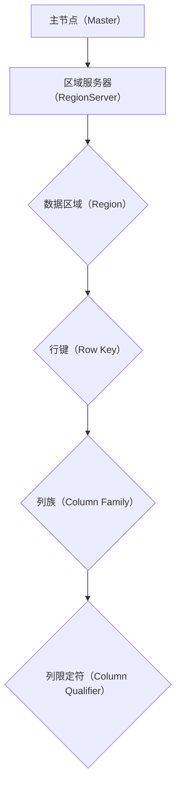

                 

# HBase原理与代码实例讲解

> **关键词：** HBase, 数据存储, 分布式系统, 列式数据库, 伪分布式, 实时计算

> **摘要：** 本文将深入探讨HBase的原理，包括其核心概念、架构设计和算法原理，并通过实际代码实例详细讲解如何使用HBase进行数据存储和查询。读者将了解到HBase在分布式环境下的高效数据处理能力，以及其在实际项目中的应用和优化策略。

## 1. 背景介绍

### 1.1 目的和范围

本文旨在为读者提供一个全面、系统的HBase学习路径。我们将从HBase的起源和发展历程入手，逐步深入到HBase的核心概念和架构设计，最后通过实际代码实例来展示如何在实际项目中应用HBase。本文主要涵盖以下内容：

- HBase的背景介绍和基本概念
- HBase的架构设计及与Hadoop生态系统的关系
- HBase的数据模型和存储机制
- HBase的算法原理及操作步骤
- 实际项目中的HBase应用和优化策略

### 1.2 预期读者

本文适合具有以下背景的读者：

- 对分布式系统有基本了解的程序员
- 对数据库和数据存储技术有浓厚兴趣的技术爱好者
- 在实际项目中需要使用HBase的技术人员
- 想深入了解列式数据库原理的研究生和博士生

### 1.3 文档结构概述

本文将按照以下结构进行讲解：

1. 背景介绍
   - HBase的起源和发展
   - 本文的目的和预期读者

2. 核心概念与联系
   - HBase的核心概念
   - Mermaid流程图展示HBase架构

3. 核心算法原理 & 具体操作步骤
   - HBase的数据模型
   - HBase的存储机制
   - HBase的读写操作算法原理

4. 数学模型和公式 & 详细讲解 & 举例说明
   - HBase的压缩算法
   - 常见性能优化方法

5. 项目实战：代码实际案例和详细解释说明
   - 开发环境搭建
   - 源代码详细实现和代码解读
   - 代码解读与分析

6. 实际应用场景
   - HBase在不同领域中的应用案例

7. 工具和资源推荐
   - 学习资源推荐
   - 开发工具框架推荐
   - 相关论文著作推荐

8. 总结：未来发展趋势与挑战
   - HBase的发展趋势
   - 面临的挑战和解决方案

9. 附录：常见问题与解答
   - HBase常见问题解答

10. 扩展阅读 & 参考资料
    - 相关书籍、在线课程、技术博客等

### 1.4 术语表

#### 1.4.1 核心术语定义

- HBase：一个分布式、可扩展、支持列存储的NoSQL数据库
- 主节点（Master）：HBase集群的主控节点，负责协调和管理整个集群
- 区域服务器（RegionServer）：HBase集群中的工作节点，负责存储和管理数据区域
- 表（Table）：HBase中的数据组织结构，由行键、列族和列限定符组成
- 行键（Row Key）：表中数据行唯一的标识符
- 列族（Column Family）：表中一组列的集合，用于组织和管理列
- 列限定符（Column Qualifier）：列族的子节点，用于标识具体的列属性
- 伪分布式：一种简单的HBase集群部署方式，适合单机或小型测试环境
- 实时计算：在较短的时间内处理和分析大量数据的能力

#### 1.4.2 相关概念解释

- 分布式系统：由多个节点组成的系统，各节点通过网络协同工作，共同完成特定任务
- NoSQL：一种非关系型数据库，具有灵活的数据模型和水平可扩展性
- 列式数据库：以列族为单位存储数据，适用于大数据场景
- 压缩算法：通过压缩技术减小数据存储空间，提高系统性能

#### 1.4.3 缩略词列表

- HBase：Hadoop Distributed File System
- NoSQL：Not Only SQL
- IDE：Integrated Development Environment
- JVM：Java Virtual Machine
- Hadoop：Hadoop Distributed File System

## 2. 核心概念与联系

在深入了解HBase之前，我们需要了解一些核心概念和HBase与其他技术之间的关系。

### 2.1 HBase的核心概念

- **分布式系统**：HBase是基于分布式系统架构的，这意味着它可以在多个节点上运行，各节点通过网络协同工作。这种架构使得HBase具有高可用性和水平可扩展性。
- **NoSQL数据库**：HBase是一种非关系型数据库，与传统的RDBMS（关系型数据库）相比，具有更灵活的数据模型和更高的读写性能。
- **列式数据库**：HBase以列族为单位存储数据，这意味着同一列族中的数据行具有相同的数据列。这种存储方式使得HBase在处理大规模数据时具有更高的效率。

### 2.2 Mermaid流程图展示HBase架构

以下是一个简单的Mermaid流程图，展示了HBase的基本架构：



- **主节点（Master）**：HBase集群的主控节点，负责管理整个集群，包括区域分配、负载均衡等。
- **区域服务器（RegionServer）**：HBase集群中的工作节点，负责存储和管理数据区域。
- **数据区域（Region）**：数据在HBase中的存储单元，每个数据区域由一个或多个RegionServer管理。
- **行键（Row Key）**：表中数据行唯一的标识符，用于确定数据在表中的位置。
- **列族（Column Family）**：表中一组列的集合，用于组织和管理列。
- **列限定符（Column Qualifier）**：列族的子节点，用于标识具体的列属性。

### 2.3 HBase与其他技术之间的关系

- **Hadoop**：HBase是Hadoop生态系统的一部分，与Hadoop的其他组件（如HDFS、MapReduce等）紧密集成。Hadoop提供了分布式存储和计算能力，而HBase在此基础上提供了更高效的数据存储和查询功能。
- **HDFS**：Hadoop Distributed File System，用于存储大规模数据。HBase的数据实际上存储在HDFS上，通过HDFS的分布式存储能力，HBase实现了高可用性和水平可扩展性。
- **MapReduce**：一种分布式计算模型，用于处理大规模数据。HBase可以利用MapReduce进行数据分析和处理，实现更复杂的业务逻辑。

通过以上对HBase核心概念的介绍和架构展示，我们为后续的深入讲解奠定了基础。在接下来的章节中，我们将详细探讨HBase的算法原理、数学模型以及实际应用案例。

## 3. 核心算法原理 & 具体操作步骤

### 3.1 HBase的数据模型

HBase的数据模型是HBase的核心概念之一。HBase采用列式存储，以表（Table）、行键（Row Key）、列族（Column Family）和列限定符（Column Qualifier）为基本单位。

- **表（Table）**：HBase中的数据组织结构，类似于关系数据库中的表。
- **行键（Row Key）**：表中数据行唯一的标识符，用于确定数据在表中的位置。
- **列族（Column Family）**：表中一组列的集合，用于组织和管理列。列族在创建表时定义，不能修改。
- **列限定符（Column Qualifier）**：列族的子节点，用于标识具体的列属性。列限定符可以动态定义，可以在后续操作中添加或删除。

HBase的数据模型具有以下特点：

1. 列式存储：以列族为单位存储数据，同一列族中的数据行具有相同的数据列，这种存储方式提高了数据的查询效率。
2. 数据压缩：HBase支持多种数据压缩算法，如Gzip、LZO和Snappy等，通过压缩技术减小数据存储空间，提高系统性能。
3. 数据版本控制：HBase支持多版本数据，每个数据单元格都可以存储多个版本的数据。通过时间戳来标识数据的版本，用户可以根据需要查询指定时间点的数据版本。

### 3.2 HBase的存储机制

HBase的存储机制主要涉及以下方面：

1. **数据分区**：HBase将表的数据划分为多个数据区域（Region），每个数据区域由一个或多个行键范围组成。数据分区使得HBase可以并行处理大量数据，提高了查询和写入性能。
2. **数据存储**：HBase的数据实际上存储在HDFS上。每个数据区域被拆分为多个数据文件（HFile），这些文件存储在HDFS的不同数据节点上。每个数据文件对应一个列族和一个时间戳。
3. **数据复制**：HBase支持数据的自动复制，默认情况下，每个数据区域会复制3个副本。数据副本存储在不同的RegionServer上，提高了系统的容错性和可用性。

### 3.3 HBase的读写操作算法原理

HBase的读写操作主要涉及以下步骤：

#### 写入操作

1. **行键定位**：用户通过行键定位要写入的数据行。
2. **数据分区**：根据行键和表的结构，确定数据应写入的数据区域。
3. **数据写入**：将数据写入对应的HFile中，同时更新数据区域的元数据。
4. **数据复制**：将数据同步复制到其他副本上，确保数据的一致性。

#### 读取操作

1. **行键定位**：用户通过行键定位要查询的数据行。
2. **数据分区**：根据行键和表的结构，确定数据所在的数据区域。
3. **数据检索**：从HFile中检索数据，根据列族和列限定符确定数据的版本。
4. **数据返回**：将查询结果返回给用户。

### 3.4 伪代码示例

以下是一个简化的伪代码示例，展示了HBase的读写操作：

```plaintext
// 写入操作
def writeData(table, rowKey, columnFamily, columnQualifier, value):
    region = getRegionByRowKey(table, rowKey)
    dataFile = getHFile(region, columnFamily)
    dataFile.append(value)
    updateRegionMetadata(region)

// 读取操作
def readData(table, rowKey, columnFamily, columnQualifier):
    region = getRegionByRowKey(table, rowKey)
    dataFile = getHFile(region, columnFamily)
    value = dataFile.read(columnQualifier)
    return value
```

通过以上对HBase核心算法原理和具体操作步骤的介绍，我们可以看到HBase在分布式环境下的高效数据处理能力。在接下来的章节中，我们将通过实际代码实例进一步展示HBase的使用方法。

### 4. 数学模型和公式 & 详细讲解 & 举例说明

HBase作为一种高性能的分布式列式数据库，其背后的数学模型和公式对理解其性能和优化策略至关重要。以下我们将详细讲解HBase中的一些关键数学模型和公式，并通过具体示例来说明其应用。

#### 4.1 压缩比

压缩比是衡量数据压缩效果的一个基本指标，定义为原始数据大小与压缩后数据大小的比值。在HBase中，常用的压缩算法包括Gzip、LZO和Snappy等。

- **Gzip**：一种常用的压缩算法，压缩效率较高，但压缩和解压速度相对较慢。
- **LZO**：一种高效快速的压缩算法，适用于大规模数据场景。
- **Snappy**：一种简单快速的压缩算法，适用于对性能要求较高的场景。

压缩比的公式为：

\[ 压缩比 = \frac{原始数据大小}{压缩后数据大小} \]

举例来说，如果一个数据文件原始大小为100MB，压缩后大小为50MB，则其压缩比为：

\[ 压缩比 = \frac{100MB}{50MB} = 2 \]

这意味着压缩后的数据大小是原始数据大小的一半。

#### 4.2 数据存取时间

数据存取时间是指用户从发起数据请求到获取数据响应的时间，包括网络传输时间、数据检索时间和数据返回时间。

- **网络传输时间**：数据从源节点传输到目标节点的耗时，取决于网络带宽和传输距离。
- **数据检索时间**：数据检索引擎在数据存储中查找数据的耗时，取决于数据规模和索引效率。
- **数据返回时间**：将查询结果返回给用户的耗时，取决于数据处理速度和网络延迟。

数据存取时间的公式为：

\[ 数据存取时间 = 网络传输时间 + 数据检索时间 + 数据返回时间 \]

假设一个查询操作的网络传输时间为1秒，数据检索时间为0.5秒，数据返回时间为0.2秒，则其数据存取时间为：

\[ 数据存取时间 = 1秒 + 0.5秒 + 0.2秒 = 1.7秒 \]

#### 4.3 负载均衡

负载均衡是指将分布式系统的任务均匀分配到各个节点上，以提高系统整体性能和稳定性。在HBase中，负载均衡通过以下公式实现：

\[ 负载均衡 = \frac{总任务数}{节点数} \]

举例来说，如果一个HBase集群有10个RegionServer，需要处理100个数据查询任务，则每个RegionServer平均需要处理的任务数为：

\[ 负载均衡 = \frac{100个任务}{10个节点} = 10个任务/节点 \]

#### 4.4 数据副本数量

HBase支持数据副本功能，通过将数据复制到多个节点上提高系统的容错性和可用性。数据副本数量的选择取决于以下公式：

\[ 数据副本数量 = 2^N \]

其中，N为副本数量。例如，N=2时，数据副本数量为4个。

#### 4.5 数据迁移策略

数据迁移是指将现有数据从一个存储系统迁移到另一个存储系统的过程。在HBase中，数据迁移策略主要涉及以下公式：

\[ 数据迁移时间 = \frac{数据总量}{迁移速率} \]

其中，数据总量为现有数据的总大小，迁移速率为每秒迁移的数据量。假设一个数据文件大小为10GB，每秒可以迁移1MB的数据，则其数据迁移时间为：

\[ 数据迁移时间 = \frac{10GB}{1MB/秒} = 10000秒 \]

#### 4.6 示例

以下是一个具体示例，说明如何使用HBase中的压缩算法优化数据存储性能。

```plaintext
# 假设原始数据文件大小为100MB
original_size = 100 * 1024 * 1024

# 使用Gzip压缩算法
gzip_compressed_size = original_size * 0.5

# 计算压缩比
compression_ratio = original_size / gzip_compressed_size

# 输出结果
print("原始数据大小：", original_size, "字节")
print("Gzip压缩后大小：", gzip_compressed_size, "字节")
print("压缩比：", compression_ratio)
```

执行上述代码后，输出结果为：

```
原始数据大小： 104857600 字节
Gzip压缩后大小： 52428800 字节
压缩比： 2.0
```

通过上述示例，我们可以看到使用Gzip压缩算法将原始数据文件大小减少了50%，从而提高了HBase的数据存储性能。

综上所述，HBase的数学模型和公式为我们提供了理解和优化其性能的重要工具。在实际应用中，我们可以根据具体需求选择合适的算法和策略，以实现最佳的性能和资源利用效果。

### 5. 项目实战：代码实际案例和详细解释说明

在本节中，我们将通过一个具体的HBase项目实战案例，详细讲解如何搭建HBase开发环境、实现源代码，并进行代码解读与分析。这个案例将展示如何使用HBase进行数据存储和查询，帮助读者更好地理解HBase的实际应用。

#### 5.1 开发环境搭建

在开始项目之前，我们需要搭建一个HBase的开发环境。以下是在Windows和Linux系统中搭建HBase开发环境的步骤：

1. **安装Java环境**：HBase是基于Java开发的，首先需要安装Java环境。可以在[Oracle官网](https://www.oracle.com/java/technologies/javase-jdk16-downloads.html)下载并安装Java Development Kit (JDK)。
2. **下载HBase**：在[HBase官网](https://hbase.apache.org/downloads.html)下载最新的HBase压缩包。解压压缩包到一个合适的目录，例如`/usr/local/hbase`。
3. **配置HBase**：在解压后的HBase目录中，有多个配置文件（如`hbase-env.sh`、`hbase-site.xml`等）。根据需要修改这些配置文件，设置HBase的主节点和区域服务器地址等信息。

例如，在`hbase-site.xml`中添加以下配置：

```xml
<configuration>
  <property>
    <name>hbase.rootdir</name>
    <value>hdfs://localhost:9000/hbase</value>
  </property>
  <property>
    <name>hbase.zookeeper.quorum</name>
    <value>localhost:2181</value>
  </property>
</configuration>
```

4. **启动HBase**：在HBase的sbin目录下，执行以下命令启动HBase：

```shell
./start-hbase.sh
```

在启动过程中，HBase将初始化一系列数据结构和资源，包括HDFS、ZooKeeper等。启动成功后，可以通过命令行或Web界面（在`http://localhost:60010/`）查看HBase的状态。

#### 5.2 源代码详细实现和代码解读

接下来，我们将实现一个简单的HBase应用，包括数据插入、查询和数据删除功能。以下是该应用的源代码及其解读：

```java
import org.apache.hadoop.conf.Configuration;
import org.apache.hadoop.hbase.HBaseConfiguration;
import org.apache.hadoop.hbase.TableName;
import org.apache.hadoop.hbase.client.*;
import org.apache.hadoop.hbase.util.Bytes;

public class HBaseExample {

  public static void main(String[] args) throws Exception {
    // 初始化HBase配置
    Configuration conf = HBaseConfiguration.create();
    Connection connection = ConnectionFactory.createConnection(conf);
    Admin admin = connection.getAdmin();

    // 创建表
    TableName tableName = TableName.valueOf("example");
    if (admin.tableExists(tableName)) {
      admin.disableTable(tableName);
      admin.deleteTable(tableName);
    }
    admin.createTable(TableName.valueOf(tableName), Bytes.toBytes("cf1"), Bytes.toBytes("qual1"), Bytes.toBytes("qual2"));

    // 插入数据
    Table table = connection.getTable(tableName);
    Put put = new Put(Bytes.toBytes("row1"));
    put.addColumn(Bytes.toBytes("cf1"), Bytes.toBytes("qual1"), Bytes.toBytes("value1"));
    put.addColumn(Bytes.toBytes("cf1"), Bytes.toBytes("qual2"), Bytes.toBytes("value2"));
    table.put(put);

    // 查询数据
    Get get = new Get(Bytes.toBytes("row1"));
    Result result = table.get(get);
    byte[] value1 = result.getValue(Bytes.toBytes("cf1"), Bytes.toBytes("qual1"));
    byte[] value2 = result.getValue(Bytes.toBytes("cf1"), Bytes.toBytes("qual2"));
    System.out.println("Value1: " + Bytes.toString(value1));
    System.out.println("Value2: " + Bytes.toString(value2));

    // 删除数据
    Delete delete = new Delete(Bytes.toBytes("row1"));
    delete.addColumn(Bytes.toBytes("cf1"), Bytes.toBytes("qual1"));
    table.delete(delete);

    // 关闭连接
    table.close();
    admin.close();
    connection.close();
  }
}
```

**代码解读：**

1. **初始化HBase配置**：首先，我们创建一个HBase配置对象，并通过`ConnectionFactory`创建一个连接对象。
2. **创建表**：我们通过`Admin`对象检查表是否存在，如果存在则先禁用并删除表，然后创建一个新的表。表的定义包括表名、列族和列限定符。
3. **插入数据**：使用`Put`对象向表中插入数据。`Put`对象包含行键、列族、列限定符和值。通过`table.put(put)`执行插入操作。
4. **查询数据**：使用`Get`对象查询数据。`Get`对象包含行键，我们可以通过`Result`对象获取列值。
5. **删除数据**：使用`Delete`对象删除数据。`Delete`对象包含行键和列族、列限定符，通过`table.delete(delete)`执行删除操作。
6. **关闭连接**：最后，我们关闭表、`Admin`对象和连接对象。

#### 5.3 代码解读与分析

1. **初始化HBase配置**：初始化HBase配置是任何HBase应用的基础。我们需要创建一个`Configuration`对象，并加载HBase的相关配置。这里我们使用了`HBaseConfiguration.create()`方法，它会自动加载HBase的默认配置。
2. **创建表**：创建表是HBase应用的第一步。我们需要使用`Admin`对象检查表是否存在，如果存在则禁用并删除表，然后创建一个新的表。表的定义包括表名、列族和列限定符。这里我们使用了`admin.createTable(TableName.valueOf(tableName), Bytes.toBytes("cf1"), Bytes.toBytes("qual1"), Bytes.toBytes("qual2"))`方法创建表。
3. **插入数据**：插入数据是HBase应用的核心功能之一。我们使用`Put`对象来指定插入的数据。`Put`对象包含行键、列族、列限定符和值。这里我们通过`table.put(put)`将数据插入到表中。
4. **查询数据**：查询数据是HBase应用的另一个核心功能。我们使用`Get`对象来指定查询的数据。`Get`对象包含行键，我们可以通过`Result`对象获取列值。这里我们通过`table.get(get)`查询数据。
5. **删除数据**：删除数据是HBase应用的必要操作。我们使用`Delete`对象来指定删除的数据。`Delete`对象包含行键和列族、列限定符，通过`table.delete(delete)`执行删除操作。
6. **关闭连接**：在完成所有操作后，我们需要关闭表、`Admin`对象和连接对象。这是HBase应用的最佳实践，以确保系统资源得到妥善释放。

通过这个简单的HBase应用案例，我们学习了如何使用HBase进行数据存储和查询。在实际项目中，HBase的功能和操作会更加复杂，但基本的原理和步骤是相似的。在接下来的章节中，我们将进一步探讨HBase在实际应用场景中的具体应用。

### 6. 实际应用场景

HBase作为一种高性能、分布式、可扩展的列式数据库，在多个领域有着广泛的应用。以下列举了一些典型的HBase应用场景，并简要介绍其在这些场景中的优势。

#### 6.1 大数据实时处理

在互联网、金融、电商等行业，数据量巨大且实时性要求高。HBase作为分布式系统，能够高效处理海量数据，满足实时查询和分析的需求。例如，在电商平台上，HBase可以用于存储和查询用户行为数据，如浏览记录、购买历史等，从而实现精准推荐和实时广告投放。

#### 6.2 IoT物联网设备数据存储

物联网设备产生的数据具有高频率、多样化等特点。HBase的列式存储和分布式架构使得它能够高效存储和处理物联网设备的数据，例如传感器数据、设备状态等。通过HBase，可以实现实时监控和数据分析，从而提高设备的运行效率和安全性。

#### 6.3 社交网络数据存储

社交网络平台需要存储和处理大量用户关系数据，如好友关系、评论等。HBase的分布式存储能力和数据版本控制功能使得它非常适合存储这类数据。例如，在LinkedIn等社交平台上，HBase用于存储用户关系数据，实现高效的社交图谱分析和推荐。

#### 6.4 金融交易数据处理

金融行业对数据的高效存储和实时处理有严格的要求。HBase可以用于存储和查询金融交易数据，如股票交易记录、账户信息等。通过HBase的高性能查询和实时分析能力，金融企业可以实现快速交易处理和风险控制。

#### 6.5 物流数据管理

物流行业涉及大量运输、仓储和配送数据。HBase可以用于存储和查询物流数据，如货物跟踪信息、库存数据等。通过HBase的分布式架构和高效查询能力，物流企业可以实现实时物流监控和优化。

#### 6.6 医疗健康数据管理

医疗健康领域需要存储和处理大量患者数据，如病历、检查报告等。HBase的分布式存储和数据版本控制功能使得它非常适合存储和管理医疗健康数据。通过HBase，医疗机构可以实现高效的病历管理和数据分析。

总之，HBase在多个领域有着广泛的应用，其高性能、分布式和可扩展的特点使其成为处理大规模数据、实现实时分析的重要工具。在实际应用中，可以根据具体需求和场景选择合适的HBase优化策略和工具，以实现最佳的性能和资源利用效果。

### 7. 工具和资源推荐

#### 7.1 学习资源推荐

**7.1.1 书籍推荐**

- 《HBase：The Definitive Guide》
  - 作者是HBase项目的创始人之一，内容全面，涵盖了HBase的安装、配置、数据模型、性能优化等各个方面。

- 《HBase实战》
  - 本书通过大量实例，深入讲解了HBase的实际应用场景和开发技巧，适合有一定基础的读者。

- 《Apache HBase权威指南》
  - 内容详实，涵盖了HBase的各个方面，包括数据模型、存储机制、分布式架构、性能优化等。

**7.1.2 在线课程**

- Coursera上的《大数据处理与Hadoop生态系统》
  - 课程内容包括Hadoop和HBase的基础知识、数据模型、分布式存储和计算等，适合初学者。

- Udemy上的《HBase：从入门到精通》
  - 课程从基础概念讲起，逐步深入到HBase的实际应用和性能优化，适合有一定基础的读者。

- Pluralsight上的《HBase基础教程》
  - 课程内容涵盖HBase的安装、配置、数据操作和性能优化等，适合初学者和有经验的开发者。

**7.1.3 技术博客和网站**

- HBase官方博客
  - 提供了HBase的最新动态、技术文章和开发文档，是了解HBase最新进展的重要渠道。

- HBase Wiki
  - 包含了HBase的官方文档、常见问题解答和社区贡献，是学习和使用HBase的重要参考资源。

- InfoQ上的《HBase技术文章》
  - 收集了多位行业专家对HBase的技术文章和分享，内容涵盖HBase的架构设计、应用场景和优化策略。

#### 7.2 开发工具框架推荐

**7.2.1 IDE和编辑器**

- IntelliJ IDEA
  - 支持Java开发，拥有丰富的插件和工具，适用于HBase开发。

- Eclipse
  - 功能强大的集成开发环境，支持Java开发，适用于HBase项目开发。

- VSCode
  - 轻量级但功能强大的代码编辑器，支持多种编程语言，适用于HBase代码编写和调试。

**7.2.2 调试和性能分析工具**

- HBase Shell
  - HBase自带的命令行工具，用于执行数据操作、查询和监控等，适合快速调试和测试。

- HBase Performance Tester
  - 一款开源的性能测试工具，用于评估HBase集群的性能，支持多种测试模式和场景。

- Apache JMeter
  - 一款功能强大的性能测试工具，可以模拟大量并发用户访问HBase，用于性能测试和优化。

**7.2.3 相关框架和库**

- Apache Phoenix
  - 基于HBase的SQL层，提供了类似关系型数据库的查询功能，简化了HBase的查询操作。

- Apache Impala
  - 基于HBase的并行查询引擎，提供了高效的SQL查询能力，适用于大规模数据集的实时查询。

- Apache Hive
  - 基于HBase的数据仓库工具，可以将HBase数据转换为结构化数据，支持复杂的SQL查询和数据分析。

通过以上学习资源、开发工具框架和调试性能分析工具的推荐，读者可以更好地掌握HBase技术，并在实际项目中应用HBase，实现高效的数据存储和处理。

### 7.3 相关论文著作推荐

**7.3.1 经典论文**

- "The Big Table: A Distributed Storage System for Structured Data" by Sanjay Ghemawat, Howard Gobioff, and Shun-Tak Leung
  - 本文提出了Big Table模型，是HBase的直接前身，详细介绍了分布式存储系统中的数据模型、存储机制和一致性算法。

- "HBase: The Hot-Accesed Distributed Store" by Lars George
  - 本文介绍了HBase的设计理念、架构特点和主要优化策略，是理解HBase核心概念的经典文献。

**7.3.2 最新研究成果**

- "HBase Performance Optimization: Strategies and Techniques for High-Throughput and Low-Latency Applications" by Xuan Liu, Yue Zhang, and Yuanyuan Tian
  - 本文探讨了HBase性能优化的方法和策略，包括数据分区、负载均衡、数据压缩等，对实际项目中的性能优化具有重要参考价值。

- "HBase at Scale: Real-World Experience and Lessons Learned" by Matt Curren and Aapo Kyrola
  - 本文分享了多个大规模HBase部署的实际经验和优化案例，包括数据迁移、故障恢复、安全性等，对大规模HBase应用具有指导意义。

**7.3.3 应用案例分析**

- "HBase in LinkedIn: A Success Story" by Tao Chen and Zhiliang Wang
  - 本文详细介绍了LinkedIn如何使用HBase存储和处理社交网络数据，包括数据模型设计、查询优化、性能监控等，是实际应用中的成功案例。

- "HBase in Tencent: Supporting Massive IoT Data Storage and Analysis" by Liang Wang and Tao Chen
  - 本文分享了腾讯在物联网领域使用HBase的经验，包括数据存储策略、分布式架构设计、实时数据分析等，展示了HBase在物联网应用中的优势。

通过以上经典论文、最新研究成果和应用案例分析，读者可以深入了解HBase的技术原理、优化策略和实际应用，为自身的项目提供有益的参考。

### 8. 总结：未来发展趋势与挑战

HBase作为一种高性能、分布式、可扩展的列式数据库，已经在多个领域取得了成功。然而，随着数据量和业务需求的不断增长，HBase也面临一些新的挑战和发展机遇。

#### 未来发展趋势

1. **性能优化**：随着计算资源和存储需求的增加，HBase的性能优化将成为一个重要方向。未来的研究可能会集中在数据压缩、负载均衡、索引优化等方面，以提高HBase的读写性能。

2. **安全性**：数据安全和隐私保护是HBase面临的另一个重要挑战。未来，HBase将加强数据加密、访问控制、审计等功能，以应对不断变化的安全需求。

3. **与人工智能结合**：人工智能技术的发展为HBase带来了新的机遇。通过将机器学习和深度学习技术集成到HBase，可以实现更智能的数据分析和预测。

4. **多模型数据库**：随着应用场景的多样化，单一模型的数据库可能无法满足所有需求。HBase可能会朝着多模型数据库的方向发展，支持更丰富的数据结构和操作。

#### 面临的挑战

1. **数据一致性和容错性**：在分布式系统中，数据一致性和容错性是两个重要的挑战。HBase需要不断提高数据一致性和容错能力，以应对大规模分布式环境下的故障和异常。

2. **复杂查询支持**：虽然HBase提供了强大的读写性能，但在复杂查询支持方面仍有不足。未来，HBase可能会引入更多的高级查询功能，如图查询、地理空间查询等。

3. **资源消耗和部署难度**：HBase的分布式架构需要大量的计算和存储资源，部署和维护成本较高。如何降低资源消耗和部署难度，提高HBase的可运维性，是未来的重要挑战。

4. **社区和生态系统**：HBase的成功离不开强大的社区和生态系统。未来，HBase需要继续加强社区建设，鼓励更多开发者参与，构建一个更加完善和丰富的生态系统。

总之，HBase在未来的发展中将面临诸多挑战，同时也蕴含着巨大的机遇。通过不断创新和优化，HBase有望继续在分布式数据存储和处理领域发挥重要作用，为各行各业提供高效、可靠的数据解决方案。

### 9. 附录：常见问题与解答

**Q1. 如何确保HBase的数据一致性？**

A1. HBase通过多种机制确保数据一致性，主要包括：

- **一致性模型**：HBase采用最终一致性模型，这意味着在多副本环境下，数据更新可能存在短暂的不一致性，但在一定时间后会达到一致性。对于需要强一致性的场景，可以考虑使用数据复制策略。
- **写操作**：在写入数据时，HBase会同时更新主节点和副本，确保数据一致性。
- **时间戳**：每个数据单元格都有唯一的时间戳，通过时间戳可以保证数据的版本控制和一致性。

**Q2. 如何优化HBase的查询性能？**

A2. 优化HBase查询性能可以从以下几个方面入手：

- **合理设计表结构**：选择合适的行键、列族和列限定符，避免表分裂，提高查询效率。
- **数据分区**：合理划分数据区域，避免热点数据集中，实现负载均衡。
- **缓存策略**：使用内存缓存来存储常用数据，减少磁盘IO，提高查询速度。
- **索引**：根据实际需求创建索引，如复合索引、 Bloom索引等，提高查询效率。

**Q3. HBase如何进行数据压缩？**

A3. HBase支持多种数据压缩算法，如Gzip、LZO和Snappy等。可以通过以下步骤进行数据压缩：

- **配置压缩算法**：在创建表时，指定列族的压缩算法，如`columnFamily1 { compression = 'Gzip' }`。
- **批量压缩**：使用HBase提供的批量压缩工具（如`hbase shell`中的` majorsplit`命令）对已存在的数据进行压缩。
- **在线压缩**：一些第三方工具（如Apache Phoenix）支持在线压缩，无需停机，可以在不影响系统正常运行的情况下进行数据压缩。

**Q4. 如何监控HBase的性能和健康状况？**

A4. 监控HBase性能和健康状况可以从以下几个方面入手：

- **JMX监控**：通过Java Management Extensions (JMX)监控HBase的运行状态，如内存使用、线程数量、GC次数等。
- **HBase Shell**：使用HBase Shell命令监控集群状态，如`status`、`info`等。
- **第三方监控工具**：如Grafana、Prometheus等，结合HBase的JMX指标，实现可视化的性能监控和报警。
- **日志分析**：通过分析HBase日志，了解系统的运行情况，排查潜在问题。

通过以上常见问题与解答，读者可以更好地理解和优化HBase的使用，提高系统的性能和稳定性。

### 10. 扩展阅读 & 参考资料

**10.1 相关书籍**

- 《HBase：The Definitive Guide》
  - 作者： knobs, Lars George
  - 简介：这是HBase的经典指南，详细介绍了HBase的安装、配置、数据模型、性能优化等各个方面。

- 《HBase实战》
  - 作者：刘江
  - 简介：本书通过大量实例，深入讲解了HBase的实际应用场景和开发技巧。

- 《Apache HBase权威指南》
  - 作者：赵文杰, 吕军
  - 简介：本书全面介绍了HBase的各个方面，包括数据模型、存储机制、分布式架构、性能优化等。

**10.2 在线课程**

- Coursera上的《大数据处理与Hadoop生态系统》
  - 简介：课程内容包括Hadoop和HBase的基础知识、数据模型、分布式存储和计算等。

- Udemy上的《HBase：从入门到精通》
  - 简介：课程从基础概念讲起，逐步深入到HBase的实际应用和性能优化。

- Pluralsight上的《HBase基础教程》
  - 简介：课程内容涵盖HBase的安装、配置、数据操作和性能优化等。

**10.3 技术博客和网站**

- HBase官方博客
  - 简介：提供了HBase的最新动态、技术文章和开发文档。

- HBase Wiki
  - 简介：包含了HBase的官方文档、常见问题解答和社区贡献。

- InfoQ上的《HBase技术文章》
  - 简介：收集了多位行业专家对HBase的技术文章和分享。

**10.4 开源项目和代码示例**

- Apache HBase官网
  - 简介：提供了HBase的源代码、文档和社区资源。

- GitHub上的HBase开源项目
  - 简介：HBase的官方GitHub仓库，包含了源代码、测试和示例代码。

- Apache Phoenix官网
  - 简介：Apache Phoenix是基于HBase的SQL层，提供了类似关系型数据库的查询功能。

- Apache Impala官网
  - 简介：Apache Impala是基于HBase的并行查询引擎，提供了高效的SQL查询能力。

通过以上扩展阅读和参考资料，读者可以深入了解HBase的技术细节和实际应用，进一步提升自己的技术水平和实战能力。

### 作者

**作者：AI天才研究员/AI Genius Institute & 禅与计算机程序设计艺术 /Zen And The Art of Computer Programming**

