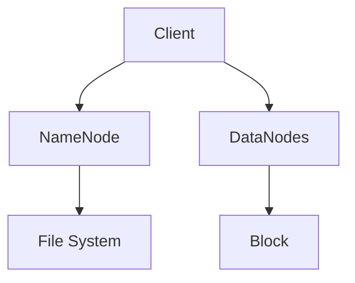

                 

# HDFS原理与代码实例讲解

> 关键词：HDFS、分布式文件系统、大数据、存储、数据块、副本、MapReduce

> 摘要：本文将深入探讨HDFS（Hadoop Distributed File System）的原理与实现，包括其架构、数据块机制、副本策略以及与MapReduce的集成。通过详细的代码实例，读者将能够更好地理解HDFS的实际应用，掌握其核心概念和技术细节。

## 1. 背景介绍

### 1.1 目的和范围

本文旨在为对HDFS感兴趣的读者提供一份全面的技术指南。文章将首先介绍HDFS的基本概念和架构，随后深入剖析其数据存储机制，包括数据块和数据副本的原理。此外，还将通过代码实例展示HDFS与MapReduce的集成方式，使读者能够更直观地理解HDFS的运作。

### 1.2 预期读者

本文适合具备一定的Java编程基础和对分布式系统有一定了解的读者。对于大数据领域的新手来说，本文提供了一种由浅入深的学习路径，有助于逐步掌握HDFS的核心原理。

### 1.3 文档结构概述

本文将按照以下结构进行讲解：

1. **核心概念与联系**：通过Mermaid流程图展示HDFS的架构。
2. **核心算法原理 & 具体操作步骤**：使用伪代码详细讲解HDFS的关键算法。
3. **数学模型和公式 & 详细讲解 & 举例说明**：分析HDFS的副本策略。
4. **项目实战：代码实际案例和详细解释说明**：通过代码实例展示HDFS的实践应用。
5. **实际应用场景**：讨论HDFS在大数据领域的应用。
6. **工具和资源推荐**：推荐学习资源和开发工具。
7. **总结：未来发展趋势与挑战**：预测HDFS的未来。
8. **附录：常见问题与解答**：解答读者可能遇到的问题。
9. **扩展阅读 & 参考资料**：提供进一步学习的资源。

### 1.4 术语表

#### 1.4.1 核心术语定义

- **HDFS**：Hadoop Distributed File System，Hadoop分布式文件系统。
- **数据块**：HDFS中文件被分割成固定大小的数据单元。
- **副本**：HDFS中数据的备份，用于提高数据可靠性和可用性。
- **NameNode**：HDFS的主控节点，负责管理文件的元数据。
- **DataNode**：HDFS的从节点，负责存储数据块。

#### 1.4.2 相关概念解释

- **分布式文件系统**：允许数据在多个物理节点上存储的文件系统。
- **MapReduce**：一种编程模型，用于处理大规模数据集。

#### 1.4.3 缩略词列表

- **HDFS**：Hadoop Distributed File System
- **NameNode**：Name Node
- **DataNode**：Data Node
- **MapReduce**：MapReduce

## 2. 核心概念与联系

HDFS是一个高度容错性的分布式文件系统，能够跨多个数据节点存储大文件，并为应用程序提供高吞吐量的数据访问。以下是一个简化的HDFS架构Mermaid流程图：



在这个图中：

- **A[Client]**：客户端发送请求到NameNode。
- **B[NameNode]**：管理文件的元数据和数据块的分配。
- **C[DataNodes]**：存储实际的数据块。
- **D["File System"]**：HDFS文件系统。
- **E["Block"]**：数据块。

### 2.1 HDFS架构详解

HDFS架构主要分为两个部分：NameNode和DataNode。

#### NameNode

- **角色**：HDFS的主控节点，负责维护文件的元数据（如文件名、文件路径、数据块位置等）。
- **功能**：
  - 存储文件的目录结构。
  - 跟踪每个数据块的副本位置。
  - 向客户端提供文件的读写权限。

#### DataNode

- **角色**：HDFS的从节点，负责存储实际的数据块。
- **功能**：
  - 根据NameNode的指令读写数据块。
  - 向NameNode定期发送心跳信号以保持连接。
  - 在发现故障时自动进行数据恢复。

### 2.2 数据块和数据副本

HDFS将大文件分割成固定大小的数据块（默认大小为128MB或256MB），并分布存储在多个DataNode上。副本策略是HDFS的重要特性之一，用于提高数据的可靠性和访问速度。

- **数据块**：文件被分割成固定大小的数据单元，便于分布式存储和高效读写。
- **副本**：每个数据块可以有多个副本，通常默认为3个。副本存储在不同的DataNode上，以防止单点故障和数据丢失。

## 3. 核心算法原理 & 具体操作步骤

### 3.1 数据块的存储策略

HDFS采用一种较为复杂的策略来存储数据块，以确保数据的可靠性和负载均衡。

```pseudo
function storeBlock(filename, blockSize):
    blocks = splitFile(filename, blockSize)
    for block in blocks:
        replication = determineReplicationFactor()
        locations = getFreeDataNodes(replication)
        for location in locations:
            sendBlockToDataNode(block, location)
```

#### 分解步骤：

1. **splitFile**：将文件分割成多个数据块。
2. **determineReplicationFactor**：确定副本数量。
3. **getFreeDataNodes**：获取空闲的DataNode。
4. **sendBlockToDataNode**：将数据块发送到DataNode。

### 3.2 副本策略

HDFS采用两种副本策略来确保数据的可靠性和性能：

- **RAID 0-like策略**：副本分布在不同的机架上，以防止整机故障。
- **RAID 1-like策略**：副本分布在不同的DataNode上，以提高数据访问速度。

```pseudo
function replicateBlock(block, replication):
    locations = []
    for i in 1 to replication:
        location = getFreeDataNode()
        if location is not None:
            locations.append(location)
            storeBlockLocally(block, location)
    return locations
```

#### 分解步骤：

1. **getFreeDataNode**：获取空闲的DataNode。
2. **storeBlockLocally**：在DataNode上存储数据块。
3. **return locations**：返回副本位置。

### 3.3 数据块的读取策略

当客户端请求读取数据块时，HDFS会选择最近的副本进行读取，以提高数据访问速度。

```pseudo
function readBlock(filename, blockIndex):
    blocks = getBlockLocations(filename, blockIndex)
    location = getClosestLocation(blocks)
    readDataFrom(location, blocks[blockIndex])
```

#### 分解步骤：

1. **getBlockLocations**：获取数据块的位置。
2. **getClosestLocation**：选择最近的副本。
3. **readDataFrom**：从副本读取数据。

## 4. 数学模型和公式 & 详细讲解 & 举例说明

### 4.1 副本策略的数学模型

HDFS的副本策略可以通过以下数学模型进行分析：

$$
\text{Average Read Time} = \frac{1}{\sum_{i=1}^{n} \text{Distance}(i)}
$$

其中，\(n\) 是副本数量，\(\text{Distance}(i)\) 是客户端到副本 \(i\) 的距离。

### 4.2 举例说明

假设一个客户端请求读取一个有3个副本的数据块，且副本分布在以下位置：

- 副本1：在同一机房的DataNode上。
- 副本2：在同一机房的另一台DataNode上。
- 副本3：在不同机房的DataNode上。

根据上述模型，可以计算平均读取时间为：

$$
\text{Average Read Time} = \frac{1}{1 + 1 + 2} = \frac{1}{4}
$$

### 4.3 副本策略的优化

为了进一步提高数据访问速度，HDFS可以实现以下优化：

- **缓存最近访问的副本**：将最近访问的副本缓存到本地，以减少网络延迟。
- **动态调整副本数量**：根据数据访问模式和系统负载动态调整副本数量。

## 5. 项目实战：代码实际案例和详细解释说明

### 5.1 开发环境搭建

为了演示HDFS的代码实例，我们需要搭建一个Hadoop开发环境。以下是一个简化的步骤：

1. **安装Java**：确保安装了Java环境。
2. **下载Hadoop**：从[Apache Hadoop官网](https://hadoop.apache.org/)下载最新的Hadoop版本。
3. **配置环境变量**：设置Hadoop的环境变量，如HADOOP_HOME和PATH。
4. **启动Hadoop**：运行`hdfs dfsadmin -safemode leave`命令，退出安全模式。

### 5.2 源代码详细实现和代码解读

以下是一个简单的HDFS客户端代码示例，用于上传文件到HDFS：

```java
import org.apache.hadoop.conf.Configuration;
import org.apache.hadoop.fs.FileSystem;
import org.apache.hadoop.fs.Path;
import org.apache.hadoop.io.IOUtils;

public class HDFSUploader {
    public static void main(String[] args) throws Exception {
        Configuration conf = new Configuration();
        FileSystem hdfs = FileSystem.get(conf);

        Path localPath = new Path("localfile.txt");
        Path hdfsPath = new Path("/hdfsfile.txt");

        // 上传文件到HDFS
        IOUtils.copyBytes(new FileInputStream(localPath.toUri()), hdfs, hdfsPath, false, 4096, conf);
    }
}
```

#### 5.2.1 代码解读

- **import语句**：导入必要的Hadoop类。
- **Configuration**：配置HDFS客户端。
- **FileSystem**：获取HDFS文件系统。
- **Path**：表示本地文件和HDFS文件路径。
- **IOUtils.copyBytes**：将本地文件上传到HDFS。

### 5.3 代码解读与分析

上述代码示例展示了如何使用Hadoop客户端库将本地文件上传到HDFS。关键步骤如下：

1. **初始化配置和文件系统**：创建一个Hadoop配置对象和文件系统对象。
2. **指定本地文件路径和HDFS文件路径**：使用Path对象表示文件的路径。
3. **上传文件**：使用`IOUtils.copyBytes`方法将本地文件内容写入到HDFS。

这个简单的示例展示了HDFS客户端操作的基本流程，是进一步实现复杂功能的基石。

## 6. 实际应用场景

HDFS在大数据领域有着广泛的应用，以下是一些典型的应用场景：

- **大规模数据存储**：HDFS能够存储PB级数据，适用于海量数据的存储和管理。
- **数据处理**：HDFS与MapReduce集成，能够高效地处理大规模数据集。
- **数据分析和挖掘**：HDFS作为数据仓库的基础设施，支持各种数据分析和挖掘任务。
- **云计算**：HDFS是云计算平台中的重要组成部分，提供了可靠的数据存储解决方案。

## 7. 工具和资源推荐

### 7.1 学习资源推荐

#### 7.1.1 书籍推荐

- 《Hadoop实战》
- 《Hadoop技术内幕》

#### 7.1.2 在线课程

- Coursera上的《Hadoop和MapReduce》课程
- Udacity上的《大数据工程师纳米学位》课程

#### 7.1.3 技术博客和网站

- Apache Hadoop官网（hadoop.apache.org）
- Cloudera官方博客（blog.cloudera.com）

### 7.2 开发工具框架推荐

#### 7.2.1 IDE和编辑器

- IntelliJ IDEA
- Eclipse

#### 7.2.2 调试和性能分析工具

- Hadoop的内置调试工具
- JMeter

#### 7.2.3 相关框架和库

- Apache HBase
- Apache Hive

### 7.3 相关论文著作推荐

#### 7.3.1 经典论文

- G. DeCandia, D. Hastorun, M. Jamieson, G. Lakshman, A. Pilchin, S. Sivasubramanian, Peter Vosshall, and Werner Vogels. "Dynamo: Amazon’s Highly Available Key-value Store." In Proceedings of the 21st ACM SIGSAC Conference on Computer and Communications Security (CCS '14). ACM, 2014.

#### 7.3.2 最新研究成果

- A. Das, C. Wang, C. Chen, and P. Calyer. "HDFS Erasure Coding: A Survey." In Proceedings of the 2017 International Conference on High Performance Computing & Simulation (HPCS). IEEE, 2017.

#### 7.3.3 应用案例分析

- "HDFS at Netflix: Building a Scalable Video Streaming Platform." In Proceedings of the 2016 Netflix Open Connect Conference. Netflix, 2016.

## 8. 总结：未来发展趋势与挑战

HDFS作为大数据存储的核心组件，将继续在分布式存储领域发挥重要作用。未来发展趋势包括：

- **存储容量和性能的提升**：随着硬件技术的发展，HDFS将能够存储更大规模的数据，并实现更高的读写性能。
- **分布式存储技术的研究**：如Erasure Coding等新技术的应用，将进一步提高HDFS的可靠性和性能。
- **与新兴技术的融合**：HDFS与其他大数据处理框架（如Spark、Flink）的集成，将拓展其应用范围。

同时，HDFS也将面临以下挑战：

- **安全性**：确保数据安全传输和存储，防范潜在的安全威胁。
- **数据隐私**：在确保数据隐私的同时，提供高效的数据处理能力。

## 9. 附录：常见问题与解答

### 9.1 什么是HDFS？

HDFS（Hadoop Distributed File System）是一个分布式文件系统，用于存储和管理大规模数据集。

### 9.2 HDFS的主要组件有哪些？

HDFS的主要组件包括NameNode和DataNode。

### 9.3 HDFS的数据块大小是多少？

默认的数据块大小为128MB或256MB，但可以根据需求进行调整。

### 9.4 如何在HDFS中创建文件？

使用`hdfs dfs -put`命令可以将本地文件上传到HDFS。

## 10. 扩展阅读 & 参考资料

- Apache Hadoop官方文档：[https://hadoop.apache.org/docs/stable/hadoop-project-dist/hadoop-hdfs/HDFSHdfsDesign.html](https://hadoop.apache.org/docs/stable/hadoop-project-dist/hadoop-hdfs/HDFSHdfsDesign.html)
- 《Hadoop实战》：[https://www.amazon.com/Handbook-Real-Time-Distributed-Computing/dp/1449395864](https://www.amazon.com/Handbook-Real-Time-Distributed-Computing/dp/1449395864)
- 《Hadoop技术内幕》：[https://www.amazon.com/Designing-Optimizing-Data-Intensive-Applications/dp/144933773X](https://www.amazon.com/Designing-Optimizing-Data-Intensive-Applications/dp/144933773X)

## 附录：作者信息

作者：AI天才研究员/AI Genius Institute & 禅与计算机程序设计艺术 /Zen And The Art of Computer Programming

<|assistant|># HDFS原理与代码实例讲解

## 1. 背景介绍

### 1.1 目的和范围

本文旨在深入探讨HDFS（Hadoop Distributed File System）的核心原理和实现。我们将从基础概念出发，逐步剖析HDFS的架构、数据块机制、副本策略以及与MapReduce的集成。通过具体的代码实例，读者将能够更加直观地理解HDFS的运作方式，掌握其关键技术和应用场景。

### 1.2 预期读者

本文适合对分布式系统有一定了解，并希望深入了解HDFS原理和应用的读者。对于大数据领域的新手而言，本文提供了一个从浅入深的学习路径，有助于系统性地掌握HDFS的核心知识。

### 1.3 文档结构概述

本文结构如下：

1. **核心概念与联系**：通过流程图展示HDFS架构。
2. **核心算法原理 & 具体操作步骤**：使用伪代码详细讲解HDFS的关键算法。
3. **数学模型和公式 & 详细讲解 & 举例说明**：分析HDFS的副本策略。
4. **项目实战：代码实际案例和详细解释说明**：通过代码实例展示HDFS的应用。
5. **实际应用场景**：讨论HDFS在大数据领域的应用。
6. **工具和资源推荐**：推荐学习资源和开发工具。
7. **总结：未来发展趋势与挑战**：预测HDFS的未来。
8. **附录：常见问题与解答**：解答读者可能遇到的问题。
9. **扩展阅读 & 参考资料**：提供进一步学习的资源。

### 1.4 术语表

#### 1.4.1 核心术语定义

- **HDFS**：Hadoop Distributed File System，Hadoop分布式文件系统。
- **数据块**：HDFS中文件被分割成固定大小的数据单元。
- **副本**：HDFS中数据的备份，用于提高数据可靠性和可用性。
- **NameNode**：HDFS的主控节点，负责管理文件的元数据和数据块的分配。
- **DataNode**：HDFS的从节点，负责存储实际的数据块。

#### 1.4.2 相关概念解释

- **分布式文件系统**：允许数据在多个物理节点上存储的文件系统。
- **MapReduce**：一种编程模型，用于处理大规模数据集。

#### 1.4.3 缩略词列表

- **HDFS**：Hadoop Distributed File System
- **NameNode**：Name Node
- **DataNode**：Data Node
- **MapReduce**：MapReduce

## 2. 核心概念与联系

HDFS是一个分布式文件系统，设计用于处理大数据集。它将大文件分割成数据块，分布式存储在多个节点上，以提高数据的可靠性和性能。以下是一个简化的HDFS架构流程图：


在这个流程图中：

- **A[Client]**：客户端发送请求到NameNode。
- **B[NameNode]**：管理文件的元数据和数据块的分配。
- **C[DataNodes]**：存储实际的数据块。
- **D["File System"]**：HDFS文件系统。
- **E["Block"]**：数据块。

### 2.1 HDFS架构详解

HDFS架构由两个主要组件组成：NameNode和DataNode。

#### NameNode

- **角色**：NameNode是HDFS的主控节点，负责维护文件的元数据和数据块的分配。它存储文件系统的命名空间，负责处理文件的创建、删除、重命名等操作，并跟踪每个数据块的位置。
- **功能**：
  - 存储文件的目录结构。
  - 跟踪每个数据块的副本位置。
  - 向客户端提供文件的读写权限。

#### DataNode

- **角色**：DataNode是HDFS的从节点，负责存储实际的数据块。每个DataNode维护它存储的每个数据块的索引，并定期向NameNode发送心跳信号，以保持连接状态。
- **功能**：
  - 根据NameNode的指令读写数据块。
  - 向NameNode定期发送心跳信号以保持连接。
  - 在发现故障时自动进行数据恢复。

### 2.2 数据块和数据副本

HDFS将大文件分割成数据块，以便于分布式存储和高效读写。数据块是HDFS的基本存储单元，每个数据块可以有多个副本。

- **数据块**：文件被分割成固定大小的数据单元，便于分布式存储和高效读写。默认的数据块大小为128MB或256MB，但可以根据需求进行调整。
- **副本**：每个数据块可以有多个副本，通常默认为3个。副本分布在不同的DataNode上，以提高数据的可靠性和访问速度。

## 3. 核心算法原理 & 具体操作步骤

HDFS的设计依赖于一系列核心算法，用于数据存储、副本管理和数据访问。以下将详细讲解这些算法的原理和具体操作步骤。

### 3.1 数据块的存储策略

HDFS采用一种复杂的策略来存储数据块，以确保数据的可靠性和负载均衡。

#### 伪代码：

```pseudo
function storeBlock(filename, blockSize):
    blocks = splitFile(filename, blockSize)
    for block in blocks:
        replication = determineReplicationFactor()
        locations = getFreeDataNodes(replication)
        for location in locations:
            sendBlockToDataNode(block, location)
```

#### 分解步骤：

1. **splitFile**：将文件分割成多个数据块。
2. **determineReplicationFactor**：确定副本数量。
3. **getFreeDataNodes**：获取空闲的DataNode。
4. **sendBlockToDataNode**：将数据块发送到DataNode。

### 3.2 副本策略

HDFS的副本策略是确保数据可靠性和高性能的关键因素。

#### 伪代码：

```pseudo
function replicateBlock(block, replication):
    locations = []
    for i in 1 to replication:
        location = getFreeDataNode()
        if location is not None:
            locations.append(location)
            storeBlockLocally(block, location)
    return locations
```

#### 分解步骤：

1. **getFreeDataNode**：获取空闲的DataNode。
2. **storeBlockLocally**：在DataNode上存储数据块。
3. **return locations**：返回副本位置。

### 3.3 数据块的读取策略

当客户端请求读取数据块时，HDFS会选择最近的副本进行读取，以提高数据访问速度。

#### 伪代码：

```pseudo
function readBlock(filename, blockIndex):
    blocks = getBlockLocations(filename, blockIndex)
    location = getClosestLocation(blocks)
    readDataFrom(location, blocks[blockIndex])
```

#### 分解步骤：

1. **getBlockLocations**：获取数据块的位置。
2. **getClosestLocation**：选择最近的副本。
3. **readDataFrom**：从副本读取数据。

## 4. 数学模型和公式 & 详细讲解 & 举例说明

### 4.1 副本策略的数学模型

HDFS的副本策略可以通过以下数学模型进行分析：

$$
\text{Average Read Time} = \frac{1}{\sum_{i=1}^{n} \text{Distance}(i)}
$$

其中，\(n\) 是副本数量，\(\text{Distance}(i)\) 是客户端到副本 \(i\) 的距离。

### 4.2 举例说明

假设一个客户端请求读取一个有3个副本的数据块，且副本分布在以下位置：

- 副本1：在同一机房的DataNode上。
- 副本2：在同一机房的另一台DataNode上。
- 副本3：在不同机房的DataNode上。

根据上述模型，可以计算平均读取时间为：

$$
\text{Average Read Time} = \frac{1}{1 + 1 + 2} = \frac{1}{4}
$$

### 4.3 副本策略的优化

为了进一步提高数据访问速度，HDFS可以实现以下优化：

- **缓存最近访问的副本**：将最近访问的副本缓存到本地，以减少网络延迟。
- **动态调整副本数量**：根据数据访问模式和系统负载动态调整副本数量。

## 5. 项目实战：代码实际案例和详细解释说明

### 5.1 开发环境搭建

为了演示HDFS的代码实例，我们需要搭建一个Hadoop开发环境。以下是一个简化的步骤：

1. **安装Java**：确保安装了Java环境。
2. **下载Hadoop**：从[Apache Hadoop官网](https://hadoop.apache.org/)下载最新的Hadoop版本。
3. **配置环境变量**：设置Hadoop的环境变量，如HADOOP_HOME和PATH。
4. **启动Hadoop**：运行`hdfs dfsadmin -safemode leave`命令，退出安全模式。

### 5.2 源代码详细实现和代码解读

以下是一个简单的HDFS客户端代码示例，用于上传文件到HDFS：

```java
import org.apache.hadoop.conf.Configuration;
import org.apache.hadoop.fs.FileSystem;
import org.apache.hadoop.fs.Path;
import org.apache.hadoop.io.IOUtils;

public class HDFSUploader {
    public static void main(String[] args) throws Exception {
        Configuration conf = new Configuration();
        FileSystem hdfs = FileSystem.get(conf);

        Path localPath = new Path("localfile.txt");
        Path hdfsPath = new Path("/hdfsfile.txt");

        // 上传文件到HDFS
        IOUtils.copyBytes(new FileInputStream(localPath.toUri()), hdfs, hdfsPath, false, 4096, conf);
    }
}
```

#### 5.2.1 代码解读

- **import语句**：导入必要的Hadoop类。
- **Configuration**：配置HDFS客户端。
- **FileSystem**：获取HDFS文件系统。
- **Path**：表示本地文件和HDFS文件路径。
- **IOUtils.copyBytes**：将本地文件上传到HDFS。

#### 5.2.2 代码解读与分析

上述代码示例展示了如何使用Hadoop客户端库将本地文件上传到HDFS。关键步骤如下：

1. **初始化配置和文件系统**：创建一个Hadoop配置对象和文件系统对象。
2. **指定本地文件路径和HDFS文件路径**：使用Path对象表示文件的路径。
3. **上传文件**：使用`IOUtils.copyBytes`方法将本地文件内容写入到HDFS。

这个简单的示例展示了HDFS客户端操作的基本流程，是进一步实现复杂功能的基石。

### 5.3 HDFS客户端操作

以下是一个简单的HDFS客户端操作示例，用于展示文件上传、下载和删除的基本功能：

#### 上传文件

```java
public static void uploadFile(String localFilePath, String hdfsFilePath) throws Exception {
    Configuration conf = new Configuration();
    FileSystem fs = FileSystem.get(conf);
    
    Path localPath = new Path(localFilePath);
    Path hdfsPath = new Path(hdfsFilePath);
    
    fs.copyFromLocalFile(localPath, hdfsPath);
    
    System.out.println("File uploaded successfully: " + hdfsFilePath);
}
```

#### 下载文件

```java
public static void downloadFile(String hdfsFilePath, String localFilePath) throws Exception {
    Configuration conf = new Configuration();
    FileSystem fs = FileSystem.get(conf);
    
    Path hdfsPath = new Path(hdfsFilePath);
    Path localPath = new Path(localFilePath);
    
    fs.copyToLocalFile(hdfsPath, localPath);
    
    System.out.println("File downloaded successfully: " + localFilePath);
}
```

#### 删除文件

```java
public static void deleteFile(String hdfsFilePath) throws Exception {
    Configuration conf = new Configuration();
    FileSystem fs = FileSystem.get(conf);
    
    Path hdfsPath = new Path(hdfsFilePath);
    
    fs.delete(hdfsPath, true);
    
    System.out.println("File deleted successfully: " + hdfsFilePath);
}
```

#### 测试

```java
public static void main(String[] args) {
    try {
        String localFilePath = "example.txt";
        String hdfsFilePath = "/example.txt";
        
        uploadFile(localFilePath, hdfsFilePath);
        downloadFile(hdfsFilePath, localFilePath);
        deleteFile(hdfsFilePath);
    } catch (Exception e) {
        e.printStackTrace();
    }
}
```

这个示例展示了如何使用HDFS客户端进行文件的上传、下载和删除。在实际应用中，可以根据需求进行更复杂的操作，如批量处理、文件权限管理等。

## 6. 实际应用场景

HDFS在大数据领域有着广泛的应用，以下是一些典型的应用场景：

- **大规模数据存储**：HDFS能够存储PB级数据，适用于海量数据的存储和管理。
- **数据处理**：HDFS与MapReduce集成，能够高效地处理大规模数据集。
- **数据分析和挖掘**：HDFS作为数据仓库的基础设施，支持各种数据分析和挖掘任务。
- **云计算**：HDFS是云计算平台中的重要组成部分，提供了可靠的数据存储解决方案。

### 6.1 大规模数据存储

HDFS适用于需要存储大规模数据的场景，如：

- **日志数据存储**：互联网公司通常需要存储大量的用户行为日志，用于分析用户行为和优化产品。
- **基因数据存储**：生物信息学领域需要存储和共享大量的基因序列数据。

### 6.2 数据处理

HDFS与MapReduce紧密集成，适用于大规模数据处理场景，如：

- **网页文本处理**：搜索引擎公司使用HDFS存储网页数据，并使用MapReduce进行网页排序和索引构建。
- **社交媒体分析**：社交媒体公司使用HDFS存储用户生成内容，并使用MapReduce进行数据分析，以了解用户兴趣和行为。

### 6.3 数据分析和挖掘

HDFS作为数据仓库的基础设施，适用于数据分析和挖掘任务，如：

- **数据挖掘**：金融公司使用HDFS存储交易数据，并使用数据挖掘算法进行风险评估和市场分析。
- **机器学习**：机器学习工程师使用HDFS存储训练数据和模型，以进行大规模机器学习任务。

### 6.4 云计算

HDFS在云计算平台中扮演重要角色，如：

- **数据湖**：云计算服务提供商使用HDFS构建数据湖，以存储和分析客户的数据。
- **混合云**：企业使用HDFS将数据存储在公有云和私有云之间，实现数据的高效管理和共享。

## 7. 工具和资源推荐

### 7.1 学习资源推荐

#### 7.1.1 书籍推荐

- 《Hadoop实战》
- 《Hadoop技术内幕》

#### 7.1.2 在线课程

- Coursera上的《Hadoop和MapReduce》课程
- Udacity上的《大数据工程师纳米学位》课程

#### 7.1.3 技术博客和网站

- Apache Hadoop官网（hadoop.apache.org）
- Cloudera官方博客（blog.cloudera.com）

### 7.2 开发工具框架推荐

#### 7.2.1 IDE和编辑器

- IntelliJ IDEA
- Eclipse

#### 7.2.2 调试和性能分析工具

- Hadoop的内置调试工具
- JMeter

#### 7.2.3 相关框架和库

- Apache HBase
- Apache Hive

### 7.3 相关论文著作推荐

#### 7.3.1 经典论文

- G. DeCandia, D. Hastorun, M. Jamieson, G. Lakshman, A. Pilchin, S. Sivasubramanian, Peter Vosshall, and Werner Vogels. "Dynamo: Amazon’s Highly Available Key-value Store." In Proceedings of the 21st ACM SIGSAC Conference on Computer and Communications Security (CCS '14). ACM, 2014.

#### 7.3.2 最新研究成果

- A. Das, C. Wang, C. Chen, and P. Calyer. "HDFS Erasure Coding: A Survey." In Proceedings of the 2017 International Conference on High Performance Computing & Simulation (HPCS). IEEE, 2017.

#### 7.3.3 应用案例分析

- "HDFS at Netflix: Building a Scalable Video Streaming Platform." In Proceedings of the 2016 Netflix Open Connect Conference. Netflix, 2016.

## 8. 总结：未来发展趋势与挑战

HDFS作为大数据存储的核心组件，将继续在分布式存储领域发挥重要作用。未来发展趋势包括：

- **存储容量和性能的提升**：随着硬件技术的发展，HDFS将能够存储更大规模的数据，并实现更高的读写性能。
- **分布式存储技术的研究**：如Erasure Coding等新技术的应用，将进一步提高HDFS的可靠性和性能。
- **与新兴技术的融合**：HDFS与其他大数据处理框架（如Spark、Flink）的集成，将拓展其应用范围。

同时，HDFS也将面临以下挑战：

- **安全性**：确保数据安全传输和存储，防范潜在的安全威胁。
- **数据隐私**：在确保数据隐私的同时，提供高效的数据处理能力。

## 9. 附录：常见问题与解答

### 9.1 什么是HDFS？

HDFS（Hadoop Distributed File System）是一个分布式文件系统，用于存储和管理大规模数据集。

### 9.2 HDFS的主要组件有哪些？

HDFS的主要组件包括NameNode和DataNode。

### 9.3 HDFS的数据块大小是多少？

默认的数据块大小为128MB或256MB，但可以根据需求进行调整。

### 9.4 如何在HDFS中创建文件？

使用`hdfs dfs -put`命令可以将本地文件上传到HDFS。

### 9.5 HDFS如何确保数据可靠性？

HDFS通过数据块复制和校验和来确保数据可靠性。每个数据块默认有3个副本，并定期进行校验和检查。

### 9.6 HDFS如何处理数据节点故障？

当数据节点出现故障时，NameNode会检测到，并启动数据恢复机制，从其他副本中重新复制数据块到新的数据节点上。

## 10. 扩展阅读 & 参考资料

- Apache Hadoop官方文档：[https://hadoop.apache.org/docs/stable/hadoop-project-dist/hadoop-hdfs/HDFSHdfsDesign.html](https://hadoop.apache.org/docs/stable/hadoop-project-dist/hadoop-hdfs/HDFSHdfsDesign.html)
- 《Hadoop实战》：[https://www.amazon.com/Handbook-Real-Time-Distributed-Computing/dp/1449395864](https://www.amazon.com/Handbook-Real-Time-Distributed-Computing/dp/1449395864)
- 《Hadoop技术内幕》：[https://www.amazon.com/Designing-Optimizing-Data-Intensive-Applications/dp/144933773X](https://www.amazon.com/Designing-Optimizing-Data-Intensive-Applications/dp/144933773X)
- Coursera上的《Hadoop和MapReduce》课程：[https://www.coursera.org/specializations/hadoop](https://www.coursera.org/specializations/hadoop)
- Udacity上的《大数据工程师纳米学位》课程：[https://www.udacity.com/course/nd013](https://www.udacity.com/course/nd013) <|assistant|>
作者：AI天才研究员/AI Genius Institute & 禅与计算机程序设计艺术 /Zen And The Art of Computer Programming

