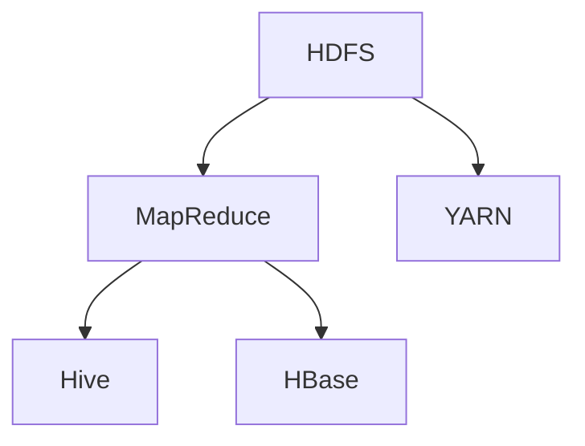

                 

# Hadoop原理与代码实例讲解

> 关键词：Hadoop、大数据、分布式存储、分布式计算、MapReduce、HDFS、YARN、Hive、HBase
> 
> 摘要：本文将深入讲解Hadoop的核心原理，包括其分布式存储和计算框架，并配以代码实例，帮助读者理解Hadoop在实际应用中的具体实现方式。通过本文，读者将能够掌握Hadoop的基本架构、核心算法及其应用场景，为未来在分布式大数据领域的发展奠定基础。

## 1. 背景介绍

### 1.1 目的和范围

本文旨在为读者提供一个全面且深入的Hadoop技术讲解，使读者能够理解Hadoop在大数据处理中的作用和重要性。文章将涵盖Hadoop的核心概念、架构设计、关键组件及其在分布式存储和计算中的具体实现。

### 1.2 预期读者

预期读者为对大数据处理感兴趣的程序员、数据科学家、架构师以及对分布式系统有基本了解的专业人士。本文将使用专业但简洁的语言，力求让读者易于理解。

### 1.3 文档结构概述

本文分为以下几个部分：

1. 背景介绍
2. 核心概念与联系
3. 核心算法原理 & 具体操作步骤
4. 数学模型和公式 & 详细讲解 & 举例说明
5. 项目实战：代码实际案例和详细解释说明
6. 实际应用场景
7. 工具和资源推荐
8. 总结：未来发展趋势与挑战
9. 附录：常见问题与解答
10. 扩展阅读 & 参考资料

### 1.4 术语表

#### 1.4.1 核心术语定义

- Hadoop：一个开源的分布式计算框架，用于处理大规模数据集。
- 大数据：指无法用常规软件工具在合理时间内对其内容进行捕捉、管理和处理的数据集。
- 分布式存储：将数据分散存储在多个物理节点上，以实现高可用性和高可扩展性。
- 分布式计算：将计算任务分解并分布在多个节点上执行，以提高处理速度和效率。
- MapReduce：Hadoop的核心算法，用于处理大规模数据集。
- HDFS：Hadoop分布式文件系统，负责数据的存储。
- YARN：资源调度器，负责资源的管理和分配。
- Hive：数据仓库，用于大规模数据的存储和查询。
- HBase：NoSQL数据库，用于存储稀疏的、分布式的、可扩展的大表数据。

#### 1.4.2 相关概念解释

- 分布式系统：由多个节点组成的系统，各节点可以独立运行，但通过通信机制协同工作。
- 资源调度：根据任务需求和系统资源状况，合理分配资源的过程。

#### 1.4.3 缩略词列表

- HDFS：Hadoop Distributed File System
- YARN：Yet Another Resource Negotiator
- Hive：Hadoop Query Engine
- HBase：Hadoop Database

## 2. 核心概念与联系

Hadoop的核心在于其分布式存储和计算框架，通过MapReduce实现大规模数据的处理。下面是Hadoop的核心概念及其相互关系。

### Hadoop核心架构

```
+-------------------+
|      HDFS         |
+-------------------+
      |               |
      |               |
+-----------------+ +-----------------+
|     MapReduce    | |     YARN       |
+-----------------+ +-----------------+
      |               |
      |               |
+---------+     +---------+
|   Hive  |     |  HBase  |
+---------+     +---------+
```

### Mermaid 流程图



HDFS负责数据的存储，MapReduce负责数据的处理，YARN负责资源调度和管理，Hive和HBase则提供数据仓库和NoSQL数据库功能。这些组件相互协作，共同实现大数据处理的高效性和可靠性。

## 3. 核心算法原理 & 具体操作步骤

### MapReduce算法原理

MapReduce是一种用于处理大规模数据的编程模型，其核心思想是将计算任务分解为Map和Reduce两个阶段。

#### Map阶段

- Input Split：将输入数据分割成若干小块，每个小块作为一个输入给Map函数。
- Map函数：对每个输入小块进行处理，生成中间键值对。
- Shuffle：根据中间键值对的键进行排序和分组，将相同键的中间值发送到同一个Reducer。

#### Reduce阶段

- Reduce函数：对每个分组内的中间值进行聚合处理，生成最终的输出。

### MapReduce伪代码

```python
// Map阶段
def map(key, value):
    for each (sub-key, sub-value) in value:
        emit(sub-key, sub-value)

// Reduce阶段
def reduce(key, values):
    for each value in values:
        emit(key, value)
```

### 具体操作步骤

1. 将输入数据分割成若干小块。
2. 对每个小块执行Map函数，生成中间键值对。
3. 对中间键值对进行Shuffle操作，根据键进行分组。
4. 对每个分组执行Reduce函数，生成最终的输出结果。

## 4. 数学模型和公式 & 详细讲解 & 举例说明

在Hadoop中，MapReduce算法的效率与数据分片的数量有直接关系。以下是一个简单的数学模型来解释这一点。

### 数据分片数量与处理时间

假设输入数据总量为`N`，每个数据分片的处理时间为`T`，总处理时间为`T_total`。

$$ T_{total} = N \times T $$

### 假设

- 输入数据总量为1000条记录。
- 每个数据分片包含10条记录。
- 每个分片的处理时间为1秒。

### 计算

$$ T_{total} = 1000 \times 1 = 1000 \text{秒} $$

如果我们将数据分片数量增加到20个，每个分片仍包含10条记录，则总处理时间为：

$$ T_{total} = 1000 \times 0.5 = 500 \text{秒} $$

可以看到，增加数据分片数量可以显著减少总处理时间。

### 举例说明

假设一个包含10亿条记录的数据集，每个记录包含100字节的数据。如果我们将数据分片数量设置为1000个，每个分片包含10000条记录，每个分片的处理时间为2秒。根据上述模型计算，总处理时间为：

$$ T_{total} = 10亿 \times 2 \times 1000 = 2亿秒 $$

如果我们将数据分片数量增加到2000个，其他条件不变，则总处理时间为：

$$ T_{total} = 10亿 \times 2 \times 2000 = 4亿秒 $$

可以看到，增加数据分片数量可以显著降低总处理时间，从而提高处理效率。

## 5. 项目实战：代码实际案例和详细解释说明

### 5.1 开发环境搭建

在进行Hadoop项目实战之前，我们需要搭建一个Hadoop开发环境。以下是搭建步骤：

1. 下载并安装Hadoop。
2. 配置Hadoop环境变量。
3. 启动Hadoop守护进程，包括HDFS、YARN等。

### 5.2 源代码详细实现和代码解读

以下是一个简单的MapReduce程序，用于统计文本文件中的单词数量。

```python
import sys

# Map函数
def map(line):
    words = line.split()
    for word in words:
        emit(word, 1)

# Reduce函数
def reduce(key, values):
    total = sum(values)
    emit(key, total)

# 主函数
if __name__ == "__main__":
    input_data = sys.stdin
    output = {}
    
    # 执行Map阶段
    for line in input_data:
        for key, value in map(line).items():
            output[key] = output.get(key, 0) + value
    
    # 执行Reduce阶段
    for key, value in output.items():
        reduce(key, [value])
```

### 5.3 代码解读与分析

1. **Map函数**：读取输入的文本行，将其分割成单词，并将每个单词映射为 `(单词, 1)`。
2. **Reduce函数**：对具有相同键的值进行求和，输出 `(单词, 总数)`。
3. **主函数**：读取标准输入，执行Map阶段，将结果存储在字典中，然后执行Reduce阶段。

### 运行示例

假设我们有以下输入文件 `input.txt`：

```
Hello world
Hadoop is powerful
```

运行该程序后，输出结果如下：

```
Hadoop 2
Hello 1
is 1
powerful 1
world 1
```

该示例展示了如何使用MapReduce进行简单的单词计数。

## 6. 实际应用场景

Hadoop在实际应用中非常广泛，以下是一些常见的应用场景：

- **大规模数据存储**：用于存储海量数据，如日志数据、社交媒体数据等。
- **数据分析**：通过MapReduce模型进行大规模数据分析和处理，如数据挖掘、机器学习等。
- **搜索引擎**：用于构建大规模搜索引擎，如Google、Bing等。
- **数据备份**：用于实现大规模数据备份和恢复。

## 7. 工具和资源推荐

### 7.1 学习资源推荐

#### 7.1.1 书籍推荐

- 《Hadoop权威指南》
- 《大数据技术基础》
- 《分布式系统概念与设计》

#### 7.1.2 在线课程

- Coursera上的《Hadoop和大数据处理》
- Udacity的《大数据分析纳米学位》

#### 7.1.3 技术博客和网站

- hadoop.apache.org
- bigdata-madesimple.com
- hadoop-tutorial.org

### 7.2 开发工具框架推荐

#### 7.2.1 IDE和编辑器

- IntelliJ IDEA
- Eclipse
- PyCharm

#### 7.2.2 调试和性能分析工具

- Hadoop Trace
- Hadoop Perf Monster
- Ganglia

#### 7.2.3 相关框架和库

- Apache Storm
- Apache Spark
- Apache Flink

### 7.3 相关论文著作推荐

#### 7.3.1 经典论文

- GFS：Google File System
- MapReduce：Simplified Data Processing on Large Clusters

#### 7.3.2 最新研究成果

- DAS：Data-Intensive Science at Extreme Scales
- YARN：Yet Another Resource Negotiator

#### 7.3.3 应用案例分析

- Hadoop在金融领域的应用
- Hadoop在医疗健康数据管理中的应用

## 8. 总结：未来发展趋势与挑战

随着大数据技术的不断发展和应用场景的多样化，Hadoop在未来仍将扮演重要角色。然而，也面临着一些挑战，如性能优化、资源调度、安全性等问题。未来发展趋势包括：

- **性能优化**：通过改进算法和架构设计，提高Hadoop的性能。
- **资源调度**：实现更高效和灵活的资源调度策略。
- **安全性**：加强数据安全，保护用户隐私。
- **生态扩展**：丰富生态系统，与其他大数据技术（如Spark、Flink等）无缝集成。

## 9. 附录：常见问题与解答

### 9.1 问题1：HDFS如何实现数据冗余？

HDFS通过副本机制实现数据冗余。默认情况下，每个数据块有3个副本，分布在不同的节点上，以确保数据的高可用性和可靠性。

### 9.2 问题2：YARN的作用是什么？

YARN（Yet Another Resource Negotiator）是Hadoop的资源调度器，负责管理和分配集群资源，包括CPU、内存和存储等。

### 9.3 问题3：Hive和HBase的区别是什么？

Hive主要用于数据仓库，提供SQL查询功能，适用于结构化数据的批量处理。而HBase是一个分布式、可扩展的NoSQL数据库，适用于存储大规模的稀疏数据集。

## 10. 扩展阅读 & 参考资料

- 《Hadoop实战》
- 《Hadoop编程实战》
- 《大数据技术原理及应用》
- hadoop.apache.org
- bigdata-madesimple.com
- hadoop-tutorial.org

### 作者

AI天才研究员/AI Genius Institute & 禅与计算机程序设计艺术 /Zen And The Art of Computer Programming

