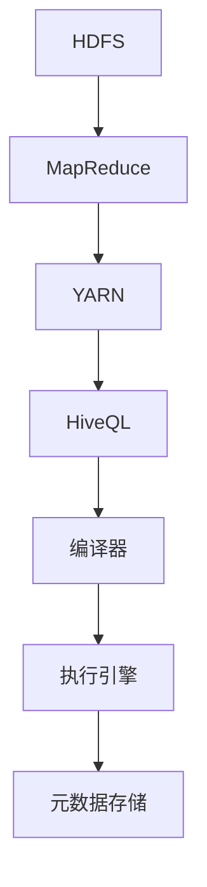

                 


# Hive原理与代码实例讲解

> 关键词：Hive、大数据、数据仓库、查询引擎、Hadoop、MapReduce、HDFS、HBase、SQL

> 摘要：本文将深入探讨Hive的核心原理，包括其架构、核心算法原理和数学模型，并配合实际代码实例进行详细解读。通过本文的学习，读者将全面掌握Hive的使用方法，理解其内部工作原理，从而能够在实际项目中高效地应用Hive进行大数据处理和分析。

## 1. 背景介绍

### 1.1 目的和范围

本文的目的是介绍Hive的核心原理及其在实际应用中的操作方法。我们将从Hive的基本概念出发，逐步深入其内部机制，涵盖Hive的架构设计、核心算法原理、数学模型和实际应用场景。通过本文的学习，读者将能够：

1. 理解Hive作为大数据处理和分析工具的基本原理。
2. 掌握Hive的基本操作方法，包括数据导入、查询优化和性能调优。
3. 能够在Hive中进行复杂的数据分析，实现数据挖掘和报表生成。
4. 了解Hive与其他大数据生态系统组件（如Hadoop、HDFS、HBase等）的交互关系。

### 1.2 预期读者

本文适合以下读者群体：

1. 有志于深入了解大数据处理和分析技术的开发者。
2. 已经掌握基本Hadoop生态知识，希望进一步学习Hive的高级特性。
3. 数据仓库和大数据分析领域的从业者，希望提升数据处理和分析能力。
4. 计算机科学和软件工程专业的学生，希望了解大数据领域的最新技术。

### 1.3 文档结构概述

本文将分为以下几个部分：

1. **背景介绍**：介绍本文的目的、范围、预期读者和文档结构。
2. **核心概念与联系**：通过Mermaid流程图展示Hive的核心概念和架构。
3. **核心算法原理 & 具体操作步骤**：详细讲解Hive的核心算法原理，并使用伪代码进行阐述。
4. **数学模型和公式 & 详细讲解 & 举例说明**：介绍Hive所使用的数学模型和公式，并提供具体实例说明。
5. **项目实战：代码实际案例和详细解释说明**：通过实际项目案例展示Hive的使用方法，并进行详细解释。
6. **实际应用场景**：分析Hive在不同场景下的应用。
7. **工具和资源推荐**：推荐学习资源和开发工具。
8. **总结：未来发展趋势与挑战**：探讨Hive未来的发展趋势和面临的挑战。
9. **附录：常见问题与解答**：提供常见问题的解答。
10. **扩展阅读 & 参考资料**：推荐相关扩展阅读和参考资料。

### 1.4 术语表

#### 1.4.1 核心术语定义

- **Hive**：一个基于Hadoop的数据仓库工具，用于处理和分析大规模数据集。
- **Hadoop**：一个开源的大数据生态系统，提供分布式存储和计算能力。
- **HDFS**：Hadoop分布式文件系统，负责存储大数据。
- **MapReduce**：一种分布式数据处理框架，用于处理大规模数据集。
- **数据仓库**：一个用于存储、管理和分析大量数据的系统。
- **查询引擎**：负责执行SQL查询的引擎。

#### 1.4.2 相关概念解释

- **数据倾斜**：指在MapReduce处理过程中，某些Map任务处理的数据量远大于其他任务，导致任务执行时间不均衡。
- **分区**：将数据按某种条件划分到不同的文件中，便于查询优化。
- **索引**：用于加速查询的辅助数据结构。
- **Join操作**：将两个或多个数据集按照某种条件合并成一个数据集。

#### 1.4.3 缩略词列表

- **HDFS**：Hadoop Distributed File System
- **MapReduce**：Map and Reduce
- **SQL**：Structured Query Language
- **HBase**：Hadoop Database

## 2. 核心概念与联系

在深入了解Hive之前，我们需要了解其与Hadoop生态系统的关系，以及Hive自身的基本架构和核心概念。

### 2.1 Hadoop生态系统与Hive的关系

Hadoop是一个开源的大数据生态系统，主要包括以下几个关键组件：

- **HDFS（Hadoop Distributed File System）**：分布式文件系统，负责存储大规模数据集。
- **MapReduce**：分布式数据处理框架，用于处理大规模数据集。
- **YARN（Yet Another Resource Negotiator）**：资源管理器，负责资源分配和任务调度。
- **Hive**：数据仓库工具，用于处理和分析大规模数据集。
- **HBase**：分布式列存储数据库，提供实时随机读写能力。
- **ZooKeeper**：分布式协调服务，用于维护分布式系统的一致性。

Hive依赖于Hadoop生态系统中的HDFS和MapReduce进行数据存储和处理，同时利用YARN进行资源调度。HBase作为Hive的一个可选组件，可以用于加速特定的查询操作。

### 2.2 Hive的基本架构

Hive的基本架构可以概括为以下几个主要部分：

1. **HiveQL**：Hive提供了一种类似SQL的查询语言（HiveQL，也称为Hive SQL），用于查询和分析数据。
2. **编译器**：将HiveQL查询编译成底层执行计划。
3. **执行引擎**：负责执行编译后的查询计划，包括数据读写、分区、索引和Join操作等。
4. **元数据存储**：存储Hive的元数据信息，如表结构、分区信息等。

### 2.3 Hive的核心概念

以下是Hive中的几个核心概念：

1. **表（Table）**：Hive中的表用于存储数据。表可以分为外部表和内部表，其中外部表允许在删除表时保留底层数据。
2. **分区（Partition）**：将数据按某种条件划分到不同的分区中，便于查询优化和并行处理。
3. **桶（Bucket）**：将数据按某种条件划分到不同的桶中，用于优化Join操作和聚合计算。
4. **索引（Index）**：用于加速查询的辅助数据结构，如B-Tree索引。

### 2.4 Mermaid流程图

下面是一个简单的Mermaid流程图，用于展示Hive的核心概念和架构：



## 3. 核心算法原理 & 具体操作步骤

### 3.1 Hive的基本查询流程

Hive的基本查询流程可以分为以下几个步骤：

1. **解析查询语句**：Hive解析器将用户输入的HiveQL查询语句转换为抽象语法树（AST）。
2. **编译抽象语法树**：编译器将AST编译成逻辑执行计划。
3. **优化逻辑执行计划**：优化器对逻辑执行计划进行优化，包括转换成物化视图、消除冗余操作等。
4. **生成物理执行计划**：编译器将优化后的逻辑执行计划转换为物理执行计划。
5. **执行物理执行计划**：执行引擎根据物理执行计划执行查询操作，包括数据读写、分区、索引和Join操作等。
6. **返回查询结果**：执行引擎将查询结果返回给用户。

### 3.2 伪代码解析

下面是Hive查询的基本伪代码：

```python
# 解析查询语句
query_ast = HiveQLParser.parse_query(input_query)

# 编译抽象语法树
logical_plan = Compiler.compile(query_ast)

# 优化逻辑执行计划
optimized_plan = Optimizer.optimize(logical_plan)

# 生成物理执行计划
physical_plan = Compiler.generate_physical_plan(optimized_plan)

# 执行物理执行计划
result = Executor.execute(physical_plan)

# 返回查询结果
return result
```

### 3.3 具体操作步骤

1. **输入查询语句**：用户输入HiveQL查询语句。
2. **解析查询语句**：Hive解析器将查询语句转换为抽象语法树（AST）。
3. **编译抽象语法树**：编译器将AST编译成逻辑执行计划。
4. **逻辑执行计划优化**：优化器对逻辑执行计划进行优化。
5. **生成物理执行计划**：编译器将优化后的逻辑执行计划转换为物理执行计划。
6. **执行物理执行计划**：执行引擎根据物理执行计划执行查询操作。
7. **返回查询结果**：执行引擎将查询结果返回给用户。

### 3.4 Hive查询执行示例

假设有一个简单的查询语句，查询名为“students”的表中的所有数据：

```sql
SELECT * FROM students;
```

其执行流程如下：

1. **输入查询语句**：用户输入上述查询语句。
2. **解析查询语句**：Hive解析器将查询语句转换为抽象语法树（AST）。
3. **编译抽象语法树**：编译器将AST编译成逻辑执行计划。
4. **逻辑执行计划优化**：优化器对逻辑执行计划进行优化。
5. **生成物理执行计划**：编译器将优化后的逻辑执行计划转换为物理执行计划。
6. **执行物理执行计划**：执行引擎根据物理执行计划执行查询操作，包括读取HDFS中的数据文件、执行MapReduce任务等。
7. **返回查询结果**：执行引擎将查询结果返回给用户。

## 4. 数学模型和公式 & 详细讲解 & 举例说明

### 4.1 基本数学模型

Hive查询中的数学模型主要涉及以下几个部分：

1. **聚合函数**：如SUM、COUNT、AVG等，用于对数据进行汇总计算。
2. **分组操作**：按照某种条件将数据进行分组，便于执行聚合函数。
3. **排序操作**：按照某种条件对数据进行排序。

### 4.2 聚合函数的数学模型

以下是一些常见的聚合函数及其数学模型：

1. **SUM**：计算某列的和

   $$ SUM(A) = \sum_{i=1}^{n} A_i $$
   
   其中，$A$为某列的值，$n$为行数，$A_i$为第$i$行的值。

2. **COUNT**：计算某列的行数

   $$ COUNT(A) = n $$
   
   其中，$A$为某列的值，$n$为行数。

3. **AVG**：计算某列的平均值

   $$ AVG(A) = \frac{SUM(A)}{COUNT(A)} $$
   
   其中，$A$为某列的值，$SUM(A)$为该列的和，$COUNT(A)$为该列的行数。

### 4.3 分组与排序的数学模型

1. **分组操作**：按照某种条件将数据进行分组

   $$ GROUP BY A $$
   
   其中，$A$为分组条件，每组中的数据满足条件$A$。

2. **排序操作**：按照某种条件对数据进行排序

   $$ ORDER BY A $$
   
   其中，$A$为排序条件，数据按照条件$A$的值进行升序或降序排列。

### 4.4 举例说明

假设有一个学生成绩表（students），包含以下列：`id`（学生ID），`name`（学生姓名），`score`（成绩）。

1. **求总成绩**

   ```sql
   SELECT SUM(score) FROM students;
   ```

   根据SUM函数的数学模型：

   $$ SUM(score) = \sum_{i=1}^{n} score_i $$
   
   其中，$score_i$为第$i$行的成绩。

2. **求平均成绩**

   ```sql
   SELECT AVG(score) FROM students;
   ```

   根据AVG函数的数学模型：

   $$ AVG(score) = \frac{SUM(score)}{COUNT(score)} $$
   
   其中，$SUM(score)$为成绩的总和，$COUNT(score)$为成绩的行数。

3. **按成绩排序**

   ```sql
   SELECT * FROM students ORDER BY score;
   ```

   根据ORDER BY函数的数学模型，数据将按照成绩的值进行升序排序。

## 5. 项目实战：代码实际案例和详细解释说明

### 5.1 开发环境搭建

在开始项目实战之前，我们需要搭建一个Hive开发环境。以下是搭建步骤：

1. **安装Hadoop**：下载并安装Hadoop，按照官方文档配置HDFS和MapReduce。
2. **安装Hive**：下载并安装Hive，配置Hive的元数据存储（如MySQL或Hive Metastore）。
3. **配置环境变量**：在~/.bashrc或~/.zshrc文件中添加Hadoop和Hive的环境变量。
4. **启动Hadoop和Hive**：启动HDFS、YARN和Hive，确保所有服务正常运行。

### 5.2 源代码详细实现和代码解读

以下是使用Hive进行数据导入和查询的示例代码：

```sql
-- 创建外部表
CREATE EXTERNAL TABLE students (
  id INT,
  name STRING,
  score INT
)
ROW FORMAT DELIMITED
FIELDS TERMINATED BY ','
STORED AS TEXTFILE
LOCATION '/user/hive/warehouse/students';

-- 导入数据
LOAD DATA INPATH '/user/hive/data/students.csv'
OVERWRITE INTO TABLE students;

-- 查询总成绩
SELECT SUM(score) FROM students;

-- 查询平均成绩
SELECT AVG(score) FROM students;

-- 查询成绩排名
SELECT id, name, score
FROM students
ORDER BY score DESC;
```

### 5.3 代码解读与分析

1. **创建外部表**：创建一个名为“students”的外部表，定义列名和数据类型。使用ROW FORMAT DELIMITED指定数据文件格式，FIELDS TERMINATED BY ','指定字段分隔符，STORED AS TEXTFILE指定存储格式。
2. **导入数据**：使用LOAD DATA命令将本地数据文件导入HDFS，并重写表中的数据。
3. **查询总成绩**：使用SELECT SUM(score)查询所有学生的总成绩，根据SUM函数的数学模型计算。
4. **查询平均成绩**：使用SELECT AVG(score)查询所有学生的平均成绩，根据AVG函数的数学模型计算。
5. **查询成绩排名**：使用SELECT查询指定列，并根据score列进行降序排序，便于查看成绩排名。

### 5.4 性能调优

在项目实战中，性能调优是提高Hive查询效率的关键。以下是几种常见的性能调优方法：

1. **分区优化**：根据查询条件对数据进行分区，减少扫描的数据量。
2. **索引优化**：使用索引加速查询，如B-Tree索引。
3. **Join优化**：优化Join操作，如使用桶匹配（Bucket MapJoin）加速Join操作。
4. **并发控制**：合理设置并发度，避免资源竞争。
5. **内存调优**：优化内存分配，确保Hive进程有足够的内存进行查询操作。

## 6. 实际应用场景

Hive在大数据处理和分析领域有着广泛的应用，以下是一些常见的应用场景：

1. **数据仓库**：企业可以利用Hive构建大规模的数据仓库，存储和查询各种业务数据，如销售数据、客户数据等。
2. **数据挖掘**：利用Hive进行数据挖掘，发现潜在的业务机会和趋势，支持决策制定。
3. **报表生成**：利用Hive生成各种业务报表，如财务报表、销售报表等。
4. **实时分析**：与HBase等实时数据库结合，实现实时数据分析和处理。
5. **机器学习**：利用Hive处理大规模机器学习数据集，支持各种机器学习算法。

## 7. 工具和资源推荐

### 7.1 学习资源推荐

#### 7.1.1 书籍推荐

- 《Hadoop实战》
- 《Hive编程指南》
- 《大数据技术导论》

#### 7.1.2 在线课程

- Coursera的《大数据技术与应用》
- Udacity的《大数据工程师纳米学位》
- edX的《大数据处理》

#### 7.1.3 技术博客和网站

- hadoop.apache.org
- hive.apache.org
- cloudera.com/knowledge

### 7.2 开发工具框架推荐

#### 7.2.1 IDE和编辑器

- IntelliJ IDEA
- Eclipse
- VS Code

#### 7.2.2 调试和性能分析工具

- GDB
- DTrace
- JMX

#### 7.2.3 相关框架和库

- Apache Spark
- Apache Storm
- Apache Flink

### 7.3 相关论文著作推荐

#### 7.3.1 经典论文

- 《The Google File System》
- 《MapReduce: Simplified Data Processing on Large Clusters》
- 《Hadoop: The Definitive Guide》

#### 7.3.2 最新研究成果

- 《Hive on YARN: A Flexible and Scalable Data Warehouse Solution》
- 《Scalable and Efficient Query Processing in Hive》
- 《Improving Query Performance in Hive Using Bucket MapJoin》

#### 7.3.3 应用案例分析

- 《Netflix使用Hive进行大数据分析》
- 《阿里巴巴使用Hive构建大数据平台》
- 《Uber使用Hive进行实时数据监控》

## 8. 总结：未来发展趋势与挑战

Hive在大数据处理和分析领域取得了显著的成功，但仍然面临一些挑战：

1. **查询性能优化**：如何进一步提升Hive的查询性能，尤其是在大规模数据集和复杂查询场景下。
2. **实时处理**：如何实现实时数据处理和查询，以支持实时业务场景。
3. **安全性**：如何增强Hive的安全性，保护数据隐私和防止数据泄露。
4. **易用性**：如何简化Hive的部署和使用，降低学习和使用门槛。

未来发展趋势包括：

1. **集成与融合**：与其他大数据生态系统组件（如Spark、Flink等）进行深度集成，实现数据处理的协同优化。
2. **云原生**：支持在云环境中部署和使用Hive，提供灵活的资源管理和自动扩展能力。
3. **智能优化**：引入机器学习和人工智能技术，实现智能查询优化和自动化性能调优。

## 9. 附录：常见问题与解答

1. **Q：Hive和Hadoop是什么关系？**
   **A：Hive是建立在Hadoop生态系统之上的数据仓库工具，依赖Hadoop的分布式存储和计算能力。Hive使用HDFS存储数据，利用MapReduce进行数据处理。**
2. **Q：Hive和HBase有什么区别？**
   **A：Hive是一个基于Hadoop的数据仓库工具，主要用于批量数据处理和分析；而HBase是一个分布式列存储数据库，提供实时随机读写能力。Hive更适合进行大规模数据的批量处理，而HBase适合进行实时数据处理。**
3. **Q：如何优化Hive查询性能？**
   **A：可以通过以下方法优化Hive查询性能：合理分区、使用索引、优化Join操作、调整内存配置等。同时，也可以考虑使用其他大数据处理框架（如Spark、Flink等）替代部分Hive查询操作。**

## 10. 扩展阅读 & 参考资料

- 《Hadoop权威指南》
- 《Hive性能优化实战》
- 《Hive性能调优实战》
- hive.apache.org/docs/current/
- hadoop.apache.org/docs/current/
- cloudera.com/documentation

### 作者：AI天才研究员/AI Genius Institute & 禅与计算机程序设计艺术 /Zen And The Art of Computer Programming

