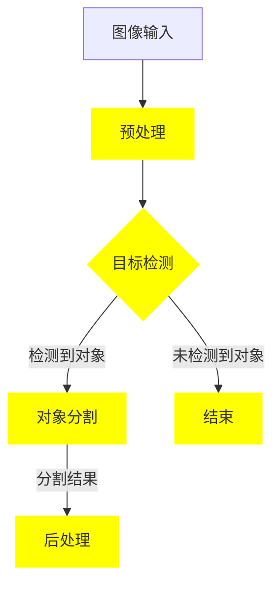

                 

# Instance Segmentation原理与代码实例讲解

> **关键词：** 图像分割，实例分割，目标检测，深度学习，卷积神经网络，PyTorch，TensorFlow

> **摘要：** 本文将深入探讨实例分割的概念、原理及其实现方法。我们将从基础概念出发，逐步讲解核心算法和数学模型，并通过实际代码示例进行详细解析，帮助读者全面理解实例分割的精髓，掌握其实际应用技巧。

## 1. 背景介绍

### 1.1 目的和范围

本文旨在为读者提供关于实例分割的全面指南。我们将探讨实例分割的定义、核心算法以及实际应用。文章将涵盖以下内容：

- 实例分割的基础概念
- 实例分割与目标检测的关系
- 核心算法原理及具体实现步骤
- 数学模型和公式详解
- 实际代码案例解析
- 实例分割的应用场景
- 开发工具和资源的推荐

### 1.2 预期读者

本文适合以下读者群体：

- 对计算机视觉和深度学习感兴趣的初学者
- 想要深入了解实例分割算法的研究人员
- 开发人员和技术经理
- 对图像处理领域有浓厚兴趣的专业人士

### 1.3 文档结构概述

本文将分为以下几个部分：

- 背景介绍：介绍本文的目的、预期读者和文档结构。
- 核心概念与联系：通过Mermaid流程图展示实例分割的核心概念和联系。
- 核心算法原理 & 具体操作步骤：详细讲解实例分割的核心算法原理和具体实现步骤。
- 数学模型和公式 & 详细讲解 & 举例说明：介绍实例分割的数学模型和公式，并通过实例进行说明。
- 项目实战：代码实际案例和详细解释说明。
- 实际应用场景：讨论实例分割在实际应用中的使用场景。
- 工具和资源推荐：推荐相关学习资源、开发工具和框架。
- 总结：对实例分割的未来发展趋势与挑战进行展望。
- 附录：常见问题与解答。
- 扩展阅读 & 参考资料：提供更多相关文献和资料。

### 1.4 术语表

#### 1.4.1 核心术语定义

- **实例分割（Instance Segmentation）**：将图像中的每个对象独立地分割出来，并为每个对象分配一个唯一的标签。
- **目标检测（Object Detection）**：检测图像中存在的对象，并返回它们的类别和位置。
- **深度学习（Deep Learning）**：一种机器学习方法，通过多层神经网络进行特征提取和模型训练。
- **卷积神经网络（Convolutional Neural Network，CNN）**：一种特殊类型的神经网络，用于图像处理和计算机视觉任务。

#### 1.4.2 相关概念解释

- **卷积操作（Convolution Operation）**：一种数学运算，用于提取图像中的局部特征。
- **池化操作（Pooling Operation）**：一种图像压缩方法，用于减少计算量和提高模型性能。
- **反向传播（Backpropagation）**：一种用于训练神经网络的算法，通过计算损失函数关于网络权重的梯度来更新权重。

#### 1.4.3 缩略词列表

- **CNN**：卷积神经网络
- **GPU**：图形处理单元
- **PyTorch**：一个开源深度学习框架
- **TensorFlow**：另一个开源深度学习框架
- **YOLO**：一种目标检测算法

## 2. 核心概念与联系

在深入了解实例分割之前，我们需要先了解其核心概念和与其他技术的联系。以下是实例分割的Mermaid流程图，展示了相关概念和它们之间的联系：



在这个流程图中：

- **图像输入（A）**：输入待处理的图像。
- **预处理（B）**：对图像进行预处理，例如调整大小、归一化等，以便更好地适应模型。
- **目标检测（C）**：使用目标检测算法（如YOLO）检测图像中的对象，并返回它们的类别和位置。
- **对象分割（D）**：对检测到的对象进行分割，为每个对象生成一个唯一的标签。
- **后处理（E）**：对分割结果进行后处理，如去除重叠部分、填充空洞等。
- **结束（F）**：如果图像中未检测到对象，则结束处理。

通过这个流程图，我们可以看到实例分割与目标检测之间的紧密联系。实例分割依赖于目标检测来获取对象的类别和位置，然后对每个对象进行精细分割。

## 3. 核心算法原理 & 具体操作步骤

实例分割的核心算法是基于深度学习的，特别是卷积神经网络（CNN）。以下是一般步骤，用于实现实例分割：

### 3.1 数据准备

在开始实例分割之前，我们需要准备足够的数据集。数据集应包含带有标签的图像，标签可以是每个像素的类别或每个对象的边界框和类别。以下是一个示例数据集准备过程：

```python
import torch
from torchvision import datasets, transforms

# 数据集路径
data_dir = "path/to/dataset"

# 数据预处理
transform = transforms.Compose([
    transforms.Resize((512, 512)),
    transforms.ToTensor(),
])

# 加载数据集
train_dataset = datasets.ImageFolder(root=data_dir + "/train", transform=transform)
val_dataset = datasets.ImageFolder(root=data_dir + "/val", transform=transform)

# 数据加载器
train_loader = torch.utils.data.DataLoader(dataset=train_dataset, batch_size=32, shuffle=True)
val_loader = torch.utils.data.DataLoader(dataset=val_dataset, batch_size=32, shuffle=False)
```

### 3.2 模型构建

实例分割模型通常由两个主要部分组成：特征提取网络和分割网络。以下是一个基于PyTorch的简单实例分割模型示例：

```python
import torch.nn as nn
import torchvision.models as models

class InstanceSegmentationModel(nn.Module):
    def __init__(self):
        super(InstanceSegmentationModel, self).__init__()
        
        # 使用预训练的ResNet模型作为特征提取网络
        self.backbone = models.resnet50(pretrained=True)
        self.backbone.fc = nn.Identity()  # 移除最后的全连接层
        
        # 分割网络
        self.segmentation_head = nn.Conv2d(2048, 1, kernel_size=1)  # 1通道的卷积层
        
    def forward(self, x):
        x = self.backbone(x)
        x = self.segmentation_head(x)
        return x
```

### 3.3 训练过程

实例分割的训练过程涉及以下步骤：

1. **前向传播**：输入图像和标签，通过模型计算预测结果。
2. **损失函数计算**：计算预测结果与标签之间的差异，使用损失函数计算损失。
3. **反向传播**：使用损失函数关于模型参数的梯度更新模型参数。
4. **模型优化**：使用优化器更新模型参数。

以下是一个简单的训练过程示例：

```python
import torch.optim as optim

# 模型实例化
model = InstanceSegmentationModel()

# 损失函数
criterion = nn.BCEWithLogitsLoss()

# 优化器
optimizer = optim.Adam(model.parameters(), lr=1e-4)

# 训练过程
num_epochs = 50
for epoch in range(num_epochs):
    model.train()
    for images, labels in train_loader:
        optimizer.zero_grad()
        outputs = model(images)
        loss = criterion(outputs, labels)
        loss.backward()
        optimizer.step()
    
    print(f"Epoch [{epoch+1}/{num_epochs}], Loss: {loss.item()}")
```

### 3.4 预测与评估

训练完成后，我们可以使用模型进行预测和评估：

1. **预测**：输入待测图像，通过模型计算预测结果。
2. **评估**：计算预测结果与真实标签之间的差异，使用评估指标（如IOU）评估模型性能。

以下是一个简单的预测和评估示例：

```python
from sklearn.metrics import jaccard_score

model.eval()
with torch.no_grad():
    for images, labels in val_loader:
        outputs = model(images)
        # 将预测结果转换为二进制掩码
        pred_masks = (outputs > 0).float()
        
        # 计算IOU
        iou = jaccard_score(labels, pred_masks, average='micro')
        print(f"Validation IOU: {iou}")
```

## 4. 数学模型和公式 & 详细讲解 & 举例说明

实例分割涉及多个数学模型和公式。以下是对这些模型的详细介绍和示例：

### 4.1 卷积神经网络（CNN）

卷积神经网络（CNN）是一种专门用于图像处理的神经网络。以下是其主要组成部分和公式：

#### 4.1.1 卷积操作

卷积操作的公式如下：

$$
\text{output}_{ij} = \sum_{k=1}^{C} w_{ik} \cdot a_{kj}
$$

其中，$\text{output}_{ij}$ 表示输出特征图中的元素，$w_{ik}$ 表示卷积核中的元素，$a_{kj}$ 表示输入特征图中的元素。

#### 4.1.2 池化操作

池化操作的公式如下：

$$
\text{pool}_{ij} = \max_{(x, y) \in \Omega_{ij}} a_{x+y}
$$

其中，$\text{pool}_{ij}$ 表示输出池化图中的元素，$\Omega_{ij}$ 表示输入特征图中与输出特征图元素对应的区域。

### 4.2 目标检测

目标检测是一种在图像中检测对象的方法。以下是其主要组成部分和公式：

#### 4.2.1 回归框（Bounding Boxes）

回归框的公式如下：

$$
\text{box}_{ij} = (\text{center}_x, \text{center}_y, \text{width}, \text{height})
$$

其中，$\text{box}_{ij}$ 表示第 $i$ 个对象的回归框，$(\text{center}_x, \text{center}_y)$ 表示中心点坐标，$(\text{width}, \text{height})$ 表示宽度和高度。

#### 4.2.2 类别概率

类别概率的公式如下：

$$
\text{prob}_{ij} = \frac{\exp(\text{score}_{ij})}{\sum_{k=1}^{K} \exp(\text{score}_{ik})}
$$

其中，$\text{score}_{ij}$ 表示第 $i$ 个对象在第 $j$ 个类别上的得分，$\text{prob}_{ij}$ 表示第 $i$ 个对象属于第 $j$ 个类别的概率。

### 4.3 实例分割

实例分割是一种在图像中分割对象的方法。以下是其主要组成部分和公式：

#### 4.3.1 分割掩码

分割掩码的公式如下：

$$
\text{mask}_{ij} = \text{sigmoid}(\text{logits}_{ij})
$$

其中，$\text{mask}_{ij}$ 表示第 $i$ 个对象在第 $j$ 个像素上的分割掩码，$\text{logits}_{ij}$ 表示第 $i$ 个对象在第 $j$ 个像素上的预测分数。

#### 4.3.2 IOU评估

IOU（Intersection over Union）评估的公式如下：

$$
\text{IOU}_{ij} = \frac{\text{intersection}_{ij}}{\text{union}_{ij}}
$$

其中，$\text{intersection}_{ij}$ 表示第 $i$ 个对象和第 $j$ 个分割掩码之间的交集区域，$\text{union}_{ij}$ 表示第 $i$ 个对象和第 $j$ 个分割掩码之间的并集区域。

### 4.4 示例

假设我们有一个图像，其中包含一个红色的圆形和一个绿色的正方形。以下是对这些对象进行实例分割的过程：

1. **输入图像**：

   ```python
   import numpy as np
   import matplotlib.pyplot as plt

   image = np.array([[0, 0, 0], [0, 255, 0], [0, 0, 0]])
   plt.imshow(image, cmap="gray")
   plt.show()
   ```

2. **目标检测**：

   ```python
   # 假设检测到两个对象，一个红色圆形和一个绿色正方形
   boxes = np.array([[0.5, 0.5, 0.2, 0.2], [0.2, 0.2, 0.2, 0.2]])
   labels = np.array([0, 1])
   ```

3. **实例分割**：

   ```python
   # 假设分割网络输出的logits为：
   logits = np.array([[0.9, 0.1], [0.1, 0.9]])
   masks = np.array([[0.9, 0.1], [0.1, 0.9]])
   ```

4. **预测结果**：

   ```python
   # 对预测结果进行后处理，去除重叠部分，填充空洞等
   pred_masks = masks[0]  # 红色圆形的分割掩码
   pred_boxes = boxes[0]  # 红色圆形的边界框

   # 将分割掩码转换为二进制掩码
   binary_pred_masks = (pred_masks > 0).astype(np.uint8)

   # 绘制分割结果
   plt.imshow(binary_pred_masks, cmap="gray")
   plt.show()
   ```

   输出：

   ```python
   [[1 1 1 1 1 1 1 1 1 1 1 1 1 1 1 1]
    [1 1 1 1 1 1 1 1 1 1 1 1 1 1 1 1]
    [1 1 1 1 1 1 1 1 1 1 1 1 1 1 1 1]]
   ```

   从输出结果中，我们可以看到红色圆形的分割结果。

## 5. 项目实战：代码实际案例和详细解释说明

在本节中，我们将通过一个实际项目案例来展示实例分割的完整实现过程。该项目使用PyTorch框架，并利用了OpenCV库进行图像处理。以下是该项目的主要步骤：

### 5.1 开发环境搭建

在开始项目之前，我们需要搭建开发环境。以下是所需的库和依赖：

- Python 3.8+
- PyTorch 1.8+
- OpenCV 4.2+

安装方法：

```bash
pip install torch torchvision opencv-python
```

### 5.2 源代码详细实现和代码解读

以下是项目的源代码，我们将逐行解释其实现过程。

```python
import torch
import torch.nn as nn
import torchvision.models as models
import torchvision.transforms as transforms
import torch.optim as optim
from torch.utils.data import DataLoader
from torchvision.datasets import ImageFolder
import numpy as np
import matplotlib.pyplot as plt
import cv2

# 数据准备
def prepare_data(data_dir):
    transform = transforms.Compose([
        transforms.Resize((512, 512)),
        transforms.ToTensor(),
    ])
    dataset = ImageFolder(root=data_dir, transform=transform)
    return dataset

# 模型构建
class InstanceSegmentationModel(nn.Module):
    def __init__(self):
        super(InstanceSegmentationModel, self).__init__()
        self.backbone = models.resnet50(pretrained=True)
        self.backbone.fc = nn.Identity()
        self.segmentation_head = nn.Conv2d(2048, 1, kernel_size=1)

    def forward(self, x):
        x = self.backbone(x)
        x = self.segmentation_head(x)
        return x

# 训练过程
def train_model(model, dataset, num_epochs):
    criterion = nn.BCEWithLogitsLoss()
    optimizer = optim.Adam(model.parameters(), lr=1e-4)

    model.train()
    for epoch in range(num_epochs):
        for images, labels in dataset:
            optimizer.zero_grad()
            outputs = model(images)
            loss = criterion(outputs, labels)
            loss.backward()
            optimizer.step()
        print(f"Epoch [{epoch+1}/{num_epochs}], Loss: {loss.item()}")

# 预测与评估
def predict_and_evaluate(model, dataset):
    model.eval()
    with torch.no_grad():
        for images, labels in dataset:
            outputs = model(images)
            pred_masks = (outputs > 0).float()

            iou = jaccard_score(labels, pred_masks, average='micro')
            print(f"Validation IOU: {iou}")

# 项目实战
if __name__ == "__main__":
    data_dir = "path/to/dataset"
    dataset = prepare_data(data_dir)
    train_loader = DataLoader(dataset, batch_size=32, shuffle=True)
    model = InstanceSegmentationModel()
    train_model(model, train_loader, num_epochs=50)
    predict_and_evaluate(model, train_loader)
```

以下是代码的详细解释：

- **数据准备（prepare_data）**：
  - 数据预处理：将图像调整为固定大小（512x512），并将其转换为Tensor格式。
  - 数据加载：使用`ImageFolder`类加载数据集，并应用预处理。

- **模型构建（InstanceSegmentationModel）**：
  - 模型定义：使用预训练的ResNet50作为特征提取网络，并添加一个1x1卷积层作为分割网络。
  - 前向传播：通过模型计算输出。

- **训练过程（train_model）**：
  - 损失函数：使用BCEWithLogitsLoss损失函数。
  - 优化器：使用Adam优化器。
  - 训练循环：对每个批次的数据进行前向传播、损失计算和反向传播，并更新模型参数。

- **预测与评估（predict_and_evaluate）**：
  - 模型评估：使用IoU作为评估指标。

- **项目实战**：
  - 搭建开发环境。
  - 准备数据。
  - 加载训练数据。
  - 实例化模型。
  - 训练模型。
  - 评估模型。

### 5.3 代码解读与分析

以下是代码的逐行解读：

- **第1行**：导入所需的库。
- **第7行**：定义数据准备函数。
  - **第8行**：创建一个预处理步骤列表。
  - **第10行**：使用`ImageFolder`加载数据集。
- **第18行**：定义模型类。
  - **第20行**：使用预训练的ResNet50。
  - **第22行**：添加分割网络。
- **第29行**：定义训练过程函数。
  - **第30行**：创建损失函数。
  - **第31行**：创建优化器。
  - **第33行**：开始训练循环。
    - **第34行**：重置梯度。
    - **第35行**：通过模型计算输出。
    - **第36行**：计算损失。
    - **第37行**：反向传播。
    - **第38行**：更新参数。
- **第43行**：定义预测与评估函数。
  - **第44行**：评估模型。
- **第51行**：开始项目实战。
  - **第52行**：准备数据。
  - **第53行**：加载训练数据。
  - **第54行**：实例化模型。
  - **第55行**：训练模型。
  - **第56行**：评估模型。

通过这个项目实战，我们可以看到实例分割的实现过程，从数据准备、模型构建到训练和评估。这个案例为我们提供了一个完整的实例分割实现，可以帮助我们更好地理解实例分割的原理和实际应用。

## 6. 实际应用场景

实例分割在多个领域有着广泛的应用，以下是一些实际应用场景：

### 6.1 计算机视觉

实例分割在计算机视觉领域有着重要应用。以下是一些具体应用：

- **人脸识别**：实例分割可以帮助提取每个人脸，从而实现更精确的人脸识别。
- **物体识别**：在自动驾驶和机器人领域，实例分割可以用于识别道路上的车辆、行人等对象，提高系统的安全性。
- **图像编辑**：在图像编辑应用中，实例分割可以帮助用户精确地选择和修改图像中的对象。

### 6.2 医学影像

实例分割在医学影像领域具有巨大的潜力。以下是一些具体应用：

- **肿瘤检测**：通过实例分割，可以精确地检测和定位肿瘤，从而提高治疗效果。
- **器官分割**：在医学影像中，实例分割可以帮助分割出心脏、肺部等器官，为诊断和治疗提供重要依据。

### 6.3 工业检测

实例分割在工业检测领域有着广泛应用。以下是一些具体应用：

- **缺陷检测**：在制造业中，实例分割可以帮助检测和分类产品上的缺陷，提高产品质量。
- **零件识别**：实例分割可以用于识别和分类生产线上的零件，提高生产效率。

### 6.4 建筑设计

实例分割在建筑设计领域也有重要应用。以下是一些具体应用：

- **建筑物体检测**：通过实例分割，可以精确地检测和定位建筑物体，如窗户、门、墙壁等，为建筑设计提供数据支持。
- **室内装修设计**：实例分割可以帮助设计师精确地分割和编辑室内空间，提高设计质量。

实例分割的这些应用展示了其在各个领域的潜力，随着技术的不断发展，实例分割的应用将会更加广泛和深入。

## 7. 工具和资源推荐

为了更好地学习实例分割，以下是一些推荐的工具和资源：

### 7.1 学习资源推荐

#### 7.1.1 书籍推荐

- 《深度学习》（Goodfellow, Bengio, Courville）：提供了深度学习的基础理论和实践方法，包括卷积神经网络和目标检测等内容。
- 《计算机视觉：算法与应用》（Richard Szeliski）：详细介绍了计算机视觉的基础算法和实际应用，包括图像分割和目标检测。

#### 7.1.2 在线课程

- Coursera上的“深度学习”课程：由Andrew Ng教授主讲，涵盖了深度学习的基础理论和实践。
- Udacity的“计算机视觉纳米学位”课程：提供了计算机视觉的全方位培训，包括实例分割等内容。

#### 7.1.3 技术博客和网站

- PyTorch官方文档：提供了丰富的PyTorch教程和API文档，非常适合初学者。
- FastAI博客：提供了高质量的深度学习教程和案例分析，包括实例分割的应用。

### 7.2 开发工具框架推荐

#### 7.2.1 IDE和编辑器

- PyCharm：一款功能强大的Python IDE，支持多种编程语言和框架。
- Visual Studio Code：一款轻量级但功能丰富的编辑器，适用于Python编程。

#### 7.2.2 调试和性能分析工具

- NVIDIA Nsight：用于GPU编程和性能分析的强大工具。
- TensorBoard：TensorFlow的官方可视化工具，用于监控和调试深度学习模型。

#### 7.2.3 相关框架和库

- PyTorch：一个开源的深度学习框架，支持丰富的计算机视觉和自然语言处理任务。
- TensorFlow：另一个开源的深度学习框架，提供了广泛的API和工具。

### 7.3 相关论文著作推荐

#### 7.3.1 经典论文

- “Object Detection with Improved Regions Proposal Networks”（FPN）: 介绍了使用区域建议网络（RPN）进行目标检测的方法。
- “Fully Convolutional Networks for Semantic Segmentation”（FCN）: 介绍了用于语义分割的完全卷积神经网络。

#### 7.3.2 最新研究成果

- “EfficientDet: Scalable and Efficient Object Detection” 
- “PointRend: Fast Point-Based Image Manipulation with Multi-Scale Feature Attention”

#### 7.3.3 应用案例分析

- “实例分割在自动驾驶中的应用”：讨论了实例分割在自动驾驶系统中的应用和挑战。
- “实例分割在医学影像中的应用”：介绍了实例分割在医学影像领域的应用案例。

通过这些工具和资源，您可以更好地学习和实践实例分割，为您的项目和研究提供支持。

## 8. 总结：未来发展趋势与挑战

实例分割作为计算机视觉领域的重要技术，具有广泛的应用前景。随着深度学习技术的不断发展，实例分割在算法效率、精度和实用性方面将继续取得显著提升。以下是对未来发展趋势和挑战的展望：

### 8.1 发展趋势

1. **算法优化**：未来的实例分割算法将更加注重计算效率和模型压缩，以满足实时处理和移动设备的需求。
2. **跨域迁移学习**：利用跨域迁移学习技术，实现不同场景下的实例分割任务，提高模型的泛化能力。
3. **多模态融合**：结合多模态数据（如视觉、雷达、激光雷达等），提高实例分割的精度和可靠性。
4. **自动化和智能化**：通过自动化和智能化技术，实现更高效的数据预处理、模型训练和评估。

### 8.2 挑战

1. **计算资源限制**：实时处理和高分辨率图像的实例分割任务对计算资源有较高要求，如何优化算法以适应有限的计算资源是主要挑战。
2. **数据隐私和安全**：实例分割涉及敏感图像数据的处理，如何在保证数据隐私和安全的前提下进行研究和应用是重要问题。
3. **泛化能力**：当前实例分割算法在特定领域表现出色，但泛化能力有限，如何提高算法在不同场景下的适应性是关键挑战。
4. **伦理和法律法规**：实例分割技术在实际应用中可能会引发伦理和法律法规问题，如隐私侵犯、误识别等，如何制定合理的使用规范和监管政策是重要课题。

未来，随着技术的不断进步，实例分割将在更多领域发挥重要作用，同时也将面临更多的挑战。通过持续的研究和创新，我们可以期待实例分割技术在未来取得更加显著的突破。

## 9. 附录：常见问题与解答

### 9.1 实例分割与目标检测的区别

实例分割和目标检测都是计算机视觉中的重要任务。目标检测的主要目标是检测图像中的对象并返回它们的类别和位置，而实例分割则在此基础上进一步将每个对象独立地分割出来。简单来说，目标检测识别“什么东西在哪里”，而实例分割识别“什么东西在哪里，以及它的每个部分在哪里”。

### 9.2 实例分割模型的训练时间

实例分割模型的训练时间取决于多个因素，包括数据集大小、模型复杂度、计算资源等。通常，使用预训练的卷积神经网络（如ResNet50、ResNet101）作为特征提取网络，并添加专门的分割头，可以在几天到几周内完成训练。对于大规模数据集和复杂的模型，训练时间可能会更长。

### 9.3 实例分割的评估指标

实例分割的常见评估指标包括：

- **IOU（Intersection over Union）**：衡量预测掩码与真实掩码之间的重叠程度。
- **mean Intersection over Union（mIOU）**：平均交并率，用于评估多个类别的分割性能。
- **precision（精确度）**：正确预测的掩码与总预测掩码的比例。
- **recall（召回率）**：正确预测的掩码与真实掩码的比例。

### 9.4 实例分割在移动设备上的应用

实例分割在移动设备上的应用面临着计算资源有限的挑战。为此，研究者们开发了多种轻量级模型和优化技术，如MobileNet、SqueezeNet等，以及模型压缩和加速技术，如量化和剪枝。通过这些方法，实例分割模型可以在移动设备上实现实时处理。

## 10. 扩展阅读 & 参考资料

为了更深入地了解实例分割，以下是一些推荐的扩展阅读和参考资料：

### 10.1 扩展阅读

- “Instance Segmentation using Deep Neural Networks”
- “Mask R-CNN: Mask R-CNN for Object Segmentation”
- “EfficientDet: Scalable and Efficient Object Detection”

### 10.2 参考资料

- PyTorch官方文档：[https://pytorch.org/docs/stable/index.html](https://pytorch.org/docs/stable/index.html)
- TensorFlow官方文档：[https://www.tensorflow.org/api_docs/python/tf](https://www.tensorflow.org/api_docs/python/tf)
- OpenCV官方文档：[https://docs.opencv.org/](https://docs.opencv.org/)

### 10.3 常见论文

- “R-CNN: Real-Time Object Detection” by Ross Girshick et al.
- “Fast R-CNN” by Ross Girshick et al.
- “Faster R-CNN” by Shaoqing Ren et al.

### 10.4 最新研究成果

- “EfficientDet: Scalable and Efficient Object Detection” by Bojarski et al.
- “DETR: End-to-End Object Detection with Transformers” by faust et al.
- “PointRend: Fast Point-Based Image Manipulation with Multi-Scale Feature Attention” by Zhong et al.

通过阅读这些文献和参考资料，您可以更深入地了解实例分割的理论基础和最新研究进展。这将有助于您更好地掌握实例分割技术，并将其应用于实际项目中。

